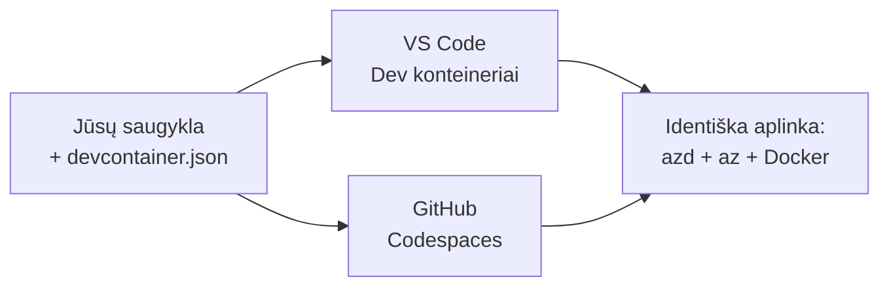

# Dev konteineriai ir GitHub Codespaces skirti azd

**Skyriaus naršymas:**
- **📚 Course Home**: [AZD For Beginners](../../README.md)
- **📖 Current Chapter**: Chapter 1 - Foundation & Quick Start
- **⬅️ Previous**: [Bring Your Own App](bring-your-own-app.md)
- **🚀 Next Chapter**: [Chapter 2: AI-First Development](../chapter-02-ai-development/README.md)

> Patikrinta su `azd 1.25.6` 2026 m. birželį.

## Įvadas

Įdiegti azd, tinkamą programavimo kalbos vykdymo aplinką, Docker ir Azure CLI kiekviename kompiuteryje yra varginantis darbas — ir tai yra pagrindinė priežastis, dėl kurios pamoka, kuri „veikia mano mašinoje“, gali neveikti pas kažką kito. Dev konteineris tai išsprendžia aprašydamas visą jūsų įrankių grandinę faile. Kiekvienas, kuris atidaro projektą VS Code arba GitHub Codespaces, gauna lygiai tokį patį aplinką, su jau įdiegtu azd. Ši pamoka parodo, kaip tokį pridėti.

## Mokymosi tikslai

Baigę šią pamoką jūs:
- Suprasite, kas yra dev konteineris ir kodėl jis padeda su azd
- Pridėsite minimalų `.devcontainer/devcontainer.json` prie projekto
- Įtrauksite azd, Azure CLI ir Docker per Dev Container *funkcijas*
- Atidarysite projektą GitHub Codespaces arba VS Code

## Mokymosi rezultatai

Atlikę šią pamoką galėsite:
- Parašyti `devcontainer.json` azd projektui
- Pridėti azd ir Azure įrankius be rankinių diegimų
- Vykdyti `azd up` iš konteinerio arba Codespace

---

## Kas yra dev konteineris?

Dev konteineris yra Docker pagrindu sukurta vystymo aplinka, apibrėžta `.devcontainer/devcontainer.json` faile jūsų saugykloje. Kai atidarote projektą:

- **VS Code** (su Dev Containers plėtiniu) sukuria konteinerį ir prisijungia prie jo.
- **GitHub Codespaces** sukuria tą patį konteinerį debesyje ir suteikia naršyklėje veikiantį redaktorių.

Bet kuriuo atveju kiekvienas prisidėjusysis gauna identiškus įrankius — be „ar įdiegėte azd?“ aiškinimosi.



---

## 1 žingsnis: Sukurkite devcontainer failą

Sukurkite `.devcontainer/devcontainer.json` jūsų projekto šaknyje:

```json
{
  "name": "azd-project",
  "image": "mcr.microsoft.com/devcontainers/base:bookworm",
  "features": {
    "ghcr.io/devcontainers/features/azure-cli:1": {},
    "ghcr.io/azure/azure-dev/azd:latest": {},
    "ghcr.io/devcontainers/features/docker-in-docker:2": {},
    "ghcr.io/devcontainers/features/node:1": {}
  },
  "customizations": {
    "vscode": {
      "extensions": [
        "ms-azuretools.azure-dev",
        "ms-azuretools.vscode-bicep"
      ]
    }
  },
  "forwardPorts": [3000],
  "postCreateCommand": "azd version"
}
```

Ką daro kiekviena dalis:

| Key | Purpose |
|-----|---------|
| `image` | Bazinė operacinė sistema konteineriui |
| `features` | Iš anksto paruošti diegimo moduliai — čia: Azure CLI, **azd**, Docker ir Node.js |
| `customizations.vscode.extensions` | Automatiškai įdiegia azd ir Bicep VS Code plėtinius |
| `forwardPorts` | Atskleidžia jūsų programos prievadą naršyklei |
| `postCreateCommand` | Vykdomas vieną kartą po konteinerio sukūrimo (čia, patikrinimas) |

> `ghcr.io/azure/azure-dev/azd:latest` funkcija yra oficialus būdas gauti azd konteineryje. Jei reikia atkuriamumo, nurodykite konkretų versijos žymeklį (pavyzdžiui `azd:1.25.6`).

---

## 2 žingsnis: Suderinkite funkciją su jūsų programos kalba

Pakeiskite `node` funkciją į tą, kuria naudojasi jūsų programa:

```jsonc
// Python project
"ghcr.io/devcontainers/features/python:1": {},

// .NET project
"ghcr.io/devcontainers/features/dotnet:2": {},

// Java project
"ghcr.io/devcontainers/features/java:1": {},

// Go project
"ghcr.io/devcontainers/features/go:1": {}
```

Palikite `docker-in-docker`, jei jūsų `host` yra `containerapp`, `aks` arba bet kas, kas kuria konteinerio vaizdą — azd reikia Docker, kad statytų ir įkeltų vaizdus.

---

## 3 žingsnis: Atidarykite jį

**VS Code:**
1. Įdiekite plėtinį **Dev Containers**.
2. Atidarykite projekto aplanką.
3. Spustelėkite **Reopen in Container** kai bus prašoma (arba paleiskite *Dev Containers: Reopen in Container*).

**GitHub Codespaces:**
1. Išstumkite repo į GitHub.
2. Spustelėkite **Code → Codespaces → Create codespace on main**.
3. Palaukite, kol konteineris bus sukurtas — azd bus paruoštas terminale.

---

## 4 žingsnis: Diegti iš konteinerio

Konteineryje azd jau būna įdiegtas, todėl įprasta eiga tiesiog veikia:

```bash
azd auth login --use-device-code   # Įrenginio kodas yra naudingas Codespaces aplinkoje
azd up
```

> **Kodėl `--use-device-code`?** Nuotoliniame konteineryje arba Codespace nėra vietinio naršyklės, į kurią būtų galima peradresuoti, todėl device-code prisijungimas yra patikimiausias kelias. Jūs įklijuosite kodą į naršyklės skirtuką, kad užbaigtumėte prisijungimą.

---

## Dažnos problemos

| Pitfall | Fix |
|---------|-----|
| `azd up` can't build an image | Pridėkite `docker-in-docker` funkciją |
| Browser login hangs in Codespaces | Naudokite `azd auth login --use-device-code` |
| Tools differ between teammates | Užfiksuokite funkcijų versijas (pvz. `azd:1.25.6`) |
| App not reachable in browser | Pridėkite prievadą į `forwardPorts` |

---

## Santrauka

- Dev konteineris daro jūsų azd įrankių grandinę atkuriamą visiems.
- Pridėkite azd, Azure CLI ir Docker per Dev Container *funkcijas*.
- Suderinkite kalbos funkciją su savo programa ir palikite `docker-in-docker` konteinerių talpinimui.
- Naudokite device-code prisijungimą, kai veikiate Codespaces.

---

## 🔗 Navigacija

| Direction | Resource |
|-----------|----------|
| **Previous** | [Bring Your Own App](bring-your-own-app.md) |
| **Chapter Home** | [Chapter 1: Foundation & Quick Start](README.md) |
| **Next Chapter** | [Chapter 2: AI-First Development](../chapter-02-ai-development/README.md) |

## 📖 Susiję ištekliai

- [Installation & Setup](installation.md)
- [Command Cheat Sheet](../../resources/cheat-sheet.md)
- [Oficiali Dev Containers specifikacija](https://containers.dev/)
- [azd Dev Container feature](https://github.com/Azure/azure-dev/tree/main/ext/devcontainer)

---

<!-- CO-OP TRANSLATOR DISCLAIMER START -->
**Atsakomybės apribojimas**:
Šis dokumentas buvo išverstas naudojant dirbtinio intelekto vertimo paslaugą [Co-op Translator](https://github.com/Azure/co-op-translator). Nors siekiame tikslumo, prašome atkreipti dėmesį, kad automatiniai vertimai gali turėti klaidų ar netikslumų. Originalus dokumentas jo gimtąja kalba laikomas autoritetingu šaltiniu. Svarbiai informacijai rekomenduojama naudoti profesionalų žmogiškąjį vertimą. Mes neatsakome už jokius nesusipratimus ar neteisingą interpretaciją, kilusią naudojantis šiuo vertimu.
<!-- CO-OP TRANSLATOR DISCLAIMER END -->