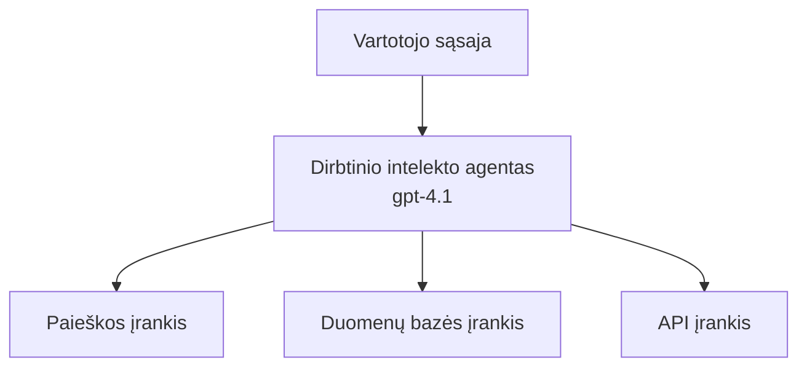
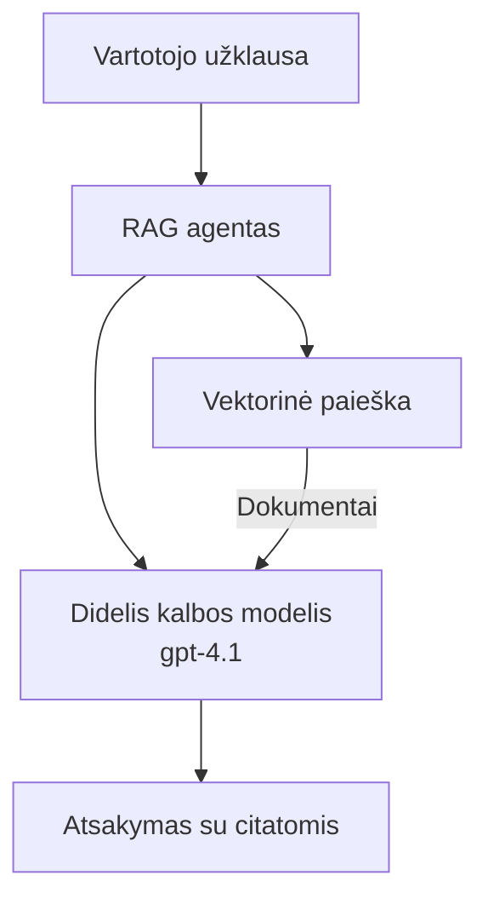
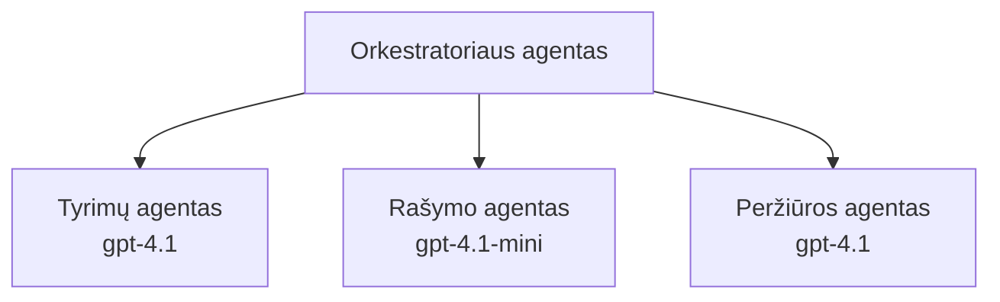

# AI Agents with Azure Developer CLI

**Chapter Navigation:**
- **📚 Course Home**: [AZD For Beginners](../../README.md)
- **📖 Current Chapter**: Chapter 2 - AI-First Development
- **⬅️ Previous**: [Microsoft Foundry Integration](microsoft-foundry-integration.md)
- **➡️ Next**: [AI Model Deployment](ai-model-deployment.md)
- **🚀 Advanced**: [Multi-Agent Solutions](../../examples/retail-scenario.md)

---

## Introduction

AI agentai yra autonominės programos, galinčios suvokti savo aplinką, priimti sprendimus ir atlikti veiksmus siekiant konkrečių tikslų. Skirtingai nei paprasti pokalbių robotai, kurie atsako į užklausas, agentai gali:

- **Naudoti įrankius** - kviesti API, ieškoti duomenų bazių, vykdyti kodą
- **Planuoti ir mąstyti** - suskaidyti sudėtingas užduotis į žingsnius
- **Mokytis iš konteksto** - išlaikyti atmintį ir adaptuoti elgesį
- **Bendradarbiauti** - dirbti su kitais agentais (daugiagentės sistemos)

Šis vadovas parodo, kaip diegti AI agentus į Azure naudojant Azure Developer CLI (azd).

> **Validation note (2026-03-25):** Šis vadovas buvo peržiūrėtas su `azd` `1.23.12` ir `azure.ai.agents` `0.1.18-preview`. `azd ai` patirtis vis dar yra peržiūros stadijoje, todėl patikrinkite plėtinio pagalbą, jei jūsų įdiegtos parinktys skiriasi.

## Learning Goals

Baigę šį vadovą, jūs:
- Suprasite, kas yra AI agentai ir kuo jie skiriasi nuo pokalbių robotų
- Išdiegsite iš anksto paruoštus AI agentų šablonus su AZD
- Sukonfigūruosite Foundry agentus pritaikytoms agentų versijoms
- Įgyvendinsite pagrindinius agentų modelius (įrankų naudojimas, RAG, daugiagentė sistema)
- Stebėsite ir derinsite diegiamus agentus

## Learning Outcomes

Baigę kursą galėsite:
- Vienu komandu diegti AI agentų programas į Azure
- Sukonfigūruoti agentų įrankius ir galimybes
- Įgyvendinti retrieval-augmented generation (RAG) su agentais
- Kurti daugiagentės architektūras sudėtingiems darbo srautams
- Spręsti dažniausias agentų diegimo problemas

---

## 🤖 What Makes an Agent Different from a Chatbot?

| Feature | Chatbot | AI Agent |
|---------|---------|----------|
| **Behavior** | Responds to prompts | Takes autonomous actions |
| **Tools** | None | Can call APIs, search, execute code |
| **Memory** | Session-based only | Persistent memory across sessions |
| **Planning** | Single response | Multi-step reasoning |
| **Collaboration** | Single entity | Can work with other agents |

### Simple Analogy

- **Chatbot** = A helpful person answering questions at an information desk
- **AI Agent** = A personal assistant who can make calls, book appointments, and complete tasks for you

---

## 🚀 Quick Start: Deploy Your First Agent

### Option 1: Foundry Agents Template (Recommended)

```bash
# Inicializuoti dirbtinio intelekto agentų šabloną
azd init --template get-started-with-ai-agents

# Diegti į Azure
azd up
```

**What gets deployed:**
- ✅ Foundry Agents
- ✅ Microsoft Foundry Models (gpt-4.1)
- ✅ Azure AI Search (for RAG)
- ✅ Azure Container Apps (web interface)
- ✅ Application Insights (monitoring)

**Time:** ~15-20 minutes
**Cost:** ~$100-150/month (development)

### Option 2: OpenAI Agent with Prompty

```bash
# Inicializuoti Prompty pagrįstą agento šabloną
azd init --template agent-openai-python-prompty

# Diegti į Azure
azd up
```

**What gets deployed:**
- ✅ Azure Functions (serverless agent execution)
- ✅ Microsoft Foundry Models
- ✅ Prompty configuration files
- ✅ Sample agent implementation

**Time:** ~10-15 minutes
**Cost:** ~$50-100/month (development)

### Option 3: RAG Chat Agent

```bash
# Inicializuoti RAG pokalbio šabloną
azd init --template azure-search-openai-demo

# Diegti į Azure
azd up
```

**What gets deployed:**
- ✅ Microsoft Foundry Models
- ✅ Azure AI Search with sample data
- ✅ Document processing pipeline
- ✅ Chat interface with citations

**Time:** ~15-25 minutes
**Cost:** ~$80-150/month (development)

### Option 4: AZD AI Agent Init (Manifest- or Template-Based Preview)

If you have an agent manifest file, you can use the `azd ai` command to scaffold a Foundry Agent Service project directly. Recent preview releases also added template-based initialization support, so the exact prompt flow may differ slightly depending on your installed extension version.

```bash
# Įdiekite AI agentų plėtinį
azd extension install azure.ai.agents

# Pasirinktinai: patikrinkite įdiegtą peržiūros versiją
azd extension show azure.ai.agents

# Inicializuokite iš agento manifesto
azd ai agent init -m agent-manifest.yaml

# Įdiekite į Azure
azd up

# Išbandykite įdiegtą agentą (rodo latenciją ir laiką iki pirmojo baito)
azd ai agent invoke
```

**When to use `azd ai agent init` vs `azd init --template`:**

| Approach | Best For | How It Works |
|----------|----------|------|
| `azd init --template` | Starting from a working sample app | Clones a full template repo with code + infra |
| `azd ai agent init -m` | Building from your own agent manifest | Scaffolds project structure from your agent definition |

> **Tip:** Use `azd init --template` when learning (Options 1-3 above). Use `azd ai agent init` when building production agents with your own manifests.

After `azd up`, the same extension carries you through the rest of the agent lifecycle: `azd ai agent invoke` to test, `azd ai agent eval generate` and `azd ai agent optimize` to measure and improve quality, and `azd ai agent delete` to clean up. See [AZD AI CLI Commands](../chapter-08-production/production-ai-practices.md#azd-ai-cli-commands-and-extensions) for the full reference.

---

## 🏗️ Agent Architecture Patterns

### Pattern 1: Single Agent with Tools

The simplest agent pattern - one agent that can use multiple tools.



**Best for:**
- Customer support bots
- Research assistants
- Data analysis agents

**AZD Template:** `azure-search-openai-demo`

### Pattern 2: RAG Agent (Retrieval-Augmented Generation)

An agent that retrieves relevant documents before generating responses.



**Best for:**
- Enterprise knowledge bases
- Document Q&A systems
- Compliance and legal research

**AZD Template:** `azure-search-openai-demo`

### Pattern 3: Multi-Agent System

Multiple specialized agents working together on complex tasks.



**Best for:**
- Complex content generation
- Multi-step workflows
- Tasks requiring different expertise

**Learn More:** [Multi-Agent Coordination Patterns](../chapter-06-pre-deployment/coordination-patterns.md)

---

## ⚙️ Configuring Agent Tools

Agents become powerful when they can use tools. Here's how to configure common tools:

### Tool Configuration in Foundry Agents

```python
# agent_config.py
from azure.ai.projects import AIProjectClient
from azure.ai.projects.models import FunctionTool, CodeInterpreterTool

# Apibrėžti pasirinktinius įrankius
search_tool = FunctionTool(
    name="search_knowledge_base",
    description="Search the company knowledge base for relevant documents",
    parameters={
        "type": "object",
        "properties": {
            "query": {
                "type": "string",
                "description": "The search query"
            }
        },
        "required": ["query"]
    }
)

# Sukurti agentą su įrankiais
agent = project_client.agents.create_agent(
    model="gpt-4.1",
    name="Support Agent",
    instructions="You are a helpful support agent. Use the search tool to find relevant information.",
    tools=[search_tool, CodeInterpreterTool()]
)
```

### Environment Configuration

```bash
# Nustatyti agentui specifinius aplinkos kintamuosius
azd env set AZURE_OPENAI_MODEL "gpt-4.1"
azd env set AGENT_INSTRUCTIONS "You are a helpful assistant..."
azd env set ENABLE_CODE_INTERPRETER "true"
azd env set ENABLE_FILE_SEARCH "true"

# Diegti su atnaujinta konfigūracija
azd deploy
```

---

## 📊 Monitoring Agents

### Application Insights Integration

All AZD agent templates include Application Insights for monitoring:

```bash
# Atidaryti stebėjimo skydelį
azd monitor --overview

# Peržiūrėti realaus laiko žurnalus
azd monitor --logs

# Peržiūrėti realaus laiko metrikas
azd monitor --live
```

### Key Metrics to Track

| Metric | Description | Target |
|--------|-------------|--------|
| Response Latency | Time to generate response | < 5 sekundžių |
| Token Usage | Tokens per request | Monitor for cost |
| Tool Call Success Rate | % of successful tool executions | > 95% |
| Error Rate | Failed agent requests | < 1% |
| User Satisfaction | Feedback scores | > 4.0/5.0 |

### Custom Logging for Agents

```python
import os
from azure.monitor.opentelemetry import configure_azure_monitor
from opentelemetry import trace

# Konfigūruoti Azure Monitor su OpenTelemetry
configure_azure_monitor(
    connection_string=os.environ["APPLICATIONINSIGHTS_CONNECTION_STRING"]
)

tracer = trace.get_tracer(__name__)

def log_agent_interaction(user_query, agent_response, tools_used, latency_ms):
    with tracer.start_as_current_span("agent_interaction") as span:
        span.set_attributes({
            "user_query": user_query,
            "response_length": len(agent_response),
            "tools_used": tools_used,
            "latency_ms": latency_ms
        })
```

> **Note:** Įdiekite reikiamus paketus: `pip install azure-monitor-opentelemetry opentelemetry`

---

## 💰 Cost Considerations

### Estimated Monthly Costs by Pattern

| Pattern | Dev Environment | Production |
|---------|-----------------|------------|
| Single Agent | $50-100 | $200-500 |
| RAG Agent | $80-150 | $300-800 |
| Multi-Agent (2-3 agents) | $150-300 | $500-1,500 |
| Enterprise Multi-Agent | $300-500 | $1,500-5,000+ |

### Cost Optimization Tips

1. **Use gpt-4.1-mini for simple tasks**
   ```bash
   azd env set AZURE_OPENAI_MODEL "gpt-4.1-mini"
   ```

2. **Implement caching for repeated queries**
   ```python
   from functools import lru_cache
   
   @lru_cache(maxsize=1000)
   def get_cached_response(query_hash):
       return agent.run(query_hash)
   ```

3. **Set token limits per run**
   ```python
   # Nustatykite max_completion_tokens paleidžiant agentą, o ne kūrimo metu
   run = project_client.agents.create_run(
       thread_id=thread.id,
       agent_id=agent.id,
       max_completion_tokens=1000  # Apribokite atsakymo ilgį
   )
   ```

4. **Scale to zero when not in use**
   ```bash
   # Container Apps automatiškai sumažina instancijų skaičių iki nulio
   azd env set MIN_REPLICAS "0"
   ```

---

## 🔧 Troubleshooting Agents

### Common Issues and Solutions

<details>
<summary><strong>❌ Agent not responding to tool calls</strong></summary>

```bash
# Patikrinkite, ar įrankiai tinkamai užregistruoti
azd show

# Patikrinkite OpenAI diegimą
az cognitiveservices account deployment list \
  --name $AZURE_OPENAI_NAME \
  --resource-group $RG_NAME

# Patikrinkite agento žurnalus
azd monitor --logs
```

**Common causes:**
- Tool function signature mismatch
- Missing required permissions
- API endpoint not accessible
</details>

<details>
<summary><strong>❌ High latency in agent responses</strong></summary>

```bash
# Patikrinkite Application Insights dėl našumo kliūčių
azd monitor --live

# Apsvarstykite galimybę naudoti greitesnį modelį
azd env set AZURE_OPENAI_MODEL "gpt-4.1-mini"
azd deploy
```

**Optimization tips:**
- Use streaming responses
- Implement response caching
- Reduce context window size
</details>

<details>
<summary><strong>❌ Agent returning incorrect or hallucinated information</strong></summary>

```python
# Patobulinti naudojant geresnes sistemos užklausas
instructions = """
You are a helpful assistant. IMPORTANT:
- Only answer based on provided context
- If you don't know, say "I don't know"
- Always cite your sources
- Never make up information
"""

# Pridėti paieškos funkciją įtvirtinimui
agent = project_client.agents.create_agent(
    model="gpt-4.1",
    instructions=instructions,
    tools=[FileSearchTool()]  # Pagrįsti atsakymus dokumentais
)
```
</details>

<details>
<summary><strong>❌ Token limit exceeded errors</strong></summary>

```python
# Įgyvendinti konteksto lango valdymą
def truncate_context(messages, max_tokens=8000, model="gpt-4.1"):
    """Keep only recent messages within token limit."""
    import tiktoken
    encoding = tiktoken.encoding_for_model(model)
    total_tokens = 0
    truncated = []
    
    for msg in reversed(messages):
        msg_tokens = len(encoding.encode(msg.content))
        if total_tokens + msg_tokens > max_tokens:
            break
        truncated.insert(0, msg)
        total_tokens += msg_tokens
    
    return truncated
```
</details>

---

## 🎓 Hands-On Exercises

### Exercise 1: Deploy a Basic Agent (20 minutes)

**Goal:** Deploy your first AI agent using AZD

```bash
# Žingsnis 1: Inicializuokite šabloną
azd init --template get-started-with-ai-agents

# Žingsnis 2: Prisijunkite prie Azure
azd auth login
# Jei dirbate per kelis nuomininkus, pridėkite --tenant-id <tenant-id>

# Žingsnis 3: Paleiskite diegimą
azd up

# Žingsnis 4: Išbandykite agentą
# Tikėtinas rezultatas po diegimo:
#   Diegimas baigtas!
#   Galinis adresas: https://<app-name>.<region>.azurecontainerapps.io
# Atidarykite išvestyje parodytą URL ir pabandykite užduoti klausimą

# Žingsnis 5: Peržiūrėkite stebėjimą
azd monitor --overview

# Žingsnis 6: Atlikite valymą
azd down --force --purge
```

**Success Criteria:**
- [ ] Agent responds to questions
- [ ] Gali pasiekti stebėjimo skydelį per `azd monitor`
- [ ] Resources cleaned up successfully

### Exercise 2: Add a Custom Tool (30 minutes)

**Goal:** Extend an agent with a custom tool

1. Deploy the agent template:
   ```bash
   azd init --template get-started-with-ai-agents
   azd up
   ```
2. Create a new tool function in your agent code:
   ```python
   def get_weather(location: str) -> str:
       """Get current weather for a location."""
       # API užklausa orų tarnybai
       return f"Weather in {location}: Sunny, 72°F"
   ```
3. Register the tool with the agent:
   ```python
   from azure.ai.projects.models import FunctionTool

   weather_tool = FunctionTool(
       name="get_weather",
       description="Get current weather for a location",
       parameters={
           "type": "object",
           "properties": {
               "location": {"type": "string", "description": "City name"}
           },
           "required": ["location"]
       }
   )

   agent = project_client.agents.create_agent(
       model="gpt-4.1",
       name="Weather Agent",
       tools=[weather_tool]
   )
   ```
4. Redeploy and test:
   ```bash
   azd deploy
   # Paklausk: "Koks oras Sietle?"
   # Tikimasi: Agentas kviečia get_weather("Seattle") ir grąžina informaciją apie orą
   ```

**Success Criteria:**
- [ ] Agent recognizes weather-related queries
- [ ] Tool is called correctly
- [ ] Response includes weather information

### Exercise 3: Build a RAG Agent (45 minutes)

**Goal:** Create an agent that answers questions from your documents

```bash
# 1 žingsnis: Diegti RAG šabloną
azd init --template azure-search-openai-demo
azd up

# 2 žingsnis: Įkelkite savo dokumentus
# Įdėkite PDF/TXT failus į data/ katalogą, tada paleiskite:
python scripts/prepdocs.py

# 3 žingsnis: Išbandykite su konkrečios srities klausimais
# Atidarykite žiniatinklio programos URL iš azd up išvesties
# Užduokite klausimus apie įkeltus dokumentus
# Atsakymai turėtų įtraukti citavimo nuorodas, pvz. [doc.pdf]
```

**Success Criteria:**
- [ ] Agent answers from uploaded documents
- [ ] Responses include citations
- [ ] No hallucination on out-of-scope questions

---

## 📚 Next Steps

Now that you understand AI agents, explore these advanced topics:

| Topic | Description | Link |
|-------|-------------|------|
| **Multi-Agent Systems** | Build systems with multiple collaborating agents | [Retail Multi-Agent Example](../../examples/retail-scenario.md) |
| **Coordination Patterns** | Learn orchestration and communication patterns | [Coordination Patterns](../chapter-06-pre-deployment/coordination-patterns.md) |
| **Production Deployment** | Enterprise-ready agent deployment | [Production AI Practices](../chapter-08-production/production-ai-practices.md) |
| **Agent Evaluation** | Test and evaluate agent performance | [AI Troubleshooting](../chapter-07-troubleshooting/ai-troubleshooting.md) |
| **AI Workshop Lab** | Hands-on: Make your AI solution AZD-ready | [AI Workshop Lab](ai-workshop-lab.md) |

---

## 📖 Additional Resources

### Official Documentation
- [Microsoft Foundry Agent Service](https://learn.microsoft.com/azure/ai-services/agents/)
- [Microsoft Foundry Agent Service Quickstart](https://learn.microsoft.com/azure/ai-services/agents/quickstart)
- [Semantic Kernel Agent Framework](https://learn.microsoft.com/semantic-kernel/)

### AZD Templates for Agents
- [Get Started with AI Agents](https://github.com/Azure-Samples/get-started-with-ai-agents)
- [Agent OpenAI Python Prompty](https://github.com/Azure-Samples/agent-openai-python-prompty)
- [Azure Search OpenAI Demo](https://github.com/Azure-Samples/azure-search-openai-demo)

### Community Resources
- [Awesome AZD - Agent Templates](https://azure.github.io/awesome-azd/?tags=ai-agents)
- [Azure AI Discord](https://discord.gg/microsoft-azure)
- [Microsoft Foundry Discord](https://discord.gg/nTYy5BXMWG)

### Agent Skills for Your Editor
- [**Microsoft Azure Agent Skills**](https://skills.sh/microsoft/github-copilot-for-azure) - Install reusable AI agent skills for Azure development in GitHub Copilot, Cursor, or any supported agent. Includes skills for [Azure AI](https://skills.sh/microsoft/github-copilot-for-azure/azure-ai), [Microsoft Foundry](https://skills.sh/microsoft/github-copilot-for-azure/microsoft-foundry), [deployment](https://skills.sh/microsoft/github-copilot-for-azure/azure-deploy), and [diagnostics](https://skills.sh/microsoft/github-copilot-for-azure/azure-diagnostics):
  ```bash
  npx skills add microsoft/github-copilot-for-azure
  ```

---

**Navigation**
- **Previous Lesson**: [Microsoft Foundry Integration](microsoft-foundry-integration.md)
- **Next Lesson**: [AI Model Deployment](ai-model-deployment.md)

---

<!-- CO-OP TRANSLATOR DISCLAIMER START -->
**Atsakomybės apribojimas**:
Šis dokumentas buvo išverstas naudojant dirbtinio intelekto vertimo paslaugą [Co-op Translator](https://github.com/Azure/co-op-translator). Nors siekiame tikslumo, prašome atkreipti dėmesį, kad automatiniai vertimai gali turėti klaidų ar netikslumų. Originalus dokumentas jo gimtąja kalba laikomas autoritetingu šaltiniu. Svarbiai informacijai rekomenduojama naudoti profesionalų žmogiškąjį vertimą. Mes neatsakome už jokius nesusipratimus ar neteisingą interpretaciją, kilusią naudojantis šiuo vertimu.
<!-- CO-OP TRANSLATOR DISCLAIMER END -->