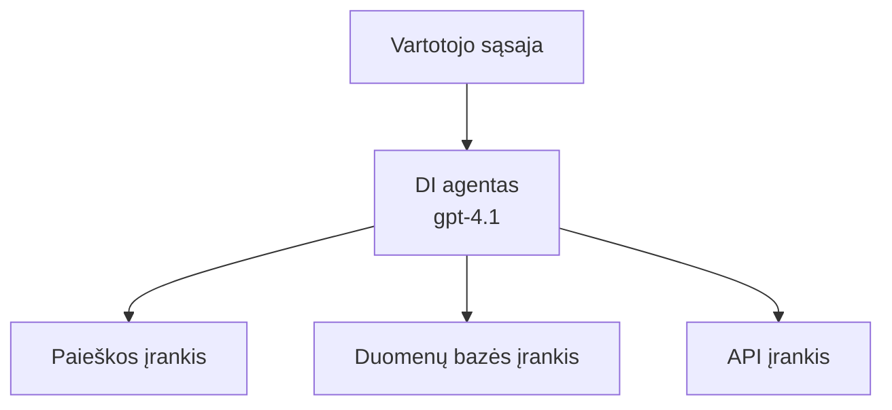
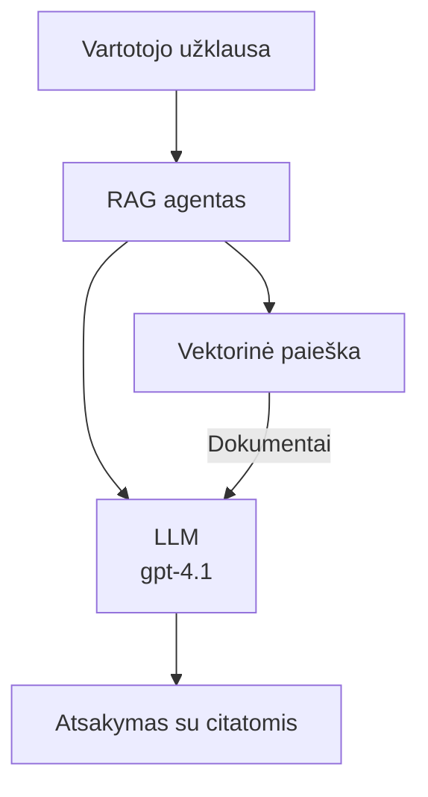
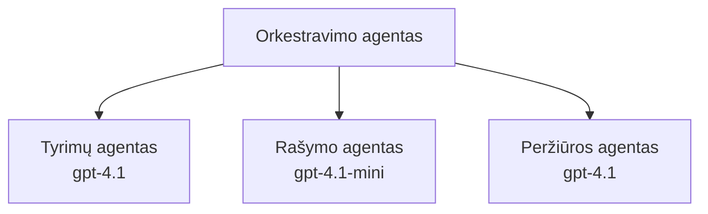

# Dirbtinio intelekto agentai su Azure Developer CLI

**Skyrių navigacija:**
- **📚 Kurso pradžia**: [AZD For Beginners](../../README.md)
- **📖 Esamas skyrius**: 2 skyrius - AI-pirmasis vystymas
- **⬅️ Ankstesnis**: [Microsoft Foundry integracija](microsoft-foundry-integration.md)
- **➡️ Kitas**: [DI modelių diegimas](ai-model-deployment.md)
- **🚀 Pažengusiems**: [Daugiagentiniai sprendimai](../../examples/retail-scenario.md)

---

## Įvadas

DI agentai yra autonominės programos, kurios gali suvokti savo aplinką, priimti sprendimus ir imtis veiksmų, kad pasiektų konkrečius tikslus. Skirtingai nuo paprastų pokalbių robotų, kurie reaguoja į užklausas, agentai gali:

- **Naudoti įrankius** - Kvieskite API, ieškokite duomenų bazėse, vykdykite kodą
- **Planavimas ir samprotavimas** - Suskaidyti sudėtingas užduotis į žingsnius
- **Mokytis iš konteksto** - Išlaikyti atmintį ir pritaikyti elgesį
- **Bendradarbiauti** - Dirbti su kitais agentais (daugiagentės sistemos)

Šis vadovas parodo, kaip diegti DI agentus Azure naudojant Azure Developer CLI (azd).

## Mokymosi tikslai

Užbaigę šį vadovą, jūs:
- Suprasite, kas yra DI agentai ir kuo jie skiriasi nuo pokalbių robotų
- Išmėginsite iš anksto paruoštus DI agentų šablonus naudojant AZD
- Sužinosite, kaip konfigūruoti Foundry agentus kuriant pasirinktinius agentus
- Įgyvendinsite pagrindinius agentų modelius (įrankių naudojimas, RAG, daugiagentė)
- Stebėsite ir derinsite įdiegtus agentus

## Mokymosi rezultatai

Užbaigę, galėsite:
- Įdiegti DI agentų programas Azure vienu komandą
- Konfigūruoti agentų įrankius ir galimybes
- Įgyvendinti paieška papildytą generavimą (RAG) su agentais
- Projektuoti daugiagentines architektūras sudėtingiems darbo srautams
- Spręsti dažnas agentų diegimo problemas

---

## 🤖 Kuo agentas skiriasi nuo pokalbių roboto?

| Savybė | Pokalbių robotas | DI agentas |
|--------|------------------|-----------|
| **Elgesys** | Atsako į užklausas | Imasi autonominių veiksmų |
| **Įrankiai** | Nėra | Gali kviesti API, ieškoti, vykdyti kodą |
| **Atmintis** | Tik sesijos lygiu | Nuolatinė atmintis per sesijas |
| **Planavimas** | Vienkartinis atsakas | Daugiažingsnis samprotavimas |
| **Bendradarbiavimas** | Vienetas | Gali dirbti su kitais agentais |

### Paprasta analogija

- **Pokalbių robotas** = Pagalbininkas, atsakantis į klausimus informacijos punkte
- **DI agentas** = Asmeninis padėjėjas, kuris gali skambinti, užsakyti susitikimus ir atlikti užduotis už jus

---

## 🚀 Greitas startas: Įdiekite savo pirmąjį agentą

### Parinktis 1: Foundry agentų šablonas (rekomenduojama)

```bash
# Inicializuoti dirbtinio intelekto agentų šabloną
azd init --template get-started-with-ai-agents

# Diegti į Azure
azd up
```

**Kas diegiama:**
- ✅ Foundry agentai
- ✅ Microsoft Foundry modeliai (gpt-4.1)
- ✅ Azure AI Search (RAG palaikymui)
- ✅ Azure Container Apps (žiniatinklio sąsaja)
- ✅ Application Insights (stebėjimui)

**Trukmė:** ~15–20 minučių
**Kaina:** ~$100–150/mėn (vystymui)

### Parinktis 2: OpenAI agentas su Prompty

```bash
# Inicializuokite Prompty pagrįstą agento šabloną
azd init --template agent-openai-python-prompty

# Diegti į Azure
azd up
```

**Kas diegiama:**
- ✅ Azure Functions (serverless agento vykdymas)
- ✅ Microsoft Foundry modeliai
- ✅ Prompty konfigūracijos failai
- ✅ Pavyzdinė agento įgyvendinimas

**Trukmė:** ~10–15 minučių
**Kaina:** ~$50–100/mėn (vystymui)

### Parinktis 3: RAG pokalbių agentas

```bash
# Inicializuoti RAG pokalbio šabloną
azd init --template azure-search-openai-demo

# Diegti į Azure
azd up
```

**Kas diegiama:**
- ✅ Microsoft Foundry modeliai
- ✅ Azure AI Search su pavyzdiniais duomenimis
- ✅ Dokumentų apdorojimo pipeline
- ✅ Pokalbių sąsaja su citatomis

**Trukmė:** ~15–25 minučių
**Kaina:** ~$80–150/mėn (vystymui)

### Parinktis 4: AZD AI Agent Init (remiantis manifestu)

Jei turite agento manifesto failą, galite naudoti komandą `azd ai`, kad tiesiogiai sukurtumėte Foundry Agent Service projektą:

```bash
# Įdiegti dirbtinio intelekto agentų plėtinį
azd extension install azure.ai.agents

# Inicializuoti pagal agento manifestą
azd ai agent init -m agent-manifest.yaml

# Diegti į Azure
azd up
```

**Kada naudoti `azd ai agent init` vs `azd init --template`:**

| Požiūris | Geriausia skirta | Kaip tai veikia |
|----------|------------------|-----------------|
| `azd init --template` | Pradedant nuo veikiančio pavyzdžio programos | Klonuojama pilna šablono saugykla su kodu + infrastruktūra |
| `azd ai agent init -m` | Kuriant iš savo agento manifesto | Sukuriama projekto struktūra pagal agento apibrėžimą |

> **Patarimas:** Naudokite `azd init --template` mokymuisi (1–3 parinktys aukščiau). Naudokite `azd ai agent init`, kai kuriate gamybinius agentus su savo manifestais. Peržiūrėkite [AZD AI CLI Commands](../chapter-08-production/production-ai-practices.md#azd-ai-cli-commands-and-extensions) pilnai informacijai.

---

## 🏗️ Agentų architektūros modeliai

### Modelis 1: Vienas agentas su įrankiais

Paprčiausias agento modelis – vienas agentas, kuris gali naudoti įvairius įrankius.


**Geriausia pritaikyti:**
- Klientų aptarnavimo botai
- Tyrimų asistentai
- Duomenų analizės agentai

**AZD šablonas:** `azure-search-openai-demo`

### Modelis 2: RAG agentas (paieškos papildyta generacija)

Agentas, kuris prieš generuodamas atsakymus ištraukia aktualius dokumentus.


**Geriausia pritaikyti:**
- Įmonių žinių bazės
- Dokumentų Q&A sistemos
- Atitikties ir teisinių tyrimų scenarijai

**AZD šablonas:** `azure-search-openai-demo`

### Modelis 3: Daugiagentė sistema

Keli specializuoti agentai, dirbantys kartu sudėtingoms užduotims.


**Geriausia pritaikyti:**
- Sudėtinga turinio generacija
- Daugiažingsniai darbo procesai
- Užduotys, reikalaujančios skirtingų kompetencijų

**Sužinokite daugiau:** [Multi-Agent Coordination Patterns](../chapter-06-pre-deployment/coordination-patterns.md)

---

## ⚙️ Agentų įrankių konfigūravimas

Agentai tampa galingi, kai gali naudoti įrankius. Štai kaip konfigūruoti dažniausiai naudojamus įrankius:

### Įrankių konfigūravimas Foundry agentuose

```python
# agent_config.py
from azure.ai.projects import AIProjectClient
from azure.ai.projects.models import FunctionTool, CodeInterpreterTool

# Apibrėžti pasirinktinius įrankius
search_tool = FunctionTool(
    name="search_knowledge_base",
    description="Search the company knowledge base for relevant documents",
    parameters={
        "type": "object",
        "properties": {
            "query": {
                "type": "string",
                "description": "The search query"
            }
        },
        "required": ["query"]
    }
)

# Sukurti agentą su įrankiais
agent = project_client.agents.create_agent(
    model="gpt-4.1",
    name="Support Agent",
    instructions="You are a helpful support agent. Use the search tool to find relevant information.",
    tools=[search_tool, CodeInterpreterTool()]
)
```

### Aplinkos konfigūracija

```bash
# Nustatyti agentui specifinius aplinkos kintamuosius
azd env set AZURE_OPENAI_MODEL "gpt-4.1"
azd env set AGENT_INSTRUCTIONS "You are a helpful assistant..."
azd env set ENABLE_CODE_INTERPRETER "true"
azd env set ENABLE_FILE_SEARCH "true"

# Diegti su atnaujinta konfigūracija
azd deploy
```

---

## 📊 Agentų stebėjimas

### Application Insights integracija

Visi AZD agentų šablonai įtraukia Application Insights stebėjimui:

```bash
# Atidaryti stebėjimo skydelį
azd monitor --overview

# Peržiūrėti tiesioginius žurnalus
azd monitor --logs

# Peržiūrėti tiesiogines metrikas
azd monitor --live
```

### Pagrindiniai stebimi metrikai

| Metrika | Aprašymas | Tikslas |
|--------|-----------|--------|
| Atsako delsimas | Laikas atsakui sugeneruoti | < 5 sekundžių |
| Tokenų naudojimas | Tokenai už užklausą | Stebėti kainą |
| Įrankio iškvietimų sėkmės rodiklis | % sėkmingų įrankio vykdymų | > 95% |
| Klaidų rodiklis | Nepavykusios agento užklausos | < 1% |
| Vartotojų pasitenkinimas | Atsiliepimų balai | > 4.0/5.0 |

### Pritaikytas žurnalas agentams

```python
import os
from azure.monitor.opentelemetry import configure_azure_monitor
from opentelemetry import trace

# Konfigūruokite Azure Monitor naudodami OpenTelemetry
configure_azure_monitor(
    connection_string=os.environ["APPLICATIONINSIGHTS_CONNECTION_STRING"]
)

tracer = trace.get_tracer(__name__)

def log_agent_interaction(user_query, agent_response, tools_used, latency_ms):
    with tracer.start_as_current_span("agent_interaction") as span:
        span.set_attributes({
            "user_query": user_query,
            "response_length": len(agent_response),
            "tools_used": tools_used,
            "latency_ms": latency_ms
        })
```

> **Pastaba:** Įdiekite reikalingas paketas: `pip install azure-monitor-opentelemetry opentelemetry`

---

## 💰 Kainų apsvarstymai

### Apskaičiuotos mėnesinės išlaidos pagal modelį

| Modelis | Vystymo aplinka | Gamyba |
|---------|-----------------|--------|
| Vienas agentas | $50-100 | $200-500 |
| RAG agentas | $80-150 | $300-800 |
| Daugiagentis (2-3 agentai) | $150-300 | $500-1,500 |
| Įmonių daugiagentis | $300-500 | $1,500-5,000+ |

### Patarimai išlaidoms optimizuoti

1. **Naudokite gpt-4.1-mini paprastiems uždaviniams**
   ```bash
   azd env set AZURE_OPENAI_MODEL "gpt-4.1-mini"
   ```

2. **Įgyvendinkite talpyklavimą pasikartojančioms užklausoms**
   ```python
   from functools import lru_cache
   
   @lru_cache(maxsize=1000)
   def get_cached_response(query_hash):
       return agent.run(query_hash)
   ```

3. **Nustatykite tokenų ribas vienam vykdymui**
   ```python
   # Nustatykite max_completion_tokens paleidžiant agentą, o ne jį kuriant
   run = project_client.agents.create_run(
       thread_id=thread.id,
       agent_id=agent.id,
       max_completion_tokens=1000  # Apribokite atsakymo ilgį
   )
   ```

4. **Mastelizuokite iki nulio, kai nenaudojama**
   ```bash
   # Container Apps automatiškai sumažina mastelį iki nulio
   azd env set MIN_REPLICAS "0"
   ```

---

## 🔧 Agentų trikčių šalinimas

### Dažnos problemos ir sprendimai

<details>
<summary><strong>❌ Agentas neatsako į įrankio iškvietimus</strong></summary>

```bash
# Patikrinkite, ar įrankiai yra tinkamai užregistruoti
azd show

# Patikrinkite OpenAI diegimą
az cognitiveservices account deployment list \
  --name $AZURE_OPENAI_NAME \
  --resource-group $RG_NAME

# Patikrinkite agento žurnalus
azd monitor --logs
```

**Dažnos priežastys:**
- Įrankio funkcijos paraščių neatitikimas
- Trūksta reikiamų teisių
- API pabaigos taškas neprieinamas
</details>

<details>
<summary><strong>❌ Didelis delsimas agento atsakuose</strong></summary>

```bash
# Patikrinkite Application Insights dėl butelio kaklelių
azd monitor --live

# Apsvarstykite galimybę naudoti greitesnį modelį
azd env set AZURE_OPENAI_MODEL "gpt-4.1-mini"
azd deploy
```

**Optimizacijos patarimai:**
- Naudokite srautinius atsakymus
- Įgyvendinkite atsakymų talpyklavimą
- Sumažinkite konteksto lango dydį
</details>

<details>
<summary><strong>❌ Agentas grąžina neteisingą arba išgalvotą informaciją</strong></summary>

```python
# Pagerinti naudojant geresnius sistemos promptus
instructions = """
You are a helpful assistant. IMPORTANT:
- Only answer based on provided context
- If you don't know, say "I don't know"
- Always cite your sources
- Never make up information
"""

# Pridėti paiešką, skirtą pagrindymui
agent = project_client.agents.create_agent(
    model="gpt-4.1",
    instructions=instructions,
    tools=[FileSearchTool()]  # Pagrįsti atsakymus dokumentais
)
```
</details>

<details>
<summary><strong>❌ Klaidos: viršytas žetonų limitas</strong></summary>

```python
# Įgyvendinti konteksto lango valdymą
def truncate_context(messages, max_tokens=8000, model="gpt-4.1"):
    """Keep only recent messages within token limit."""
    import tiktoken
    encoding = tiktoken.encoding_for_model(model)
    total_tokens = 0
    truncated = []
    
    for msg in reversed(messages):
        msg_tokens = len(encoding.encode(msg.content))
        if total_tokens + msg_tokens > max_tokens:
            break
        truncated.insert(0, msg)
        total_tokens += msg_tokens
    
    return truncated
```
</details>

---

## 🎓 Praktinės užduotys

### Užduotis 1: Diegti bazinį agentą (20 minučių)

**Tikslas:** Įdiegti pirmąjį DI agentą naudojant AZD

```bash
# 1 žingsnis: Inicializuokite šabloną
azd init --template get-started-with-ai-agents

# 2 žingsnis: Prisijunkite prie Azure
azd auth login

# 3 žingsnis: Įdiekite
azd up

# 4 žingsnis: Išbandykite agentą
# Numatyta išvestis po diegimo:
#   Diegimas baigtas!
#   Galinis taškas: https://<app-name>.<region>.azurecontainerapps.io
# Atidarykite išvestyje rodomą URL ir pabandykite užduoti klausimą

# 5 žingsnis: Peržiūrėkite stebėjimą
azd monitor --overview

# 6 žingsnis: Išvalykite
azd down --force --purge
```

**Sėkmės kriterijai:**
- [ ] Agentas atsako į klausimus
- [ ] Gali pasiekti stebėjimo skydelį per `azd monitor`
- [ ] Ištekliai sėkmingai pašalinti

### Užduotis 2: Pridėti pasirinktą įrankį

**Tikslas:** Išplėsti agentą pasirinktiniu įrankiu

1. Įdiekite agento šabloną:
   ```bash
   azd init --template get-started-with-ai-agents
   azd up
   ```
2. Sukurkite naują įrankio funkciją savo agento kode:
   ```python
   def get_weather(location: str) -> str:
       """Get current weather for a location."""
       # API užklausa orų tarnybai
       return f"Weather in {location}: Sunny, 72°F"
   ```
3. Registruokite įrankį agentui:
   ```python
   from azure.ai.projects.models import FunctionTool

   weather_tool = FunctionTool(
       name="get_weather",
       description="Get current weather for a location",
       parameters={
           "type": "object",
           "properties": {
               "location": {"type": "string", "description": "City name"}
           },
           "required": ["location"]
       }
   )

   agent = project_client.agents.create_agent(
       model="gpt-4.1",
       name="Weather Agent",
       tools=[weather_tool]
   )
   ```
4. Iš naujo įdiekite ir patikrinkite:
   ```bash
   azd deploy
   # Paklausk: "Koks oras Sietle?"
   # Tikimasi: agentas iškviečia get_weather("Seattle") ir grąžina orų informaciją
   ```

**Sėkmės kriterijai:**
- [ ] Agentas atpažįsta su oru susijusius užklausimus
- [ ] Įrankis kviečiamas tinkamai
- [ ] Atsakyme pateikiama informacija apie orus

### Užduotis 3: Sukurkite RAG agentą (45 minutės)

**Tikslas:** Sukurti agentą, kuris atsako į klausimus iš jūsų dokumentų

```bash
# 1 žingsnis: Įdiegti RAG šabloną
azd init --template azure-search-openai-demo
azd up

# 2 žingsnis: Įkelkite savo dokumentus
# Įdėkite PDF/TXT failus į data/ katalogą, tada paleiskite:
python scripts/prepdocs.py

# 3 žingsnis: Išbandykite su konkrečios srities klausimais
# Atidarykite žiniatinklio programos URL, nurodytą azd up išvestyje
# Užduokite klausimus apie įkeltus dokumentus
# Atsakymai turėtų įtraukti citavimo nuorodas, pvz., [doc.pdf]
```

**Sėkmės kriterijai:**
- [ ] Agentas atsako remdamasis įkeltomis dokumentų žiniomis
- [ ] Atsakymai turi citatas
- [ ] Nėra išgalvotos informacijos neapimties klausimuose

---

## 📚 Tolimesni žingsniai

Dabar, kai suprantate DI agentus, išnagrinėkite šias pažengusias temas:

| Tema | Aprašymas | Nuoroda |
|------|----------|--------|
| **Daugiagentės sistemos** | Kurkite sistemas su keliais bendradarbiaujančiais agentais | [Retail Multi-Agent Example](../../examples/retail-scenario.md) |
| **Koordinavimo modeliai** | Sužinokite orkestravimo ir komunikacijos modelius | [Coordination Patterns](../chapter-06-pre-deployment/coordination-patterns.md) |
| **Gamybinis diegimas** | Agentų diegimas, paruoštas įmonei | [Production AI Practices](../chapter-08-production/production-ai-practices.md) |
| **Agentų vertinimas** | Testavimas ir agentų veiklos vertinimas | [AI Troubleshooting](../chapter-07-troubleshooting/ai-troubleshooting.md) |
| **AI Workshop Lab** | Praktinė veikla: paruoškite savo DI sprendimą AZD | [AI Workshop Lab](ai-workshop-lab.md) |

---

## 📖 Papildomi ištekliai

### Oficialioji dokumentacija
- [Azure AI Agent Service](https://learn.microsoft.com/azure/ai-services/agents/)
- [Azure AI Foundry Agent Service Quickstart](https://learn.microsoft.com/azure/ai-services/agents/quickstart)
- [Semantic Kernel Agent Framework](https://learn.microsoft.com/semantic-kernel/)

### AZD šablonai agentams
- [Get Started with AI Agents](https://github.com/Azure-Samples/get-started-with-ai-agents)
- [Agent OpenAI Python Prompty](https://github.com/Azure-Samples/agent-openai-python-prompty)
- [Azure Search OpenAI Demo](https://github.com/Azure-Samples/azure-search-openai-demo)

### Bendruomenės ištekliai
- [Awesome AZD - Agent Templates](https://azure.github.io/awesome-azd/?tags=ai-agents)
- [Azure AI Discord](https://discord.gg/microsoft-azure)
- [Microsoft Foundry Discord](https://discord.gg/nTYy5BXMWG)

### Agentų įgūdžiai jūsų redaktoriui
- [**Microsoft Azure Agent Skills**](https://skills.sh/microsoft/github-copilot-for-azure) - Įdiekite pernaudojamus DI agentų įgūdžius Azure vystymui GitHub Copilot, Cursor ar bet kuriame palaikomame agentų įrankyje. Įtraukta įgūdžių dėl [Azure AI](https://skills.sh/microsoft/github-copilot-for-azure/azure-ai), [Microsoft Foundry](https://skills.sh/microsoft/github-copilot-for-azure/microsoft-foundry), [diegimo](https://skills.sh/microsoft/github-copilot-for-azure/azure-deploy) ir [diagnostikos](https://skills.sh/microsoft/github-copilot-for-azure/azure-diagnostics):
  ```bash
  npx skills add microsoft/github-copilot-for-azure
  ```

---

**Navigacija**
- **Ankstesnė pamoka**: [Microsoft Foundry integracija](microsoft-foundry-integration.md)
- **Kita pamoka**: [DI modelių diegimas](ai-model-deployment.md)

---

<!-- CO-OP TRANSLATOR DISCLAIMER START -->
**Atsakomybės apribojimas**:
Šis dokumentas buvo išverstas naudojant dirbtinio intelekto vertimo paslaugą [Co-op Translator](https://github.com/Azure/co-op-translator). Nors siekiame tikslumo, prašome atkreipti dėmesį, kad automatiniai vertimai gali turėti klaidų arba netikslumų. Originalus dokumentas jo gimtąja kalba turėtų būti laikomas autoritetingu šaltiniu. Esant kritinei informacijai, rekomenduojama pasitelkti profesionalų žmogaus vertimą. Mes neatsakome už bet kokius nesusipratimus ar neteisingus aiškinimus, kylančius dėl šio vertimo naudojimo.
<!-- CO-OP TRANSLATOR DISCLAIMER END -->