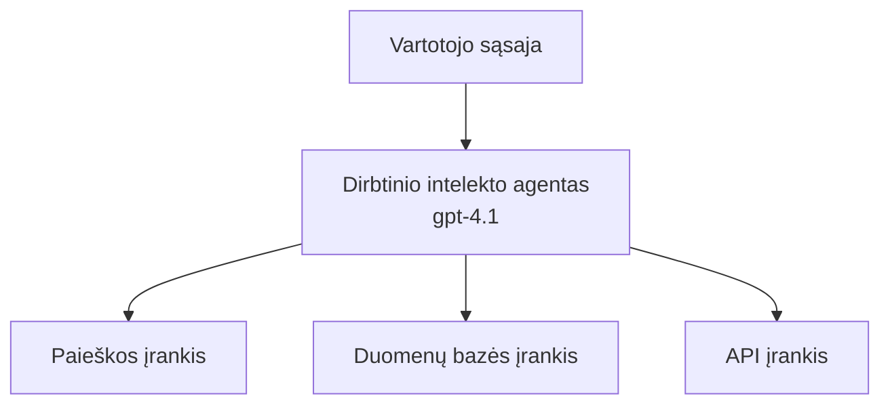
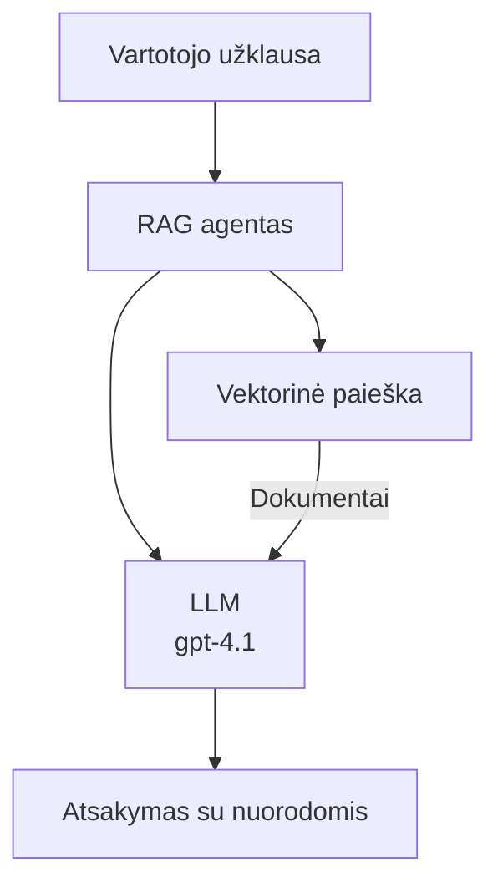
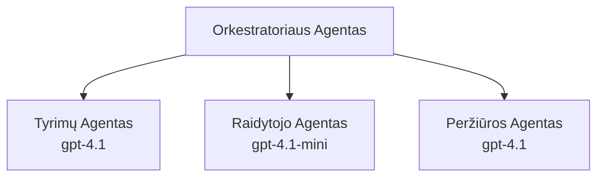

# AI agentai su Azure Developer CLI

**Skyriaus navigacija:**
- **📚 Kurso pradžia**: [AZD Pradedantiesiems](../../README.md)
- **📖 Dabartinis skyrius**: 2 skyrius - AI pirmoji plėtra
- **⬅️ Ankstesnis**: [Microsoft Foundry integracija](microsoft-foundry-integration.md)
- **➡️ Kitas**: [AI modelio diegimas](ai-model-deployment.md)
- **🚀 Pažengusiems**: [Daugiagentinės sistemos](../../examples/retail-scenario.md)

---

## Įvadas

AI agentai yra autonomiškos programos, kurios gali suvokti savo aplinką, priimti sprendimus ir imtis veiksmų, siekdamos konkrečių tikslų. Skirtingai nei paprasti pokalbių robotai, kurie reaguoja į užklausas, agentai gali:

- **Naudotis įrankiais** - kviesti API, ieškoti duomenų bazėse, vykdyti kodą
- **Planuoti ir spręsti** - suskaidyti sudėtingas užduotis į žingsnius
- **Mokytis iš konteksto** - išlaikyti atmintį ir adaptuoti savo elgesį
- **Bendradarbiauti** - dirbti su kitais agentais (daugiagentinės sistemos)

Šiame vadove parodyta, kaip diegti AI agentus Azure naudojant Azure Developer CLI (azd).

> **Patvirtinimo pastaba (2026-03-25):** Šis vadovas buvo peržiūrėtas su `azd` `1.23.12` ir `azure.ai.agents` `0.1.18-preview`. `azd ai` patirtis vis dar yra peržiūros stadijoje, todėl patikrinkite plėtinio pagalbą, jei jūsų įdiegti įgaliojimai skiriasi.

## Mokymosi tikslai

Baigę šį vadovą, jūs:
- Suprasite, kas yra AI agentai ir kuo jie skiriasi nuo pokalbių robotų
- Išmoksite diegti iš anksto sukurtus AI agentų šablonus naudojant AZD
- Konfigūruosite Foundry agentus individualiems agentams
- Įdiegsite pagrindinius agentų modelius (įrankių naudojimas, RAG, daugiagentiniai)
- Stebėsite ir derinsite įdiegtus agentus

## Mokymosi rezultatai

Baigę kursą, galėsite:
- Vienu komandos įdiegti AI agentų programas į Azure
- Konfigūruoti agentų įrankius ir funkcionalumus
- Įgyvendinti paieškos paplašinimą (RAG) su agentais
- Kurti daugiagentines architektūras sudėtingiems darbo srautams
- Spręsti dažniausiai pasitaikančias agentų diegimo problemas

---

## 🤖 Kas daro agentą skirtingu nuo pokalbių roboto?

| Savybė | Pokalbių robotas | AI agentas |
|--------|------------------|------------|
| **Elgesys** | Reaguoja į užklausas | Imasi autonominių veiksmų |
| **Įrankiai** | Nėra | Gali kviesti API, ieškoti, vykdyti kodą |
| **Atmintis** | Tik sesijos lygmeniu | Nuolatinė atmintis per sesijas |
| **Planavimas** | Vienas atsakymas | Daugiapakopis samprotavimas |
| **Bendradarbiavimas** | Vienas subjektas | Gali dirbti su kitais agentais |

### Paprasta analogija

- **Pokalbių robotas** = Pagalbininkas informacijos punkte, atsakantis į klausimus
- **AI agentas** = Asmeninis asistentas, galintis skambinti, užsakyti vizitus ir atlikti užduotis jūsų vardu

---

## 🚀 Greitas startas: įdiekite savo pirmąjį agentą

### 1 variantas: Foundry agentų šablonas (rekomenduojama)

```bash
# Inicializuoti AI agentų šabloną
azd init --template get-started-with-ai-agents

# Įdiegti į Azure
azd up
```

**Kas diegiama:**
- ✅ Foundry agentai
- ✅ Microsoft Foundry modeliai (gpt-4.1)
- ✅ Azure AI Search (RAG)
- ✅ Azure Container Apps (žiniatinklio sąsaja)
- ✅ Application Insights (stebėjimas)

**Laikas:** ~15-20 minučių
**Kaina:** ~$100-150/mėn (kūrimui)

### 2 variantas: OpenAI agentas su Prompty

```bash
# Inicializuokite Prompty pagrįstą agento šabloną
azd init --template agent-openai-python-prompty

# Diegti į Azure
azd up
```

**Kas diegiama:**
- ✅ Azure Functions (serverio neturinčių agentų vykdymas)
- ✅ Microsoft Foundry modeliai
- ✅ Prompty konfigūracijos failai
- ✅ Pavyzdinė agento realizacija

**Laikas:** ~10-15 minučių
**Kaina:** ~$50-100/mėn (kūrimui)

### 3 variantas: RAG pokalbių agentas

```bash
# Inicializuoti RAG pokalbių šabloną
azd init --template azure-search-openai-demo

# Diegti į Azure
azd up
```

**Kas diegiama:**
- ✅ Microsoft Foundry modeliai
- ✅ Azure AI Search su pavyzdiniais duomenimis
- ✅ Dokumentų apdorojimo kanalas
- ✅ Pokalbių sąsaja su citatomis

**Laikas:** ~15-25 minučių
**Kaina:** ~$80-150/mėn (kūrimui)

### 4 variantas: AZD AI Agent Init (manifesto ar šablono pagrindu, peržiūra)

Jei turite agento manifesto failą, galite naudoti komandą `azd ai`, kad tiesiogiai sugeneruotumėte Foundry agentų paslaugos projektą. Naujausiuose peržiūros leidimuose taip pat pridėta palaikymas šablonais pagrįstam inicializavimui, todėl tikslus dialogo srautas gali šiek tiek skirtis priklausomai nuo įdiegtos plėtinio versijos.

```bash
# Įdiekite AI agentų plėtinį
azd extension install azure.ai.agents

# Pasirinktinai: patikrinkite įdiegtą peržiūros versiją
azd extension show azure.ai.agents

# Inicializuokite iš agentų manifestos
azd ai agent init -m agent-manifest.yaml

# Diegti į Azure
azd up
```

**Kada naudoti `azd ai agent init` prieš `azd init --template`:**

| Būdas | Geriausias naudojimo atvejis | Kaip veikia |
|-------|-----------------------------|------------|
| `azd init --template` | Pradžia nuo veiksnaus pavyzdinio app | Nukopijuoja visą šablonų repozitoriją su kodu + infrastruktūra |
| `azd ai agent init -m` | Kuriant pagal savo agento manifestą | Sugeneruoja projekto struktūrą pagal agento aprašymą |

> **Patarimas:** Naudokite `azd init --template` mokymosi metu (1-3 variantai aukščiau). Naudokite `azd ai agent init`, kai kuriate gamybinius agentus su savo manifestais. Žr. [AZD AI CLI komandų sąrašą](../chapter-08-production/production-ai-practices.md#azd-ai-cli-commands-and-extensions) pilnam aprašymui.

---

## 🏗️ Agentų architektūros modeliai

### Modelis 1: Vienas agentas su įrankiais

Paprastas agento modelis – vienas agentas, galintis naudoti kelis įrankius.


**Tinka:**
- Klientų aptarnavimo robotams
- Tyrimų asistentams
- Duomenų analizės agentams

**AZD šablonas:** `azure-search-openai-demo`

### Modelis 2: RAG agentas (paieškos paplašinimo generavimas)

Agentas, kuris prieš generuodamas atsakymus atsižvelgia į atitinkamus dokumentus.


**Tinka:**
- Įmonių žinių bazėms
- Dokumentų klausimų ir atsakymų sistemoms
- Atitikties ir teisiniams tyrimams

**AZD šablonas:** `azure-search-openai-demo`

### Modelis 3: Daugiagentinė sistema

Keli specializuoti agentai bendradarbiaujantys sudėtingose užduotyse.


**Tinka:**
- Sudėtingam turinio generavimui
- Daugiapakopiams darbo srautams
- Užduotims, reikalaujančioms skirtingų kompetencijų

**Sužinokite daugiau:** [Daugiagentinių koordinavimo modeliai](../chapter-06-pre-deployment/coordination-patterns.md)

---

## ⚙️ Agentų įrankių konfigūravimas

Agentai tampa galingi, kai gali naudotis įrankiais. Štai kaip sukonfigūruoti dažniausiai naudojamus įrankius:

### Įrankių konfigūracija Foundry agentuose

```python
# agent_config.py
from azure.ai.projects import AIProjectClient
from azure.ai.projects.models import FunctionTool, CodeInterpreterTool

# Apibrėžti pasirinktinius įrankius
search_tool = FunctionTool(
    name="search_knowledge_base",
    description="Search the company knowledge base for relevant documents",
    parameters={
        "type": "object",
        "properties": {
            "query": {
                "type": "string",
                "description": "The search query"
            }
        },
        "required": ["query"]
    }
)

# Sukurti agentą su įrankiais
agent = project_client.agents.create_agent(
    model="gpt-4.1",
    name="Support Agent",
    instructions="You are a helpful support agent. Use the search tool to find relevant information.",
    tools=[search_tool, CodeInterpreterTool()]
)
```

### Aplinkos konfigūracija

```bash
# Nustatyti agentui specifinius aplinkos kintamuosius
azd env set AZURE_OPENAI_MODEL "gpt-4.1"
azd env set AGENT_INSTRUCTIONS "You are a helpful assistant..."
azd env set ENABLE_CODE_INTERPRETER "true"
azd env set ENABLE_FILE_SEARCH "true"

# Diegti su atnaujinta konfigūracija
azd deploy
```

---

## 📊 Agentų stebėjimas

### Application Insights integracija

Visi AZD agentų šablonai apima Application Insights stebėjimui:

```bash
# Atidaryti stebėjimo skydelį
azd monitor --overview

# Peržiūrėti tiesioginius žurnalus
azd monitor --logs

# Peržiūrėti tiesioginius metrikus
azd monitor --live
```

### Svarbiausi stebimi rodikliai

| Rodiklis | Aprašymas | Tikslas |
|----------|------------|---------|
| Atsakymo vėlavimas | Laikas sugeneruoti atsakymą | < 5 sekundžių |
| Žetonų naudojimas | Žetonai už užklausą | Stebėti dėl sąnaudų |
| Įrankių kvietimų sėkmės procentas | Sėkmingų įrankių vykdymų % | > 95% |
| Klaidos lygis | Neužbaigtų agentų užklausų % | < 1% |
| Naudotojų pasitenkinimas | Atsiliepimų balai | > 4.0/5.0 |

### Tinkintas agentų registravimas

```python
import os
from azure.monitor.opentelemetry import configure_azure_monitor
from opentelemetry import trace

# Konfigūruokite „Azure Monitor“ su OpenTelemetry
configure_azure_monitor(
    connection_string=os.environ["APPLICATIONINSIGHTS_CONNECTION_STRING"]
)

tracer = trace.get_tracer(__name__)

def log_agent_interaction(user_query, agent_response, tools_used, latency_ms):
    with tracer.start_as_current_span("agent_interaction") as span:
        span.set_attributes({
            "user_query": user_query,
            "response_length": len(agent_response),
            "tools_used": tools_used,
            "latency_ms": latency_ms
        })
```

> **Pastaba:** Įdiekite reikiamus paketus: `pip install azure-monitor-opentelemetry opentelemetry`

---

## 💰 Kainų svarstymai

### Apskaičiuotos mėnesio sąnaudos pagal modelį

| Modelis | Kūrimo aplinka | Gamybos aplinka |
|---------|-----------------|-----------------|
| Vienas agentas | $50-100 | $200-500 |
| RAG agentas | $80-150 | $300-800 |
| Daugiagentė sistema (2-3 agentai) | $150-300 | $500-1,500 |
| Įmonių daugiagentė sistema | $300-500 | $1,500-5,000+ |

### Kainų optimizavimo patarimai

1. **Naudokite gpt-4.1-mini paprastoms užduotims**
   ```bash
   azd env set AZURE_OPENAI_MODEL "gpt-4.1-mini"
   ```

2. **Įdiekite talpyklą pasikartojančioms užklausoms**
   ```python
   from functools import lru_cache
   
   @lru_cache(maxsize=1000)
   def get_cached_response(query_hash):
       return agent.run(query_hash)
   ```

3. **Nustatykite žetonų limitus per vykdymą**
   ```python
   # Nustatykite max_completion_tokens paleidžiant agentą, o ne kūrimo metu
   run = project_client.agents.create_run(
       thread_id=thread.id,
       agent_id=agent.id,
       max_completion_tokens=1000  # Apriboti atsakymo ilgį
   )
   ```

4. **Mastelinkite iki nulio, kai nenaudojama**
   ```bash
   # Container Apps automatiškai išsiplečia iki nulio
   azd env set MIN_REPLICAS "0"
   ```

---

## 🔧 Agentų trikčių šalinimas

### Dažnos problemos ir sprendimai

<details>
<summary><strong>❌ Agentas nereaguoja į įrankių kvietimus</strong></summary>

```bash
# Patikrinkite, ar įrankiai tinkamai užregistruoti
azd show

# Patikrinkite OpenAI diegimą
az cognitiveservices account deployment list \
  --name $AZURE_OPENAI_NAME \
  --resource-group $RG_NAME

# Patikrinkite agentų žurnalus
azd monitor --logs
```

**Dažnos priežastys:**
- Įrankių funkcijų parašo neatitikimas
- Trūksta būtinų leidimų
- API galinis taškas nepasiekiamas
</details>

<details>
<summary><strong>❌ Didelis atsakymo vėlavimas agento atsakymuose</strong></summary>

```bash
# Patikrinkite Application Insights dėl našumo kliūčių
azd monitor --live

# Apsvarstykite galimybę naudoti greitesnį modelį
azd env set AZURE_OPENAI_MODEL "gpt-4.1-mini"
azd deploy
```

**Optimizavimo patarimai:**
- Naudokite srautinį atsakymą
- Įdiekite atsakymų talpyklą
- Sumažinkite konteksto lango dydį
</details>

<details>
<summary><strong>❌ Agentas pateikia neteisingą ar išgalvotą informaciją</strong></summary>

```python
# Patobulinkite naudodami geresnius sistemos užklausimus
instructions = """
You are a helpful assistant. IMPORTANT:
- Only answer based on provided context
- If you don't know, say "I don't know"
- Always cite your sources
- Never make up information
"""

# Pridėkite paiešką atsakymų pagrindimui
agent = project_client.agents.create_agent(
    model="gpt-4.1",
    instructions=instructions,
    tools=[FileSearchTool()]  # Įtvirtinkite atsakymus dokumentuose
)
```
</details>

<details>
<summary><strong>❌ Viršytas žetonų limitas</strong></summary>

```python
# Įgyvendinti konteksto lango valdymą
def truncate_context(messages, max_tokens=8000, model="gpt-4.1"):
    """Keep only recent messages within token limit."""
    import tiktoken
    encoding = tiktoken.encoding_for_model(model)
    total_tokens = 0
    truncated = []
    
    for msg in reversed(messages):
        msg_tokens = len(encoding.encode(msg.content))
        if total_tokens + msg_tokens > max_tokens:
            break
        truncated.insert(0, msg)
        total_tokens += msg_tokens
    
    return truncated
```
</details>

---

## 🎓 Praktinės užduotys

### Užduotis 1: Įdiekite pagrindinį agentą (20 minučių)

**Tikslas:** Įdiegti pirmąjį AI agentą naudojant AZD

```bash
# 1 veiksmas: Inicializuokite šabloną
azd init --template get-started-with-ai-agents

# 2 veiksmas: Prisijunkite prie Azure
azd auth login
# Jei dirbate su keliais nuomininkais, pridėkite --tenant-id <tenant-id>

# 3 veiksmas: Įdiekite
azd up

# 4 veiksmas: Išbandykite agentą
# Laukiama išvestis po diegimo:
#   Įdiegimas baigtas!
#   Galinis taškas: https://<app-name>.<region>.azurecontainerapps.io
# Atidarykite išvestyje nurodytą URL ir pabandykite užduoti klausimą

# 5 veiksmas: Peržiūrėkite stebėjimą
azd monitor --overview

# 6 veiksmas: Išvalykite aplinką
azd down --force --purge
```

**Sėkmės kriterijai:**
- [ ] Agentas atsako į klausimus
- [ ] Galima pasiekti stebėjimo skydelį per `azd monitor`
- [ ] Ištekliai sėkmingai pašalinti

### Užduotis 2: Pridėkite pasirinktinį įrankį (30 minučių)

**Tikslas:** Praplėsti agentą pasirinktiniu įrankiu

1. Įdiekite agento šabloną:
   ```bash
   azd init --template get-started-with-ai-agents
   azd up
   ```
2. Sukurkite naują įrankio funkciją agento kode:
   ```python
   def get_weather(location: str) -> str:
       """Get current weather for a location."""
       # API kvietimas į orų tarnybą
       return f"Weather in {location}: Sunny, 72°F"
   ```
3. Užregistruokite įrankį agentui:
   ```python
   from azure.ai.projects.models import FunctionTool

   weather_tool = FunctionTool(
       name="get_weather",
       description="Get current weather for a location",
       parameters={
           "type": "object",
           "properties": {
               "location": {"type": "string", "description": "City name"}
           },
           "required": ["location"]
       }
   )

   agent = project_client.agents.create_agent(
       model="gpt-4.1",
       name="Weather Agent",
       tools=[weather_tool]
   )
   ```
4. Pakartotinai įdiekite ir išbandykite:
   ```bash
   azd deploy
   # Klausk: "Koks oras Sietle?"
   # Tikėtina: Agentas iškviečia get_weather("Seattle") ir grąžina oro informaciją
   ```

**Sėkmės kriterijai:**
- [ ] Agentas atpažįsta su oru susijusias užklausas
- [ ] Įrankis iškviečiamas teisingai
- [ ] Atsakyme yra orų informacija

### Užduotis 3: Sukurkite RAG agentą (45 minutės)

**Tikslas:** Sukurti agentą, atsakantį į klausimus pagal jūsų dokumentus

```bash
# 1 žingsnis: Diegti RAG šabloną
azd init --template azure-search-openai-demo
azd up

# 2 žingsnis: Įkelkite savo dokumentus
# Įdėkite PDF/TXT failus į data/ katalogą, tada paleiskite:
python scripts/prepdocs.py

# 3 žingsnis: Išbandykite su specifiniais klausimais domenui
# Atidarykite žiniatinklio programos URL iš azd up išvesties
# Užduokite klausimus apie savo įkeltus dokumentus
# Atsakymai turėtų turėti citavimo nuorodas, pvz., [doc.pdf]
```

**Sėkmės kriterijai:**
- [ ] Agentas atsako remdamasis įkeltomis dokumentų žiniomis
- [ ] Atsakymai turi citatas
- [ ] Nėra išgalvotų atsakymų neapimančiais klausimais

---

## 📚 Kiti žingsniai

Dabar, kai suprantate AI agentus, tyrinėkite šias pažengusias temas:

| Tema | Aprašymas | Nuoroda |
|------|------------|---------|
| **Daugiagentinės sistemos** | Kuriate sistemas su keliais bendradarbiaujančiais agentais | [Daugiagentinis mažmeninės prekybos pavyzdys](../../examples/retail-scenario.md) |
| **Koordinavimo modeliai** | Susipažinkite su organizavimo ir komunikacijos modeliais | [Koordinavimo modeliai](../chapter-06-pre-deployment/coordination-patterns.md) |
| **Gamybos diegimas** | Įmonėms pritaikytas agentų diegimas | [Gamybinės AI praktikos](../chapter-08-production/production-ai-practices.md) |
| **Agentų vertinimas** | Testuokite ir vertinkite agentų našumą | [AI trikčių šalinimas](../chapter-07-troubleshooting/ai-troubleshooting.md) |
| **AI dirbtuvės laboratorija** | Praktinė veikla: padarykite savo AI sprendinį paruoštą AZD | [AI dirbtuvės laboratorija](ai-workshop-lab.md) |

---

## 📖 Papildomi ištekliai

### Oficialūs dokumentai
- [Azure AI agentų paslauga](https://learn.microsoft.com/azure/ai-services/agents/)
- [Azure AI Foundry agentų paslaugos pradžia](https://learn.microsoft.com/azure/ai-services/agents/quickstart)
- [Semantic Kernel agentų karkasas](https://learn.microsoft.com/semantic-kernel/)

### AZD agentų šablonai
- [Pradėkite dirbti su AI agentais](https://github.com/Azure-Samples/get-started-with-ai-agents)
- [Agentas OpenAI Python Prompty](https://github.com/Azure-Samples/agent-openai-python-prompty)
- [Azure Search OpenAI demonstracija](https://github.com/Azure-Samples/azure-search-openai-demo)

### Bendruomenės ištekliai
- [Awesome AZD - agentų šablonai](https://azure.github.io/awesome-azd/?tags=ai-agents)
- [Azure AI Discord](https://discord.gg/microsoft-azure)
- [Microsoft Foundry Discord](https://discord.gg/nTYy5BXMWG)

### Agentų įgūdžiai jūsų redaktoriui
- [**Microsoft Azure agentų įgūdžiai**](https://skills.sh/microsoft/github-copilot-for-azure) - įdiekite pakartotinai naudojamus AI agentų įgūdžius Azure kūrimui GitHub Copilot, Cursor arba kituose palaikomuose agentuose. Įtraukti įgūdžiai: [Azure AI](https://skills.sh/microsoft/github-copilot-for-azure/azure-ai), [Microsoft Foundry](https://skills.sh/microsoft/github-copilot-for-azure/microsoft-foundry), [diegiant](https://skills.sh/microsoft/github-copilot-for-azure/azure-deploy) ir [diagnostikai](https://skills.sh/microsoft/github-copilot-for-azure/azure-diagnostics):
  ```bash
  npx skills add microsoft/github-copilot-for-azure
  ```

---

**Navigacija**
- **Ankstesnė pamoka**: [Microsoft Foundry integracija](microsoft-foundry-integration.md)
- **Kita pamoka**: [AI modelio diegimas](ai-model-deployment.md)

---

<!-- CO-OP TRANSLATOR DISCLAIMER START -->
**Atsakomybės atsisakymas**:  
Šis dokumentas buvo išverstas naudojant dirbtinio intelekto vertimo paslaugą [Co-op Translator](https://github.com/Azure/co-op-translator). Nors siekiame tikslumo, prašome atkreipti dėmesį, kad automatizuoti vertimai gali turėti klaidų ar netikslumų. Originalus dokumentas jo gimtąja kalba turi būti laikomas pagrindiniu šaltiniu. Kritinei informacijai rekomenduojama naudoti profesionalų žmogišką vertimą. Mes neatsakome už bet kokius nesusipratimus ar klaidingą interpretuotą informaciją, kilusią dėl šio vertimo naudojimo.
<!-- CO-OP TRANSLATOR DISCLAIMER END -->