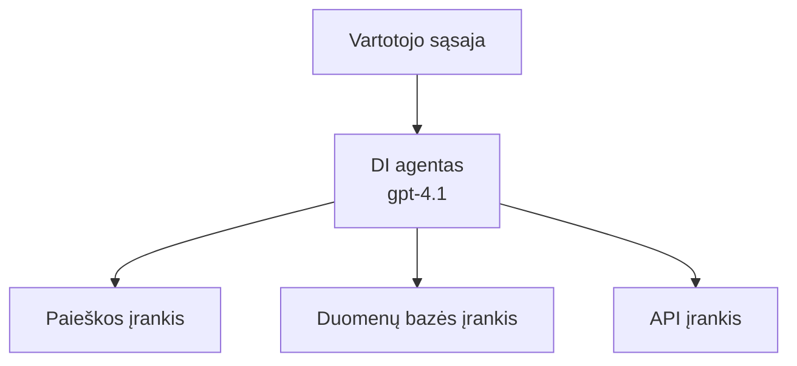
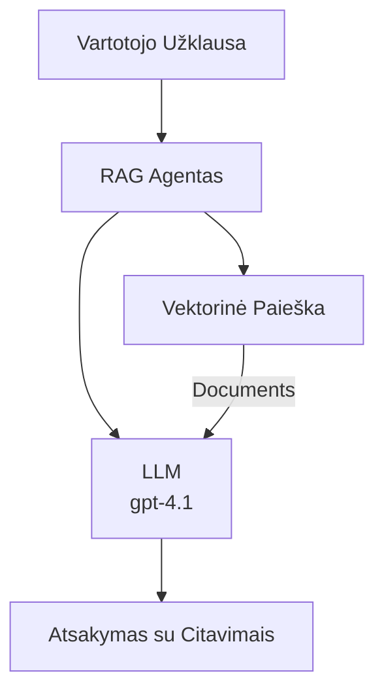
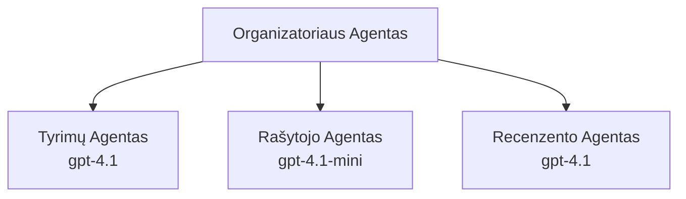

# AI agentai su Azure Developer CLI

**Skyriaus naršymas:**
- **📚 Kurso pradžia**: [AZD pradedantiesiems](../../README.md)
- **📖 Dabartinis skyrius**: 2 skyrius - Dirbtinio intelekto pirmenybės kūrimas
- **⬅️ Ankstesnis**: [Microsoft Foundry integracija](microsoft-foundry-integration.md)
- **➡️ Sekantis**: [DI modelio diegimas](ai-model-deployment.md)
- **🚀 Pažengusieji**: [Daugelio agentų sprendimai](../../examples/retail-scenario.md)

---

## Įvadas

DI agentai yra autonominės programos, kurios gali suvokti savo aplinką, priimti sprendimus ir imtis veiksmų siekdamos konkrečių tikslų. Skirtingai nuo paprastų pokalbių robotų, reaguojančių į užklausas, agentai gali:

- **Naudoti įrankius** - Skambinti API, ieškoti duomenų bazėse, vykdyti kodą
- **Planuoti ir mąstyti** - Suskaidyti sudėtingas užduotis į žingsnius
- **Mokytis iš konteksto** - Išlaikyti atmintį ir adaptuoti elgesį
- **Bendradarbiauti** - Dirbti su kitais agentais (daugelio agentų sistemos)

Šiame vadove rodoma, kaip diegti AI agentus Azure naudojant Azure Developer CLI (azd).

> **Patvirtinimo pastaba (2026-07-13):** Šis vadovas buvo peržiūrėtas su `azd` `1.27.1` ir `azure.ai.agents` `1.0.0-beta.5`. `azd ai` patirtis dar yra eksperimentinė, todėl, jei įdiegtos versijos skiriasi, patikrinkite plėtinio pagalbą.

## Mokymosi tikslai

Baigę šį vadovą, jūs:
- Suprasite, kas yra DI agentai ir kuo jie skiriasi nuo pokalbių robotų
- Išmoksite diegti paruoštus AI agentų šablonus naudojant AZD
- Sužinosite, kaip konfigūruoti Foundry agentus pritaikytiems agentams
- Įgyvendinsite pagrindinius agentų modelius (įrankių naudojimas, RAG, daugelio agentų sistemos)
- Stebėsite ir derinsite įdiegtus agentus

## Mokymosi pasiekimai

Baigę gebėsite:
- Vienu komandos įsakymu diegti AI agentų programas į Azure
- Konfigūruoti agentų įrankius ir funkcijas
- Įgyvendinti informacijos gavimu paremtą generavimą (RAG) su agentais
- Kurti daugelio agentų architektūras sudėtingiems darbo procesams
- Spręsti dažniausiai pasitaikančias agentų diegimo problemas

---

## 🤖 Kas skiria agentą nuo pokalbių roboto?

| Ypatybė | Pokalbių robotas | DI agentas |
|---------|------------------|-----------|
| **Elgesys** | Reaguoja į užklausas | Imasi autonominių veiksmų |
| **Įrankiai** | Nėra | Gali kviesti API, ieškoti, vykdyti kodą |
| **Atmintis** | Tik seanso | Nuolatinė atmintis per seansus |
| **Planavimas** | Vienkartinis atsakymas | Daugiažingsnis mąstymas |
| **Bendradarbiavimas** | Vienas subjektas | Gali dirbti su kitais agentais |

### Paprastas palyginimas

- **Pokalbių robotas** = Padedantis asmuo, atsakantis į klausimus informacijos punkte
- **DI agentas** = Asmeninis asistentas, galintis skambinti, užsakyti susitikimus ir atlikti užduotis už jus

---

## 🚀 Greitas pradžios vadovas: Įdiekite savo pirmąjį agentą

### Pasirinkimas 1: Foundry agentų šablonas (rekomenduojama)

```bash
# Inicializuoti DI agentų šabloną
azd init --template get-started-with-ai-agents

# Įdiegti į Azure
azd up
```

**Kas diegiama:**
- ✅ Foundry agentai
- ✅ Microsoft Foundry modeliai (gpt-4.1)
- ✅ Azure AI Search (RAG)
- ✅ Azure Container Apps (web sąsaja)
- ✅ Application Insights (stebėjimas)

**Laikas:** ~15-20 minučių
**Kaina:** ~$100-150/mėn (vystymui)

### Pasirinkimas 2: OpenAI agentas su Prompty

```bash
# Inicializuokite agento šabloną, pagrįstą Prompty
azd init --template agent-openai-python-prompty

# Diegti į Azure
azd up
```

**Kas diegiama:**
- ✅ Azure Functions (serverless agento vykdymas)
- ✅ Microsoft Foundry modeliai
- ✅ Prompty konfigūracijos failai
- ✅ Pavyzdinis agento įgyvendinimas

**Laikas:** ~10-15 minučių
**Kaina:** ~$50-100/mėn (vystymui)

### Pasirinkimas 3: RAG pokalbių agentas

```bash
# Inicializuoti RAG pokalbių šabloną
azd init --template azure-search-openai-demo

# Diegti į Azure
azd up
```

**Kas diegiama:**
- ✅ Microsoft Foundry modeliai
- ✅ Azure AI Search su pavyzdiniais duomenimis
- ✅ Dokumentų apdorojimo kanalas
- ✅ Pokalbių sąsaja su citatomis

**Laikas:** ~15-25 minučių
**Kaina:** ~$80-150/mėn (vystymui)

### Pasirinkimas 4: AZD AI agento inicializavimas (Manifeste arba šablone pagrįsta peržiūra)

Jei turite agento manifestą, galite naudoti `azd ai` komandą, kad tiesiogiai paruoštumėte Foundry agento paslaugos projektą. Naujausiuose peržiūros leidimuose taip pat pridėta šablonų pagrindu veikianti pradžios parama, todėl tikslus veikimo scenarijus gali šiek tiek skirtis priklausomai nuo įdiegtos plėtinio versijos.

```bash
# Įdiekite AI agentų plėtinį
azd extension install azure.ai.agents

# Pasirinktinai: patikrinkite įdiegtą peržiūros versiją
azd extension show azure.ai.agents

# Inicijuoti iš agento manifestų
azd ai agent init -m agent-manifest.yaml

# Diegti į Azure
azd up

# Išbandykite įdiegtą agentą (rodo delsą + laiką iki pirmojo baito)
azd ai agent invoke
```

**Kada naudoti `azd ai agent init` vs `azd init --template`:**

| Požiūris | Geriausias naudojimas | Kaip veikia |
|----------|---------------------|-----------|
| `azd init --template` | Pradedant nuo veikiamos pavyzdinės programos | Klonuojamas visas šablono repozitorijus su kodu ir infrastruktūra |
| `azd ai agent init -m` | Kuriant iš savo agento manifesto | Sukuriama projekto struktūra pagal jūsų agento aprašymą |

> **Patarimas:** Mokantis naudokite `azd init --template` (1-3 pasirinkimai aukščiau). Kuriant gamybos agentus su savo manifestais naudokite `azd ai agent init`.

Po `azd up` tas pats plėtinys padės visame agento gyvenimo cikle: `azd ai agent invoke` testavimui, `azd ai agent eval generate` ir `azd ai agent optimize` kokybės matavimui ir gerinimui, bei `azd ai agent delete` valymui. Daugiau informacijos žr. [AZD AI CLI komandos](../chapter-08-production/production-ai-practices.md#azd-ai-cli-commands-and-extensions).

---

## 🏗️ Agentų architektūros modeliai

### Modelis 1: Vienas agentas su įrankiais

Paprasčiausias agento modelis – vienas agentas, galintis naudoti kelis įrankius.



**Geriausiai tinka:**
- Klientų aptarnavimo robotams
- Tyrimų asistentams
- Duomenų analizės agentams

**AZD šablonas:** `azure-search-openai-demo`

### Modelis 2: RAG agentas (informacijos gavimu paremtas generavimas)

Agentas, kuris prieš generuodamas atsakymus surenka aktualius dokumentus.



**Geriausiai tinka:**
- Įmonių žinių bazėms
- Dokumentų klausimų ir atsakymų sistemoms
- Atitikties ir teisiniams tyrimams

**AZD šablonas:** `azure-search-openai-demo`

### Modelis 3: Daugelio agentų sistema

Keli specializuoti agentai, dirbantys kartu su sudėtingomis užduotimis.



**Geriausiai tinka:**
- Sudėtingam turinio generavimui
- Daugiažingsniams darbo procesams
- Užduotims, reikalaujančioms skirtingų kompetencijų

**Sužinokite daugiau:** [Daugelio agentų koordinavimo modeliai](../chapter-06-pre-deployment/coordination-patterns.md)

---

## ⚙️ Agentų įrankių konfigūravimas

Agentai tampa galingi, kai gali naudoti įrankius. Kaip konfigūruoti dažniausiai naudojamus įrankius:

### Įrankių konfigūravimas Foundry agentuose

```python
# agent_config.py
from azure.ai.projects import AIProjectClient
from azure.ai.projects.models import FunctionTool, CodeInterpreterTool

# Apibrėžti pasirinktinės priemonės
search_tool = FunctionTool(
    name="search_knowledge_base",
    description="Search the company knowledge base for relevant documents",
    parameters={
        "type": "object",
        "properties": {
            "query": {
                "type": "string",
                "description": "The search query"
            }
        },
        "required": ["query"]
    }
)

# Sukurti agentą su priemonėmis
agent = project_client.agents.create_agent(
    model="gpt-4.1",
    name="Support Agent",
    instructions="You are a helpful support agent. Use the search tool to find relevant information.",
    tools=[search_tool, CodeInterpreterTool()]
)
```

### Aplinkos konfigūravimas

```bash
# Nustatyti agentui specifinius aplinkos kintamuosius
azd env set AZURE_OPENAI_MODEL "gpt-4.1"
azd env set AGENT_INSTRUCTIONS "You are a helpful assistant..."
azd env set ENABLE_CODE_INTERPRETER "true"
azd env set ENABLE_FILE_SEARCH "true"

# Diegti su atnaujinta konfigūracija
azd deploy
```

---

## 📊 Agentų stebėjimas

### Application Insights integracija

Visi AZD agentų šablonai apima Application Insights stebėjimui:

```bash
# Atidaryti stebėjimo informacijos suvestinę
azd monitor --overview

# Peržiūrėti tiesioginius žurnalus
azd monitor --logs

# Peržiūrėti tiesioginius rodiklius
azd monitor --live
```

### Svarbūs stebėjimo rodikliai

| Rodiklis | Aprašymas | Tikslas |
|----------|-----------|---------|
| Atsakymo delsos laikas | Laikas generuoti atsakymui | < 5 sekundžių |
| Naudojamų žetonų kiekis | Žetonai už užklausą | Stebėti kainai |
| Įrankio skambučio sėkmės rodiklis | Sėkmingų įrankių vykdymų % | > 95% |
| Klaidos dažnis | Nepavykusių agento užklausų skaičius | < 1% |
| Vartotojų pasitenkinimas | Atsiliepimų įvertinimai | > 4.0/5.0 |

### Individualus žurnalavimas agentams

```python
import os
from azure.monitor.opentelemetry import configure_azure_monitor
from opentelemetry import trace

# Sukonfigūruokite Azure Monitor su OpenTelemetry
configure_azure_monitor(
    connection_string=os.environ["APPLICATIONINSIGHTS_CONNECTION_STRING"]
)

tracer = trace.get_tracer(__name__)

def log_agent_interaction(user_query, agent_response, tools_used, latency_ms):
    with tracer.start_as_current_span("agent_interaction") as span:
        span.set_attributes({
            "user_query": user_query,
            "response_length": len(agent_response),
            "tools_used": tools_used,
            "latency_ms": latency_ms
        })
```

> **Pastaba:** Įdiekite reikalingas paketas: `pip install azure-monitor-opentelemetry opentelemetry`

---

## 💰 Kainų apsvarstymai

### Apskaičiuotos mėnesinės sąnaudos pagal modelį

| Modelis | Vystymo aplinka | Gamyba |
|---------|-----------------|--------|
| Vienas agentas | $50-100 | $200-500 |
| RAG agentas | $80-150 | $300-800 |
| Daugelio agentų (2-3 agentai) | $150-300 | $500-1,500 |
| Enterprise daugelio agentų | $300-500 | $1,500-5,000+ |

### Patarimai kainų optimizavimui

1. **Naudokite gpt-4.1-mini paprastoms užduotims**
   ```bash
   azd env set AZURE_OPENAI_MODEL "gpt-4.1-mini"
   ```

2. **Įgyvendinkite kešavimą pasikartojančioms užklausoms**
   ```python
   from functools import lru_cache
   
   @lru_cache(maxsize=1000)
   def get_cached_response(query_hash):
       return agent.run(query_hash)
   ```

3. **Nustatykite žetonų limitus kiekvienam vykdymui**
   ```python
   # Nustatyti max_completion_tokens paleidžiant agentą, o ne kūrimo metu
   run = project_client.agents.create_run(
       thread_id=thread.id,
       agent_id=agent.id,
       max_completion_tokens=1000  # Riboti atsakymo ilgį
   )
   ```

4. **Nestabdytą mastelį sumažinkite iki nulio, kai nenaudojamas**
   ```bash
   # Container Apps automatiškai mažėja iki nulio
   azd env set MIN_REPLICAS "0"
   ```

---

## 🔧 Agentų trikčių šalinimas

### Dažnos problemos ir sprendimai

<details>
<summary><strong>❌ Agentas nereaguoja į įrankio skambučius</strong></summary>

```bash
# Patikrinkite, ar įrankiai tinkamai užregistruoti
azd show

# Patikrinkite OpenAI diegimą
az cognitiveservices account deployment list \
  --name $AZURE_OPENAI_NAME \
  --resource-group $RG_NAME

# Patikrinkite agentų žurnalus
azd monitor --logs
```

**Dažnos priežastys:**
- Įrankio funkcijos parašo neatitikimas
- Trūksta reikiamų leidimų
- API galinis taškas nepasiekiamas
</details>

<details>
<summary><strong>❌ Aukštas delsos laikas agento atsakymuose</strong></summary>

```bash
# Patikrinkite Application Insights dėl užsikimšimų
azd monitor --live

# Apsvarstykite galimybę naudoti greitesnį modelį
azd env set AZURE_OPENAI_MODEL "gpt-4.1-mini"
azd deploy
```

**Optimizavimo patarimai:**
- Naudokite srautinį atsakymą
- Įgyvendinkite atsakymų kešavimą
- Sumažinkite konteksto lango dydį
</details>

<details>
<summary><strong>❌ Agentas grąžina neteisingą arba išgalvotą informaciją</strong></summary>

```python
# Patobulinti su geresnėmis sistemos užklausomis
instructions = """
You are a helpful assistant. IMPORTANT:
- Only answer based on provided context
- If you don't know, say "I don't know"
- Always cite your sources
- Never make up information
"""

# Pridėti duomenų gavimą pagrindui
agent = project_client.agents.create_agent(
    model="gpt-4.1",
    instructions=instructions,
    tools=[FileSearchTool()]  # Pagrįsti atsakymus dokumentais
)
```
</details>

<details>
<summary><strong>❌ Viršytas žetonų limitas</strong></summary>

```python
# Įgyvendinti konteksto lango valdymą
def truncate_context(messages, max_tokens=8000, model="gpt-4.1"):
    """Keep only recent messages within token limit."""
    import tiktoken
    encoding = tiktoken.encoding_for_model(model)
    total_tokens = 0
    truncated = []
    
    for msg in reversed(messages):
        msg_tokens = len(encoding.encode(msg.content))
        if total_tokens + msg_tokens > max_tokens:
            break
        truncated.insert(0, msg)
        total_tokens += msg_tokens
    
    return truncated
```
</details>

---

## 🎓 Praktinės užduotys

### Užduotis 1: Įdiekite paprastą agentą (20 minučių)

**Tikslas:** Išplatinkite savo pirmąjį DI agentą naudojant AZD

```bash
# 1 žingsnis: Inicializuoti šabloną
azd init --template get-started-with-ai-agents

# 2 žingsnis: Prisijungti prie Azure
azd auth login
# Jei dirbate su skirtingais nuomininkais, pridėkite --tenant-id <tenant-id>

# 3 žingsnis: Diegti
azd up

# 4 žingsnis: Išbandyti agentą
# Tikėtinas išvestis po diegimo:
#   Diegimas baigtas!
#   Galutinis taškas: https://<app-name>.<region>.azurecontainerapps.io
# Atidarykite URL, parodytą išvestyje, ir bandykite užduoti klausimą

# 5 žingsnis: Peržiūrėti monitoringo duomenis
azd monitor --overview

# 6 žingsnis: Išvalyti aplinką
azd down --force --purge
```

**Sėkmės kriterijai:**
- [ ] Agentas atsako į klausimus
- [ ] Gali pasiekti stebėjimo skydelį per `azd monitor`
- [ ] Ištekliai sėkmingai išvalyti

### Užduotis 2: Pridėkite pasirinktą įrankį (30 minučių)

**Tikslas:** Praplėskite agentą su pasirinktu įrankiu

1. Įdiekite agento šabloną:
   ```bash
   azd init --template get-started-with-ai-agents
   azd up
   ```
2. Sukurkite naują įrankio funkciją agento kode:
   ```python
   def get_weather(location: str) -> str:
       """Get current weather for a location."""
       # API kvietimas orų tarnybai
       return f"Weather in {location}: Sunny, 72°F"
   ```
3. Užregistruokite įrankį su agentu:
   ```python
   from azure.ai.projects.models import FunctionTool

   weather_tool = FunctionTool(
       name="get_weather",
       description="Get current weather for a location",
       parameters={
           "type": "object",
           "properties": {
               "location": {"type": "string", "description": "City name"}
           },
           "required": ["location"]
       }
   )

   agent = project_client.agents.create_agent(
       model="gpt-4.1",
       name="Weather Agent",
       tools=[weather_tool]
   )
   ```
4. Perdiegtite ir išbandykite:
   ```bash
   azd deploy
   # Paklauskite: "Koks oras Sietle?"
   # Lūkėtina: Agentas iškviečia get_weather("Seattle") ir pateikia orų informaciją
   ```

**Sėkmės kriterijai:**
- [ ] Agentas atpažįsta su oru susijusius klausimus
- [ ] Įrankis kviečiamas teisingai
- [ ] Atsakymas apima orų informaciją

### Užduotis 3: Sukurkite RAG agentą (45 minutės)

**Tikslas:** Sukurkite agentą, kuris atsako į klausimus iš jūsų dokumentų

```bash
# 1 žingsnis: Diegti RAG šabloną
azd init --template azure-search-openai-demo
azd up

# 2 žingsnis: Įkelkite savo dokumentus
# Įdėkite PDF/TXT failus į data/ katalogą, tada vykdykite:
python scripts/prepdocs.py

# 3 žingsnis: Išbandykite su domenui specifiniais klausimais
# Atidarykite žiniatinklio programos URL iš azd up išvesties
# Užduokite klausimus apie savo įkeltus dokumentus
# Atsakymai turėtų apimti citatų nuorodas, pvz., [doc.pdf]
```

**Sėkmės kriterijai:**
- [ ] Agentas atsako remdamasis įkeltomis dokumentų medžiagomis
- [ ] Atsakymuose yra nuorodų į šaltinius
- [ ] Nėra išgalvotos informacijos neapimantiems klausimams

---

## 📚 Tolimesni žingsniai

Kai suprantate DI agentus, tyrinėkite šias pažangias temas:

| Tema | Aprašymas | Nuoroda |
|-------|------------|---------|
| **Daugelio agentų sistemos** | Kurkite sistemas su keliais bendradarbiaujančiais agentais | [Daugelio agentų mažmeninės prekybos pavyzdys](../../examples/retail-scenario.md) |
| **Koordinavimo modeliai** | Sužinokite apie orkestracijos ir komunikacijos modelius | [Koordinavimo modeliai](../chapter-06-pre-deployment/coordination-patterns.md) |
| **Gamybos diegimas** | Įmonėms skirtas agentų diegimas | [Gamybos DI praktikos](../chapter-08-production/production-ai-practices.md) |
| **Agentų vertinimas** | Testuokite ir vertinkite agentų veikimą | [DI trikčių šalinimas](../chapter-07-troubleshooting/ai-troubleshooting.md) |
| **DI dirbtuvės laboratorija** | Praktika: paruoškite savo DI sprendimą AZD | [DI dirbtuvės laboratorija](ai-workshop-lab.md) |

---

## 📖 Papildomi ištekliai

### Oficiali dokumentacija
- [Microsoft Foundry Agent Service](https://learn.microsoft.com/azure/ai-services/agents/)
- [Microsoft Foundry Agent Service Quickstart](https://learn.microsoft.com/azure/ai-services/agents/quickstart)
- [Semantic Kernel Agent Framework](https://learn.microsoft.com/semantic-kernel/)

### AZD šablonai agentams
- [Pradėkite dirbti su DI agentais](https://github.com/Azure-Samples/get-started-with-ai-agents)
- [Agentas OpenAI Python Prompty](https://github.com/Azure-Samples/agent-openai-python-prompty)
- [Azure Search OpenAI demonstracija](https://github.com/Azure-Samples/azure-search-openai-demo)

### Bendruomenės ištekliai
- [Awesome AZD - Agentų šablonai](https://azure.github.io/awesome-azd/?tags=ai-agents)
- [Azure AI Discord](https://discord.gg/microsoft-azure)
- [Microsoft Foundry Discord](https://discord.gg/nTYy5BXMWG)

### Agentų įgūdžiai jūsų redaktoriui
- [**Microsoft Azure Agent Skills**](https://skills.sh/microsoft/github-copilot-for-azure) - Įdiekite pakartotinai naudojamus AI agentų įgūdžius Azure kūrimui GitHub Copilot, Cursor ar kitame palaikomame agentų įrankyje. Įtraukta įgūdžių apie [Azure AI](https://skills.sh/microsoft/github-copilot-for-azure/azure-ai), [Microsoft Foundry](https://skills.sh/microsoft/github-copilot-for-azure/microsoft-foundry), [diegimą](https://skills.sh/microsoft/github-copilot-for-azure/azure-deploy) ir [diagnostiką](https://skills.sh/microsoft/github-copilot-for-azure/azure-diagnostics):
  ```bash
  npx skills add microsoft/github-copilot-for-azure
  ```

---

**Naršymas**
- **Ankstesnė pamoka**: [Microsoft Foundry integracija](microsoft-foundry-integration.md)
- **Kita pamoka**: [DI modelio diegimas](ai-model-deployment.md)

---

<!-- CO-OP TRANSLATOR DISCLAIMER START -->
**Atsakomybės apribojimas**:
Šis dokumentas buvo išverstas naudojant dirbtinio intelekto vertimo paslaugą [Co-op Translator](https://github.com/Azure/co-op-translator). Nors siekiame tikslumo, prašome atkreipti dėmesį, kad automatiniai vertimai gali turėti klaidų ar netikslumų. Originalus dokumentas jo gimtąja kalba laikomas autoritetingu šaltiniu. Svarbiai informacijai rekomenduojama naudoti profesionalų žmogiškąjį vertimą. Mes neatsakome už jokius nesusipratimus ar neteisingą interpretaciją, kilusią naudojantis šiuo vertimu.
<!-- CO-OP TRANSLATOR DISCLAIMER END -->