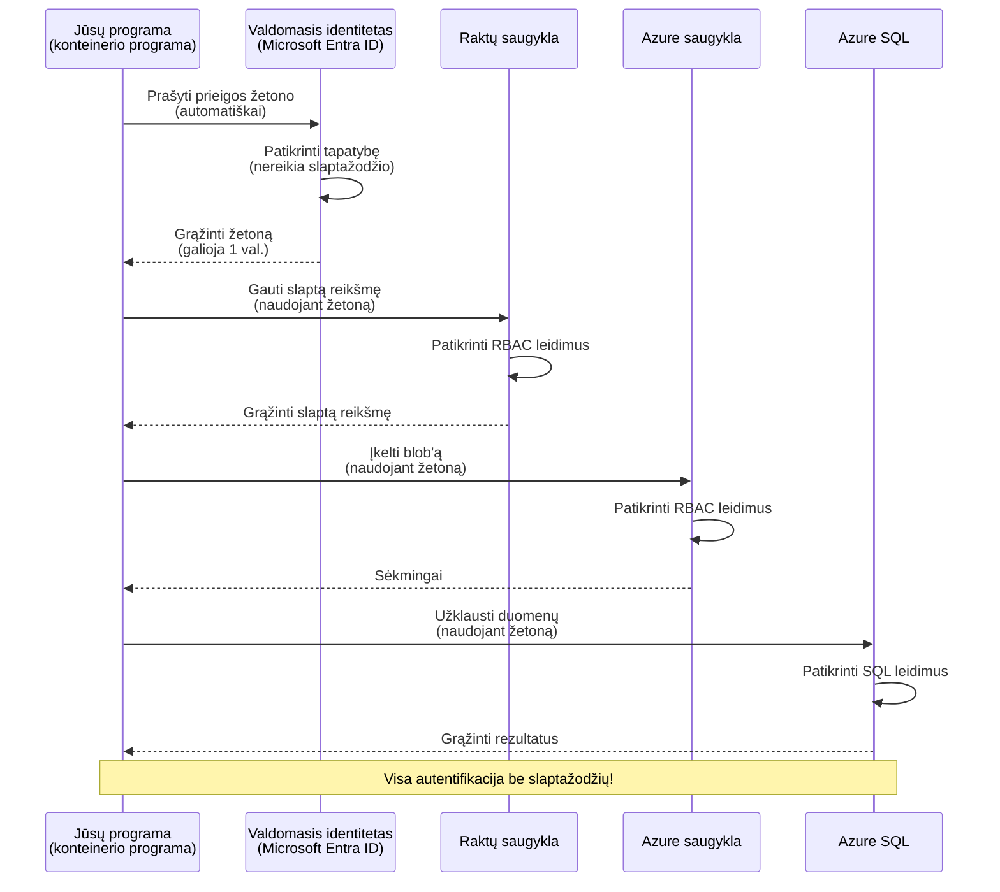
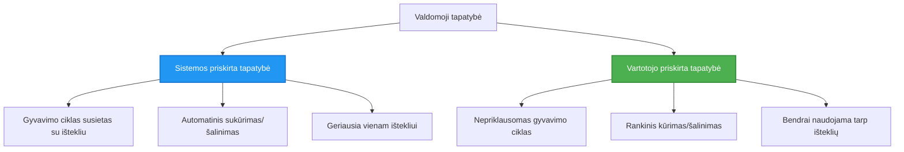

# Autentifikacijos modeliai ir valdomoji tapatybė

⏱️ **Apskaičiuotas laikas**: 45–60 minučių | 💰 **Kainos poveikis**: Nemokama (jokių papildomų mokesčių) | ⭐ **Sudėtingumas**: Vidutinis

**📚 Mokymosi kelias:**
- ← Ankstesnis: [Konfigūracijų valdymas](configuration.md) - Aplinkos kintamųjų ir slaptųjų duomenų valdymas
- 🎯 **Jūs esate čia**: Autentifikacija ir saugumas (valdomoji tapatybė, Key Vault, saugūs modeliai)
- → Toliau: [Pirmasis projektas](first-project.md) - Sukurkite savo pirmąją AZD programą
- 🏠 [Kurso pradžia](../../README.md)

---

## Ko išmoksit

Baigę šią pamoką jūs:
- Suprasite Azure autentifikacijos modelius (raktai, ryšio eilutės, valdomoji tapatybė)
- Įgyvendinsite **valdomąją tapatybę** be slaptažodžių
- Apsaugosite slaptus duomenis integruojant su **Azure Key Vault**
- Konfigūruosite **pagrindu paremtą prieigos valdymą (RBAC)** AZD diegimams
- Taikysite saugumo gerąsias praktikas Container Apps ir Azure paslaugoms
- Migracijos iš raktų pagrindo į identiteto pagrindu veikiančią autentifikaciją

## Kodėl valdomoji tapatybė yra svarbi

### Problema: tradicinė autentifikacija

**Prieš valdomąją tapatybę:**
```javascript
// ❌ SAUGUMO RIZIKA: Kode tiesiogiai įrašytos paslaptys
const connectionString = "Server=mydb.database.windows.net;User=admin;Password=P@ssw0rd123";
const storageKey = "xK7mN9pQ2wR5tY8uI0oP3aS6dF1gH4jK...";
const cosmosKey = "C2x7B9n4M1p8Q5w3E6r0T2y5U8i1O4p7...";
```

**Problemos:**
- 🔴 **Išryškinti slaptieji duomenys** kode, konfigūracijos failuose, aplinkos kintamuosiuose
- 🔴 **Kredencialų keitimas** reikalauja kodo pakeitimų ir pakartotinio diegimo
- 🔴 **Auditavimo košmarai** - kas ką ir kada pasiekė?
- 🔴 **Išsibarsčiusios saugyklos** - slaptieji duomenys pasklidę po daugelį sistemų
- 🔴 **Atitikties rizikos** - nepraeina saugumo auditų

### Sprendimas: valdomoji tapatybė

**Po valdomosios tapatybės:**
```javascript
// ✅ SAUGU: Nėra slaptų duomenų kode
const credential = new DefaultAzureCredential();
const client = new BlobServiceClient(
  "https://mystorageaccount.blob.core.windows.net",
  credential  // Azure automatiškai tvarko autentifikaciją
);
```

**Privalumai:**
- ✅ **Nėra jokių slaptažodžių** kode ar konfiguracijoje
- ✅ **Automatinis keitimas** - Azure tvarko
- ✅ **Pilnas auditavimo įrašas** Microsoft Entra ID žurnaluose
- ✅ **Centralizuotas saugumas** - valdykite per Azure Portal
- ✅ **Paruošta atitiktims** - atitinka saugumo standartus

**Analogija**: Tradicinė autentifikacija panaši į kelių fizinių raktų nešiojimąsi skirtingoms durims. Valdomoji tapatybė yra kaip saugumo ženklelis, kuris automatiškai suteikia prieigą pagal jūsų tapatybę — nėra raktų, kuriuos būtų galima pamesti, nukopijuoti ar keisti.

---

## Architektūros apžvalga

### Autentifikacijos srautas su valdomąja tapatybe



### Valdomųjų tapatybių tipai



| Funkcija | Sistemos priskirta | Vartotojo priskirta |
|---------|----------------|---------------|
| **Gyvavimo ciklas** | Priklauso resursui | Nepriklausoma |
| **Sukūrimas** | Automatinis kartu su resursu | Sukuriama rankiniu būdu |
| **Ištrynimas** | Ištrinama kartu su resursu | Išlieka po resurso ištrynimo |
| **Bendrinimas** | Tik vienam resursui | Keliems resursams |
| **Naudojimo scenarijus** | Paprasti scenarijai | Sudėtingi kelių resursų scenarijai |
| **AZD numatytasis** | ✅ Rekomenduojama | Pasirinktinai |

---

## Išankstiniai reikalavimai

### Reikalingi įrankiai

Turėtumėte jau būti įdiegę šiuos dalykus iš ankstesnių pamokų:

```bash
# Patikrinkite Azure Developer CLI
azd version
# ✅ Tikimasi: azd versija 1.0.0 arba naujesnė

# Patikrinkite Azure CLI
az --version
# ✅ Tikimasi: azure-cli versija 2.50.0 arba naujesnė
```

### Azure reikalavimai

- Aktyvi Azure prenumerata
- Teisės:
  - Kurti valdomąsias tapatybes
  - Priskirti RBAC vaidmenis
  - Kurti Key Vault išteklius
  - Diegti Container Apps

### Reikalingos žinios

Turėtumėte būti baigę:
- [Įdiegimo vadovas](installation.md) - AZD sąranka
- [AZD pagrindai](azd-basics.md) - Pagrindinės sąvokos
- [Konfigūracijų valdymas](configuration.md) - Aplinkos kintamieji

---

## Pamoka 1: Autentifikacijos modelių supratimas

### Modelis 1: Ryšio eilutės (senoviškas - vengti)

**Kaip tai veikia:**
```bash
# Ryšio eilutė turi autentifikavimo duomenis
STORAGE_CONNECTION_STRING="DefaultEndpointsProtocol=https;AccountName=myaccount;AccountKey=xK7mN9pQ2wR5..."
COSMOS_CONNECTION_STRING="AccountEndpoint=https://myaccount.documents.azure.com:443/;AccountKey=C2x7..."
SQL_CONNECTION_STRING="Server=myserver.database.windows.net;User=admin;Password=P@ssw0rd..."
```

**Problemos:**
- ❌ Slapti duomenys matomi aplinkos kintamuosiuose
- ❌ Įrašomi diegimo sistemose
- ❌ Sunku keisti periodiškai
- ❌ Nėra prieigos auditavimo įrašo

**Kada naudoti:** Tik vietiniam vystymui, niekada gamyboje.

---

### Modelis 2: Key Vault nuorodos (geriau)

**Kaip tai veikia:**
```bicep
// Store secret in Key Vault
resource keyVault 'Microsoft.KeyVault/vaults@2023-02-01' = {
  name: 'mykv'
  properties: {
    enableRbacAuthorization: true
  }
}

// Reference in Container App
env: [
  {
    name: 'STORAGE_KEY'
    secretRef: 'storage-key'  // References Key Vault
  }
]
```

**Privalumai:**
- ✅ Slaptieji duomenys saugomi saugiai Key Vault
- ✅ Centralizuotas slaptųjų duomenų valdymas
- ✅ Keitimas be kodo pakeitimų

**Apribojimai:**
- ⚠️ Vis tiek naudojami raktai / slaptažodžiai
- ⚠️ Reikia valdyti prieigą prie Key Vault

**Kada naudoti:** Pereinamasis žingsnis nuo ryšio eilutės prie valdomosios tapatybės.

---

### Modelis 3: Valdomoji tapatybė (geriausia praktika)

**Kaip tai veikia:**
```bicep
// Enable managed identity
resource containerApp 'Microsoft.App/containerApps@2023-05-01' = {
  name: 'myapp'
  identity: {
    type: 'SystemAssigned'  // Automatically creates identity
  }
}

// Grant permissions
resource roleAssignment 'Microsoft.Authorization/roleAssignments@2022-04-01' = {
  scope: storageAccount
  properties: {
    roleDefinitionId: storageBlobDataContributorRole
    principalId: containerApp.identity.principalId
  }
}
```

**Programos kodas:**
```javascript
// Jokių paslapčių nereikia!
const { DefaultAzureCredential } = require('@azure/identity');
const { BlobServiceClient } = require('@azure/storage-blob');

const credential = new DefaultAzureCredential();
const blobServiceClient = new BlobServiceClient(
  'https://mystorageaccount.blob.core.windows.net',
  credential
);
```

**Privalumai:**
- ✅ Nėra slaptažodžių kode / konfiguracijoje
- ✅ Automatinis kredencialų keitimas
- ✅ Pilnas auditavimo įrašas
- ✅ Leidimai pagal RBAC
- ✅ Paruošta atitiktims

**Kada naudoti:** Visada, gamybos programoms.

---

### Modelis 4: Service Principals (CI/CD ir automatizavimas)

Valdomoji tapatybė yra auksinė norma resursams, veikiančioms Azure viduje. Bet kas, jei kažkas veikia už Azure ribų — pvz., CI/CD pipeline ant build agento, arba skriptas jūsų nešiojamajame kompiuteryje, kuris negali naudoti interaktyvaus prisijungimo? Tuomet praverčia **service principal**: nežmogiška tapatybė su savo kredencialais, kaip kuria automatizuotas procesas gali prisijungti.

**Kaip tai veikia:**

Sukurkite service principal, apribotą resursų grupei (mažiausios privilegijos):

```bash
az ad sp create-for-rbac \
  --name "myapp-cicd" \
  --role contributor \
  --scopes /subscriptions/<sub-id>/resourceGroups/<rg-name>
```

Tai atspausdins client ID, client secret ir tenant ID. azd gali prisijungti su jais be sąveikos:

```bash
azd auth login \
  --client-id "<appId>" \
  --client-secret "<password>" \
  --tenant-id "<tenant>"
```

**Pirmenybę teikite federuotoms kredencialams (OIDC) vietoje slaptažodžių.** Vietoje ilgalaikio kliento slaptažodžio sukonfigūruokite federuotą kredencialą, kad pipeline apsikeistų trumpalaikiu žetonu — nėra slaptaždžio, kurį reikėtų nutekinti ar keisti:

```bash
azd auth login \
  --client-id "<appId>" \
  --federated-credential-provider "github" \
  --tenant-id "<tenant>"
```

> `azd pipeline config` tai nustato jums automatiškai. Peržiūrėkite CI/CD pamokas [8 skyriuje](../chapter-08-production/production-ai-practices.md).

**Privalumai:**
- ✅ Veikia už Azure ribų (build agentai, on-prem, kiti debesys)
- ✅ Gali būti apribotas vienai resursų grupei su vienu vaidmeniu
- ✅ Federuotas (OIDC) variantas nenaudoja saugomų slaptažodžių

**Kompromisai:**
- ⚠️ Slaptažodais pagrįstas variantas reikalauja kruopštaus saugojimo ir keitimo
- ⚠️ Nutekėjęs slaptažodis suteikia visas service principal galimybes — ribokite apimtis

**Kada naudoti:** CI/CD pipelines ir automatizavimas, kurie negali naudoti valdomosios tapatybės. Visada teikite pirmenybę **federuotam/OIDC** variantui vietoje kliento slaptažodžio, ir teikite pirmenybę valdomajai tapatybei, kai darbo krūvis veikia Azure.

**Kaip saugiai saugoti kredencialus:**
- Niekada neįtraukti slaptažodžių į versijų valdymą — naudokite jūsų pipeline slaptažodžių saugyklą (GitHub Actions secrets, Azure DevOps variable groups / Key Vault).
- Apribokite SP prie mažiausio reikalingo vaidmens ir resursų grupės.
- Nustatykite galiojimo laiką ir keiskite, arba visiškai atsisakykite slaptažodžio naudodami OIDC.

---

## Pamoka 2: Valdomosios tapatybės įgyvendinimas su AZD

### Įgyvendinimas žingsnis po žingsnio

Sukurkime saugią Container App, kuri naudoja valdomąją tapatybę prieigai prie Azure Storage ir Key Vault.

### Projekto struktūra

```
secure-app/
├── azure.yaml                 # AZD configuration
├── infra/
│   ├── main.bicep            # Main infrastructure
│   ├── core/
│   │   ├── identity.bicep    # Managed identity setup
│   │   ├── keyvault.bicep    # Key Vault configuration
│   │   └── storage.bicep     # Storage with RBAC
│   └── app/
│       └── container-app.bicep
└── src/
    ├── app.js                # Application code
    ├── package.json
    └── Dockerfile
```

### 1. Konfigūruokite AZD (azure.yaml)

```yaml
name: secure-app
metadata:
  template: secure-app@1.0.0

services:
  api:
    project: ./src
    language: js
    host: containerapp

# Enable managed identity (AZD handles this automatically)
```

### 2. Infrastruktūra: įgalinti valdomąją tapatybę

**Failas: `infra/main.bicep`**

```bicep
targetScope = 'subscription'

param environmentName string
param location string = 'eastus'

var tags = { 'azd-env-name': environmentName }

// Resource group
resource rg 'Microsoft.Resources/resourceGroups@2021-04-01' = {
  name: 'rg-${environmentName}'
  location: location
  tags: tags
}

// Storage Account
module storage './core/storage.bicep' = {
  name: 'storage'
  scope: rg
  params: {
    name: 'st${uniqueString(rg.id)}'
    location: location
    tags: tags
  }
}

// Key Vault
module keyVault './core/keyvault.bicep' = {
  name: 'keyvault'
  scope: rg
  params: {
    name: 'kv-${uniqueString(rg.id)}'
    location: location
    tags: tags
  }
}

// Container App with Managed Identity
module containerApp './app/container-app.bicep' = {
  name: 'container-app'
  scope: rg
  params: {
    name: 'ca-${environmentName}'
    location: location
    tags: tags
    storageAccountName: storage.outputs.name
    keyVaultName: keyVault.outputs.name
  }
}

// Grant Container App access to Storage
module storageRoleAssignment './core/role-assignment.bicep' = {
  name: 'storage-role'
  scope: rg
  params: {
    principalId: containerApp.outputs.identityPrincipalId
    roleDefinitionId: 'ba92f5b4-2d11-453d-a403-e96b0029c9fe'  // Storage Blob Data Contributor
    targetResourceId: storage.outputs.id
  }
}

// Grant Container App access to Key Vault
module kvRoleAssignment './core/role-assignment.bicep' = {
  name: 'kv-role'
  scope: rg
  params: {
    principalId: containerApp.outputs.identityPrincipalId
    roleDefinitionId: '4633458b-17de-408a-b874-0445c86b69e6'  // Key Vault Secrets User
    targetResourceId: keyVault.outputs.id
  }
}

// Outputs
output AZURE_STORAGE_ACCOUNT_NAME string = storage.outputs.name
output AZURE_KEY_VAULT_NAME string = keyVault.outputs.name
output APP_URL string = containerApp.outputs.url
```

### 3. Container App su sistemos priskirta tapatybe

**Failas: `infra/app/container-app.bicep`**

```bicep
param name string
param location string
param tags object = {}
param storageAccountName string
param keyVaultName string

resource containerApp 'Microsoft.App/containerApps@2023-05-01' = {
  name: name
  location: location
  tags: tags
  identity: {
    type: 'SystemAssigned'  // 🔑 Enable managed identity
  }
  properties: {
    configuration: {
      ingress: {
        external: true
        targetPort: 3000
      }
    }
    template: {
      containers: [
        {
          name: 'api'
          image: 'myregistry.azurecr.io/api:latest'
          resources: {
            cpu: json('0.5')
            memory: '1Gi'
          }
          env: [
            {
              name: 'AZURE_STORAGE_ACCOUNT_NAME'
              value: storageAccountName
            }
            {
              name: 'AZURE_KEY_VAULT_NAME'
              value: keyVaultName
            }
            // 🔑 No secrets - managed identity handles authentication!
          ]
        }
      ]
    }
  }
}

// Output the identity for RBAC assignments
output identityPrincipalId string = containerApp.identity.principalId
output id string = containerApp.id
output url string = 'https://${containerApp.properties.configuration.ingress.fqdn}'
```

### 4. RBAC vaidmenų priskyrimo modulis

**Failas: `infra/core/role-assignment.bicep`**

```bicep
param principalId string
param roleDefinitionId string  // Azure built-in role ID
param targetResourceId string

resource roleAssignment 'Microsoft.Authorization/roleAssignments@2022-04-01' = {
  name: guid(principalId, roleDefinitionId, targetResourceId)
  scope: resourceId('Microsoft.Resources/resourceGroups', resourceGroup().name)
  properties: {
    roleDefinitionId: subscriptionResourceId('Microsoft.Authorization/roleDefinitions', roleDefinitionId)
    principalId: principalId
    principalType: 'ServicePrincipal'
  }
}

output id string = roleAssignment.id
```

### 5. Programos kodas su valdomąja tapatybe

**Failas: `src/app.js`**

```javascript
const express = require('express');
const { DefaultAzureCredential } = require('@azure/identity');
const { BlobServiceClient } = require('@azure/storage-blob');
const { SecretClient } = require('@azure/keyvault-secrets');

const app = express();
const PORT = process.env.PORT || 3000;

// 🔑 Inicializuoti kredencialą (veikia automatiškai su valdomu identitetu)
const credential = new DefaultAzureCredential();

// Azure saugyklos nustatymas
const storageAccountName = process.env.AZURE_STORAGE_ACCOUNT_NAME;
const blobServiceClient = new BlobServiceClient(
  `https://${storageAccountName}.blob.core.windows.net`,
  credential  // Raktų nereikia!
);

// Key Vault nustatymas
const keyVaultName = process.env.AZURE_KEY_VAULT_NAME;
const secretClient = new SecretClient(
  `https://${keyVaultName}.vault.azure.net`,
  credential  // Raktų nereikia!
);

// Sveikatos patikra
app.get('/health', (req, res) => {
  res.json({ status: 'healthy', authentication: 'managed-identity' });
});

// Įkelti failą į blob saugyklą
app.post('/upload', async (req, res) => {
  try {
    const containerClient = blobServiceClient.getContainerClient('uploads');
    await containerClient.createIfNotExists();
    
    const blobName = `file-${Date.now()}.txt`;
    const blockBlobClient = containerClient.getBlockBlobClient(blobName);
    
    await blockBlobClient.upload('Hello from managed identity!', 30);
    
    res.json({
      success: true,
      blobName: blobName,
      message: 'File uploaded using managed identity!'
    });
  } catch (error) {
    console.error('Upload error:', error);
    res.status(500).json({ error: error.message });
  }
});

// Gauti slaptį iš Key Vault
app.get('/secret/:name', async (req, res) => {
  try {
    const secretName = req.params.name;
    const secret = await secretClient.getSecret(secretName);
    
    res.json({
      name: secretName,
      value: secret.value,
      message: 'Secret retrieved using managed identity!'
    });
  } catch (error) {
    console.error('Secret error:', error);
    res.status(500).json({ error: error.message });
  }
});

// Išvardinti blob konteinerius (parodo skaitymo prieigą)
app.get('/containers', async (req, res) => {
  try {
    const containers = [];
    for await (const container of blobServiceClient.listContainers()) {
      containers.push(container.name);
    }
    
    res.json({
      containers: containers,
      count: containers.length,
      message: 'Containers listed using managed identity!'
    });
  } catch (error) {
    console.error('List error:', error);
    res.status(500).json({ error: error.message });
  }
});

app.listen(PORT, () => {
  console.log(`Secure API listening on port ${PORT}`);
  console.log('Authentication: Managed Identity (passwordless)');
});
```

**Failas: `src/package.json`**

```json
{
  "name": "secure-app",
  "version": "1.0.0",
  "dependencies": {
    "express": "^4.18.2",
    "@azure/identity": "^4.0.0",
    "@azure/storage-blob": "^12.17.0",
    "@azure/keyvault-secrets": "^4.7.0"
  },
  "scripts": {
    "start": "node app.js"
  }
}
```

### 6. Diegimas ir testavimas

```bash
# Inicijuoti AZD aplinką
azd init

# Diegti infrastruktūrą ir programą
azd up

# Gauti programos URL
APP_URL=$(azd env get-values | grep APP_URL | cut -d '=' -f2 | tr -d '"')

# Išbandyti sveikatos patikrą
curl $APP_URL/health
```

**✅ Tikėtinas rezultatas:**
```json
{
  "status": "healthy",
  "authentication": "managed-identity"
}
```

**Blob įkėlimo testas:**
```bash
curl -X POST $APP_URL/upload
```

**✅ Tikėtinas rezultatas:**
```json
{
  "success": true,
  "blobName": "file-1700404800000.txt",
  "message": "File uploaded using managed identity!"
}
```

**Konteinerių sąrašo testas:**
```bash
curl $APP_URL/containers
```

**✅ Tikėtinas rezultatas:**
```json
{
  "containers": ["uploads"],
  "count": 1,
  "message": "Containers listed using managed identity!"
}
```

---

## Dažnai naudojami Azure RBAC vaidmenys

### Numatyti vaidmenų ID valdomajai tapatybei

| Paslauga | Vaidmens pavadinimas | Role ID | Leidimai |
|---------|-----------|---------|-------------|
| **Storage** | Storage Blob Data Reader | `2a2b9908-6b94-4a3d-8e5a-a7d8f8cc8a12` | Skaityti blob'us ir konteinerius |
| **Storage** | Storage Blob Data Contributor | `ba92f5b4-2d11-453d-a403-e96b0029c9fe` | Skaityti, rašyti, šalinti blob'us |
| **Storage** | Storage Queue Data Contributor | `974c5e8b-45b9-4653-ba55-5f855dd0fb88` | Skaityti, rašyti, šalinti eilių žinutes |
| **Key Vault** | Key Vault Secrets User | `4633458b-17de-408a-b874-0445c86b69e6` | Skaityti slaptuosius duomenis |
| **Key Vault** | Key Vault Secrets Officer | `b86a8fe4-44ce-4948-aee5-eccb2c155cd7` | Skaityti, rašyti, šalinti slaptuosius duomenis |
| **Cosmos DB** | Cosmos DB Built-in Data Reader | `00000000-0000-0000-0000-000000000001` | Skaityti Cosmos DB duomenis |
| **Cosmos DB** | Cosmos DB Built-in Data Contributor | `00000000-0000-0000-0000-000000000002` | Skaityti ir rašyti Cosmos DB duomenis |
| **SQL Database** | SQL DB Contributor | `9b7fa17d-e63e-47b0-bb0a-15c516ac86ec` | Tvarkyti SQL duomenų bazes |
| **Service Bus** | Azure Service Bus Data Owner | `090c5cfd-751d-490a-894a-3ce6f1109419` | Siųsti, gauti ir valdyti žinutes |

### Kaip rasti vaidmenų ID

```bash
# Išvardinti visus integruotus vaidmenis
az role definition list --query "[].{Name:roleName, ID:name}" --output table

# Ieškoti konkretaus vaidmens
az role definition list --query "[?contains(roleName, 'Storage Blob')].{Name:roleName, ID:name}" --output table

# Gauti vaidmens informaciją
az role definition list --name "Storage Blob Data Contributor"
```

---

## Praktiniai uždaviniai

### Uždavinys 1: Įgalinti valdomąją tapatybę esamai programai ⭐⭐ (Vidutinio sudėtingumo)

**Tikslas**: Pridėti valdomąją tapatybę esamame Container App diegime

**Scenarijus**: Turite Container App, naudojančią ryšio eilutes. Konvertuokite ją į valdomąją tapatybę.

**Pradinė būsena**: Container App su šia konfigūracija:

```bicep
// ❌ Current: Using connection string
env: [
  {
    name: 'STORAGE_CONNECTION_STRING'
    secretRef: 'storage-connection'
  }
]
```

**Veiksmai**:

1. **Įgalinkite valdomąją tapatybę Bicep:**

```bicep
resource containerApp 'Microsoft.App/containerApps@2023-05-01' = {
  name: 'myapp'
  identity: {
    type: 'SystemAssigned'  // Add this
  }
  // ... rest of configuration
}
```

2. **Suteikite prieigą prie Storage:**

```bicep
// Get storage account reference
resource storageAccount 'Microsoft.Storage/storageAccounts@2023-01-01' existing = {
  name: storageAccountName
}

// Assign role
resource roleAssignment 'Microsoft.Authorization/roleAssignments@2022-04-01' = {
  name: guid(containerApp.id, 'ba92f5b4-2d11-453d-a403-e96b0029c9fe', storageAccount.id)
  scope: storageAccount
  properties: {
    roleDefinitionId: subscriptionResourceId('Microsoft.Authorization/roleDefinitions', 'ba92f5b4-2d11-453d-a403-e96b0029c9fe')
    principalId: containerApp.identity.principalId
    principalType: 'ServicePrincipal'
  }
}
```

3. **Atnaujinkite programos kodą:**

**Prieš (ryšio eilutė):**
```javascript
const { BlobServiceClient } = require('@azure/storage-blob');

const blobServiceClient = BlobServiceClient.fromConnectionString(
  process.env.STORAGE_CONNECTION_STRING
);
```

**Po (valdomoji tapatybė):**
```javascript
const { DefaultAzureCredential } = require('@azure/identity');
const { BlobServiceClient } = require('@azure/storage-blob');

const credential = new DefaultAzureCredential();
const blobServiceClient = new BlobServiceClient(
  `https://${process.env.STORAGE_ACCOUNT_NAME}.blob.core.windows.net`,
  credential
);
```

4. **Atnaujinkite aplinkos kintamuosius:**

```bicep
env: [
  {
    name: 'STORAGE_ACCOUNT_NAME'
    value: storageAccountName  // Just the name, no secrets!
  }
  // Remove STORAGE_CONNECTION_STRING
]
```

5. **Diegti ir testuoti:**

```bash
# Įdiegti iš naujo
azd up

# Patikrinkite, ar vis dar veikia
curl https://myapp.azurecontainerapps.io/upload
```

**✅ Sėkmės kriterijai:**
- ✅ Programa diegiama be klaidų
- ✅ Storage operacijos veikia (įkėlimas, sąrašas, atsisiuntimas)
- ✅ Nėra ryšio eilutės aplinkos kintamuosiuose
- ✅ Tapatybė matoma Azure Portale po „Identity“ skiltimi

**Patikrinimas:**

```bash
# Patikrinkite, ar įjungta tvarkoma tapatybė
az containerapp show \
  --name myapp \
  --resource-group rg-myapp \
  --query "identity.type"
# ✅ Tikimasi: "SystemAssigned"

# Patikrinkite rolės priskyrimą
az role assignment list \
  --assignee $(az containerapp show --name myapp --resource-group rg-myapp --query "identity.principalId" -o tsv) \
  --scope /subscriptions/{sub-id}/resourceGroups/rg-myapp/providers/Microsoft.Storage/storageAccounts/mystorageaccount
# ✅ Tikimasi: Rodo "Storage Blob Data Contributor" vaidmenį
```

**Laikas**: 20–30 minučių

---

### Uždavinys 2: Daugia paslaugų prieiga su vartotojo priskirta tapatybe ⭐⭐⭐ (Sudėtinga)

**Tikslas**: Sukurti vartotojo priskirtą tapatybę, dalinamą tarp kelių Container Apps

**Scenarijus**: Turite 3 mikroservisus, kuriems visiems reikalinga prieiga prie to paties Storage paskyros ir Key Vault.

**Veiksmai**:

1. **Sukurkite vartotojo priskirtą tapatybę:**

**Failas: `infra/core/identity.bicep`**

```bicep
param name string
param location string
param tags object = {}

resource userAssignedIdentity 'Microsoft.ManagedIdentity/userAssignedIdentities@2023-01-31' = {
  name: name
  location: location
  tags: tags
}

output id string = userAssignedIdentity.id
output principalId string = userAssignedIdentity.properties.principalId
output clientId string = userAssignedIdentity.properties.clientId
```

2. **Priskirkite vaidmenis vartotojo priskirtai tapatybei:**

```bicep
// In main.bicep
module userIdentity './core/identity.bicep' = {
  name: 'user-identity'
  scope: rg
  params: {
    name: 'id-${environmentName}'
    location: location
    tags: tags
  }
}

// Grant Storage access
resource storageRoleAssignment 'Microsoft.Authorization/roleAssignments@2022-04-01' = {
  name: guid(userIdentity.outputs.principalId, 'storage-contributor')
  scope: storageAccount
  properties: {
    roleDefinitionId: subscriptionResourceId('Microsoft.Authorization/roleDefinitions', 'ba92f5b4-2d11-453d-a403-e96b0029c9fe')
    principalId: userIdentity.outputs.principalId
    principalType: 'ServicePrincipal'
  }
}

// Grant Key Vault access
resource kvRoleAssignment 'Microsoft.Authorization/roleAssignments@2022-04-01' = {
  name: guid(userIdentity.outputs.principalId, 'kv-secrets-user')
  scope: keyVault
  properties: {
    roleDefinitionId: subscriptionResourceId('Microsoft.Authorization/roleDefinitions', '4633458b-17de-408a-b874-0445c86b69e6')
    principalId: userIdentity.outputs.principalId
    principalType: 'ServicePrincipal'
  }
}
```

3. **Priskirkite tapatybę keliems Container Apps:**

```bicep
resource apiGateway 'Microsoft.App/containerApps@2023-05-01' = {
  name: 'api-gateway'
  identity: {
    type: 'UserAssigned'
    userAssignedIdentities: {
      '${userIdentity.outputs.id}': {}
    }
  }
  // ... rest of config
}

resource productService 'Microsoft.App/containerApps@2023-05-01' = {
  name: 'product-service'
  identity: {
    type: 'UserAssigned'
    userAssignedIdentities: {
      '${userIdentity.outputs.id}': {}
    }
  }
  // ... rest of config
}

resource orderService 'Microsoft.App/containerApps@2023-05-01' = {
  name: 'order-service'
  identity: {
    type: 'UserAssigned'
    userAssignedIdentities: {
      '${userIdentity.outputs.id}': {}
    }
  }
  // ... rest of config
}
```

4. **Programos kodas (visi servisai naudoja tą patį modelį):**

```javascript
const { DefaultAzureCredential, ManagedIdentityCredential } = require('@azure/identity');

// Vartotojo priskirtai tapatybei nurodykite kliento ID
const credential = new ManagedIdentityCredential(
  process.env.AZURE_CLIENT_ID  // Vartotojo priskirtos tapatybės kliento ID
);

// Arba naudokite DefaultAzureCredential (automatiškai aptinka)
const credential = new DefaultAzureCredential();

const blobServiceClient = new BlobServiceClient(
  `https://${process.env.STORAGE_ACCOUNT_NAME}.blob.core.windows.net`,
  credential
);
```

5. **Diegti ir patikrinti:**

```bash
azd up

# Patikrinkite, ar visos paslaugos gali pasiekti saugyklą
curl https://api-gateway.azurecontainerapps.io/upload
curl https://product-service.azurecontainerapps.io/upload
curl https://order-service.azurecontainerapps.io/upload
```

**✅ Sėkmės kriterijai:**
- ✅ Viena tapatybė dalinama tarp 3 servisų
- ✅ Visi servisai gali pasiekti Storage ir Key Vault
- ✅ Tapatybė išlieka, jei ištrinsite vieną servisą
- ✅ Centralizuotas leidimų valdymas

**Vartotojo priskirtos tapatybės privalumai:**
- Viena tapatybė valdymui
- Nuoseklūs leidimai tarp servisų
- Išlieka po serviso ištrynimo
- Geriau tinka sudėtingoms architektūroms

**Laikas**: 30–40 minučių

---

### Uždavinys 3: Key Vault slaptųjų duomenų rotacijos įgyvendinimas ⭐⭐⭐ (Sudėtinga)

**Tikslas**: Saugojimui trečiųjų šalių API raktai Key Vault ir prieigos jiems naudojant valdomąją tapatybę

**Scenarijus**: Jūsų programa turi kviesti išorinį API (OpenAI, Stripe, SendGrid), kuriam reikalingi API raktai.

**Veiksmai**:

1. **Sukurkite Key Vault su RBAC:**

**Failas: `infra/core/keyvault.bicep`**

```bicep
param name string
param location string
param tags object = {}

resource keyVault 'Microsoft.KeyVault/vaults@2023-02-01' = {
  name: name
  location: location
  tags: tags
  properties: {
    enableRbacAuthorization: true  // Use RBAC instead of access policies
    sku: {
      family: 'A'
      name: 'standard'
    }
    tenantId: subscription().tenantId
    enableSoftDelete: true
    softDeleteRetentionInDays: 90
  }
}

// Allow Container App to read secrets
output id string = keyVault.id
output name string = keyVault.name
output uri string = keyVault.properties.vaultUri
```

2. **Saugojimo slaptieji duomenys Key Vault:**

```bash
# Gauti Key Vault pavadinimą
KV_NAME=$(azd env get-values | grep AZURE_KEY_VAULT_NAME | cut -d '=' -f2 | tr -d '"')

# Saugoti trečiųjų šalių API raktus
az keyvault secret set \
  --vault-name $KV_NAME \
  --name "OpenAI-ApiKey" \
  --value "sk-proj-xxxxxxxxxxxxx"

az keyvault secret set \
  --vault-name $KV_NAME \
  --name "Stripe-ApiKey" \
  --value "sk_live_xxxxxxxxxxxxx"

az keyvault secret set \
  --vault-name $KV_NAME \
  --name "SendGrid-ApiKey" \
  --value "SG.xxxxxxxxxxxxx"
```

3. **Programos kodas, kad gautų slaptuosius duomenis:**

**Failas: `src/config.js`**

```javascript
const { DefaultAzureCredential } = require('@azure/identity');
const { SecretClient } = require('@azure/keyvault-secrets');

class Config {
  constructor() {
    this.credential = new DefaultAzureCredential();
    this.secretClient = new SecretClient(
      `https://${process.env.AZURE_KEY_VAULT_NAME}.vault.azure.net`,
      this.credential
    );
    this.cache = {};
  }

  async getSecret(secretName) {
    // Pirmiausia patikrinkite talpyklą
    if (this.cache[secretName]) {
      return this.cache[secretName];
    }

    try {
      const secret = await this.secretClient.getSecret(secretName);
      this.cache[secretName] = secret.value;
      console.log(`✅ Retrieved secret: ${secretName}`);
      return secret.value;
    } catch (error) {
      console.error(`❌ Failed to get secret ${secretName}:`, error.message);
      throw error;
    }
  }

  async getOpenAIKey() {
    return this.getSecret('OpenAI-ApiKey');
  }

  async getStripeKey() {
    return this.getSecret('Stripe-ApiKey');
  }

  async getSendGridKey() {
    return this.getSecret('SendGrid-ApiKey');
  }
}

module.exports = new Config();
```

4. **Naudokite slaptuosius duomenis programoje:**

**Failas: `src/app.js`**

```javascript
const express = require('express');
const config = require('./config');
const { OpenAI } = require('openai');

const app = express();

// Inicializuoti OpenAI naudodami raktą iš Key Vault
let openaiClient;

async function initializeServices() {
  const openaiKey = await config.getOpenAIKey();
  openaiClient = new OpenAI({ apiKey: openaiKey });
  console.log('✅ Services initialized with secrets from Key Vault');
}

// Kviesti paleidimo metu
initializeServices().catch(console.error);

app.post('/chat', async (req, res) => {
  try {
    const completion = await openaiClient.chat.completions.create({
      model: 'gpt-4.1',
      messages: [{ role: 'user', content: 'Hello!' }]
    });
    
    res.json({
      response: completion.choices[0].message.content,
      authentication: 'Key from Key Vault via Managed Identity'
    });
  } catch (error) {
    res.status(500).json({ error: error.message });
  }
});

app.listen(3000, () => {
  console.log('Secure API with Key Vault integration running');
});
```

5. **Diegti ir testuoti:**

```bash
azd up

# Patikrinti, ar API raktai veikia
curl -X POST https://myapp.azurecontainerapps.io/chat \
  -H "Content-Type: application/json" \
  -d '{"message":"Hello AI"}'
```

**✅ Sėkmės kriterijai:**
- ✅ Jokio API rakto kode ar aplinkos kintamuosiuose
- ✅ Programa gauna raktus iš Key Vault
- ✅ Trečiųjų šalių API veikia tinkamai
- ✅ Rakto sukimą galima atlikti nekeičiant kodo

**Rotate a secret:**

```bash
# Atnaujinti slaptį Key Vault'e
az keyvault secret set \
  --vault-name $KV_NAME \
  --name "OpenAI-ApiKey" \
  --value "sk-proj-NEW_KEY_HERE"

# Perkrauti programą, kad ji gautų naują raktą
az containerapp revision restart \
  --name myapp \
  --resource-group rg-myapp
```

**Laikas**: 25-35 minučių

---

## Žinių patikrinimas

### 1. Autentifikavimo modeliai ✓

Patikrinkite savo supratimą:

- [ ] **Q1**: Kokie yra trys pagrindiniai autentifikavimo modeliai? 
  - **A**: Connection strings (legacy), Key Vault references (transition), Managed Identity (best)

- [ ] **Q2**: Kodėl managed identity geriau nei connection strings?
  - **A**: Nėra slaptumų kode, automatinis sukimasis, pilnas audito įrašas, RBAC teisės

- [ ] **Q3**: Kada naudotumėte user-assigned identity vietoje system-assigned?
  - **A**: Kai tapatybė dalijama tarp kelių išteklių arba kai tapatybės gyvavimo ciklas nepriklauso nuo ištekliaus gyvavimo ciklo

**Praktinis patikrinimas:**
```bash
# Patikrinkite, kokio tipo tapatybę naudoja jūsų programa
az containerapp show \
  --name myapp \
  --resource-group rg-myapp \
  --query "identity.type"

# Išvardykite visus vaidmenų priskyrimus šiai tapatybei
az role assignment list \
  --assignee $(az containerapp show --name myapp --resource-group rg-myapp --query "identity.principalId" -o tsv)
```

---

### 2. RBAC ir leidimai ✓

Patikrinkite savo supratimą:

- [ ] **Q1**: Koks yra role ID "Storage Blob Data Contributor"?
  - **A**: `ba92f5b4-2d11-453d-a403-e96b0029c9fe`

- [ ] **Q2**: Kokias teises suteikia "Key Vault Secrets User"?
  - **A**: Skaitymo prieiga prie slaptų reikšmių (negali kurti, atnaujinti ar ištrinti)

- [ ] **Q3**: Kaip suteikti Container App prieigą prie Azure SQL?
  - **A**: Priskirti "SQL DB Contributor" rolę arba sukonfigūruoti Microsoft Entra ID autentifikavimą SQL

**Praktinis patikrinimas:**
```bash
# Rasti konkretų vaidmenį
az role definition list --name "Storage Blob Data Contributor"

# Patikrinkite, kokie vaidmenys priskirti jūsų tapatybei
PRINCIPAL_ID=$(az containerapp show --name myapp --resource-group rg-myapp --query "identity.principalId" -o tsv)
az role assignment list --assignee $PRINCIPAL_ID --output table
```

---

### 3. Key Vault integracija ✓

Patikrinkite savo supratimą:

- [ ] **Q1**: Kaip įjungti RBAC Key Vault vietoje prieigos politikų?
  - **A**: Nustatykite `enableRbacAuthorization: true` Bicep faile

- [ ] **Q2**: Kuri Azure SDK biblioteka tvarko managed identity autentifikaciją?
  - **A**: `@azure/identity` su `DefaultAzureCredential` klase

- [ ] **Q3**: Kiek laiko Key Vault secretai lieka talpykloje?
  - **A**: Priklauso nuo programos; įgyvendinkite savo talpyklos strategiją

**Praktinis patikrinimas:**
```bash
# Patikrinti Key Vault prieigą
az keyvault secret show \
  --vault-name $KV_NAME \
  --name "OpenAI-ApiKey" \
  --query "value"

# Patikrinti, ar RBAC įjungtas
az keyvault show \
  --name $KV_NAME \
  --query "properties.enableRbacAuthorization"
# ✅ Tikėtinas rezultatas: true
```

---

## Saugumo geriausios praktikos

### ✅ DARYTI:

1. **Visada naudokite managed identity gamyboje**
   ```bicep
   identity: {
     type: 'SystemAssigned'
   }
   ```

2. **Naudokite mažiausių privilegijų RBAC roles**
   - Naudokite "Reader" roles, kai įmanoma
   - Venkite "Owner" arba "Contributor", nebent būtina

3. **Laikykite trečiųjų šalių raktus Key Vault**
   ```javascript
   const apiKey = await secretClient.getSecret('ThirdPartyApiKey');
   ```

4. **Įjunkite audito žurnalavimą**
   ```bicep
   diagnosticSettings: {
     logs: [{ category: 'AuditEvent', enabled: true }]
   }
   ```

5. **Naudokite skirtingas tapatybes dev/staging/prod aplinkoms**
   ```bash
   azd env new dev
   azd env new staging
   azd env new prod
   ```

6. **Reguliariai rotuokite slaptinius**
   - Nustatykite galiojimo datas Key Vault slaptiniams
   - Automatizuokite sukimą su Azure Functions

### ❌ NEDARYKITE:

1. **Niekada neįkelkite slaptumų tiesiogiai į kodą**
   ```javascript
   // ❌ BLOGAS
   const apiKey = "sk-proj-xxxxxxxxxxxxx";
   ```

2. **Nenaudokite connection strings gamyboje**
   ```javascript
   // ❌ BLOGAS
   BlobServiceClient.fromConnectionString(process.env.STORAGE_CONNECTION_STRING)
   ```

3. **Nesuteikite perteklinių teisių**
   ```bicep
   // ❌ BAD - too much access
   roleDefinitionId: 'Owner'
   
   // ✅ GOOD - least privilege
   roleDefinitionId: 'Storage Blob Data Reader'
   ```

4. **Neloginkite slaptumų**
   ```javascript
   // ❌ BLOGAI
   console.log('API Key:', apiKey);
   
   // ✅ GERAI
   console.log('API Key retrieved successfully');
   ```

5. **Nedalykite gamybinių tapatybių tarp aplinkų**
   ```bicep
   // ❌ BAD - same identity for dev and prod
   // ✅ GOOD - separate identities per environment
   ```

---

## Trikčių šalinimo vadovas

### Problema: "Unauthorized" bandant pasiekti Azure Storage

**Simptomai:**
```
Error: Unauthorized (403)
AuthorizationPermissionMismatch: This request is not authorized to perform this operation
```

**Diagnozė:**

```bash
# Patikrinkite, ar įjungta valdomoji tapatybė
az containerapp show \
  --name myapp \
  --resource-group rg-myapp \
  --query "identity.type"
# ✅ Tikimasi: "SystemAssigned" arba "UserAssigned"

# Patikrinkite vaidmenų priskyrimus
PRINCIPAL_ID=$(az containerapp show --name myapp --resource-group rg-myapp --query "identity.principalId" -o tsv)
az role assignment list --assignee $PRINCIPAL_ID

# Tikimasi: turėtumėte matyti "Storage Blob Data Contributor" arba panašų vaidmenį
```

**Sprendimai:**

1. **Suteikite tinkamą RBAC rolę:**
```bash
STORAGE_ID=$(az storage account show --name mystorageaccount --resource-group rg-myapp --query "id" -o tsv)
az role assignment create \
  --assignee $PRINCIPAL_ID \
  --role "Storage Blob Data Contributor" \
  --scope $STORAGE_ID
```

2. **Palaukite propagacijos (gali užtrukti 5–10 minučių):**
```bash
# Patikrinti rolės priskyrimo būseną
az role assignment list --assignee $PRINCIPAL_ID --scope $STORAGE_ID
```

3. **Patikrinkite, ar programos kodas naudoja tinkamą kredencialą:**
```javascript
// Įsitikinkite, kad naudojate DefaultAzureCredential
const credential = new DefaultAzureCredential();
```

---

### Problema: Key Vault prieiga atmesta

**Simptomai:**
```
Error: Forbidden (403)
The user, group or application does not have secrets get permission
```

**Diagnozė:**

```bash
# Patikrinkite, ar Key Vault RBAC įjungtas
az keyvault show \
  --name $KV_NAME \
  --query "properties.enableRbacAuthorization"
# ✅ Tikimasi: true

# Patikrinkite vaidmenų priskyrimus
az role assignment list \
  --assignee $PRINCIPAL_ID \
  --scope /subscriptions/{sub-id}/resourceGroups/rg-myapp/providers/Microsoft.KeyVault/vaults/$KV_NAME
```

**Sprendimai:**

1. **Įjunkite RBAC Key Vault:**
```bash
az keyvault update \
  --name $KV_NAME \
  --enable-rbac-authorization true
```

2. **Suteikite Key Vault Secrets User rolę:**
```bash
KV_ID=$(az keyvault show --name $KV_NAME --query "id" -o tsv)
az role assignment create \
  --assignee $PRINCIPAL_ID \
  --role "Key Vault Secrets User" \
  --scope $KV_ID
```

---

### Problema: DefaultAzureCredential nepavyksta lokaliai

**Simptomai:**
```
Error: DefaultAzureCredential failed to retrieve a token
CredentialUnavailableError: No credential available
```

**Diagnozė:**

```bash
# Patikrinkite, ar prisijungta
az account show

# Patikrinkite Azure CLI autentifikaciją
az ad signed-in-user show
```

**Sprendimai:**

1. **Prisijunkite prie Azure CLI:**
```bash
az login
```

2. **Nustatykite Azure prenumeratą:**
```bash
az account set --subscription "Your Subscription Name"
```

3. **Vietiniam vystymui naudokite aplinkos kintamuosius:**
```bash
export AZURE_TENANT_ID="your-tenant-id"
export AZURE_CLIENT_ID="your-client-id"
export AZURE_CLIENT_SECRET="your-client-secret"
```

4. **Arba naudokite kitą kredencialą lokaliai:**
```javascript
const { DefaultAzureCredential, AzureCliCredential } = require('@azure/identity');

// Naudokite AzureCliCredential vietiniam vystymui
const credential = process.env.NODE_ENV === 'production' 
  ? new DefaultAzureCredential()
  : new AzureCliCredential();
```

---

### Problema: Rolės priskyrimas per ilgai nepropaguojamas

**Simptomai:**
- Rolė priskirta sėkmingai
- Vis tiek gaunami 403 klaidos
- Prieiga periodiškai (kartais veikia, kartais ne)

**Paaiškinimas:**
Azure RBAC pakeitimams gali prireikti 5–10 minučių, kad jie būtų propaguoti visame pasaulyje.

**Sprendimas:**

```bash
# Palaukite ir bandykite dar kartą
echo "Waiting for RBAC propagation..."
sleep 300  # Palaukite 5 minučių

# Patikrinkite prieigą
curl https://myapp.azurecontainerapps.io/upload

# Jei vis dar nepavyksta, paleiskite programą iš naujo
az containerapp revision restart \
  --name myapp \
  --resource-group rg-myapp
```

---

## Kainų svarstymai

### Managed Identity sąnaudos

| Resource | Cost |
|----------|------|
| **Managed Identity** | 🆓 **NEMOKAMA** - Nėra mokesčio |
| **RBAC Role Assignments** | 🆓 **NEMOKAMA** - Nėra mokesčio |
| **Microsoft Entra ID Token Requests** | 🆓 **NEMOKAMA** - Įtraukta |
| **Key Vault Operations** | $0.03 per 10,000 operations |
| **Key Vault Storage** | $0.024 per secret per month |

**Managed identity sutaupo pinigų dėl:**
- ✅ Mažina Key Vault operacijų poreikį paslaugų tarpusavio autentifikacijai
- ✅ Sumažina saugumo incidentus (nėra nutekėjusių kredencialų)
- ✅ Sumažina operacinį krūvį (nereikia rankinio sukimą)

**Pavyzdinis mėnesinių kainų palyginimas:**

| Scenario | Connection Strings | Managed Identity | Savings |
|----------|-------------------|-----------------|---------|
| Small app (1M requests) | ~$50 (Key Vault + ops) | ~$0 | $50/month |
| Medium app (10M requests) | ~$200 | ~$0 | $200/month |
| Large app (100M requests) | ~$1,500 | ~$0 | $1,500/month |

---

## Sužinokite daugiau

### Oficialioji dokumentacija
- [Azure Managed Identity](https://learn.microsoft.com/entra/identity/managed-identities-azure-resources/overview)
- [Azure RBAC](https://learn.microsoft.com/azure/role-based-access-control/overview)
- [Azure Key Vault](https://learn.microsoft.com/azure/key-vault/general/overview)
- [DefaultAzureCredential](https://learn.microsoft.com/dotnet/api/azure.identity.defaultazurecredential)

### SDK dokumentacija
- [@azure/identity (Node.js)](https://www.npmjs.com/package/@azure/identity)
- [Azure.Identity (C#)](https://www.nuget.org/packages/Azure.Identity/)
- [azure-identity (Python)](https://pypi.org/project/azure-identity/)

### Kiti žingsniai šiame kurse
- ← Ankstesnis: [Konfigūracijos valdymas](configuration.md)
- → Kitas: [Pirmas projektas](first-project.md)
- 🏠 [Kurso pradžia](../../README.md)

### Susiję pavyzdžiai
- [Microsoft Foundry Models Chat Example](../../../../examples/azure-openai-chat) - Naudoja managed identity Microsoft Foundry Models
- [Microservices Example](../../../../examples/microservices) - Autentifikavimo modeliai kelioms paslaugoms

---

## Santrauka

**Jūs sužinojote:**
- ✅ Trys autentifikavimo modeliai (connection strings, Key Vault, managed identity)
- ✅ Kaip įjungti ir konfigūruoti managed identity AZD
- ✅ RBAC rolės priskyrimai Azure paslaugoms
- ✅ Key Vault integracija trečiųjų šalių slaptiniams
- ✅ User-assigned vs system-assigned tapatybės
- ✅ Saugumo geriausios praktikos ir trikčių šalinimas

**Pagrindinės išvados:**
1. **Visada naudokite managed identity gamyboje** - Nėra slaptumų, automatinis sukimasis
2. **Naudokite mažiausių privilegijų RBAC roles** - Suteikite tik būtiniausias teises
3. **Laikykite trečiųjų šalių raktus Key Vault** - Centralizuota slaptinių valdymas
4. **Atskirkite tapatybes pagal aplinką** - Dev, staging, prod izoliacija
5. **Įjunkite audito žurnalavimą** - Sekite, kas ir ką pasiekė

**Kiti žingsniai:**
1. Atlikite aukščiau nurodytas praktines užduotis
2. Migravimas esamos programos nuo connection strings prie managed identity
3. Sukurkite pirmąjį AZD projektą su saugumu nuo pradžios: [Pirmas projektas](first-project.md)

---

<!-- CO-OP TRANSLATOR DISCLAIMER START -->
**Atsakomybės apribojimas**:
Šis dokumentas buvo išverstas naudojant dirbtinio intelekto vertimo paslaugą [Co-op Translator](https://github.com/Azure/co-op-translator). Nors siekiame tikslumo, prašome atkreipti dėmesį, kad automatiniai vertimai gali turėti klaidų ar netikslumų. Originalus dokumentas jo gimtąja kalba laikomas autoritetingu šaltiniu. Svarbiai informacijai rekomenduojama naudoti profesionalų žmogiškąjį vertimą. Mes neatsakome už jokius nesusipratimus ar neteisingą interpretaciją, kilusią naudojantis šiuo vertimu.
<!-- CO-OP TRANSLATOR DISCLAIMER END -->