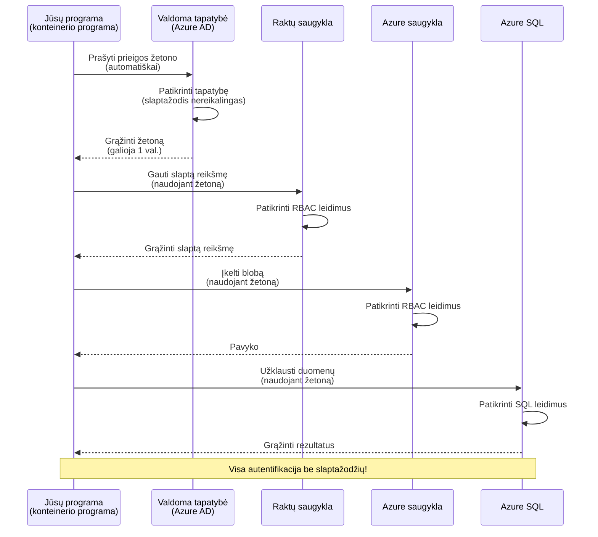
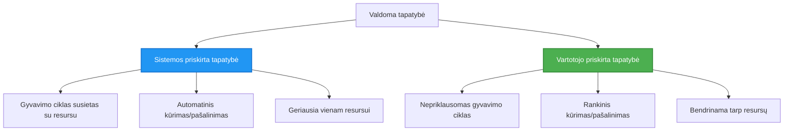

# Autentifikavimo modeliai ir Tvarkoma tapatybė

⏱️ **Apskaičiuotas laikas**: 45-60 minučių | 💰 **Kainos poveikis**: Nemokama (be papildomų mokesčių) | ⭐ **Sudėtingumas**: Vidutinis

**📚 Mokymosi kelias:**
- ← Ankstesnis: [Konfigūracijų valdymas](configuration.md) - Aplinkos kintamųjų ir slaptumų valdymas
- 🎯 **Jūs esate čia**: Autentifikavimas ir saugumas (Tvarkoma tapatybė, Key Vault, saugūs modeliai)
- → Kitas: [Pirmasis projektas](first-project.md) - Sukurkite pirmąją AZD programą
- 🏠 [Kurso pradžia](../../README.md)

---

## Ko išmoksite

Baigę šią pamoką jūs:
- Suprasite Azure autentifikavimo modelius (raktai, ryšio eilutės, tvarkoma tapatybė)
- Įgyvendinsite **Tvarkomą tapatybę** autentifikacijai be slaptažodžių
- Apsaugosite slaptuosius duomenis integruodami **Azure Key Vault**
- Konfigūruosite **vaidmenų pagrindu veikiančią prieigos kontrolę (RBAC)** AZD diegimams
- Taikysite saugumo geriausias praktikas Container Apps ir Azure paslaugose
- Migravote nuo raktų pagrindu veikiančios prieigos prie tapatybės pagrindu veikiančios autentifikacijos

## Kodėl tvarkoma tapatybė yra svarbi

### Problema: tradicinis autentifikavimas

**Prieš Tvarkomą tapatybę:**
```javascript
// ❌ SAUGUMO RIZIKA: Į kodą įrašytos slaptys
const connectionString = "Server=mydb.database.windows.net;User=admin;Password=P@ssw0rd123";
const storageKey = "xK7mN9pQ2wR5tY8uI0oP3aS6dF1gH4jK...";
const cosmosKey = "C2x7B9n4M1p8Q5w3E6r0T2y5U8i1O4p7...";
```

**Problemos:**
- 🔴 **Slaptieji duomenys atviri** kode, konfigūracijos failuose, aplinkos kintamuosiuose
- 🔴 **Kredencialų keitimas** reikalauja kodo pakeitimų ir pakartotinio diegimo
- 🔴 **Audito košmarai** - kas prie ko prisijungė ir kada?
- 🔴 **Išsibarsčiusi** - slaptieji duomenys paskirstyti keliuose sistemose
- 🔴 **Atitikties rizika** - nepraeina saugumo auditų

### Sprendimas: tvarkoma tapatybė

**Po Tvarkomos tapatybės:**
```javascript
// ✅ SAUGU: Kode nėra jokių slaptų duomenų
const credential = new DefaultAzureCredential();
const client = new BlobServiceClient(
  "https://mystorageaccount.blob.core.windows.net",
  credential  // Azure automatiškai tvarko autentifikaciją
);
```

**Privalumai:**
- ✅ **Nėra slaptųjų duomenų** kode ar konfigūracijose
- ✅ **Automatinis keitimas** - Azure rūpinasi tuo
- ✅ **Pilnas audito įrašas** Azure AD žurnaluose
- ✅ **Centralizuotas saugumas** - valdykite per Azure portalą
- ✅ **Atitiktims pasiruošę** - atitinka saugumo standartus

**Palyginimas**: Tradicinis autentifikavimas yra kaip nešiotis kelis fizinius raktus skirtingoms durims. Tvarkoma tapatybė yra kaip turėti saugumo kortelę, kuri automatiškai suteikia prieigą pagal tai, kas jūs esate — nėra raktų, kuriuos galima pamesti, kopijuoti ar keisti.

---

## Architektūros apžvalga

### Autentifikavimo srautas su Tvarkoma tapatybe


### Tvarkomų tapatybių tipai


| Funkcija | Sistemos priskirta | Vartotojui priskirta |
|---------|----------------|---------------|
| **Gyvavimo ciklas** | Susieta su ištekliumi | Nepriklausoma |
| **Sukūrimas** | Automatiškai su ištekliumi | Rankinis sukūrimas |
| **Ištrynimas** | Ištrinamas kartu su ištekliu | Išlieka po ištrynimo |
| **Dalijimasis** | Tik vienam ištekliui | Kelis išteklius galima naudoti |
| **Naudojimo atvejis** | Paprasti scenarijai | Sudėtingi kelių išteklių scenarijai |
| **AZD numatyta** | ✅ Rekomenduojama | Neprivaloma |

---

## Išankstiniai reikalavimai

### Reikalingi įrankiai

Jūs turėtumėte jau turėti tai įdiegtą iš ankstesnių pamokų:

```bash
# Patikrinkite Azure Developer CLI
azd version
# ✅ Tikimasi: azd versija 1.0.0 arba naujesnė

# Patikrinkite Azure CLI
az --version
# ✅ Tikimasi: azure-cli 2.50.0 arba naujesnė
```

### Azure reikalavimai

- Aktyvi Azure prenumerata
- Teisės:
  - Kurti tvarkomas tapatybes
  - Priskirti RBAC vaidmenis
  - Kurti Key Vault išteklius
  - Diegti Container Apps

### Reikalingos žinios

Jūs turėtumėte būti pabaigę:
- [Diegimo vadovas](installation.md) - AZD nustatymas
- [AZD pagrindai](azd-basics.md) - Pagrindinės sąvokos
- [Konfigūracijų valdymas](configuration.md) - Aplinkos kintamieji

---

## Pamoka 1: Autentifikavimo modelių supratimas

### Modelis 1: Ryšio eilutės (senstelėjęs - Venkite)

**Kaip tai veikia:**
```bash
# Jungties eilutėje yra prisijungimo duomenys
STORAGE_CONNECTION_STRING="DefaultEndpointsProtocol=https;AccountName=myaccount;AccountKey=xK7mN9pQ2wR5..."
COSMOS_CONNECTION_STRING="AccountEndpoint=https://myaccount.documents.azure.com:443/;AccountKey=C2x7..."
SQL_CONNECTION_STRING="Server=myserver.database.windows.net;User=admin;Password=P@ssw0rd..."
```

**Problemos:**
- ❌ Slaptieji duomenys matomi aplinkos kintamuosiuose
- ❌ Užfiksuojama diegimo sistemose
- ❌ Sunku pakeisti (rotuoti)
- ❌ Nėra prieigos audito įrašo

**Kada naudoti:** Tik vietiniam vystymui, niekada gamyboje.

---

### Modelis 2: Key Vault nuorodos (geriau)

**Kaip tai veikia:**
```bicep
// Store secret in Key Vault
resource keyVault 'Microsoft.KeyVault/vaults@2023-02-01' = {
  name: 'mykv'
  properties: {
    enableRbacAuthorization: true
  }
}

// Reference in Container App
env: [
  {
    name: 'STORAGE_KEY'
    secretRef: 'storage-key'  // References Key Vault
  }
]
```

**Privalumai:**
- ✅ Slaptieji duomenys saugomi saugiai Key Vault saugykloje
- ✅ Centrinis slaptųjų duomenų valdymas
- ✅ Keitimas be kodo pakeitimų

**Apribojimai:**
- ⚠️ Vis tiek naudojami raktai/slaptažodžiai
- ⚠️ Reikia valdyti prieigą prie Key Vault

**Kada naudoti:** Perėjimo žingsnis nuo ryšio eilutės prie tvarkomos tapatybės.

---

### Modelis 3: Tvarkoma tapatybė (geriausia praktika)

**Kaip tai veikia:**
```bicep
// Enable managed identity
resource containerApp 'Microsoft.App/containerApps@2023-05-01' = {
  name: 'myapp'
  identity: {
    type: 'SystemAssigned'  // Automatically creates identity
  }
}

// Grant permissions
resource roleAssignment 'Microsoft.Authorization/roleAssignments@2022-04-01' = {
  scope: storageAccount
  properties: {
    roleDefinitionId: storageBlobDataContributorRole
    principalId: containerApp.identity.principalId
  }
}
```

**Programos kodas:**
```javascript
// Nereikia jokių paslapčių!
const { DefaultAzureCredential } = require('@azure/identity');
const { BlobServiceClient } = require('@azure/storage-blob');

const credential = new DefaultAzureCredential();
const blobServiceClient = new BlobServiceClient(
  'https://mystorageaccount.blob.core.windows.net',
  credential
);
```

**Privalumai:**
- ✅ Nėra slaptųjų duomenų kode/konfigūracijoje
- ✅ Automatinis kredencialų keitimas
- ✅ Pilnas audito įrašas
- ✅ Leidimai, valdomi per RBAC
- ✅ Paruošta atitiktims

**Kada naudoti:** Visada, gamybos taikymuose.

---

## Pamoka 2: Tvarkomos tapatybės įgyvendinimas su AZD

### Žingsnis po žingsnio įgyvendinimas

Sukurkime saugią Container App, kuri naudoja tvarkomą tapatybę prieigai prie Azure Storage ir Key Vault.

### Projekto struktūra

```
secure-app/
├── azure.yaml                 # AZD configuration
├── infra/
│   ├── main.bicep            # Main infrastructure
│   ├── core/
│   │   ├── identity.bicep    # Managed identity setup
│   │   ├── keyvault.bicep    # Key Vault configuration
│   │   └── storage.bicep     # Storage with RBAC
│   └── app/
│       └── container-app.bicep
└── src/
    ├── app.js                # Application code
    ├── package.json
    └── Dockerfile
```

### 1. Konfigūruokite AZD (azure.yaml)

```yaml
name: secure-app
metadata:
  template: secure-app@1.0.0

services:
  api:
    project: ./src
    language: js
    host: containerapp

# Enable managed identity (AZD handles this automatically)
```

### 2. Infrastruktūra: Įjungti tvarkomą tapatybę

Failas: `infra/main.bicep`

```bicep
targetScope = 'subscription'

param environmentName string
param location string = 'eastus'

var tags = { 'azd-env-name': environmentName }

// Resource group
resource rg 'Microsoft.Resources/resourceGroups@2021-04-01' = {
  name: 'rg-${environmentName}'
  location: location
  tags: tags
}

// Storage Account
module storage './core/storage.bicep' = {
  name: 'storage'
  scope: rg
  params: {
    name: 'st${uniqueString(rg.id)}'
    location: location
    tags: tags
  }
}

// Key Vault
module keyVault './core/keyvault.bicep' = {
  name: 'keyvault'
  scope: rg
  params: {
    name: 'kv-${uniqueString(rg.id)}'
    location: location
    tags: tags
  }
}

// Container App with Managed Identity
module containerApp './app/container-app.bicep' = {
  name: 'container-app'
  scope: rg
  params: {
    name: 'ca-${environmentName}'
    location: location
    tags: tags
    storageAccountName: storage.outputs.name
    keyVaultName: keyVault.outputs.name
  }
}

// Grant Container App access to Storage
module storageRoleAssignment './core/role-assignment.bicep' = {
  name: 'storage-role'
  scope: rg
  params: {
    principalId: containerApp.outputs.identityPrincipalId
    roleDefinitionId: 'ba92f5b4-2d11-453d-a403-e96b0029c9fe'  // Storage Blob Data Contributor
    targetResourceId: storage.outputs.id
  }
}

// Grant Container App access to Key Vault
module kvRoleAssignment './core/role-assignment.bicep' = {
  name: 'kv-role'
  scope: rg
  params: {
    principalId: containerApp.outputs.identityPrincipalId
    roleDefinitionId: '4633458b-17de-408a-b874-0445c86b69e6'  // Key Vault Secrets User
    targetResourceId: keyVault.outputs.id
  }
}

// Outputs
output AZURE_STORAGE_ACCOUNT_NAME string = storage.outputs.name
output AZURE_KEY_VAULT_NAME string = keyVault.outputs.name
output APP_URL string = containerApp.outputs.url
```

### 3. Container App su sistemos priskirta tapatybe

Failas: `infra/app/container-app.bicep`

```bicep
param name string
param location string
param tags object = {}
param storageAccountName string
param keyVaultName string

resource containerApp 'Microsoft.App/containerApps@2023-05-01' = {
  name: name
  location: location
  tags: tags
  identity: {
    type: 'SystemAssigned'  // 🔑 Enable managed identity
  }
  properties: {
    configuration: {
      ingress: {
        external: true
        targetPort: 3000
      }
    }
    template: {
      containers: [
        {
          name: 'api'
          image: 'myregistry.azurecr.io/api:latest'
          resources: {
            cpu: json('0.5')
            memory: '1Gi'
          }
          env: [
            {
              name: 'AZURE_STORAGE_ACCOUNT_NAME'
              value: storageAccountName
            }
            {
              name: 'AZURE_KEY_VAULT_NAME'
              value: keyVaultName
            }
            // 🔑 No secrets - managed identity handles authentication!
          ]
        }
      ]
    }
  }
}

// Output the identity for RBAC assignments
output identityPrincipalId string = containerApp.identity.principalId
output id string = containerApp.id
output url string = 'https://${containerApp.properties.configuration.ingress.fqdn}'
```

### 4. RBAC vaidmenų priskyrimo modulis

Failas: `infra/core/role-assignment.bicep`

```bicep
param principalId string
param roleDefinitionId string  // Azure built-in role ID
param targetResourceId string

resource roleAssignment 'Microsoft.Authorization/roleAssignments@2022-04-01' = {
  name: guid(principalId, roleDefinitionId, targetResourceId)
  scope: resourceId('Microsoft.Resources/resourceGroups', resourceGroup().name)
  properties: {
    roleDefinitionId: subscriptionResourceId('Microsoft.Authorization/roleDefinitions', roleDefinitionId)
    principalId: principalId
    principalType: 'ServicePrincipal'
  }
}

output id string = roleAssignment.id
```

### 5. Programos kodas su tvarkoma tapatybe

Failas: `src/app.js`

```javascript
const express = require('express');
const { DefaultAzureCredential } = require('@azure/identity');
const { BlobServiceClient } = require('@azure/storage-blob');
const { SecretClient } = require('@azure/keyvault-secrets');

const app = express();
const PORT = process.env.PORT || 3000;

// 🔑 Inicializuoti kredencialą (veikia automatiškai su valdomu identitetu)
const credential = new DefaultAzureCredential();

// Azure saugyklos nustatymas
const storageAccountName = process.env.AZURE_STORAGE_ACCOUNT_NAME;
const blobServiceClient = new BlobServiceClient(
  `https://${storageAccountName}.blob.core.windows.net`,
  credential  // Raktų nereikia!
);

// Key Vault nustatymas
const keyVaultName = process.env.AZURE_KEY_VAULT_NAME;
const secretClient = new SecretClient(
  `https://${keyVaultName}.vault.azure.net`,
  credential  // Raktų nereikia!
);

// Sveikatos patikra
app.get('/health', (req, res) => {
  res.json({ status: 'healthy', authentication: 'managed-identity' });
});

// Įkelti failą į blob saugyklą
app.post('/upload', async (req, res) => {
  try {
    const containerClient = blobServiceClient.getContainerClient('uploads');
    await containerClient.createIfNotExists();
    
    const blobName = `file-${Date.now()}.txt`;
    const blockBlobClient = containerClient.getBlockBlobClient(blobName);
    
    await blockBlobClient.upload('Hello from managed identity!', 30);
    
    res.json({
      success: true,
      blobName: blobName,
      message: 'File uploaded using managed identity!'
    });
  } catch (error) {
    console.error('Upload error:', error);
    res.status(500).json({ error: error.message });
  }
});

// Gauti slaptį iš Key Vault
app.get('/secret/:name', async (req, res) => {
  try {
    const secretName = req.params.name;
    const secret = await secretClient.getSecret(secretName);
    
    res.json({
      name: secretName,
      value: secret.value,
      message: 'Secret retrieved using managed identity!'
    });
  } catch (error) {
    console.error('Secret error:', error);
    res.status(500).json({ error: error.message });
  }
});

// Išvardinti blob konteinerius (demonstruoja skaitymo prieigą)
app.get('/containers', async (req, res) => {
  try {
    const containers = [];
    for await (const container of blobServiceClient.listContainers()) {
      containers.push(container.name);
    }
    
    res.json({
      containers: containers,
      count: containers.length,
      message: 'Containers listed using managed identity!'
    });
  } catch (error) {
    console.error('List error:', error);
    res.status(500).json({ error: error.message });
  }
});

app.listen(PORT, () => {
  console.log(`Secure API listening on port ${PORT}`);
  console.log('Authentication: Managed Identity (passwordless)');
});
```

Failas: `src/package.json`

```json
{
  "name": "secure-app",
  "version": "1.0.0",
  "dependencies": {
    "express": "^4.18.2",
    "@azure/identity": "^4.0.0",
    "@azure/storage-blob": "^12.17.0",
    "@azure/keyvault-secrets": "^4.7.0"
  },
  "scripts": {
    "start": "node app.js"
  }
}
```

### 6. Diegti ir išbandyti

```bash
# Inicializuoti AZD aplinką
azd init

# Diegti infrastruktūrą ir programą
azd up

# Gauti programos URL
APP_URL=$(azd env get-values | grep APP_URL | cut -d '=' -f2 | tr -d '"')

# Išbandyti sveikatos patikrą
curl $APP_URL/health
```

**✅ Tikėtinas išvestis:**
```json
{
  "status": "healthy",
  "authentication": "managed-identity"
}
```

**Testinis blob įkėlimas:**
```bash
curl -X POST $APP_URL/upload
```

**✅ Tikėtinas išvestis:**
```json
{
  "success": true,
  "blobName": "file-1700404800000.txt",
  "message": "File uploaded using managed identity!"
}
```

**Testuoti konteinerio sąrašą:**
```bash
curl $APP_URL/containers
```

**✅ Tikėtinas išvestis:**
```json
{
  "containers": ["uploads"],
  "count": 1,
  "message": "Containers listed using managed identity!"
}
```

---

## Įprasti Azure RBAC vaidmenys

### Paruoštų vaidmenų ID tvarkomai tapatybei

| Paslauga | Vaidmens pavadinimas | Vaidmens ID | Leidimai |
|---------|-----------|---------|-------------|
| **Storage** | Storage Blob Data Reader | `2a2b9908-6b94-4a3d-8e5a-a7d8f8cc8a12` | Skaityti blobs ir konteinerius |
| **Storage** | Storage Blob Data Contributor | `ba92f5b4-2d11-453d-a403-e96b0029c9fe` | Skaityti, rašyti, trinti blobs |
| **Storage** | Storage Queue Data Contributor | `974c5e8b-45b9-4653-ba55-5f855dd0fb88` | Skaityti, rašyti, trinti eilės žinutes |
| **Key Vault** | Key Vault Secrets User | `4633458b-17de-408a-b874-0445c86b69e6` | Skaityti slaptąsias reikšmes |
| **Key Vault** | Key Vault Secrets Officer | `b86a8fe4-44ce-4948-aee5-eccb2c155cd7` | Skaityti, rašyti, trinti slaptąsias reikšmes |
| **Cosmos DB** | Cosmos DB Built-in Data Reader | `00000000-0000-0000-0000-000000000001` | Skaityti Cosmos DB duomenis |
| **Cosmos DB** | Cosmos DB Built-in Data Contributor | `00000000-0000-0000-0000-000000000002` | Skaityti, rašyti Cosmos DB duomenis |
| **SQL Database** | SQL DB Contributor | `9b7fa17d-e63e-47b0-bb0a-15c516ac86ec` | Tvarkyti SQL duomenų bazes |
| **Service Bus** | Azure Service Bus Data Owner | `090c5cfd-751d-490a-894a-3ce6f1109419` | Siųsti, gauti, valdyti žinutes |

### Kaip rasti vaidmenų ID

```bash
# Išvardinti visus integruotus vaidmenis
az role definition list --query "[].{Name:roleName, ID:name}" --output table

# Ieškoti konkretaus vaidmens
az role definition list --query "[?contains(roleName, 'Storage Blob')].{Name:roleName, ID:name}" --output table

# Gauti vaidmens detales
az role definition list --name "Storage Blob Data Contributor"
```

---

## Praktinės užduotys

### Užduotis 1: Įgalinti tvarkomą tapatybę esamai programai ⭐⭐ (Vidutinė)

**Tikslas**: Pridėti tvarkomą tapatybę prie esamo Container App diegimo

**Scenarijus**: Turite Container App, naudojančią ryšio eilutes. Konvertuokite ją į tvarkomą tapatybę.

**Pradinė būsena**: Container App su šia konfigūracija:

```bicep
// ❌ Current: Using connection string
env: [
  {
    name: 'STORAGE_CONNECTION_STRING'
    secretRef: 'storage-connection'
  }
]
```

**Veiksmai**:

1. **Įgalinti tvarkomą tapatybę Bicep faile:**

```bicep
resource containerApp 'Microsoft.App/containerApps@2023-05-01' = {
  name: 'myapp'
  identity: {
    type: 'SystemAssigned'  // Add this
  }
  // ... rest of configuration
}
```

2. **Suteikti prieigą prie Storage:**

```bicep
// Get storage account reference
resource storageAccount 'Microsoft.Storage/storageAccounts@2023-01-01' existing = {
  name: storageAccountName
}

// Assign role
resource roleAssignment 'Microsoft.Authorization/roleAssignments@2022-04-01' = {
  name: guid(containerApp.id, 'ba92f5b4-2d11-453d-a403-e96b0029c9fe', storageAccount.id)
  scope: storageAccount
  properties: {
    roleDefinitionId: subscriptionResourceId('Microsoft.Authorization/roleDefinitions', 'ba92f5b4-2d11-453d-a403-e96b0029c9fe')
    principalId: containerApp.identity.principalId
    principalType: 'ServicePrincipal'
  }
}
```

3. **Atnaujinti programos kodą:**

**Prieš (ryšio eilutė):**
```javascript
const { BlobServiceClient } = require('@azure/storage-blob');

const blobServiceClient = BlobServiceClient.fromConnectionString(
  process.env.STORAGE_CONNECTION_STRING
);
```

**Po (tvarkoma tapatybė):**
```javascript
const { DefaultAzureCredential } = require('@azure/identity');
const { BlobServiceClient } = require('@azure/storage-blob');

const credential = new DefaultAzureCredential();
const blobServiceClient = new BlobServiceClient(
  `https://${process.env.STORAGE_ACCOUNT_NAME}.blob.core.windows.net`,
  credential
);
```

4. **Atnaujinti aplinkos kintamuosius:**

```bicep
env: [
  {
    name: 'STORAGE_ACCOUNT_NAME'
    value: storageAccountName  // Just the name, no secrets!
  }
  // Remove STORAGE_CONNECTION_STRING
]
```

5. **Diegti ir išbandyti:**

```bash
# Perdiegti
azd up

# Patikrinti, ar vis dar veikia
curl https://myapp.azurecontainerapps.io/upload
```

**✅ Sėkmės kriterijai:**
- ✅ Programa diegiama be klaidų
- ✅ Storage operacijos veikia (įkėlimas, sąrašas, atsisiuntimas)
- ✅ Aplinkos kintamuosiuose nėra ryšio eilutės
- ✅ Tapatybė matoma Azure portale skiltyje "Identity"

**Patikrinimas:**

```bash
# Patikrinkite, ar valdomoji tapatybė įjungta
az containerapp show \
  --name myapp \
  --resource-group rg-myapp \
  --query "identity.type"
# ✅ Tikimasi: "SystemAssigned"

# Patikrinkite rolės priskyrimą
az role assignment list \
  --assignee $(az containerapp show --name myapp --resource-group rg-myapp --query "identity.principalId" -o tsv) \
  --scope /subscriptions/{sub-id}/resourceGroups/rg-myapp/providers/Microsoft.Storage/storageAccounts/mystorageaccount
# ✅ Tikimasi: Rodo "Storage Blob Data Contributor" vaidmenį
```

**Laikas**: 20-30 minučių

---

### Užduotis 2: Prieiga kelioms paslaugoms naudojant vartotojo priskirtą tapatybę ⭐⭐⭐ (Išplėstinė)

**Tikslas**: Sukurti vartotojui priskirtą tapatybę, bendrą kelioms Container App

**Scenarijus**: Turite 3 mikroservisus, kuriems visiems reikia prieigos prie to paties Storage paskyros ir Key Vault.

**Veiksmai**:

1. **Sukurti vartotojui priskirtą tapatybę:**

Failas: `infra/core/identity.bicep`

```bicep
param name string
param location string
param tags object = {}

resource userAssignedIdentity 'Microsoft.ManagedIdentity/userAssignedIdentities@2023-01-31' = {
  name: name
  location: location
  tags: tags
}

output id string = userAssignedIdentity.id
output principalId string = userAssignedIdentity.properties.principalId
output clientId string = userAssignedIdentity.properties.clientId
```

2. **Priskirti vaidmenis vartotojui priskirtai tapatybei:**

```bicep
// In main.bicep
module userIdentity './core/identity.bicep' = {
  name: 'user-identity'
  scope: rg
  params: {
    name: 'id-${environmentName}'
    location: location
    tags: tags
  }
}

// Grant Storage access
resource storageRoleAssignment 'Microsoft.Authorization/roleAssignments@2022-04-01' = {
  name: guid(userIdentity.outputs.principalId, 'storage-contributor')
  scope: storageAccount
  properties: {
    roleDefinitionId: subscriptionResourceId('Microsoft.Authorization/roleDefinitions', 'ba92f5b4-2d11-453d-a403-e96b0029c9fe')
    principalId: userIdentity.outputs.principalId
    principalType: 'ServicePrincipal'
  }
}

// Grant Key Vault access
resource kvRoleAssignment 'Microsoft.Authorization/roleAssignments@2022-04-01' = {
  name: guid(userIdentity.outputs.principalId, 'kv-secrets-user')
  scope: keyVault
  properties: {
    roleDefinitionId: subscriptionResourceId('Microsoft.Authorization/roleDefinitions', '4633458b-17de-408a-b874-0445c86b69e6')
    principalId: userIdentity.outputs.principalId
    principalType: 'ServicePrincipal'
  }
}
```

3. **Priskirti tapatybę keliems Container App:**

```bicep
resource apiGateway 'Microsoft.App/containerApps@2023-05-01' = {
  name: 'api-gateway'
  identity: {
    type: 'UserAssigned'
    userAssignedIdentities: {
      '${userIdentity.outputs.id}': {}
    }
  }
  // ... rest of config
}

resource productService 'Microsoft.App/containerApps@2023-05-01' = {
  name: 'product-service'
  identity: {
    type: 'UserAssigned'
    userAssignedIdentities: {
      '${userIdentity.outputs.id}': {}
    }
  }
  // ... rest of config
}

resource orderService 'Microsoft.App/containerApps@2023-05-01' = {
  name: 'order-service'
  identity: {
    type: 'UserAssigned'
    userAssignedIdentities: {
      '${userIdentity.outputs.id}': {}
    }
  }
  // ... rest of config
}
```

4. **Programos kodas (visos paslaugos naudoja tą patį modelį):**

```javascript
const { DefaultAzureCredential, ManagedIdentityCredential } = require('@azure/identity');

// Vartotojo priskirtai tapatybei nurodykite kliento ID
const credential = new ManagedIdentityCredential(
  process.env.AZURE_CLIENT_ID  // Vartotojo priskirtos tapatybės kliento ID
);

// Arba naudokite DefaultAzureCredential (automatiškai aptinka)
const credential = new DefaultAzureCredential();

const blobServiceClient = new BlobServiceClient(
  `https://${process.env.STORAGE_ACCOUNT_NAME}.blob.core.windows.net`,
  credential
);
```

5. **Diegti ir patikrinti:**

```bash
azd up

# Patikrinti, ar visos paslaugos gali pasiekti saugyklą
curl https://api-gateway.azurecontainerapps.io/upload
curl https://product-service.azurecontainerapps.io/upload
curl https://order-service.azurecontainerapps.io/upload
```

**✅ Sėkmės kriterijai:**
- ✅ Viena tapatybė bendrina 3 paslaugas
- ✅ Visos paslaugos gali prieiti prie Storage ir Key Vault
- ✅ Tapatybė išlieka, jei ištrinate vieną paslaugą
- ✅ Centrinis teisių valdymas

Vartotojui priskirtos tapatybės privalumai:
- Viena tapatybė valdymui
- Nuoseklūs leidimai visoms paslaugoms
- Išlieka po paslaugos ištrynimo
- Geriau tinka sudėtingoms architektūroms

**Laikas**: 30-40 minučių

---

### Užduotis 3: Įgyvendinti Key Vault slaptųjų reikšmių rotaciją ⭐⭐⭐ (Išplėstinė)

**Tikslas**: Laikyti trečiosios šalies API raktus Key Vault ir pasiekti juos naudojant tvarkomą tapatybę

**Scenarijus**: Jūsų programa turi kviesti išorinį API (OpenAI, Stripe, SendGrid), kuriam reikalingi API raktai.

**Veiksmai**:

1. **Sukurti Key Vault su RBAC:**

Failas: `infra/core/keyvault.bicep`

```bicep
param name string
param location string
param tags object = {}

resource keyVault 'Microsoft.KeyVault/vaults@2023-02-01' = {
  name: name
  location: location
  tags: tags
  properties: {
    enableRbacAuthorization: true  // Use RBAC instead of access policies
    sku: {
      family: 'A'
      name: 'standard'
    }
    tenantId: subscription().tenantId
    enableSoftDelete: true
    softDeleteRetentionInDays: 90
  }
}

// Allow Container App to read secrets
output id string = keyVault.id
output name string = keyVault.name
output uri string = keyVault.properties.vaultUri
```

2. **Įrašyti slaptąsias reikšmes į Key Vault:**

```bash
# Gauti Key Vault pavadinimą
KV_NAME=$(azd env get-values | grep AZURE_KEY_VAULT_NAME | cut -d '=' -f2 | tr -d '"')

# Saugo trečiųjų šalių API raktus
az keyvault secret set \
  --vault-name $KV_NAME \
  --name "OpenAI-ApiKey" \
  --value "sk-proj-xxxxxxxxxxxxx"

az keyvault secret set \
  --vault-name $KV_NAME \
  --name "Stripe-ApiKey" \
  --value "sk_live_xxxxxxxxxxxxx"

az keyvault secret set \
  --vault-name $KV_NAME \
  --name "SendGrid-ApiKey" \
  --value "SG.xxxxxxxxxxxxx"
```

3. **Programos kodas slaptųjų reikšmių gavimui:**

Failas: `src/config.js`

```javascript
const { DefaultAzureCredential } = require('@azure/identity');
const { SecretClient } = require('@azure/keyvault-secrets');

class Config {
  constructor() {
    this.credential = new DefaultAzureCredential();
    this.secretClient = new SecretClient(
      `https://${process.env.AZURE_KEY_VAULT_NAME}.vault.azure.net`,
      this.credential
    );
    this.cache = {};
  }

  async getSecret(secretName) {
    // Pirmiausia patikrinkite talpyklą
    if (this.cache[secretName]) {
      return this.cache[secretName];
    }

    try {
      const secret = await this.secretClient.getSecret(secretName);
      this.cache[secretName] = secret.value;
      console.log(`✅ Retrieved secret: ${secretName}`);
      return secret.value;
    } catch (error) {
      console.error(`❌ Failed to get secret ${secretName}:`, error.message);
      throw error;
    }
  }

  async getOpenAIKey() {
    return this.getSecret('OpenAI-ApiKey');
  }

  async getStripeKey() {
    return this.getSecret('Stripe-ApiKey');
  }

  async getSendGridKey() {
    return this.getSecret('SendGrid-ApiKey');
  }
}

module.exports = new Config();
```

4. **Naudoti slaptąsias reikšmes programoje:**

Failas: `src/app.js`

```javascript
const express = require('express');
const config = require('./config');
const { OpenAI } = require('openai');

const app = express();

// Inicializuokite OpenAI naudodami raktą iš Key Vault
let openaiClient;

async function initializeServices() {
  const openaiKey = await config.getOpenAIKey();
  openaiClient = new OpenAI({ apiKey: openaiKey });
  console.log('✅ Services initialized with secrets from Key Vault');
}

// Iškvieskite paleidimo metu
initializeServices().catch(console.error);

app.post('/chat', async (req, res) => {
  try {
    const completion = await openaiClient.chat.completions.create({
      model: 'gpt-4.1',
      messages: [{ role: 'user', content: 'Hello!' }]
    });
    
    res.json({
      response: completion.choices[0].message.content,
      authentication: 'Key from Key Vault via Managed Identity'
    });
  } catch (error) {
    res.status(500).json({ error: error.message });
  }
});

app.listen(3000, () => {
  console.log('Secure API with Key Vault integration running');
});
```

5. **Diegti ir testuoti:**

```bash
azd up

# Patikrinti, ar API raktai veikia
curl -X POST https://myapp.azurecontainerapps.io/chat \
  -H "Content-Type: application/json" \
  -d '{"message":"Hello AI"}'
```

**✅ Sėkmės kriterijai:**
- ✅ Nėra API raktų kode ar aplinkos kintamuosiuose
- ✅ Programa gauna raktus iš Key Vault
- ✅ Trečiųjų šalių API veikia teisingai
- ✅ Galima rotuoti raktus be kodo pakeitimų

Rotuoti slaptąją reikšmę:

```bash
# Atnaujinti slaptą reikšmę Key Vault
az keyvault secret set \
  --vault-name $KV_NAME \
  --name "OpenAI-ApiKey" \
  --value "sk-proj-NEW_KEY_HERE"

# Paleisti programą iš naujo, kad ji naudotų naują raktą
az containerapp revision restart \
  --name myapp \
  --resource-group rg-myapp
```

**Laikas**: 25-35 minučių

---

## Žinių patikrinimas

### 1. Autentifikavimo modeliai ✓

Išbandykite savo supratimą:

- [ ] **K1**: Kokie yra trys pagrindiniai autentifikavimo modeliai? 
  - **A**: Ryšio eilutės (senstelėjęs), Key Vault nuorodos (perėjimas), Tvarkoma tapatybė (geriausia praktika)

- [ ] **K2**: Kodėl tvarkoma tapatybė geresnė už ryšio eilutes?
  - **A**: Nėra slaptųjų duomenų kode, automatinis keitimas, pilnas audito įrašas, RBAC leidimai

- [ ] **K3**: Kada naudotumėte vartotojui priskirtą tapatybę vietoje sistemos priskirtos?
  - **A**: Kai tapatybę reikia dalintis tarp kelių išteklių arba kai tapatybės gyvavimo ciklas nepriklauso nuo ištekliaus

**Praktinis patikrinimas:**
```bash
# Patikrinkite, kokio tipo identitetą naudoja jūsų programa
az containerapp show \
  --name myapp \
  --resource-group rg-myapp \
  --query "identity.type"

# Išvardinkite visus vaidmenų priskyrimus šiam identitetui
az role assignment list \
  --assignee $(az containerapp show --name myapp --resource-group rg-myapp --query "identity.principalId" -o tsv)
```

---

### 2. RBAC ir leidimai ✓

Išbandykite savo supratimą:

- [ ] **K1**: Koks yra vaidmens ID "Storage Blob Data Contributor"?
  - **A**: `ba92f5b4-2d11-453d-a403-e96b0029c9fe`

- [ ] **K2**: Kokias teises suteikia "Key Vault Secrets User"?
  - **A**: Tik skaitymo teisė prie slaptųjų reikšmių (negali kurti, atnaujinti ar trinti)

- [ ] **K3**: Kaip suteikti Container App prieigą prie Azure SQL?
  - **A**: Priskirti vaidmenį "SQL DB Contributor" arba konfigūruoti Azure AD autentifikaciją SQL

**Praktinis patikrinimas:**
```bash
# Rasti konkrečią rolę
az role definition list --name "Storage Blob Data Contributor"

# Patikrinkite, kokios rolės priskirtos jūsų tapatybei
PRINCIPAL_ID=$(az containerapp show --name myapp --resource-group rg-myapp --query "identity.principalId" -o tsv)
az role assignment list --assignee $PRINCIPAL_ID --output table
```

---

### 3. Key Vault integracija ✓

Išbandykite savo supratimą:
- [ ] **Q1**: Kaip įjungti RBAC Key Vault vietoje prieigos politikų?
  - **A**: Nustatykite `enableRbacAuthorization: true` Bicep

- [ ] **Q2**: Kuri Azure SDK biblioteka tvarko autentifikaciją su tvarkoma tapatybe?
  - **A**: `@azure/identity` su klase `DefaultAzureCredential`

- [ ] **Q3**: Kiek laiko Key Vault paslaptys išlieka talpykloje?
  - **A**: Priklauso nuo programos; įgyvendinkite savo talpyklos strategiją

**Hands-On Verification:**
```bash
# Patikrinti prieigą prie Key Vault
az keyvault secret show \
  --vault-name $KV_NAME \
  --name "OpenAI-ApiKey" \
  --query "value"

# Patikrinti, ar RBAC įjungtas
az keyvault show \
  --name $KV_NAME \
  --query "properties.enableRbacAuthorization"
# ✅ Laukiamas rezultatas: true
```

---

## Geriausios saugumo praktikos

### ✅ DARYTI:

1. **Visada naudokite tvarkomą tapatybę produkcijoje**
   ```bicep
   identity: {
     type: 'SystemAssigned'
   }
   ```

2. **Naudokite mažiausiai privilegijų reikalaujančius RBAC vaidmenis**
   - Naudokite "Reader" vaidmenis, kai įmanoma
   - Venkite "Owner" ar "Contributor", nebent būtina

3. **Saugokite trečiųjų šalių raktus Key Vault**
   ```javascript
   const apiKey = await secretClient.getSecret('ThirdPartyApiKey');
   ```

4. **Įgalinkite audito žurnalavimą**
   ```bicep
   diagnosticSettings: {
     logs: [{ category: 'AuditEvent', enabled: true }]
   }
   ```

5. **Naudokite skirtingas tapatybes dev/staging/prod**
   ```bash
   azd env new dev
   azd env new staging
   azd env new prod
   ```

6. **Reguliariai keiskite paslaptis**
   - Nustatykite galiojimo datas Key Vault paslaptims
   - Automatizuokite rotaciją su Azure Functions

### ❌ NEDARYTI:

1. **Niekada neįrašykite paslapčių į kodą**
   ```javascript
   // ❌ BLOGAI
   const apiKey = "sk-proj-xxxxxxxxxxxxx";
   ```

2. **Nenaudokite connection strings produkcijoje**
   ```javascript
   // ❌ BLOGAI
   BlobServiceClient.fromConnectionString(process.env.STORAGE_CONNECTION_STRING)
   ```

3. **Nesuteikite perteklinių leidimų**
   ```bicep
   // ❌ BAD - too much access
   roleDefinitionId: 'Owner'
   
   // ✅ GOOD - least privilege
   roleDefinitionId: 'Storage Blob Data Reader'
   ```

4. **Neloginkite paslapčių**
   ```javascript
   // ❌ BLOGAI
   console.log('API Key:', apiKey);
   
   // ✅ GERAI
   console.log('API Key retrieved successfully');
   ```

5. **Nesidalinkite produkcijos tapatybėmis tarp aplinkų**
   ```bicep
   // ❌ BAD - same identity for dev and prod
   // ✅ GOOD - separate identities per environment
   ```

---

## Trikčių šalinimo vadovas

### Problema: "Unauthorized" prisijungiant prie Azure Storage

**Simptomai:**
```
Error: Unauthorized (403)
AuthorizationPermissionMismatch: This request is not authorized to perform this operation
```

**Diagnostika:**

```bash
# Patikrinkite, ar valdomoji tapatybė įjungta
az containerapp show \
  --name myapp \
  --resource-group rg-myapp \
  --query "identity.type"
# ✅ Tikimasi: "SystemAssigned" arba "UserAssigned"

# Patikrinkite vaidmenų priskyrimus
PRINCIPAL_ID=$(az containerapp show --name myapp --resource-group rg-myapp --query "identity.principalId" -o tsv)
az role assignment list --assignee $PRINCIPAL_ID

# Tikimasi: turėtumėte matyti "Storage Blob Data Contributor" arba panašų vaidmenį
```

**Sprendimai:**

1. **Suteikite tinkamą RBAC vaidmenį:**
```bash
STORAGE_ID=$(az storage account show --name mystorageaccount --resource-group rg-myapp --query "id" -o tsv)
az role assignment create \
  --assignee $PRINCIPAL_ID \
  --role "Storage Blob Data Contributor" \
  --scope $STORAGE_ID
```

2. **Palaukite propagacijos (gali užtrukti 5-10 minučių):**
```bash
# Patikrinti vaidmens priskyrimo būseną
az role assignment list --assignee $PRINCIPAL_ID --scope $STORAGE_ID
```

3. **Patikrinkite, kad programos kodas naudoja teisingą kredencialą:**
```javascript
// Įsitikinkite, kad naudojate DefaultAzureCredential
const credential = new DefaultAzureCredential();
```

---

### Problema: Prieiga prie Key Vault atmesta

**Simptomai:**
```
Error: Forbidden (403)
The user, group or application does not have secrets get permission
```

**Diagnostika:**

```bash
# Patikrinkite, ar Key Vault RBAC įjungtas
az keyvault show \
  --name $KV_NAME \
  --query "properties.enableRbacAuthorization"
# ✅ Tikimasi: true

# Patikrinkite vaidmenų priskyrimus
az role assignment list \
  --assignee $PRINCIPAL_ID \
  --scope /subscriptions/{sub-id}/resourceGroups/rg-myapp/providers/Microsoft.KeyVault/vaults/$KV_NAME
```

**Sprendimai:**

1. **Įgalinkite RBAC Key Vault:**
```bash
az keyvault update \
  --name $KV_NAME \
  --enable-rbac-authorization true
```

2. **Suteikite Key Vault Secrets User vaidmenį:**
```bash
KV_ID=$(az keyvault show --name $KV_NAME --query "id" -o tsv)
az role assignment create \
  --assignee $PRINCIPAL_ID \
  --role "Key Vault Secrets User" \
  --scope $KV_ID
```

---

### Problema: DefaultAzureCredential neveikia lokaliai

**Simptomai:**
```
Error: DefaultAzureCredential failed to retrieve a token
CredentialUnavailableError: No credential available
```

**Diagnostika:**

```bash
# Patikrinkite, ar esate prisijungę
az account show

# Patikrinkite Azure CLI autentifikaciją
az ad signed-in-user show
```

**Sprendimai:**

1. **Prisijunkite prie Azure CLI:**
```bash
az login
```

2. **Nustatykite Azure prenumeratą:**
```bash
az account set --subscription "Your Subscription Name"
```

3. **Vietiniam vystymui naudokite aplinkos kintamuosius:**
```bash
export AZURE_TENANT_ID="your-tenant-id"
export AZURE_CLIENT_ID="your-client-id"
export AZURE_CLIENT_SECRET="your-client-secret"
```

4. **Arba lokaliai naudokite kitą kredencialą:**
```javascript
const { DefaultAzureCredential, AzureCliCredential } = require('@azure/identity');

// Naudokite AzureCliCredential vietiniam vystymui
const credential = process.env.NODE_ENV === 'production' 
  ? new DefaultAzureCredential()
  : new AzureCliCredential();
```

---

### Problema: Vaidmens priskyrimo propagacija užtrunka per ilgai

**Simptomai:**
- Vaidmuo sėkmingai priskirtas
- Vis tiek gaunama 403 klaida
- Periodiška prieiga (kartais veikia, kartais neveikia)

**Paaiškinimas:**
Azure RBAC pakeitimams gali prireikti 5-10 minučių, kol jie pasklinda visame pasaulyje.

**Sprendimas:**

```bash
# Palaukite ir bandykite iš naujo
echo "Waiting for RBAC propagation..."
sleep 300  # Palaukite 5 minučių

# Patikrinkite prieigą
curl https://myapp.azurecontainerapps.io/upload

# Jei vis dar nepavyksta, paleiskite programą iš naujo
az containerapp revision restart \
  --name myapp \
  --resource-group rg-myapp
```

---

## Kainų svarstymai

### Tvarkomų tapatybių kaštai

| Ištekliai | Kaina |
|----------|------|
| **Tvarkoma tapatybė** | 🆓 **NEMOKAMA** - Nėra mokesčio |
| **RBAC Role Assignments** | 🆓 **NEMOKAMA** - Nėra mokesčio |
| **Azure AD Token Requests** | 🆓 **NEMOKAMA** - Įskaičiuota |
| **Key Vault Operations** | $0.03 per 10,000 operacijų |
| **Key Vault Storage** | $0.024 už paslaptį per mėnesį |

**Tvarkoma tapatybė leidžia sutaupyti, nes:**
- ✅ Pašalina poreikį naudoti Key Vault operacijas tarnybų autentifikacijai
- ✅ Mažina saugumo incidentus (nėra nutekėjusių kredencialų)
- ✅ Sumažina operacinę naštą (nėra rankinės rotacijos)

**Pavyzdinis kaštų palyginimas (mėnesinis):**

| Scenarijus | Connection Strings | Tvarkoma tapatybė | Sutaupymai |
|----------|-------------------|-----------------|---------|
| Maža programa (1M užklausų) | ~$50 (Key Vault + ops) | ~$0 | $50/mėn |
| Vidutinė programa (10M užklausų) | ~$200 | ~$0 | $200/mėn |
| Didelė programa (100M užklausų) | ~$1,500 | ~$0 | $1,500/mėn |

---

## Sužinokite daugiau

### Oficialioji dokumentacija
- [Azure tvarkoma tapatybė](https://learn.microsoft.com/entra/identity/managed-identities-azure-resources/overview)
- [Azure RBAC](https://learn.microsoft.com/azure/role-based-access-control/overview)
- [Azure Key Vault](https://learn.microsoft.com/azure/key-vault/general/overview)
- [DefaultAzureCredential](https://learn.microsoft.com/dotnet/api/azure.identity.defaultazurecredential)

### SDK dokumentacija
- [@azure/identity (Node.js)](https://www.npmjs.com/package/@azure/identity)
- [Azure.Identity (C#)](https://www.nuget.org/packages/Azure.Identity/)
- [azure-identity (Python)](https://pypi.org/project/azure-identity/)

### Kiti žingsniai šiame kurse
- ← Ankstesnis: [Konfigūracijos valdymas](configuration.md)
- → Toliau: [Pirmasis projektas](first-project.md)
- 🏠 [Kurso pradžia](../../README.md)

### Susiję pavyzdžiai
- [Microsoft Foundry Models Chat Example](../../../../examples/azure-openai-chat) - Naudoja tvarkomą tapatybę Microsoft Foundry Models
- [Mikroservisų pavyzdys](../../../../examples/microservices) - Daugiapaslaugės autentifikacijos šablonai

---

## Santrauka

**Jūs sužinojote:**
- ✅ Trys autentifikacijos schemos (connection strings, Key Vault, tvarkoma tapatybė)
- ✅ Kaip įjungti ir sukonfigūruoti tvarkomą tapatybę AZD
- ✅ RBAC vaidmenų priskyrimas Azure paslaugoms
- ✅ Key Vault integracija trečiųjų šalių paslaptims
- ✅ Vartotojo priskirtos vs sistemos priskirtos tapatybės
- ✅ Saugumo geros praktikos ir trikčių šalinimas

**Pagrindinės išvados:**
1. **Visada naudokite tvarkomą tapatybę produkcijoje** - Jokios slaptos informacijos, automatinė rotacija
2. **Naudokite mažiausiai privilegijų reikalaujančius RBAC vaidmenis** - Suteikite tik būtinus leidimus
3. **Laikykite trečiųjų šalių raktus Key Vault** - Centralizuotas slaptųjų duomenų valdymas
4. **Atskirkite tapatybes pagal aplinką** - Dev, staging, prod izoliacija
5. **Įjunkite audito žurnalavimą** - Sekite, kas ir ką pasiekė

**Tolimesni žingsniai:**
1. Užbaikite aukščiau pateiktas praktines užduotis
2. Migriruokite esamą programą nuo connection strings prie tvarkomos tapatybės
3. Sukurkite pirmąjį AZD projektą, saugumą užtikrinant nuo pat pradžių: [Pirmasis projektas](first-project.md)

---

<!-- CO-OP TRANSLATOR DISCLAIMER START -->
**Atsakomybės atsisakymas**:
Šis dokumentas buvo išverstas naudojant dirbtinio intelekto vertimo paslaugą [Co-op Translator](https://github.com/Azure/co-op-translator). Nors siekiame tikslumo, atkreipkite dėmesį, kad automatizuoti vertimai gali turėti klaidų ar netikslumų. Originalus dokumentas jo gimtąja kalba turėtų būti laikomas autoritetingu šaltiniu. Dėl kritinės informacijos rekomenduojama kreiptis į profesionalų žmogaus vertėją. Mes neatsakome už jokius nesusipratimus ar neteisingas interpretacijas, kylančias dėl šio vertimo naudojimo.
<!-- CO-OP TRANSLATOR DISCLAIMER END -->