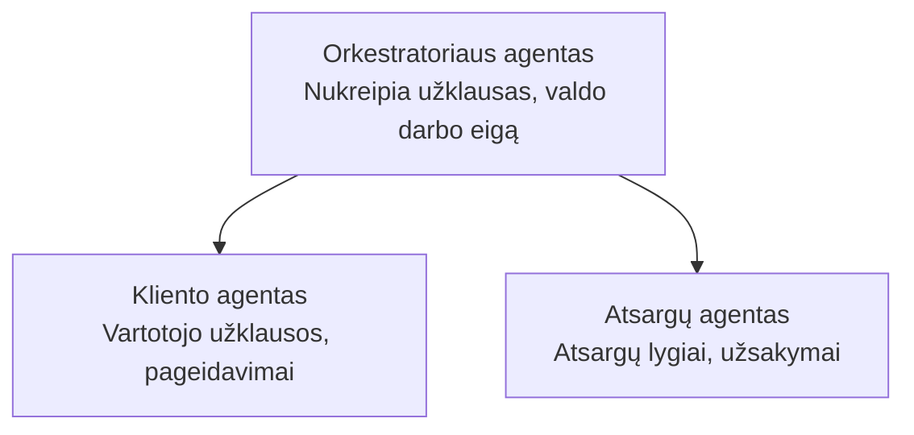

# Skyrius 5: Daugiagentiniai AI sprendimai

**📚 Kursas**: [AZD Pradedantiesiems](../../README.md) | **⏱️ Trukmė**: 2-3 valandos | **⭐ Sunkumas**: Pažengęs

---

## Apžvalga

Šiame skyriuje aptariami išplėstiniai daugiagentinės architektūros šablonai, agentų orkestracija ir gamybai paruošti AI diegimai sudėtingoms situacijoms.

## Mokymosi tikslai

Baigę šį skyrių, jūs:
- Suprasti daugiagentinės architektūros šablonus
- Diegti koordinuotus AI agentų sprendimus
- Įgyvendinti agentų tarpusavio komunikaciją
- Kurti gamybai paruoštus daugiagentinius sprendimus

---

## 📚 Pamokos

| # | Pamoka | Aprašymas | Trukmė |
|---|--------|-------------|------|
| 1 | [Mažmeninės prekybos daugiagentinis sprendimas](../../examples/retail-scenario.md) | Pilnas įgyvendinimo vadovas | 90 min |
| 2 | [Koordinavimo modeliai](../chapter-06-pre-deployment/coordination-patterns.md) | Agentų orkestravimo strategijos | 30 min |
| 3 | [ARM šablono diegimas](../../examples/retail-multiagent-arm-template/README.md) | Diegimas vienu spustelėjimu | 30 min |

---

## 🚀 Greitas startas

```bash
# Parinktis 1: Diegti iš šablono
azd init --template agent-openai-python-prompty
azd up

# Parinktis 2: Diegti iš agento manifesto (reikalauja azure.ai.agents plėtinio)
azd extension install azure.ai.agents
azd ai agent init -m agent-manifest.yaml
azd up
```

> **Kurį požiūrį pasirinkti?** Naudokite `azd init --template` kad pradėtumėte nuo veikiančio pavyzdžio. Naudokite `azd ai agent init` kai turite savo agento manifestą. Žr. [AZD AI CLI referencija](../chapter-08-production/production-ai-practices.md#azd-ai-cli-commands-and-extensions) išsamiems nurodymams.

---

## 🤖 Daugiagentinė architektūra


---

## 🎯 Teminis sprendimas: Mažmeninės prekybos daugiagentinis sprendimas

The [Mažmeninės prekybos daugiagentinis sprendimas](../../examples/retail-scenario.md) demonstrates:

- **Kliento agentas**: Tvarko naudotojo sąveikas ir nuostatas
- **Atsargų agentas**: Tvarko atsargas ir užsakymų apdorojimą
- **Orkestratorius**: Koordinuoja agentus
- **Bendra atmintis**: Kelių agentų konteksto valdymas

### Naudotos paslaugos

| Paslauga | Paskirtis |
|---------|---------|
| Microsoft Foundry Models | Kalbos supratimas |
| Azure AI Search | Produktų katalogas |
| Cosmos DB | Agentų būsena ir atmintis |
| Container Apps | Agentų talpinimas |
| Application Insights | Stebėsena |

---

## 🔗 Navigacija

| Kryptis | Skyrius |
|-----------|---------|
| **Ankstesnis** | [4 skyrius: Infrastruktūra](../chapter-04-infrastructure/README.md) |
| **Kitas** | [6 skyrius: Paruošimas diegimui](../chapter-06-pre-deployment/README.md) |

---

## 📖 Susiję ištekliai

- [AI agentų vadovas](../chapter-02-ai-development/agents.md)
- [AI gamybos praktikos](../chapter-08-production/production-ai-practices.md)
- [AI trikčių šalinimas](../chapter-07-troubleshooting/ai-troubleshooting.md)

---

<!-- CO-OP TRANSLATOR DISCLAIMER START -->
**Disclaimer**:
Šis dokumentas buvo išverstas naudojant dirbtinio intelekto vertimo paslaugą [Co-op Translator](https://github.com/Azure/co-op-translator). Nors siekiame tikslumo, prašome atkreipti dėmesį, kad automatizuoti vertimai gali turėti klaidų arba netikslumų. Pradinė dokumento versija jo gimtąja kalba turėtų būti laikoma autoritetingu šaltiniu. Dėl svarbios informacijos rekomenduojamas profesionalus žmogaus vertimas. Mes neatsakome už jokius nesusipratimus ar neteisingus aiškinimus, kylančius dėl šio vertimo naudojimo.
<!-- CO-OP TRANSLATOR DISCLAIMER END -->