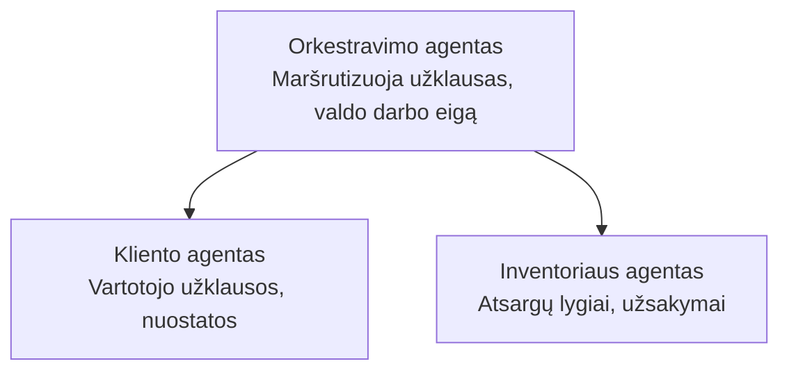

# 5 skyrius: Daugiaagentės DI sprendimai

**📚 Kursas**: [AZD Pradedantiesiems](../../README.md) | **⏱️ Trukmė**: 2-3 valandos | **⭐ Sudėtingumas**: Pažengęs

---

## Apžvalga

Šiame skyriuje aptariami pažangūs daugiaagentės architektūros modeliai, agentų koordinavimas ir gamybai paruoštos DI diegimo praktikos sudėtingoms situacijoms.

> Patikrinta su `azd 1.27.1` 2026 m. liepos mėn.

## Mokymosi tikslai

Šio skyriaus baigimo metu jūs:
- Suprasite daugiaagentės architektūros modelius
- Įdiegsite koordinuotus DI agentų sistemas
- Įgyvendinsite agentų tarpusavio komunikaciją
- Kūrėte gamybai paruoštus daugiaagentės sprendimus

---

## 📚 Pamokos

| # | Pamoka | Aprašymas | Trukmė |
|---|--------|-------------|------|
| 1 | [Daugiaagentės pagrindai](multi-agent-basics.md) | Praktinė: paleiskite veikiančią daugiaagentę programą su `azd up` | 45 min |
| 2 | [Koordinavimo modeliai](../chapter-06-pre-deployment/coordination-patterns.md) | Agentų koordinavimo strategijos (tęsiama 6 skyriuje) | 30 min |
| 3 | [ARM šablono diegimas](../../examples/retail-multiagent-arm-template/README.md) | Vieno mygtuko diegimo pavyzdys | 30 min |

> **Pradėkite nuo 1 pamokos.** Tai vienintelė visiškai praktinė ir diegiama pamoka šiame skyriuje. 2 pamoka yra 6 skyriuje (ji bendrinama su išankstinio diegimo planavimu), o [Mažmeninės prekybos daugiaagentis sprendimas](../../examples/retail-scenario.md) yra architektūros šablonas – projektavimo pavyzdys, o ne vieno komandos šablonas.

---

## 🚀 Greitas pradėjimas

```bash
# Parinktis 1: Diegti iš šablono
azd init --template agent-openai-python-prompty
azd up

# Parinktis 2: Diegti iš agento manifesto (reikalauja azure.ai.agents plėtinio)
azd extension install azure.ai.agents
azd ai agent init -m agent-manifest.yaml
azd up
```

> **Kuris būdas?** Naudokite `azd init --template`, kad pradėtumėte nuo veikiantčio pavyzdžio. Naudokite `azd ai agent init`, kai turite savo agento manifestą. Pilną informaciją rasite [AZD DI CLI nuorodoje](../chapter-08-production/production-ai-practices.md#azd-ai-cli-commands-and-extensions).

---

## 🤖 Daugiaagentė architektūra



---

## 🎯 Pateiktas sprendimas: Mažmeninės prekybos daugiaagentė sistema

[Mažmeninės prekybos daugiaagentis sprendimas](../../examples/retail-scenario.md) demonstruoja:

- **Kliento agentas**: Tvarko naudotojų sąveikas ir pageidavimus
- **Inventoriaus agentas**: Valdo atsargas ir užsakymų apdorojimą
- **Orkestratorius**: Koordinuoja agentų veiklą
- **Bendra atmintis**: Sąlyginis konteksto valdymas tarp agentų

### Naudojamos paslaugos

| Paslauga | Paskirtis |
|---------|---------|
| Microsoft Foundry Models | Kalbos supratimas |
| Azure AI Search | Produktų katalogas |
| Cosmos DB | Agentų būsena ir atmintis |
| Container Apps | Agentų talpinimas |
| Application Insights | Stebėsena |

---

## 🔗 Navigacija

| Kryptis | Skyrius |
|-----------|---------|
| **Ankstesnis** | [4 skyrius: Infrastruktūra](../chapter-04-infrastructure/README.md) |
| **Kitas** | [6 skyrius: Išankstinis diegimas](../chapter-06-pre-deployment/README.md) |

---

## 📖 Susiję ištekliai

- [DI agentų vadovas](../chapter-02-ai-development/agents.md)
- [Gamybos DI praktikos](../chapter-08-production/production-ai-practices.md)
- [DI trikčių šalinimas](../chapter-07-troubleshooting/ai-troubleshooting.md)

---

<!-- CO-OP TRANSLATOR DISCLAIMER START -->
**Atsakomybės apribojimas**:
Šis dokumentas buvo išverstas naudojant dirbtinio intelekto vertimo paslaugą [Co-op Translator](https://github.com/Azure/co-op-translator). Nors siekiame tikslumo, prašome atkreipti dėmesį, kad automatiniai vertimai gali turėti klaidų ar netikslumų. Originalus dokumentas jo gimtąja kalba laikomas autoritetingu šaltiniu. Svarbiai informacijai rekomenduojama naudoti profesionalų žmogiškąjį vertimą. Mes neatsakome už jokius nesusipratimus ar neteisingą interpretaciją, kilusią naudojantis šiuo vertimu.
<!-- CO-OP TRANSLATOR DISCLAIMER END -->