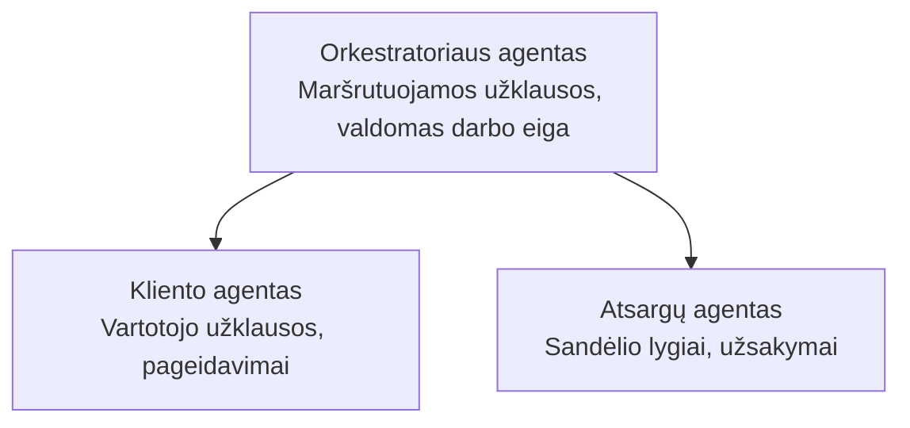

# 5 skyrius: Daugiapakopiai AI sprendimai

**📚 Kursas**: [AZD pradedantiesiems](../../README.md) | **⏱️ Trukmė**: 2-3 valandos | **⭐ Sudėtingumas**: Pažengęs

---

## Apžvalga

Šiame skyriuje nagrinėjami pažangūs daugiapakopių architektūrų modeliai, agentų koordinavimas ir gamybai paruošti AI diegimai sudėtingiems scenarijams.

> Patikrinta su `azd 1.23.12` 2026 m. kovą.

## Mokymosi tikslai

Baigę šį skyrių jūs:
- Suprasite daugiapakopius architektūrinius modelius
- Diegsite koordinuotus AI agentų sistemas
- Įgyvendinsite agentų tarpusavio komunikaciją
- Kuriate gamybai paruoštus daugiapakopius sprendimus

---

## 📚 Pamokos

| # | Pamoka | Aprašymas | Laikas |
|---|--------|-----------|--------|
| 1 | [Mažmeninės prekybos daugiapakopis sprendimas](../../examples/retail-scenario.md) | Pilnas įgyvendinimo aprašymas | 90 min |
| 2 | [Koordinavimo modeliai](../chapter-06-pre-deployment/coordination-patterns.md) | Agentų koordinavimo strategijos | 30 min |
| 3 | [ARM šablono diegimas](../../examples/retail-multiagent-arm-template/README.md) | Vieno paspaudimo diegimas | 30 min |

---

## 🚀 Greitas pradžia

```bash
# 1 variantas: Diegti iš šablono
azd init --template agent-openai-python-prompty
azd up

# 2 variantas: Diegti iš agento manifestacijos (reikalauja azure.ai.agents plėtinio)
azd extension install azure.ai.agents
azd ai agent init -m agent-manifest.yaml
azd up
```

> **Kurį metodą pasirinkti?** Naudokite `azd init --template`, jei norite pradėti nuo veikiancio pavyzdžio. Naudokite `azd ai agent init`, kai turite savo agento manifestą. Pilną informaciją rasite [AZD AI CLI nuorodoje](../chapter-08-production/production-ai-practices.md#azd-ai-cli-commands-and-extensions).

---

## 🤖 Daugiapakopių agentų architektūra


---

## 🎯 Išskirtinis sprendimas: Mažmeninės prekybos daugiaagentis

[Mažmeninės prekybos daugiaagentis sprendimas](../../examples/retail-scenario.md) demonstruoja:

- **Kliento agentas**: tvarko naudotojo sąveikas ir pageidavimus
- **Inventoriaus agentas**: valdo atsargas ir užsakymų apdorojimą
- **Koordinatorius**: koordinuoja agentus
- **Bendroji atmintis**: konteksto valdymas tarp agentų

### Naudojamos paslaugos

| Paslauga | Paskirtis |
|----------|-----------|
| Microsoft Foundry Models | Kalbos supratimas |
| Azure AI Search | Produktų katalogas |
| Cosmos DB | Agentų būsena ir atmintis |
| Container Apps | Agentų talpinimas |
| Application Insights | Stebėjimas |

---

## 🔗 Navigacija

| Kryptis | Skyrius |
|---------|---------|
| **Ankstesnis** | [4 skyrius: Infrastruktūra](../chapter-04-infrastructure/README.md) |
| **Sekantis** | [6 skyrius: Paruošimas diegimui](../chapter-06-pre-deployment/README.md) |

---

## 📖 Susiję šaltiniai

- [AI agentų vadovas](../chapter-02-ai-development/agents.md)
- [Gamybiniai AI metodai](../chapter-08-production/production-ai-practices.md)
- [AI trikčių šalinimas](../chapter-07-troubleshooting/ai-troubleshooting.md)

---

<!-- CO-OP TRANSLATOR DISCLAIMER START -->
**Atsakomybės apribojimas**:
Šis dokumentas buvo išverstas naudojant dirbtinio intelekto vertimo paslaugą [Co-op Translator](https://github.com/Azure/co-op-translator). Nors siekiame tikslumo, atkreipkite dėmesį, kad automatizuoti vertimai gali turėti klaidų ar netikslumų. Originalus dokumentas jo gimtąja kalba turi būti laikomas autoritetingu šaltiniu. Svarbiai informacijai rekomenduojama naudoti profesionalų žmogaus vertimą. Mes neatsakome už bet kokius nesusipratimus ar klaidingą interpretaciją, kylančią dėl šio vertimo naudojimo.
<!-- CO-OP TRANSLATOR DISCLAIMER END -->