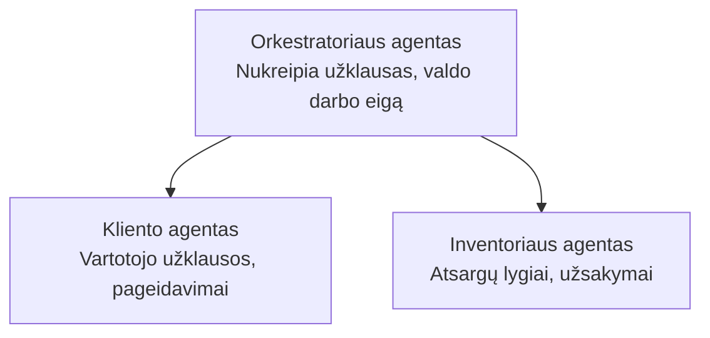

# 5 skyrius: Daugiaagentiniai AI sprendimai

**📚 Kursas**: [AZD For Beginners](../../README.md) | **⏱️ Trukmė**: 2-3 valandos | **⭐ Sudėtingumas**: Pažengęs

---

## Apžvalga

Šis skyrius apima pažangius daugiaagentinės architektūros šablonus, agentų orkestraciją ir gamybai paruoštus DI diegimus sudėtingiems scenarijams.

> Patikrinta naudojant `azd 1.25.6` 2026 m. birželį.

## Mokymosi tikslai

Baigę šį skyrių, jūs:
- Suprasite daugiaagentinės architektūros šablonus
- Išdiegsite koordinuotą agentų AI sistemas
- Įgyvendinsite agentų tarpusavio komunikaciją
- Sukursite gamybai paruoštus daugiaagentinius sprendimus

---

## 📚 Pamokos

| # | Pamoka | Aprašymas | Trukmė |
|---|--------|-------------|------|
| 1 | [Daugiaagentės pagrindai](multi-agent-basics.md) | Praktinė užduotis: išdiekite veikiančią daugiaagentę programą su `azd up` | 45 min |
| 2 | [Koordinavimo šablonai](../chapter-06-pre-deployment/coordination-patterns.md) | Agentų orkestracijos strategijos (tęsiama 6 skyriuje) | 30 min |
| 3 | [ARM šablono diegimas](../../examples/retail-multiagent-arm-template/README.md) | Vieno spustelėjimo diegimo pavyzdys | 30 min |

> **Pradėkite nuo 1 pamokos.** Tai vienintelė visiškai praktinė ir diegimui paruošta pamoka šiame skyriuje. Pamoka 2 yra 6 skyriuje (ji dalijasi medžiaga su priešdiegimo planavimu), o [Mažmeninės prekybos daugiaagentinis sprendimas](../../examples/retail-scenario.md) yra architektūros šablonas — dizaino nuoroda, o ne vieno komandos šablonas.

---

## 🚀 Greita pradžia

```bash
# Parinktis 1: Diegti iš šablono
azd init --template agent-openai-python-prompty
azd up

# Parinktis 2: Diegti iš agento manifesto (reikalauja azure.ai.agents plėtinio)
azd extension install azure.ai.agents
azd ai agent init -m agent-manifest.yaml
azd up
```

> **Kuris požiūris?** Naudokite `azd init --template`, kad pradėtumėte nuo veikiančio pavyzdžio. Naudokite `azd ai agent init`, kai turite savo agento manifestą. Žr. [AZD AI CLI referencą](../chapter-08-production/production-ai-practices.md#azd-ai-cli-commands-and-extensions) pilnai informacijai.

---

## 🤖 Daugiaagentinė architektūra



---

## 🎯 Parodytas sprendimas: Mažmeninės prekybos daugiaagentinis

[Mažmeninės prekybos daugiaagentinis sprendimas](../../examples/retail-scenario.md) demonstruoja:

- **Kliento agentas**: Tvarko vartotojo sąveikas ir nuostatas
- **Inventoriaus agentas**: Valdo atsargas ir užsakymų apdorojimą
- **Orkestratorius**: Koordinuoja tarp agentų
- **Bendrinė atmintis**: Tarpagentinis konteksto valdymas

### Naudotos paslaugos

| Paslauga | Paskirtis |
|---------|---------|
| Microsoft Foundry Models | Kalbos supratimas |
| Azure AI Search | Produktų katalogas |
| Cosmos DB | Agento būsena ir atmintis |
| Container Apps | Agentų talpinimas |
| Application Insights | Stebėsena |

---

## 🔗 Navigacija

| Kryptis | Skyrius |
|-----------|---------|
| **Ankstesnis** | [4 skyrius: Infrastruktūra](../chapter-04-infrastructure/README.md) |
| **Kitas** | [6 skyrius: Priešdiegimas](../chapter-06-pre-deployment/README.md) |

---

## 📖 Susiję ištekliai

- [AI agentų vadovas](../chapter-02-ai-development/agents.md)
- [Gamybinės AI praktikos](../chapter-08-production/production-ai-practices.md)
- [AI trikčių šalinimas](../chapter-07-troubleshooting/ai-troubleshooting.md)

---

<!-- CO-OP TRANSLATOR DISCLAIMER START -->
**Atsakomybės apribojimas**:
Šis dokumentas buvo išverstas naudojant dirbtinio intelekto vertimo paslaugą [Co-op Translator](https://github.com/Azure/co-op-translator). Nors siekiame tikslumo, prašome atkreipti dėmesį, kad automatiniai vertimai gali turėti klaidų ar netikslumų. Originalus dokumentas jo gimtąja kalba laikomas autoritetingu šaltiniu. Svarbiai informacijai rekomenduojama naudoti profesionalų žmogiškąjį vertimą. Mes neatsakome už jokius nesusipratimus ar neteisingą interpretaciją, kilusią naudojantis šiuo vertimu.
<!-- CO-OP TRANSLATOR DISCLAIMER END -->