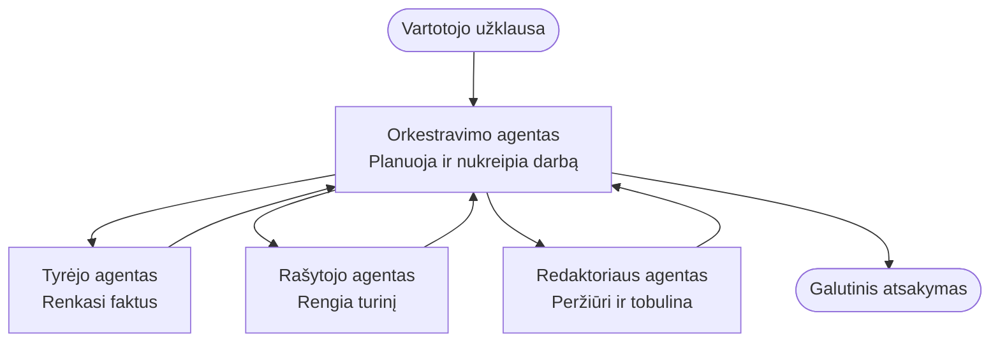

# Multiagentinių pagrindai – diegkite savo pirmąją koordinuotą DI sistemą

**Skyriaus navigacija:**
- **📚 Kurso pradžia**: [AZD pradedantiesiems](../../README.md)
- **📖 Dabartinis skyrius**: 5 skyrius – Multiagentinės DI sprendimai
- **⬅️ Ankstesnis**: [4 skyrius: Infrastruktūra](../chapter-04-infrastructure/README.md)
- **➡️ Kitas**: [Koordinavimo modeliai](../chapter-06-pre-deployment/coordination-patterns.md)

> Patikrinta naudojant `azd 1.27.1` 2026 m. liepą.

## Įvadas

Ankstesniuose skyriuose diegėte vieną programėlę – o 2 skyriuje diegėte vieną DI agentą. Ši pamoka žengia toliau: diegiate **multiagentinę sistemą**, kur kelios specializuotos agentūros bendradarbiauja spręsdamos problemą, kurios nė vienas agentas vienas gerai nesugebėtų išspręsti.

Geros naujienos pradedantiesiems: **nereikia naujų komandų.** Multiagentinis sprendimas vis dar yra azd projektas. Naudosite `azd init`, `azd up`, testuosite ir `azd down` — tiksliai tą patį darbo eigą, kurią jau žinote. Kinta tik programėlės *forma* viduje.

## Mokymosi tikslai

Pasibaigus šiai pamokai jūs:
- Suprasite, ką reiškia „multiagentinis“ ir kada verta papildoma sudėtingumas
- Atpažinsite dažnus vaidmenis multiagentinėje sistemoje (orchestratorius + specialistai)
- Diegsite tikrą veikiančią multiagentinę šabloną su `azd up`
- Suprasite, kokie Azure ištekliai palaiko multiagentinę programėlę
- Žinosite, kaip patikrinti, pritaikyti ir saugiai išardyti sprendimą

## Mokymosi rezultatai

Baigę šią pamoką galėsite:
- Paaiškinti skirtumą tarp vieno agento ir multiagentinės sistemos
- Pasirinkti tarp vieno agento su įrankiais ir tikro multiagentinio dizaino
- Diegti ir testuoti multiagentinę šabloną nuo pradžios iki pabaigos su azd
- Nustatyti, kur kiekvienas agentas veikia ir kaip jie bendrauja
- Išvalyti visus išteklius, kad nebūtų tęstinių mokesčių

---

## Kas yra multiagentinė sistema?

Vienas DI agentas yra vienas modelis su instrukcijų rinkiniu ir (pasirinktinai) kai kuriais įrankiais. Tai gerai tinka koncentruotoms užduotims. Bet kai užduotis didėja – tyrimas, rašymas, redagavimas, faktų tikrinimas – sutalpinti viską į vieną užklausą užtrunka agentą, daro jį mažiau patikimu ir sunkesniu derinti.

**Multiagentinė sistema** darbus padalija tarp specialistų, kurie gerai atlieka savo darbą, koordinuojami orchestratoriaus:



### Du vaidmenys, kuriuos visada matysite

| Vaidmuo | Darbas | Pavyzdys |
|------|-----|---------|
| **Orchestratorius** | Nusprendžia, *kas vyksta toliau* ir nukreipia darbus tarp agentų | „Pirmiausia tyrinėti, tada rašyti, tada redaguoti“ |
| **Specialistas** | Atlieka vieną susitelktą darbą ir pateikia rezultatą | „Tyrinėtojas“, kuris tik renka faktus |

### Ar tikrai reikia kelių agentų?

Pradėkite paprastai. Naudokite multiagentinę tik tada, kai galioja bent viena iš šių taisyklių:

- ✅ Užduotis turi **skirtingas stadijas**, kurių kiekviena turi savas instrukcijas (tyrimui, rašymui, peržiūrai)
- ✅ Norite, kad specialistai veiktų **lygiagrečiai** ir taupytų laiką
- ✅ Skirtingi žingsniai turi naudoti **skirtingus įrankius ar duomenų šaltinius**
- ✅ Kiekvienas žingsnis turi būti **atskiro ištestavimo ir derinimo galimybė**

Jei jūsų užduotis – paprastas klausimas-atsakymas arba įrankio kvietimas, **vienas agentas su įrankiais** (2 skyrius) yra paprastesnis, pigesnis ir lengviau valdomas.

> **Patirtis pradedantiesiems:** „Daugiau agentų“ nereiškia „geriau“. Kiekvienas agentas prideda delsą, kainą ir dar vieną stebėtiną dalyką. Pridėkite agentus tik kai problema aiškiai dalijasi į dalis.

---

## Du būdai sukurti multiagentinę sistemą Azure

| Požiūris | Kas tai yra | Geriausia taikyti |
|----------|-----------|----------|
| **Vienas agentas + įrankiai** | Vienas Foundry agentas, kviečiantis funkcijas/įrankius | Paprastos darbo eigos, pradedantiesiems |
| **Keli koordinuoti agentai** | Keletas agentų su orchestratoriumi | Skirtingos stadijos, lygiagretus darbas, specializacija |

Ši pamoka orientuota į antrąjį požiūrį, naudojant **paruoštą šabloną**, kad galėtumėte iškart pamatyti veikiančią multiagentinę sistemą prieš kurdami savo.

---

## Praktinis pavyzdys: įdiekite veikiantį multiagentinį programėlę

Įdiegsite **Contoso Creative Writer**, oficialų Azure pavyzdį, kuris naudoja kelis agentus (tyrinėtoją, rašytoją, redaktorių), koordinuotus sukurti straipsnį. Tai puikus pirmas multiagentinis programėlis, nes vaidmenys lengvai suprantami.

### 1 žingsnis: inicijuokite šabloną

```bash
# Sukurti darbo aplanką
mkdir creative-writer && cd creative-writer

# Inicializuoti iš oficialaus daugiagentų šablono
azd init --template contoso-creative-writer
```

> Peržiūrėkite daugiau multiagentinių šablonų bet kada [Awesome AZD AI galerijoje](https://azure.github.io/awesome-azd/?tags=ai). Kitos pradedančioms draugiškos galimybės yra `get-started-with-ai-agents` ir `azure-ai-travel-agents`.

### 2 žingsnis: autentifikuokitės

```bash
# Būtina azd darbo eigos procesams
azd auth login
```

### 3 žingsnis: sukurkite aplinką

```bash
azd env new dev
```

### 4 žingsnis: peržiūrėkite ir įdiekite

```bash
# Pažiūrėkite, kas bus sukurtas prieš išleisdamas ką nors (rekomenduojama)
azd provision --preview

# Paruoškite infrastruktūrą ir įdiekite visus agentus vienu žingsniu
azd up
```

`azd up` paprašys pasirinkti prenumeratą ir regioną, paskui sukonfigūruos Azure išteklius ir įdiegs programėlę. DI diegimai gali užtrukti ilgiau nei paprasta žiniatinklio programa – jei diegiate didesnius modelius, galite pratęsti diegimo laiką:

```bash
azd deploy --timeout 1800
```

> **Dėmesio į kaštus ir pajėgumą:** Multiagentinės programėlės diegia DI modelius, kurie naudoja kvotą ir gali kainuoti. Jei `azd up` nepavyksta dėl modelio kvotos, žr. [DI trikčių šalinimą](../chapter-07-troubleshooting/ai-troubleshooting.md) regionų ir kvotos pataisoms, taip pat 6 skyrių [Pajėgumų planavimas](../chapter-06-pre-deployment/capacity-planning.md).

---

## Supratimas, ką įdiegėte

Tipinis tokios multiagentinės programėlės rinkinys sukuria Azure išteklius, kurie atitinka atsakomybes aukščiau esančiame diagramoje:

| Išteklis | Kodėl jis yra |
|----------|----------------|
| **Microsoft Foundry / Modeliai** | Priima kalbos modelius, kuriuos naudoja kiekvienas agentas |
| **Azure AI Search** | Duoda tyrinėtojo agentui patikimus duomenis paieškai |
| **Container Apps** (arba App Service) | Priima orchestratoriaus ir agentų kodą |
| **Cosmos DB** (kai kuriuose pavyzdžiuose) | Laiko bendrą būseną/atmintį, perduodamą tarp agentų |
| **Application Insights** | Stebi užklausas *per* agentus, kad galėtumėte derinti procesą |

### Kaip agentai bendrauja tarpusavyje

Daugelyje azd multiagentinių pavyzdžių **orchestratorius veikia jūsų programėlės kode** (pvz., naudodamas Semantic Kernel arba Microsoft Agent Framework). Orchestratorius paeiliui kviečia kiekvieną specialistų agentą, perduoda rezultatus ir sudeda galutinį atsakymą. Agentai dalijasi kontekstu per:

- **Funkcijų/įrankių kvietimus** – orchestratorius kviečia specialistą ir gauna atgal rezultatą
- **Bendrą atmintį** – duomenų bazė (dažnai Cosmos DB) laiko būseną, kurią gali skaityti abu agentai
- **Pranešimus/įvykius** – laisvesniam susiejimui agentai bendrauja per eilę ar Service Bus

> **Kodėl tai svarbu derinimui:** kadangi kiekvienas žingsnis atskiras, Application Insights parodo, *kuris* agentas vėlavo ar nepavyko. Tai pagrindinė priežastis darbą dalinti tarp agentų.

---

## Patikrinkite diegimą

Įsitikinkite, kad sistema veikia prieš eidami toliau:

```bash
# Rodyti diegiamus galinius taškus
azd show

# Atidaryti programos stebėjimo informacinę skydelį
azd monitor

# Sekti žurnalus, jei kažkas atrodo neįprastai
azd monitor --logs
```

Tada atidarykite programėlės URL iš `azd show` ir bandykite užklausą, kuri apima visus agentus (Creative Writer paprašykite parašyti trumpą straipsnį apie temą). Application Insights **užklausų paieškoje** turėtumėte matyti užklausą, paskirstytą tarp tyrinėtojo, rašytojo ir redaktoriaus žingsnių.

**Sėkmės kriterijai:**
- ✅ `azd show` rodo pasiekiamą galinį tašką
- ✅ Užklausa generuoja rezultatą, kuris aiškiai praėjo kelis etapus
- ✅ Application Insights rodo kelis agentų žingsnius

---

## Pritaikymas: pridėkite arba pakoreguokite agentą

Kadangi agentas yra tik instrukcijos ir įrankiai, jį pritaikyti yra paprasta:

1. **Raskite agentų aprašymus** šablone (dažnai `prompts/`, `agents/` arba `*.prompty` failų rinkinyje).
2. **Pakeiskite agento instrukcijas** – pavyzdžiui, nurodykite redaktoriaus agentui laikytis tam tikro tono ar žodžių skaičiaus.
3. **Pervieškite tik kodą** (infrastruktūra nekinta):

   ```bash
   azd deploy
   ```

Norėdami eiti toliau ir kurti agentus pagal *savo* manifestą, naudokite agentų plėtinį ir visas jo gyvavimo ciklas:

```bash
azd extension install azure.ai.agents
azd ai agent init -m agent-manifest.yaml
azd up
azd ai agent invoke      # testas, su atsakymo laiko matavimu
```

Žr. [2 skyrių: Agentai](../chapter-02-ai-development/agents.md) ir [AZD DI CLI nuorodą](../chapter-08-production/production-ai-practices.md#azd-ai-cli-commands-and-extensions) pilnam agentų gyvavimo ciklui (`invoke`, `eval generate`, `optimize`, `delete`).

---

## Išvalymas

Multiagentinės programėlės veikia kelis mokamus servisus. Išardykite viską, kai baigsite:

```bash
azd down --force --purge
```

Vėliava `--purge` taip pat pašalina lengvai ištrintus DI išteklius (pvz., Foundry/Azure DI servisų paskyras), kad jie netrukdytų ateities diegimui ar nesukeltų papildomų mokesčių.

---

## Pastaba apie gamyklines multiagentines sistemas

[Retail Multi-Agent Solution](../../examples/retail-scenario.md) šiame saugykloje yra **architektūros šablonas**, o ne viena komanda įvykdoma šablonas – jis dokumentuoja, kaip būtų statoma gamykline prekybos sistema (ir aiškiai nurodo, kad pilnas kūrimas yra didelis darbas). Naudokite jį kaip dizaino pavyzdį *po* to, kai išdiegiate čia veikiančią pavyzdinę sistemą. Dėl gamybos aspektų (atsparumas, kaina, stebėjimas, valdymas) tęskite skaityti [8 skyrių: Gamybinės DI praktikos](../chapter-08-production/production-ai-practices.md).

---

## Santrauka

- Multiagentinė sistema padalija darbą tarp specialistų, koordinuojamų orchestratoriaus.
- Naudokite ją tik tada, kai užduotis turi skirtingas stadijas, galima lygiagretių darbų ar skirtingų įrankių kiekvienam žingsniui – kitaip geriau tinka vienas agentas.
- azd darbo eiga nepakinta: `azd init` → `azd up` → testavimas → `azd down`.
- Tikras šablonas kaip `contoso-creative-writer` leidžia šiandien pamatyti ir pritaikyti veikiantį multiagentinį programėlą.
- Application Insights stebėjimas per agentus yra vienas didžiausių multiagentinio dizaino praktinių privalumų.

---

## 🔗 Navigacija

| Kryptis | Pamoka |
|-----------|--------|
| **Ankstesnis** | [4 skyrius: Infrastruktūra](../chapter-04-infrastructure/README.md) |
| **Kitas** | [Koordinavimo modeliai](../chapter-06-pre-deployment/coordination-patterns.md) |

## 📖 Susiję ištekliai

- [DI agentų vadovas](../chapter-02-ai-development/agents.md)
- [Koordinavimo modeliai](../chapter-06-pre-deployment/coordination-patterns.md)
- [Gamybinės DI praktikos](../chapter-08-production/production-ai-practices.md)
- [DI trikčių šalinimas](../chapter-07-troubleshooting/ai-troubleshooting.md)

---

<!-- CO-OP TRANSLATOR DISCLAIMER START -->
**Atsakomybės apribojimas**:
Šis dokumentas buvo išverstas naudojant dirbtinio intelekto vertimo paslaugą [Co-op Translator](https://github.com/Azure/co-op-translator). Nors siekiame tikslumo, prašome atkreipti dėmesį, kad automatiniai vertimai gali turėti klaidų ar netikslumų. Originalus dokumentas jo gimtąja kalba laikomas autoritetingu šaltiniu. Svarbiai informacijai rekomenduojama naudoti profesionalų žmogiškąjį vertimą. Mes neatsakome už jokius nesusipratimus ar neteisingą interpretaciją, kilusią naudojantis šiuo vertimu.
<!-- CO-OP TRANSLATOR DISCLAIMER END -->