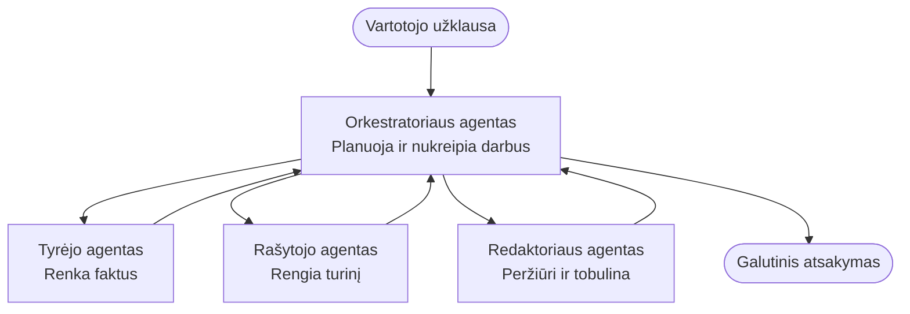

# Multi-Agent Basics - Deploy Your First Coordinated AI System

**Chapter Navigation:**
- **📚 Course Home**: [AZD For Beginners](../../README.md)
- **📖 Current Chapter**: Chapter 5 - Multi-Agent AI Solutions
- **⬅️ Previous**: [Chapter 4: Infrastructure](../chapter-04-infrastructure/README.md)
- **➡️ Next**: [Coordination Patterns](../chapter-06-pre-deployment/coordination-patterns.md)

> Validated against `azd 1.25.6` in June 2026.

## Introduction

Ankstesniuose skyriuose diegėte vieną programą — o 2 skyriuje diegėte vieną AI agentą. Ši pamoka žengia kitą žingsnį: diegiate **daugiagentę sistemą**, kur kelios specializuotos agentūros bendradarbiauja spręsdamos problemą, kurią vienas agentas sunkiai išspręstų pats.

Gera naujiena pradedantiesiems: **nereikia naujų komandų.** Daugiagentė sprendimas vis tiek yra azd projektas. Jūs darysite `azd init`, `azd up`, testuosite ir `azd down` — būtent tą darbų eigą, kurią jau pažįstate. Kas keičiasi, tai programos vidinė *forma*.

## Learning Goals

Baigę šią pamoką jūs:
- Suprasite, ką reiškia „daugiagentė“ ir kada verta priimti papildomą sudėtingumą
- Atpažinsite įprastas rolės daugiagentėje sistemoje (orchestrator + specialistai)
- Išdiegsite veikiančią daugiagentę šabloną su `azd up`
- Suprasite, kokie Azure ištekliai palaiko daugiagentę programą
- Žinosite, kaip patikrinti, pritaikyti ir saugiai pašalinti sprendimą

## Learning Outcomes

Baigę šią pamoką galėsite:
- Paaiškinti skirtumą tarp vieno agente ir daugiagentės sistemos
- Pasirinkti tarp vieno agente su įrankiais ir tikro daugiagentės dizaino
- Išdiegti ir patikrinti daugiagentį šabloną nuo pradžios iki pabaigos su azd
- Nustatyti, kur kiekvienas agentas vyksta ir kaip jie bendrauja
- Išvalyti visus išteklius, kad išvengtumėte nuolatinių išlaidų

---

## What Is a Multi-Agent System?

Vienas AI agentas yra vienas modelis su nurodymų rinkiniu ir (nebūtina) kai kuriais įrankiais. Tai gerai tinka susikoncentravusiems uždaviniams. Bet kai užduotis auga — tyrimai, tada rašymas, tada redagavimas, tada faktų tikrinimas — viską sutalpinti į vieną užklausą daro agentą lėtesnį, mažiau patikimą ir sunkiau derinamą.

Daugiagentė sistema suskaidžia darbą į specialistus, kurie kiekvienas gerai atlieka vieną užduotį, koordinuojami orchestratoriaus:



### The two roles you'll always see

| Role | Job | Example |
|------|-----|---------|
| **Orchestrator** | Decides *what happens next* and routes work between agents | "First research, then write, then edit" |
| **Specialist** | Does one focused job and returns a result | A "researcher" that only gathers facts |

### Do you actually need multiple agents?

Pradėkite paprastai. Ieškokite daugiagentės **tik** kai tenkinama bent viena iš šių sąlygų:

- ✅ Užduotis turi **aiškias stadijas**, kurioms naudingesni skirtingi nurodymai (tyrimai vs. rašymas vs. peržiūra)
- ✅ Norite, kad specialistai veiktų **lygiagrečiai**, kad sutaupytumėte laiko
- ✅ Skirtingi žingsniai reikalauja **skirtingų įrankių ar duomenų šaltinių**
- ✅ Kiekvienas žingsnis turi būti **atskirai testuojamas ir derinamas**

Jei jūsų užduotis yra vienas klausimas-ir-atsakymas arba paprastas įrankio kvietimas, **vienas agentas su įrankiais** (2 skyrius) yra paprastesnis, pigesnis ir lengviau valdomas.

> **Pradedančiojo patarimas:** „Daugiau agentų“ nereiškia „geriau.“ Kiekvienas agentas prideda delsą, išlaidas ir naują elementą, kuriuo reikia rūpintis. Pridėkite agentus tik tada, kai problema aiškiai suskyla į dalis.

---

## Two Ways to Build Multi-Agent on Azure

| Approach | What it is | Best for |
|----------|-----------|----------|
| **Single agent + tools** | One Foundry agent that calls functions/tools | Simple workflows, getting started |
| **Multiple coordinated agents** | Several agents with an orchestrator | Distinct stages, parallel work, specialization |

Ši pamoka orientuota į antrą požiūrį, naudojant **paruoštą šabloną**, kad galėtumėte pamatyti tikrą daugiagentę sistemą veikiančią prieš kurdami savo.

---

## Hands-On: Deploy a Working Multi-Agent App

Mes diegsime **Contoso Creative Writer**, oficialų Azure pavyzdį, kuris naudoja kelis agentus (tyrėją, rašytoją, redaktorių), koordinuojamus straipsnio sukūrimui. Tai puikus pirmas daugiagentis pavyzdys, nes vaidmenys lengvai suprantami.

### Step 1: Initialize the template

```bash
# Sukurti darbo aplanką
mkdir creative-writer && cd creative-writer

# Inicializuoti pagal oficialų daugiaagentinį šabloną
azd init --template contoso-creative-writer
```

> Naršykite daugiau daugiagentų šablonų bet kada [Awesome AZD AI gallery](https://azure.github.io/awesome-azd/?tags=ai). Kitos pradedantiesiems draugiškos parinktys yra `get-started-with-ai-agents` ir `azure-ai-travel-agents`.

### Step 2: Authenticate

```bash
# Reikalinga azd darbo eigoms
azd auth login
```

### Step 3: Create an environment

```bash
azd env new dev
```

### Step 4: Preview, then deploy

```bash
# Prieš ką nors išleidžiant, peržiūrėkite, kas bus sukurta (rekomenduojama)
azd provision --preview

# Parengti infrastruktūrą ir įdiegti visus agentus vienu žingsniu
azd up
```

`azd up` paprašys prenumeratos ir regiono, tada paruoš Azure išteklius ir įdiegs programą. AI diegimai gali užtrukti ilgiau nei paprasta žiniatinklio programa — jei diegiate didesnius modelius, galite praplėsti diegimo laiko limitą:

```bash
azd deploy --timeout 1800
```

> **Dėmesio dėl kainų ir pajėgumo:** Daugiagentės programos diegia AI modelius, kurie naudoja kvotas ir sukelia išlaidas. Jei `azd up` nepavyksta dėl modelio kvotos, žr. [AI Troubleshooting](../chapter-07-troubleshooting/ai-troubleshooting.md) dėl regiono ir kvotų sprendimų, ir 6 skyrių [Capacity Planning](../chapter-06-pre-deployment/capacity-planning.md).

---

## Understanding What You Deployed

Tipinė tokia daugiagentė programa suteikia rinkinį Azure išteklių, kurie tiesiogiai atitinka aukščiau esančios diagramos atsakomybes:

| Resource | Why it's there |
|----------|----------------|
| **Microsoft Foundry / Models** | Talpina kalbos modelius, kuriuos naudoja kiekvienas agentas |
| **Azure AI Search** | Suteikia tyrėjo agentui pagrįstus duomenis paieškai |
| **Container Apps** (or App Service) | Laiko orchestratorių ir agentų kodą |
| **Cosmos DB** (in some samples) | Saugo bendrą būseną/atmintį, perduodamą tarp agentų |
| **Application Insights** | Sekimas užklausų *tarp* agentų, kad galėtumėte derinti srautą |

### How the agents talk to each other

Daugumoje azd daugiagentų pavyzdžių **orchestratorius veikia jūsų programos kode** (pvz., naudojant tokį karkasą kaip Semantic Kernel arba Microsoft Agent Framework). Orchestratorius paeiliui kviečia kiekvieną specialisto agentą, perduoda rezultatą ir surenka galutinį atsakymą. Agentai dalijasi kontekstu per:

- **Function/tool calls** — orchestratorius iškviečia specialistą ir gauna rezultatą
- **Shared memory** — duomenų bazė (dažnai Cosmos DB) saugo būseną, kurią gali skaityti abu agentai
- **Messages/events** — laisvesniam sujungimui agentai bendrauja per eilę arba Service Bus

> **Kodėl tai svarbu derinimui:** kadangi kiekvienas žingsnis yra atskiras, Application Insights parodo *kuris* agentas buvo lėtas arba nepavyko. Tai pagrindinė priežastis, kodėl verta suskaidyti darbą tarp agentų.

---

## Verify the Deployment

Patikrinkite, ar sistema iš tikrųjų veikia prieš judant toliau:

```bash
# Rodyti įdiegtus galinius taškus
azd show

# Atidaryti programos stebėjimo prietaisų skydelį
azd monitor

# Stebėti žurnalus, jei kas nors atrodo negerai
azd monitor --logs
```

Tada atidarykite programos URL iš `azd show` ir išbandykite užklausą, kuri įtraukia visus agentus (Creative Writer atveju paprašykite parašyti trumpą straipsnį pasirinkta tema). Application Insights **transaction search** matysite, kad užklausa išsiskleidžia per tyrėjo, rašytojo ir redaktoriaus žingsnius.

**Sėkmės kriterijai:**
- ✅ `azd show` išvardija pasiekiamą galinį tašką
- ✅ Užklausa sukuria rezultatą, kurį akivaizdžiai sudaro keli etapai
- ✅ Application Insights rodo trasas daugiau nei vienam agento žingsniui

---

## Customize: Add or Adjust an Agent

Kadangi kiekvienas agentas yra tiesiog nurodymai plius įrankiai, pritaikyti tai yra pasiekiama:

1. **Raskite agentų apibrėžimus** šablone (dažnai `prompts/`, `agents/` arba `*.prompty` rinkinyje failų).
2. **Tobulinkite agento nurodymus** — pavyzdžiui, nurodykite redaktoriaus agentui taikyti tam tikrą toną arba žodžių kiekį.
3. **Perdiegtite tik kodą** (infrastruktūra lieka nepakitusi):

   ```bash
   azd deploy
   ```

Jei norite eiti toliau ir kurti agentus iš savo *manifesto*, naudokite agento plėtinį ir jo pilną gyvavimo ciklą:

```bash
azd extension install azure.ai.agents
azd ai agent init -m agent-manifest.yaml
azd up
azd ai agent invoke      # testas, su atsako laiku
```

Žr. [Chapter 2: Agents](../chapter-02-ai-development/agents.md) ir [AZD AI CLI reference](../chapter-08-production/production-ai-practices.md#azd-ai-cli-commands-and-extensions) dėl pilno agentų gyvavimo ciklo (`invoke`, `eval generate`, `optimize`, `delete`).

---

## Clean Up

Daugiagentės programos paleidžia kelias mokamas paslaugas. Pašalinkite viską, kai baigsite:

```bash
azd down --force --purge
```

Žymuo `--purge` taip pat pašalina minkštai ištrintus AI išteklius (pvz., Foundry/Azure AI Services paskyras), kad jie netrukdytų būsimiems diegimams arba nesukeltų papildomų išlaidų.

---

## A Note on Production Multi-Agent Systems

[Retail Multi-Agent Solution](../../examples/retail-scenario.md) šiame repozitorijoje yra **architektūros šablonas**, o ne vieno komandos šablonas — jis dokumentuoja, kaip gamybinė mažmeninės prekybos sistema *galėtų* būti sukurta (ir pabrėžia, kad pilnas kūrimas yra reikšmingas darbas). Naudokite jį kaip dizaino atskaitą *po* to, kai išdiegsite veikiančią demonstracinę programą čia. Dėl gamybinių aspektų (atsparumas, kaina, stebėjimas, valdymas) tęskite [Chapter 8: Production AI Practices](../chapter-08-production/production-ai-practices.md).

---

## Summary

- Daugiagentė sistema suskaido darbą tarp specialistų, koordinuojamų orchestratoriaus.
- Naudokite ją tik tada, kai užduotis turi aiškias stadijas, lygiagretumą arba skirtingus įrankius kiekvienam žingsniui — kitaip rinkitės vieną agentą.
- azd darbo eiga lieka nepakitusi: `azd init` → `azd up` → test → `azd down`.
- Tokie realūs šablonai kaip `contoso-creative-writer` leidžia šiandien pamatyti ir pritaikyti veikiančią daugiagentę programą.
- Application Insights sekimas per agentus yra vienas didžiausių praktinių daugiagentės architektūros privalumų.

---

## 🔗 Navigation

| Direction | Lesson |
|-----------|--------|
| **Previous** | [Chapter 4: Infrastructure](../chapter-04-infrastructure/README.md) |
| **Next** | [Coordination Patterns](../chapter-06-pre-deployment/coordination-patterns.md) |

## 📖 Related Resources

- [AI Agents Guide](../chapter-02-ai-development/agents.md)
- [Coordination Patterns](../chapter-06-pre-deployment/coordination-patterns.md)
- [Production AI Practices](../chapter-08-production/production-ai-practices.md)
- [AI Troubleshooting](../chapter-07-troubleshooting/ai-troubleshooting.md)

---

<!-- CO-OP TRANSLATOR DISCLAIMER START -->
**Atsakomybės apribojimas**:
Šis dokumentas buvo išverstas naudojant dirbtinio intelekto vertimo paslaugą [Co-op Translator](https://github.com/Azure/co-op-translator). Nors siekiame tikslumo, prašome atkreipti dėmesį, kad automatiniai vertimai gali turėti klaidų ar netikslumų. Originalus dokumentas jo gimtąja kalba laikomas autoritetingu šaltiniu. Svarbiai informacijai rekomenduojama naudoti profesionalų žmogiškąjį vertimą. Mes neatsakome už jokius nesusipratimus ar neteisingą interpretaciją, kilusią naudojantis šiuo vertimu.
<!-- CO-OP TRANSLATOR DISCLAIMER END -->