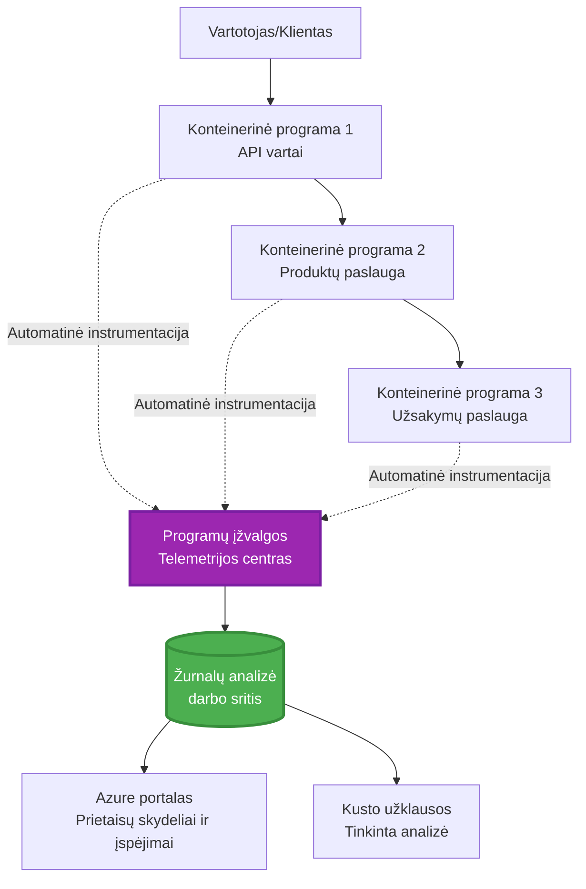
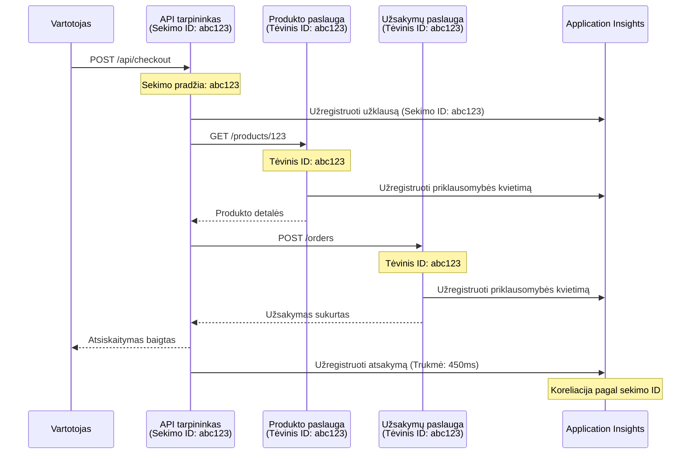

# Application Insights integracija su AZD

⏱️ **Apytikslis laikas**: 40-50 minučių | 💰 **Kainos poveikis**: ~$5-15/mėn. | ⭐ **Sudėtingumas**: Vidutinis

**📚 Mokymosi kelias:**
- ← Ankstesnis: [Preflight patikrinimai](preflight-checks.md) - Išankstinė diegimo patikra
- 🎯 **Jūs esate čia**: Application Insights integracija (Stebėjimas, telemetrija, derinimas)
- → Toliau: [Deployment Guide](../chapter-04-infrastructure/deployment-guide.md) - Diegimas į Azure
- 🏠 [Kurso pradžia](../../README.md)

---

## Ko išmoksite

Baigę šią pamoką, jūs:
- Integruosite **Application Insights** į AZD projektus automatiškai
- Sukonfigūruosite **išskirstytą sekimą** mikroservisams
- Įdiegsite **tinkintą telemetriją** (metrikos, įvykiai, priklausomybės)
- Nustatysite **tiesiogines metrikas** realaus laiko stebėjimui
- Kursite **įspėjimus ir informacijos suvestines** iš AZD diegimų
- Derinsite gamybos problemas naudodami **telemetrijos užklausas**
- Optimizuosite **išlaidas ir imtį** (sampling) strategijas
- Stebėsite **AI/LLM programas** (žetonai, delsa, sąnaudos)

## Kodėl Application Insights su AZD yra svarbu

### Iššūkis: gamybinis stebėjimas

**Be Application Insights:**
```
❌ No visibility into production behavior
❌ Manual log aggregation across services
❌ Reactive debugging (wait for customer complaints)
❌ No performance metrics
❌ Cannot trace requests across services
❌ Unknown failure rates and bottlenecks
```

**Su Application Insights + AZD:**
```
✅ Automatic telemetry collection
✅ Centralized logs from all services
✅ Proactive issue detection
✅ End-to-end request tracing
✅ Performance metrics and insights
✅ Real-time dashboards
✅ AZD provisions everything automatically
```

**Palyginimas**: Application Insights yra lyg „juodosios dėžės“ skrydžio registratorius + piloto skydelis jūsų programai. Matote viską, kas vyksta realiu laiku, ir galite peržiūrėti bet kokį incidentą.

---

## Architektūros apžvalga

### Application Insights AZD architektūroje


### Kas stebima automatiškai

| Telemetrijos tipas | Ką fiksuoja | Panaudojimo atvejis |
|----------------|------------------|----------|
| **Requests** | HTTP užklausos, statuso kodai, trukmė | API našumo stebėjimas |
| **Dependencies** | Išoriniai kvietimai (DB, API, saugykla) | Bottleneck'ų identifikavimas |
| **Exceptions** | Nesugautos klaidos su steko informacija | Klaidų derinimas |
| **Custom Events** | Verslo įvykiai (registracija, pirkimas) | Analitika ir piltuvėliai |
| **Metrics** | Našumo skaitikliai, tinkintos metrikos | Talpos planavimas |
| **Traces** | Žurnalo pranešimai su rimtumo lygiu | Derinimas ir auditas |
| **Availability** | Darbo laikas ir atsako laiko testai | SLA stebėjimas |

---

## Išankstiniai reikalavimai

### Reikalingi įrankiai

```bash
# Patikrinkite Azure Developer CLI
azd version
# ✅ Tikėtina: azd versija 1.0.0 arba naujesnė

# Patikrinkite Azure CLI
az --version
# ✅ Tikėtina: azure-cli 2.50.0 arba naujesnė
```

### Azure reikalavimai

- Aktyvi Azure prenumerata
- Teisės sukurti:
  - Application Insights išteklius
  - Log Analytics darbo sritis
  - Container Apps
  - Resource groups

### Reikalingos žinios

Turėtumėte būti užbaigę:
- [AZD Basics](../chapter-01-foundation/azd-basics.md) - Pagrindinės AZD sąvokos
- [Configuration](../chapter-03-configuration/configuration.md) - Aplinkos nustatymas
- [First Project](../chapter-01-foundation/first-project.md) - Pagrindinis diegimas

---

## Pamoka 1: Automatinis Application Insights su AZD

### Kaip AZD paruošia Application Insights

AZD automatiškai sukuria ir sukonfigūruoja Application Insights diegimo metu. Pažiūrėkime, kaip tai veikia.

### Projekto struktūra

```
monitored-app/
├── azure.yaml                     # AZD configuration
├── infra/
│   ├── main.bicep                # Main infrastructure
│   ├── core/
│   │   └── monitoring.bicep      # Application Insights + Log Analytics
│   └── app/
│       └── api.bicep             # Container App with monitoring
└── src/
    ├── app.py                    # Application with telemetry
    ├── requirements.txt
    └── Dockerfile
```

---

### 1 žingsnis: Konfigūruokite AZD (azure.yaml)

**Failas: `azure.yaml`**

```yaml
name: monitored-app
metadata:
  template: monitored-app@1.0.0

services:
  api:
    project: ./src
    language: python
    host: containerapp

# AZD automatically provisions monitoring!
```

**Viskas!** AZD pagal nutylėjimą sukurs Application Insights. Paprastas stebėjimas nereikalauja papildomos konfigūracijos.

---

### 2 žingsnis: Stebėjimo infrastruktūra (Bicep)

**Failas: `infra/core/monitoring.bicep`**

```bicep
param logAnalyticsName string
param applicationInsightsName string
param location string = resourceGroup().location
param tags object = {}

// Log Analytics Workspace (required for Application Insights)
resource logAnalytics 'Microsoft.OperationalInsights/workspaces@2022-10-01' = {
  name: logAnalyticsName
  location: location
  tags: tags
  properties: {
    sku: {
      name: 'PerGB2018'  // Pay-as-you-go pricing
    }
    retentionInDays: 30  // Keep logs for 30 days
    features: {
      enableLogAccessUsingOnlyResourcePermissions: true
    }
  }
}

// Application Insights
resource applicationInsights 'Microsoft.Insights/components@2020-02-02' = {
  name: applicationInsightsName
  location: location
  tags: tags
  kind: 'web'
  properties: {
    Application_Type: 'web'
    WorkspaceResourceId: logAnalytics.id
    IngestionMode: 'LogAnalytics'
    publicNetworkAccessForIngestion: 'Enabled'
    publicNetworkAccessForQuery: 'Enabled'
  }
}

// Outputs for Container Apps
output logAnalyticsWorkspaceId string = logAnalytics.id
output logAnalyticsWorkspaceName string = logAnalytics.name
output applicationInsightsConnectionString string = applicationInsights.properties.ConnectionString
output applicationInsightsInstrumentationKey string = applicationInsights.properties.InstrumentationKey
output applicationInsightsName string = applicationInsights.name
```

---

### 3 žingsnis: Prijunkite Container App prie Application Insights

**Failas: `infra/app/api.bicep`**

```bicep
param name string
param location string
param tags object = {}
param containerAppsEnvironmentName string
param applicationInsightsConnectionString string

resource containerApp 'Microsoft.App/containerApps@2023-05-01' = {
  name: name
  location: location
  tags: tags
  properties: {
    configuration: {
      ingress: {
        external: true
        targetPort: 8000
      }
      secrets: [
        {
          name: 'appinsights-connection-string'
          value: applicationInsightsConnectionString
        }
      ]
    }
    template: {
      containers: [
        {
          name: 'api'
          image: 'myregistry.azurecr.io/api:latest'
          resources: {
            cpu: json('0.5')
            memory: '1Gi'
          }
          env: [
            {
              name: 'APPLICATIONINSIGHTS_CONNECTION_STRING'
              secretRef: 'appinsights-connection-string'
            }
            {
              name: 'APPLICATIONINSIGHTS_ENABLED'
              value: 'true'
            }
          ]
        }
      ]
    }
  }
}

output uri string = 'https://${containerApp.properties.configuration.ingress.fqdn}'
```

---

### 4 žingsnis: Programos kodas su telemetrija

**Failas: `src/app.py`**

```python
from flask import Flask, request, jsonify
from opencensus.ext.azure.log_exporter import AzureLogHandler
from opencensus.ext.azure.trace_exporter import AzureExporter
from opencensus.ext.flask.flask_middleware import FlaskMiddleware
from opencensus.trace.samplers import ProbabilitySampler
import logging
import os

app = Flask(__name__)

# Gauti Application Insights ryšio eilutę
connection_string = os.environ.get('APPLICATIONINSIGHTS_CONNECTION_STRING')

if connection_string:
    # Konfigūruoti paskirstytą sekimą
    middleware = FlaskMiddleware(
        app,
        exporter=AzureExporter(connection_string=connection_string),
        sampler=ProbabilitySampler(rate=1.0)  # 100% ėminiavimas vystymo aplinkai
    )
    
    # Konfigūruoti žurnalavimą
    logger = logging.getLogger(__name__)
    logger.addHandler(AzureLogHandler(connection_string=connection_string))
    logger.setLevel(logging.INFO)
    
    print("✅ Application Insights enabled")
else:
    logger = logging.getLogger(__name__)
    logger.setLevel(logging.INFO)
    print("⚠️ Application Insights not configured")

@app.route('/health')
def health():
    logger.info('Health check endpoint called')
    return jsonify({'status': 'healthy', 'monitoring': 'enabled'})

@app.route('/api/products')
def get_products():
    logger.info('Fetching products')
    
    # Simuliuoti duomenų bazės užklausą (automatiškai fiksuojama kaip priklausomybė)
    products = [
        {'id': 1, 'name': 'Laptop', 'price': 999.99},
        {'id': 2, 'name': 'Mouse', 'price': 29.99},
        {'id': 3, 'name': 'Keyboard', 'price': 79.99}
    ]
    
    logger.info(f'Returned {len(products)} products')
    return jsonify(products)

@app.route('/api/error-test')
def error_test():
    """Test error tracking"""
    logger.error('Testing error tracking')
    try:
        raise ValueError('This is a test exception')
    except Exception as e:
        logger.exception('Exception occurred in error-test endpoint')
        return jsonify({'error': str(e)}), 500

@app.route('/api/slow')
def slow_endpoint():
    """Test performance tracking"""
    import time
    logger.info('Slow endpoint called')
    time.sleep(3)  # Simuliuoti lėtą operaciją
    logger.warning('Endpoint took 3 seconds to respond')
    return jsonify({'message': 'Slow operation completed'})

if __name__ == '__main__':
    app.run(host='0.0.0.0', port=8000)
```

**Failas: `src/requirements.txt`**

```txt
Flask==3.0.0
opencensus-ext-azure==1.1.13
opencensus-ext-flask==0.8.1
gunicorn==21.2.0
```

---

### 5 žingsnis: Diegti ir patikrinti

```bash
# Inicializuoti AZD
azd init

# Diegti (Application Insights suteikiamas automatiškai)
azd up

# Gauti programos URL
APP_URL=$(azd env get-values | grep API_URL | cut -d '=' -f2 | tr -d '"')

# Generuoti telemetriją
curl $APP_URL/health
curl $APP_URL/api/products
curl $APP_URL/api/error-test
curl $APP_URL/api/slow
```

**✅ Tikėtina išvestis:**
```json
{
  "status": "healthy",
  "monitoring": "enabled"
}
```

---

### 6 žingsnis: Peržiūrėti telemetriją Azure portale

```bash
# Gauti Application Insights informaciją
azd env get-values | grep APPLICATIONINSIGHTS

# Atidaryti Azure portale
az monitor app-insights component show \
  --app $(azd env get-values | grep APPLICATIONINSIGHTS_NAME | cut -d '=' -f2 | tr -d '"') \
  --resource-group $(azd env get-values | grep AZURE_RESOURCE_GROUP | cut -d '=' -f2 | tr -d '"') \
  --query "appId" -o tsv
```

**Eikite į Azure portalą → Application Insights → Transaction Search**

Turėtumėte matyti:
- ✅ HTTP užklausas su statuso kodais
- ✅ Užklausos trukmę (3+ sekundės `/api/slow`)
- ✅ Išimčių detales iš `/api/error-test`
- ✅ Tinkintas žurnalo žinutes

---

## Pamoka 2: Tinkinta telemetrija ir įvykiai

### Stebėkite verslo įvykius

Pridėkime tinkintą telemetriją verslui svarbiems įvykiams.

**Failas: `src/telemetry.py`**

```python
from opencensus.ext.azure import metrics_exporter
from opencensus.stats import aggregation as aggregation_module
from opencensus.stats import measure as measure_module
from opencensus.stats import stats as stats_module
from opencensus.stats import view as view_module
from opencensus.tags import tag_map as tag_map_module
from opencensus.ext.azure.log_exporter import AzureLogHandler
from opencensus.ext.azure.trace_exporter import AzureExporter
from opencensus.trace import tracer as tracer_module
import logging
import os

class TelemetryClient:
    """Custom telemetry client for Application Insights"""
    
    def __init__(self, connection_string=None):
        self.connection_string = connection_string or os.environ.get('APPLICATIONINSIGHTS_CONNECTION_STRING')
        
        if not self.connection_string:
            print("⚠️ Application Insights connection string not found")
            return
        
        # Konfigūruoti žurnalą
        self.logger = logging.getLogger(__name__)
        self.logger.addHandler(AzureLogHandler(connection_string=self.connection_string))
        self.logger.setLevel(logging.INFO)
        
        # Konfigūruoti metrikų eksportuotoją
        self.stats = stats_module.stats
        self.view_manager = self.stats.view_manager
        self.stats_recorder = self.stats.stats_recorder
        
        exporter = metrics_exporter.new_metrics_exporter(
            connection_string=self.connection_string
        )
        self.view_manager.register_exporter(exporter)
        
        # Konfigūruoti sekiklį
        self.tracer = tracer_module.Tracer(
            exporter=AzureExporter(connection_string=self.connection_string)
        )
        
        print("✅ Custom telemetry client initialized")
    
    def track_event(self, event_name: str, properties: dict = None):
        """Track custom business event"""
        properties = properties or {}
        self.logger.info(
            f"CustomEvent: {event_name}",
            extra={
                'custom_dimensions': {
                    'event_name': event_name,
                    **properties
                }
            }
        )
    
    def track_metric(self, metric_name: str, value: float, properties: dict = None):
        """Track custom metric"""
        properties = properties or {}
        self.logger.info(
            f"CustomMetric: {metric_name} = {value}",
            extra={
                'custom_dimensions': {
                    'metric_name': metric_name,
                    'value': value,
                    **properties
                }
            }
        )
    
    def track_dependency(self, name: str, dependency_type: str, duration: float, success: bool):
        """Track external dependency call"""
        with self.tracer.span(name=name) as span:
            span.add_attribute('dependency.type', dependency_type)
            span.add_attribute('duration', duration)
            span.add_attribute('success', success)

# Globalus telemetrijos klientas
telemetry = TelemetryClient()
```

### Atnaujinkite programą su tinkintais įvykiais

**Failas: `src/app.py` (išplėstas)**

```python
from flask import Flask, request, jsonify
from telemetry import telemetry
import time
import random

app = Flask(__name__)

@app.route('/api/purchase', methods=['POST'])
def purchase():
    """Track purchase event with custom telemetry"""
    data = request.json
    product_id = data.get('product_id')
    quantity = data.get('quantity', 1)
    price = data.get('price', 0)
    
    # Stebėti verslo įvykį
    telemetry.track_event('Purchase', {
        'product_id': product_id,
        'quantity': quantity,
        'total_amount': price * quantity,
        'user_id': request.headers.get('X-User-Id', 'anonymous')
    })
    
    # Stebėti pajamų metriką
    telemetry.track_metric('Revenue', price * quantity, {
        'product_id': product_id,
        'currency': 'USD'
    })
    
    return jsonify({
        'order_id': f'ORD-{random.randint(1000, 9999)}',
        'status': 'confirmed',
        'total': price * quantity
    })

@app.route('/api/search')
def search():
    """Track search queries"""
    query = request.args.get('q', '')
    
    start_time = time.time()
    
    # Simuliuoti paiešką (tai būtų tikra duomenų bazės užklausa)
    results = [{'id': 1, 'name': f'Result for {query}'}]
    
    duration = (time.time() - start_time) * 1000  # Konvertuoti į ms
    
    # Stebėti paieškos įvykį
    telemetry.track_event('Search', {
        'query': query,
        'results_count': len(results),
        'duration_ms': duration
    })
    
    # Stebėti paieškos našumo metriką
    telemetry.track_metric('SearchDuration', duration, {
        'query_length': len(query)
    })
    
    return jsonify({'results': results, 'count': len(results)})

@app.route('/api/external-call')
def external_call():
    """Track external API dependency"""
    import requests
    
    start_time = time.time()
    success = True
    
    try:
        # Simuliuoti išorinės API užklausą
        response = requests.get('https://api.example.com/data', timeout=5)
        result = response.json()
    except Exception as e:
        success = False
        result = {'error': str(e)}
    
    duration = (time.time() - start_time) * 1000
    
    # Stebėti priklausomybę
    telemetry.track_dependency(
        name='ExternalAPI',
        dependency_type='HTTP',
        duration=duration,
        success=success
    )
    
    return jsonify(result)

if __name__ == '__main__':
    app.run(host='0.0.0.0', port=8000)
```

### Išbandykite tinkintą telemetriją

```bash
# Stebėti pirkimo įvykį
curl -X POST $APP_URL/api/purchase \
  -H "Content-Type: application/json" \
  -H "X-User-Id: user123" \
  -d '{"product_id": 1, "quantity": 2, "price": 29.99}'

# Stebėti paieškos įvykį
curl "$APP_URL/api/search?q=laptop"

# Stebėti išorinę priklausomybę
curl $APP_URL/api/external-call
```

**Peržiūra Azure portale:**

Eikite į Application Insights → Logs, tada paleiskite:

```kusto
// View purchase events
traces
| where customDimensions.event_name == "Purchase"
| project 
    timestamp,
    product_id = tostring(customDimensions.product_id),
    total_amount = todouble(customDimensions.total_amount),
    user_id = tostring(customDimensions.user_id)
| order by timestamp desc

// View revenue metrics
traces
| where customDimensions.metric_name == "Revenue"
| summarize TotalRevenue = sum(todouble(customDimensions.value)) by bin(timestamp, 1h)
| render timechart

// View search performance
traces
| where customDimensions.event_name == "Search"
| summarize 
    AvgDuration = avg(todouble(customDimensions.duration_ms)),
    SearchCount = count()
  by bin(timestamp, 5m)
| render timechart
```

---

## Pamoka 3: Išskirstytas sekimas mikroservisams

### Įgalinti tarpservisinį sekimą

Mikroservisams Application Insights automatiškai koreliuoja užklausas tarp paslaugų.

**Failas: `infra/main.bicep`**

```bicep
targetScope = 'subscription'

param environmentName string
param location string = 'eastus'

var tags = { 'azd-env-name': environmentName }

resource rg 'Microsoft.Resources/resourceGroups@2021-04-01' = {
  name: 'rg-${environmentName}'
  location: location
  tags: tags
}

// Monitoring (shared by all services)
module monitoring './core/monitoring.bicep' = {
  name: 'monitoring'
  scope: rg
  params: {
    logAnalyticsName: 'log-${environmentName}'
    applicationInsightsName: 'appi-${environmentName}'
    location: location
    tags: tags
  }
}

// API Gateway
module apiGateway './app/api-gateway.bicep' = {
  name: 'api-gateway'
  scope: rg
  params: {
    name: 'ca-gateway-${environmentName}'
    location: location
    tags: union(tags, { 'azd-service-name': 'gateway' })
    applicationInsightsConnectionString: monitoring.outputs.applicationInsightsConnectionString
  }
}

// Product Service
module productService './app/product-service.bicep' = {
  name: 'product-service'
  scope: rg
  params: {
    name: 'ca-products-${environmentName}'
    location: location
    tags: union(tags, { 'azd-service-name': 'products' })
    applicationInsightsConnectionString: monitoring.outputs.applicationInsightsConnectionString
  }
}

// Order Service
module orderService './app/order-service.bicep' = {
  name: 'order-service'
  scope: rg
  params: {
    name: 'ca-orders-${environmentName}'
    location: location
    tags: union(tags, { 'azd-service-name': 'orders' })
    applicationInsightsConnectionString: monitoring.outputs.applicationInsightsConnectionString
  }
}

output APPLICATIONINSIGHTS_CONNECTION_STRING string = monitoring.outputs.applicationInsightsConnectionString
output GATEWAY_URL string = apiGateway.outputs.uri
```

### Peržiūrėti viso kelio transakciją


**Užklausti viso kelio seką:**

```kusto
// Find complete request flow
let traceId = "abc123...";  // Get from response header
dependencies
| union requests
| where operation_Id == traceId
| project 
    timestamp,
    type = itemType,
    name,
    duration,
    success,
    cloud_RoleName
| order by timestamp asc
```

---

## Pamoka 4: Tiesioginės metrikos ir realaus laiko stebėjimas

### Įgalinti Live Metrics srautą

Live Metrics suteikia realaus laiko telemetriją su <1 sekundės vėlavimu.

**Prieiga prie Live Metrics:**

```bash
# Gauti Application Insights resursą
APPI_NAME=$(azd env get-values | grep APPLICATIONINSIGHTS_NAME | cut -d '=' -f2 | tr -d '"')

# Gauti išteklių grupę
RG_NAME=$(azd env get-values | grep AZURE_RESOURCE_GROUP | cut -d '=' -f2 | tr -d '"')

echo "Navigate to: Azure Portal → Resource Groups → $RG_NAME → $APPI_NAME → Live Metrics"
```

**Ką matote realiu laiku:**
- ✅ Atėjusių užklausų dažnis (requests/sec)
- ✅ Išeinančių priklausomybių kvietimų skaičius
- ✅ Išimčių skaičius
- ✅ CPU ir atminties naudojimas
- ✅ Aktyvių serverių skaičius
- ✅ Imties telemetrija

### Generuoti apkrovą testavimui

```bash
# Generuokite apkrovą, kad pamatytumėte tiesioginius rodiklius
for i in {1..100}; do
  curl $APP_URL/api/products &
  curl $APP_URL/api/search?q=test$i &
done

# Stebėkite tiesioginius rodiklius Azure portale
# Turėtumėte matyti užklausų dažnio piką
```

---

## Praktinės užduotys

### Užduotis 1: Sukonfigūruokite įspėjimus ⭐⭐ (Vidutinis)

**Tikslas**: Sukurti įspėjimus dėl didelio klaidų dažnio ir lėtų atsakymų.

**Veiksmai:**

1. **Sukurti įspėjimą dėl klaidų dažnio:**

```bash
# Gauti Application Insights išteklių ID
APPI_ID=$(az monitor app-insights component show \
  --app $APPI_NAME \
  --resource-group $RG_NAME \
  --query "id" -o tsv)

# Sukurti metrikos įspėjimą dėl nesėkmingų užklausų
az monitor metrics alert create \
  --name "High-Error-Rate" \
  --resource-group $RG_NAME \
  --scopes $APPI_ID \
  --condition "count requests/failed > 10" \
  --window-size 5m \
  --evaluation-frequency 1m \
  --description "Alert when error rate exceeds 10 per 5 minutes"
```

2. **Sukurti įspėjimą dėl lėtų atsakymų:**

```bash
az monitor metrics alert create \
  --name "Slow-Responses" \
  --resource-group $RG_NAME \
  --scopes $APPI_ID \
  --condition "avg requests/duration > 3000" \
  --window-size 5m \
  --evaluation-frequency 1m \
  --description "Alert when average response time exceeds 3 seconds"
```

3. **Sukurti įspėjimą per Bicep (preferuojama AZD):**

**Failas: `infra/core/alerts.bicep`**

```bicep
param applicationInsightsId string
param actionGroupId string = ''
param location string = resourceGroup().location

// High error rate alert
resource errorRateAlert 'Microsoft.Insights/metricAlerts@2018-03-01' = {
  name: 'high-error-rate'
  location: 'global'
  properties: {
    description: 'Alert when error rate exceeds threshold'
    severity: 2
    enabled: true
    scopes: [
      applicationInsightsId
    ]
    evaluationFrequency: 'PT1M'
    windowSize: 'PT5M'
    criteria: {
      'odata.type': 'Microsoft.Azure.Monitor.SingleResourceMultipleMetricCriteria'
      allOf: [
        {
          name: 'Error rate'
          metricName: 'requests/failed'
          operator: 'GreaterThan'
          threshold: 10
          timeAggregation: 'Count'
        }
      ]
    }
    actions: actionGroupId != '' ? [
      {
        actionGroupId: actionGroupId
      }
    ] : []
  }
}

// Slow response alert
resource slowResponseAlert 'Microsoft.Insights/metricAlerts@2018-03-01' = {
  name: 'slow-responses'
  location: 'global'
  properties: {
    description: 'Alert when response time is too high'
    severity: 3
    enabled: true
    scopes: [
      applicationInsightsId
    ]
    evaluationFrequency: 'PT1M'
    windowSize: 'PT5M'
    criteria: {
      'odata.type': 'Microsoft.Azure.Monitor.SingleResourceMultipleMetricCriteria'
      allOf: [
        {
          name: 'Response duration'
          metricName: 'requests/duration'
          operator: 'GreaterThan'
          threshold: 3000
          timeAggregation: 'Average'
        }
      ]
    }
  }
}

output errorAlertId string = errorRateAlert.id
output slowResponseAlertId string = slowResponseAlert.id
```

4. **Išbandyti įspėjimus:**

```bash
# Generuoti klaidas
for i in {1..20}; do
  curl $APP_URL/api/error-test
done

# Generuoti lėtus atsakymus
for i in {1..10}; do
  curl $APP_URL/api/slow
done

# Patikrinkite įspėjimo būseną (palaukite 5–10 minučių)
az monitor metrics alert list \
  --resource-group $RG_NAME \
  --query "[].{Name:name, Enabled:enabled, State:properties.enabled}" \
  --output table
```

**✅ Sėkmės kriterijai:**
- ✅ Įspėjimai sėkmingai sukurti
- ✅ Įspėjimai aktyvuojami, kai viršijami slenkstčiai
- ✅ Galima peržiūrėti įspėjimų istoriją Azure portale
- ✅ Integruota su AZD diegimu

**Laikas**: 20-25 minutės

---

### Užduotis 2: Sukurkite tinkintą informacinį skydelį ⭐⭐ (Vidutinis)

**Tikslas**: Sukurti skydelį, rodantį pagrindines programos metrikas.

**Veiksmai:**

1. **Sukurti skydelį per Azure portalą:**

Eikite į: Azure Portal → Dashboards → New Dashboard

2. **Pridėti plyteles pagrindinėms metrikoms:**

- Užklausų skaičius (per paskutines 24 valandas)
- Vidutinis atsako laikas
- Klaidų dažnis
- 5 lėčiausios operacijos
- Vartotojų geografinis pasiskirstymas

3. **Sukurti informacinį skydelį per Bicep:**

**Failas: `infra/core/dashboard.bicep`**

```bicep
param dashboardName string
param applicationInsightsId string
param location string = resourceGroup().location

resource dashboard 'Microsoft.Portal/dashboards@2020-09-01-preview' = {
  name: dashboardName
  location: location
  properties: {
    lenses: [
      {
        order: 0
        parts: [
          // Request count
          {
            position: { x: 0, y: 0, rowSpan: 4, colSpan: 6 }
            metadata: {
              type: 'Extension/Microsoft_OperationsManagementSuite_Workspace/PartType/LogsDashboardPart'
              inputs: [
                {
                  name: 'resourceId'
                  value: applicationInsightsId
                }
                {
                  name: 'query'
                  value: '''
                    requests
                    | summarize RequestCount = count() by bin(timestamp, 1h)
                    | render timechart
                  '''
                }
              ]
            }
          }
          // Error rate
          {
            position: { x: 6, y: 0, rowSpan: 4, colSpan: 6 }
            metadata: {
              type: 'Extension/Microsoft_OperationsManagementSuite_Workspace/PartType/LogsDashboardPart'
              inputs: [
                {
                  name: 'resourceId'
                  value: applicationInsightsId
                }
                {
                  name: 'query'
                  value: '''
                    requests
                    | summarize 
                        Total = count(),
                        Failed = countif(success == false)
                    | extend ErrorRate = (Failed * 100.0) / Total
                    | project ErrorRate
                  '''
                }
              ]
            }
          }
        ]
      }
    ]
  }
}

output dashboardId string = dashboard.id
```

4. **Diegti skydelį:**

```bash
# Pridėti į main.bicep
module dashboard './core/dashboard.bicep' = {
  name: 'dashboard'
  scope: rg
  params: {
    dashboardName: 'dashboard-${environmentName}'
    applicationInsightsId: monitoring.outputs.applicationInsightsId
    location: location
  }
}

# Diegti
azd up
```

**✅ Sėkmės kriterijai:**
- ✅ Skydelyje rodomos pagrindinės metrikos
- ✅ Galima prisegti prie Azure portalo pradžios
- ✅ Atnaujinama realiu laiku
- ✅ Galima diegti per AZD

**Laikas**: 25-30 minučių

---

### Užduotis 3: Stebėkite AI/LLM programą ⭐⭐⭐ (Pažengęs)

**Tikslas**: Stebėti Azure OpenAI naudojimą (žetonai, sąnaudos, vėlavimas).

**Veiksmai:**

1. **Sukurti AI stebėjimo wrapper'į:**

**Failas: `src/ai_telemetry.py`**

```python
from telemetry import telemetry
from openai import AzureOpenAI
import time

class MonitoredAzureOpenAI:
    """Azure OpenAI client with automatic telemetry"""
    
    def __init__(self, api_key, endpoint, api_version="2024-02-01"):
        self.client = AzureOpenAI(
            api_key=api_key,
            api_version=api_version,
            azure_endpoint=endpoint
        )
    
    def chat_completion(self, model: str, messages: list, **kwargs):
        """Track chat completion with telemetry"""
        start_time = time.time()
        
        try:
            # Kviesti Azure OpenAI
            response = self.client.chat.completions.create(
                model=model,
                messages=messages,
                **kwargs
            )
            
            duration = (time.time() - start_time) * 1000  # ms
            
            # Išgauti naudojimą
            usage = response.usage
            prompt_tokens = usage.prompt_tokens
            completion_tokens = usage.completion_tokens
            total_tokens = usage.total_tokens
            
            # Apskaičiuoti kainą (GPT-4 kainodara)
            prompt_cost = (prompt_tokens / 1000) * 0.03  # $0.03 už 1K žetonų
            completion_cost = (completion_tokens / 1000) * 0.06  # $0.06 už 1K žetonų
            total_cost = prompt_cost + completion_cost
            
            # Stebėti pasirinktinį įvykį
            telemetry.track_event('OpenAI_Request', {
                'model': model,
                'prompt_tokens': prompt_tokens,
                'completion_tokens': completion_tokens,
                'total_tokens': total_tokens,
                'duration_ms': duration,
                'cost_usd': total_cost,
                'success': True
            })
            
            # Stebėti metrikas
            telemetry.track_metric('OpenAI_Tokens', total_tokens, {
                'model': model,
                'type': 'total'
            })
            
            telemetry.track_metric('OpenAI_Cost', total_cost, {
                'model': model,
                'currency': 'USD'
            })
            
            telemetry.track_metric('OpenAI_Duration', duration, {
                'model': model
            })
            
            return response
            
        except Exception as e:
            duration = (time.time() - start_time) * 1000
            
            telemetry.track_event('OpenAI_Request', {
                'model': model,
                'duration_ms': duration,
                'success': False,
                'error': str(e)
            })
            
            raise
```

2. **Naudoti stebimą klientą:**

```python
from flask import Flask, request, jsonify
from ai_telemetry import MonitoredAzureOpenAI
import os

app = Flask(__name__)

# Inicializuoti stebimą OpenAI klientą
openai_client = MonitoredAzureOpenAI(
    api_key=os.environ['AZURE_OPENAI_API_KEY'],
    endpoint=os.environ['AZURE_OPENAI_ENDPOINT']
)

@app.route('/api/chat', methods=['POST'])
def chat():
    data = request.json
    user_message = data.get('message')
    
    # Iškviesti su automatiniu stebėjimu
    response = openai_client.chat_completion(
        model='gpt-4',
        messages=[
            {'role': 'user', 'content': user_message}
        ]
    )
    
    return jsonify({
        'response': response.choices[0].message.content,
        'tokens': response.usage.total_tokens
    })
```

3. **Užklausti AI metrikas:**

```kusto
// Total AI spend over time
traces
| where customDimensions.event_name == "OpenAI_Request"
| where customDimensions.success == "True"
| summarize TotalCost = sum(todouble(customDimensions.cost_usd)) by bin(timestamp, 1h)
| render timechart

// Token usage by model
traces
| where customDimensions.event_name == "OpenAI_Request"
| summarize 
    TotalTokens = sum(toint(customDimensions.total_tokens)),
    RequestCount = count()
  by Model = tostring(customDimensions.model)

// Average latency
traces
| where customDimensions.event_name == "OpenAI_Request"
| summarize AvgDuration = avg(todouble(customDimensions.duration_ms))
| project AvgDurationSeconds = AvgDuration / 1000

// Cost per request
traces
| where customDimensions.event_name == "OpenAI_Request"
| extend Cost = todouble(customDimensions.cost_usd)
| summarize 
    TotalCost = sum(Cost),
    RequestCount = count(),
    AvgCostPerRequest = avg(Cost)
```

**✅ Sėkmės kriterijai:**
- ✅ Kiekvienas OpenAI kvietimas fiksuojamas automatiškai
- ✅ Žetonų naudojimas ir sąnaudos matomi
- ✅ Vėlavimas stebimas
- ✅ Galima nustatyti biudžeto įspėjimus

**Laikas**: 35-45 minutes

---

## Kainų optimizavimas

### Atrankos strategijos

Valdykite kaštus imdami telemetrijos mėginius:

```python
from opencensus.trace.samplers import ProbabilitySampler

# Vystymas: 100 % mėginių ėmimas
sampler = ProbabilitySampler(rate=1.0)

# Gamybinė aplinka: 10 % mėginių ėmimas (sumažina išlaidas 90 %)
sampler = ProbabilitySampler(rate=0.1)

# Adaptuojamas mėginių ėmimas (automatiškai prisitaiko)
from opencensus.trace.samplers import AdaptiveSampler
sampler = AdaptiveSampler()
```

**Bicepe:**

```bicep
resource applicationInsights 'Microsoft.Insights/components@2020-02-02' = {
  name: applicationInsightsName
  properties: {
    SamplingPercentage: 10  // 10% sampling
  }
}
```

### Duomenų saugojimas

```bicep
resource logAnalytics 'Microsoft.OperationalInsights/workspaces@2022-10-01' = {
  name: logAnalyticsName
  properties: {
    retentionInDays: 30  // Minimum (cheapest)
    // Options: 30, 31, 60, 90, 120, 180, 270, 365, 550, 730
  }
}
```

### Mėnesinės sąnaudų sąmatos

| Duomenų kiekis | Saugojimas | Mėnesinė kaina |
|-------------|-----------|--------------|
| 1 GB/mėn. | 30 dienų | ~$2-5 |
| 5 GB/mėn. | 30 dienų | ~$10-15 |
| 10 GB/mėn. | 90 dienų | ~$25-40 |
| 50 GB/mėn. | 90 dienų | ~$100-150 |

**Nemokamas sluoksnis**: 5 GB/mėn. įtraukta

---

## Žinių patikrinimas

### 1. Pagrindinė integracija ✓

Patikrinkite savo supratimą:

- [ ] **K1**: Kaip AZD paruošia Application Insights?
  - **A**: Automatiškai per Bicep šablonus faile `infra/core/monitoring.bicep`

- [ ] **K2**: Koks aplinkos kintamasis įgalina Application Insights?
  - **A**: `APPLICATIONINSIGHTS_CONNECTION_STRING`

- [ ] **K3**: Kokie yra trys pagrindiniai telemetrijos tipai?
  - **A**: Requests (HTTP užklausos), Dependencies (išoriniai kvietimai), Exceptions (klaidos)

**Praktinis patikrinimas:**
```bash
# Patikrinkite, ar Application Insights yra sukonfigūruotas
azd env get-values | grep APPLICATIONINSIGHTS

# Patikrinkite, ar telemetrija siunčiama
az monitor app-insights metrics show \
  --app $APPI_NAME \
  --resource-group $RG_NAME \
  --metric "requests/count"
```

---

### 2. Tinkinta telemetrija ✓

Patikrinkite savo supratimą:

- [ ] **K1**: Kaip sekti tinkintus verslo įvykius?
  - **A**: Naudoti logger su `custom_dimensions` arba `TelemetryClient.track_event()`

- [ ] **K2**: Kuo skiriasi įvykiai ir metrikos?
  - **A**: Įvykiai yra atskiros reikšmės, metrikos yra skaitinės reikšmės

- [ ] **K3**: Kaip koreliuoti telemetriją tarp paslaugų?
  - **A**: Application Insights automatiškai naudoja `operation_Id` koreliacijai

**Praktinis patikrinimas:**
```kusto
// Verify custom events
traces
| where customDimensions.event_name != ""
| summarize count() by tostring(customDimensions.event_name)
```

---

### 3. Gamybinis stebėjimas ✓

Patikrinkite savo supratimą:

- [ ] **K1**: Kas yra imtis (sampling) ir kodėl ją naudoti?
  - **A**: Imtis sumažina duomenų kiekį (ir kaštus), fiksuodama tik procentą telemetrijos

- [ ] **K2**: Kaip nustatyti įspėjimus?
  - **A**: Naudoti metrinių įspėjimų Bicepe arba Azure portale, remiantis Application Insights metrikomis

- [ ] **K3**: Kuo skiriasi Log Analytics ir Application Insights?
  - **A**: Application Insights saugo duomenis Log Analytics darbo erdvėje; App Insights suteikia programai specifines peržiūras

**Praktinis patikrinimas:**
```bash
# Patikrinkite mėginių ėmimo konfigūraciją
az monitor app-insights component show \
  --app $APPI_NAME \
  --resource-group $RG_NAME \
  --query "properties.SamplingPercentage"
```

---

## Gerosios praktikos

### ✅ DARYTI:

1. **Naudokite koreliacijos ID**
   ```python
   logger.info('Processing order', extra={
       'custom_dimensions': {
           'order_id': order_id,
           'user_id': user_id
       }
   })
   ```

2. **Nustatykite įspėjimus dėl kritinių metrikų**
   ```bicep
   // Error rate, slow responses, availability
   ```

3. **Naudokite struktūruotą žurnalavimą**
   ```python
   # ✅ GERAS: Struktūruotas
   logger.info('User signup', extra={'custom_dimensions': {'user_id': 123}})
   
   # ❌ BLOGAS: Nestruktūruotas
   logger.info(f'User 123 signed up')
   ```

4. **Stebėkite priklausomybes**
   ```python
   # Automatiškai sekti duomenų bazės užklausas, HTTP užklausas ir kt.
   ```

5. **Naudokite Live Metrics diegimų metu**

### ❌ NEDARYKITE:

1. **Neloginkite jautrių duomenų**
   ```python
   # ❌ BLOGAI
   logger.info(f'Login: {username}:{password}')
   
   # ✅ GERAI
   logger.info('Login attempt', extra={'custom_dimensions': {'username': username}})
   ```

2. **Nenaudokite 100% imties produkcijoje**
   ```python
   # ❌ Brangu
   sampler = ProbabilitySampler(rate=1.0)
   
   # ✅ Ekonomiška
   sampler = ProbabilitySampler(rate=0.1)
   ```

3. **Neignoruokite dead-letter eilių**

4. **Neužmirškite nustatyti duomenų saugojimo limitų**

---

## Trikčių šalinimas

### Problema: Telemetrija neatsiranda

**Diagnozė:**
```bash
# Patikrinkite, ar prisijungimo eilutė nustatyta
azd env get-values | grep APPLICATIONINSIGHTS

# Patikrinkite programos žurnalus naudodami Azure Monitor
azd monitor --logs

# Arba naudokite Azure CLI Container Apps:
az containerapp logs show --name $APP_NAME --resource-group $RG_NAME --tail 50
```

**Sprendimas:**
```bash
# Patikrinkite ryšio eilutę Container App
az containerapp show \
  --name $APP_NAME \
  --resource-group $RG_NAME \
  --query "properties.template.containers[0].env" \
  | grep -i applicationinsights
```

---

### Problema: Aukštos sąnaudos

**Diagnozė:**
```bash
# Patikrinkite duomenų įkėlimą
az monitor app-insights metrics show \
  --app $APPI_NAME \
  --resource-group $RG_NAME \
  --metric "availabilityResults/count"
```

**Sprendimas:**
- Sumažinkite imties dažnį
- Sutrumpinkite saugojimo laikotarpį
- Pašalinkite išsamius žurnalus

---

## Sužinokite daugiau

### Oficialūs dokumentai
- [Application Insights apžvalga](https://learn.microsoft.com/azure/azure-monitor/app/app-insights-overview)
- [Application Insights for Python](https://learn.microsoft.com/azure/azure-monitor/app/opencensus-python)
- [Kusto užklausų kalba (Kusto Query Language)](https://learn.microsoft.com/azure/data-explorer/kusto/query/)
- [AZD stebėjimas](https://learn.microsoft.com/azure/developer/azure-developer-cli/monitor-your-app)

### Tolimesni žingsniai šiame kurse
- ← Ankstesnis: [Preflight patikrinimai](preflight-checks.md)
- → Toliau: [Deployment Guide](../chapter-04-infrastructure/deployment-guide.md)
- 🏠 [Kurso pradžia](../../README.md)

### Susiję pavyzdžiai
- [Azure OpenAI Example](../../../../examples/azure-openai-chat) - AI telemetrija
- [Microservices Example](../../../../examples/microservices) - Išskirstytas sekimas

---

## Santrauka

**Išmokote:**
- ✅ Automatinį Application Insights paruošimą su AZD
- ✅ Tinkintą telemetriją (įvykiai, metrikos, priklausomybės)
- ✅ Išskirstytą sekimą per mikroservisus
- ✅ Tiesioginės metrikos ir realaus laiko stebėjimas
- ✅ Įspėjimai ir skydeliai
- ✅ AI/LLM programų stebėjimas
- ✅ Sąnaudų optimizavimo strategijos

**Pagrindinės išvados:**
1. **AZD automatiškai įjungia stebėjimą** - Nereikia rankinio nustatymo
2. **Naudokite struktūrizuotą žurnalavimą** - Palengvina užklausų atlikimą
3. **Sekite verslo įvykius** - Ne tik technines metrikas
4. **Stebėkite AI sąnaudas** - Sekite žetonus ir išlaidas
5. **Nustatykite įspėjimus** - Būkite proaktyvūs, o ne reaguojantys
6. **Optimizuokite sąnaudas** - Naudokite atranką ir saugojimo apribojimus

**Tolimesni veiksmai:**
1. Atlikite praktines užduotis
2. Pridėkite Application Insights prie savo AZD projektų
3. Sukurkite pasirinktines informacines skydelius savo komandai
4. Susipažinkite su [Diegimo vadovu](../chapter-04-infrastructure/deployment-guide.md)

---

<!-- CO-OP TRANSLATOR DISCLAIMER START -->
**Atsakomybės apribojimas**:
Šis dokumentas buvo išverstas naudojant dirbtinio intelekto vertimo paslaugą [Co-op Translator](https://github.com/Azure/co-op-translator). Nors stengiamės užtikrinti tikslumą, atkreipkite dėmesį, kad automatiniai vertimai gali turėti klaidų ar netikslumų. Originalus dokumentas jo gimtąja kalba turėtų būti laikomas autoritetingu šaltiniu. Dėl kritinės reikšmės informacijos rekomenduojama pasinaudoti profesionalaus žmogaus vertimo paslaugomis. Mes neatsakome už bet kokius nesusipratimus ar neteisingus aiškinimus, kylančius naudojant šį vertimą.
<!-- CO-OP TRANSLATOR DISCLAIMER END -->