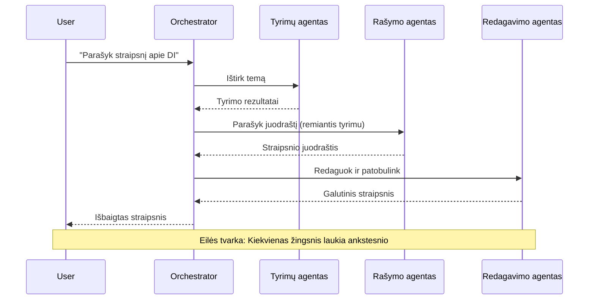
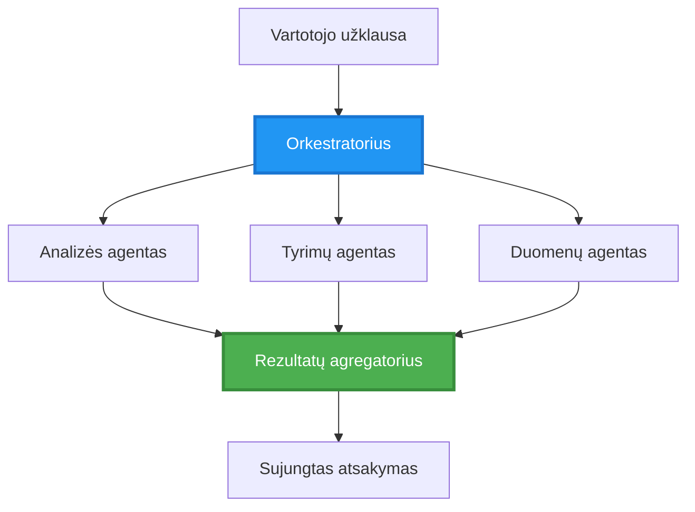
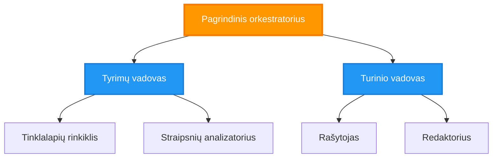
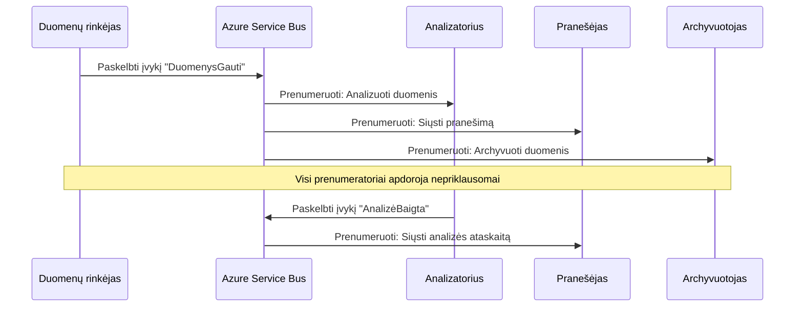
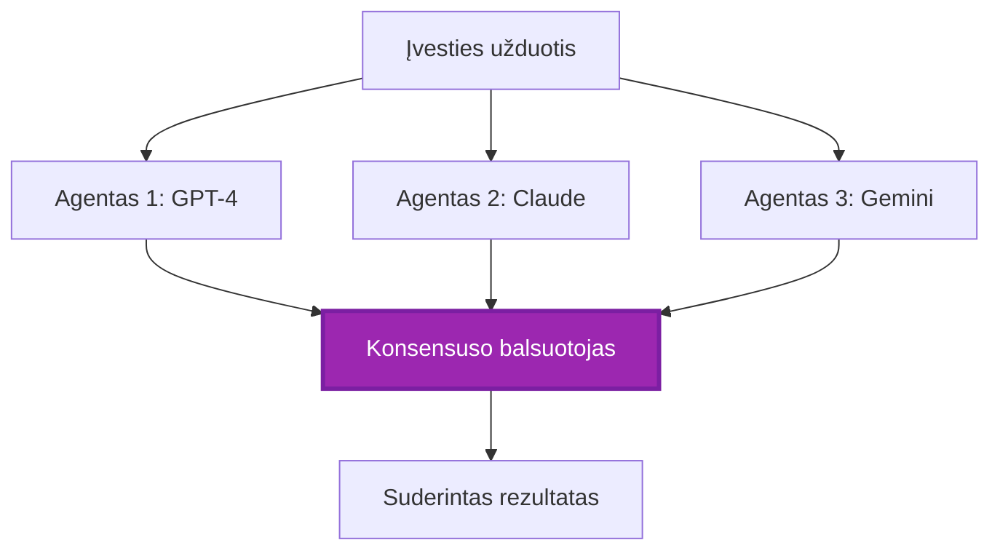
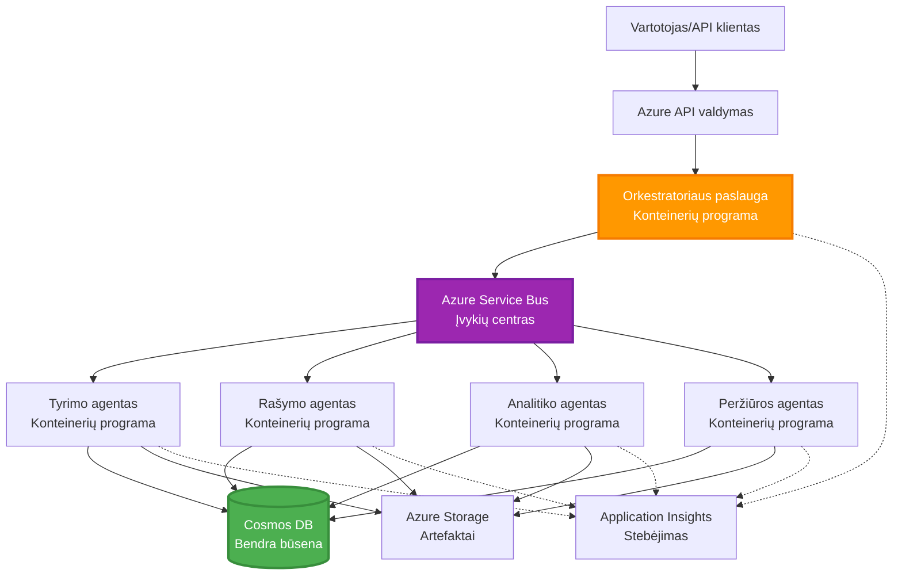

# Kelių agentų koordinavimo šablonai

⏱️ **Apskaičiuotas laikas**: 60–75 minutės | 💰 **Apskaičiuotos sąnaudos**: ~$100-300/mėn | ⭐ **Sudėtingumas**: Pažengęs

**📚 Mokymosi kelias:**
- ← Ankstesnis: [Talpos planavimas](capacity-planning.md) - Išteklių dydžio nustatymas ir mastelio keitimo strategijos
- 🎯 **Jūs esate čia**: Kelių agentų koordinavimo šablonai (Orkestracija, komunikacija, būsenos valdymas)
- → Tolimesnis: [SKU pasirinkimas](sku-selection.md) - Tinkamų Azure paslaugų pasirinkimas
- 🏠 [Kurso pradžia](../../README.md)

---

## Ko sužinosite

Baigę šią pamoką jūs:
- Suprasite **daugiagentės architektūros** šablonus ir kada juos naudoti
- Įgyvendinsite **orkestracijos šablonus** (centralizuota, decentralizuota, hierarchinė)
- Sukursite **agentų komunikacijos** strategijas (sinchroninė, asinchroninė, įvykių valdomas)
- Valdyti **bendrą būseną** tarp paskirstytų agentų
- Diegsite **daugiagentines sistemas** Azure su AZD
- Taikysite **koordinacijos šablonus** realaus pasaulio AI scenarijuose
- Stebėsite ir derinsite paskirstytas agentų sistemas

## Kodėl kelių agentų koordinacija yra svarbi

### Evoliucija: nuo vieno agente iki kelių agentų

**Vienas agentas (Paprasčiau):**
```
User → Agent → Response
```
- ✅ Lengva suprasti ir įgyvendinti
- ✅ Greita paprastoms užduotims
- ❌ Ribota vieno modelio galimybėmis
- ❌ Negalima paralelizuoti sudėtingų užduočių
- ❌ Nėra specializacijos

**Daugiagentė sistema (Pažengusi):**
```
           ┌─────────────┐
           │ Orchestrator│
           └──────┬──────┘
        ┌─────────┼─────────┐
        │         │         │
    ┌───▼──┐  ┌──▼───┐  ┌──▼────┐
    │Agent1│  │Agent2│  │Agent3 │
    │(Plan)│  │(Code)│  │(Review)│
    └──────┘  └──────┘  └───────┘
```
- ✅ Specializuoti agentai konkrečioms užduotims
- ✅ Parallelinis vykdymas greičiai
- ✅ Modulinė ir prižiūrima struktūra
- ✅ Geresnė sudėtingiems darbo eigoms
- ⚠️ Reikia koordinacijos logikos

**Analogija**: Vienas agentas yra kaip vienas žmogus, atliekantis visas užduotis. Daugiagentė sistema – kaip komanda, kur kiekvienas narys turi specializuotus įgūdžius (tyrėjas, programuotojas, recenzentas, rašytojas), dirbantys kartu.

---

## Pagrindiniai koordinacijos šablonai

### Šablonas 1: Sekvencinė koordinacija (Atsakomybės grandinė)

**Kada naudoti**: Užduotys turi būti atliktos konkrečia tvarka, kiekvienas agentas remiasi ankstesniu rezultatu.



**Privalumai:**
- ✅ Aiškus duomenų srautas
- ✅ Lengva derinti
- ✅ Numatomos vykdymo eilės

**Apribojimai:**
- ❌ Lėtesnis (nėra paralelizmo)
- ❌ Vienas gedimas blokuoja visą grandinę
- ❌ Negali tvarkyti tarpusavyje priklausomų užduočių

**Naudojimo pavyzdžiai:**
- Turinų kūrimo procesas (tyrimai → rašymas → redagavimas → paskelbimas)
- Kodo generavimas (planavimas → įgyvendinimas → testavimas → diegimas)
- Ataskaitų kūrimas (duomenų rinkimas → analizė → vizualizavimas → santrauka)

---

### Šablonas 2: Parallelinė koordinacija (Fan-Out/Fan-In)

**Kada naudoti**: Nepriklausomos užduotys gali vykti vienu metu, rezultatai sujungiami pabaigoje.


**Privalumai:**
- ✅ Greita (paralelinis vykdymas)
- ✅ Atspari gedimams (daliniai rezultatai priimtini)
- ✅ Horizontaliai skalė

**Apribojimai:**
- ⚠️ Rezultatai gali atkeliauti ne tvarka
- ⚠️ Reikia agregacijos logikos
- ⚠️ Sudėtingas būsenos valdymas

**Naudojimo pavyzdžiai:**
- Duomenų rinkimas iš kelių šaltinių (API + duomenų bazės + web scraping)
- Konkurencinė analizė (keli modeliai generuoja sprendimus, pasirenkamas geriausias)
- Vertimo paslaugos (vertimas į kelias kalbas vienu metu)

---

### Šablonas 3: Hierarchinė koordinacija (Vadovas-Darbuotojas)

**Kada naudoti**: Sudėtingos darbo eigos su sub-užduotimis, reikia delegavimo.


**Privalumai:**
- ✅ Tvarko sudėtingas darbo eigas
- ✅ Modulinė ir prižiūrima
- ✅ Aiškios atsakomybės ribos

**Apribojimai:**
- ⚠️ Sudėtingesnė architektūra
- ⚠️ Didesnis delsimas (kelios koordinacijos sluoksniai)
- ⚠️ Reikia pažangios orkestracijos

**Naudojimo pavyzdžiai:**
- Įmonės dokumentų apdorojimas (klasifikavimas → maršrutavimas → apdorojimas → archyvavimas)
- Daugiapakopės duomenų srautų (įsisavinimas → valymas → transformavimas → analizė → ataskaita)
- Sudėtingos automatizacijos darbo eigos (planavimas → išteklių paskirstymas → vykdymas → stebėsena)

---

### Šablonas 4: Įvykių valdomas koordinavimas (Publish-Subscribe)

**Kada naudoti**: Agentai turi reaguoti į įvykius, pageidaujamas laisvas susiejimas.


**Privalumai:**
- ✅ Laisvas susiejimas tarp agentų
- ✅ Lengva pridėti naujus agentus (tereikia užsiprenumeruoti)
- ✅ Asinchroninis apdorojimas
- ✅ Atsparus (žinučių išlikimas)

**Apribojimai:**
- ⚠️ Galiausiai nuoseklumas (eventual consistency)
- ⚠️ Sudėtingas derinimas
- ⚠️ Iššūkiai su žinučių tvarka

**Naudojimo pavyzdžiai:**
- Realaus laiko stebėjimo sistemos (įspėjimai, skydeliai, žurnalai)
- Daugiakanalės pranešimų sistemos (el. paštas, SMS, push, Slack)
- Duomenų apdorojimo vamzdynai (daugybė to paties duomenų vartotojų)

---

### Šablonas 5: Konsensusinis koordinavimas (Balsavimas/Kvorumas)

**Kada naudoti**: Reikia kelių agentų sutarimo prieš tęsiant.


**Privalumai:**
- ✅ Didesnis tikslumas (keletas nuomonių)
- ✅ Atsparus gedimams (mažumai nepavykus priimama)
- ✅ Įmontuota kokybės užtikrinimas

**Apribojimai:**
- ❌ Brangu (kelios modelių užklausos)
- ❌ Lėčiau (laukiant visų agentų)
- ⚠️ Reikalingas konfliktų sprendimas

**Naudojimo pavyzdžiai:**
- Turinų moderavimas (keletas modelių peržiūri turinį)
- Kodo peržiūra (keli linteriai/analizatoriai)
- Medicininė diagnostika (keletas AI modelių, ekspertų patvirtinimas)

---

## Architektūros apžvalga

### Pilna kelių agentų sistema Azure


**Pagrindinės sudedamosios dalys:**

| Component | Purpose | Azure Service |
|-----------|---------|---------------|
| **API Gateway** | Įėjimo taškas, ribojimas pagal užklausų skaičių, autentifikacija | API Management |
| **Orkestratorius** | Koordinuoja agentų darbo eigas | Container Apps |
| **Pranešimų eilė** | Asinchroninė komunikacija | Service Bus / Event Hubs |
| **Agentai** | Specializuoti AI darbai | Container Apps / Functions |
| **Būsenos saugykla** | Bendroji būsena, užduočių stebėjimas | Cosmos DB |
| **Artefaktų saugykla** | Dokumentai, rezultatai, žurnalai | Blob Storage |
| **Stebėjimas** | Paskirstytas trasavimas, žurnalai | Application Insights |

---

## Išankstiniai reikalavimai

### Būtini įrankiai

```bash
# Patikrinkite Azure Developer CLI
azd version
# ✅ Laukiama: azd versija 1.0.0 arba naujesnė

# Patikrinkite Azure CLI
az --version
# ✅ Laukiama: azure-cli 2.50.0 arba naujesnė

# Patikrinkite Docker (lokaliam testavimui)
docker --version
# ✅ Laukiama: Docker versija 20.10 arba naujesnė
```

### Azure reikalavimai

- Aktyvi Azure prenumerata
- Leidimai kurti:
  - Container Apps
  - Service Bus namespaces
  - Cosmos DB accounts
  - Storage accounts
  - Application Insights

### Reikalingos žinios

Jūs turėtumėte būti baigę:
- [Konfigūracijos valdymas](../chapter-03-configuration/configuration.md)
- [Autentifikacija ir saugumas](../chapter-03-configuration/authsecurity.md)
- [Microservices pavyzdys](../../../../examples/microservices)

---

## Įgyvendinimo vadovas

### Projekto struktūra

```
multi-agent-system/
├── azure.yaml                    # AZD configuration
├── infra/
│   ├── main.bicep               # Main infrastructure
│   ├── core/
│   │   ├── servicebus.bicep     # Message queue
│   │   ├── cosmos.bicep         # State store
│   │   ├── storage.bicep        # Artifact storage
│   │   └── monitoring.bicep     # Application Insights
│   └── app/
│       ├── orchestrator.bicep   # Orchestrator service
│       └── agent.bicep          # Agent template
└── src/
    ├── orchestrator/            # Orchestration logic
    │   ├── app.py
    │   ├── workflows.py
    │   └── Dockerfile
    ├── agents/
    │   ├── research/            # Research agent
    │   ├── writer/              # Writer agent
    │   ├── analyst/             # Analyst agent
    │   └── reviewer/            # Reviewer agent
    └── shared/
        ├── state_manager.py     # Shared state logic
        └── message_handler.py   # Message handling
```

---

## Pamoka 1: Sekvencinė koordinacijos schema

### Įgyvendinimas: Turinų kūrimo linija

Sukurkime sekančią sekvencinę liniją: Tyrimai → Rašymas → Redagavimas → Paskelbimas

### 1. AZD konfigūracija

**Failas: `azure.yaml`**

```yaml
name: content-pipeline
metadata:
  template: multi-agent-sequential@1.0.0

services:
  orchestrator:
    project: ./src/orchestrator
    language: python
    host: containerapp
  
  research-agent:
    project: ./src/agents/research
    language: python
    host: containerapp
  
  writer-agent:
    project: ./src/agents/writer
    language: python
    host: containerapp
  
  editor-agent:
    project: ./src/agents/editor
    language: python
    host: containerapp
```

### 2. Infrastruktūra: Service Bus koordinacijai

**Failas: `infra/core/servicebus.bicep`**

```bicep
param name string
param location string
param tags object = {}

resource serviceBusNamespace 'Microsoft.ServiceBus/namespaces@2022-10-01-preview' = {
  name: name
  location: location
  tags: tags
  sku: {
    name: 'Standard'
    tier: 'Standard'
  }
  properties: {
    minimumTlsVersion: '1.2'
  }
}

// Queue for orchestrator → research agent
resource researchQueue 'Microsoft.ServiceBus/namespaces/queues@2022-10-01-preview' = {
  parent: serviceBusNamespace
  name: 'research-tasks'
  properties: {
    maxDeliveryCount: 3
    lockDuration: 'PT5M'
    deadLetteringOnMessageExpiration: true
  }
}

// Queue for research agent → writer agent
resource writerQueue 'Microsoft.ServiceBus/namespaces/queues@2022-10-01-preview' = {
  parent: serviceBusNamespace
  name: 'writer-tasks'
  properties: {
    maxDeliveryCount: 3
    lockDuration: 'PT5M'
  }
}

// Queue for writer agent → editor agent
resource editorQueue 'Microsoft.ServiceBus/namespaces/queues@2022-10-01-preview' = {
  parent: serviceBusNamespace
  name: 'editor-tasks'
  properties: {
    maxDeliveryCount: 3
    lockDuration: 'PT5M'
  }
}

output namespace string = serviceBusNamespace.name
output connectionString string = listKeys('${serviceBusNamespace.id}/AuthorizationRules/RootManageSharedAccessKey', serviceBusNamespace.apiVersion).primaryConnectionString
```

### 3. Bendras būsenos valdiklis

**Failas: `src/shared/state_manager.py`**

```python
from azure.cosmos import CosmosClient, PartitionKey
from datetime import datetime
import os

class StateManager:
    """Manages shared state across agents using Cosmos DB"""
    
    def __init__(self):
        endpoint = os.environ['COSMOS_ENDPOINT']
        key = os.environ['COSMOS_KEY']
        
        self.client = CosmosClient(endpoint, key)
        self.database = self.client.get_database_client('agent-state')
        self.container = self.database.get_container_client('tasks')
    
    def create_task(self, task_id: str, task_type: str, input_data: dict):
        """Create a new task"""
        task = {
            'id': task_id,
            'type': task_type,
            'status': 'pending',
            'input': input_data,
            'created_at': datetime.utcnow().isoformat(),
            'steps': []
        }
        self.container.create_item(task)
        return task
    
    def update_task_step(self, task_id: str, step_name: str, result: dict):
        """Update task with completed step"""
        task = self.container.read_item(task_id, partition_key=task_id)
        
        task['steps'].append({
            'name': step_name,
            'completed_at': datetime.utcnow().isoformat(),
            'result': result
        })
        
        self.container.replace_item(task_id, task)
        return task
    
    def complete_task(self, task_id: str, final_result: dict):
        """Mark task as complete"""
        task = self.container.read_item(task_id, partition_key=task_id)
        task['status'] = 'completed'
        task['result'] = final_result
        task['completed_at'] = datetime.utcnow().isoformat()
        self.container.replace_item(task_id, task)
        return task
    
    def get_task(self, task_id: str):
        """Retrieve task state"""
        return self.container.read_item(task_id, partition_key=task_id)
```

### 4. Orkestratoriaus paslauga

**Failas: `src/orchestrator/app.py`**

```python
from flask import Flask, request, jsonify
from azure.servicebus import ServiceBusClient, ServiceBusMessage
import json
import uuid
import os
from shared.state_manager import StateManager

app = Flask(__name__)
state_manager = StateManager()

# Service Bus prisijungimas
servicebus_connection_str = os.environ['SERVICEBUS_CONNECTION_STRING']
servicebus_client = ServiceBusClient.from_connection_string(servicebus_connection_str)

@app.route('/health', methods=['GET'])
def health():
    return jsonify({'status': 'healthy', 'service': 'orchestrator'})

@app.route('/create-content', methods=['POST'])
def create_content():
    """
    Sequential workflow: Research → Write → Edit → Publish
    """
    data = request.json
    topic = data.get('topic')
    
    if not topic:
        return jsonify({'error': 'Topic required'}), 400
    
    # Sukurti užduotį būsenos saugykloje
    task_id = str(uuid.uuid4())
    task = state_manager.create_task(
        task_id=task_id,
        task_type='content_creation',
        input_data={'topic': topic}
    )
    
    # Siųsti žinutę tyrimo agentui (pirmas žingsnis)
    sender = servicebus_client.get_queue_sender('research-tasks')
    message = ServiceBusMessage(
        body=json.dumps({
            'task_id': task_id,
            'topic': topic,
            'next_queue': 'writer-tasks'  # Kur siųsti rezultatus
        }),
        content_type='application/json'
    )
    
    with sender:
        sender.send_messages(message)
    
    return jsonify({
        'task_id': task_id,
        'status': 'started',
        'workflow': 'sequential',
        'steps': ['research', 'write', 'edit', 'publish'],
        'message': 'Content creation pipeline initiated'
    }), 202

@app.route('/task/<task_id>', methods=['GET'])
def get_task_status(task_id):
    """Check task status"""
    try:
        task = state_manager.get_task(task_id)
        return jsonify(task)
    except Exception as e:
        return jsonify({'error': str(e)}), 404

if __name__ == '__main__':
    app.run(host='0.0.0.0', port=8080)
```

### 5. Tyrimo agentas

**Failas: `src/agents/research/app.py`**

```python
from azure.servicebus import ServiceBusClient, ServiceBusMessage
from openai import AzureOpenAI
import json
import os
import time
from shared.state_manager import StateManager

# Inicializuoti klientus
state_manager = StateManager()
servicebus_client = ServiceBusClient.from_connection_string(
    os.environ['SERVICEBUS_CONNECTION_STRING']
)

openai_client = AzureOpenAI(
    api_key=os.environ['AZURE_OPENAI_API_KEY'],
    api_version="2024-02-01",
    azure_endpoint=os.environ['AZURE_OPENAI_ENDPOINT']
)

def process_research_task(message_data):
    """Process research request and pass to writer"""
    task_id = message_data['task_id']
    topic = message_data['topic']
    next_queue = message_data['next_queue']
    
    print(f"🔬 Researching: {topic}")
    
    # Kviesti Azure OpenAI tyrimams
    response = openai_client.chat.completions.create(
        model="gpt-4",
        messages=[
            {"role": "system", "content": "You are a research assistant. Provide comprehensive research on the given topic."},
            {"role": "user", "content": f"Research this topic thoroughly: {topic}"}
        ],
        max_tokens=1500
    )
    
    research_results = response.choices[0].message.content
    
    # Atnaujinti būseną
    state_manager.update_task_step(
        task_id=task_id,
        step_name='research',
        result={'research': research_results}
    )
    
    # Siųsti kitam agentui (rašytojui)
    sender = servicebus_client.get_queue_sender(next_queue)
    message = ServiceBusMessage(
        body=json.dumps({
            'task_id': task_id,
            'topic': topic,
            'research': research_results,
            'next_queue': 'editor-tasks'
        }),
        content_type='application/json'
    )
    
    with sender:
        sender.send_messages(message)
    
    print(f"✅ Research complete for task {task_id}")

def main():
    """Listen to research queue"""
    receiver = servicebus_client.get_queue_receiver('research-tasks')
    
    print("🔬 Research Agent started, listening for tasks...")
    
    with receiver:
        while True:
            messages = receiver.receive_messages(max_wait_time=5)
            for message in messages:
                try:
                    message_data = json.loads(str(message))
                    process_research_task(message_data)
                    receiver.complete_message(message)
                except Exception as e:
                    print(f"❌ Error processing message: {e}")
                    receiver.abandon_message(message)

if __name__ == '__main__':
    main()
```

### 6. Rašytojo agentas

**Failas: `src/agents/writer/app.py`**

```python
from azure.servicebus import ServiceBusClient, ServiceBusMessage
from openai import AzureOpenAI
import json
import os
from shared.state_manager import StateManager

state_manager = StateManager()
servicebus_client = ServiceBusClient.from_connection_string(
    os.environ['SERVICEBUS_CONNECTION_STRING']
)

openai_client = AzureOpenAI(
    api_key=os.environ['AZURE_OPENAI_API_KEY'],
    api_version="2024-02-01",
    azure_endpoint=os.environ['AZURE_OPENAI_ENDPOINT']
)

def process_writing_task(message_data):
    """Write article based on research"""
    task_id = message_data['task_id']
    topic = message_data['topic']
    research = message_data['research']
    next_queue = message_data['next_queue']
    
    print(f"✍️ Writing article: {topic}")
    
    # Iškviesti Azure OpenAI parašyti straipsnį
    response = openai_client.chat.completions.create(
        model="gpt-4",
        messages=[
            {"role": "system", "content": "You are a professional writer. Write engaging, well-structured articles."},
            {"role": "user", "content": f"Based on this research:\n\n{research}\n\nWrite a comprehensive article about: {topic}"}
        ],
        max_tokens=2000
    )
    
    article_draft = response.choices[0].message.content
    
    # Atnaujinti būseną
    state_manager.update_task_step(
        task_id=task_id,
        step_name='writing',
        result={'draft': article_draft}
    )
    
    # Siųsti redaktoriui
    sender = servicebus_client.get_queue_sender(next_queue)
    message = ServiceBusMessage(
        body=json.dumps({
            'task_id': task_id,
            'topic': topic,
            'draft': article_draft
        }),
        content_type='application/json'
    )
    
    with sender:
        sender.send_messages(message)
    
    print(f"✅ Article draft complete for task {task_id}")

def main():
    """Listen to writer queue"""
    receiver = servicebus_client.get_queue_receiver('writer-tasks')
    
    print("✍️ Writer Agent started, listening for tasks...")
    
    with receiver:
        while True:
            messages = receiver.receive_messages(max_wait_time=5)
            for message in messages:
                try:
                    message_data = json.loads(str(message))
                    process_writing_task(message_data)
                    receiver.complete_message(message)
                except Exception as e:
                    print(f"❌ Error: {e}")
                    receiver.abandon_message(message)

if __name__ == '__main__':
    main()
```

### 7. Redaktoriaus agentas

**Failas: `src/agents/editor/app.py`**

```python
from azure.servicebus import ServiceBusClient
from openai import AzureOpenAI
import json
import os
from shared.state_manager import StateManager

state_manager = StateManager()
servicebus_client = ServiceBusClient.from_connection_string(
    os.environ['SERVICEBUS_CONNECTION_STRING']
)

openai_client = AzureOpenAI(
    api_key=os.environ['AZURE_OPENAI_API_KEY'],
    api_version="2024-02-01",
    azure_endpoint=os.environ['AZURE_OPENAI_ENDPOINT']
)

def process_editing_task(message_data):
    """Edit and finalize article"""
    task_id = message_data['task_id']
    topic = message_data['topic']
    draft = message_data['draft']
    
    print(f"📝 Editing article: {topic}")
    
    # Kviesti Azure OpenAI redaguoti
    response = openai_client.chat.completions.create(
        model="gpt-4",
        messages=[
            {"role": "system", "content": "You are an expert editor. Improve grammar, clarity, and structure."},
            {"role": "user", "content": f"Edit and improve this article:\n\n{draft}"}
        ],
        max_tokens=2000
    )
    
    final_article = response.choices[0].message.content
    
    # Pažymėti užduotį kaip atliktą
    state_manager.complete_task(
        task_id=task_id,
        final_result={
            'topic': topic,
            'final_article': final_article,
            'word_count': len(final_article.split())
        }
    )
    
    print(f"✅ Article finalized for task {task_id}")

def main():
    """Listen to editor queue"""
    receiver = servicebus_client.get_queue_receiver('editor-tasks')
    
    print("📝 Editor Agent started, listening for tasks...")
    
    with receiver:
        while True:
            messages = receiver.receive_messages(max_wait_time=5)
            for message in messages:
                try:
                    message_data = json.loads(str(message))
                    process_editing_task(message_data)
                    receiver.complete_message(message)
                except Exception as e:
                    print(f"❌ Error: {e}")
                    receiver.abandon_message(message)

if __name__ == '__main__':
    main()
```

### 8. Diegimas ir testavimas

```bash
# Inicializuoti ir diegti
azd init
azd up

# Gauti orkestratoriaus URL
ORCHESTRATOR_URL=$(azd env get-values | grep ORCHESTRATOR_URL | cut -d '=' -f2 | tr -d '"')

# Sukurti turinį
curl -X POST $ORCHESTRATOR_URL/create-content \
  -H "Content-Type: application/json" \
  -d '{"topic": "The Future of AI in Healthcare"}'
```

**✅ Tikėtinas išvestis:**
```json
{
  "task_id": "a1b2c3d4-e5f6-7890-abcd-ef1234567890",
  "status": "started",
  "workflow": "sequential",
  "steps": ["research", "write", "edit", "publish"],
  "message": "Content creation pipeline initiated"
}
```

**Patikrinkite užduoties eigą:**
```bash
TASK_ID="a1b2c3d4-e5f6-7890-abcd-ef1234567890"
curl $ORCHESTRATOR_URL/task/$TASK_ID
```

**✅ Tikėtinas išvestis (užbaigta):**
```json
{
  "id": "a1b2c3d4-e5f6-7890-abcd-ef1234567890",
  "type": "content_creation",
  "status": "completed",
  "steps": [
    {
      "name": "research",
      "completed_at": "2025-11-19T10:30:00Z",
      "result": {"research": "..."}
    },
    {
      "name": "writing",
      "completed_at": "2025-11-19T10:32:00Z",
      "result": {"draft": "..."}
    }
  ],
  "result": {
    "topic": "The Future of AI in Healthcare",
    "final_article": "...",
    "word_count": 1500
  }
}
```

---

## Pamoka 2: Parallelinė koordinacijos schema

### Įgyvendinimas: Kelių šaltinių tyrimų surinktuvė

Sukurkime paralelinę sistemą, kuri vienu metu renka informaciją iš kelių šaltinių.

### Parallelinis orkestratorius

**Failas: `src/orchestrator/parallel_workflow.py`**

```python
from flask import Flask, request, jsonify
from azure.servicebus import ServiceBusClient, ServiceBusMessage
import json
import uuid
import os
from shared.state_manager import StateManager

app = Flask(__name__)
state_manager = StateManager()

servicebus_client = ServiceBusClient.from_connection_string(
    os.environ['SERVICEBUS_CONNECTION_STRING']
)

@app.route('/research-parallel', methods=['POST'])
def research_parallel():
    """
    Parallel workflow: Multiple agents work simultaneously
    """
    data = request.json
    query = data.get('query')
    
    task_id = str(uuid.uuid4())
    task = state_manager.create_task(
        task_id=task_id,
        task_type='parallel_research',
        input_data={
            'query': query,
            'agents': ['web', 'academic', 'news', 'social']
        }
    )
    
    # Fan-out: Siųsti visiems agentams vienu metu
    agents = [
        ('web-research-queue', 'web'),
        ('academic-research-queue', 'academic'),
        ('news-research-queue', 'news'),
        ('social-research-queue', 'social')
    ]
    
    for queue_name, agent_type in agents:
        sender = servicebus_client.get_queue_sender(queue_name)
        message = ServiceBusMessage(
            body=json.dumps({
                'task_id': task_id,
                'query': query,
                'agent_type': agent_type,
                'result_queue': 'aggregation-queue'
            }),
            content_type='application/json'
        )
        
        with sender:
            sender.send_messages(message)
    
    return jsonify({
        'task_id': task_id,
        'status': 'started',
        'workflow': 'parallel',
        'agents_dispatched': 4,
        'message': 'Parallel research initiated'
    }), 202

if __name__ == '__main__':
    app.run(host='0.0.0.0', port=8080)
```

### Agregacijos logika

**Failas: `src/agents/aggregator/app.py`**

```python
from azure.servicebus import ServiceBusClient
import json
import os
from collections import defaultdict
from shared.state_manager import StateManager

state_manager = StateManager()
servicebus_client = ServiceBusClient.from_connection_string(
    os.environ['SERVICEBUS_CONNECTION_STRING']
)

# Sekti rezultatus kiekvienai užduočiai
task_results = defaultdict(list)
expected_agents = 4  # internetas, akademinė sritis, naujienos, socialiniai tinklai

def process_result(message_data):
    """Aggregate results from parallel agents"""
    task_id = message_data['task_id']
    agent_type = message_data['agent_type']
    result = message_data['result']
    
    # Išsaugoti rezultatą
    task_results[task_id].append({
        'agent': agent_type,
        'data': result
    })
    
    print(f"📊 Received result from {agent_type} agent ({len(task_results[task_id])}/{expected_agents})")
    
    # Patikrinti, ar visi agentai baigė (fan-in)
    if len(task_results[task_id]) == expected_agents:
        print(f"✅ All agents completed for task {task_id}. Aggregating...")
        
        # Sujungti rezultatus
        aggregated = {
            'query': message_data['query'],
            'sources': task_results[task_id],
            'summary': generate_summary(task_results[task_id])
        }
        
        # Pažymėti kaip užbaigtą
        state_manager.complete_task(task_id, aggregated)
        
        # Išvalyti
        del task_results[task_id]
        
        print(f"✅ Aggregation complete for task {task_id}")

def generate_summary(results):
    """Generate summary from all sources"""
    summaries = [r['data'].get('summary', '') for r in results]
    return '\n\n'.join(summaries)

def main():
    """Listen to aggregation queue"""
    receiver = servicebus_client.get_queue_receiver('aggregation-queue')
    
    print("📊 Aggregator started, listening for results...")
    
    with receiver:
        while True:
            messages = receiver.receive_messages(max_wait_time=5)
            for message in messages:
                try:
                    message_data = json.loads(str(message))
                    process_result(message_data)
                    receiver.complete_message(message)
                except Exception as e:
                    print(f"❌ Error: {e}")
                    receiver.abandon_message(message)

if __name__ == '__main__':
    main()
```

**Parallelinio šablono privalumai:**
- ⚡ **4x greičiau** (agentai veikia vienu metu)
- 🔄 **Atsparus gedimams** (daliniai rezultatai priimtini)
- 📈 **Skalė** (lengva pridėti daugiau agentų)

---

## Praktinės užduotys

### Užduotis 1: Pridėti laiko limitų valdymą ⭐⭐ (Vidutinė)

**Tikslas**: Įgyvendinti laiko limitų logiką, kad agregatorius nesulauktų amžinai lėtų agentų.

**Veiksmai**:

1. **Pridėti laiko limitų sekimą į agregatorių:**

```python
from datetime import datetime, timedelta

task_timeouts = {}  # task_id -> expiration_time

def process_result(message_data):
    task_id = message_data['task_id']
    
    # Nustatyti laiko limitą pirmajam rezultatui
    if task_id not in task_timeouts:
        task_timeouts[task_id] = datetime.utcnow() + timedelta(seconds=30)
    
    task_results[task_id].append({
        'agent': message_data['agent_type'],
        'data': message_data['result']
    })
    
    # Patikrinti, ar užbaigta arba baigėsi laikas
    if len(task_results[task_id]) == expected_agents or \
       datetime.utcnow() > task_timeouts[task_id]:
        
        print(f"📊 Aggregating with {len(task_results[task_id])}/{expected_agents} results")
        
        aggregated = {
            'query': message_data['query'],
            'sources': task_results[task_id],
            'completed_agents': len(task_results[task_id]),
            'timed_out': len(task_results[task_id]) < expected_agents
        }
        
        state_manager.complete_task(task_id, aggregated)
        
        # Išvalymas
        del task_results[task_id]
        del task_timeouts[task_id]
```

2. **Išbandyti su dirbtiniais delsais:**

```python
# Vienam agentui pridėkite delsą, kad imituotumėte lėtą apdorojimą
import time
time.sleep(35)  # Viršija 30 sekundžių laiko limitą
```

3. **Diegti ir patikrinti:**

```bash
azd deploy aggregator

# Pateikti užduotį
curl -X POST $ORCHESTRATOR_URL/research-parallel \
  -H "Content-Type: application/json" \
  -d '{"query": "AI safety research"}'

# Patikrinkite rezultatus po 30 sekundžių
curl $ORCHESTRATOR_URL/task/$TASK_ID
```

**✅ Sėkmės kriterijai:**
- ✅ Užduotis baigiasi po 30 sekundžių, net jei agentai nepilni
- ✅ Atsakymas nurodo dalinius rezultatus (`"timed_out": true`)
- ✅ Grąžinami turimi rezultatai (3 iš 4 agentų)

**Trukmė**: 20–25 minutės

---

### Užduotis 2: Įdiegti pakartotinio bandymo logiką ⭐⭐⭐ (Pažengusi)

**Tikslas**: Automatiškai bandyti nepavykusias agentų užduotis prieš pasiduodant.

**Veiksmai**:

1. **Pridėti pakartotinio bandymo sekimą į orkestratorių:**

```python
from dataclasses import dataclass
from typing import Dict

@dataclass
class RetryConfig:
    max_retries: int = 3
    backoff_seconds: int = 5

retry_counts: Dict[str, int] = {}  # pranešimo_id -> pakartojimų_skaičius

def send_with_retry(queue_name: str, message_data: dict, retry_config: RetryConfig):
    """Send message with retry metadata"""
    message_id = message_data.get('message_id', str(uuid.uuid4()))
    message_data['message_id'] = message_id
    message_data['retry_count'] = retry_counts.get(message_id, 0)
    message_data['max_retries'] = retry_config.max_retries
    
    sender = servicebus_client.get_queue_sender(queue_name)
    message = ServiceBusMessage(
        body=json.dumps(message_data),
        content_type='application/json',
        message_id=message_id
    )
    
    with sender:
        sender.send_messages(message)
```

2. **Pridėti pakartotinio bandymo tvarkyklę agentams:**

```python
def process_with_retry(message, receiver, process_func):
    """Process message with automatic retry on failure"""
    try:
        message_data = json.loads(str(message))
        
        # Apdoroti pranešimą
        process_func(message_data)
        
        # Sėkmė - užbaigta
        receiver.complete_message(message)
        
    except Exception as e:
        message_id = message.message_id
        retry_count = message_data.get('retry_count', 0)
        max_retries = message_data.get('max_retries', 3)
        
        if retry_count < max_retries:
            # Pakartoti: atmesti ir vėl įdėti į eilę su padidintu skaičiumi
            print(f"⚠️ Retry {retry_count + 1}/{max_retries} for message {message_id}")
            
            message_data['retry_count'] = retry_count + 1
            
            # Siųsti atgal į tą pačią eilę su vėlavimu
            time.sleep(5 * (retry_count + 1))  # Eksponentinis atidėjimas
            send_with_retry(queue_name, message_data, RetryConfig())
            
            receiver.complete_message(message)  # Pašalinti originalą
        else:
            # Maksimalus pakartojimų skaičius viršytas - perkelti į klaidų eilę
            print(f"❌ Max retries exceeded for message {message_id}")
            receiver.dead_letter_message(
                message,
                reason="MaxRetriesExceeded",
                error_description=str(e)
            )
```

3. **Stebėti dead-letter eilę:**

```python
def monitor_dead_letters():
    """Check dead letter queue for failed messages"""
    receiver = servicebus_client.get_queue_receiver(
        'research-queue',
        sub_queue='deadletter'
    )
    
    with receiver:
        messages = receiver.receive_messages(max_wait_time=5)
        for message in messages:
            print(f"☠️ Dead letter: {message.message_id}")
            print(f"Reason: {message.dead_letter_reason}")
            print(f"Description: {message.dead_letter_error_description}")
```

**✅ Sėkmės kriterijai:**
- ✅ Nepavykusios užduotys automatiškai bandomos iš naujo (iki 3 kartų)
- ✅ Eksponentinis laukimo laikas tarp bandymų (5s, 10s, 15s)
- ✅ Po maksimalios bandymų ribos pranešimai nukeliauja į dead-letter eilę
- ✅ Dead-letter eilę galima stebėti ir paleisti iš naujo

**Trukmė**: 30–40 minutės

---

### Užduotis 3: Įdiegti grandinės pertraukiklį ⭐⭐⭐ (Pažengusi)

**Tikslas**: Užkirsti kelią gedimų kaskadai sustabdant užklausas į neveikiančius agentus.

**Veiksmai**:

1. **Sukurti grandinės pertraukiklio klasę:**

```python
from enum import Enum
from datetime import datetime, timedelta

class CircuitState(Enum):
    CLOSED = "closed"      # Normalus veikimas
    OPEN = "open"          # Gedimas, atmesti užklausas
    HALF_OPEN = "half_open"  # Tikrinama, ar atsigavo

class CircuitBreaker:
    def __init__(self, failure_threshold=5, timeout_seconds=60):
        self.failure_threshold = failure_threshold
        self.timeout_seconds = timeout_seconds
        self.failure_count = 0
        self.last_failure_time = None
        self.state = CircuitState.CLOSED
    
    def call(self, func):
        """Execute function with circuit breaker protection"""
        if self.state == CircuitState.OPEN:
            # Patikrinti, ar pasibaigė laiko limitas
            if datetime.utcnow() - self.last_failure_time > timedelta(seconds=self.timeout_seconds):
                self.state = CircuitState.HALF_OPEN
                print("🔄 Circuit breaker: HALF_OPEN (testing)")
            else:
                raise Exception(f"Circuit breaker OPEN for agent. Try again in {self.timeout_seconds}s")
        
        try:
            result = func()
            
            # Sėkmė
            if self.state == CircuitState.HALF_OPEN:
                self.state = CircuitState.CLOSED
                self.failure_count = 0
                print("✅ Circuit breaker: CLOSED (recovered)")
            
            return result
            
        except Exception as e:
            self.failure_count += 1
            self.last_failure_time = datetime.utcnow()
            
            if self.failure_count >= self.failure_threshold:
                self.state = CircuitState.OPEN
                print(f"🔴 Circuit breaker: OPEN (too many failures)")
            
            raise e
```

2. **Taikyti agentų kvietimams:**

```python
# Orkestratoriuje
agent_circuits = {
    'web': CircuitBreaker(failure_threshold=5, timeout_seconds=60),
    'academic': CircuitBreaker(failure_threshold=5, timeout_seconds=60),
    'news': CircuitBreaker(failure_threshold=5, timeout_seconds=60),
    'social': CircuitBreaker(failure_threshold=5, timeout_seconds=60)
}

def send_to_agent(agent_type, message_data):
    """Send with circuit breaker protection"""
    circuit = agent_circuits[agent_type]
    
    try:
        circuit.call(lambda: send_message(agent_type, message_data))
    except Exception as e:
        print(f"⚠️ Skipping {agent_type} agent: {e}")
        # Tęskite su kitais agentais
```

3. **Išbandyti grandinės pertraukiklį:**

```bash
# Imituoti pasikartojančius gedimus (sustabdyti vieną agentą)
az containerapp stop --name web-research-agent --resource-group rg-agents

# Siųsti kelias užklausas
for i in {1..10}; do
  curl -X POST $ORCHESTRATOR_URL/research-parallel \
    -H "Content-Type: application/json" \
    -d '{"query": "test query '$i'"}'
  sleep 2
done

# Patikrinkite žurnalus - turėtumėte pamatyti, kad grandinė atsidaro po 5 nesėkmių
# Naudokite Azure CLI Container App žurnalams:
az containerapp logs show --name orchestrator --resource-group $RG_NAME --tail 50
```

**✅ Sėkmės kriterijai:**
- ✅ Po 5 gedimų grandinė atsidaro (atsisako užklausų)
- ✅ Po 60 sekundžių grandinė tampa pusiau atvira (testuojama atkūrimas)
- ✅ Kiti agentai tęsia darbą įprastai
- ✅ Grandinė automatiškai užsidaro, kai agentas atsigūsta

**Trukmė**: 40–50 minutės

---

## Stebėjimas ir derinimas

### Paskirstytas trasavimas su Application Insights

**Failas: `src/shared/tracing.py`**

```python
from opencensus.ext.azure.log_exporter import AzureLogHandler
from opencensus.ext.azure.trace_exporter import AzureExporter
from opencensus.trace import config_integration
from opencensus.trace.tracer import Tracer
from opencensus.trace.samplers import AlwaysOnSampler
import logging
import os

# Konfigūruoti sekimą
config_integration.trace_integrations(['requests', 'logging'])

connection_string = os.environ.get('APPLICATIONINSIGHTS_CONNECTION_STRING')

# Sukurti sekiklį
tracer = Tracer(
    exporter=AzureExporter(connection_string=connection_string),
    sampler=AlwaysOnSampler()
)

# Konfigūruoti žurnalavimą
logger = logging.getLogger(__name__)
logger.addHandler(AzureLogHandler(connection_string=connection_string))
logger.setLevel(logging.INFO)

def trace_agent_call(agent_name, task_id, operation):
    """Trace agent operations"""
    with tracer.span(name=f'{agent_name}.{operation}') as span:
        span.add_attribute('agent', agent_name)
        span.add_attribute('task_id', task_id)
        span.add_attribute('operation', operation)
        
        try:
            result = operation()
            span.add_attribute('status', 'success')
            return result
        except Exception as e:
            span.add_attribute('status', 'error')
            span.add_attribute('error', str(e))
            raise
```

### Application Insights užklausos

**Sekite kelių agentų darbo eigas:**

```kusto
// Trace complete workflow for a task
traces
| where customDimensions.task_id == "a1b2c3d4-..."
| project timestamp, message, customDimensions.agent, customDimensions.operation
| order by timestamp asc
```

**Agentų našumo palyginimas:**

```kusto
// Compare agent execution times
dependencies
| where name contains "agent"
| summarize 
    avg_duration = avg(duration),
    p95_duration = percentile(duration, 95),
    count = count()
  by agent = tostring(customDimensions.agent)
| order by avg_duration desc
```

**Gedimų analizė:**

```kusto
// Find which agents fail most
exceptions
| where customDimensions.agent != ""
| summarize 
    failure_count = count(),
    unique_errors = dcount(outerMessage)
  by agent = tostring(customDimensions.agent)
| order by failure_count desc
```

---

## Sąnaudų analizė

### Kelių agentų sistemos sąnaudos (mėnesinės apytikslės)

| Component | Configuration | Cost |
|-----------|--------------|------|
| **Orkestratorius** | 1 Container App (1 vCPU, 2GB) | $30-50 |
| **4 agentai** | 4 Container Apps (0.5 vCPU, 1GB kiekvienas) | $60-120 |
| **Service Bus** | Standard tier, 10M messages | $10-20 |
| **Cosmos DB** | Serverless, 5GB storage, 1M RUs | $25-50 |
| **Blob Storage** | 10GB storage, 100K operations | $5-10 |
| **Application Insights** | 5GB ingestion | $10-15 |
| **Azure OpenAI** | GPT-4, 10M tokens | $100-300 |
| **Iš viso** | | **$240-565/mėn** |

### Sąnaudų optimizavimo strategijos

1. **Naudokite serverless, kur įmanoma:**
   ```bicep
   // Cosmos DB serverless (no minimum cost)
   properties: {
     databaseAccountOfferType: 'Standard'
     capabilities: [{ name: 'EnableServerless' }]
   }
   ```

2. **Sumažinkite agentų mastelį iki nulio, kai jie nenaudojami:**
   ```bicep
   scale: {
     minReplicas: 0  // Scale to zero when no messages
     maxReplicas: 10
   }
   ```

3. **Naudokite paketavimą (batching) Service Bus:**
   ```python
   # Siųsti žinutes partijomis (pigiau)
   sender.send_messages([message1, message2, message3])
   ```

4. **Kešuokite dažnai naudojamus rezultatus:**
   ```python
   # Naudokite Azure Cache for Redis
   if cache.exists(query_hash):
       return cache.get(query_hash)
   ```

---

## Geriausios praktikos

### ✅ DARYKITE:

1. **Naudokite idempotentines operacijas**
   ```python
   # Agentas gali saugiai apdoroti tą patį pranešimą kelis kartus
   def process_task(task_id):
       if state_manager.task_exists(task_id):
           print(f"Task {task_id} already processed, skipping")
           return
       # Apdoroti užduotį...
   ```

2. **Įgyvendinkite išsamią žurnalo (logging) sistemą**
   ```python
   logger.info(f"Agent: {agent_name}, Task: {task_id}, Action: {action}")
   ```

3. **Naudokite koreliacijos identifikatorius**
   ```python
   # Perduoti task_id per visą darbo eigą
   message_data = {
       'task_id': task_id,  # Koreliacijos ID
       'timestamp': datetime.utcnow().isoformat()
   }
   ```

4. **Nustatykite pranešimų galiojimo laiką (TTL)**
   ```bicep
   properties: {
     defaultMessageTimeToLive: 'PT1H'  // 1 hour max
   }
   ```

5. **Stebėkite dead-letter eiles**
   ```python
   # Reguliarus nepavykusių pranešimų stebėjimas
   monitor_dead_letters()
   ```

### ❌ NEDARYKITE:

1. **Nesukurkite ciklinių priklausomybių**
   ```python
   # ❌ BLOGAI: Agentas A → Agentas B → Agentas A (begalinis ciklas)
   # ✅ GERAI: Apibrėžkite aiškų orientuotą aciklišką grafą (DAG)
   ```

2. **Neužblokuokite agentų gijų**
   ```python
   # ❌ BLOGAI: Sinchroninis laukimas
   while not task_complete:
       time.sleep(1)
   
   # ✅ GERAI: Naudokite pranešimų eilės atgalinius kvietimus
   ```

3. **Nenumokite ranka į dalines klaidas**
   ```python
   # ❌ BLOGAI: Nutraukti visą darbo eigą, jei vienam agentui nepavyksta
   # ✅ GERAI: Grąžinti dalinius rezultatus su klaidų žymėmis
   ```

4. **Nenaudokite begalinių pakartojimų**
   ```python
   # ❌ BLOGAI: bandyti be galo
   # ✅ GERAI: max_retries = 3, tada į dead-letter eilę
   ```

---
## Trikčių šalinimo vadovas

### Problema: Žinutės įstringa eilėje

**Simptomai:**
- Žinutės kaupiasi eilėje
- Agentai neapdoroja
- Užduoties būsena užstrigusi "pending"

**Diagnozė:**
```bash
# Patikrinkite eilės gylį
az servicebus queue show \
  --namespace-name mybus \
  --name research-tasks \
  --query "countDetails"

# Patikrinkite agento žurnalus naudodami Azure CLI
az containerapp logs show --name research-agent --resource-group $RG_NAME --tail 50
```

**Sprendimai:**

1. **Padidinkite agentų replikų skaičių:**
   ```bash
   az containerapp update \
     --name research-agent \
     --min-replicas 3 \
     --max-replicas 10
   ```

2. **Patikrinkite mirusių pranešimų eilę:**
   ```bash
   az servicebus queue show \
     --namespace-name mybus \
     --name research-tasks \
     --query "countDetails.deadLetterMessageCount"
   ```

---

### Problema: Užduotis viršija laiko limitą / niekada nebaigiama

**Simptomai:**
- Užduoties būsena lieka "in_progress"
- Kai kurie agentai užbaigia, kiti ne
- Nėra klaidų pranešimų

**Diagnozė:**
```bash
# Patikrinkite užduoties būseną
curl $ORCHESTRATOR_URL/task/$TASK_ID

# Patikrinkite Application Insights
# Vykdykite užklausą: traces | where customDimensions.task_id == "..."
```

**Sprendimai:**

1. **Įdiekite laiko limitą agregatoriuje (Pratimas 1)**

2. **Patikrinkite agentų gedimus naudodami Azure Monitor:**
   ```bash
   # Peržiūrėkite žurnalus naudodami azd monitor
   azd monitor --logs
   
   # Arba naudokite Azure CLI, kad patikrintumėte konkrečios konteinerinės programos žurnalus
   az containerapp logs show --name <agent-name> --resource-group $RG_NAME --follow | grep "ERROR\|FAIL"
   ```

3. **Patikrinkite, ar visi agentai veikia:**
   ```bash
   az containerapp list \
     --resource-group rg-agents \
     --query "[].{name:name, status:properties.runningStatus}"
   ```

---

## Sužinokite daugiau

### Oficialioji dokumentacija
- [Azure Service Bus](https://learn.microsoft.com/azure/service-bus-messaging/service-bus-messaging-overview)
- [Cosmos DB](https://learn.microsoft.com/azure/cosmos-db/introduction)
- [Container Apps DAPR](https://learn.microsoft.com/azure/container-apps/dapr-overview)
- [Multi-Agent Design Patterns](https://learn.microsoft.com/azure/architecture/guide/ai/multi-agent-systems)

### Tolimesni žingsniai šiame kurse
- ← Ankstesnis: [Talpos planavimas](capacity-planning.md)
- → Kitas: [SKU pasirinkimas](sku-selection.md)
- 🏠 [Kurso pradžia](../../README.md)

### Susiję pavyzdžiai
- [Mikroservisų pavyzdys](../../../../examples/microservices) - Paslaugų komunikacijos modeliai
- [Azure OpenAI pavyzdys](../../../../examples/azure-openai-chat) - DI integracija

---

## Santrauka

**Jūs sužinojote:**
- ✅ Penki koordinavimo modeliai (nuoseklus, paralelinis, hierarchinis, įvykių valdomas, konsensusinis)
- ✅ Daugiagentė architektūra Azure (Service Bus, Cosmos DB, Container Apps)
- ✅ Būsenos valdymas paskirstytuose agentuose
- ✅ Laiko apribojimų valdymas, pakartotinių bandymų mechanizmai ir grandinės pertraukikliai
- ✅ Paskirstytų sistemų stebėjimas ir derinimas
- ✅ Išlaidų optimizavimo strategijos

**Pagrindinės išvados:**
1. **Pasirinkite tinkamą modelį** - nuoseklus užsakytoms darbo eigos užduotims, paralelinis greičiui, įvykių valdomas lankstumui
2. **Atsargiai tvarkykite būseną** - naudokite Cosmos DB arba panašią saugyklą bendrai būsenai
3. **Tvarkykite gedimus sklandžiai** - laiko limitai, pakartotiniai bandymai, grandinės pertraukikliai, mirusių pranešimų eilės
4. **Stebėkite viską** - paskirstytas sekimas yra būtinas derinimui
5. **Optimizuokite išlaidas** - sumažinkite mastelį iki nulio, naudokite serverless, įdiekite talpyklą

**Tolimesni žingsniai:**
1. Atlikite praktinius pratimus
2. Sukurkite daugiagentę sistemą savo panaudojimo atvejui
3. Išnagrinėkite [SKU pasirinkimas](sku-selection.md), kad optimizuotumėte našumą ir išlaidas

---

<!-- CO-OP TRANSLATOR DISCLAIMER START -->
Atsakomybės apribojimas:
Šis dokumentas buvo išverstas naudojant dirbtinio intelekto vertimo paslaugą Co-op Translator (https://github.com/Azure/co-op-translator). Nors siekiame tikslumo, atkreipkite dėmesį, kad automatizuoti vertimai gali turėti klaidų ar netikslumų. Pirminis dokumentas jo gimtąja kalba turėtų būti laikomas autoritetingu šaltiniu. Svarbios informacijos atveju rekomenduojame pasinaudoti profesionalaus vertėjo paslaugomis. Mes neatsakome už bet kokius nesusipratimus ar klaidingus aiškinimus, kylančius dėl šio vertimo naudojimo.
<!-- CO-OP TRANSLATOR DISCLAIMER END -->