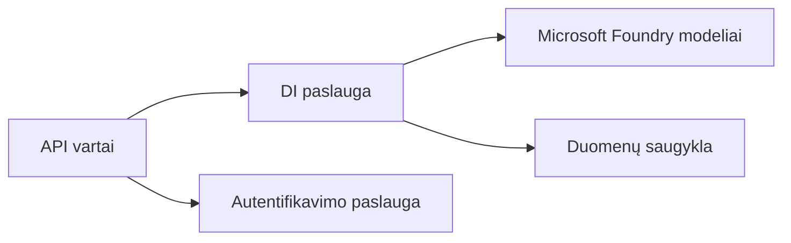
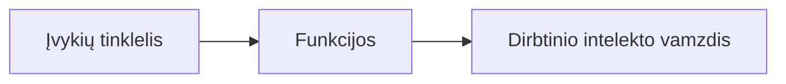

# 8 skyrius: Gamyba ir įmonių modeliai

**📚 Kursas**: [AZD pradedantiesiems](../../README.md) | **⏱️ Trukmė**: 2-3 valandos | **⭐ Sudėtingumas**: Pažengęs

---

## Apžvalga

Šis skyrius aptaria įmonei paruoštus diegimo modelius, saugumo stiprinimą, stebėjimą ir sąnaudų optimizavimą gamybinėms AI apkrovoms.

> Patikrinta su `azd 1.25.6` 2026 m. birželį.

## Mokymosi tikslai

Baigę šį skyrių, jūs:
- Diegsite kelių regionų atsparias programas
- Įgyvendinsite įmonės saugumo modelius
- Konfigūruosite išsamų stebėjimą
- Optimizuosite sąnaudas mastu
- Nustatysite CI/CD vamzdynus su AZD

---

## 📚 Pamokos

| # | Pamoka | Aprašymas | Trukmė |
|---|--------|-----------|--------|
| 1 | [Gamybinės AI praktikos](production-ai-practices.md) | Įmonių diegimo modeliai | 90 min |

---

## 🚀 Gamybos kontrolinis sąrašas

- [ ] Diegimas keliuose regionuose dėl atsparumo
- [ ] Valdoma tapatybė autentifikacijai (be raktų)
- [ ] Application Insights stebėjimui
- [ ] Nustatytos sąnaudų biudžetai ir įspėjimai
- [ ] Įjungtas saugumo skenavimas
- [ ] CI/CD vamzdyno integracija
- [ ] Atsarginio atstatymo planas

---

## 🏗️ Architektūriniai modeliai

### Modelis 1: Mikropaslaugų AI



### Modelis 2: Įvykių valdomas AI



---

## 🔐 Geriausios saugumo praktikos

```bicep
// Use managed identity
identity: {
  type: 'SystemAssigned'
}

// Private endpoints for AI services
properties: {
  publicNetworkAccess: 'Disabled'
  networkAcls: {
    defaultAction: 'Deny'
  }
}
```

---

## 💰 Sąnaudų optimizavimas

| Strategija | Sutaupymas |
|-----------|------------|
| Mastelis iki nulio (Container Apps) | 60-80% |
| Naudoti vartojimo sluoksnius kūrimo aplinkai | 50-70% |
| Planuojamas mastelio keitimas | 30-50% |
| Rezervuota talpa | 20-40% |

```bash
# Nustatyti biudžeto įspėjimus
az consumption budget create \
  --budget-name "AI-Budget" \
  --amount 500 \
  --category Cost \
  --time-grain Monthly
```

---

## 📊 Stebėjimo nustatymas

```bash
# Žurnalų srautas
azd monitor --logs

# Patikrinkite Application Insights
azd monitor --overview

# Peržiūrėti metrikas
az monitor metrics list --resource <resource-id>
```

---

## 🔗 Naršymas

| Kryptis | Skyrius |
|--------|---------|
| **Ankstesnis** | [7 skyrius: Trikčių šalinimas](../chapter-07-troubleshooting/README.md) |
| **Kursas baigtas** | [Kurso pradžia](../../README.md) |

---

## 📖 Susiję ištekliai

- [AI agentų vadovas](../chapter-02-ai-development/agents.md)
- [Application Insights](../chapter-06-pre-deployment/application-insights.md)
- [Daugiagentiniai sprendimai](../chapter-05-multi-agent/README.md)
- [Mikropaslaugų pavyzdys](../../examples/microservices/README.md)

---

<!-- CO-OP TRANSLATOR DISCLAIMER START -->
**Atsakomybės apribojimas**:
Šis dokumentas buvo išverstas naudojant dirbtinio intelekto vertimo paslaugą [Co-op Translator](https://github.com/Azure/co-op-translator). Nors siekiame tikslumo, prašome atkreipti dėmesį, kad automatiniai vertimai gali turėti klaidų ar netikslumų. Originalus dokumentas jo gimtąja kalba laikomas autoritetingu šaltiniu. Svarbiai informacijai rekomenduojama naudoti profesionalų žmogiškąjį vertimą. Mes neatsakome už jokius nesusipratimus ar neteisingą interpretaciją, kilusią naudojantis šiuo vertimu.
<!-- CO-OP TRANSLATOR DISCLAIMER END -->