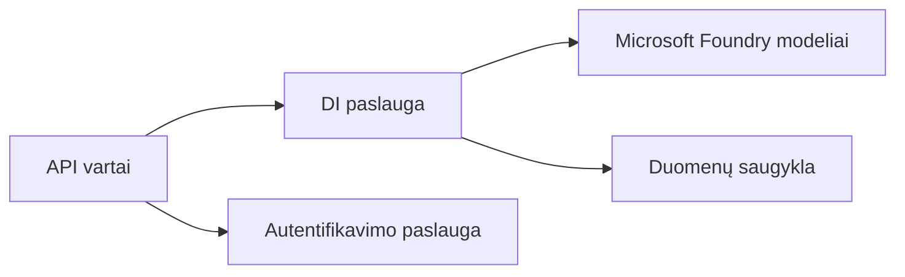
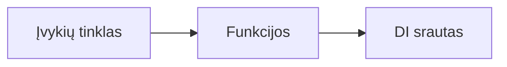

# Skyrius 8: Gamyba ir įmonių modeliai

**📚 Kursas**: [AZD pradedantiesiems](../../README.md) | **⏱️ Trukmė**: 2-3 valandos | **⭐ Sudėtingumas**: Pažengęs

---

## Apžvalga

Šis skyrius apima įmonėms tinkamus diegimo modelius, saugumo sustiprinimą, stebėjimą ir sąnaudų optimizavimą gamybos AI darbo krūviams.

## Mokymosi tikslai

Baigę šį skyrių, jūs:
- Diegti kelių regionų atsparias programas
- Įdiegti įmonės saugumo modelius
- Konfigūruoti visapusišką stebėjimą
- Optimizuoti sąnaudas dideliu mastu
- Nustatyti CI/CD vamzdynus su AZD

---

## 📚 Pamokos

| # | Pamoka | Aprašymas | Laikas |
|---|--------|-----------|--------|
| 1 | [Gamybinės AI praktikos](production-ai-practices.md) | Įmonės diegimo modeliai | 90 min |

---

## 🚀 Gamybos kontrolinis sąrašas

- [ ] Daugių regionų diegimas dėl atsparumo
- [ ] Valdomas identitetas autentifikacijai (be raktų)
- [ ] Application Insights stebėjimui
- [ ] Sąnaudų biudžetai ir įspėjimai sukonfigūruoti
- [ ] Saugumo skenavimas įgalintas
- [ ] CI/CD vamzdynų integracija
- [ ] Avarinio atkūrimo planas

---

## 🏗️ Architektūros modeliai

### Modelis 1: Mikroservisų AI


### Modelis 2: Įvykių valdomas AI


---

## 🔐 Geriausios saugumo praktikos

```bicep
// Use managed identity
identity: {
  type: 'SystemAssigned'
}

// Private endpoints for AI services
properties: {
  publicNetworkAccess: 'Disabled'
  networkAcls: {
    defaultAction: 'Deny'
  }
}
```

---

## 💰 Sąnaudų optimizavimas

| Strategija | Sutaupymai |
|----------|---------|
| Mastelis iki nulio (Container Apps) | 60-80% |
| Naudoti vartojimo lygmenis kūrimo aplinkai | 50-70% |
| Planuotas mastelio keitimas | 30-50% |
| Rezervuota talpa | 20-40% |

```bash
# Nustatyti biudžeto įspėjimus
az consumption budget create \
  --budget-name "AI-Budget" \
  --amount 500 \
  --category Cost \
  --time-grain Monthly
```

---

## 📊 Stebėjimo nustatymas

```bash
# Transliuoti žurnalus
azd monitor --logs

# Patikrinti Application Insights
azd monitor

# Peržiūrėti metrikas
az monitor metrics list --resource <resource-id>
```

---

## 🔗 Navigacija

| Kryptis | Skyrius |
|-----------|---------|
| **Ankstesnis** | [7 skyrius: Gedimų šalinimas](../chapter-07-troubleshooting/README.md) |
| **Kursas baigtas** | [Kurso pradžia](../../README.md) |

---

## 📖 Susiję ištekliai

- [AI agentų vadovas](../chapter-02-ai-development/agents.md)
- [Application Insights](../chapter-06-pre-deployment/application-insights.md)
- [Daugių agentų sprendimai](../chapter-05-multi-agent/README.md)
- [Mikroservisų pavyzdys](../../examples/microservices/README.md)

---

<!-- CO-OP TRANSLATOR DISCLAIMER START -->
**Atsakomybės apribojimas**:
Šis dokumentas buvo išverstas naudojant dirbtinio intelekto vertimo paslaugą [Co-op Translator](https://github.com/Azure/co-op-translator). Nors siekiame tikslumo, prašome atkreipti dėmesį, kad automatizuoti vertimai gali turėti klaidų ar netikslumų. Originalus dokumentas jo gimtąja kalba turėtų būti laikomas autoritetingu šaltiniu. Dėl kritinės informacijos rekomenduojamas profesionalus, žmogaus atliktas vertimas. Mes neatsakome už jokius nesusipratimus ar neteisingus aiškinimus, kilusius dėl šio vertimo naudojimo.
<!-- CO-OP TRANSLATOR DISCLAIMER END -->