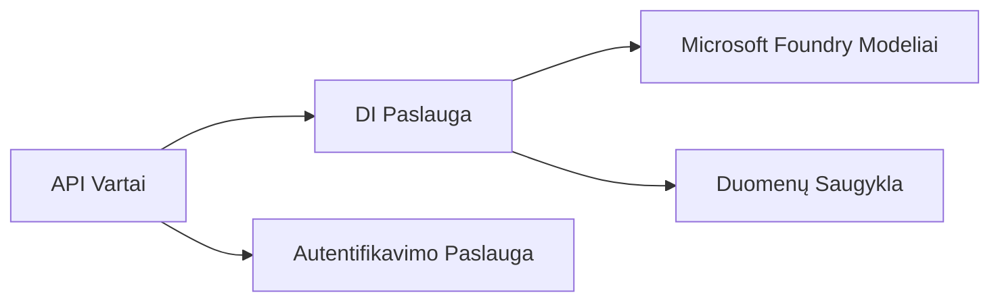
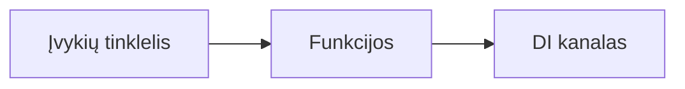

# 8 skyrius: Produkcijos ir įmonių modeliai

**📚 Kursas**: [AZD pradedantiesiems](../../README.md) | **⏱️ Trukmė**: 2–3 valandos | **⭐ Sudėtingumas**: Išplėstinis

---

## Apžvalga

Šiame skyriuje aptariami įmonių lygmens diegimo modeliai, saugumo stiprinimas, stebėsena ir kaštų optimizavimas dirbtinio intelekto gamybos darbo krūviams.

> Patikrinta su `azd 1.27.1` 2026 m. liepos mėn.

## Mokymosi tikslai

Baigę šį skyrių jūs:
- Įdiegsime daugregionius atsparius taikomųjų programų sprendimus
- Įgyvendinsime įmonių saugumo modelius
- Suprasime visapusišką stebėsenos konfigūraciją
- Optimizuosime kaštus dideliu mastu
- Sukursime CI/CD vamzdynus naudojant AZD

---

## 📚 Pamokos

| # | Pamoka | Aprašymas | Trukmė |
|---|--------|-------------|------|
| 1 | [Dirbtinio intelekto gamybos praktikos](production-ai-practices.md) | Įmonių diegimo modeliai | 90 min |

---

## 🚀 Produkcijos kontrolinis sąrašas

- [ ] Daugregionis diegimas dėl atsparumo
- [ ] Tvarkoma tapatybė autentifikacijai (be raktų)
- [ ] Application Insights stebėsenai
- [ ] Nustatytos sąnaudų biudžeto ribos ir įspėjimai
- [ ] Įjungta saugumo skenavimas
- [ ] CI/CD vamzdyno integracija
- [ ] Atsarginių kopijų atkūrimo planas

---

## 🏗️ Architektūros modeliai

### Modelis 1: Mikroservisų DI



### Modelis 2: Įvykių varomas DI



---

## 🔐 Geriausios saugumo praktikos

```bicep
// Use managed identity
identity: {
  type: 'SystemAssigned'
}

// Private endpoints for AI services
properties: {
  publicNetworkAccess: 'Disabled'
  networkAcls: {
    defaultAction: 'Deny'
  }
}
```

---

## 💰 Sąnaudų optimizavimas

| Strategija | Sutaupymai |
|----------|------------|
| Mastelio keitimas iki nulio (Container Apps) | 60-80 % |
| Naudoti vartojimo lygius kūrimui | 50-70 % |
| Planuojamas mastelio keitimas | 30-50 % |
| Rezervuota talpa | 20-40 % |

```bash
# Nustatyti biudžeto įspėjimus
az consumption budget create \
  --budget-name "AI-Budget" \
  --amount 500 \
  --category Cost \
  --time-grain Monthly
```

---

## 📊 Stebėsenos nustatymai

```bash
# Srautiniai žurnalai
azd monitor --logs

# Patikrinkite Application Insights
azd monitor --overview

# Peržiūrėti metrikas
az monitor metrics list --resource <resource-id>
```

---

## 🔗 Navigacija

| Kryptis | Skyrius |
|--------|----------|
| **Ankstesnis** | [7 skyrius: Trikčių šalinimas](../chapter-07-troubleshooting/README.md) |
| **Kurso pabaiga** | [Kurso pradžia](../../README.md) |

---

## 📖 Susiję resursai

- [DI agentų vadovas](../chapter-02-ai-development/agents.md)
- [Application Insights](../chapter-06-pre-deployment/application-insights.md)
- [Daugiagentiniai sprendimai](../chapter-05-multi-agent/README.md)
- [Mikroservisų pavyzdys](../../examples/microservices/README.md)

---

<!-- CO-OP TRANSLATOR DISCLAIMER START -->
**Atsakomybės apribojimas**:
Šis dokumentas buvo išverstas naudojant dirbtinio intelekto vertimo paslaugą [Co-op Translator](https://github.com/Azure/co-op-translator). Nors siekiame tikslumo, prašome atkreipti dėmesį, kad automatiniai vertimai gali turėti klaidų ar netikslumų. Originalus dokumentas jo gimtąja kalba laikomas autoritetingu šaltiniu. Svarbiai informacijai rekomenduojama naudoti profesionalų žmogiškąjį vertimą. Mes neatsakome už jokius nesusipratimus ar neteisingą interpretaciją, kilusią naudojantis šiuo vertimu.
<!-- CO-OP TRANSLATOR DISCLAIMER END -->