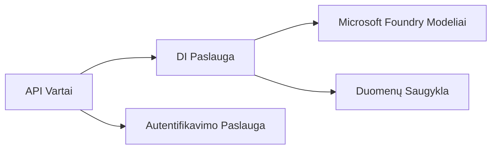
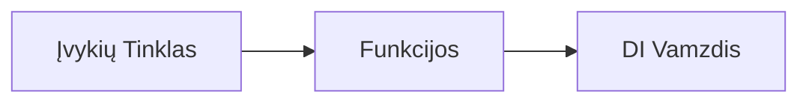

# 8 skyrius: Gamybos ir Įmonių Šablonai

**📚 Kursas**: [AZD Pradedantiesiems](../../README.md) | **⏱️ Trukmė**: 2-3 valandos | **⭐ Sudėtingumas**: Pažengęs

---

## Apžvalga

Šiame skyriuje apžvelgiami įmonėms pritaikyti diegimo šablonai, saugumo stiprinimas, stebėjimas ir išlaidų optimizavimas gamybos AI darbo krūviams.

> Patikrinta su `azd 1.23.12` 2026 m. kovą.

## Mokymosi tikslai

Baigę šį skyrių, jūs:
- Įdiegsite atsparias daugregionines programas
- Įgyvendinsite įmonių saugumo šablonus
- Suprasite išsamų stebėjimą
- Optimizuosite išlaidas dideliu mastu
- Nustatysite CI/CD procesus su AZD

---

## 📚 Pamokos

| # | Pamoka | Aprašymas | Laikas |
|---|--------|-----------|--------|
| 1 | [Gamybos AI praktikos](production-ai-practices.md) | Įmonių diegimo šablonai | 90 min |

---

## 🚀 Gamybos kontrolinis sąrašas

- [ ] Daugregionis diegimas atsparumui užtikrinti
- [ ] Valdomos tapatybės autentifikacijai (be raktų)
- [ ] Application Insights stebėjimui
- [ ] Išlaidų biudžetai ir įspėjimai sukonfigūruoti
- [ ] Įjungtas saugumo skenavimas
- [ ] CI/CD proceso integracija
- [ ] Atsarginių kopijų atkūrimo planas

---

## 🏗️ Architektūros šablonai

### Šablonas 1: Mikroservisų AI


### Šablonas 2: Įvykių varoma AI


---

## 🔐 Geriausios saugumo praktikos

```bicep
// Use managed identity
identity: {
  type: 'SystemAssigned'
}

// Private endpoints for AI services
properties: {
  publicNetworkAccess: 'Disabled'
  networkAcls: {
    defaultAction: 'Deny'
  }
}
```

---

## 💰 Išlaidų optimizavimas

| Strategija | Sutaupymai |
|------------|------------|
| Skalavimas iki nulio (Container Apps) | 60-80% |
| Naudojimas vartojimo lygiams kūrimui | 50-70% |
| Grafikuotas skalavimas | 30-50% |
| Rezervuota talpa | 20-40% |

```bash
# Nustatyti biudžeto įspėjimus
az consumption budget create \
  --budget-name "AI-Budget" \
  --amount 500 \
  --category Cost \
  --time-grain Monthly
```

---

## 📊 Stebėjimo nustatymas

```bash
# Srautiniai žurnalai
azd monitor --logs

# Patikrinkite Application Insights
azd monitor --overview

# Peržiūrėti metrikas
az monitor metrics list --resource <resource-id>
```

---

## 🔗 Navigacija

| Kryptis | Skyrius |
|---------|---------|
| **Ankstesnis** | [7 skyrius: Gedimų šalinimas](../chapter-07-troubleshooting/README.md) |
| **Kurso pabaiga** | [Kurso Pradžia](../../README.md) |

---

## 📖 Susiję ištekliai

- [AI agentų vadovas](../chapter-02-ai-development/agents.md)
- [Application Insights](../chapter-06-pre-deployment/application-insights.md)
- [Daugiagentiniai sprendimai](../chapter-05-multi-agent/README.md)
- [Mikroservisų pavyzdys](../../examples/microservices/README.md)

---

<!-- CO-OP TRANSLATOR DISCLAIMER START -->
**Atsakomybės apribojimas**:  
Šis dokumentas buvo išverstas naudojant dirbtinio intelekto vertimo paslaugą [Co-op Translator](https://github.com/Azure/co-op-translator). Nors siekiame tikslumo, prašome atkreipti dėmesį, kad automatizuoti vertimai gali turėti klaidų ar netikslumų. Pradinė dokumento versija jo gimtąja kalba yra laikoma autoritetingu šaltiniu. Svarbiai informacijai rekomenduojama rinktis profesionalų žmogaus vertimą. Mes neatsakome už bet kokius nesusipratimus ar neteisingus aiškinimus, kilusius dėl šio vertimo naudojimo.
<!-- CO-OP TRANSLATOR DISCLAIMER END -->