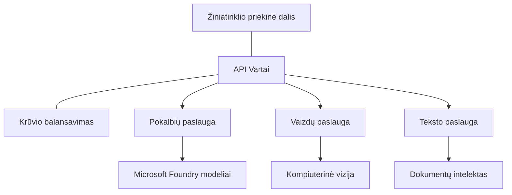

# Geriausios praktikos produkciniams DI darbo krūviams su AZD

**Skyriaus navigacija:**
- **📚 Kurso pradžia**: [AZD pradedantiesiems](../../README.md)
- **📖 Dabartinis skyrius**: 8 skyrius – Produkciniai ir Įmonių modeliai
- **⬅️ Ankstesnis skyrius**: [7 skyrius: Gedimų šalinimas](../chapter-07-troubleshooting/debugging.md)
- **⬅️ Taip pat susiję**: [DI dirbtuvės laboratorija](ai-workshop-lab.md)
- **🎯 Kursas baigtas**: [AZD pradedantiesiems](../../README.md)

## Apžvalga

Šiame vadove pateikiamos išsamios geriausios praktikos diegiant produkcinius DI darbo krūvius naudojant Azure Developer CLI (AZD). Remiantis Microsoft Foundry Discord bendruomenės atsiliepimais ir realių klientų diegimais, šios praktikos sprendžia dažniausias problemas produkcinių DI sistemų valdyme.

## Pagrindinės sprendžiamos problemos

Remiantis mūsų bendruomenės apklausos rezultatais, tai yra didžiausios kūrėjų iškylančios problemos:

- **45 %** susiduria su daugiapakopio DI diegimu
- **38 %** patiria sunkumų su kredencialų ir slaptų duomenų valdymu  
- **35 %** sunkiai įgyvendina produkcinį pasirengimą ir mastelį
- **32 %** reikia geresnių sąnaudų optimizavimo strategijų
- **29 %** reikalauja patobulinto stebėjimo ir gedimų šalinimo

## Produkcinio DI architektūros modeliai

### Modelis 1: Mikroservisų DI architektūra

**Kada naudoti**: Sudėtingoms DI programoms su keliomis funkcijomis


**AZD įgyvendinimas**:

```yaml
# azure.yaml
name: enterprise-ai-platform
services:
  web:
    project: ./web
    host: staticwebapp
  api-gateway:
    project: ./api-gateway
    host: containerapp
  chat-service:
    project: ./services/chat
    host: containerapp
  vision-service:
    project: ./services/vision
    host: containerapp
  text-service:
    project: ./services/text
    host: containerapp
```

### Modelis 2: Įvykių valdomas DI apdorojimas

**Kada naudoti**: Paketinis apdorojimas, dokumentų analizė, asinchroniniai srautai

```bicep
// Event Hub for AI processing pipeline
resource eventHub 'Microsoft.EventHub/namespaces@2023-01-01-preview' = {
  name: eventHubNamespaceName
  location: location
  sku: {
    name: 'Standard'
    tier: 'Standard'
    capacity: 1
  }
}

// Service Bus for reliable message processing
resource serviceBus 'Microsoft.ServiceBus/namespaces@2022-10-01-preview' = {
  name: serviceBusNamespaceName
  location: location
  sku: {
    name: 'Premium'
    tier: 'Premium'
    capacity: 1
  }
}

// Function App for processing
resource functionApp 'Microsoft.Web/sites@2023-01-01' = {
  name: functionAppName
  location: location
  kind: 'functionapp,linux'
  properties: {
    siteConfig: {
      appSettings: [
        {
          name: 'FUNCTIONS_EXTENSION_VERSION'
          value: '~4'
        }
        {
          name: 'AZURE_OPENAI_ENDPOINT'
          value: '@Microsoft.KeyVault(VaultName=${keyVault.name};SecretName=openai-endpoint)'
        }
      ]
    }
  }
}
```

## Mąstymas apie DI agento būklę

Kai tradicinė žiniatinklio programa sugenda, simptomai yra pažįstami: puslapis neįsikrauna, API grąžina klaidą arba diegimas nepavyksta. DI varomos programos gali sugesti tais pačiais būdais – bet taip pat gali elgtis subtiliau, nerodydamos akivaizdžių klaidų pranešimų.

Šiame skyriuje padėsime sukurti mentalinį modelį DI darbo krūvių stebėjimui, kad žinotumėte, kur ieškoti, kai kažkas neveikia kaip tikėtasi.

### Kaip agento būklė skiriasi nuo tradicinės programos būklės

Tradicinė programa veikia arba neveikia. DI agentas gali atrodyti, kad veikia, bet generuoti prastus rezultatus. Apgalvokite agento būklę dviem sluoksniais:

| Sluoksnis | Ką stebėti | Kur žiūrėti |
|-----------|------------|-------------|
| **Infrastruktūros būklė** | Ar paslauga veikia? Ar ištekliai paskirti? Ar galimi prieigos taškai? | `azd monitor`, Azure portalas – išteklių būklė, konteinerių/programos žurnalai |
| **Elgsenos būklė** | Ar agentas tiksliai atsako? Ar atsakymai laiku? Ar teisingai kviečiamas modelis? | Application Insights pėdsakai, modelio kvietimo delsos metrikos, atsakymų kokybės žurnalai |

Infrastruktūros būklė yra pažįstama – tokia pati kaip bet kuriai azd programai. Elgsenos būklė yra naujas sluoksnis, kurį įveda DI darbo krūviai.

### Kur žiūrėti, kai DI programos veikia ne taip, kaip tikėtasi

Jei jūsų DI programa nesuteikia laukiamų rezultatų, pateikiame konceptualų kontrolinį sąrašą:

1. **Pradėkite nuo pagrindų.** Ar programa veikia? Ar ji pasiekia savo priklausomybes? Patikrinkite `azd monitor` ir išteklių būklę kaip bet kuriam kitam programai.
2. **Patikrinkite modelio ryšį.** Ar jūsų programa sėkmingai siunčia užklausas DI modeliui? Neišpildyti ar laiko limitą viršiję kvietimai yra dažniausia DI programų problemų priežastis ir matysis jūsų programos žurnaluose.
3. **Peržiūrėkite, ką modelis gavo.** DI atsakymai priklauso nuo įvesties (užklausos ir bet kokio gauto konteksto). Jei išvestis neteisinga, paprastai įvestis klaidinga. Patikrinkite, ar jūsų programa siunčia tinkamus duomenis modeliui.
4. **Peržiūrėkite atsakymo delsą.** DI modelių kvietimai yra lėtesni nei įprasti API kvietimai. Jei programa atrodo lėta, patikrinkite, ar modelio atsako laikas padidėjo – tai gali rodyti ribojimus, pajėgumų apribojimus ar regiono tinklo apkrovimą.
5. **Stebėkite sąnaudų signalus.** Netikėti žetonų panaudojimo ar API kvietimų šuoliai gali rodyti kilpą, neteisingai sukonfigūruotą užklausą ar per daug bandymų.

Jums nereikia iškart išmokti visų stebėjimo įrankių. Pagrindinė išvada – DI programoms reikia stebėti papildomą elgesio sluoksnį, o azd integruota stebėjimo priemonė (`azd monitor`) suteikia pradinę poziciją abiems sluoksniams tirti.

---

## Saugumo geriausios praktikos

### 1. Nulinio pasitikėjimo saugumo modelis

**Įgyvendinimo strategija**:
- Jokio paslaugų tarpusavio komunikavimo be autentifikacijos
- Visi API kvietimai naudoja valdomas tapatybes
- Tinklo izoliacija naudojant privačius prieigos taškus
- Mažiausios teisės prieigos kontrolė

```bicep
// Managed Identity for each service
resource chatServiceIdentity 'Microsoft.ManagedIdentity/userAssignedIdentities@2023-01-31' = {
  name: 'chat-service-identity'
  location: location
}

// Role assignments with minimal permissions
resource openAIUserRole 'Microsoft.Authorization/roleAssignments@2022-04-01' = {
  scope: openAIAccount
  name: guid(openAIAccount.id, chatServiceIdentity.id, openAIUserRoleDefinitionId)
  properties: {
    roleDefinitionId: subscriptionResourceId('Microsoft.Authorization/roleDefinitions', '5e0bd9bd-7b93-4f28-af87-19fc36ad61bd')
    principalId: chatServiceIdentity.properties.principalId
    principalType: 'ServicePrincipal'
  }
}
```

### 2. Saugus slaptažodžių valdymas

**Key Vault integracijos modelis**:

```bicep
// Key Vault with proper access policies
resource keyVault 'Microsoft.KeyVault/vaults@2023-02-01' = {
  name: keyVaultName
  location: location
  properties: {
    tenantId: tenant().tenantId
    sku: {
      family: 'A'
      name: 'premium'  // Use premium for production
    }
    enableRbacAuthorization: true  // Use RBAC instead of access policies
    enablePurgeProtection: true    // Prevent accidental deletion
    enableSoftDelete: true
    softDeleteRetentionInDays: 90
  }
}

// Store all AI service credentials
resource openAIKeySecret 'Microsoft.KeyVault/vaults/secrets@2023-02-01' = {
  parent: keyVault
  name: 'openai-api-key'
  properties: {
    value: openAIAccount.listKeys().key1
    attributes: {
      enabled: true
    }
  }
}
```

### 3. Tinklo saugumas

**Privataus prieigos taško konfigūracija**:

```bicep
// Virtual Network for AI services
resource virtualNetwork 'Microsoft.Network/virtualNetworks@2023-04-01' = {
  name: vnetName
  location: location
  properties: {
    addressSpace: {
      addressPrefixes: ['10.0.0.0/16']
    }
    subnets: [
      {
        name: 'ai-services-subnet'
        properties: {
          addressPrefix: '10.0.1.0/24'
          privateEndpointNetworkPolicies: 'Disabled'
        }
      }
      {
        name: 'app-services-subnet'
        properties: {
          addressPrefix: '10.0.2.0/24'
          delegations: [
            {
              name: 'Microsoft.Web/serverFarms'
              properties: {
                serviceName: 'Microsoft.Web/serverFarms'
              }
            }
          ]
        }
      }
    ]
  }
}

// Private endpoints for all AI services
resource openAIPrivateEndpoint 'Microsoft.Network/privateEndpoints@2023-04-01' = {
  name: '${openAIAccountName}-pe'
  location: location
  properties: {
    subnet: {
      id: virtualNetwork.properties.subnets[0].id
    }
    privateLinkServiceConnections: [
      {
        name: 'openai-connection'
        properties: {
          privateLinkServiceId: openAIAccount.id
          groupIds: ['account']
        }
      }
    ]
  }
}
```

## Veikimo našumas ir skalavimas

### 1. Automatinio skalavimo strategijos

**Container Apps automatinis skalavimas**:

```bicep
resource containerApp 'Microsoft.App/containerApps@2023-05-01' = {
  name: containerAppName
  location: location
  properties: {
    configuration: {
      ingress: {
        external: true
        targetPort: 8000
        transport: 'http'
      }
    }
    template: {
      scale: {
        minReplicas: 2  // Always have 2 instances minimum
        maxReplicas: 50 // Scale up to 50 for high load
        rules: [
          {
            name: 'http-scaling'
            http: {
              metadata: {
                concurrentRequests: '20'  // Scale when >20 concurrent requests
              }
            }
          }
          {
            name: 'cpu-scaling'
            custom: {
              type: 'cpu'
              metadata: {
                type: 'Utilization'
                value: '70'  // Scale when CPU >70%
              }
            }
          }
        ]
      }
    }
  }
}
```

### 2. Talpyklos strategijos

**Redis talpykla DI atsakymams**:

```bicep
// Redis Premium for production workloads
resource redisCache 'Microsoft.Cache/redis@2023-04-01' = {
  name: redisCacheName
  location: location
  properties: {
    sku: {
      name: 'Premium'
      family: 'P'
      capacity: 1
    }
    enableNonSslPort: false
    minimumTlsVersion: '1.2'
    redisConfiguration: {
      'maxmemory-policy': 'allkeys-lru'
    }
    // Enable clustering for high availability
    redisVersion: '6.0'
    shardCount: 2
  }
}

// Cache configuration in application
var cacheConnectionString = '${redisCache.properties.hostName}:6380,password=${redisCache.listKeys().primaryKey},ssl=True,abortConnect=False'
```

### 3. Apkrovos balansavimas ir srauto valdymas

**Application Gateway su WAF**:

```bicep
// Application Gateway with Web Application Firewall
resource applicationGateway 'Microsoft.Network/applicationGateways@2023-04-01' = {
  name: appGatewayName
  location: location
  properties: {
    sku: {
      name: 'WAF_v2'
      tier: 'WAF_v2'
      capacity: 2
    }
    webApplicationFirewallConfiguration: {
      enabled: true
      firewallMode: 'Prevention'
      ruleSetType: 'OWASP'
      ruleSetVersion: '3.2'
    }
    // Backend pools for AI services
    backendAddressPools: [
      {
        name: 'ai-services-pool'
        properties: {
          backendAddresses: [
            {
              fqdn: '${containerApp.properties.configuration.ingress.fqdn}'
            }
          ]
        }
      }
    ]
  }
}
```

## 💰 Sąnaudų optimizavimas

### 1. Išteklių tinkamas dydis

**Aplinkai specifinės konfigūracijos**:

```bash
# Kūrimo aplinka
azd env new development
azd env set AZURE_OPENAI_SKU "S0"
azd env set AZURE_OPENAI_CAPACITY 10
azd env set AZURE_SEARCH_SKU "basic"
azd env set CONTAINER_CPU 0.5
azd env set CONTAINER_MEMORY 1.0

# Gamybos aplinka
azd env new production
azd env set AZURE_OPENAI_SKU "S0"
azd env set AZURE_OPENAI_CAPACITY 100
azd env set AZURE_SEARCH_SKU "standard"
azd env set CONTAINER_CPU 2.0
azd env set CONTAINER_MEMORY 4.0
```

### 2. Sąnaudų stebėjimas ir biudžetai

```bicep
// Cost management and budgets
resource budget 'Microsoft.Consumption/budgets@2023-05-01' = {
  name: 'ai-workload-budget'
  properties: {
    timePeriod: {
      startDate: '2024-01-01'
      endDate: '2024-12-31'
    }
    timeGrain: 'Monthly'
    amount: 2000  // $2000 monthly budget
    category: 'Cost'
    notifications: {
      warning: {
        enabled: true
        operator: 'GreaterThan'
        threshold: 80
        contactEmails: [
          'finance@company.com'
          'engineering@company.com'
        ]
        contactRoles: [
          'Owner'
          'Contributor'
        ]
      }
      critical: {
        enabled: true
        operator: 'GreaterThan'
        threshold: 95
        contactEmails: [
          'cto@company.com'
        ]
      }
    }
  }
}
```

### 3. Žetonų naudojimo optimizavimas

**OpenAI sąnaudų valdymas**:

```typescript
// Programėlės lygmens žetonų optimizavimas
class TokenOptimizer {
  private readonly maxTokens = 4000;
  private readonly reserveTokens = 500;
  
  optimizePrompt(userInput: string, context: string): string {
    const availableTokens = this.maxTokens - this.reserveTokens;
    const estimatedTokens = this.estimateTokens(userInput + context);
    
    if (estimatedTokens > availableTokens) {
      // Apkarpyti kontekstą, ne vartotojo įvestį
      context = this.truncateContext(context, availableTokens - this.estimateTokens(userInput));
    }
    
    return `${context}\n\nUser: ${userInput}`;
  }
  
  private estimateTokens(text: string): number {
    // Apytikslis įvertinimas: 1 žetonas ≈ 4 simboliai
    return Math.ceil(text.length / 4);
  }
}
```

## Stebėjimas ir matomumas

### 1. Išsamus Application Insights

```bicep
// Application Insights with advanced features
resource applicationInsights 'Microsoft.Insights/components@2020-02-02' = {
  name: applicationInsightsName
  location: location
  kind: 'web'
  properties: {
    Application_Type: 'web'
    WorkspaceResourceId: logAnalyticsWorkspace.id
    SamplingPercentage: 100  // Full sampling for AI apps
    DisableIpMasking: false  // Enable for security
  }
}

// Custom metrics for AI operations
resource aiMetricAlerts 'Microsoft.Insights/metricAlerts@2018-03-01' = {
  name: 'ai-high-error-rate'
  location: 'global'
  properties: {
    description: 'Alert when AI service error rate is high'
    severity: 2
    enabled: true
    scopes: [
      applicationInsights.id
    ]
    evaluationFrequency: 'PT1M'
    windowSize: 'PT5M'
    criteria: {
      'odata.type': 'Microsoft.Azure.Monitor.SingleResourceMultipleMetricCriteria'
      allOf: [
        {
          name: 'high-error-rate'
          metricName: 'requests/failed'
          operator: 'GreaterThan'
          threshold: 10
          timeAggregation: 'Count'
        }
      ]
    }
  }
}
```

### 2. DI specifinis stebėjimas

**Pritaikyti skydeliai DI metrikoms**:

```json
// Dashboard configuration for AI workloads
{
  "dashboard": {
    "name": "AI Application Monitoring",
    "tiles": [
      {
        "name": "OpenAI Request Volume",
        "query": "requests | where name contains 'openai' | summarize count() by bin(timestamp, 5m)"
      },
      {
        "name": "AI Response Latency",
        "query": "requests | where name contains 'openai' | summarize avg(duration) by bin(timestamp, 5m)"
      },
      {
        "name": "Token Usage",
        "query": "customMetrics | where name == 'openai_tokens_used' | summarize sum(value) by bin(timestamp, 1h)"
      },
      {
        "name": "Cost per Hour",
        "query": "customMetrics | where name == 'openai_cost' | summarize sum(value) by bin(timestamp, 1h)"
      }
    ]
  }
}
```

### 3. Būklės tikrinimai ir veikimo laiko stebėjimas

```bicep
// Application Insights availability tests
resource availabilityTest 'Microsoft.Insights/webtests@2022-06-15' = {
  name: 'ai-app-availability-test'
  location: location
  tags: {
    'hidden-link:${applicationInsights.id}': 'Resource'
  }
  properties: {
    SyntheticMonitorId: 'ai-app-availability-test'
    Name: 'AI Application Availability Test'
    Description: 'Tests AI application endpoints'
    Enabled: true
    Frequency: 300  // 5 minutes
    Timeout: 120    // 2 minutes
    Kind: 'ping'
    Locations: [
      {
        Id: 'us-east-2-azr'
      }
      {
        Id: 'us-west-2-azr'
      }
    ]
    Configuration: {
      WebTest: '''
        <WebTest Name="AI Health Check" 
                 Id="8d2de8d2-a2b0-4c2e-9a0d-8f9c9a0b8c8d" 
                 Enabled="True" 
                 CssProjectStructure="" 
                 CssIteration="" 
                 Timeout="120" 
                 WorkItemIds="" 
                 xmlns="http://microsoft.com/schemas/VisualStudio/TeamTest/2010" 
                 Description="" 
                 CredentialUserName="" 
                 CredentialPassword="" 
                 PreAuthenticate="True" 
                 Proxy="default" 
                 StopOnError="False" 
                 RecordedResultFile="" 
                 ResultsLocale="">
          <Items>
            <Request Method="GET" 
                     Guid="a5f10126-e4cd-570d-961c-cea43999a200" 
                     Version="1.1" 
                     Url="${webApp.properties.defaultHostName}/health" 
                     ThinkTime="0" 
                     Timeout="120" 
                     ParseDependentRequests="True" 
                     FollowRedirects="True" 
                     RecordResult="True" 
                     Cache="False" 
                     ResponseTimeGoal="0" 
                     Encoding="utf-8" 
                     ExpectedHttpStatusCode="200" 
                     ExpectedResponseUrl="" 
                     ReportingName="" 
                     IgnoreHttpStatusCode="False" />
          </Items>
        </WebTest>
      '''
    }
  }
}
```

## Atsparumo gedimams ir didelis pasiekiamumas

### 1. Daugiataučių diegimas

```yaml
# azure.yaml - Multi-region configuration
name: ai-app-multiregion
services:
  api-primary:
    project: ./api
    host: containerapp
    env:
      - AZURE_REGION=eastus
  api-secondary:
    project: ./api
    host: containerapp
    env:
      - AZURE_REGION=westus2
```

```bicep
// Traffic Manager for global load balancing
resource trafficManager 'Microsoft.Network/trafficManagerProfiles@2022-04-01' = {
  name: trafficManagerProfileName
  location: 'global'
  properties: {
    profileStatus: 'Enabled'
    trafficRoutingMethod: 'Priority'
    dnsConfig: {
      relativeName: trafficManagerProfileName
      ttl: 30
    }
    monitorConfig: {
      protocol: 'HTTPS'
      port: 443
      path: '/health'
      intervalInSeconds: 30
      toleratedNumberOfFailures: 3
      timeoutInSeconds: 10
    }
    endpoints: [
      {
        name: 'primary-endpoint'
        type: 'Microsoft.Network/trafficManagerProfiles/azureEndpoints'
        properties: {
          targetResourceId: primaryAppService.id
          endpointStatus: 'Enabled'
          priority: 1
        }
      }
      {
        name: 'secondary-endpoint'
        type: 'Microsoft.Network/trafficManagerProfiles/azureEndpoints'
        properties: {
          targetResourceId: secondaryAppService.id
          endpointStatus: 'Enabled'
          priority: 2
        }
      }
    ]
  }
}
```

### 2. Duomenų atsarginės kopijos ir atkūrimas

```bicep
// Backup configuration for critical data
resource backupVault 'Microsoft.DataProtection/backupVaults@2023-05-01' = {
  name: backupVaultName
  location: location
  identity: {
    type: 'SystemAssigned'
  }
  properties: {
    storageSettings: [
      {
        datastoreType: 'VaultStore'
        type: 'LocallyRedundant'
      }
    ]
  }
}

// Backup policy for AI models and data
resource backupPolicy 'Microsoft.DataProtection/backupVaults/backupPolicies@2023-05-01' = {
  parent: backupVault
  name: 'ai-data-backup-policy'
  properties: {
    policyRules: [
      {
        backupParameters: {
          backupType: 'Full'
          objectType: 'AzureBackupParams'
        }
        trigger: {
          schedule: {
            repeatingTimeIntervals: [
              'R/2024-01-01T02:00:00+00:00/P1D'  // Daily at 2 AM
            ]
          }
          objectType: 'ScheduleBasedTriggerContext'
        }
        dataStore: {
          datastoreType: 'VaultStore'
          objectType: 'DataStoreInfoBase'
        }
        name: 'BackupDaily'
        objectType: 'AzureBackupRule'
      }
    ]
  }
}
```

## DevOps ir CI/CD integracija

### 1. GitHub Actions darbų eiga

```yaml
# .github/workflows/deploy-ai-app.yml
name: Deploy AI Application

on:
  push:
    branches: [main]
  pull_request:
    branches: [main]

jobs:
  test:
    runs-on: ubuntu-latest
    steps:
      - uses: actions/checkout@v4
      
      - name: Setup Python
        uses: actions/setup-python@v4
        with:
          python-version: '3.11'
          
      - name: Install dependencies
        run: |
          pip install -r requirements.txt
          pip install pytest
          
      - name: Run tests
        run: pytest tests/
        
      - name: AI Safety Tests
        run: |
          python scripts/test_ai_safety.py
          python scripts/validate_prompts.py

  deploy-staging:
    needs: test
    if: github.event_name == 'pull_request'
    runs-on: ubuntu-latest
    steps:
      - uses: actions/checkout@v4
      
      - name: Setup AZD
        uses: Azure/setup-azd@v2
        
      - name: Login to Azure
        uses: azure/login@v1
        with:
          creds: ${{ secrets.AZURE_CREDENTIALS }}
          
      - name: Deploy to Staging
        run: |
          azd env select staging
          azd deploy

  deploy-production:
    needs: test
    if: github.ref == 'refs/heads/main'
    runs-on: ubuntu-latest
    steps:
      - uses: actions/checkout@v4
      
      - name: Setup AZD
        uses: Azure/setup-azd@v2
        
      - name: Login to Azure
        uses: azure/login@v1
        with:
          creds: ${{ secrets.AZURE_CREDENTIALS }}
          
      - name: Deploy to Production
        run: |
          azd env select production
          azd deploy
          
      - name: Run Production Health Checks
        run: |
          python scripts/health_check.py --env production
```

### 2. Infrastruktūros patikra

```bash
# scripts/validate_infrastructure.sh
#!/bin/bash

echo "Validating AI infrastructure deployment..."

# Patikrinti, ar veikia visi reikalingi servisai
services=("openai" "search" "storage" "keyvault")
for service in "${services[@]}"; do
    echo "Checking $service..."
    if ! az resource list --resource-type "Microsoft.CognitiveServices/accounts" --query "[?contains(name, '$service')]" -o tsv; then
        echo "ERROR: $service not found"
        exit 1
    fi
done

# Patvirtinti OpenAI modelių diegimus
echo "Validating OpenAI model deployments..."
models=$(az cognitiveservices account deployment list --name $AZURE_OPENAI_NAME --resource-group $AZURE_RESOURCE_GROUP --query "[].name" -o tsv)
if [[ ! $models == *"gpt-4.1-mini"* ]]; then
  echo "ERROR: Required model gpt-4.1-mini not deployed"
    exit 1
fi

# Išbandyti AI paslaugos ryšį
echo "Testing AI service connectivity..."
python scripts/test_connectivity.py

echo "Infrastructure validation completed successfully!"
```

## Produkcinio pasirengimo kontrolinis sąrašas

### Saugumas ✅
- [ ] Visos paslaugos naudoja valdomas tapatybes
- [ ] Slaptažodžiai saugomi Key Vault
- [ ] Privatieji prieigos taškai sukonfigūruoti
- [ ] Įdiegti tinklo saugumo grupės
- [ ] RBAC su mažiausiais leidimais
- [ ] WAF įjungtas viešuose prieigos taškuose

### Veikimas ✅
- [ ] Automatinis skalavimas sukonfigūruotas
- [ ] Įdiegtas talpinimas
- [ ] Apkrovos balansavimas įdiegtas
- [ ] CDN statiniam turiniui
- [ ] Duomenų bazės jungčių kaupimas
- [ ] Žetonų naudojimo optimizavimas

### Stebėjimas ✅
- [ ] Application Insights sukonfigūruotas
- [ ] Apibrėžtos pritaikytos metrikos
- [ ] Įjungti įspėjimų taisyklės
- [ ] Sukurtas informacinis skydelis
- [ ] Įdiegtos būklės patikros
- [ ] Žurnalų saugojimo politikos

### Patikimumas ✅
- [ ] Daugiataučių diegimas
- [ ] Atsarginės kopijos ir atkūrimo planas
- [ ] Įdiegtos grandinės pertraukikliai
- [ ] Konfigūruotos pakartotinės bandymo politikos
- [ ] Maloniai sumažinama paslauga
- [ ] Būklės patikrinimo prieigos taškai

### Sąnaudų valdymas ✅
- [ ] Biudžeto įspėjimai sukonfigūruoti
- [ ] Išteklių tinkamas dydis
- [ ] Taikomos kūrimo/testavimo nuolaidos
- [ ] Įsigytos rezervuotos instancijos
- [ ] Sąnaudų stebėjimo skydelis
- [ ] Reguliarūs sąnaudų peržiūros

### Atitiktis ✅
- [ ] Atitinkami duomenų lokalizacijos reikalavimai
- [ ] Įjungtas auditavimo žurnalas
- [ ] Taikomos atitikties politikos
- [ ] Įdiegtos saugumo bazės linijos
- [ ] Reguliarūs saugumo vertinimai
- [ ] Įvykio atsako planas

## Veikimo našumo etalonai

### Tipinės produkcijos metrikos

| Metrika | Tikslas | Stebėjimas |
|---------|---------|------------|
| **Atsako laikas** | < 2 sekundžių | Application Insights |
| **Pasiekiamumas** | 99,9 % | Veikimo laiko stebėjimas |
| **Klaidų dažnis** | < 0,1 % | Programos žurnalai |
| **Žetonų naudojimas** | < 500 USD/mėn. | Sąnaudų valdymas |
| **Konkuruojantys vartotojai** | 1000+ | Apkrovos testavimas |
| **Atstatymo laikas** | < 1 valanda | Atsparumo gedimams testai |

### Apkrovos testavimas

```bash
# Apkrovos testavimo scenarijus dirbtinio intelekto programoms
python scripts/load_test.py \
  --endpoint https://your-ai-app.azurewebsites.net \
  --concurrent-users 100 \
  --duration 300 \
  --ramp-up 60
```

## 🤝 Bendruomenės geriausios praktikos

Remiantis Microsoft Foundry Discord bendruomenės atsiliepimais:

### Pagrindinės bendruomenės rekomendacijos:

1. **Pradėkite nuo mažo, didinkite palaipsniui**: Pradėkite nuo pagrindinių SKU, didinkite pagal faktinį naudojimą
2. **Stebėkite viską**: Nustatykite išsamų stebėjimą nuo pirmos dienos
3. **Automatizuokite saugumą**: Naudokite infrastruktūrą kaip kodą nuosekliam saugumui užtikrinti
4. **Atlikite kruopštus testavimus**: Įtraukite DI specifinius testus į savo procesą
5. **Planuokite išlaidas**: Stebėkite žetonų naudojimą ir anksti nustatykite biudžeto įspėjimus

### Dažnos klaidos, kurių reikėtų vengti:

- ❌ API raktų kietojo kodavimo kode
- ❌ Nenurodytas tinkamas stebėjimas
- ❌ Sąnaudų optimizavimo ignoravimas
- ❌ Nenuoseklus gedimų scenarijų testavimas
- ❌ Diegimas be būklės patikrinimų

## AZD DI CLI komandos ir plėtiniai

AZD apima vis didėjantį DI specifinių komandų ir plėtinių rinkinį, kuris supaprastina produkcinių DI darbo krūvių valdymą. Šie įrankiai sujungia vietinę kūrimą su produkciniu diegimu DI darbo krūviams.

### AZD plėtiniai DI

AZD naudoja plėtinių sistemą, kad pridėtų DI specifines funkcijas. Įdiekite ir valdykite plėtinius su:

```bash
# Išvardinkite visas galimas plėtinius (įskaitant DI)
azd extension list

# Peržiūrėkite įdiegtų plėtinių detales
azd extension show azure.ai.agents

# Įdiekite Foundry agentų plėtinį
azd extension install azure.ai.agents

# Įdiekite tikslinimo plėtinį
azd extension install azure.ai.finetune

# Įdiekite pritaikytų modelių plėtinį
azd extension install azure.ai.models

# Atnaujinkite visus įdiegtus plėtinius
azd extension upgrade --all
```

**Galimi DI plėtiniai:**

| Plėtinys | Paskirtis | Statusas |
|----------|-----------|----------|
| `azure.ai.agents` | Foundry agentų paslaugų valdymas | Peržiūros fazė |
| `azure.ai.finetune` | Foundry modelių tikslinimas | Peržiūros fazė |
| `azure.ai.models` | Foundry individualūs modeliai | Peržiūros fazė |
| `azure.coding-agent` | Koduojančio agento konfigūracija | Prieinamas |

### Agentų projektų inicializavimas su `azd ai agent init`

Komanda `azd ai agent init` sukuria produkcijai paruoštą DI agento projektą, integruotą su Microsoft Foundry Agent Service:

```bash
# Inicializuokite naują agento projektą iš agento manifesto
azd ai agent init -m <manifest-path-or-uri>

# Inicializuokite ir nukreipkite į konkretų Foundry projektą
azd ai agent init -m agent-manifest.yaml --project-id <foundry-project-id>

# Inicializuokite su pasirinktu šaltinio katalogu
azd ai agent init -m agent-manifest.yaml --src ./agents/my-agent

# Nustatykite Container Apps kaip prieglobą
azd ai agent init -m agent-manifest.yaml --host containerapp
```

**Pagrindinės parinktys:**

| Parinktis | Aprašymas |
|-----------|-----------|
| `-m, --manifest` | Agentų manifestas failo kelias arba URI, pridėti prie projekto |
| `-p, --project-id` | Esamas Microsoft Foundry projekto ID jūsų azd aplinkai |
| `-s, --src` | Katalogas agento aprašui atsisiųsti (numatyta `src/<agent-id>`) |
| `--host` | Numatytojo talpinimo pakeitimas (pvz., `containerapp`) |
| `-e, --environment` | Naudojama azd aplinka |

**Produkcinis patarimas**: Naudokite `--project-id`, kad iš karto susietumėte su esamu Foundry projektu, taip išlaikydami agento kodą ir debesų išteklius nuo pradžios.

### Modelio konteksto protokolas (MCP) su `azd mcp`

AZD įtraukia integruotą MCP serverio palaikymą (Alfa versija), leidžiantį DI agentams ir įrankiams bendrauti su jūsų Azure ištekliais per standartizuotą protokolą:

```bash
# Paleiskite MCP serverį savo projektui
azd mcp start

# Peržiūrėkite dabartines Copilot sutikimo taisykles įrankio vykdymui
azd copilot consent list
```

MCP serveris pateikia jūsų azd projekto kontekstą – aplinkas, paslaugas ir Azure išteklius – DI varomiems kūrimo įrankiams. Tai leidžia:

- **DI palaikomą diegimą**: Leiskite kodavimo agentams užklausti projekto būklės ir inicijuoti diegimus
- **Išteklių atradimą**: DI įrankiai gali aptikti, kokius Azure išteklius naudoja projektas
- **Aplinkos valdymą**: Agentai gali persijungti tarp kūrimo/perskirstymo/produkcinės aplinkų

### Infrastruktūros generavimas su `azd infra generate`

Produkciniams DI darbo krūviams galite generuoti ir suasmeninti infrastruktūrą kaip kodą, o ne remtis automatinio paruošimo procesu:

```bash
# Sugeneruokite Bicep/Terraform failus iš savo projekto aprašymo
azd infra generate
```

Tai įrašo IaC į diską, todėl galite:
- Peržiūrėti ir audituoti infrastruktūrą prieš diegdami
- Pridėti savo saugumo politiką (tinklų taisykles, privačius prieigos taškus)
- Integruoti su esamais IaC peržiūros procesais
- Valdyti infrastruktūros pakeitimus versijų kontrolėje atskirai nuo programos kodo

### Produkciniai gyvenimo ciklo kabliukai

AZD kabliukai leidžia pridėti savo logiką kiekviename diegimo etape – itin svarbus produkciniams DI darbo krūviams:

```yaml
# azure.yaml - Production hooks example
name: ai-production-app
hooks:
  preprovision:
    shell: sh
    run: scripts/validate-quotas.sh    # Check AI model quota before provisioning
  postprovision:
    shell: sh
    run: scripts/configure-networking.sh  # Set up private endpoints
  predeploy:
    shell: sh
    run: scripts/run-ai-safety-tests.sh  # Run prompt safety checks
  postdeploy:
    shell: sh
    run: scripts/smoke-test.sh           # Verify agent responses post-deploy
services:
  agent-api:
    project: ./src/agent
    host: containerapp
    hooks:
      predeploy:
        shell: sh
        run: scripts/validate-model-access.sh  # Per-service hook
```

```bash
# Vykdyti tam tikrą kabliuką rankiniu būdu kūrimo metu
azd hooks run predeploy
```

**Rekomenduojami produkcijos kabliukai DI darbo krūviams:**

| Kabliukas | Naudojimo atvejis |
|-----------|-------------------|
| `preprovision` | Prenumeratos kvotų patikra DI modelio pajėgumui |
| `postprovision` | Privataus prieigos taško konfigūracija, modelio svorių diegimas |
| `predeploy` | DI saugumo testai, užklausų šablonų validacija |
| `postdeploy` | Agentų atsakymų pirminiai testai, modelio ryšio patikrinimas |

### CI/CD tinklo konfigūracija

Naudokite `azd pipeline config`, kad sujungtumėte projektą su GitHub Actions ar Azure Pipelines su saugia Azure autentifikacija:

```bash
# Sukonfigūruokite CI/CD kanalą (interaktyvus)
azd pipeline config

# Konfigūruokite su konkrečiu tiekėju
azd pipeline config --provider github
```

Ši komanda:
- Sukuria paslaugų principalą su mažiausio privilegijų prieiga
- Konfigūruoja federuotus kredencialus (be saugomų slaptažodžių)
- Sukuria arba atnaujina jūsų tinklo aprašymo failą
- Nustato reikiamus aplinkos kintamuosius CI/CD sistemoje

**Produkcinis darbo eiga su tinklo konfigūracija:**

```bash
# 1. Nustatyti gamybos aplinką
azd env new production
azd env set AZURE_OPENAI_CAPACITY 100

# 2. Konfigūruoti pipeline'ą
azd pipeline config --provider github

# 3. Pipeline vykdo azd deploy kiekvieną kartą, kai stumiama į main šaką
```

### Komponentų pridėjimas su `azd add`

Palaipsniui pridėkite Azure paslaugas esamam projektui:

```bash
# Interaktyviai pridėti naują paslaugos komponentą
azd add
```

Tai ypač naudinga plečiant produkcines DI programas – pavyzdžiui, pridedant vektorinės paieškos paslaugą, naują agento galinį tašką ar stebėjimo komponentą prie esamo diegimo.

## Papildomi ištekliai
- **„Azure Well-Architected Framework“**: [AI darbo krūvio gairės](https://learn.microsoft.com/azure/well-architected/ai/)
- **Microsoft Foundry dokumentacija**: [Oficiali dokumentacija](https://learn.microsoft.com/azure/ai-studio/)
- **Bendrcommunity šablonai**: [Azure pavyzdžiai](https://github.com/Azure-Samples)
- **Discord bendruomenė**: [#Azure kanalas](https://discord.gg/microsoft-azure)
- **Agentų įgūdžiai Azure**: [microsoft/github-copilot-for-azure on skills.sh](https://skills.sh/microsoft/github-copilot-for-azure) - 37 atviri agentų įgūdžiai Azure AI, Foundry, diegimui, sąnaudų optimizavimui ir diagnostikai. Įdiekite savo redaktoriuje:
  ```bash
  npx skills add microsoft/github-copilot-for-azure
  ```

---

**Skyriaus navigacija:**
- **📚 Kurso pradžia**: [AZD Pradedantiesiems](../../README.md)
- **📖 Dabartinis skyrius**: 8 skyrius - Gamybos ir įmonių šablonai
- **⬅️ Ankstesnis skyrius**: [7 skyrius: trikčių šalinimas](../chapter-07-troubleshooting/debugging.md)
- **⬅️ Taip pat susiję**: [AI dirbtuvės laboratorija](ai-workshop-lab.md)
- **� Kursas baigtas**: [AZD Pradedantiesiems](../../README.md)

**Prisiminkite**: Gamybiniai AI darbo krūviai reikalauja atidaus planavimo, stebėjimo ir nuolatinio optimizavimo. Pradėkite nuo šių šablonų ir pritaikykite juos savo specifiniams reikalavimams.

---

<!-- CO-OP TRANSLATOR DISCLAIMER START -->
**Atsakomybės apribojimas**:  
Šis dokumentas buvo išverstas naudojant dirbtinio intelekto vertimo paslaugą [Co-op Translator](https://github.com/Azure/co-op-translator). Nors siekiame tikslumo, prašome atkreipti dėmesį, kad automatizuoti vertimai gali turėti klaidų ar netikslumų. Originalus dokumentas jo gimtąja kalba turi būti laikomas patikimiausiu šaltiniu. Kritiskiems duomenims rekomenduojame naudoti profesionalią žmogaus atliktą vertimą. Mes neatsakome už bet kokius nesusipratimus ar klaidingus interpretavimus, kilusius naudojant šį vertimą.
<!-- CO-OP TRANSLATOR DISCLAIMER END -->