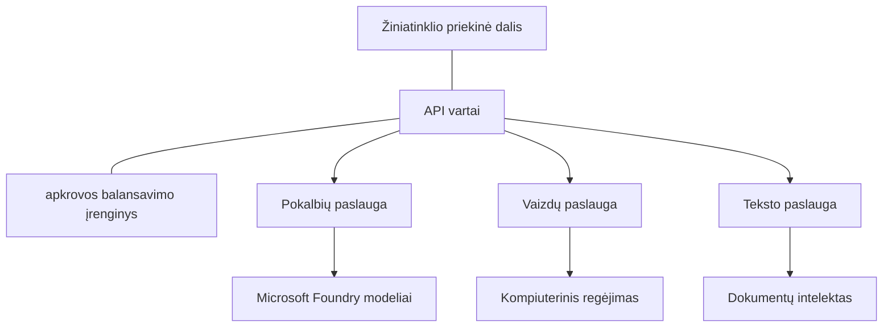

# Gamybinio lygio AI darbo krūvių gerosios praktikos su AZD

**Skyrių naršymas:**
- **📚 Kurso pradžia**: [AZD For Beginners](../../README.md)
- **📖 Dabartinis skyrius**: Skyrius 8 - Gamybos ir įmonių modeliai
- **⬅️ Ankstesnis skyrius**: [Chapter 7: Troubleshooting](../chapter-07-troubleshooting/debugging.md)
- **⬅️ Taip pat susiję**: [AI Workshop Lab](ai-workshop-lab.md)
- **🎯 Kursas baigtas**: [AZD For Beginners](../../README.md)

## Apžvalga

Šis vadovas pateikia išsamias gerąsias praktikas diegiant gamybai paruoštus AI darbo krūvius naudojant Azure Developer CLI (AZD). Remiantis Microsoft Foundry Discord bendruomenės atsiliepimais ir realiais klientų diegimais, šios praktikos sprendžia dažniausias problemas gamybos AI sistemose.

## Pagrindinės sprendžiamos problemos

Remiantis mūsų bendruomenės apklausos rezultatais, tai yra pagrindinės problemos, su kuriomis susiduria kūrėjai:

- **45%** susiduria su kelių paslaugų AI diegimu
- **38%** turi problemų dėl kredencialų ir slaptumo valdymo  
- **35%** sunkiai sekasi pasiruošti gamybai ir skalavimui
- **32%** reikia geresnių kaštų optimizavimo strategijų
- **29%** reikalingas pagerintas stebėjimas ir gedimų šalinimas

## Gamybos AI architektūros modeliai

### Modelis 1: Mikroservisų AI architektūra

**Kada naudoti**: Sudėtingoms AI programoms su keliomis galimybėmis


**AZD įgyvendinimas**:

```yaml
# azure.yaml
name: enterprise-ai-platform
services:
  web:
    project: ./web
    host: staticwebapp
  api-gateway:
    project: ./api-gateway
    host: containerapp
  chat-service:
    project: ./services/chat
    host: containerapp
  vision-service:
    project: ./services/vision
    host: containerapp
  text-service:
    project: ./services/text
    host: containerapp
```

### Modelis 2: Įvykių valdomas AI apdorojimas

**Kada naudoti**: Paketinis apdorojimas, dokumentų analizė, asinchroniniai darbo srautai

```bicep
// Event Hub for AI processing pipeline
resource eventHub 'Microsoft.EventHub/namespaces@2023-01-01-preview' = {
  name: eventHubNamespaceName
  location: location
  sku: {
    name: 'Standard'
    tier: 'Standard'
    capacity: 1
  }
}

// Service Bus for reliable message processing
resource serviceBus 'Microsoft.ServiceBus/namespaces@2022-10-01-preview' = {
  name: serviceBusNamespaceName
  location: location
  sku: {
    name: 'Premium'
    tier: 'Premium'
    capacity: 1
  }
}

// Function App for processing
resource functionApp 'Microsoft.Web/sites@2023-01-01' = {
  name: functionAppName
  location: location
  kind: 'functionapp,linux'
  properties: {
    siteConfig: {
      appSettings: [
        {
          name: 'FUNCTIONS_EXTENSION_VERSION'
          value: '~4'
        }
        {
          name: 'AZURE_OPENAI_ENDPOINT'
          value: '@Microsoft.KeyVault(VaultName=${keyVault.name};SecretName=openai-endpoint)'
        }
      ]
    }
  }
}
```

## Galvojimas apie AI agento sveikatą

Kai tradicinė žiniatinklio programa sugenda, simptomai yra pažįstami: puslapis neužsikrauna, API grąžina klaidą arba diegimas nepasiseka. AI varomos programos gali sugesti tais pačiais būdais — bet jos taip pat gali elgtis subtiliau, nesukeldamos akivaizdžių klaidų pranešimų.

Ši skiltis padeda sukurti dėsningą modelį AI darbo krūvių stebėjimui, kad žinotumėte, kur ieškoti, kai kas nors negerai.

### Kaip agento sveikata skiriasi nuo tradicinės programos sveikatos

Tradicinė programa arba veikia, arba neveikia. AI agentas gali atrodyti, kad veikia, tačiau duoti prastus rezultatus. Galvokite apie agento sveikatą dviem sluoksniais:

| Layer | What to Watch | Where to Look |
|-------|--------------|---------------|
| **Infrastructure health** | Ar paslauga veikia? Ar resursai aprovisionuoti? Ar pabaigos taškai pasiekiami? | `azd monitor`, Azure Portal resource health, container/app logs |
| **Behavior health** | Ar agentas atsako tiksliai? Ar atsakymai laiku? Ar modelis kviečiamas taisyklingai? | Application Insights traces, model call latency metrics, response quality logs |

Infrastruktūros sveikata yra pažįstama — ji ta pati bet kuriai azd programai. Elgesio sveikata yra naujas sluoksnis, kurį įveda AI darbo krūviai.

### Kur žiūrėti, kai AI programos elgiasi ne taip, kaip tikėtasi

Jei jūsų AI programa neduoda tikėtinų rezultatų, čia yra konceptualus kontrolinis sąrašas:

1. **Pradėkite nuo pagrindų.** Ar programa veikia? Ar ji gali pasiekti savo priklausomybes? Patikrinkite `azd monitor` ir resursų sveikatą taip pat, kaip bet kuriai programai.
2. **Patikrinkite modelio ryšį.** Ar jūsų programa sėkmingai kviečia AI modelį? Nepavykę ar laiku neatsakyti modelio kvietimai yra dažniausia AI programų problemų priežastis ir pasirodys jūsų programos žurnaluose.
3. **Pažiūrėkite, ką modelis gavo.** AI atsakymai priklauso nuo įvesties (prompt'o ir bet kokio paimto konteksto). Jei išvestis neteisinga, dažniausiai įvestis yra neteisinga. Patikrinkite, ar jūsų programa siunčia teisingus duomenis modeliui.
4. **Peržvelkite atsakymo vėlinimą.** AI modelio kvietimai yra lėtesni už tipiškus API kvietimus. Jei programa atrodo lėta, patikrinkite, ar modelio atsakymo laikai padidėjo — tai gali reikšti ribojimą (throttling), talpos ribas arba regioninius perpildymus.
5. **Stebėkite kaštų signalus.** Nenumatytas žetonų arba API kvietimų šuolis gali reikšti ciklą, neteisingai sukonfigūruotą prompt'ą arba perteklinius bandymus.

Jums nereikia iš karto įvaldyti stebėjimo įrankių. Svarbiausia išvada — AI programoms reikia papildomo elgesio sluoksnio stebėjimo, o azd įmontuotas stebėjimas (`azd monitor`) suteikia pradžios tašką abiems sluoksniams tirti.

---

## Saugumo gerosios praktikos

### 1. Nulinio pasitikėjimo saugumo modelis

**Įgyvendinimo strategija**:
- Jokio paslaugos į paslaugą ryšio be autentifikacijos
- Visi API kvietimai naudoja managed identities
- Tinklo izoliacija su private endpoints
- Mažiausių teisių prieigos kontrolė

```bicep
// Managed Identity for each service
resource chatServiceIdentity 'Microsoft.ManagedIdentity/userAssignedIdentities@2023-01-31' = {
  name: 'chat-service-identity'
  location: location
}

// Role assignments with minimal permissions
resource openAIUserRole 'Microsoft.Authorization/roleAssignments@2022-04-01' = {
  scope: openAIAccount
  name: guid(openAIAccount.id, chatServiceIdentity.id, openAIUserRoleDefinitionId)
  properties: {
    roleDefinitionId: subscriptionResourceId('Microsoft.Authorization/roleDefinitions', '5e0bd9bd-7b93-4f28-af87-19fc36ad61bd')
    principalId: chatServiceIdentity.properties.principalId
    principalType: 'ServicePrincipal'
  }
}
```

### 2. Saugus slaptumų valdymas

**Key Vault integracijos modelis**:

```bicep
// Key Vault with proper access policies
resource keyVault 'Microsoft.KeyVault/vaults@2023-02-01' = {
  name: keyVaultName
  location: location
  properties: {
    tenantId: tenant().tenantId
    sku: {
      family: 'A'
      name: 'premium'  // Use premium for production
    }
    enableRbacAuthorization: true  // Use RBAC instead of access policies
    enablePurgeProtection: true    // Prevent accidental deletion
    enableSoftDelete: true
    softDeleteRetentionInDays: 90
  }
}

// Store all AI service credentials
resource openAIKeySecret 'Microsoft.KeyVault/vaults/secrets@2023-02-01' = {
  parent: keyVault
  name: 'openai-api-key'
  properties: {
    value: openAIAccount.listKeys().key1
    attributes: {
      enabled: true
    }
  }
}
```

### 3. Tinklo saugumas

**Private Endpoint konfigūracija**:

```bicep
// Virtual Network for AI services
resource virtualNetwork 'Microsoft.Network/virtualNetworks@2023-04-01' = {
  name: vnetName
  location: location
  properties: {
    addressSpace: {
      addressPrefixes: ['10.0.0.0/16']
    }
    subnets: [
      {
        name: 'ai-services-subnet'
        properties: {
          addressPrefix: '10.0.1.0/24'
          privateEndpointNetworkPolicies: 'Disabled'
        }
      }
      {
        name: 'app-services-subnet'
        properties: {
          addressPrefix: '10.0.2.0/24'
          delegations: [
            {
              name: 'Microsoft.Web/serverFarms'
              properties: {
                serviceName: 'Microsoft.Web/serverFarms'
              }
            }
          ]
        }
      }
    ]
  }
}

// Private endpoints for all AI services
resource openAIPrivateEndpoint 'Microsoft.Network/privateEndpoints@2023-04-01' = {
  name: '${openAIAccountName}-pe'
  location: location
  properties: {
    subnet: {
      id: virtualNetwork.properties.subnets[0].id
    }
    privateLinkServiceConnections: [
      {
        name: 'openai-connection'
        properties: {
          privateLinkServiceId: openAIAccount.id
          groupIds: ['account']
        }
      }
    ]
  }
}
```

## Veikimas ir skalavimas

### 1. Automatinio skalavimo strategijos

**Container Apps automatinis skalavimas**:

```bicep
resource containerApp 'Microsoft.App/containerApps@2023-05-01' = {
  name: containerAppName
  location: location
  properties: {
    configuration: {
      ingress: {
        external: true
        targetPort: 8000
        transport: 'http'
      }
    }
    template: {
      scale: {
        minReplicas: 2  // Always have 2 instances minimum
        maxReplicas: 50 // Scale up to 50 for high load
        rules: [
          {
            name: 'http-scaling'
            http: {
              metadata: {
                concurrentRequests: '20'  // Scale when >20 concurrent requests
              }
            }
          }
          {
            name: 'cpu-scaling'
            custom: {
              type: 'cpu'
              metadata: {
                type: 'Utilization'
                value: '70'  // Scale when CPU >70%
              }
            }
          }
        ]
      }
    }
  }
}
```

### 2. Kešavimo strategijos

**Redis kešas AI atsakymams**:

```bicep
// Redis Premium for production workloads
resource redisCache 'Microsoft.Cache/redis@2023-04-01' = {
  name: redisCacheName
  location: location
  properties: {
    sku: {
      name: 'Premium'
      family: 'P'
      capacity: 1
    }
    enableNonSslPort: false
    minimumTlsVersion: '1.2'
    redisConfiguration: {
      'maxmemory-policy': 'allkeys-lru'
    }
    // Enable clustering for high availability
    redisVersion: '6.0'
    shardCount: 2
  }
}

// Cache configuration in application
var cacheConnectionString = '${redisCache.properties.hostName}:6380,password=${redisCache.listKeys().primaryKey},ssl=True,abortConnect=False'
```

### 3. Apkrovos balansavimas ir eismo valdymas

**Application Gateway su WAF**:

```bicep
// Application Gateway with Web Application Firewall
resource applicationGateway 'Microsoft.Network/applicationGateways@2023-04-01' = {
  name: appGatewayName
  location: location
  properties: {
    sku: {
      name: 'WAF_v2'
      tier: 'WAF_v2'
      capacity: 2
    }
    webApplicationFirewallConfiguration: {
      enabled: true
      firewallMode: 'Prevention'
      ruleSetType: 'OWASP'
      ruleSetVersion: '3.2'
    }
    // Backend pools for AI services
    backendAddressPools: [
      {
        name: 'ai-services-pool'
        properties: {
          backendAddresses: [
            {
              fqdn: '${containerApp.properties.configuration.ingress.fqdn}'
            }
          ]
        }
      }
    ]
  }
}
```

## 💰 Kaštų optimizavimas

### 1. Resursų tinkamas dydis

**Aplinkai specifinės konfigūracijos**:

```bash
# Vystymo aplinka
azd env new development
azd env set AZURE_OPENAI_SKU "S0"
azd env set AZURE_OPENAI_CAPACITY 10
azd env set AZURE_SEARCH_SKU "basic"
azd env set CONTAINER_CPU 0.5
azd env set CONTAINER_MEMORY 1.0

# Gamybinė aplinka
azd env new production
azd env set AZURE_OPENAI_SKU "S0"
azd env set AZURE_OPENAI_CAPACITY 100
azd env set AZURE_SEARCH_SKU "standard"
azd env set CONTAINER_CPU 2.0
azd env set CONTAINER_MEMORY 4.0
```

### 2. Kaštų stebėjimas ir biudžetai

```bicep
// Cost management and budgets
resource budget 'Microsoft.Consumption/budgets@2023-05-01' = {
  name: 'ai-workload-budget'
  properties: {
    timePeriod: {
      startDate: '2024-01-01'
      endDate: '2024-12-31'
    }
    timeGrain: 'Monthly'
    amount: 2000  // $2000 monthly budget
    category: 'Cost'
    notifications: {
      warning: {
        enabled: true
        operator: 'GreaterThan'
        threshold: 80
        contactEmails: [
          'finance@company.com'
          'engineering@company.com'
        ]
        contactRoles: [
          'Owner'
          'Contributor'
        ]
      }
      critical: {
        enabled: true
        operator: 'GreaterThan'
        threshold: 95
        contactEmails: [
          'cto@company.com'
        ]
      }
    }
  }
}
```

### 3. Žetonų naudojimo optimizavimas

**OpenAI kaštų valdymas**:

```typescript
// Programos lygio žetonų optimizavimas
class TokenOptimizer {
  private readonly maxTokens = 4000;
  private readonly reserveTokens = 500;
  
  optimizePrompt(userInput: string, context: string): string {
    const availableTokens = this.maxTokens - this.reserveTokens;
    const estimatedTokens = this.estimateTokens(userInput + context);
    
    if (estimatedTokens > availableTokens) {
      // Trumpinkite kontekstą, ne vartotojo įvestį
      context = this.truncateContext(context, availableTokens - this.estimateTokens(userInput));
    }
    
    return `${context}\n\nUser: ${userInput}`;
  }
  
  private estimateTokens(text: string): number {
    // Apytikslis įvertinimas: 1 žetonas ≈ 4 simboliai
    return Math.ceil(text.length / 4);
  }
}
```

## Stebėjimas ir observabilumas

### 1. Išsamus Application Insights

```bicep
// Application Insights with advanced features
resource applicationInsights 'Microsoft.Insights/components@2020-02-02' = {
  name: applicationInsightsName
  location: location
  kind: 'web'
  properties: {
    Application_Type: 'web'
    WorkspaceResourceId: logAnalyticsWorkspace.id
    SamplingPercentage: 100  // Full sampling for AI apps
    DisableIpMasking: false  // Enable for security
  }
}

// Custom metrics for AI operations
resource aiMetricAlerts 'Microsoft.Insights/metricAlerts@2018-03-01' = {
  name: 'ai-high-error-rate'
  location: 'global'
  properties: {
    description: 'Alert when AI service error rate is high'
    severity: 2
    enabled: true
    scopes: [
      applicationInsights.id
    ]
    evaluationFrequency: 'PT1M'
    windowSize: 'PT5M'
    criteria: {
      'odata.type': 'Microsoft.Azure.Monitor.SingleResourceMultipleMetricCriteria'
      allOf: [
        {
          name: 'high-error-rate'
          metricName: 'requests/failed'
          operator: 'GreaterThan'
          threshold: 10
          timeAggregation: 'Count'
        }
      ]
    }
  }
}
```

### 2. AI specifiškas stebėjimas

**Pasirinktinių AI metrikų prietaisų skydai**:

```json
// Dashboard configuration for AI workloads
{
  "dashboard": {
    "name": "AI Application Monitoring",
    "tiles": [
      {
        "name": "OpenAI Request Volume",
        "query": "requests | where name contains 'openai' | summarize count() by bin(timestamp, 5m)"
      },
      {
        "name": "AI Response Latency",
        "query": "requests | where name contains 'openai' | summarize avg(duration) by bin(timestamp, 5m)"
      },
      {
        "name": "Token Usage",
        "query": "customMetrics | where name == 'openai_tokens_used' | summarize sum(value) by bin(timestamp, 1h)"
      },
      {
        "name": "Cost per Hour",
        "query": "customMetrics | where name == 'openai_cost' | summarize sum(value) by bin(timestamp, 1h)"
      }
    ]
  }
}
```

### 3. Sveikatos patikros ir veikimo laiko stebėjimas

```bicep
// Application Insights availability tests
resource availabilityTest 'Microsoft.Insights/webtests@2022-06-15' = {
  name: 'ai-app-availability-test'
  location: location
  tags: {
    'hidden-link:${applicationInsights.id}': 'Resource'
  }
  properties: {
    SyntheticMonitorId: 'ai-app-availability-test'
    Name: 'AI Application Availability Test'
    Description: 'Tests AI application endpoints'
    Enabled: true
    Frequency: 300  // 5 minutes
    Timeout: 120    // 2 minutes
    Kind: 'ping'
    Locations: [
      {
        Id: 'us-east-2-azr'
      }
      {
        Id: 'us-west-2-azr'
      }
    ]
    Configuration: {
      WebTest: '''
        <WebTest Name="AI Health Check" 
                 Id="8d2de8d2-a2b0-4c2e-9a0d-8f9c9a0b8c8d" 
                 Enabled="True" 
                 CssProjectStructure="" 
                 CssIteration="" 
                 Timeout="120" 
                 WorkItemIds="" 
                 xmlns="http://microsoft.com/schemas/VisualStudio/TeamTest/2010" 
                 Description="" 
                 CredentialUserName="" 
                 CredentialPassword="" 
                 PreAuthenticate="True" 
                 Proxy="default" 
                 StopOnError="False" 
                 RecordedResultFile="" 
                 ResultsLocale="">
          <Items>
            <Request Method="GET" 
                     Guid="a5f10126-e4cd-570d-961c-cea43999a200" 
                     Version="1.1" 
                     Url="${webApp.properties.defaultHostName}/health" 
                     ThinkTime="0" 
                     Timeout="120" 
                     ParseDependentRequests="True" 
                     FollowRedirects="True" 
                     RecordResult="True" 
                     Cache="False" 
                     ResponseTimeGoal="0" 
                     Encoding="utf-8" 
                     ExpectedHttpStatusCode="200" 
                     ExpectedResponseUrl="" 
                     ReportingName="" 
                     IgnoreHttpStatusCode="False" />
          </Items>
        </WebTest>
      '''
    }
  }
}
```

## Atsparumas gedimams ir aukštas prieinamumas

### 1. Daugregionis diegimas

```yaml
# azure.yaml - Multi-region configuration
name: ai-app-multiregion
services:
  api-primary:
    project: ./api
    host: containerapp
    env:
      - AZURE_REGION=eastus
  api-secondary:
    project: ./api
    host: containerapp
    env:
      - AZURE_REGION=westus2
```

```bicep
// Traffic Manager for global load balancing
resource trafficManager 'Microsoft.Network/trafficManagerProfiles@2022-04-01' = {
  name: trafficManagerProfileName
  location: 'global'
  properties: {
    profileStatus: 'Enabled'
    trafficRoutingMethod: 'Priority'
    dnsConfig: {
      relativeName: trafficManagerProfileName
      ttl: 30
    }
    monitorConfig: {
      protocol: 'HTTPS'
      port: 443
      path: '/health'
      intervalInSeconds: 30
      toleratedNumberOfFailures: 3
      timeoutInSeconds: 10
    }
    endpoints: [
      {
        name: 'primary-endpoint'
        type: 'Microsoft.Network/trafficManagerProfiles/azureEndpoints'
        properties: {
          targetResourceId: primaryAppService.id
          endpointStatus: 'Enabled'
          priority: 1
        }
      }
      {
        name: 'secondary-endpoint'
        type: 'Microsoft.Network/trafficManagerProfiles/azureEndpoints'
        properties: {
          targetResourceId: secondaryAppService.id
          endpointStatus: 'Enabled'
          priority: 2
        }
      }
    ]
  }
}
```

### 2. Duomenų atsarginė kopija ir atkūrimas

```bicep
// Backup configuration for critical data
resource backupVault 'Microsoft.DataProtection/backupVaults@2023-05-01' = {
  name: backupVaultName
  location: location
  identity: {
    type: 'SystemAssigned'
  }
  properties: {
    storageSettings: [
      {
        datastoreType: 'VaultStore'
        type: 'LocallyRedundant'
      }
    ]
  }
}

// Backup policy for AI models and data
resource backupPolicy 'Microsoft.DataProtection/backupVaults/backupPolicies@2023-05-01' = {
  parent: backupVault
  name: 'ai-data-backup-policy'
  properties: {
    policyRules: [
      {
        backupParameters: {
          backupType: 'Full'
          objectType: 'AzureBackupParams'
        }
        trigger: {
          schedule: {
            repeatingTimeIntervals: [
              'R/2024-01-01T02:00:00+00:00/P1D'  // Daily at 2 AM
            ]
          }
          objectType: 'ScheduleBasedTriggerContext'
        }
        dataStore: {
          datastoreType: 'VaultStore'
          objectType: 'DataStoreInfoBase'
        }
        name: 'BackupDaily'
        objectType: 'AzureBackupRule'
      }
    ]
  }
}
```

## DevOps ir CI/CD integracija

### 1. GitHub Actions darbo eiga

```yaml
# .github/workflows/deploy-ai-app.yml
name: Deploy AI Application

on:
  push:
    branches: [main]
  pull_request:
    branches: [main]

jobs:
  test:
    runs-on: ubuntu-latest
    steps:
      - uses: actions/checkout@v4
      
      - name: Setup Python
        uses: actions/setup-python@v4
        with:
          python-version: '3.11'
          
      - name: Install dependencies
        run: |
          pip install -r requirements.txt
          pip install pytest
          
      - name: Run tests
        run: pytest tests/
        
      - name: AI Safety Tests
        run: |
          python scripts/test_ai_safety.py
          python scripts/validate_prompts.py

  deploy-staging:
    needs: test
    if: github.event_name == 'pull_request'
    runs-on: ubuntu-latest
    steps:
      - uses: actions/checkout@v4
      
      - name: Setup AZD
        uses: Azure/setup-azd@v1.0.0
        
      - name: Login to Azure
        uses: azure/login@v1
        with:
          creds: ${{ secrets.AZURE_CREDENTIALS }}
          
      - name: Deploy to Staging
        run: |
          azd env select staging
          azd deploy

  deploy-production:
    needs: test
    if: github.ref == 'refs/heads/main'
    runs-on: ubuntu-latest
    steps:
      - uses: actions/checkout@v4
      
      - name: Setup AZD
        uses: Azure/setup-azd@v1.0.0
        
      - name: Login to Azure
        uses: azure/login@v1
        with:
          creds: ${{ secrets.AZURE_CREDENTIALS }}
          
      - name: Deploy to Production
        run: |
          azd env select production
          azd deploy
          
      - name: Run Production Health Checks
        run: |
          python scripts/health_check.py --env production
```

### 2. Infrastruktūros validacija

```bash
# scripts/validate_infrastructure.sh
#!/bin/bash

echo "Validating AI infrastructure deployment..."

# Patikrinti, ar visos reikiamos paslaugos veikia
services=("openai" "search" "storage" "keyvault")
for service in "${services[@]}"; do
    echo "Checking $service..."
    if ! az resource list --resource-type "Microsoft.CognitiveServices/accounts" --query "[?contains(name, '$service')]" -o tsv; then
        echo "ERROR: $service not found"
        exit 1
    fi
done

# Patikrinti OpenAI modelių diegimus
echo "Validating OpenAI model deployments..."
models=$(az cognitiveservices account deployment list --name $AZURE_OPENAI_NAME --resource-group $AZURE_RESOURCE_GROUP --query "[].name" -o tsv)
if [[ ! $models == *"gpt-35-turbo"* ]]; then
    echo "ERROR: Required model gpt-35-turbo not deployed"
    exit 1
fi

# Išbandyti DI paslaugos ryšį
echo "Testing AI service connectivity..."
python scripts/test_connectivity.py

echo "Infrastructure validation completed successfully!"
```

## Gamybos pasirengimo kontrolinis sąrašas

### Saugumas ✅
- [ ] Visos paslaugos naudoja managed identities
- [ ] Slapti saugomi Key Vault
- [ ] Private endpoints sukonfigūruoti
- [ ] Tinklo saugumo grupės įdiegtos
- [ ] RBAC su mažiausiomis teisėmis
- [ ] WAF įjungtas viešuose pabaigos taškuose

### Veikimas ✅
- [ ] Automatinis skalavimas sukonfigūruotas
- [ ] Kešavimas įdiegtas
- [ ] Apkrovos balansavimas nustatytas
- [ ] CDN statiniam turiniui
- [ ] Duomenų bazės ryšių pulimas
- [ ] Žetonų naudojimo optimizavimas

### Stebėjimas ✅
- [ ] Application Insights sukonfigūruotas
- [ ] Pasirinktinės metrikos apibrėžtos
- [ ] Įspėjimų taisyklės nustatytos
- [ ] Prietaisų skydas sukurtas
- [ ] Sveikatos patikros įdiegtos
- [ ] Žurnalų saugojimo taisyklės

### Patikimumas ✅
- [ ] Daugregionis diegimas
- [ ] Atsarginės kopijos ir atkūrimo planas
- [ ] Įgyvendinti circuit breakers
- [ ] Retry politikos sukonfigūruotos
- [ ] Malonus degradavimas (graceful degradation)
- [ ] Sveikatos patikros pabaigos taškai

### Kaštų valdymas ✅
- [ ] Biudžeto įspėjimai sukonfigūruoti
- [ ] Resursų tinkamas dydis
- [ ] Taikomos dev/test nuolaidos
- [ ] Įsigytos rezervuotos instancijos
- [ ] Kaštų stebėjimo prietaisų skydas
- [ ] Reguliarūs kaštų peržiūros

### Atitiktis ✅
- [ ] Duomenų rezidencijos reikalavimai įvykdyti
- [ ] Audit žurnavimas įjungtas
- [ ] Taikomos atitikties politikos
- [ ] Įdiegti saugumo pagrindai
- [ ] Reguliarūs saugumo vertinimai
- [ ] Incidentų reagavimo planas

## Veikimo etalonai

### Tipinės gamybos metrikos

| Metric | Target | Monitoring |
|--------|--------|------------|
| **Response Time** | < 2 seconds | Application Insights |
| **Availability** | 99.9% | Uptime monitoring |
| **Error Rate** | < 0.1% | Application logs |
| **Token Usage** | < $500/month | Cost management |
| **Concurrent Users** | 1000+ | Load testing |
| **Recovery Time** | < 1 hour | Disaster recovery tests |

### Apkrovos testavimas

```bash
# Skriptas apkrovos testavimui dirbtinio intelekto programoms
python scripts/load_test.py \
  --endpoint https://your-ai-app.azurewebsites.net \
  --concurrent-users 100 \
  --duration 300 \
  --ramp-up 60
```

## 🤝 Bendruomenės gerosios praktikos

Remiantis Microsoft Foundry Discord bendruomenės atsiliepimais:

### Pagrindinės bendruomenės rekomendacijos:

1. **Pradėkite mažai, skalaukite palaipsniui**: Pradėkite su baziniais SKU ir didinkite pagal faktinį naudojimą
2. **Stebėkite viską**: Nustatykite išsamų stebėjimą nuo pirmos dienos
3. **Automatizuokite saugumą**: Naudokite infrastruktūrą kaip kodą nuosekliam saugumui
4. **Testuokite kruopščiai**: Įtraukite AI specifiškus testus į savo pipeline
5. **Planuokite kaštus**: Stebėkite žetonų naudojimą ir anksti nustatykite biudžeto įspėjimus

### Dažnos klaidos, kurių reikėtų vengti:

- ❌ API raktų įkalbinimas kode
- ❌ Netinkamas stebėjimo nustatymas
- ❌ Ignoruojant kaštų optimizavimą
- ❌ Nevykdymas testuojant gedimo scenarijus
- ❌ Diegimas be sveikatos patikrinimų

## AZD AI CLI komandos ir plėtiniai

AZD apima augantį AI specifinių komandų ir plėtinių rinkinį, kuris supaprastina gamybinio AI darbo krūvių srautus. Šie įrankiai sujungia vietinio vystymo ir gamybinio diegimo spragas AI darbo krūviams.

### AZD plėtiniai AI

AZD naudoja plėtinių sistemą AI specifinėms galimybėms pridėti. Įdiekite ir valdykite plėtinius su:

```bash
# Išvardinti visus prieinamus plėtinius (įskaitant dirbtinį intelektą)
azd extension list

# Įdiegti Foundry agentų plėtinį
azd extension install azure.ai.agents

# Įdiegti smulkiojo derinimo plėtinį
azd extension install azure.ai.finetune

# Įdiegti pasirinktinų modelių plėtinį
azd extension install azure.ai.models

# Atnaujinti visus įdiegtus plėtinius
azd extension upgrade --all
```

**Galimi AI plėtiniai:**

| Extension | Purpose | Status |
|-----------|---------|--------|
| `azure.ai.agents` | Foundry Agent Service valdymas | Preview |
| `azure.ai.finetune` | Foundry modelio fine-tuning | Preview |
| `azure.ai.models` | Foundry custom models | Preview |
| `azure.coding-agent` | Coding agent konfigūracija | Available |

### Agentų projektų inicializavimas su `azd ai agent init`

Komanda `azd ai agent init` sukuria gamybai paruoštą AI agento projekto karkasą, integruotą su Microsoft Foundry Agent Service:

```bash
# Inicializuoti naują agento projektą iš agento manifesto
azd ai agent init -m <manifest-path-or-uri>

# Inicializuoti ir nukreipti į konkretų Foundry projektą
azd ai agent init -m agent-manifest.yaml --project-id <foundry-project-id>

# Inicializuoti su pasirinktu šaltinio katalogu
azd ai agent init -m agent-manifest.yaml --src ./agents/my-agent

# Nustatyti Container Apps kaip talpinimo platformą
azd ai agent init -m agent-manifest.yaml --host containerapp
```

**Pagrindiniai parametrai:**

| Flag | Description |
|------|-------------|
| `-m, --manifest` | Path or URI to an agent manifest to add to your project |
| `-p, --project-id` | Existing Microsoft Foundry Project ID for your azd environment |
| `-s, --src` | Directory to download the agent definition (defaults to `src/<agent-id>`) |
| `--host` | Override the default host (e.g., `containerapp`) |
| `-e, --environment` | The azd environment to use |

**Gamybos patarimas**: Naudokite `--project-id`, kad tiesiogiai prijungtumėte prie esamo Foundry projekto, palaikydami agento kodą ir debesies resursus susietus nuo pat pradžių.

### Model Context Protocol (MCP) su `azd mcp`

AZD turi įmontuotą MCP serverio palaikymą (Alpha), leidžiantį AI agentams ir įrankiams bendrauti su jūsų Azure resursais per standartizuotą protokolą:

```bash
# Paleisti MCP serverį jūsų projektui
azd mcp start

# Valdyti įrankio sutikimą MCP operacijoms
azd mcp consent
```

MCP serveris atskleidžia jūsų azd projekto kontekstą — aplinkas, paslaugas ir Azure resursus — AI palaikomiems vystymo įrankiams. Tai leidžia:

- **AI palaikomas diegimas**: Leiskite coding agentams užklausti jūsų projekto būsenos ir inicijuoti diegimus
- **Resursų atradimas**: AI įrankiai gali atrasti, kokius Azure resursus naudoja jūsų projektas
- **Aplinkos valdymas**: Agentai gali perjungti tarp dev/staging/production aplinkų

### Infrastruktūros generavimas su `azd infra generate`

Gamybos AI darbo krūviams galite sugeneruoti ir pritaikyti Infrastructure as Code, o ne pasikliauti automatinio aprovisionavimo priemonėmis:

```bash
# Sugeneruoti Bicep/Terraform failus iš jūsų projekto apibrėžimo
azd infra generate
```

Tai įrašo IaC į diską, kad galėtumėte:
- Peržiūrėti ir audituoti infrastruktūrą prieš diegiant
- Pridėti pasirinktines saugumo politikas (tinklo taisyklės, private endpoints)
- Integruoti su esamais IaC peržiūros procesais
- Versijuoti infrastruktūros pakeitimus atskirai nuo programos kodo

### Gamybos gyvavimo ciklo kabliai (hooks)

AZD hook'ai leidžia įkišti pasirinktą logiką kiekviename diegimo gyvavimo ciklo etape — tai kritiška gamybos AI darbo srautams:

```yaml
# azure.yaml - Production hooks example
name: ai-production-app
hooks:
  preprovision:
    shell: sh
    run: scripts/validate-quotas.sh    # Check AI model quota before provisioning
  postprovision:
    shell: sh
    run: scripts/configure-networking.sh  # Set up private endpoints
  predeploy:
    shell: sh
    run: scripts/run-ai-safety-tests.sh  # Run prompt safety checks
  postdeploy:
    shell: sh
    run: scripts/smoke-test.sh           # Verify agent responses post-deploy
services:
  agent-api:
    project: ./src/agent
    host: containerapp
    hooks:
      predeploy:
        shell: sh
        run: scripts/validate-model-access.sh  # Per-service hook
```

```bash
# Vykdyti konkretų hooką rankiniu būdu vystymo metu
azd hooks run predeploy
```

**Rekomenduojami gamybos hook'ai AI darbo krūviams:**

| Hook | Use Case |
|------|----------|
| `preprovision` | Validuoti prenumeratos kvotas AI modelio talpai |
| `postprovision` | Konfigūruoti private endpoints, diegti modelio svorius |
| `predeploy` | Vykdyti AI saugumo testus, validuoti prompt šablonus |
| `postdeploy` | Atlikti smoke test agento atsakymams, patikrinti modelio jungtį |

### CI/CD pipeline konfigūracija

Naudokite `azd pipeline config`, kad prijungtumėte savo projektą prie GitHub Actions arba Azure Pipelines su saugia Azure autentifikacija:

```bash
# Konfigūruoti CI/CD vamzdyną (interaktyviai)
azd pipeline config

# Konfigūruoti su konkrečiu teikėju
azd pipeline config --provider github
```

Ši komanda:
- Sukuria service principal su mažiausių teisių prieiga
- Konfigūruoja federuotus kredencialus (be saugomų slaptažodžių)
- Sugeneruoja arba atnaujina jūsų pipeline aprašymo failą
- Nustato reikalingus aplinkos kintamuosius jūsų CI/CD sistemoje

**Gamybos darbo eiga su pipeline config:**

```bash
# 1. Paruošti gamybos aplinką
azd env new production
azd env set AZURE_OPENAI_CAPACITY 100

# 2. Konfigūruoti darbo eigą
azd pipeline config --provider github

# 3. Darbo eiga vykdo azd deploy kiekvieną kartą, kai į main šaką atliekamas push
```

### Komponentų pridėjimas su `azd add`

Palaipsniui pridėkite Azure paslaugas prie esamo projekto:

```bash
# Pridėti naują paslaugos komponentą interaktyviai
azd add
```

Tai ypač naudinga plečiant gamybines AI programas — pavyzdžiui, pridedant vektorinės paieškos paslaugą, naują agento pabaigos tašką arba stebėjimo komponentą prie esamo diegimo.

## Papildomi resursai
- **Azure Well-Architected Framework**: [Dirbtinio intelekto darbo krūvio gairės](https://learn.microsoft.com/azure/well-architected/ai/)
- **Microsoft Foundry dokumentacija**: [Oficiali dokumentacija](https://learn.microsoft.com/azure/ai-studio/)
- **Bendruomenės šablonai**: [Azure Samples](https://github.com/Azure-Samples)
- **Discord bendruomenė**: [#Azure channel](https://discord.gg/microsoft-azure)
- **Agentų įgūdžiai Azure**: [microsoft/github-copilot-for-azure on skills.sh](https://skills.sh/microsoft/github-copilot-for-azure) - 37 atviri agentų įgūdžiai Azure AI, Foundry, diegimo, sąnaudų optimizavimo ir diagnostikos srityse. Įdiekite savo redaktoriuje:
  ```bash
  npx skills add microsoft/github-copilot-for-azure
  ```

---

**Skyriaus naršymas:**
- **📚 Kurso pradžia**: [AZD For Beginners](../../README.md)
- **📖 Dabartinis skyrius**: Skyrius 8 - Produkciniai ir įmoniniai modeliai
- **⬅️ Ankstesnis skyrius**: [7 skyrius: Trikčių šalinimas](../chapter-07-troubleshooting/debugging.md)
- **⬅️ Taip pat susiję**: [AI Workshop Lab](ai-workshop-lab.md)
- **� Kursas baigtas**: [AZD For Beginners](../../README.md)

**Prisiminkite**: Produkciniai dirbtinio intelekto darbo krūviai reikalauja kruopštaus planavimo, stebėjimo ir nuolatinio optimizavimo. Pradėkite nuo šių modelių ir pritaikykite juos pagal savo konkrečius reikalavimus.

---

<!-- CO-OP TRANSLATOR DISCLAIMER START -->
**Atsakomybės apribojimas**:
Šis dokumentas buvo išverstas naudojant dirbtinio intelekto vertimo paslaugą [Co-op Translator](https://github.com/Azure/co-op-translator). Nors siekiame tikslumo, prašome atkreipti dėmesį, kad automatiniai vertimai gali turėti klaidų ar netikslumų. Originalus dokumentas jo gimtąja kalba turėtų būti laikomas autoritetingu šaltiniu. Dėl svarbios informacijos rekomenduojamas profesionalus žmogaus vertimas. Mes neatsakome už bet kokius nesusipratimus ar netinkamus aiškinimus, kilusius naudojant šį vertimą.
<!-- CO-OP TRANSLATOR DISCLAIMER END -->