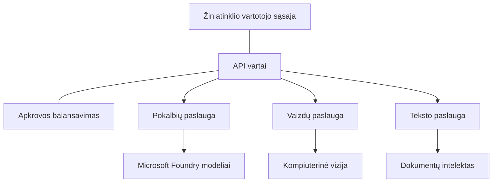

# Produkcinių AI apkrovų geriausios praktikos su AZD

**Skyriaus naršymas:**
- **📚 Kurso pradžia**: [AZD For Beginners](../../README.md)
- **📖 Dabartinis skyrius**: 8 skyrius - Produkcijos & Įmonių modeliai
- **⬅️ Ankstesnis skyrius**: [7 skyrius: Trikčių šalinimas](../chapter-07-troubleshooting/debugging.md)
- **⬅️ Taip pat susiję**: [AI Workshop Lab](ai-workshop-lab.md)
- **🎯 Kursas baigtas**: [AZD For Beginners](../../README.md)

## Apžvalga

Šis vadovas pateikia išsamias geriausias praktikas diegiant produkcijai paruoštas AI apkrovas naudojant Azure Developer CLI (AZD). Remiantis Microsoft Foundry Discord bendruomenės atsiliepimais ir realių klientų diegimais, šios praktikos sprendžia dažniausias problemas produkcinėse AI sistemose.

## Pagrindinės sprendžiamos problemos

Remiantis mūsų bendruomenės apklausa, tai yra pagrindinės problemos, su kuriomis susiduria kūrėjai:

- **45%** sunkumų dėl kelių paslaugų AI diegimų
- **38%** problemų su kredencialų ir slaptų duomenų valdymu  
- **35%** sunkumų pasiekti produkcinį paruošimą ir mastelį
- **32%** reikia geresnių sąnaudų optimizavimo strategijų
- **29%** reikalauja patobulintos stebėsenos ir trikčių šalinimo

## Architektūros modeliai produkciniams AI sprendimams

### Modelis 1: Mikroservisų AI architektūra

**Kada naudoti**: Sudėtingoms AI programoms su keliomis funkcijomis



**AZD įgyvendinimas**:

```yaml
# azure.yaml
name: enterprise-ai-platform
services:
  web:
    project: ./web
    host: staticwebapp
  api-gateway:
    project: ./api-gateway
    host: containerapp
  chat-service:
    project: ./services/chat
    host: containerapp
  vision-service:
    project: ./services/vision
    host: containerapp
  text-service:
    project: ./services/text
    host: containerapp
```

### Modelis 2: Įvykių valdomas AI apdorojimas

**Kada naudoti**: Paketinis apdorojimas, dokumentų analizė, asinchroniniai darbo procesai

```bicep
// Event Hub for AI processing pipeline
resource eventHub 'Microsoft.EventHub/namespaces@2023-01-01-preview' = {
  name: eventHubNamespaceName
  location: location
  sku: {
    name: 'Standard'
    tier: 'Standard'
    capacity: 1
  }
}

// Service Bus for reliable message processing
resource serviceBus 'Microsoft.ServiceBus/namespaces@2022-10-01-preview' = {
  name: serviceBusNamespaceName
  location: location
  sku: {
    name: 'Premium'
    tier: 'Premium'
    capacity: 1
  }
}

// Function App for processing
resource functionApp 'Microsoft.Web/sites@2023-01-01' = {
  name: functionAppName
  location: location
  kind: 'functionapp,linux'
  properties: {
    siteConfig: {
      appSettings: [
        {
          name: 'FUNCTIONS_EXTENSION_VERSION'
          value: '~4'
        }
        {
          name: 'AZURE_OPENAI_ENDPOINT'
          value: '@Microsoft.KeyVault(VaultName=${keyVault.name};SecretName=openai-endpoint)'
        }
      ]
    }
  }
}
```

## Apie AI agentų veiklos būklę

Kai tradicinė žiniatinklio programa sugesti, simptomai yra pažįstami: puslapis ne užsikrauna, API grąžina klaidą arba diegimas nepavyksta. AI palaikomos programos gali sugesti tais pačiais būdais — tačiau jos taip pat gali elgtis subtiliau, be akivaizdžių klaidų pranešimų.

Šiame skyriuje padėsime suformuoti mąstymo modelį AI apkrovų stebėsenai, kad žinotumėte, kur ieškoti, kai kažkas atrodo ne taip.

### Kaip agentų būklė skiriasi nuo tradicinių programų būklės

Tradicinė programa arba veikia, arba neveikia. AI agentas gali atrodyti, kad veikia, bet pateikti prastus rezultatus. Galvokite apie agento būklę dviem sluoksniais:

| Sluoksnis | Ką stebėti | Kur žiūrėti |
|-------|--------------|---------------|
| **Infrastruktūros būklė** | Ar paslauga veikia? Ar resursai priskirti? Ar galiniai taškai pasiekiami? | `azd monitor`, Azure Portal resource health, container/app logs |
| **Elgesio būklė** | Ar agentas atsako tiksliai? Ar atsakymai laiku? Ar modelis kviečiamas teisingai? | Application Insights sekos, modelio kvietimo vėlavimo metrikos, atsakymų kokybės žurnalai |

Infrastruktūros būklė yra pažįstama — ji ta pati bet kuriai azd programai. Elgesio būklė yra naujas sluoksnis, kurį įveda AI apkrovos.

### Kur žiūrėti, kai AI programos elgiasi netinkamai

Jei jūsų AI programa nepateikia laukiamų rezultatų, čia pateiktas konceptualus kontrolinis sąrašas:

1. **Pradėkite nuo pagrindų.** Ar programa veikia? Ar ji pasiekia priklausomybes? Patikrinkite `azd monitor` ir resursų būklę taip pat, kaip bet kuriai programai.
2. **Patikrinkite modelio ryšį.** Ar jūsų programa sėkmingai kviečia AI modelį? Nepavykę arba baigę laiku modelio kvietimai yra dažniausia AI programų problemų priežastis ir pasirodys jūsų programos žurnaluose.
3. **Pažiūrėkite, ką modelis gavo.** AI atsakymai priklauso nuo įvesties (prompt'o ir bet kokio paimto konteksto). Jei išvestis neteisinga, dažniausiai įvestis yra neteisinga. Patikrinkite, ar programa siunčia teisingus duomenis modeliui.
4. **Peržiūrėkite atsakymų vėlavimą.** AI modelio kvietimai yra lėtesni nei įprasti API kvietimai. Jei programa atrodo neatsakinga, patikrinkite, ar modelio atsako laikai padidėjo — tai gali rodyti ribojimą, pajėgumų ribas arba regioninį perkrovimą.
5. **Stebėkite sąnaudų signalus.** Nenumatytas žetonų naudojimo ar API kvietimų šuolis gali reikšti ciklą, neteisingai sukonfigūruotą prompt'ą arba per didelius bandymus (retries).

Jums nereikia iškart tobulai valdyti observability įrankių. Svarbiausia išvada — AI programoms reikia papildomo elgesio sluoksnio stebėsenai, o azd integruota stebėsena (`azd monitor`) suteikia pradinį tašką tirti abu sluoksnius.

---

## Saugumo geriausios praktikos

### 1. Nulinio pasitikėjimo (Zero-Trust) saugumo modelis

**Įgyvendinimo strategija**:
- Jokio paslaugos–paslaugos ryšio be autentifikacijos
- Visi API kvietimai naudoja valdomas tapatybes
- Tinklo izoliacija su privatiais galiniais taškais
- Prieigos valdymas pagal mažiausių privilegijų principą

```bicep
// Managed Identity for each service
resource chatServiceIdentity 'Microsoft.ManagedIdentity/userAssignedIdentities@2023-01-31' = {
  name: 'chat-service-identity'
  location: location
}

// Role assignments with minimal permissions
resource openAIUserRole 'Microsoft.Authorization/roleAssignments@2022-04-01' = {
  scope: openAIAccount
  name: guid(openAIAccount.id, chatServiceIdentity.id, openAIUserRoleDefinitionId)
  properties: {
    roleDefinitionId: subscriptionResourceId('Microsoft.Authorization/roleDefinitions', '5e0bd9bd-7b93-4f28-af87-19fc36ad61bd')
    principalId: chatServiceIdentity.properties.principalId
    principalType: 'ServicePrincipal'
  }
}
```

### 2. Saugus slaptų reikšmių valdymas

**Key Vault integracijos modelis**:

```bicep
// Key Vault with proper access policies
resource keyVault 'Microsoft.KeyVault/vaults@2023-02-01' = {
  name: keyVaultName
  location: location
  properties: {
    tenantId: tenant().tenantId
    sku: {
      family: 'A'
      name: 'premium'  // Use premium for production
    }
    enableRbacAuthorization: true  // Use RBAC instead of access policies
    enablePurgeProtection: true    // Prevent accidental deletion
    enableSoftDelete: true
    softDeleteRetentionInDays: 90
  }
}

// Store all AI service credentials
resource openAIKeySecret 'Microsoft.KeyVault/vaults/secrets@2023-02-01' = {
  parent: keyVault
  name: 'openai-api-key'
  properties: {
    value: openAIAccount.listKeys().key1
    attributes: {
      enabled: true
    }
  }
}
```

### 3. Tinklo saugumas

**Privataus galinio taško konfigūracija**:

```bicep
// Virtual Network for AI services
resource virtualNetwork 'Microsoft.Network/virtualNetworks@2023-04-01' = {
  name: vnetName
  location: location
  properties: {
    addressSpace: {
      addressPrefixes: ['10.0.0.0/16']
    }
    subnets: [
      {
        name: 'ai-services-subnet'
        properties: {
          addressPrefix: '10.0.1.0/24'
          privateEndpointNetworkPolicies: 'Disabled'
        }
      }
      {
        name: 'app-services-subnet'
        properties: {
          addressPrefix: '10.0.2.0/24'
          delegations: [
            {
              name: 'Microsoft.Web/serverFarms'
              properties: {
                serviceName: 'Microsoft.Web/serverFarms'
              }
            }
          ]
        }
      }
    ]
  }
}

// Private endpoints for all AI services
resource openAIPrivateEndpoint 'Microsoft.Network/privateEndpoints@2023-04-01' = {
  name: '${openAIAccountName}-pe'
  location: location
  properties: {
    subnet: {
      id: virtualNetwork.properties.subnets[0].id
    }
    privateLinkServiceConnections: [
      {
        name: 'openai-connection'
        properties: {
          privateLinkServiceId: openAIAccount.id
          groupIds: ['account']
        }
      }
    ]
  }
}
```

## Veikimas ir mastelėjimas

### 1. Automatinio skalavimo strategijos

**Container Apps automatinis skalavimas**:

```bicep
resource containerApp 'Microsoft.App/containerApps@2023-05-01' = {
  name: containerAppName
  location: location
  properties: {
    configuration: {
      ingress: {
        external: true
        targetPort: 8000
        transport: 'http'
      }
    }
    template: {
      scale: {
        minReplicas: 2  // Always have 2 instances minimum
        maxReplicas: 50 // Scale up to 50 for high load
        rules: [
          {
            name: 'http-scaling'
            http: {
              metadata: {
                concurrentRequests: '20'  // Scale when >20 concurrent requests
              }
            }
          }
          {
            name: 'cpu-scaling'
            custom: {
              type: 'cpu'
              metadata: {
                type: 'Utilization'
                value: '70'  // Scale when CPU >70%
              }
            }
          }
        ]
      }
    }
  }
}
```

### 2. Kešavimo strategijos

**Redis kešas AI atsakymams**:

```bicep
// Redis Premium for production workloads
resource redisCache 'Microsoft.Cache/redis@2023-04-01' = {
  name: redisCacheName
  location: location
  properties: {
    sku: {
      name: 'Premium'
      family: 'P'
      capacity: 1
    }
    enableNonSslPort: false
    minimumTlsVersion: '1.2'
    redisConfiguration: {
      'maxmemory-policy': 'allkeys-lru'
    }
    // Enable clustering for high availability
    redisVersion: '6.0'
    shardCount: 2
  }
}

// Cache configuration in application
var cacheConnectionString = '${redisCache.properties.hostName}:6380,password=${redisCache.listKeys().primaryKey},ssl=True,abortConnect=False'
```

### 3. Paskirstymas ir srauto valdymas

**Application Gateway su WAF**:

```bicep
// Application Gateway with Web Application Firewall
resource applicationGateway 'Microsoft.Network/applicationGateways@2023-04-01' = {
  name: appGatewayName
  location: location
  properties: {
    sku: {
      name: 'WAF_v2'
      tier: 'WAF_v2'
      capacity: 2
    }
    webApplicationFirewallConfiguration: {
      enabled: true
      firewallMode: 'Prevention'
      ruleSetType: 'OWASP'
      ruleSetVersion: '3.2'
    }
    // Backend pools for AI services
    backendAddressPools: [
      {
        name: 'ai-services-pool'
        properties: {
          backendAddresses: [
            {
              fqdn: '${containerApp.properties.configuration.ingress.fqdn}'
            }
          ]
        }
      }
    ]
  }
}
```

## 💰 Sąnaudų optimizavimas

### 1. Tinkamas išteklių parinkimas

**Aplinkai pritaikytos konfigūracijos**:

```bash
# Vystymo aplinka
azd env new development
azd env set AZURE_OPENAI_SKU "S0"
azd env set AZURE_OPENAI_CAPACITY 10
azd env set AZURE_SEARCH_SKU "basic"
azd env set CONTAINER_CPU 0.5
azd env set CONTAINER_MEMORY 1.0

# Gamybinė aplinka
azd env new production
azd env set AZURE_OPENAI_SKU "S0"
azd env set AZURE_OPENAI_CAPACITY 100
azd env set AZURE_SEARCH_SKU "standard"
azd env set CONTAINER_CPU 2.0
azd env set CONTAINER_MEMORY 4.0
```

### 2. Sąnaudų stebėjimas ir biudžetai

```bicep
// Cost management and budgets
resource budget 'Microsoft.Consumption/budgets@2023-05-01' = {
  name: 'ai-workload-budget'
  properties: {
    timePeriod: {
      startDate: '2024-01-01'
      endDate: '2024-12-31'
    }
    timeGrain: 'Monthly'
    amount: 2000  // $2000 monthly budget
    category: 'Cost'
    notifications: {
      warning: {
        enabled: true
        operator: 'GreaterThan'
        threshold: 80
        contactEmails: [
          'finance@company.com'
          'engineering@company.com'
        ]
        contactRoles: [
          'Owner'
          'Contributor'
        ]
      }
      critical: {
        enabled: true
        operator: 'GreaterThan'
        threshold: 95
        contactEmails: [
          'cto@company.com'
        ]
      }
    }
  }
}
```

### 3. Žetonų naudojimo optimizavimas

**OpenAI sąnaudų valdymas**:

```typescript
// Programos lygio tokenų optimizavimas
class TokenOptimizer {
  private readonly maxTokens = 4000;
  private readonly reserveTokens = 500;
  
  optimizePrompt(userInput: string, context: string): string {
    const availableTokens = this.maxTokens - this.reserveTokens;
    const estimatedTokens = this.estimateTokens(userInput + context);
    
    if (estimatedTokens > availableTokens) {
      // Trumpinkite kontekstą, o ne vartotojo įvestį
      context = this.truncateContext(context, availableTokens - this.estimateTokens(userInput));
    }
    
    return `${context}\n\nUser: ${userInput}`;
  }
  
  private estimateTokens(text: string): number {
    // Apytikslis įvertinimas: 1 tokenas ≈ 4 simboliai
    return Math.ceil(text.length / 4);
  }
}
```

## Stebėsena ir matomumas

### 1. Išsamus Application Insights

```bicep
// Application Insights with advanced features
resource applicationInsights 'Microsoft.Insights/components@2020-02-02' = {
  name: applicationInsightsName
  location: location
  kind: 'web'
  properties: {
    Application_Type: 'web'
    WorkspaceResourceId: logAnalyticsWorkspace.id
    SamplingPercentage: 100  // Full sampling for AI apps
    DisableIpMasking: false  // Enable for security
  }
}

// Custom metrics for AI operations
resource aiMetricAlerts 'Microsoft.Insights/metricAlerts@2018-03-01' = {
  name: 'ai-high-error-rate'
  location: 'global'
  properties: {
    description: 'Alert when AI service error rate is high'
    severity: 2
    enabled: true
    scopes: [
      applicationInsights.id
    ]
    evaluationFrequency: 'PT1M'
    windowSize: 'PT5M'
    criteria: {
      'odata.type': 'Microsoft.Azure.Monitor.SingleResourceMultipleMetricCriteria'
      allOf: [
        {
          name: 'high-error-rate'
          metricName: 'requests/failed'
          operator: 'GreaterThan'
          threshold: 10
          timeAggregation: 'Count'
        }
      ]
    }
  }
}
```

### 2. AI specifinė stebėsena

**Pritaikyti prietaisų skydeliai AI metrikoms**:

```json
// Dashboard configuration for AI workloads
{
  "dashboard": {
    "name": "AI Application Monitoring",
    "tiles": [
      {
        "name": "OpenAI Request Volume",
        "query": "requests | where name contains 'openai' | summarize count() by bin(timestamp, 5m)"
      },
      {
        "name": "AI Response Latency",
        "query": "requests | where name contains 'openai' | summarize avg(duration) by bin(timestamp, 5m)"
      },
      {
        "name": "Token Usage",
        "query": "customMetrics | where name == 'openai_tokens_used' | summarize sum(value) by bin(timestamp, 1h)"
      },
      {
        "name": "Cost per Hour",
        "query": "customMetrics | where name == 'openai_cost' | summarize sum(value) by bin(timestamp, 1h)"
      }
    ]
  }
}
```

### 3. Būklės patikros ir pasiekiamumo stebėsena

```bicep
// Application Insights availability tests
resource availabilityTest 'Microsoft.Insights/webtests@2022-06-15' = {
  name: 'ai-app-availability-test'
  location: location
  tags: {
    'hidden-link:${applicationInsights.id}': 'Resource'
  }
  properties: {
    SyntheticMonitorId: 'ai-app-availability-test'
    Name: 'AI Application Availability Test'
    Description: 'Tests AI application endpoints'
    Enabled: true
    Frequency: 300  // 5 minutes
    Timeout: 120    // 2 minutes
    Kind: 'ping'
    Locations: [
      {
        Id: 'us-east-2-azr'
      }
      {
        Id: 'us-west-2-azr'
      }
    ]
    Configuration: {
      WebTest: '''
        <WebTest Name="AI Health Check" 
                 Id="8d2de8d2-a2b0-4c2e-9a0d-8f9c9a0b8c8d" 
                 Enabled="True" 
                 CssProjectStructure="" 
                 CssIteration="" 
                 Timeout="120" 
                 WorkItemIds="" 
                 xmlns="http://microsoft.com/schemas/VisualStudio/TeamTest/2010" 
                 Description="" 
                 CredentialUserName="" 
                 CredentialPassword="" 
                 PreAuthenticate="True" 
                 Proxy="default" 
                 StopOnError="False" 
                 RecordedResultFile="" 
                 ResultsLocale="">
          <Items>
            <Request Method="GET" 
                     Guid="a5f10126-e4cd-570d-961c-cea43999a200" 
                     Version="1.1" 
                     Url="${webApp.properties.defaultHostName}/health" 
                     ThinkTime="0" 
                     Timeout="120" 
                     ParseDependentRequests="True" 
                     FollowRedirects="True" 
                     RecordResult="True" 
                     Cache="False" 
                     ResponseTimeGoal="0" 
                     Encoding="utf-8" 
                     ExpectedHttpStatusCode="200" 
                     ExpectedResponseUrl="" 
                     ReportingName="" 
                     IgnoreHttpStatusCode="False" />
          </Items>
        </WebTest>
      '''
    }
  }
}
```

## Avarinis atkūrimas ir aukštas prieinamumas

### 1. Diegimas keliuose regionuose

```yaml
# azure.yaml - Multi-region configuration
name: ai-app-multiregion
services:
  api-primary:
    project: ./api
    host: containerapp
    env:
      - AZURE_REGION=eastus
  api-secondary:
    project: ./api
    host: containerapp
    env:
      - AZURE_REGION=westus2
```

```bicep
// Traffic Manager for global load balancing
resource trafficManager 'Microsoft.Network/trafficManagerProfiles@2022-04-01' = {
  name: trafficManagerProfileName
  location: 'global'
  properties: {
    profileStatus: 'Enabled'
    trafficRoutingMethod: 'Priority'
    dnsConfig: {
      relativeName: trafficManagerProfileName
      ttl: 30
    }
    monitorConfig: {
      protocol: 'HTTPS'
      port: 443
      path: '/health'
      intervalInSeconds: 30
      toleratedNumberOfFailures: 3
      timeoutInSeconds: 10
    }
    endpoints: [
      {
        name: 'primary-endpoint'
        type: 'Microsoft.Network/trafficManagerProfiles/azureEndpoints'
        properties: {
          targetResourceId: primaryAppService.id
          endpointStatus: 'Enabled'
          priority: 1
        }
      }
      {
        name: 'secondary-endpoint'
        type: 'Microsoft.Network/trafficManagerProfiles/azureEndpoints'
        properties: {
          targetResourceId: secondaryAppService.id
          endpointStatus: 'Enabled'
          priority: 2
        }
      }
    ]
  }
}
```

### 2. Duomenų atsarginė kopija ir atkūrimas

```bicep
// Backup configuration for critical data
resource backupVault 'Microsoft.DataProtection/backupVaults@2023-05-01' = {
  name: backupVaultName
  location: location
  identity: {
    type: 'SystemAssigned'
  }
  properties: {
    storageSettings: [
      {
        datastoreType: 'VaultStore'
        type: 'LocallyRedundant'
      }
    ]
  }
}

// Backup policy for AI models and data
resource backupPolicy 'Microsoft.DataProtection/backupVaults/backupPolicies@2023-05-01' = {
  parent: backupVault
  name: 'ai-data-backup-policy'
  properties: {
    policyRules: [
      {
        backupParameters: {
          backupType: 'Full'
          objectType: 'AzureBackupParams'
        }
        trigger: {
          schedule: {
            repeatingTimeIntervals: [
              'R/2024-01-01T02:00:00+00:00/P1D'  // Daily at 2 AM
            ]
          }
          objectType: 'ScheduleBasedTriggerContext'
        }
        dataStore: {
          datastoreType: 'VaultStore'
          objectType: 'DataStoreInfoBase'
        }
        name: 'BackupDaily'
        objectType: 'AzureBackupRule'
      }
    ]
  }
}
```

## DevOps ir CI/CD integracija

### 1. GitHub Actions darbo eiga

```yaml
# .github/workflows/deploy-ai-app.yml
name: Deploy AI Application

on:
  push:
    branches: [main]
  pull_request:
    branches: [main]

jobs:
  test:
    runs-on: ubuntu-latest
    steps:
      - uses: actions/checkout@v4
      
      - name: Setup Python
        uses: actions/setup-python@v4
        with:
          python-version: '3.11'
          
      - name: Install dependencies
        run: |
          pip install -r requirements.txt
          pip install pytest
          
      - name: Run tests
        run: pytest tests/
        
      - name: AI Safety Tests
        run: |
          python scripts/test_ai_safety.py
          python scripts/validate_prompts.py

  deploy-staging:
    needs: test
    if: github.event_name == 'pull_request'
    runs-on: ubuntu-latest
    steps:
      - uses: actions/checkout@v4
      
      - name: Setup AZD
        uses: Azure/setup-azd@v2
        
      - name: Login to Azure
        uses: azure/login@v1
        with:
          creds: ${{ secrets.AZURE_CREDENTIALS }}
          
      - name: Deploy to Staging
        run: |
          azd env select staging
          azd deploy

  deploy-production:
    needs: test
    if: github.ref == 'refs/heads/main'
    runs-on: ubuntu-latest
    steps:
      - uses: actions/checkout@v4
      
      - name: Setup AZD
        uses: Azure/setup-azd@v2
        
      - name: Login to Azure
        uses: azure/login@v1
        with:
          creds: ${{ secrets.AZURE_CREDENTIALS }}
          
      - name: Deploy to Production
        run: |
          azd env select production
          azd deploy
          
      - name: Run Production Health Checks
        run: |
          python scripts/health_check.py --env production
```

### 2. Infrastruktūros patikra

```bash
# scripts/validate_infrastructure.sh
#!/bin/bash

echo "Validating AI infrastructure deployment..."

# Patikrinti, ar visos reikalingos paslaugos veikia
services=("openai" "search" "storage" "keyvault")
for service in "${services[@]}"; do
    echo "Checking $service..."
    if ! az resource list --resource-type "Microsoft.CognitiveServices/accounts" --query "[?contains(name, '$service')]" -o tsv; then
        echo "ERROR: $service not found"
        exit 1
    fi
done

# Patikrinti OpenAI modelių diegimus
echo "Validating OpenAI model deployments..."
models=$(az cognitiveservices account deployment list --name $AZURE_OPENAI_NAME --resource-group $AZURE_RESOURCE_GROUP --query "[].name" -o tsv)
if [[ ! $models == *"gpt-4.1-mini"* ]]; then
  echo "ERROR: Required model gpt-4.1-mini not deployed"
    exit 1
fi

# Išbandyti dirbtinio intelekto paslaugos ryšį
echo "Testing AI service connectivity..."
python scripts/test_connectivity.py

echo "Infrastructure validation completed successfully!"
```

## Produkcinio paruošimo kontrolinis sąrašas

### Saugumas ✅
- [ ] Visos paslaugos naudoja valdomas tapatybes
- [ ] Slapta informacija saugoma Key Vault
- [ ] Privatūs galiniai taškai sukonfigūruoti
- [ ] Tinklo saugumo grupės įdiegtos
- [ ] RBAC su mažiausių privilegijų principu
- [ ] WAF įjungtas viešuose galiniuose taškuose

### Veikimas ✅
- [ ] Automatinis skalavimas sukonfigūruotas
- [ ] Kešavimas įdiegtas
- [ ] Paskirstymas (load balancing) sukonfigūruotas
- [ ] CDN statiniam turiniui
- [ ] Duomenų bazės jungčių pulingas (connection pooling)
- [ ] Žetonų naudojimo optimizavimas

### Stebėsena ✅
- [ ] Application Insights sukonfigūruotas
- [ ] Individualios metrikos apibrėžtos
- [ ] Įspėjimų taisyklės nustatytos
- [ ] Prietaisų skydelis sukurtas
- [ ] Būklės patikros įdiegtos
- [ ] Žurnalų saugojimo politikos

### Patikimumas ✅
- [ ] Diegimas keliuose regionuose
- [ ] Atsarginės kopijos ir atkūrimo planas
- [ ] Grandinių pertraukikliai (circuit breakers) įdiegti
- [ ] Bandymo strategijos (retry policies) sukonfigūruotos
- [ ] Graceful degradation (švelnus degradavimas)
- [ ] Būklės patikros galiniai taškai

### Sąnaudų valdymas ✅
- [ ] Biudžeto įspėjimai sukonfigūruoti
- [ ] Tinkamas išteklių parinkimas
- [ ] Dev/test nuolaidos taikomos
- [ ] Užsakyti rezervuoti instancijos
- [ ] Sąnaudų stebėjimo prietaisų skydelis
- [ ] Reguliarūs sąnaudų peržiūros

### Atitiktis ✅
- [ ] Duomenų lokalizacijos reikalavimai įvykdyti
- [ ] Audito žurnalavimas įjungtas
- [ ] Atitikties politikos pritaikytos
- [ ] Saugumo pagrindai įgyvendinti
- [ ] Reguliarūs saugumo vertinimai
- [ ] Incidentų valdymo planas

## Našumo etalonai

### Tipinės produkcinės metrikos

| Metrika | Tikslas | Stebėsena |
|--------|--------|------------|
| **Atsako laikas** | < 2 sekundžių | Application Insights |
| **Prieinamumas** | 99.9% | Pasiekiamumo stebėsena |
| **Klaidų dažnis** | < 0.1% | Programos žurnalai |
| **Žetonų naudojimas** | < $500/month | Sąnaudų valdymas |
| **Vienu metu vartotojai** | 1000+ | Krovos testavimas |
| **Atkūrimo laikas** | < 1 valandos | Avarinio atkūrimo testai |

### Krovos testavimas

```bash
# Skriptas apkrovos testavimui dirbtinio intelekto programoms.
python scripts/load_test.py \
  --endpoint https://your-ai-app.azurewebsites.net \
  --concurrent-users 100 \
  --duration 300 \
  --ramp-up 60
```

## 🤝 Bendruomenės geriausios praktikos

Remiantis Microsoft Foundry Discord bendruomenės atsiliepimais:

### Pagrindinės bendruomenės rekomendacijos:

1. **Pradėkite nuo mažo, mastelį didinkite palaipsniui**: Pradėkite nuo pagrindinių SKU ir didinkite pagal faktinį naudojimą
2. **Stebėkite viską**: Nustatykite išsamią stebėseną nuo pirmos dienos
3. **Automatizuokite saugumą**: Naudokite infrastruktūrą kaip kodą nuosekliam saugumui
4. **Testuokite kruopščiai**: Įtraukite AI specifinius testus į savo pipeline'ą
5. **Planuokite sąnaudas**: Stebėkite žetonų naudojimą ir anksčiau nustatykite biudžeto įspėjimus

### Dažnos klaidos, kurių reikėtų vengti:

- ❌ API raktų įkoduoti tiesiog į kodą
- ❌ Netinkamai sukonfigūruota stebėsena
- ❌ Sąnaudų optimizavimo ignoravimas
- ❌ Ne testuoti gedimų scenarijai
- ❌ Diegti be būklės patikrų

## AZD AI CLI komandos ir plėtiniai

AZD apima augantį AI specifinių komandų ir plėtinių rinkinį, kurie supaprastina produkcinių AI darbo srautus. Šie įrankiai užpildo spragą tarp vietinio vystymo ir produkcijos diegimo AI apkrovoms.

### AZD plėtiniai AI

AZD naudoja plėtinių sistemą, kad pridėtų AI specifines galimybes. Įdiekite ir valdykite plėtinius su:

```bash
# Išvardyti visus prieinamus plėtinius (įskaitant dirbtinį intelektą)
azd extension list

# Peržiūrėti įdiegtų plėtinių detales
azd extension show azure.ai.agents

# Įdiegti Foundry agents plėtinį
azd extension install azure.ai.agents

# Įdiegti smulkiojo derinimo plėtinį
azd extension install azure.ai.finetune

# Įdiegti tinkintų modelių plėtinį
azd extension install azure.ai.models

# Atnaujinti visus įdiegtus plėtinius
azd extension upgrade --all
```

**Galimi AI plėtiniai:**

| Extension | Paskirtis | Statusas |
|-----------|---------|--------|
| `azure.ai.agents` | Foundry Agent Service valdymas | Peržiūra |
| `azure.ai.skills` | Pakartotinai naudojami agentų įgūdžiai | Peržiūra |
| `azure.ai.connections` | Foundry ryšiai (duomenų šaltiniai, įrankiai) | Peržiūra |
| `azure.ai.finetune` | Foundry modelio smulkusis pritaikymas | Peržiūra |
| `azure.ai.models` | Foundry pasirinktiniai modeliai | Peržiūra |
| `azure.coding-agent` | Kodo agento konfigūracija | Prieinamas |

> `azure.ai.agents` plėtinys greitai vystosi. Šis kursas buvo patvirtintas su `0.1.40-preview`. Paleiskite `azd extension upgrade --all`, kad gautumėte naujausią komandų rinkinį, ir `azd extension show azure.ai.agents`, kad patikrintumėte įdiegtą versiją.

**Kas yra naujesni `skills` ir `connections` plėtiniai?**

Du peržiūros plėtiniai pasirodė kartu su agentų įrankiais ir verta juos suprasti net ir pradedantiesiems:

- **`azure.ai.skills`** — Įgūdis (skill) yra pakartotinai naudojama galimybė (supakuotas įrankis arba elgsena), kurią galite priskirti vienam ar daugiau agentų vietoj to, kad kiekvieną kartą ją perrašytumėte. Galvokite apie tai kaip bendrą statymo bloką: apibrėžkite „ieškoti dokumentacijoje“ arba „pažvelgti užsakymą“ įgūdį vieną kartą ir tada naudokite jį pasikartojamai agentuose. Tai išlaiko daugiaagentines sistemas (5 skyrius) nuoseklias ir išvengia kopijavimo-klijavimo.
- **`azure.ai.connections`** — Ryšys (connection) yra valdomas nuorodos iš jūsų Foundry projekto į išorinį išteklių, kurio agentams reikia — duomenų šaltinį (pvz., Azure AI Search), įrankio galinį tašką arba kitą paslaugą. Ryšiai centralizuoja *kur* ir *kaip* agentai pasiekia duomenis, tad kredencialai ir galiniai taškai gyvena vienoje valdomoje vietoje, o ne išsibarsčiusiuose kodo fragmentuose.

Jums šių plėtinių nereikia, kad diegtumėte savo pirmuosius agentus — likite su `azure.ai.agents`, kol mokotės. Pasieksite `skills`, kai pradėsite dauginti tą patį įrankį tarp agentų, ir `connections`, kai keli agentai dalinsis tuo pačiu duomenų šaltiniu.

### Agentų projektų inicijavimas su `azd ai agent init`

Komanda `azd ai agent init` sukuria produkcijai paruoštą AI agento projektą, integruotą su Microsoft Foundry Agent Service:

```bash
# Inicializuoti naują agento projektą iš agento manifesto
azd ai agent init -m <manifest-path-or-uri>

# Inicializuoti ir nukreipti į konkretų Foundry projektą
azd ai agent init -m agent-manifest.yaml --project-id <foundry-project-id>

# Inicializuoti su pasirinktiniu šaltinio katalogu
azd ai agent init -m agent-manifest.yaml --src ./agents/my-agent

# Nukreipti Container Apps kaip talpinimo aplinką
azd ai agent init -m agent-manifest.yaml --host containerapp
```

**Pagrindiniai parametrai:**

| Parametras | Aprašymas |
|------|-------------|
| `-m, --manifest` | Kelias arba URI iki agento manifest'o, kurį pridėti prie projekto |
| `-p, --project-id` | Esamas Microsoft Foundry Project ID jūsų azd aplinkai |
| `-s, --src` | Katalogas, į kurį atsisiųsti agento apibrėžimą (pagal nutylėjimą `src/<agent-id>`) |
| `--host` | Pakeisti numatytąjį host'ą (pvz., `containerapp`) |
| `-e, --environment` | Azd aplinka, kurios reikia |

**Produkcinis patarimas**: Naudokite `--project-id`, kad tiesiogiai prisijungtumėte prie esamo Foundry projekto, taip išlaikydami agento kodą ir debesies resursus susietus nuo pat pradžių.

### Agentų gyvavimo ciklo valdymas

Be `init`, `azure.ai.agents` plėtinys suteikia komandas visam talpinamo agento gyvavimo ciklui — testavimui, vertinimui, optimizavimui ir pasenimui:

```bash
# Iškvieskite įdiegtą agentą ir peržiūrėkite serverio atsako laiką
# (viso delsos ir laiko iki pirmojo baito)
azd ai agent invoke

# Rodykite gyvo galinio taško konfigūraciją prieš ją pakeičiant
azd ai agent endpoint show

# Sukurkite vertinimo duomenų rinkinį agentui
azd ai agent eval generate --dataset ./eval/dataset.jsonl

# Optimizuokite agento instrukcijas pagal jūsų vertinimo duomenis
# (reikalauja optimization_model agento projekte)
azd ai agent optimize

# Atsisiųskite įdiegtą kodo pagrindu talpinamo agento šaltinį
# (su SHA-256 patikra)
azd ai agent code download

# Ištrinkite talpinamą agentą ir visas jo versijas
# (--force nutraukia aktyvias sesijas)
azd ai agent delete --force
```

**Gyvavimo ciklas trumpai:**

| Etapas | Komanda | Produkcinis naudojimas |
|-------|---------|----------------|
| Testavimas | `azd ai agent invoke` | Patikrinti atsakymus ir išmatuoti vėlavimą prieš leidimą |
| Tikrinimas | `azd ai agent endpoint show` | Peržiūrėti endpoint autentifikaciją/konfigūraciją; anksti pastebėti pakeitimus, kurie gali sukelti gedimus |
| Matavimas | `azd ai agent eval generate` | Sukurti pakartotinai naudojamą vertinimo rinkinį iš realių sekų |
| Tobulinimas | `azd ai agent optimize` | Koreguoti instrukcijas pagal matuojamą kokybę |
| Atkūrimas | `azd ai agent code download` | Gauti tikslų diegtą šaltinį audito/rollback reikmėms |
| Panaikinimas | `azd ai agent delete --force` | Švariai pašalinti agentą ir jo versijas |

> Tai yra peržiūros komandos ir jos gali keistis tarp plėtinių leidimų. Paleiskite `azd ai agent --help`, kad pamatytumėte tikslų subkomandų sąrašą, prieinamą jūsų įdiegtoje versijoje.

### Modelio konteksto protokolas (MCP) su `azd mcp`
AZD includes built-in MCP server support (Alpha), enabling AI agents and tools to interact with your Azure resources through a standardized protocol:

```bash
# Paleiskite MCP serverį savo projektui
azd mcp start

# Peržiūrėkite dabartines Copilot sutikimo taisykles dėl įrankių vykdymo
azd copilot consent list
```

The MCP server exposes your azd project context—environments, services, and Azure resources—to AI-powered development tools. This enables:

- **AI-pagalbinis diegimas**: Leisti kodavimo agentams užklausti jūsų projekto būsenos ir inicijuoti diegimus
- **Išteklių aptikimas**: AI įrankiai gali aptikti, kokius Azure išteklius naudoja jūsų projektas
- **Aplinkų valdymas**: agentai gali pereiti tarp kūrimo, parengimo (staging) ir gamybos aplinkų

### Infrastruktūros generavimas su `azd infra generate`

For production AI workloads, you can generate and customize Infrastructure as Code rather than relying on automatic provisioning:

```bash
# Generuoti Bicep/Terraform failus iš jūsų projekto apibrėžimo
azd infra generate
```

This writes IaC to disk so you can:
- Peržiūrėti ir patikrinti infrastruktūrą prieš diegiant
- Pridėti pasirinktines saugumo politikos taisykles (tinklo taisyklės, privatūs galiniai taškai)
- Integruoti su esamais IaC peržiūros procesais
- Versijuoti infrastruktūros pakeitimus atskirai nuo programos kodo

### Produkcijos gyvenimo ciklo įskiepiai

AZD hook'ai leidžia įterpti pasirinktinę logiką kiekviename diegimo gyvavimo ciklo etape—kritiškai svarbu produkciniams AI darbo krūviams:

```yaml
# azure.yaml - Production hooks example
name: ai-production-app
hooks:
  preprovision:
    shell: sh
    run: scripts/validate-quotas.sh    # Check AI model quota before provisioning
  postprovision:
    shell: sh
    run: scripts/configure-networking.sh  # Set up private endpoints
  predeploy:
    shell: sh
    run: scripts/run-ai-safety-tests.sh  # Run prompt safety checks
  postdeploy:
    shell: sh
    run: scripts/smoke-test.sh           # Verify agent responses post-deploy
services:
  agent-api:
    project: ./src/agent
    host: containerapp
    hooks:
      predeploy:
        shell: sh
        run: scripts/validate-model-access.sh  # Per-service hook
```

```bash
# Paleisti konkretų hook'ą rankiniu būdu kūrimo metu
azd hooks run predeploy
```

**Rekomenduojami produkciniai hook'ai AI darbo krūviams:**

| Hook | Use Case |
|------|----------|
| `preprovision` | Patikrinti prenumeratos kvotas dėl AI modelio talpos |
| `postprovision` | Konfigūruoti privatųs galinius taškus, diegti modelio svorius |
| `predeploy` | Paleisti AI saugumo testus, patvirtinti promptų šablonus |
| `postdeploy` | Atlikti trumpą (smoke) testą agentų atsakymams, patikrinti modelio prisijungimą |

### CI/CD vamzdyno konfigūracija

Use `azd pipeline config` to connect your project to GitHub Actions or Azure Pipelines with secure Azure authentication:

```bash
# Konfigūruoti CI/CD procesą (interaktyviai)
azd pipeline config

# Konfigūruoti su konkrečiu teikėju
azd pipeline config --provider github
```

This command:
- Sukuria paslaugų principalą su mažiausiomis teisėmis
- Konfigūruoja federacinius įgaliojimus (OIDC) (nėra saugomų slaptų raktų)
- Generuoja arba atnaujina jūsų pipeline apibrėžimo failą
- Nustato reikiamus aplinkos kintamuosius jūsų CI/CD sistemoje

#### Step-by-step: your first GitHub Actions pipeline

Here's the full walkthrough from a working azd project to automated deployments on every push.

**1. Make sure your project is on GitHub**

```bash
git init
git add .
git commit -m "Initial azd project"
gh repo create my-ai-app --private --source=. --push
```

**2. Run pipeline config**

```bash
azd pipeline config --provider github
```

azd will, interactively:
- Paklaus, kurią Azure prenumeratą ir aplinką norite taikyti
- Sukurs Entra **app registration + service principal** for the pipeline
- Sukonfigūruos **federacinius įgaliojimus (OIDC)**—taip GitHub autentifikuosis į Azure su trumpalaikiais tokenais ir **nėra saugomų slaptų raktų**
- Pasiųs reikiamus **kintamuosius** į jūsų GitHub repozitoriją (`AZURE_CLIENT_ID`, `AZURE_TENANT_ID`, `AZURE_SUBSCRIPTION_ID`, `AZURE_ENV_NAME`, `AZURE_LOCATION`)

**3. Understand the generated workflow**

azd adds `.github/workflows/azure-dev.yml`. The key parts look like this:

```yaml
# .github/workflows/azure-dev.yml
on:
  push:
    branches: [ main ]
  workflow_dispatch:        # lets you run it manually too

permissions:
  id-token: write           # required for OIDC federated login
  contents: read

jobs:
  build:
    runs-on: ubuntu-latest
    env:
      AZURE_CLIENT_ID: ${{ vars.AZURE_CLIENT_ID }}
      AZURE_TENANT_ID: ${{ vars.AZURE_TENANT_ID }}
      AZURE_SUBSCRIPTION_ID: ${{ vars.AZURE_SUBSCRIPTION_ID }}
      AZURE_ENV_NAME: ${{ vars.AZURE_ENV_NAME }}
      AZURE_LOCATION: ${{ vars.AZURE_LOCATION }}
    steps:
      - uses: actions/checkout@v4
      - name: Install azd
        uses: Azure/setup-azd@v2
      - name: Log in with OIDC
        run: azd auth login --client-id "$AZURE_CLIENT_ID" --federated-credential-provider "github" --tenant-id "$AZURE_TENANT_ID"
      - name: Provision infrastructure
        run: azd provision --no-prompt
      - name: Deploy application
        run: azd deploy --no-prompt
```

**4. Verify it works**

```bash
# Nusiųskite pakeitimą, kad paleistumėte pipeline
git commit -am "Trigger pipeline" --allow-empty
git push
```

Open the **Actions** tab in your GitHub repo and watch the workflow run `azd provision` and `azd deploy` automatically.

> **Kodėl federaciniai įgaliojimai svarbūs:** senesnės CI/CD grandinės saugojo kliento slaptą raktą GitHub. OIDC federaciniai įgaliojimai visiškai pašalina tą slaptą raktą—GitHub vykdymo metu prašo trumpalaikio tokeno, kuris yra saugesnis ir nereikalauja jo keisti ar bijoti nutekėjimo. Tai yra numatytasis `azd pipeline config` nustatymas.

> **Slaptumai vs. kintamieji:** nesudėtingi identifikatoriai (`AZURE_CLIENT_ID`, ir kt.) dedami į repozitorijos **kintamuosius**. Jei jūsų programai iš tiesų reikia slaptumo build metu, pridėkite jį kaip GitHub **secret** ir nurodykite jį su `${{ secrets.NAME }}`—bet pirmenybę teikite Key Vault + valdomam identitetui vykdymo metu (žr. [Skyrius 3](../chapter-03-configuration/authsecurity.md)).

**Production workflow with pipeline config:**

```bash
# 1. Sukurti gamybinę aplinką
azd env new production
azd env set AZURE_OPENAI_CAPACITY 100

# 2. Sukonfigūruoti pipeline'ą
azd pipeline config --provider github

# 3. Pipeline paleidžia azd deploy kiekvieną kartą, kai atliekamas push į main
```

#### Step-by-step: Azure DevOps Pipelines

Prefer Azure DevOps over GitHub Actions? azd supports it natively with the `azdo` provider. The flow is nearly identical—azd generates the pipeline file, creates a service connection, and wires up authentication.

**1. Make sure you have an Azure DevOps project**

You need an organization and a project at `https://dev.azure.com/<your-org>`. Generate a Personal Access Token (PAT) with **Build (Read & execute)**, **Code (Read & write)**, and **Service Connections (Read, query & manage)** scopes—azd will prompt you for it.

**2. Configure the pipeline**

```bash
azd pipeline config --provider azdo
```

azd will:
- Paprašys jūsų Azure DevOps organizacijos ir projekto
- Sukurs (arba panaudos) a **service connection** į Azure naudodamas service principal
- Konfigūruos **workload identity federation (OIDC)**, todėl jokio kliento slaptumo nėra saugoma
- Pridės `azure-dev.yml` pipeline apibrėžimo failą į jūsų repozitoriją

**3. Review the generated `azure-dev.yml`**

azd writes a pipeline that provisions and deploys on every push to `main`:

```yaml
# azure-dev.yml
trigger:
  - main

pool:
  vmImage: ubuntu-latest

steps:
  - task: setup-azd@1
    displayName: Install azd

  - script: azd provision --no-prompt
    displayName: Provision Infrastructure
    env:
      AZURE_SUBSCRIPTION_ID: $(AZURE_SUBSCRIPTION_ID)
      AZURE_ENV_NAME: $(AZURE_ENV_NAME)
      AZURE_LOCATION: $(AZURE_LOCATION)

  - script: azd deploy --no-prompt
    displayName: Deploy Application
    env:
      AZURE_SUBSCRIPTION_ID: $(AZURE_SUBSCRIPTION_ID)
      AZURE_ENV_NAME: $(AZURE_ENV_NAME)
      AZURE_LOCATION: $(AZURE_LOCATION)
```

**4. Where the variables come from**

azd stores the environment values (`AZURE_ENV_NAME`, `AZURE_LOCATION`, `AZURE_SUBSCRIPTION_ID`) as a **variable group** in Azure DevOps so the pipeline can read them. You can view and edit them under **Pipelines → Library**.

> **Tas pats OIDC privalumas kaip GitHub:** `azdo` teikėjas taip pat pagal nutylėjimą konfigūruoja workload identity federation, todėl paslaugos ryšyje nerasite saugomo kliento slapto rakto—Azure DevOps vykdymo metu keičia trumpalaikį tokeną. Naudokite `--auth-type client-credentials` tik jei jūsų organizacija dar negali naudoti OIDC.

**5. Run it**

```bash
git commit -am "Add Azure DevOps pipeline" --allow-empty
git push
```

Open **Pipelines** in Azure DevOps to watch `azd provision` and `azd deploy` run.

### Komponentų pridėjimas su `azd add`

Incrementally add Azure services to an existing project:

```bash
# Interaktyviai pridėti naują paslaugos komponentą
azd add
```

This is particularly useful for expanding production AI applications—for example, adding a vector search service, a new agent endpoint, or a monitoring component to an existing deployment.

## Papildomi ištekliai

- **Azure Well-Architected Framework**: [AI darbo apkrovų gairės](https://learn.microsoft.com/azure/well-architected/ai/)
- **Microsoft Foundry Documentation**: [Official docs](https://learn.microsoft.com/azure/ai-studio/)
- **Community Templates**: [Azure Samples](https://github.com/Azure-Samples)
- **Discord Community**: [#Azure channel](https://discord.gg/microsoft-azure)
- **Agent Skills for Azure**: [microsoft/github-copilot-for-azure on skills.sh](https://skills.sh/microsoft/github-copilot-for-azure) - 37 atvirų agentų įgūdžių Azure AI, Foundry, diegimui, kaštų optimizavimui ir diagnostikai. Įdiekite savo redaktoriuje:
  ```bash
  npx skills add microsoft/github-copilot-for-azure
  ```

---

**Skyrių naršymas:**
- **📚 Kurso pradžia**: [AZD pradedantiesiems](../../README.md)
- **📖 Dabartinis skyrius**: 8 skyrius - Produkcijos ir įmonių modeliai
- **⬅️ Ankstesnis skyrius**: [7 skyrius: Trikčių šalinimas](../chapter-07-troubleshooting/debugging.md)
- **⬅️ Taip pat susiję**: [AI praktinių dirbtuvių laboratorija](ai-workshop-lab.md)
- **� Kursas baigtas**: [AZD pradedantiesiems](../../README.md)

**Prisiminkite**: Produkcinės AI darbo krūvios reikalauja kruopštaus planavimo, stebėjimo ir nuolatinės optimizacijos. Pradėkite nuo šių modelių ir pritaikykite juos pagal savo konkrečius reikalavimus.

---

<!-- CO-OP TRANSLATOR DISCLAIMER START -->
**Atsakomybės apribojimas**:
Šis dokumentas buvo išverstas naudojant dirbtinio intelekto vertimo paslaugą [Co-op Translator](https://github.com/Azure/co-op-translator). Nors siekiame tikslumo, prašome atkreipti dėmesį, kad automatiniai vertimai gali turėti klaidų ar netikslumų. Originalus dokumentas jo gimtąja kalba laikomas autoritetingu šaltiniu. Svarbiai informacijai rekomenduojama naudoti profesionalų žmogiškąjį vertimą. Mes neatsakome už jokius nesusipratimus ar neteisingą interpretaciją, kilusią naudojantis šiuo vertimu.
<!-- CO-OP TRANSLATOR DISCLAIMER END -->