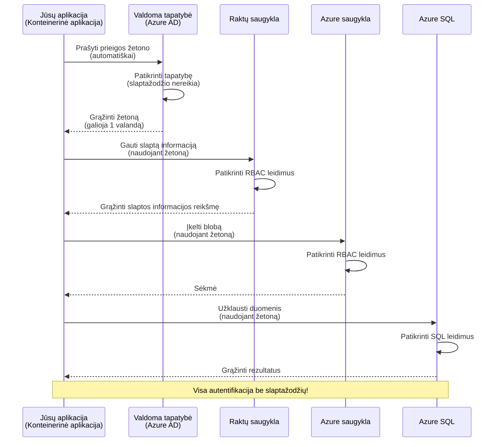
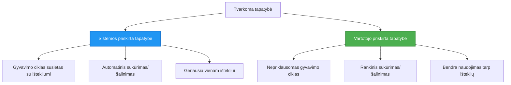

# Autentifikacijos modeliai ir valdomoji tapatybė

⏱️ **Numatomas laikas**: 45-60 minučių | 💰 **Kainos poveikis**: Nemokamai (be papildomų mokesčių) | ⭐ **Sudėtingumas**: Vidutinis

**📚 Mokymosi kelias:**
- ← Ankstesnis: [Konfigūracijos valdymas](configuration.md) - Aplinkos kintamųjų ir paslapčių valdymas
- 🎯 **Jūs esate čia**: Autentifikacija ir saugumas (valdomoji tapatybė, Key Vault, saugumo modeliai)
- → Kitas: [Pirmasis projektas](first-project.md) - Sukurkite savo pirmąją AZD programą
- 🏠 [Kurso pradžia](../../README.md)

---

## Ko išmoksite

Baigę šią pamoką, jūs:
- Suprasite Azure autentifikacijos modelius (raktai, prisijungimo eilutės, valdomoji tapatybė)
- Įgyvendinsite **valdomąją tapatybę** slaptažodžių neturinčiai autentifikacijai
- Užtikrinsite paslapčių saugumą su **Azure Key Vault** integracija
- Konfigūruosite **vaidmenimis pagrįstą prieigos kontrolę (RBAC)** AZD diegimams
- Taikysite saugumo geriausią praktiką konteinerių programose ir Azure paslaugose
- Pereisite nuo raktų pagrindu veikiančios autentifikacijos prie tapatybės pagrindu veikiančios autentifikacijos

## Kodėl svarbi valdomoji tapatybė

### Problema: Tradicinė autentifikacija

**Prieš valdomąją tapatybę:**
```javascript
// ❌ SAUGUMO RIZIKA: Kode įterptos slaptys
const connectionString = "Server=mydb.database.windows.net;User=admin;Password=P@ssw0rd123";
const storageKey = "xK7mN9pQ2wR5tY8uI0oP3aS6dF1gH4jK...";
const cosmosKey = "C2x7B9n4M1p8Q5w3E6r0T2y5U8i1O4p7...";
```

**Problemos:**
- 🔴 **Atviros paslaptys** kode, konfigūracijos failuose, aplinkos kintamuosiuose
- 🔴 **Kredencialų rotacija** reikalauja kodo pakeitimų ir naujo diegimo
- 🔴 **Audito sunkumai** - kas ką pasiekė ir kada?
- 🔴 **Išsibarstymas** - paslaptys išmėtytos po skirtingas sistemas
- 🔴 **Atitikties rizika** - neatitinka saugumo audito reikalavimų

### Sprendimas: Valdomoji tapatybė

**Po valdomosios tapatybės:**
```javascript
// ✅ SAUGU: Kode nėra jokių paslapčių
const credential = new DefaultAzureCredential();
const client = new BlobServiceClient(
  "https://mystorageaccount.blob.core.windows.net",
  credential  // Azure automatiškai tvarko autentifikaciją
);
```

**Privalumai:**
- ✅ **Nėra paslapčių** kode ar konfigūracijoje
- ✅ **Automatinė rotacija** - Azure tai tvarko
- ✅ **Pilnas audito pėdsakas** Azure AD žurnaluose
- ✅ **Centralizuotas saugumas** - valdymas Azure portale
- ✅ **Atitikties užtikrinimas** - atitinka saugumo standartus

**Analogija**: Tradicinė autentifikacija yra kaip turėti daug fizinių raktų skirtingoms durims. Valdomoji tapatybė yra kaip turėti saugumo kortelę, kuri automatiškai suteikia prieigą pagal jūsų tapatybę – jokių raktų, kuriuos galima pamesti, kopijuoti ar keisti.

---

## Architektūros apžvalga

### Autentifikacijos srautas su valdomąja tapatybe


### Valdomosios tapatybės tipai


| Funkcija | Sistemos priskirta | Vartotojo priskirta |
|----------|--------------------|---------------------|
| **Gyvavimo ciklas** | Susieta su resursu | Nepriklausoma |
| **Sukūrimas** | Automatiškai su resursu | Rankinis sukūrimas |
| **Ištrynimas** | Ištrinama su resursu | Išlieka po resurso ištrynimo |
| **Dalijimasis** | Tik vienas resursas | Keli resursai |
| **Naudojimo atvejis** | Paprastos situacijos | Sudėtingos kelių resursų situacijos |
| **AZD numatytasis** | ✅ Rekomenduojama | Pasirinktinai |

---

## Būtinos sąlygos

### Reikalingi įrankiai

Jau turėtumėte būti įdiegę šiuos įrankius iš ankstesnių pamokų:

```bash
# Patikrinkite Azure Developer CLI
azd version
# ✅ Tikėtasi: azd versija 1.0.0 arba naujesnė

# Patikrinkite Azure CLI
az --version
# ✅ Tikėtasi: azure-cli 2.50.0 arba naujesnė
```

### Azure reikalavimai

- Aktyvi Azure prenumerata
- Leidimai:
  - Kurti valdomąsias tapatybes
  - Priskirti RBAC vaidmenis
  - Kurti Key Vault resursus
  - Diegti konteinerių programas

### Žinių reikalavimai

Turėtumėte būti baigę:
- [Diegimo vadovas](installation.md) - AZD nustatymas
- [AZD pagrindai](azd-basics.md) - Pagrindinės sąvokos
- [Konfigūracijos valdymas](configuration.md) - Aplinkos kintamieji

---

## Pamoka 1: Autentifikacijos modelių supratimas

### Modelis 1: Prisijungimo eilutės (senas - vengti)

**Kaip tai veikia:**
```bash
# Prisijungimo eilutė turi kredencialus
STORAGE_CONNECTION_STRING="DefaultEndpointsProtocol=https;AccountName=myaccount;AccountKey=xK7mN9pQ2wR5..."
COSMOS_CONNECTION_STRING="AccountEndpoint=https://myaccount.documents.azure.com:443/;AccountKey=C2x7..."
SQL_CONNECTION_STRING="Server=myserver.database.windows.net;User=admin;Password=P@ssw0rd..."
```

**Problemos:**
- ❌ Paslaptys matomos aplinkos kintamuosiuose
- ❌ Užregistruotos diegimo sistemose
- ❌ Sunku rotuoti
- ❌ Nėra prieigos audito pėdsako

**Kada naudoti:** Tik vietiniam vystymui, niekada produkcijai.

---

### Modelis 2: Key Vault nuorodos (geriau)

**Kaip tai veikia:**
```bicep
// Store secret in Key Vault
resource keyVault 'Microsoft.KeyVault/vaults@2023-02-01' = {
  name: 'mykv'
  properties: {
    enableRbacAuthorization: true
  }
}

// Reference in Container App
env: [
  {
    name: 'STORAGE_KEY'
    secretRef: 'storage-key'  // References Key Vault
  }
]
```

**Privalumai:**
- ✅ Paslaptys saugiai laikomos Key Vault
- ✅ Centralizuotas paslapčių valdymas
- ✅ Rotacija be kodo pakeitimų

**Apribojimai:**
- ⚠️ Vis dar naudojami raktai/slaptažodžiai
- ⚠️ Reikia valdyti Key Vault prieigą

**Kada naudoti:** Pereinant nuo prisijungimo eilučių prie valdomosios tapatybės.

---

### Modelis 3: Valdomoji tapatybė (geriausia praktika)

**Kaip tai veikia:**
```bicep
// Enable managed identity
resource containerApp 'Microsoft.App/containerApps@2023-05-01' = {
  name: 'myapp'
  identity: {
    type: 'SystemAssigned'  // Automatically creates identity
  }
}

// Grant permissions
resource roleAssignment 'Microsoft.Authorization/roleAssignments@2022-04-01' = {
  scope: storageAccount
  properties: {
    roleDefinitionId: storageBlobDataContributorRole
    principalId: containerApp.identity.principalId
  }
}
```

**Programos kodas:**
```javascript
// Jokių paslapčių nereikia!
const { DefaultAzureCredential } = require('@azure/identity');
const { BlobServiceClient } = require('@azure/storage-blob');

const credential = new DefaultAzureCredential();
const blobServiceClient = new BlobServiceClient(
  'https://mystorageaccount.blob.core.windows.net',
  credential
);
```

**Privalumai:**
- ✅ Nėra paslapčių kode/konfigūracijoje
- ✅ Automatinė kredencialų rotacija
- ✅ Pilnas audito pėdsakas
- ✅ RBAC pagrįstos teisės
- ✅ Atitikties užtikrinimas

**Kada naudoti:** Visada, produkcijos programoms.

---

## Pamoka 2: Valdomosios tapatybės įgyvendinimas su AZD

### Žingsnis po žingsnio įgyvendinimas

Sukurkime saugią konteinerių programą, kuri naudoja valdomąją tapatybę prieigai prie Azure Storage ir Key Vault.

### Projekto struktūra

```
secure-app/
├── azure.yaml                 # AZD configuration
├── infra/
│   ├── main.bicep            # Main infrastructure
│   ├── core/
│   │   ├── identity.bicep    # Managed identity setup
│   │   ├── keyvault.bicep    # Key Vault configuration
│   │   └── storage.bicep     # Storage with RBAC
│   └── app/
│       └── container-app.bicep
└── src/
    ├── app.js                # Application code
    ├── package.json
    └── Dockerfile
```

### 1. Konfigūruokite AZD (azure.yaml)

```yaml
name: secure-app
metadata:
  template: secure-app@1.0.0

services:
  api:
    project: ./src
    language: js
    host: containerapp

# Enable managed identity (AZD handles this automatically)
```

### 2. Infrastruktūra: Įgalinkite valdomąją tapatybę

**Failas: `infra/main.bicep`**

```bicep
targetScope = 'subscription'

param environmentName string
param location string = 'eastus'

var tags = { 'azd-env-name': environmentName }

// Resource group
resource rg 'Microsoft.Resources/resourceGroups@2021-04-01' = {
  name: 'rg-${environmentName}'
  location: location
  tags: tags
}

// Storage Account
module storage './core/storage.bicep' = {
  name: 'storage'
  scope: rg
  params: {
    name: 'st${uniqueString(rg.id)}'
    location: location
    tags: tags
  }
}

// Key Vault
module keyVault './core/keyvault.bicep' = {
  name: 'keyvault'
  scope: rg
  params: {
    name: 'kv-${uniqueString(rg.id)}'
    location: location
    tags: tags
  }
}

// Container App with Managed Identity
module containerApp './app/container-app.bicep' = {
  name: 'container-app'
  scope: rg
  params: {
    name: 'ca-${environmentName}'
    location: location
    tags: tags
    storageAccountName: storage.outputs.name
    keyVaultName: keyVault.outputs.name
  }
}

// Grant Container App access to Storage
module storageRoleAssignment './core/role-assignment.bicep' = {
  name: 'storage-role'
  scope: rg
  params: {
    principalId: containerApp.outputs.identityPrincipalId
    roleDefinitionId: 'ba92f5b4-2d11-453d-a403-e96b0029c9fe'  // Storage Blob Data Contributor
    targetResourceId: storage.outputs.id
  }
}

// Grant Container App access to Key Vault
module kvRoleAssignment './core/role-assignment.bicep' = {
  name: 'kv-role'
  scope: rg
  params: {
    principalId: containerApp.outputs.identityPrincipalId
    roleDefinitionId: '4633458b-17de-408a-b874-0445c86b69e6'  // Key Vault Secrets User
    targetResourceId: keyVault.outputs.id
  }
}

// Outputs
output AZURE_STORAGE_ACCOUNT_NAME string = storage.outputs.name
output AZURE_KEY_VAULT_NAME string = keyVault.outputs.name
output APP_URL string = containerApp.outputs.url
```

### 3. Konteinerių programa su sistemos priskirta tapatybe

**Failas: `infra/app/container-app.bicep`**

```bicep
param name string
param location string
param tags object = {}
param storageAccountName string
param keyVaultName string

resource containerApp 'Microsoft.App/containerApps@2023-05-01' = {
  name: name
  location: location
  tags: tags
  identity: {
    type: 'SystemAssigned'  // 🔑 Enable managed identity
  }
  properties: {
    configuration: {
      ingress: {
        external: true
        targetPort: 3000
      }
    }
    template: {
      containers: [
        {
          name: 'api'
          image: 'myregistry.azurecr.io/api:latest'
          resources: {
            cpu: json('0.5')
            memory: '1Gi'
          }
          env: [
            {
              name: 'AZURE_STORAGE_ACCOUNT_NAME'
              value: storageAccountName
            }
            {
              name: 'AZURE_KEY_VAULT_NAME'
              value: keyVaultName
            }
            // 🔑 No secrets - managed identity handles authentication!
          ]
        }
      ]
    }
  }
}

// Output the identity for RBAC assignments
output identityPrincipalId string = containerApp.identity.principalId
output id string = containerApp.id
output url string = 'https://${containerApp.properties.configuration.ingress.fqdn}'
```

### 4. RBAC vaidmenų priskyrimo modulis

**Failas: `infra/core/role-assignment.bicep`**

```bicep
param principalId string
param roleDefinitionId string  // Azure built-in role ID
param targetResourceId string

resource roleAssignment 'Microsoft.Authorization/roleAssignments@2022-04-01' = {
  name: guid(principalId, roleDefinitionId, targetResourceId)
  scope: resourceId('Microsoft.Resources/resourceGroups', resourceGroup().name)
  properties: {
    roleDefinitionId: subscriptionResourceId('Microsoft.Authorization/roleDefinitions', roleDefinitionId)
    principalId: principalId
    principalType: 'ServicePrincipal'
  }
}

output id string = roleAssignment.id
```

### 5. Programos kodas su valdomąja tapatybe

**Failas: `src/app.js`**

```javascript
const express = require('express');
const { DefaultAzureCredential } = require('@azure/identity');
const { BlobServiceClient } = require('@azure/storage-blob');
const { SecretClient } = require('@azure/keyvault-secrets');

const app = express();
const PORT = process.env.PORT || 3000;

// 🔑 Inicializuoti kredencialą (veikia automatiškai su valdomu identitetu)
const credential = new DefaultAzureCredential();

// Azure Storage nustatymas
const storageAccountName = process.env.AZURE_STORAGE_ACCOUNT_NAME;
const blobServiceClient = new BlobServiceClient(
  `https://${storageAccountName}.blob.core.windows.net`,
  credential  // Raktai nereikalingi!
);

// Key Vault nustatymas
const keyVaultName = process.env.AZURE_KEY_VAULT_NAME;
const secretClient = new SecretClient(
  `https://${keyVaultName}.vault.azure.net`,
  credential  // Raktai nereikalingi!
);

// Sveikatos patikrinimas
app.get('/health', (req, res) => {
  res.json({ status: 'healthy', authentication: 'managed-identity' });
});

// Įkelti failą į blob saugyklą
app.post('/upload', async (req, res) => {
  try {
    const containerClient = blobServiceClient.getContainerClient('uploads');
    await containerClient.createIfNotExists();
    
    const blobName = `file-${Date.now()}.txt`;
    const blockBlobClient = containerClient.getBlockBlobClient(blobName);
    
    await blockBlobClient.upload('Hello from managed identity!', 30);
    
    res.json({
      success: true,
      blobName: blobName,
      message: 'File uploaded using managed identity!'
    });
  } catch (error) {
    console.error('Upload error:', error);
    res.status(500).json({ error: error.message });
  }
});

// Gauti paslaptį iš Key Vault
app.get('/secret/:name', async (req, res) => {
  try {
    const secretName = req.params.name;
    const secret = await secretClient.getSecret(secretName);
    
    res.json({
      name: secretName,
      value: secret.value,
      message: 'Secret retrieved using managed identity!'
    });
  } catch (error) {
    console.error('Secret error:', error);
    res.status(500).json({ error: error.message });
  }
});

// Išvardinti blob konteinerius (parodo skaitymo prieigą)
app.get('/containers', async (req, res) => {
  try {
    const containers = [];
    for await (const container of blobServiceClient.listContainers()) {
      containers.push(container.name);
    }
    
    res.json({
      containers: containers,
      count: containers.length,
      message: 'Containers listed using managed identity!'
    });
  } catch (error) {
    console.error('List error:', error);
    res.status(500).json({ error: error.message });
  }
});

app.listen(PORT, () => {
  console.log(`Secure API listening on port ${PORT}`);
  console.log('Authentication: Managed Identity (passwordless)');
});
```

**Failas: `src/package.json`**

```json
{
  "name": "secure-app",
  "version": "1.0.0",
  "dependencies": {
    "express": "^4.18.2",
    "@azure/identity": "^4.0.0",
    "@azure/storage-blob": "^12.17.0",
    "@azure/keyvault-secrets": "^4.7.0"
  },
  "scripts": {
    "start": "node app.js"
  }
}
```

### 6. Diegimas ir testavimas

```bash
# Inicializuoti AZD aplinką
azd init

# Diegti infrastruktūrą ir programą
azd up

# Gauti programos URL
APP_URL=$(azd env get-values | grep APP_URL | cut -d '=' -f2 | tr -d '"')

# Patikrinti sveikatos būseną
curl $APP_URL/health
```

**✅ Tikėtinas rezultatas:**
```json
{
  "status": "healthy",
  "authentication": "managed-identity"
}
```

**Testuokite blob įkėlimą:**
```bash
curl -X POST $APP_URL/upload
```

**✅ Tikėtinas rezultatas:**
```json
{
  "success": true,
  "blobName": "file-1700404800000.txt",
  "message": "File uploaded using managed identity!"
}
```

**Testuokite konteinerių sąrašą:**
```bash
curl $APP_URL/containers
```

**✅ Tikėtinas rezultatas:**
```json
{
  "containers": ["uploads"],
  "count": 1,
  "message": "Containers listed using managed identity!"
}
```

---

## Dažniausi Azure RBAC vaidmenys

### Įmontuoti vaidmenų ID valdomajai tapatybei

| Paslauga | Vaidmens pavadinimas | Vaidmens ID | Leidimai |
|----------|----------------------|-------------|----------|
| **Saugykla** | Storage Blob Data Reader | `2a2b9908-6b94-4a3d-8e5a-a7d8f8cc8a12` | Skaityti blobus ir konteinerius |
| **Saugykla** | Storage Blob Data Contributor | `ba92f5b4-2d11-453d-a403-e96b0029c9fe` | Skaityti, rašyti, trinti blobus |
| **Saugykla** | Storage Queue Data Contributor | `974c5e8b-45b9-4653-ba55-5f855dd0fb88` | Skaityti, rašyti, trinti eilės pranešimus |
| **Key Vault** | Key Vault Secrets User | `4633458b-17de-408a-b874-0445c86b69e6` | Skaityti paslaptis |
| **Key Vault** | Key Vault Secrets Officer | `b86a8fe4-44ce-4948-aee5-eccb2c155cd7` | Skaityti, rašyti, trinti paslaptis |
| **Cosmos DB** | Cosmos DB Built-in Data Reader | `00000000-0000-0000-0000-000000000001` | Skaityti Cosmos DB duomenis |
| **Cosmos DB** | Cosmos DB Built-in Data Contributor | `00000000-0000-0000-0000-000000000002` | Skaityti, rašyti Cosmos DB duomenis |
| **SQL duomenų bazė** | SQL DB Contributor | `9b7fa17d-e63e-47b0-bb0a-15c516ac86ec` | Valdyti SQL duomenų bazes |
| **Service Bus** | Azure Service Bus Data Owner | `090c5cfd-751d-490a-894a-3ce6f1109419` | Siųsti, gauti, valdyti pranešimus |

### Kaip rasti vaidmenų ID

```bash
# Išvardyti visas įmontuotas roles
az role definition list --query "[].{Name:roleName, ID:name}" --output table

# Ieškoti konkrečios rolės
az role definition list --query "[?contains(roleName, 'Storage Blob')].{Name:roleName, ID:name}" --output table

# Gauti rolės detales
az role definition list --name "Storage Blob Data Contributor"
```

---

## Praktiniai pratimai

### Pratimas 1: Įgalinkite valdomąją tapatybę esamai programai ⭐⭐ (Vidutinis)

**Tikslas**: Pridėti valdomąją tapatybę esamam konteinerių programos diegimui

**Scenarijus**: Turite konteinerių programą, naudojančią prisijungimo eilutes. Konvertuokite ją į valdomąją tapatybę.

**Pradinis taškas**: Konteinerių programa su šia konfigūracija:

```bicep
// ❌ Current: Using connection string
env: [
  {
    name: 'STORAGE_CONNECTION_STRING'
    secretRef: 'storage-connection'
  }
]
```

**Žingsniai**:

1. **Įgalinkite valdomąją tapatybę Bicep:**

```bicep
resource containerApp 'Microsoft.App/containerApps@2023-05-01' = {
  name: 'myapp'
  identity: {
    type: 'SystemAssigned'  // Add this
  }
  // ... rest of configuration
}
```

2. **Suteikite saugyklos prieigą:**

```bicep
// Get storage account reference
resource storageAccount 'Microsoft.Storage/storageAccounts@2023-01-01' existing = {
  name: storageAccountName
}

// Assign role
resource roleAssignment 'Microsoft.Authorization/roleAssignments@2022-04-01' = {
  name: guid(containerApp.id, 'ba92f5b4-2d11-453d-a403-e96b0029c9fe', storageAccount.id)
  scope: storageAccount
  properties: {
    roleDefinitionId: subscriptionResourceId('Microsoft.Authorization/roleDefinitions', 'ba92f5b4-2d11-453d-a403-e96b0029c9fe')
    principalId: containerApp.identity.principalId
    principalType: 'ServicePrincipal'
  }
}
```

3. **Atnaujinkite programos kodą:**

**Prieš (prisijungimo eilutė):**
```javascript
const { BlobServiceClient } = require('@azure/storage-blob');

const blobServiceClient = BlobServiceClient.fromConnectionString(
  process.env.STORAGE_CONNECTION_STRING
);
```

**Po (valdomoji tapatybė):**
```javascript
const { DefaultAzureCredential } = require('@azure/identity');
const { BlobServiceClient } = require('@azure/storage-blob');

const credential = new DefaultAzureCredential();
const blobServiceClient = new BlobServiceClient(
  `https://${process.env.STORAGE_ACCOUNT_NAME}.blob.core.windows.net`,
  credential
);
```

4. **Atnaujinkite aplinkos kintamuosius:**

```bicep
env: [
  {
    name: 'STORAGE_ACCOUNT_NAME'
    value: storageAccountName  // Just the name, no secrets!
  }
  // Remove STORAGE_CONNECTION_STRING
]
```

5. **Diegimas ir testavimas:**

```bash
# Perdislokuoti
azd up

# Patikrinti, ar vis dar veikia
curl https://myapp.azurecontainerapps.io/upload
```

**✅ Sėkmės kriterijai:**
- ✅ Programa diegiama be klaidų
- ✅ Saugyklos operacijos veikia (įkėlimas, sąrašas, atsisiuntimas)
- ✅ Nėra prisijungimo eilučių aplinkos kintamuosiuose
- ✅ Tapatybė matoma Azure portale, "Identity" skiltyje

**Patikrinimas:**

```bash
# Patikrinkite, ar įjungta valdoma tapatybė
az containerapp show \
  --name myapp \
  --resource-group rg-myapp \
  --query "identity.type"
# ✅ Tikėtasi: "SystemAssigned"

# Patikrinkite vaidmens priskyrimą
az role assignment list \
  --assignee $(az containerapp show --name myapp --resource-group rg-myapp --query "identity.principalId" -o tsv) \
  --scope /subscriptions/{sub-id}/resourceGroups/rg-myapp/providers/Microsoft.Storage/storageAccounts/mystorageaccount
# ✅ Tikėtasi: Rodo "Storage Blob Data Contributor" vaidmenį
```

**Laikas**: 20-30 minučių

---

### Pratimas 2: Kelių paslaugų prieiga su vartotojo priskirta tapatybe ⭐⭐⭐ (Sudėtingas)

**Tikslas**: Sukurti vartotojo priskirtą tapatybę, kurią dalijasi kelios konteinerių programos

**Scenarijus**: Turite 3 mikroservisus, kuriems visiems reikia prieigos prie tos pačios saugyklos paskyros ir Key Vault.

**Žingsniai**:

1. **Sukurkite vartotojo priskirtą tapatybę:**

**Failas: `infra/core/identity.bicep`**

```bicep
param name string
param location string
param tags object = {}

resource userAssignedIdentity 'Microsoft.ManagedIdentity/userAssignedIdentities@2023-01-31' = {
  name: name
  location: location
  tags: tags
}

output id string = userAssignedIdentity.id
output principalId string = userAssignedIdentity.properties.principalId
output clientId string = userAssignedIdentity.properties.clientId
```

2. **Priskirkite vaidmenis vartotojo priskirtai tapatybei:**

```bicep
// In main.bicep
module userIdentity './core/identity.bicep' = {
  name: 'user-identity'
  scope: rg
  params: {
    name: 'id-${environmentName}'
    location: location
    tags: tags
  }
}

// Grant Storage access
resource storageRoleAssignment 'Microsoft.Authorization/roleAssignments@2022-04-01' = {
  name: guid(userIdentity.outputs.principalId, 'storage-contributor')
  scope: storageAccount
  properties: {
    roleDefinitionId: subscriptionResourceId('Microsoft.Authorization/roleDefinitions', 'ba92f5b4-2d11-453d-a403-e96b0029c9fe')
    principalId: userIdentity.outputs.principalId
    principalType: 'ServicePrincipal'
  }
}

// Grant Key Vault access
resource kvRoleAssignment 'Microsoft.Authorization/roleAssignments@2022-04-01' = {
  name: guid(userIdentity.outputs.principalId, 'kv-secrets-user')
  scope: keyVault
  properties: {
    roleDefinitionId: subscriptionResourceId('Microsoft.Authorization/roleDefinitions', '4633458b-17de-408a-b874-0445c86b69e6')
    principalId: userIdentity.outputs.principalId
    principalType: 'ServicePrincipal'
  }
}
```

3. **Priskirkite tapatybę kelioms konteinerių programoms:**

```bicep
resource apiGateway 'Microsoft.App/containerApps@2023-05-01' = {
  name: 'api-gateway'
  identity: {
    type: 'UserAssigned'
    userAssignedIdentities: {
      '${userIdentity.outputs.id}': {}
    }
  }
  // ... rest of config
}

resource productService 'Microsoft.App/containerApps@2023-05-01' = {
  name: 'product-service'
  identity: {
    type: 'UserAssigned'
    userAssignedIdentities: {
      '${userIdentity.outputs.id}': {}
    }
  }
  // ... rest of config
}

resource orderService 'Microsoft.App/containerApps@2023-05-01' = {
  name: 'order-service'
  identity: {
    type: 'UserAssigned'
    userAssignedIdentities: {
      '${userIdentity.outputs.id}': {}
    }
  }
  // ... rest of config
}
```

4. **Programos kodas (visos paslaugos naudoja tą patį modelį):**

```javascript
const { DefaultAzureCredential, ManagedIdentityCredential } = require('@azure/identity');

// Naudotojo priskirtai tapatybei nurodykite kliento ID
const credential = new ManagedIdentityCredential(
  process.env.AZURE_CLIENT_ID  // Naudotojo priskirtos tapatybės kliento ID
);

// Arba naudokite DefaultAzureCredential (automatiškai aptinka)
const credential = new DefaultAzureCredential();

const blobServiceClient = new BlobServiceClient(
  `https://${process.env.STORAGE_ACCOUNT_NAME}.blob.core.windows.net`,
  credential
);
```

5. **Diegimas ir patikrinimas:**

```bash
azd up

# Patikrinkite, ar visos paslaugos gali pasiekti saugyklą
curl https://api-gateway.azurecontainerapps.io/upload
curl https://product-service.azurecontainerapps.io/upload
curl https://order-service.azurecontainerapps.io/upload
```

**✅ Sėkmės kriterijai:**
- ✅ Viena tapatybė dalijama tarp 3 paslaugų
- ✅ Visos paslaugos gali pasiekti saugyklą ir Key Vault
- ✅ Tapatybė išlieka, jei ištrinate vieną paslaugą
- ✅ Centralizuotas leidimų valdymas

**Vartotojo priskirtos tapatybės privalumai:**
- Viena tapatybė valdymui
- Nuoseklūs leidimai tarp paslaugų
- Išlieka po paslaugos ištrynimo
- Geriau sudėtingoms architektūroms

**Laikas**: 30-40 minučių

---

### Pratimas 3: Įgyvendinkite Key Vault paslapčių rotaciją ⭐⭐⭐ (Sudėtingas)

**Tikslas**: Laikyti trečiųjų šalių API raktus Key Vault ir pasiekti juos naudojant valdomąją tapatybę

**Scenarijus**: Jūsų programa turi skambinti išorinei API (OpenAI, Stripe, SendGrid), kuri reikalauja API raktų.

**Žingsniai**:

1. **Sukurkite Key Vault su RBAC:**

**Failas: `infra/core/keyvault.bicep`**

```bicep
param name string
param location string
param tags object = {}

resource keyVault 'Microsoft.KeyVault/vaults@2023-02-01' = {
  name: name
  location: location
  tags: tags
  properties: {
    enableRbacAuthorization: true  // Use RBAC instead of access policies
    sku: {
      family: 'A'
      name: 'standard'
    }
    tenantId: subscription().tenantId
    enableSoftDelete: true
    softDeleteRetentionInDays: 90
  }
}

// Allow Container App to read secrets
output id string = keyVault.id
output name string = keyVault.name
output uri string = keyVault.properties.vaultUri
```

2. **Laikykite paslaptis Key Vault:**

```bash
# Gauti „Key Vault“ pavadinimą
KV_NAME=$(azd env get-values | grep AZURE_KEY_VAULT_NAME | cut -d '=' -f2 | tr -d '"')

# Saugo trečiųjų šalių API raktus
az keyvault secret set \
  --vault-name $KV_NAME \
  --name "OpenAI-ApiKey" \
  --value "sk-proj-xxxxxxxxxxxxx"

az keyvault secret set \
  --vault-name $KV_NAME \
  --name "Stripe-ApiKey" \
  --value "sk_live_xxxxxxxxxxxxx"

az keyvault secret set \
  --vault-name $KV_NAME \
  --name "SendGrid-ApiKey" \
  --value "SG.xxxxxxxxxxxxx"
```

3. **Programos kodas paslapčių gavimui:**

**Failas: `src/config.js`**

```javascript
const { DefaultAzureCredential } = require('@azure/identity');
const { SecretClient } = require('@azure/keyvault-secrets');

class Config {
  constructor() {
    this.credential = new DefaultAzureCredential();
    this.secretClient = new SecretClient(
      `https://${process.env.AZURE_KEY_VAULT_NAME}.vault.azure.net`,
      this.credential
    );
    this.cache = {};
  }

  async getSecret(secretName) {
    // Pirmiausia patikrinkite talpyklą
    if (this.cache[secretName]) {
      return this.cache[secretName];
    }

    try {
      const secret = await this.secretClient.getSecret(secretName);
      this.cache[secretName] = secret.value;
      console.log(`✅ Retrieved secret: ${secretName}`);
      return secret.value;
    } catch (error) {
      console.error(`❌ Failed to get secret ${secretName}:`, error.message);
      throw error;
    }
  }

  async getOpenAIKey() {
    return this.getSecret('OpenAI-ApiKey');
  }

  async getStripeKey() {
    return this.getSecret('Stripe-ApiKey');
  }

  async getSendGridKey() {
    return this.getSecret('SendGrid-ApiKey');
  }
}

module.exports = new Config();
```

4. **Naudokite paslaptis programoje:**

**Failas: `src/app.js`**

```javascript
const express = require('express');
const config = require('./config');
const { OpenAI } = require('openai');

const app = express();

// Inicializuokite OpenAI su raktu iš Key Vault
let openaiClient;

async function initializeServices() {
  const openaiKey = await config.getOpenAIKey();
  openaiClient = new OpenAI({ apiKey: openaiKey });
  console.log('✅ Services initialized with secrets from Key Vault');
}

// Iškvieskite paleidimo metu
initializeServices().catch(console.error);

app.post('/chat', async (req, res) => {
  try {
    const completion = await openaiClient.chat.completions.create({
      model: 'gpt-4',
      messages: [{ role: 'user', content: 'Hello!' }]
    });
    
    res.json({
      response: completion.choices[0].message.content,
      authentication: 'Key from Key Vault via Managed Identity'
    });
  } catch (error) {
    res.status(500).json({ error: error.message });
  }
});

app.listen(3000, () => {
  console.log('Secure API with Key Vault integration running');
});
```

5. **Diegimas ir testavimas:**

```bash
azd up

# Patikrinkite, ar API raktai veikia
curl -X POST https://myapp.azurecontainerapps.io/chat \
  -H "Content-Type: application/json" \
  -d '{"message":"Hello AI"}'
```

**✅ Sėkmės kriterijai:**
- ✅ Nėra API raktų kode ar aplinkos kintamuosiuose
- ✅ Programa gauna raktus iš Key Vault
- ✅ Trečiųjų šalių API veikia tinkamai
- ✅ Galima rotuoti raktus be kodo pakeitimų

**Paslapties rotacija:**

```bash
# Atnaujinti paslaptį Key Vault
az keyvault secret set \
  --vault-name $KV_NAME \
  --name "OpenAI-ApiKey" \
  --value "sk-proj-NEW_KEY_HERE"

# Perkrauti programą, kad būtų naudojamas naujas raktas
az containerapp revision restart \
  --name myapp \
  --resource-group rg-myapp
```

**Laikas**: 25-35 minutės

---

## Žinių patikrinimo taškas

### 1. Autentifikacijos modeliai ✓

Patikrinkite savo supratimą:

- [ ] **Q1**: Kokie yra trys pagrindiniai autentifikacijos modeliai? 
  - **A**: Prisijungimo eilutės (senas), Key Vault nuorodos (pereinamasis), Valdomoji tapatybė (geriausia)

- [ ] **Q2**: Kodėl valdomoji tapatybė geresnė už prisijungimo eilutes?
  - **A**: Nėra paslapčių kode, automatinė rotacija, pilnas audito pėdsakas, RBAC teisės

- [ ] **Q3**: Kada naudotumėte vartotojo priskirtą tapatybę vietoj sistemos priskirtos?
  - **A**: Kai dalijamasi tapatybe tarp kelių resursų arba kai tapatybės gyvavimo ciklas nepriklauso nuo resurso gyvavimo ciklo

**Praktinis patikrinimas:**
```bash
# Patikrinkite, kokio tipo tapatybę naudoja jūsų programa
az containerapp show \
  --name myapp \
  --resource-group rg-myapp \
  --query "identity.type"

# Išvardykite visas tapatybės vaidmenų priskyrimus
az role assignment list \
  --assignee $(az containerapp show --name myapp --resource-group rg-myapp --query "identity.principalId" -o tsv)
```

---

### 2. RBAC ir leidimai ✓

Patikrinkite savo supratimą:

- [ ] **Q1**: Koks yra "Storage Blob Data Contributor" vaidmens ID?
  - **A**: `ba92f5b4-2d11-453d-a403-e96b0029c9fe`

- [ ] **Q2**: Kokius leidimus suteikia "Key Vault Secrets User"?
  - **A**: Tik skaitymo prieiga prie paslapčių (negalima kurti, atnaujinti ar trinti)

- [ ] **Q3**: Kaip suteikti konteinerių
- [ ] **Q1**: Kaip įjungti RBAC Key Vault vietoje prieigos politikų?
  - **A**: Nustatykite `enableRbacAuthorization: true` Bicep faile

- [ ] **Q2**: Kuri Azure SDK biblioteka tvarko valdomos tapatybės autentifikaciją?
  - **A**: `@azure/identity` su `DefaultAzureCredential` klase

- [ ] **Q3**: Kiek laiko Key Vault paslaptys lieka talpykloje?
  - **A**: Priklauso nuo programos; įgyvendinkite savo talpyklos strategiją

**Praktinis patikrinimas:**
```bash
# Patikrinkite Key Vault prieigą
az keyvault secret show \
  --vault-name $KV_NAME \
  --name "OpenAI-ApiKey" \
  --query "value"

# Patikrinkite, ar RBAC įjungtas
az keyvault show \
  --name $KV_NAME \
  --query "properties.enableRbacAuthorization"
# ✅ Tikėtasi: tiesa
```

---

## Saugumo geriausios praktikos

### ✅ DARYKITE:

1. **Visada naudokite valdomą tapatybę gamyboje**
   ```bicep
   identity: {
     type: 'SystemAssigned'
   }
   ```

2. **Naudokite mažiausio privilegijų RBAC vaidmenis**
   - Naudokite "Reader" vaidmenis, kai įmanoma
   - Venkite "Owner" ar "Contributor", nebent būtina

3. **Trečiųjų šalių raktus saugokite Key Vault**
   ```javascript
   const apiKey = await secretClient.getSecret('ThirdPartyApiKey');
   ```

4. **Įjunkite audito žurnalus**
   ```bicep
   diagnosticSettings: {
     logs: [{ category: 'AuditEvent', enabled: true }]
   }
   ```

5. **Naudokite skirtingas tapatybes kūrimo/testavimo/gamybos aplinkoms**
   ```bash
   azd env new dev
   azd env new staging
   azd env new prod
   ```

6. **Reguliariai keiskite paslaptis**
   - Nustatykite galiojimo datas Key Vault paslaptims
   - Automatizuokite keitimą su Azure Functions

### ❌ NEDARYKITE:

1. **Niekada nekoduokite paslapčių tiesiogiai**
   ```javascript
   // ❌ BLOGAI
   const apiKey = "sk-proj-xxxxxxxxxxxxx";
   ```

2. **Nenaudokite prisijungimo eilučių gamyboje**
   ```javascript
   // ❌ BLOGAI
   BlobServiceClient.fromConnectionString(process.env.STORAGE_CONNECTION_STRING)
   ```

3. **Nesuteikite per didelių leidimų**
   ```bicep
   // ❌ BAD - too much access
   roleDefinitionId: 'Owner'
   
   // ✅ GOOD - least privilege
   roleDefinitionId: 'Storage Blob Data Reader'
   ```

4. **Nefiksuokite paslapčių žurnaluose**
   ```javascript
   // ❌ BLOGAI
   console.log('API Key:', apiKey);
   
   // ✅ GERAI
   console.log('API Key retrieved successfully');
   ```

5. **Nenaudokite tų pačių gamybos tapatybių skirtingose aplinkose**
   ```bicep
   // ❌ BAD - same identity for dev and prod
   // ✅ GOOD - separate identities per environment
   ```

---

## Trikčių šalinimo vadovas

### Problema: "Unauthorized" prieinant Azure Storage

**Simptomai:**
```
Error: Unauthorized (403)
AuthorizationPermissionMismatch: This request is not authorized to perform this operation
```

**Diagnozė:**

```bash
# Patikrinkite, ar įjungta valdomoji tapatybė
az containerapp show \
  --name myapp \
  --resource-group rg-myapp \
  --query "identity.type"
# ✅ Tikėtasi: "SystemAssigned" arba "UserAssigned"

# Patikrinkite vaidmenų priskyrimus
PRINCIPAL_ID=$(az containerapp show --name myapp --resource-group rg-myapp --query "identity.principalId" -o tsv)
az role assignment list --assignee $PRINCIPAL_ID

# Tikėtasi: Turėtų būti matomas "Storage Blob Data Contributor" arba panašus vaidmuo
```

**Sprendimai:**

1. **Suteikite tinkamą RBAC vaidmenį:**
```bash
STORAGE_ID=$(az storage account show --name mystorageaccount --resource-group rg-myapp --query "id" -o tsv)
az role assignment create \
  --assignee $PRINCIPAL_ID \
  --role "Storage Blob Data Contributor" \
  --scope $STORAGE_ID
```

2. **Palaukite, kol pakeitimai pritaikys (gali užtrukti 5-10 minučių):**
```bash
# Patikrinkite vaidmens priskyrimo būseną
az role assignment list --assignee $PRINCIPAL_ID --scope $STORAGE_ID
```

3. **Patikrinkite, ar programos kodas naudoja tinkamą kredencialą:**
```javascript
// Įsitikinkite, kad naudojate DefaultAzureCredential
const credential = new DefaultAzureCredential();
```

---

### Problema: Prieiga prie Key Vault uždrausta

**Simptomai:**
```
Error: Forbidden (403)
The user, group or application does not have secrets get permission
```

**Diagnozė:**

```bash
# Patikrinkite, ar įjungtas Key Vault RBAC
az keyvault show \
  --name $KV_NAME \
  --query "properties.enableRbacAuthorization"
# ✅ Tikėtasi: true

# Patikrinkite vaidmenų priskyrimus
az role assignment list \
  --assignee $PRINCIPAL_ID \
  --scope /subscriptions/{sub-id}/resourceGroups/rg-myapp/providers/Microsoft.KeyVault/vaults/$KV_NAME
```

**Sprendimai:**

1. **Įjunkite RBAC Key Vault:**
```bash
az keyvault update \
  --name $KV_NAME \
  --enable-rbac-authorization true
```

2. **Suteikite Key Vault Secrets User vaidmenį:**
```bash
KV_ID=$(az keyvault show --name $KV_NAME --query "id" -o tsv)
az role assignment create \
  --assignee $PRINCIPAL_ID \
  --role "Key Vault Secrets User" \
  --scope $KV_ID
```

---

### Problema: DefaultAzureCredential neveikia lokaliai

**Simptomai:**
```
Error: DefaultAzureCredential failed to retrieve a token
CredentialUnavailableError: No credential available
```

**Diagnozė:**

```bash
# Patikrinkite, ar esate prisijungę
az account show

# Patikrinkite Azure CLI autentifikaciją
az ad signed-in-user show
```

**Sprendimai:**

1. **Prisijunkite prie Azure CLI:**
```bash
az login
```

2. **Nustatykite Azure prenumeratą:**
```bash
az account set --subscription "Your Subscription Name"
```

3. **Vietiniam kūrimui naudokite aplinkos kintamuosius:**
```bash
export AZURE_TENANT_ID="your-tenant-id"
export AZURE_CLIENT_ID="your-client-id"
export AZURE_CLIENT_SECRET="your-client-secret"
```

4. **Arba naudokite kitą kredencialą lokaliai:**
```javascript
const { DefaultAzureCredential, AzureCliCredential } = require('@azure/identity');

// Naudokite AzureCliCredential vietiniam kūrimui
const credential = process.env.NODE_ENV === 'production' 
  ? new DefaultAzureCredential()
  : new AzureCliCredential();
```

---

### Problema: Vaidmens priskyrimas užtrunka per ilgai

**Simptomai:**
- Vaidmuo sėkmingai priskirtas
- Vis dar gaunami 403 klaidos
- Periodinė prieiga (kartais veikia, kartais ne)

**Paaiškinimas:**
Azure RBAC pakeitimai gali užtrukti 5-10 minučių, kol pritaikomi globaliai.

**Sprendimas:**

```bash
# Palaukite ir bandykite dar kartą
echo "Waiting for RBAC propagation..."
sleep 300  # Palaukite 5 minutes

# Patikrinkite prieigą
curl https://myapp.azurecontainerapps.io/upload

# Jei vis dar neveikia, paleiskite programą iš naujo
az containerapp revision restart \
  --name myapp \
  --resource-group rg-myapp
```

---

## Kainų apsvarstymai

### Valdomos tapatybės kainos

| Išteklius | Kaina |
|-----------|-------|
| **Valdoma tapatybė** | 🆓 **NEMOKAMA** - Jokio mokesčio |
| **RBAC vaidmenų priskyrimai** | 🆓 **NEMOKAMA** - Jokio mokesčio |
| **Azure AD žetonų užklausos** | 🆓 **NEMOKAMA** - Įtraukta |
| **Key Vault operacijos** | $0.03 už 10,000 operacijų |
| **Key Vault saugykla** | $0.024 už paslaptį per mėnesį |

**Valdoma tapatybė taupo pinigus:**
- ✅ Pašalina Key Vault operacijas paslaugų tarpusavio autentifikacijai
- ✅ Sumažina saugumo incidentus (nėra nutekintų kredencialų)
- ✅ Mažina operacinę naštą (nereikia rankinio keitimo)

**Pavyzdinė kainų palyginimo lentelė (mėnesinė):**

| Scenarijus | Prisijungimo eilutės | Valdoma tapatybė | Sutaupymai |
|------------|----------------------|------------------|------------|
| Maža programa (1M užklausų) | ~$50 (Key Vault + operacijos) | ~$0 | $50/mėn |
| Vidutinė programa (10M užklausų) | ~$200 | ~$0 | $200/mėn |
| Didelė programa (100M užklausų) | ~$1,500 | ~$0 | $1,500/mėn |

---

## Sužinokite daugiau

### Oficiali dokumentacija
- [Azure Managed Identity](https://learn.microsoft.com/entra/identity/managed-identities-azure-resources/overview)
- [Azure RBAC](https://learn.microsoft.com/azure/role-based-access-control/overview)
- [Azure Key Vault](https://learn.microsoft.com/azure/key-vault/general/overview)
- [DefaultAzureCredential](https://learn.microsoft.com/dotnet/api/azure.identity.defaultazurecredential)

### SDK dokumentacija
- [@azure/identity (Node.js)](https://www.npmjs.com/package/@azure/identity)
- [Azure.Identity (C#)](https://www.nuget.org/packages/Azure.Identity/)
- [azure-identity (Python)](https://pypi.org/project/azure-identity/)

### Kiti žingsniai šiame kurse
- ← Ankstesnis: [Konfigūracijos valdymas](configuration.md)
- → Kitas: [Pirmasis projektas](first-project.md)
- 🏠 [Kurso pradžia](../../README.md)

### Susiję pavyzdžiai
- [Azure OpenAI Chat pavyzdys](../../../../examples/azure-openai-chat) - Naudoja valdomą tapatybę Azure OpenAI
- [Mikropaslaugų pavyzdys](../../../../examples/microservices) - Autentifikacijos modeliai kelioms paslaugoms

---

## Santrauka

**Jūs išmokote:**
- ✅ Tris autentifikacijos modelius (prisijungimo eilutės, Key Vault, valdoma tapatybė)
- ✅ Kaip įjungti ir konfigūruoti valdomą tapatybę AZD
- ✅ RBAC vaidmenų priskyrimus Azure paslaugoms
- ✅ Key Vault integraciją trečiųjų šalių paslaptims
- ✅ Vartotojo priskirtas ir sistemos priskirtas tapatybes
- ✅ Saugumo geriausias praktikas ir trikčių šalinimą

**Pagrindinės išvados:**
1. **Visada naudokite valdomą tapatybę gamyboje** - Jokios paslapčių, automatinis keitimas
2. **Naudokite mažiausio privilegijų RBAC vaidmenis** - Suteikite tik būtinus leidimus
3. **Trečiųjų šalių raktus saugokite Key Vault** - Centralizuotas paslapčių valdymas
4. **Atskirkite tapatybes pagal aplinką** - Kūrimo, testavimo, gamybos izoliacija
5. **Įjunkite audito žurnalus** - Sekite, kas ką pasiekė

**Kiti žingsniai:**
1. Užbaikite aukščiau pateiktas praktines užduotis
2. Perkelkite esamą programą iš prisijungimo eilučių į valdomą tapatybę
3. Sukurkite savo pirmąjį AZD projektą su saugumu nuo pirmos dienos: [Pirmasis projektas](first-project.md)

---

<!-- CO-OP TRANSLATOR DISCLAIMER START -->
**Atsakomybės apribojimas**:  
Šis dokumentas buvo išverstas naudojant AI vertimo paslaugą [Co-op Translator](https://github.com/Azure/co-op-translator). Nors siekiame tikslumo, prašome atkreipti dėmesį, kad automatiniai vertimai gali turėti klaidų ar netikslumų. Originalus dokumentas jo gimtąja kalba turėtų būti laikomas autoritetingu šaltiniu. Dėl svarbios informacijos rekomenduojama profesionali žmogaus vertimo paslauga. Mes neprisiimame atsakomybės už nesusipratimus ar neteisingus aiškinimus, atsiradusius naudojant šį vertimą.
<!-- CO-OP TRANSLATOR DISCLAIMER END -->