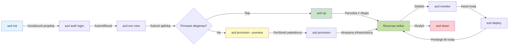
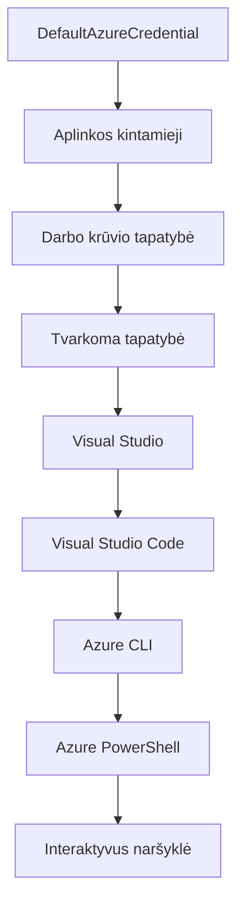

# AZD Pagrindai - Azure Developer CLI supratimas

# AZD Pagrindai - Pagrindinės sąvokos ir pagrindai

**Skyriaus navigacija:**
- **📚 Kurso pradžia**: [AZD pradedantiesiems](../../README.md)
- **📖 Dabartinis skyrius**: 1 skyrius - Pagrindai ir greitas startas
- **⬅️ Ankstesnis**: [Kurso apžvalga](../../README.md#-chapter-1-foundation--quick-start)
- **➡️ Kitas**: [Diegimas ir nustatymas](installation.md)
- **🚀 Kitas skyrius**: [2 skyrius: AI-pirmasis vystymas](../microsoft-foundry/microsoft-foundry-integration.md)

## Įvadas

Ši pamoka supažindins jus su Azure Developer CLI (azd), galingu komandų eilutės įrankiu, kuris pagreitina jūsų kelią nuo vietinio vystymo iki Azure diegimo. Sužinosite pagrindines sąvokas, pagrindines funkcijas ir kaip azd supaprastina debesų gimtųjų programų diegimą.

## Mokymosi tikslai

Šios pamokos pabaigoje jūs:
- Suprasite, kas yra Azure Developer CLI ir jo pagrindinę paskirtį
- Išmoksite pagrindines sąvokas apie šablonus, aplinkas ir paslaugas
- Susipažinsite su pagrindinėmis funkcijomis, įskaitant šablonais pagrįstą vystymą ir infrastruktūrą kaip kodą
- Suprasite azd projekto struktūrą ir darbo eigą
- Būsite pasiruošę įdiegti ir sukonfigūruoti azd savo vystymo aplinkoje

## Mokymosi rezultatai

Baigę šią pamoką, galėsite:
- Paaiškinti azd vaidmenį šiuolaikiniuose debesų vystymo darbo srautuose
- Atpažinti azd projekto struktūros komponentus
- Apibūdinti, kaip šablonai, aplinkos ir paslaugos veikia kartu
- Suprasti infrastruktūros kaip kodo privalumus naudojant azd
- Atpažinti skirtingas azd komandas ir jų paskirtis

## Kas yra Azure Developer CLI (azd)?

Azure Developer CLI (azd) yra komandų eilutės įrankis, sukurtas pagreitinti jūsų kelią nuo vietinio vystymo iki Azure diegimo. Jis supaprastina debesų gimtųjų programų kūrimo, diegimo ir valdymo procesą Azure platformoje.

### 🎯 Kodėl naudoti AZD? Palyginimas su realiu pasauliu

Palyginkime paprastos žiniatinklio programos su duomenų baze diegimą:

#### ❌ BE AZD: Rankinis Azure diegimas (30+ minučių)

```bash
# 1 žingsnis: Sukurti išteklių grupę
az group create --name myapp-rg --location eastus

# 2 žingsnis: Sukurti App Service planą
az appservice plan create --name myapp-plan \
  --resource-group myapp-rg \
  --sku B1 --is-linux

# 3 žingsnis: Sukurti internetinę programą
az webapp create --name myapp-web-unique123 \
  --resource-group myapp-rg \
  --plan myapp-plan \
  --runtime "NODE:18-lts"

# 4 žingsnis: Sukurti Cosmos DB paskyrą (10-15 minučių)
az cosmosdb create --name myapp-cosmos-unique123 \
  --resource-group myapp-rg \
  --kind MongoDB

# 5 žingsnis: Sukurti duomenų bazę
az cosmosdb mongodb database create \
  --account-name myapp-cosmos-unique123 \
  --resource-group myapp-rg \
  --name tododb

# 6 žingsnis: Sukurti kolekciją
az cosmosdb mongodb collection create \
  --account-name myapp-cosmos-unique123 \
  --resource-group myapp-rg \
  --database-name tododb \
  --name todos

# 7 žingsnis: Gauti prisijungimo eilutę
CONN_STR=$(az cosmosdb keys list \
  --name myapp-cosmos-unique123 \
  --resource-group myapp-rg \
  --type connection-strings \
  --query "connectionStrings[0].connectionString" -o tsv)

# 8 žingsnis: Konfigūruoti programos nustatymus
az webapp config appsettings set \
  --name myapp-web-unique123 \
  --resource-group myapp-rg \
  --settings MONGODB_URI="$CONN_STR"

# 9 žingsnis: Įjungti registravimą
az webapp log config --name myapp-web-unique123 \
  --resource-group myapp-rg \
  --application-logging filesystem \
  --detailed-error-messages true

# 10 žingsnis: Nustatyti Application Insights
az monitor app-insights component create \
  --app myapp-insights \
  --location eastus \
  --resource-group myapp-rg

# 11 žingsnis: Susieti App Insights su internetine programa
INSTRUMENTATION_KEY=$(az monitor app-insights component show \
  --app myapp-insights \
  --resource-group myapp-rg \
  --query "instrumentationKey" -o tsv)

az webapp config appsettings set \
  --name myapp-web-unique123 \
  --resource-group myapp-rg \
  --settings APPINSIGHTS_INSTRUMENTATIONKEY="$INSTRUMENTATION_KEY"

# 12 žingsnis: Sukurti programą vietoje
npm install
npm run build

# 13 žingsnis: Sukurti diegimo paketą
zip -r app.zip . -x "*.git*" "node_modules/*"

# 14 žingsnis: Diegti programą
az webapp deployment source config-zip \
  --resource-group myapp-rg \
  --name myapp-web-unique123 \
  --src app.zip

# 15 žingsnis: Palaukti ir tikėtis, kad veiks 🙏
# (Automatinės validacijos nėra, reikalingas rankinis testavimas)
```

**Problemos:**
- ❌ 15+ komandų, kurias reikia prisiminti ir vykdyti tam tikra tvarka
- ❌ 30-45 minutės rankinio darbo
- ❌ Lengva padaryti klaidų (rašybos klaidos, neteisingi parametrai)
- ❌ Ryšio eilutės matomos terminalo istorijoje
- ❌ Nėra automatinio atstatymo, jei kažkas nepavyksta
- ❌ Sunku pakartoti komandos nariams
- ❌ Kiekvieną kartą skiriasi (nepakartojama)

#### ✅ SU AZD: Automatinis diegimas (5 komandos, 10-15 minučių)

```bash
# 1 žingsnis: Inicializuoti iš šablono
azd init --template todo-nodejs-mongo

# 2 žingsnis: Autentifikuoti
azd auth login

# 3 žingsnis: Sukurti aplinką
azd env new dev

# 4 žingsnis: Peržiūrėti pakeitimus (neprivaloma, bet rekomenduojama)
azd provision --preview

# 5 žingsnis: Viską įdiegti
azd up

# ✨ Baigta! Viskas įdiegta, sukonfigūruota ir stebima
```

**Privalumai:**
- ✅ **5 komandos** vietoj 15+ rankinių veiksmų
- ✅ **10-15 minučių** bendras laikas (daugiausia laukimas Azure)
- ✅ **Nulis klaidų** - automatizuota ir išbandyta
- ✅ **Paslaptys saugiai valdomos** per Key Vault
- ✅ **Automatinis atstatymas** gedimų atveju
- ✅ **Visiškai pakartojama** - tas pats rezultatas kiekvieną kartą
- ✅ **Paruošta komandai** - bet kas gali diegti naudodamas tas pačias komandas
- ✅ **Infrastruktūra kaip kodas** - versijų valdomi Bicep šablonai
- ✅ **Įmontuotas stebėjimas** - automatiškai sukonfigūruotas Application Insights

### 📊 Laiko ir klaidų sumažinimas

| Metrika | Rankinis diegimas | AZD diegimas | Pagerėjimas |
|:-------|:------------------|:-------------|:------------|
| **Komandos** | 15+ | 5 | 67% mažiau |
| **Laikas** | 30-45 min | 10-15 min | 60% greičiau |
| **Klaidų dažnis** | ~40% | <5% | 88% mažiau |
| **Nuoseklumas** | Žemas (rankinis) | 100% (automatizuotas) | Tobulas |
| **Komandos įvedimas** | 2-4 valandos | 30 minučių | 75% greičiau |
| **Atstatymo laikas** | 30+ min (rankinis) | 2 min (automatizuotas) | 93% greičiau |

## Pagrindinės sąvokos

### Šablonai
Šablonai yra azd pagrindas. Jie apima:
- **Programos kodą** - Jūsų šaltinio kodą ir priklausomybes
- **Infrastruktūros apibrėžimus** - Azure išteklius, apibrėžtus Bicep arba Terraform
- **Konfigūracijos failus** - Nustatymus ir aplinkos kintamuosius
- **Diegimo scenarijus** - Automatizuotus diegimo darbo srautus

### Aplinkos
Aplinkos atspindi skirtingus diegimo tikslus:
- **Vystymas** - Testavimui ir vystymui
- **Staging** - Prieš gamybos aplinka
- **Gamyba** - Veikianti gamybos aplinka

Kiekviena aplinka turi savo:
- Azure išteklių grupę
- Konfigūracijos nustatymus
- Diegimo būseną

### Paslaugos
Paslaugos yra jūsų programos statybiniai blokai:
- **Frontend** - Žiniatinklio programos, SPAs
- **Backend** - API, mikropaslaugos
- **Duomenų bazė** - Duomenų saugojimo sprendimai
- **Saugykla** - Failų ir blob saugykla

## Pagrindinės funkcijos

### 1. Šablonais pagrįstas vystymas
```bash
# Naršyti galimus šablonus
azd template list

# Inicializuoti iš šablono
azd init --template <template-name>
```

### 2. Infrastruktūra kaip kodas
- **Bicep** - Azure specifinė kalba
- **Terraform** - Daugiafunkcinis infrastruktūros įrankis
- **ARM šablonai** - Azure Resource Manager šablonai

### 3. Integruoti darbo srautai
```bash
# Užbaigti diegimo darbo eigą
azd up            # Paruošimas + Diegimas tai automatinis pirmo nustatymo metu

# 🧪 NAUJA: Peržiūrėti infrastruktūros pakeitimus prieš diegimą (SAUGU)
azd provision --preview    # Simuliuoti infrastruktūros diegimą be pakeitimų

azd provision     # Sukurti Azure išteklius, jei atnaujinate infrastruktūrą, naudokite tai
azd deploy        # Diegti programos kodą arba iš naujo diegti programos kodą po atnaujinimo
azd down          # Išvalyti išteklius
```

#### 🛡️ Saugus infrastruktūros planavimas su peržiūra
Komanda `azd provision --preview` yra proveržis saugiems diegimams:
- **Sauso paleidimo analizė** - Parodo, kas bus sukurta, modifikuota ar ištrinta
- **Nulinė rizika** - Jokių realių pakeitimų Azure aplinkoje
- **Komandos bendradarbiavimas** - Dalinkitės peržiūros rezultatais prieš diegimą
- **Kainų įvertinimas** - Supraskite išteklių kainas prieš įsipareigojimą

```bash
# Pavyzdinė peržiūros darbo eiga
azd provision --preview           # Žiūrėkite, kas pasikeis
# Peržiūrėkite rezultatą, aptarkite su komanda
azd provision                     # Taikykite pakeitimus užtikrintai
```

### 📊 Vizualizacija: AZD vystymo darbo eiga


**Darbo eigos paaiškinimas:**
1. **Init** - Pradėkite nuo šablono arba naujo projekto
2. **Auth** - Autentifikuokitės su Azure
3. **Aplinka** - Sukurkite izoliuotą diegimo aplinką
4. **Peržiūra** - 🆕 Visada pirmiausia peržiūrėkite infrastruktūros pakeitimus (saugus praktika)
5. **Provision** - Sukurkite/atnaujinkite Azure išteklius
6. **Deploy** - Įkelkite savo programos kodą
7. **Monitor** - Stebėkite programos veikimą
8. **Iterate** - Darykite pakeitimus ir iš naujo diekite kodą
9. **Cleanup** - Pašalinkite išteklius, kai baigsite

### 4. Aplinkos valdymas
```bash
# Kurti ir valdyti aplinkas
azd env new <environment-name>
azd env select <environment-name>
azd env list
```

## 📁 Projekto struktūra

Tipinė azd projekto struktūra:
```
my-app/
├── .azd/                    # azd configuration
│   └── config.json
├── .azure/                  # Azure deployment artifacts
├── .devcontainer/          # Development container config
├── .github/workflows/      # GitHub Actions
├── .vscode/               # VS Code settings
├── infra/                 # Infrastructure code
│   ├── main.bicep        # Main infrastructure template
│   ├── main.parameters.json
│   └── modules/          # Reusable modules
├── src/                  # Application source code
│   ├── api/             # Backend services
│   └── web/             # Frontend application
├── azure.yaml           # azd project configuration
└── README.md
```

## 🔧 Konfigūracijos failai

### azure.yaml
Pagrindinis projekto konfigūracijos failas:
```yaml
name: my-awesome-app
metadata:
  template: my-template@1.0.0

services:
  web:
    project: ./src/web
    language: js
    host: appservice
  api:
    project: ./src/api
    language: js
    host: appservice

hooks:
  preprovision:
    shell: pwsh
    run: echo "Preparing to provision..."
```

### .azure/config.json
Aplinkai specifinė konfigūracija:
```json
{
  "version": 1,
  "defaultEnvironment": "dev",
  "environments": {
    "dev": {
      "subscriptionId": "your-subscription-id",
      "location": "eastus"
    }
  }
}
```

## 🎪 Dažni darbo srautai su praktiniais pratimais

> **💡 Mokymosi patarimas:** Sekite šiuos pratimus iš eilės, kad palaipsniui įgytumėte AZD įgūdžių.

### 🎯 Pratimas 1: Inicijuokite savo pirmąjį projektą

**Tikslas:** Sukurti AZD projektą ir ištirti jo struktūrą

**Žingsniai:**
```bash
# Naudokite patikrintą šabloną
azd init --template todo-nodejs-mongo

# Išnagrinėkite sugeneruotus failus
ls -la  # Peržiūrėkite visus failus, įskaitant paslėptus

# Sukurti pagrindiniai failai:
# - azure.yaml (pagrindinė konfigūracija)
# - infra/ (infrastruktūros kodas)
# - src/ (programos kodas)
```

**✅ Sėkmė:** Turite azure.yaml, infra/ ir src/ katalogus

---

### 🎯 Pratimas 2: Diegimas į Azure

**Tikslas:** Užbaigti pilną diegimą

**Žingsniai:**
```bash
# 1. Autentifikuoti
az login && azd auth login

# 2. Sukurti aplinką
azd env new dev
azd env set AZURE_LOCATION eastus

# 3. Peržiūrėti pakeitimus (REKOMENDUOJAMA)
azd provision --preview

# 4. Viską įdiegti
azd up

# 5. Patikrinti diegimą
azd show    # Peržiūrėti savo programos URL
```

**Numatomas laikas:** 10-15 minučių  
**✅ Sėkmė:** Programos URL atsidaro naršyklėje

---

### 🎯 Pratimas 3: Kelių aplinkų valdymas

**Tikslas:** Diegti į vystymo ir staging aplinkas

**Žingsniai:**
```bash
# Jau turime dev, sukurkite staging
azd env new staging
azd env set AZURE_LOCATION westus2
azd up

# Perjungti tarp jų
azd env list
azd env select dev
```

**✅ Sėkmė:** Dvi atskiros išteklių grupės Azure portale

---

### 🛡️ Švarus startas: `azd down --force --purge`

Kai reikia visiškai iš naujo pradėti:

```bash
azd down --force --purge
```

**Ką tai daro:**
- `--force`: Jokių patvirtinimo užklausų
- `--purge`: Ištrina visą vietinę būseną ir Azure išteklius

**Naudokite, kai:**
- Diegimas nepavyko viduryje
- Keičiate projektus
- Reikia švaraus starto

---

## 🎪 Originali darbo eigos nuoroda

### Naujo projekto pradžia
```bash
# Metodas 1: Naudoti esamą šabloną
azd init --template todo-nodejs-mongo

# Metodas 2: Pradėti nuo nulio
azd init

# Metodas 3: Naudoti dabartinį katalogą
azd init .
```

### Vystymo ciklas
```bash
# Nustatyti kūrimo aplinką
azd auth login
azd env new dev
azd env select dev

# Įdiegti viską
azd up

# Atlikti pakeitimus ir iš naujo įdiegti
azd deploy

# Išvalyti, kai baigta
azd down --force --purge # komanda Azure Developer CLI yra **griežtas atstatymas** jūsų aplinkai—ypač naudinga, kai sprendžiate nepavykusių diegimų problemas, valote našlaičių išteklius arba ruošiatės naujam diegimui.
```

## Supratimas apie `azd down --force --purge`
Komanda `azd down --force --purge` yra galingas būdas visiškai pašalinti jūsų azd aplinką ir visus susijusius išteklius. Štai ką daro kiekvienas parametras:
```
--force
```
- Praleidžia patvirtinimo užklausas.
- Naudinga automatizavimui ar scenarijams, kur rankinis įvedimas nėra įmanomas.
- Užtikrina, kad pašalinimas vyktų be pertraukų, net jei CLI aptinka nenuoseklumus.

```
--purge
```
Ištrina **visą susijusią metainformaciją**, įskaitant:
Aplinkos būseną
Vietinį `.azure` aplanką
Kešuotą diegimo informaciją
Neleidžia azd "prisiminti" ankstesnių diegimų, kurie gali sukelti problemų, pvz., nesutampančias išteklių grupes ar pasenusias registro nuorodas.

### Kodėl naudoti abu?
Kai susiduriate su problemomis naudojant `azd up` dėl likusios būsenos ar dalinių diegimų, šis derinys užtikrina **švarų startą**.

Tai ypač naudinga po rankinio išteklių pašalinimo Azure portale arba keičiant šablonus, aplinkas ar išteklių grupių pavadinimų konvencijas.

### Kelių aplinkų valdymas
```bash
# Sukurti paruošiamąją aplinką
azd env new staging
azd env select staging
azd up

# Grįžti į kūrimo aplinką
azd env select dev

# Palyginti aplinkas
azd env list
```

## 🔐 Autentifikacija ir kredencialai

Suprasti autentifikaciją yra labai svarbu sėkmingiems azd diegimams. Azure naudoja kelis autentifikacijos metodus, o azd naudoja tą pačią kredencialų grandinę, kurią naudoja kiti Azure įrankiai.

### Azure CLI autentifikacija (`az login`)

Prieš naudojant azd, reikia autentifikuotis su Azure. Dažniausias metodas yra naudojant Azure CLI:

```bash
# Interaktyvus prisijungimas (atidaro naršyklę)
az login

# Prisijungimas su konkrečiu nuomininku
az login --tenant <tenant-id>

# Prisijungimas su paslaugos principu
az login --service-principal -u <app-id> -p <password> --tenant <tenant-id>

# Patikrinti dabartinę prisijungimo būseną
az account show

# Išvardinti galimus prenumeratas
az account list --output table

# Nustatyti numatytąją prenumeratą
az account set --subscription <subscription-id>
```

### Autentifikacijos eiga
1. **Interaktyvus prisijungimas**: Atidaro jūsų numatytąją naršyklę autentifikacijai
2. **Įrenginio kodo eiga**: Aplinkoms be naršyklės prieigos
3. **Paslaugos pagrindinis**: Automatizavimui ir CI/CD scenarijams
4. **Valdomas identitetas**: Azure talpinamoms programoms

### DefaultAzureCredential grandinė

`DefaultAzureCredential` yra kredencialų tipas, kuris suteikia supaprastintą autentifikacijos patirtį automatiškai bandant kelis kredencialų šaltinius tam tikra tvarka:

#### Kredencialų grandinės tvarka

#### 1. Aplinkos kintamieji
```bash
# Nustatyti aplinkos kintamuosius paslaugų principui
export AZURE_CLIENT_ID="<app-id>"
export AZURE_CLIENT_SECRET="<password>"
export AZURE_TENANT_ID="<tenant-id>"
```

#### 2. Darbo krūvio identitetas (Kubernetes/GitHub Actions)
Naudojamas automatiškai:
- Azure Kubernetes Service (AKS) su darbo krūvio identitetu
- GitHub Actions su OIDC federacija
- Kitos federuoto identiteto scenarijai

#### 3. Valdomas identitetas
Azure ištekliams, pvz.:
- Virtualios mašinos
- App Service
- Azure Functions
- Container Instances

```bash
# Patikrinkite, ar vykdoma Azure ištekliuose su valdomu identitetu
az account show --query "user.type" --output tsv
# Grąžina: "servicePrincipal", jei naudojamas valdomas identitetas
```

#### 4. Kūrėjų įrankių integracija
- **Visual Studio**: Automatiškai naudoja prisijungusią paskyrą
- **VS Code**: Naudoja Azure Account plėtinio kredencialus
- **Azure CLI**: Naudoja `az login` kredencialus (dažniausiai naudojama vietiniam vystymui)

### AZD autentifikacijos nustatymas

```bash
# 1 metodas: Naudokite Azure CLI (rekomenduojama kūrimui)
az login
azd auth login  # Naudoja esamus Azure CLI prisijungimo duomenis

# 2 metodas: Tiesioginė azd autentifikacija
azd auth login --use-device-code  # Skirta aplinkoms be vartotojo sąsajos

# 3 metodas: Patikrinkite autentifikacijos būseną
azd auth login --check-status

# 4 metodas: Atsijunkite ir autentifikuokite iš naujo
azd auth logout
azd auth login
```

### Autentifikacijos geriausios praktikos

#### Vietiniam vystymui
```bash
# 1. Prisijunkite naudodami Azure CLI
az login

# 2. Patikrinkite teisingą prenumeratą
az account show
az account set --subscription "Your Subscription Name"

# 3. Naudokite azd su esamais kredencialais
azd auth login
```

#### CI/CD vamzdynams
```yaml
# GitHub Actions example
- name: Azure Login
  uses: azure/login@v1
  with:
    creds: ${{ secrets.AZURE_CREDENTIALS }}

- name: Deploy with azd
  run: |
    azd auth login --client-id ${{ secrets.AZURE_CLIENT_ID }} \
                    --client-secret ${{ secrets.AZURE_CLIENT_SECRET }} \
                    --tenant-id ${{ secrets.AZURE_TENANT_ID }}
    azd up --no-prompt
```

#### Gamybos aplinkoms
- Naudokite **valdomą identitetą**, kai veikia Azure ištekliai
- Naudokite **paslaugos pagrindinį** automatizavimo scenarijams
- Venkite saugoti kredencialus kode ar konfigūracijos failuose
- Naudokite **Azure Key Vault** jautriai konfigūracijai

### Dažnos autentifikacijos problemos ir sprendimai

#### Problema: "Nerasta prenumerata"
```bash
# Sprendimas: Nustatyti numatytą prenumeratą
az account list --output table
az account set --subscription "<subscription-id>"
azd env set AZURE_SUBSCRIPTION_ID "<subscription-id>"
```

#### Problema: "Nepakankamos teisės"
```bash
# Sprendimas: Patikrinti ir priskirti reikalingus vaidmenis
az role assignment list --assignee $(az account show --query user.name --output tsv)

# Bendri reikalingi vaidmenys:
# - Bendradarbis (išteklių valdymui)
# - Vartotojo prieigos administratorius (vaidmenų priskyrimui)
```

#### Problema: "Tokenas pasibaigęs"
```bash
# Sprendimas: Pakartotinai autentifikuoti
az logout
az login
azd auth logout
azd auth login
```

### Autentifikacija skirtinguose scenarijuose

#### Vietinis vystymas
```bash
# Asmeninio tobulėjimo sąskaita
az login
azd auth login
```

#### Komandos vystymas
```bash
# Naudokite konkretų nuomininką organizacijai
az login --tenant contoso.onmicrosoft.com
azd auth login
```

#### Daugiafunkciniai scenarijai
```bash
# Perjungti tarp nuomininkų
az login --tenant tenant1.onmicrosoft.com
# Diegti į nuomininką 1
azd up

az login --tenant tenant2.onmicrosoft.com  
# Diegti į nuomininką 2
azd up
```

### Saugumo svarstymai

1. **Kredencialų saugojimas**: Niekada nesaugokite kredencialų šaltinio kode
2. **Apribojimų apimtis**: Naudokite mažiausio privilegijų principą paslaugos pagrindiniams
3. **Tokenų rotacija**: Reguliariai keiskite paslaugos pagrindinių paslaptis
4. **Audito pėdsakas**: Stebėkite autentifikacijos ir diegimo veiklas
5. **Tinklo saugumas**: Naudokite privačius galinius taškus, kai įmanoma

### Autentifikacijos trikčių šalinimas

```bash
# Derinti autentifikacijos problemas
azd auth login --check-status
az account show
az account get-access-token

# Dažni diagnostikos komandos
whoami                          # Dabartinis vartotojo kontekstas
az ad signed-in-user show      # Azure AD vartotojo informacija
az group list                  # Išbandyti išteklių prieigą
```

## Supratimas apie `azd down --force --purge`

### Atradimas
```bash
azd template list              # Naršyti šablonus
azd template show <template>   # Šablono detalės
azd init --help               # Inicijavimo parinktys
```

### Projekto valdymas
```bash
azd show                     # Projekto apžvalga
azd env show                 # Dabartinė aplinka
azd config list             # Konfigūracijos nustatymai
```

### Stebėjimas
```bash
azd monitor                  # Atidarykite Azure portalą
azd pipeline config          # Nustatykite CI/CD
azd logs                     # Peržiūrėkite programos žurnalus
```

## Geriausios praktikos

### 1. Naudokite prasmingus pavadinimus
```bash
# Gerai
azd env new production-east
azd init --template web-app-secure

# Venkite
azd env new env1
azd init --template template1
```

### 2. Pasinaudokite šablonais
- Pradėkite nuo esamų šablonų
- Pritaikykite savo poreikiams
- Kurkite pakartotinai naudojamus šablonus savo organizacijai

### 3. Aplinkos izoliacija
- Naudokite atskiras aplinkas vystymui/staging/gamybai
- Niek
- [Įdiegimas ir nustatymas](installation.md) - Įdiekite ir sukonfigūruokite azd
- [Jūsų pirmasis projektas](first-project.md) - Praktinis vadovas
- [Konfigūracijos vadovas](configuration.md) - Išplėstinės konfigūracijos parinktys

**🎯 Pasiruošę kitam skyriui?**
- [2 skyrius: AI-pirmasis kūrimas](../microsoft-foundry/microsoft-foundry-integration.md) - Pradėkite kurti AI programas

## Papildomi ištekliai

- [Azure Developer CLI apžvalga](https://learn.microsoft.com/en-us/azure/developer/azure-developer-cli/)
- [Šablonų galerija](https://azure.github.io/awesome-azd/)
- [Bendruomenės pavyzdžiai](https://github.com/Azure-Samples)

---

## 🙋 Dažniausiai užduodami klausimai

### Bendrieji klausimai

**K: Kuo skiriasi AZD ir Azure CLI?**

A: Azure CLI (`az`) skirtas valdyti atskirus Azure išteklius. AZD (`azd`) skirtas valdyti visą programą:

```bash
# Azure CLI - Žemo lygio išteklių valdymas
az webapp create --name myapp --resource-group rg
az sql server create --name myserver --resource-group rg
# ...reikia daug daugiau komandų

# AZD - Programos lygio valdymas
azd up  # Diegia visą programą su visais ištekliais
```

**Pagalvokite taip:**
- `az` = Darbas su atskirais Lego kaladėlėmis
- `azd` = Darbas su pilnais Lego rinkiniais

---

**K: Ar man reikia žinoti Bicep ar Terraform, kad galėčiau naudoti AZD?**

A: Ne! Pradėkite nuo šablonų:
```bash
# Naudokite esamą šabloną - nereikia IaC žinių
azd init --template todo-nodejs-mongo
azd up
```

Vėliau galite išmokti Bicep, kad pritaikytumėte infrastruktūrą. Šablonai suteikia veikiančius pavyzdžius, iš kurių galima mokytis.

---

**K: Kiek kainuoja AZD šablonų naudojimas?**

A: Kainos priklauso nuo šablono. Dauguma kūrimo šablonų kainuoja $50-150/mėn.:

```bash
# Peržiūrėkite išlaidas prieš diegdami
azd provision --preview

# Visada išvalykite, kai nenaudojate
azd down --force --purge  # Pašalina visus išteklius
```

**Naudinga patarimas:** Naudokite nemokamus lygius, kur jie yra:
- App Service: F1 (nemokamas) lygis
- Azure OpenAI: 50,000 žetonų/mėn. nemokamai
- Cosmos DB: 1000 RU/s nemokamas lygis

---

**K: Ar galiu naudoti AZD su esamais Azure ištekliais?**

A: Taip, bet lengviau pradėti nuo nulio. AZD geriausiai veikia, kai valdo visą gyvavimo ciklą. Esamiems ištekliams:

```bash
# 1 variantas: Importuoti esamus išteklius (pažengusiems)
azd init
# Tada pakeiskite infra/, kad nurodytumėte esamus išteklius

# 2 variantas: Pradėti nuo nulio (rekomenduojama)
azd init --template matching-your-stack
azd up  # Sukuria naują aplinką
```

---

**K: Kaip pasidalinti savo projektu su komandos nariais?**

A: Įkelkite AZD projektą į Git (bet NE .azure aplanką):

```bash
# Jau yra .gitignore pagal numatytuosius nustatymus
.azure/        # Sudėtyje yra paslapčių ir aplinkos duomenų
*.env          # Aplinkos kintamieji

# Komandos nariai tada:
git clone <your-repo>
azd auth login
azd env new <their-name>-dev
azd up
```

Visi gauna identišką infrastruktūrą iš tų pačių šablonų.

---

### Trikčių šalinimo klausimai

**K: "azd up" nepavyko pabaigti. Ką daryti?**

A: Patikrinkite klaidą, ištaisykite ją, tada bandykite iš naujo:

```bash
# Peržiūrėti išsamius žurnalus
azd show

# Dažniausi pataisymai:

# 1. Jei viršyta kvota:
azd env set AZURE_LOCATION "westus2"  # Pabandykite kitą regioną

# 2. Jei išteklių pavadinimų konfliktas:
azd down --force --purge  # Pradėkite nuo švaraus lapo
azd up  # Bandykite dar kartą

# 3. Jei autentifikacija pasibaigė:
az login
azd auth login
azd up
```

**Dažniausia problema:** Pasirinktas neteisingas Azure prenumeratos planas
```bash
az account list --output table
az account set --subscription "<correct-subscription>"
```

---

**K: Kaip įdiegti tik kodo pakeitimus be infrastruktūros atnaujinimo?**

A: Naudokite `azd deploy` vietoj `azd up`:

```bash
azd up          # Pirmą kartą: paruošimas + diegimas (lėtas)

# Atlikite kodo pakeitimus...

azd deploy      # Vėlesniais kartais: tik diegimas (greitas)
```

Greitumo palyginimas:
- `azd up`: 10-15 minučių (infrastruktūros paruošimas)
- `azd deploy`: 2-5 minutės (tik kodas)

---

**K: Ar galiu pritaikyti infrastruktūros šablonus?**

A: Taip! Redaguokite Bicep failus aplanke `infra/`:

```bash
# Po azd init
cd infra/
code main.bicep  # Redaguoti VS Code

# Peržiūrėti pakeitimus
azd provision --preview

# Taikyti pakeitimus
azd provision
```

**Patarimas:** Pradėkite nuo mažų pakeitimų - keiskite SKUs:
```bicep
// infra/main.bicep
sku: {
  name: 'B1'  // Change to 'P1V2' for production
}
```

---

**K: Kaip ištrinti viską, ką sukūrė AZD?**

A: Viena komanda pašalina visus išteklius:

```bash
azd down --force --purge

# Tai ištrina:
# - Visus Azure išteklius
# - Išteklių grupę
# - Vietinės aplinkos būseną
# - Talpykloje saugomus diegimo duomenis
```

**Visada vykdykite tai, kai:**
- Baigėte testuoti šabloną
- Pereinate prie kito projekto
- Norite pradėti iš naujo

**Kainų taupymas:** Ištrynus nenaudojamus išteklius = $0 mokesčiai

---

**K: Ką daryti, jei netyčia ištryniau išteklius Azure portale?**

A: AZD būsena gali nesutapti. Pradėkite nuo švaraus lapo:

```bash
# 1. Pašalinti vietinę būseną
azd down --force --purge

# 2. Pradėti iš naujo
azd up

# Alternatyva: Leisti AZD aptikti ir pataisyti
azd provision  # Sukurs trūkstamus išteklius
```

---

### Išplėstiniai klausimai

**K: Ar galiu naudoti AZD CI/CD procesuose?**

A: Taip! GitHub Actions pavyzdys:

```yaml
# .github/workflows/deploy.yml
name: Deploy with AZD

on:
  push:
    branches: [main]

jobs:
  deploy:
    runs-on: ubuntu-latest
    steps:
      - uses: actions/checkout@v2
      
      - name: Install azd
        run: curl -fsSL https://aka.ms/install-azd.sh | bash
      
      - name: Azure Login
        run: |
          azd auth login \
            --client-id ${{ secrets.AZURE_CLIENT_ID }} \
            --client-secret ${{ secrets.AZURE_CLIENT_SECRET }} \
            --tenant-id ${{ secrets.AZURE_TENANT_ID }}
      
      - name: Deploy
        run: azd up --no-prompt
```

---

**K: Kaip tvarkyti slaptažodžius ir jautrią informaciją?**

A: AZD automatiškai integruojasi su Azure Key Vault:

```bash
# Paslaptys saugomos Key Vault, o ne kode
azd env set DATABASE_PASSWORD "$(openssl rand -base64 32)"

# AZD automatiškai:
# 1. Sukuria Key Vault
# 2. Saugo paslaptį
# 3. Suteikia programai prieigą per valdomą tapatybę
# 4. Įterpia vykdymo metu
```

**Niekada neįkelkite:**
- `.azure/` aplanko (yra aplinkos duomenys)
- `.env` failų (vietiniai slaptažodžiai)
- Prisijungimo eilutės

---

**K: Ar galiu diegti į kelis regionus?**

A: Taip, sukurkite aplinką kiekvienam regionui:

```bash
# Rytų JAV aplinka
azd env new prod-eastus
azd env set AZURE_LOCATION eastus
azd up

# Vakarų Europos aplinka
azd env new prod-westeurope
azd env set AZURE_LOCATION westeurope
azd up

# Kiekviena aplinka yra nepriklausoma
azd env list
```

Tikriems daugiaregioniams programoms pritaikykite Bicep šablonus, kad diegtumėte į kelis regionus vienu metu.

---

**K: Kur galiu gauti pagalbos, jei susiduriu su sunkumais?**

1. **AZD dokumentacija:** https://learn.microsoft.com/azure/developer/azure-developer-cli/
2. **GitHub problemos:** https://github.com/Azure/azure-dev/issues
3. **Discord:** [Azure Discord](https://discord.gg/microsoft-azure) - #azure-developer-cli kanalas
4. **Stack Overflow:** Žyma `azure-developer-cli`
5. **Šis kursas:** [Trikčių šalinimo vadovas](../troubleshooting/common-issues.md)

**Naudinga patarimas:** Prieš klausdami, vykdykite:
```bash
azd show       # Rodo dabartinę būseną
azd version    # Rodo jūsų versiją
```
Įtraukite šią informaciją į savo klausimą, kad gautumėte greitesnę pagalbą.

---

## 🎓 Kas toliau?

Dabar suprantate AZD pagrindus. Pasirinkite savo kelią:

### 🎯 Pradedantiesiems:
1. **Toliau:** [Įdiegimas ir nustatymas](installation.md) - Įdiekite AZD savo kompiuteryje
2. **Tada:** [Jūsų pirmasis projektas](first-project.md) - Įdiekite savo pirmąją programą
3. **Praktika:** Atlikite visus 3 pratimus šiame skyriuje

### 🚀 AI kūrėjams:
1. **Praleiskite į:** [2 skyrius: AI-pirmasis kūrimas](../microsoft-foundry/microsoft-foundry-integration.md)
2. **Diegimas:** Pradėkite su `azd init --template get-started-with-ai-chat`
3. **Mokymasis:** Kurkite, kol diegiate

### 🏗️ Patyrusiems kūrėjams:
1. **Peržiūra:** [Konfigūracijos vadovas](configuration.md) - Išplėstiniai nustatymai
2. **Tyrinėjimas:** [Infrastruktūra kaip kodas](../deployment/provisioning.md) - Bicep giluminė analizė
3. **Kūrimas:** Sukurkite savo šablonus savo technologijų rinkiniui

---

**Skyriaus navigacija:**
- **📚 Kurso pradžia**: [AZD pradedantiesiems](../../README.md)
- **📖 Dabartinis skyrius**: 1 skyrius - Pagrindai ir greitas startas  
- **⬅️ Ankstesnis**: [Kurso apžvalga](../../README.md#-chapter-1-foundation--quick-start)
- **➡️ Toliau**: [Įdiegimas ir nustatymas](installation.md)
- **🚀 Kitas skyrius**: [2 skyrius: AI-pirmasis kūrimas](../microsoft-foundry/microsoft-foundry-integration.md)

---

<!-- CO-OP TRANSLATOR DISCLAIMER START -->
**Atsakomybės apribojimas**:  
Šis dokumentas buvo išverstas naudojant AI vertimo paslaugą [Co-op Translator](https://github.com/Azure/co-op-translator). Nors stengiamės užtikrinti tikslumą, prašome atkreipti dėmesį, kad automatiniai vertimai gali turėti klaidų ar netikslumų. Originalus dokumentas jo gimtąja kalba turėtų būti laikomas autoritetingu šaltiniu. Dėl svarbios informacijos rekomenduojama profesionali žmogaus vertimo paslauga. Mes neprisiimame atsakomybės už nesusipratimus ar neteisingus aiškinimus, atsiradusius naudojant šį vertimą.
<!-- CO-OP TRANSLATOR DISCLAIMER END -->