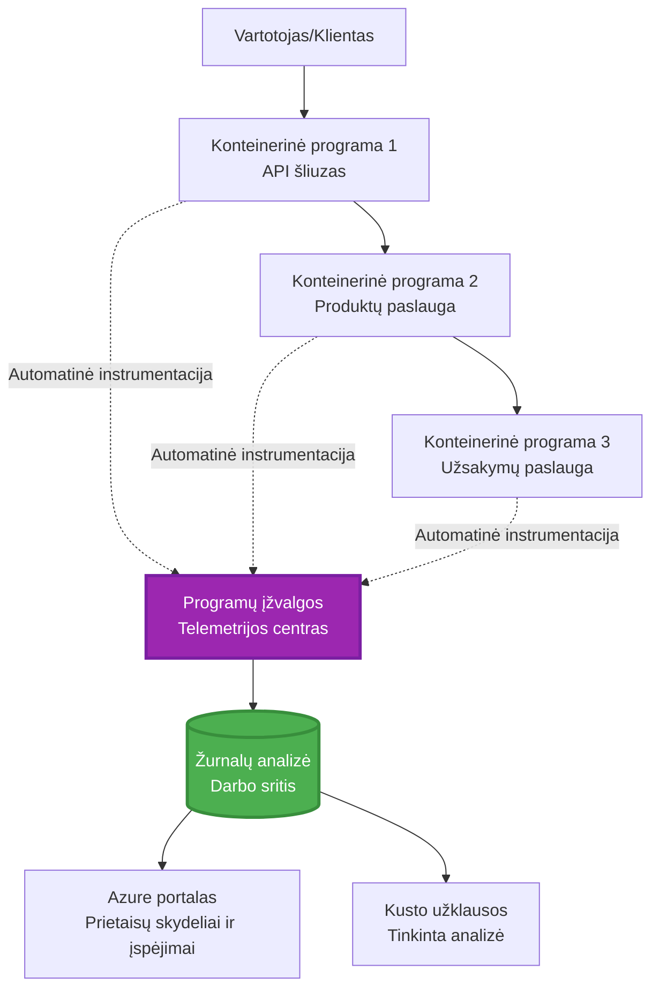
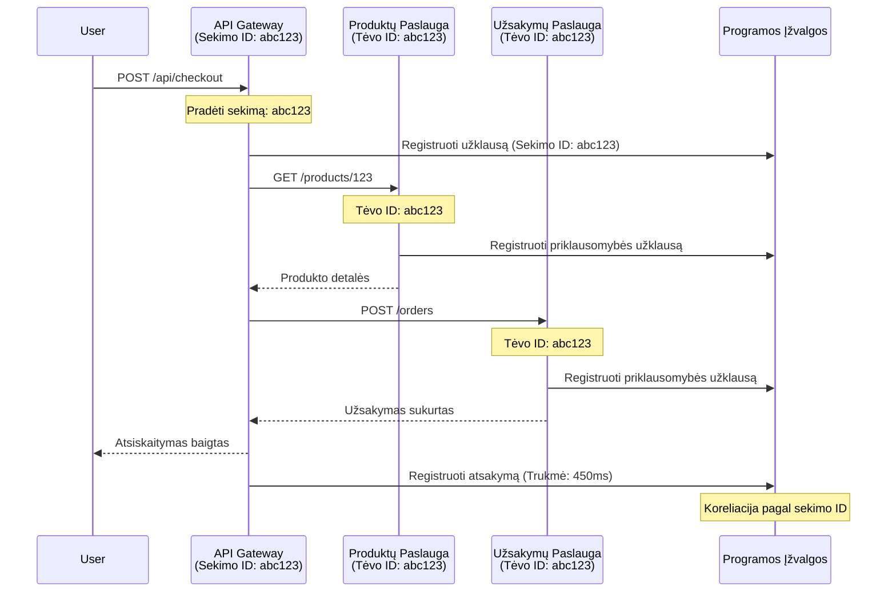

<!--
CO_OP_TRANSLATOR_METADATA:
{
  "original_hash": "e5aa37cdb6378c09099500ac31600b8c",
  "translation_date": "2025-11-24T10:27:23+00:00",
  "source_file": "docs/pre-deployment/application-insights.md",
  "language_code": "lt"
}
-->
# Application Insights integracija su AZD

⏱️ **Numatomas laikas**: 40-50 minučių | 💰 **Kainos poveikis**: ~5-15 $/mėn. | ⭐ **Sudėtingumas**: Vidutinis

**📚 Mokymosi kelias:**
- ← Ankstesnis: [Preflight Checks](preflight-checks.md) - Prieš diegimą atliekama patikra
- 🎯 **Jūs esate čia**: Application Insights integracija (stebėjimas, telemetrija, derinimas)
- → Kitas: [Diegimo vadovas](../deployment/deployment-guide.md) - Diegimas į Azure
- 🏠 [Kurso pradžia](../../README.md)

---

## Ką išmoksite

Baigę šią pamoką, jūs:
- Automatiškai integruosite **Application Insights** į AZD projektus
- Suaktyvinsite **paskirstytą sekimą** mikroservisams
- Įgyvendinsite **individualią telemetriją** (metrikos, įvykiai, priklausomybės)
- Nustatysite **tiesiogines metrikas** realaus laiko stebėjimui
- Sukursite **įspėjimus ir prietaisų skydelius** iš AZD diegimų
- Derinsite gamybos problemas naudodami **telemetrijos užklausas**
- Optimizuosite **kaštus ir mėginių ėmimo strategijas**
- Stebėsite **AI/LLM programas** (žetonus, vėlavimą, kaštus)

## Kodėl svarbu naudoti Application Insights su AZD

### Iššūkis: Gamybos stebimumas

**Be Application Insights:**
```
❌ No visibility into production behavior
❌ Manual log aggregation across services
❌ Reactive debugging (wait for customer complaints)
❌ No performance metrics
❌ Cannot trace requests across services
❌ Unknown failure rates and bottlenecks
```

**Su Application Insights + AZD:**
```
✅ Automatic telemetry collection
✅ Centralized logs from all services
✅ Proactive issue detection
✅ End-to-end request tracing
✅ Performance metrics and insights
✅ Real-time dashboards
✅ AZD provisions everything automatically
```

**Analogiškai**: Application Insights yra tarsi „juodoji dėžė“ lėktuvui ir valdymo pultas jūsų programai. Matote viską, kas vyksta realiu laiku, ir galite atkurti bet kokį incidentą.

---

## Architektūros apžvalga

### Application Insights AZD architektūroje


### Kas stebima automatiškai

| Telemetrijos tipas | Ką fiksuoja | Naudojimo atvejis |
|--------------------|-------------|-------------------|
| **Užklausos** | HTTP užklausos, būsenos kodai, trukmė | API našumo stebėjimas |
| **Priklausomybės** | Išoriniai skambučiai (DB, API, saugykla) | Butelio kakliukų identifikavimas |
| **Išimtys** | Neapdorotos klaidos su steko pėdsakais | Klaidos derinimas |
| **Individualūs įvykiai** | Verslo įvykiai (registracija, pirkimas) | Analitika ir piltuvėliai |
| **Metrikos** | Našumo skaitikliai, individualios metrikos | Talpos planavimas |
| **Sekos** | Žurnalo pranešimai su svarba | Derinimas ir auditas |
| **Prieinamumas** | Veikimo laiko ir atsako laiko testai | SLA stebėjimas |

---

## Reikalavimai

### Reikalingi įrankiai

```bash
# Patikrinkite Azure Developer CLI
azd version
# ✅ Tikėtasi: azd versija 1.0.0 arba naujesnė

# Patikrinkite Azure CLI
az --version
# ✅ Tikėtasi: azure-cli 2.50.0 arba naujesnė
```

### Azure reikalavimai

- Aktyvi Azure prenumerata
- Leidimai sukurti:
  - Application Insights resursus
  - Log Analytics darbo sritis
  - Container Apps
  - Išteklių grupes

### Žinių reikalavimai

Turėtumėte būti baigę:
- [AZD pagrindai](../getting-started/azd-basics.md) - Pagrindinės AZD sąvokos
- [Konfigūracija](../getting-started/configuration.md) - Aplinkos nustatymas
- [Pirmasis projektas](../getting-started/first-project.md) - Pagrindinis diegimas

---

## Pamoka 1: Automatinis Application Insights su AZD

### Kaip AZD sukuria Application Insights

AZD automatiškai sukuria ir konfigūruoja Application Insights, kai diegiate. Pažiūrėkime, kaip tai veikia.

### Projekto struktūra

```
monitored-app/
├── azure.yaml                     # AZD configuration
├── infra/
│   ├── main.bicep                # Main infrastructure
│   ├── core/
│   │   └── monitoring.bicep      # Application Insights + Log Analytics
│   └── app/
│       └── api.bicep             # Container App with monitoring
└── src/
    ├── app.py                    # Application with telemetry
    ├── requirements.txt
    └── Dockerfile
```

---

### 1 žingsnis: Konfigūruokite AZD (azure.yaml)

**Failas: `azure.yaml`**

```yaml
name: monitored-app
metadata:
  template: monitored-app@1.0.0

services:
  api:
    project: ./src
    language: python
    host: containerapp

# AZD automatically provisions monitoring!
```

**Viskas!** AZD pagal numatytuosius nustatymus sukurs Application Insights. Papildomos konfigūracijos nereikia baziniam stebėjimui.

---

### 2 žingsnis: Stebėjimo infrastruktūra (Bicep)

**Failas: `infra/core/monitoring.bicep`**

```bicep
param logAnalyticsName string
param applicationInsightsName string
param location string = resourceGroup().location
param tags object = {}

// Log Analytics Workspace (required for Application Insights)
resource logAnalytics 'Microsoft.OperationalInsights/workspaces@2022-10-01' = {
  name: logAnalyticsName
  location: location
  tags: tags
  properties: {
    sku: {
      name: 'PerGB2018'  // Pay-as-you-go pricing
    }
    retentionInDays: 30  // Keep logs for 30 days
    features: {
      enableLogAccessUsingOnlyResourcePermissions: true
    }
  }
}

// Application Insights
resource applicationInsights 'Microsoft.Insights/components@2020-02-02' = {
  name: applicationInsightsName
  location: location
  tags: tags
  kind: 'web'
  properties: {
    Application_Type: 'web'
    WorkspaceResourceId: logAnalytics.id
    IngestionMode: 'LogAnalytics'
    publicNetworkAccessForIngestion: 'Enabled'
    publicNetworkAccessForQuery: 'Enabled'
  }
}

// Outputs for Container Apps
output logAnalyticsWorkspaceId string = logAnalytics.id
output logAnalyticsWorkspaceName string = logAnalytics.name
output applicationInsightsConnectionString string = applicationInsights.properties.ConnectionString
output applicationInsightsInstrumentationKey string = applicationInsights.properties.InstrumentationKey
output applicationInsightsName string = applicationInsights.name
```

---

### 3 žingsnis: Prijunkite Container App prie Application Insights

**Failas: `infra/app/api.bicep`**

```bicep
param name string
param location string
param tags object = {}
param containerAppsEnvironmentName string
param applicationInsightsConnectionString string

resource containerApp 'Microsoft.App/containerApps@2023-05-01' = {
  name: name
  location: location
  tags: tags
  properties: {
    configuration: {
      ingress: {
        external: true
        targetPort: 8000
      }
      secrets: [
        {
          name: 'appinsights-connection-string'
          value: applicationInsightsConnectionString
        }
      ]
    }
    template: {
      containers: [
        {
          name: 'api'
          image: 'myregistry.azurecr.io/api:latest'
          resources: {
            cpu: json('0.5')
            memory: '1Gi'
          }
          env: [
            {
              name: 'APPLICATIONINSIGHTS_CONNECTION_STRING'
              secretRef: 'appinsights-connection-string'
            }
            {
              name: 'APPLICATIONINSIGHTS_ENABLED'
              value: 'true'
            }
          ]
        }
      ]
    }
  }
}

output uri string = 'https://${containerApp.properties.configuration.ingress.fqdn}'
```

---

### 4 žingsnis: Programos kodas su telemetrija

**Failas: `src/app.py`**

```python
from flask import Flask, request, jsonify
from opencensus.ext.azure.log_exporter import AzureLogHandler
from opencensus.ext.azure.trace_exporter import AzureExporter
from opencensus.ext.flask.flask_middleware import FlaskMiddleware
from opencensus.trace.samplers import ProbabilitySampler
import logging
import os

app = Flask(__name__)

# Gauti „Application Insights“ prisijungimo eilutę
connection_string = os.environ.get('APPLICATIONINSIGHTS_CONNECTION_STRING')

if connection_string:
    # Konfigūruoti paskirstytą sekimą
    middleware = FlaskMiddleware(
        app,
        exporter=AzureExporter(connection_string=connection_string),
        sampler=ProbabilitySampler(rate=1.0)  # 100% mėginių ėmimas kūrimo aplinkoje
    )
    
    # Konfigūruoti registravimą
    logger = logging.getLogger(__name__)
    logger.addHandler(AzureLogHandler(connection_string=connection_string))
    logger.setLevel(logging.INFO)
    
    print("✅ Application Insights enabled")
else:
    logger = logging.getLogger(__name__)
    logger.setLevel(logging.INFO)
    print("⚠️ Application Insights not configured")

@app.route('/health')
def health():
    logger.info('Health check endpoint called')
    return jsonify({'status': 'healthy', 'monitoring': 'enabled'})

@app.route('/api/products')
def get_products():
    logger.info('Fetching products')
    
    # Simuliuoti duomenų bazės užklausą (automatiškai sekama kaip priklausomybė)
    products = [
        {'id': 1, 'name': 'Laptop', 'price': 999.99},
        {'id': 2, 'name': 'Mouse', 'price': 29.99},
        {'id': 3, 'name': 'Keyboard', 'price': 79.99}
    ]
    
    logger.info(f'Returned {len(products)} products')
    return jsonify(products)

@app.route('/api/error-test')
def error_test():
    """Test error tracking"""
    logger.error('Testing error tracking')
    try:
        raise ValueError('This is a test exception')
    except Exception as e:
        logger.exception('Exception occurred in error-test endpoint')
        return jsonify({'error': str(e)}), 500

@app.route('/api/slow')
def slow_endpoint():
    """Test performance tracking"""
    import time
    logger.info('Slow endpoint called')
    time.sleep(3)  # Simuliuoti lėtą operaciją
    logger.warning('Endpoint took 3 seconds to respond')
    return jsonify({'message': 'Slow operation completed'})

if __name__ == '__main__':
    app.run(host='0.0.0.0', port=8000)
```

**Failas: `src/requirements.txt`**

```txt
Flask==3.0.0
opencensus-ext-azure==1.1.13
opencensus-ext-flask==0.8.1
gunicorn==21.2.0
```

---

### 5 žingsnis: Diegimas ir patikrinimas

```bash
# Inicializuoti AZD
azd init

# Diegti (automatiškai parūpina Application Insights)
azd up

# Gauti programos URL
APP_URL=$(azd env get-values | grep API_URL | cut -d '=' -f2 | tr -d '"')

# Generuoti telemetriją
curl $APP_URL/health
curl $APP_URL/api/products
curl $APP_URL/api/error-test
curl $APP_URL/api/slow
```

**✅ Tikėtinas rezultatas:**
```json
{
  "status": "healthy",
  "monitoring": "enabled"
}
```

---

### 6 žingsnis: Telemetrijos peržiūra Azure portale

```bash
# Gauti „Application Insights“ informaciją
azd env get-values | grep APPLICATIONINSIGHTS

# Atidaryti „Azure Portal“
az monitor app-insights component show \
  --app $(azd env get-values | grep APPLICATIONINSIGHTS_NAME | cut -d '=' -f2 | tr -d '"') \
  --resource-group $(azd env get-values | grep AZURE_RESOURCE_GROUP | cut -d '=' -f2 | tr -d '"') \
  --query "appId" -o tsv
```

**Eikite į Azure Portal → Application Insights → Transaction Search**

Turėtumėte matyti:
- ✅ HTTP užklausas su būsenos kodais
- ✅ Užklausų trukmę (3+ sekundės `/api/slow`)
- ✅ Išimčių detales iš `/api/error-test`
- ✅ Individualius žurnalo pranešimus

---

## Pamoka 2: Individuali telemetrija ir įvykiai

### Verslo įvykių sekimas

Pridėkime individualią telemetriją verslui svarbiems įvykiams.

**Failas: `src/telemetry.py`**

```python
from opencensus.ext.azure import metrics_exporter
from opencensus.stats import aggregation as aggregation_module
from opencensus.stats import measure as measure_module
from opencensus.stats import stats as stats_module
from opencensus.stats import view as view_module
from opencensus.tags import tag_map as tag_map_module
from opencensus.ext.azure.log_exporter import AzureLogHandler
from opencensus.ext.azure.trace_exporter import AzureExporter
from opencensus.trace import tracer as tracer_module
import logging
import os

class TelemetryClient:
    """Custom telemetry client for Application Insights"""
    
    def __init__(self, connection_string=None):
        self.connection_string = connection_string or os.environ.get('APPLICATIONINSIGHTS_CONNECTION_STRING')
        
        if not self.connection_string:
            print("⚠️ Application Insights connection string not found")
            return
        
        # Nustatyti registratorių
        self.logger = logging.getLogger(__name__)
        self.logger.addHandler(AzureLogHandler(connection_string=self.connection_string))
        self.logger.setLevel(logging.INFO)
        
        # Nustatyti metrikų eksportuotoją
        self.stats = stats_module.stats
        self.view_manager = self.stats.view_manager
        self.stats_recorder = self.stats.stats_recorder
        
        exporter = metrics_exporter.new_metrics_exporter(
            connection_string=self.connection_string
        )
        self.view_manager.register_exporter(exporter)
        
        # Nustatyti sekiklį
        self.tracer = tracer_module.Tracer(
            exporter=AzureExporter(connection_string=self.connection_string)
        )
        
        print("✅ Custom telemetry client initialized")
    
    def track_event(self, event_name: str, properties: dict = None):
        """Track custom business event"""
        properties = properties or {}
        self.logger.info(
            f"CustomEvent: {event_name}",
            extra={
                'custom_dimensions': {
                    'event_name': event_name,
                    **properties
                }
            }
        )
    
    def track_metric(self, metric_name: str, value: float, properties: dict = None):
        """Track custom metric"""
        properties = properties or {}
        self.logger.info(
            f"CustomMetric: {metric_name} = {value}",
            extra={
                'custom_dimensions': {
                    'metric_name': metric_name,
                    'value': value,
                    **properties
                }
            }
        )
    
    def track_dependency(self, name: str, dependency_type: str, duration: float, success: bool):
        """Track external dependency call"""
        with self.tracer.span(name=name) as span:
            span.add_attribute('dependency.type', dependency_type)
            span.add_attribute('duration', duration)
            span.add_attribute('success', success)

# Globalus telemetrijos klientas
telemetry = TelemetryClient()
```

### Atnaujinkite programą su individualiais įvykiais

**Failas: `src/app.py` (patobulintas)**

```python
from flask import Flask, request, jsonify
from telemetry import telemetry
import time
import random

app = Flask(__name__)

@app.route('/api/purchase', methods=['POST'])
def purchase():
    """Track purchase event with custom telemetry"""
    data = request.json
    product_id = data.get('product_id')
    quantity = data.get('quantity', 1)
    price = data.get('price', 0)
    
    # Sekti verslo įvykį
    telemetry.track_event('Purchase', {
        'product_id': product_id,
        'quantity': quantity,
        'total_amount': price * quantity,
        'user_id': request.headers.get('X-User-Id', 'anonymous')
    })
    
    # Sekti pajamų metriką
    telemetry.track_metric('Revenue', price * quantity, {
        'product_id': product_id,
        'currency': 'USD'
    })
    
    return jsonify({
        'order_id': f'ORD-{random.randint(1000, 9999)}',
        'status': 'confirmed',
        'total': price * quantity
    })

@app.route('/api/search')
def search():
    """Track search queries"""
    query = request.args.get('q', '')
    
    start_time = time.time()
    
    # Simuliuoti paiešką (būtų tikras duomenų bazės užklausa)
    results = [{'id': 1, 'name': f'Result for {query}'}]
    
    duration = (time.time() - start_time) * 1000  # Konvertuoti į ms
    
    # Sekti paieškos įvykį
    telemetry.track_event('Search', {
        'query': query,
        'results_count': len(results),
        'duration_ms': duration
    })
    
    # Sekti paieškos našumo metriką
    telemetry.track_metric('SearchDuration', duration, {
        'query_length': len(query)
    })
    
    return jsonify({'results': results, 'count': len(results)})

@app.route('/api/external-call')
def external_call():
    """Track external API dependency"""
    import requests
    
    start_time = time.time()
    success = True
    
    try:
        # Simuliuoti išorinį API skambutį
        response = requests.get('https://api.example.com/data', timeout=5)
        result = response.json()
    except Exception as e:
        success = False
        result = {'error': str(e)}
    
    duration = (time.time() - start_time) * 1000
    
    # Sekti priklausomybę
    telemetry.track_dependency(
        name='ExternalAPI',
        dependency_type='HTTP',
        duration=duration,
        success=success
    )
    
    return jsonify(result)

if __name__ == '__main__':
    app.run(host='0.0.0.0', port=8000)
```

### Testuokite individualią telemetriją

```bash
# Sekti pirkimo įvykį
curl -X POST $APP_URL/api/purchase \
  -H "Content-Type: application/json" \
  -H "X-User-Id: user123" \
  -d '{"product_id": 1, "quantity": 2, "price": 29.99}'

# Sekti paieškos įvykį
curl "$APP_URL/api/search?q=laptop"

# Sekti išorinę priklausomybę
curl $APP_URL/api/external-call
```

**Peržiūra Azure portale:**

Eikite į Application Insights → Logs, tada paleiskite:

```kusto
// View purchase events
traces
| where customDimensions.event_name == "Purchase"
| project 
    timestamp,
    product_id = tostring(customDimensions.product_id),
    total_amount = todouble(customDimensions.total_amount),
    user_id = tostring(customDimensions.user_id)
| order by timestamp desc

// View revenue metrics
traces
| where customDimensions.metric_name == "Revenue"
| summarize TotalRevenue = sum(todouble(customDimensions.value)) by bin(timestamp, 1h)
| render timechart

// View search performance
traces
| where customDimensions.event_name == "Search"
| summarize 
    AvgDuration = avg(todouble(customDimensions.duration_ms)),
    SearchCount = count()
  by bin(timestamp, 5m)
| render timechart
```

---

## Pamoka 3: Paskirstytas sekimas mikroservisams

### Įgalinkite tarpservisinį sekimą

Mikroservisams Application Insights automatiškai koreliuoja užklausas tarp paslaugų.

**Failas: `infra/main.bicep`**

```bicep
targetScope = 'subscription'

param environmentName string
param location string = 'eastus'

var tags = { 'azd-env-name': environmentName }

resource rg 'Microsoft.Resources/resourceGroups@2021-04-01' = {
  name: 'rg-${environmentName}'
  location: location
  tags: tags
}

// Monitoring (shared by all services)
module monitoring './core/monitoring.bicep' = {
  name: 'monitoring'
  scope: rg
  params: {
    logAnalyticsName: 'log-${environmentName}'
    applicationInsightsName: 'appi-${environmentName}'
    location: location
    tags: tags
  }
}

// API Gateway
module apiGateway './app/api-gateway.bicep' = {
  name: 'api-gateway'
  scope: rg
  params: {
    name: 'ca-gateway-${environmentName}'
    location: location
    tags: union(tags, { 'azd-service-name': 'gateway' })
    applicationInsightsConnectionString: monitoring.outputs.applicationInsightsConnectionString
  }
}

// Product Service
module productService './app/product-service.bicep' = {
  name: 'product-service'
  scope: rg
  params: {
    name: 'ca-products-${environmentName}'
    location: location
    tags: union(tags, { 'azd-service-name': 'products' })
    applicationInsightsConnectionString: monitoring.outputs.applicationInsightsConnectionString
  }
}

// Order Service
module orderService './app/order-service.bicep' = {
  name: 'order-service'
  scope: rg
  params: {
    name: 'ca-orders-${environmentName}'
    location: location
    tags: union(tags, { 'azd-service-name': 'orders' })
    applicationInsightsConnectionString: monitoring.outputs.applicationInsightsConnectionString
  }
}

output APPLICATIONINSIGHTS_CONNECTION_STRING string = monitoring.outputs.applicationInsightsConnectionString
output GATEWAY_URL string = apiGateway.outputs.uri
```

### Peržiūrėkite viso proceso transakciją


**Užklausa viso proceso sekimui:**

```kusto
// Find complete request flow
let traceId = "abc123...";  // Get from response header
dependencies
| union requests
| where operation_Id == traceId
| project 
    timestamp,
    type = itemType,
    name,
    duration,
    success,
    cloud_RoleName
| order by timestamp asc
```

---

## Pamoka 4: Tiesioginės metrikos ir realaus laiko stebėjimas

### Įgalinkite tiesioginį metrikų srautą

Tiesioginės metrikos suteikia realaus laiko telemetriją su <1 sekundės vėlavimu.

**Prieiga prie tiesioginių metrikų:**

```bash
# Gauti „Application Insights“ išteklius
APPI_NAME=$(azd env get-values | grep APPLICATIONINSIGHTS_NAME | cut -d '=' -f2 | tr -d '"')

# Gauti išteklių grupę
RG_NAME=$(azd env get-values | grep AZURE_RESOURCE_GROUP | cut -d '=' -f2 | tr -d '"')

echo "Navigate to: Azure Portal → Resource Groups → $RG_NAME → $APPI_NAME → Live Metrics"
```

**Ką matysite realiu laiku:**
- ✅ Įeinančių užklausų dažnis (užklausos/sek.)
- ✅ Išeinančių priklausomybių skambučiai
- ✅ Išimčių skaičius
- ✅ CPU ir atminties naudojimas
- ✅ Aktyvių serverių skaičius
- ✅ Telemetrijos pavyzdžiai

### Sukurkite apkrovą testavimui

```bash
# Generuokite apkrovą, kad matytumėte tiesioginius metrikos duomenis
for i in {1..100}; do
  curl $APP_URL/api/products &
  curl $APP_URL/api/search?q=test$i &
done

# Stebėkite tiesioginius metrikos duomenis Azure portale
# Turėtumėte matyti užklausų dažnio šuolį
```

---

## Praktinės užduotys

### Užduotis 1: Sukurkite įspėjimus ⭐⭐ (Vidutinis)

**Tikslas**: Sukurti įspėjimus dėl didelio klaidų dažnio ir lėtų atsakymų.

**Žingsniai:**

1. **Sukurkite įspėjimą dėl klaidų dažnio:**

```bash
# Gauti „Application Insights“ išteklių ID
APPI_ID=$(az monitor app-insights component show \
  --app $APPI_NAME \
  --resource-group $RG_NAME \
  --query "id" -o tsv)

# Sukurti metrikos įspėjimą dėl nepavykusių užklausų
az monitor metrics alert create \
  --name "High-Error-Rate" \
  --resource-group $RG_NAME \
  --scopes $APPI_ID \
  --condition "count requests/failed > 10" \
  --window-size 5m \
  --evaluation-frequency 1m \
  --description "Alert when error rate exceeds 10 per 5 minutes"
```

2. **Sukurkite įspėjimą dėl lėtų atsakymų:**

```bash
az monitor metrics alert create \
  --name "Slow-Responses" \
  --resource-group $RG_NAME \
  --scopes $APPI_ID \
  --condition "avg requests/duration > 3000" \
  --window-size 5m \
  --evaluation-frequency 1m \
  --description "Alert when average response time exceeds 3 seconds"
```

3. **Sukurkite įspėjimą per Bicep (rekomenduojama AZD):**

**Failas: `infra/core/alerts.bicep`**

```bicep
param applicationInsightsId string
param actionGroupId string = ''
param location string = resourceGroup().location

// High error rate alert
resource errorRateAlert 'Microsoft.Insights/metricAlerts@2018-03-01' = {
  name: 'high-error-rate'
  location: 'global'
  properties: {
    description: 'Alert when error rate exceeds threshold'
    severity: 2
    enabled: true
    scopes: [
      applicationInsightsId
    ]
    evaluationFrequency: 'PT1M'
    windowSize: 'PT5M'
    criteria: {
      'odata.type': 'Microsoft.Azure.Monitor.SingleResourceMultipleMetricCriteria'
      allOf: [
        {
          name: 'Error rate'
          metricName: 'requests/failed'
          operator: 'GreaterThan'
          threshold: 10
          timeAggregation: 'Count'
        }
      ]
    }
    actions: actionGroupId != '' ? [
      {
        actionGroupId: actionGroupId
      }
    ] : []
  }
}

// Slow response alert
resource slowResponseAlert 'Microsoft.Insights/metricAlerts@2018-03-01' = {
  name: 'slow-responses'
  location: 'global'
  properties: {
    description: 'Alert when response time is too high'
    severity: 3
    enabled: true
    scopes: [
      applicationInsightsId
    ]
    evaluationFrequency: 'PT1M'
    windowSize: 'PT5M'
    criteria: {
      'odata.type': 'Microsoft.Azure.Monitor.SingleResourceMultipleMetricCriteria'
      allOf: [
        {
          name: 'Response duration'
          metricName: 'requests/duration'
          operator: 'GreaterThan'
          threshold: 3000
          timeAggregation: 'Average'
        }
      ]
    }
  }
}

output errorAlertId string = errorRateAlert.id
output slowResponseAlertId string = slowResponseAlert.id
```

4. **Testuokite įspėjimus:**

```bash
# Generuoti klaidas
for i in {1..20}; do
  curl $APP_URL/api/error-test
done

# Generuoti lėtas reakcijas
for i in {1..10}; do
  curl $APP_URL/api/slow
done

# Patikrinti įspėjimo būseną (palaukite 5-10 minučių)
az monitor metrics alert list \
  --resource-group $RG_NAME \
  --query "[].{Name:name, Enabled:enabled, State:properties.enabled}" \
  --output table
```

**✅ Sėkmės kriterijai:**
- ✅ Įspėjimai sėkmingai sukurti
- ✅ Įspėjimai suveikia, kai viršijamos ribos
- ✅ Galite peržiūrėti įspėjimų istoriją Azure portale
- ✅ Integruota su AZD diegimu

**Laikas**: 20-25 minutės

---

### Užduotis 2: Sukurkite individualų prietaisų skydelį ⭐⭐ (Vidutinis)

**Tikslas**: Sukurti prietaisų skydelį, rodantį pagrindines programos metrikas.

**Žingsniai:**

1. **Sukurkite prietaisų skydelį per Azure portalą:**

Eikite į: Azure Portal → Dashboards → New Dashboard

2. **Pridėkite plyteles pagrindinėms metrikoms:**

- Užklausų skaičius (per paskutines 24 valandas)
- Vidutinis atsako laikas
- Klaidos dažnis
- 5 lėčiausios operacijos
- Vartotojų geografinis pasiskirstymas

3. **Sukurkite prietaisų skydelį per Bicep:**

**Failas: `infra/core/dashboard.bicep`**

```bicep
param dashboardName string
param applicationInsightsId string
param location string = resourceGroup().location

resource dashboard 'Microsoft.Portal/dashboards@2020-09-01-preview' = {
  name: dashboardName
  location: location
  properties: {
    lenses: [
      {
        order: 0
        parts: [
          // Request count
          {
            position: { x: 0, y: 0, rowSpan: 4, colSpan: 6 }
            metadata: {
              type: 'Extension/Microsoft_OperationsManagementSuite_Workspace/PartType/LogsDashboardPart'
              inputs: [
                {
                  name: 'resourceId'
                  value: applicationInsightsId
                }
                {
                  name: 'query'
                  value: '''
                    requests
                    | summarize RequestCount = count() by bin(timestamp, 1h)
                    | render timechart
                  '''
                }
              ]
            }
          }
          // Error rate
          {
            position: { x: 6, y: 0, rowSpan: 4, colSpan: 6 }
            metadata: {
              type: 'Extension/Microsoft_OperationsManagementSuite_Workspace/PartType/LogsDashboardPart'
              inputs: [
                {
                  name: 'resourceId'
                  value: applicationInsightsId
                }
                {
                  name: 'query'
                  value: '''
                    requests
                    | summarize 
                        Total = count(),
                        Failed = countif(success == false)
                    | extend ErrorRate = (Failed * 100.0) / Total
                    | project ErrorRate
                  '''
                }
              ]
            }
          }
        ]
      }
    ]
  }
}

output dashboardId string = dashboard.id
```

4. **Diegimas prietaisų skydelio:**

```bash
# Pridėti į main.bicep
module dashboard './core/dashboard.bicep' = {
  name: 'dashboard'
  scope: rg
  params: {
    dashboardName: 'dashboard-${environmentName}'
    applicationInsightsId: monitoring.outputs.applicationInsightsId
    location: location
  }
}

# Diegti
azd up
```

**✅ Sėkmės kriterijai:**
- ✅ Prietaisų skydelis rodo pagrindines metrikas
- ✅ Galima prisegti prie Azure portalo pradžios
- ✅ Atnaujinama realiu laiku
- ✅ Diegiama per AZD

**Laikas**: 25-30 minučių

---

### Užduotis 3: Stebėkite AI/LLM programą ⭐⭐⭐ (Sudėtinga)

**Tikslas**: Sekti Azure OpenAI naudojimą (žetonus, kaštus, vėlavimą).

**Žingsniai:**

1. **Sukurkite AI stebėjimo apvalkalą:**

**Failas: `src/ai_telemetry.py`**

```python
from telemetry import telemetry
from openai import AzureOpenAI
import time

class MonitoredAzureOpenAI:
    """Azure OpenAI client with automatic telemetry"""
    
    def __init__(self, api_key, endpoint, api_version="2024-02-01"):
        self.client = AzureOpenAI(
            api_key=api_key,
            api_version=api_version,
            azure_endpoint=endpoint
        )
    
    def chat_completion(self, model: str, messages: list, **kwargs):
        """Track chat completion with telemetry"""
        start_time = time.time()
        
        try:
            # Skambinti Azure OpenAI
            response = self.client.chat.completions.create(
                model=model,
                messages=messages,
                **kwargs
            )
            
            duration = (time.time() - start_time) * 1000  # ms
            
            # Išgauti naudojimą
            usage = response.usage
            prompt_tokens = usage.prompt_tokens
            completion_tokens = usage.completion_tokens
            total_tokens = usage.total_tokens
            
            # Apskaičiuoti kainą (GPT-4 kainodara)
            prompt_cost = (prompt_tokens / 1000) * 0.03  # $0.03 už 1K žetonų
            completion_cost = (completion_tokens / 1000) * 0.06  # $0.06 už 1K žetonų
            total_cost = prompt_cost + completion_cost
            
            # Sekti pasirinktą įvykį
            telemetry.track_event('OpenAI_Request', {
                'model': model,
                'prompt_tokens': prompt_tokens,
                'completion_tokens': completion_tokens,
                'total_tokens': total_tokens,
                'duration_ms': duration,
                'cost_usd': total_cost,
                'success': True
            })
            
            # Sekti metrikas
            telemetry.track_metric('OpenAI_Tokens', total_tokens, {
                'model': model,
                'type': 'total'
            })
            
            telemetry.track_metric('OpenAI_Cost', total_cost, {
                'model': model,
                'currency': 'USD'
            })
            
            telemetry.track_metric('OpenAI_Duration', duration, {
                'model': model
            })
            
            return response
            
        except Exception as e:
            duration = (time.time() - start_time) * 1000
            
            telemetry.track_event('OpenAI_Request', {
                'model': model,
                'duration_ms': duration,
                'success': False,
                'error': str(e)
            })
            
            raise
```

2. **Naudokite stebimą klientą:**

```python
from flask import Flask, request, jsonify
from ai_telemetry import MonitoredAzureOpenAI
import os

app = Flask(__name__)

# Inicializuoti stebimą OpenAI klientą
openai_client = MonitoredAzureOpenAI(
    api_key=os.environ['AZURE_OPENAI_API_KEY'],
    endpoint=os.environ['AZURE_OPENAI_ENDPOINT']
)

@app.route('/api/chat', methods=['POST'])
def chat():
    data = request.json
    user_message = data.get('message')
    
    # Skambinti su automatiniu stebėjimu
    response = openai_client.chat_completion(
        model='gpt-4',
        messages=[
            {'role': 'user', 'content': user_message}
        ]
    )
    
    return jsonify({
        'response': response.choices[0].message.content,
        'tokens': response.usage.total_tokens
    })
```

3. **Užklauskite AI metrikas:**

```kusto
// Total AI spend over time
traces
| where customDimensions.event_name == "OpenAI_Request"
| where customDimensions.success == "True"
| summarize TotalCost = sum(todouble(customDimensions.cost_usd)) by bin(timestamp, 1h)
| render timechart

// Token usage by model
traces
| where customDimensions.event_name == "OpenAI_Request"
| summarize 
    TotalTokens = sum(toint(customDimensions.total_tokens)),
    RequestCount = count()
  by Model = tostring(customDimensions.model)

// Average latency
traces
| where customDimensions.event_name == "OpenAI_Request"
| summarize AvgDuration = avg(todouble(customDimensions.duration_ms))
| project AvgDurationSeconds = AvgDuration / 1000

// Cost per request
traces
| where customDimensions.event_name == "OpenAI_Request"
| extend Cost = todouble(customDimensions.cost_usd)
| summarize 
    TotalCost = sum(Cost),
    RequestCount = count(),
    AvgCostPerRequest = avg(Cost)
```

**✅ Sėkmės kriterijai:**
- ✅ Kiekvienas OpenAI skambutis automatiškai sekamas
- ✅ Matomas žetonų naudojimas ir kaštai
- ✅ Stebimas vėlavimas
- ✅ Galima nustatyti biudžeto įspėjimus

**Laikas**: 35-45 minutės

---

## Kaštų optimizavimas

### Mėginių ėmimo strategijos

Kontroliuokite kaštus naudodami telemetrijos mėginių ėmimą:

```python
from opencensus.trace.samplers import ProbabilitySampler

# Plėtra: 100% mėginių ėmimas
sampler = ProbabilitySampler(rate=1.0)

# Gamyba: 10% mėginių ėmimas (sumažinti išlaidas 90%)
sampler = ProbabilitySampler(rate=0.1)

# Adaptacinis mėginių ėmimas (automatiškai prisitaiko)
from opencensus.trace.samplers import AdaptiveSampler
sampler = AdaptiveSampler()
```

**Bicep faile:**

```bicep
resource applicationInsights 'Microsoft.Insights/components@2020-02-02' = {
  name: applicationInsightsName
  properties: {
    SamplingPercentage: 10  // 10% sampling
  }
}
```

### Duomenų saugojimas

```bicep
resource logAnalytics 'Microsoft.OperationalInsights/workspaces@2022-10-01' = {
  name: logAnalyticsName
  properties: {
    retentionInDays: 30  // Minimum (cheapest)
    // Options: 30, 31, 60, 90, 120, 180, 270, 365, 550, 730
  }
}
```

### Mėnesio kaštų įvertinimai

| Duomenų apimtis | Saugojimo laikotarpis | Mėnesio kaštai |
|-----------------|-----------------------|----------------|
| 1 GB/mėn. | 30 dienų | ~2-5 $ |
| 5 GB/mėn. | 30 dienų | ~10-15 $ |
| 10 GB/mėn. | 90 dienų | ~25-40 $ |
| 50 GB/mėn. | 90 dienų | ~100-150 $ |

**Nemokamas planas**: 5 GB/mėn. įtraukta

---

## Žinių patikrinimas

### 1. Bazinė integracija ✓

Patikrinkite savo supratimą:

- [ ] **K1**: Kaip AZD sukuria Application Insights?
  - **A**: Automatiškai per Bicep šablonus `infra/core/monitoring.bicep`

- [ ] **K2**: Koks aplinkos kintamasis įgalina Application Insights?
  - **A**: `APPLICATIONINSIGHTS_CONNECTION_STRING`

- [ ] **K3**: Kokie yra trys pagrindiniai telemetrijos tipai?
  - **A**: Užklausos (HTTP skambučiai), Priklausomybės (išoriniai skambučiai), Išimtys (klaidos)

**Praktinis patikrinimas:**
```bash
# Patikrinkite, ar „Application Insights“ yra sukonfigūruotas
azd env get-values | grep APPLICATIONINSIGHTS

# Patikrinkite, ar telemetrija veikia
az monitor app-insights metrics show \
  --app $APPI_NAME \
  --resource-group $RG_NAME \
  --metric "requests/count"
```

---

### 2. Individuali telemetrija ✓

Patikrinkite savo supratimą:

- [ ] **K1**: Kaip sekate individualius verslo įvykius?
  - **A**: Naudokite logger su `custom_dimensions` arba `TelemetryClient.track_event()`

- [ ] **K2**: Kuo skiriasi įvykiai ir metrikos?
  - **A**: Įvykiai yra atskiri įvykiai, metrikos yra skaitinės matavimų reikšmės

- [ ] **K3**: Kaip koreliuojate telemetriją tarp paslaugų?
  - **A**: Application Insights automatiškai naudoja `operation_Id` koreliacijai

**Praktinis patikrinimas:**
```kusto
// Verify custom events
traces
| where customDimensions.event_name != ""
| summarize count() by tostring(customDimensions.event_name)
```

---

### 3. Gamybos stebėjimas ✓

Patikrinkite savo supratimą:

- [ ] **K1**: Kas yra mėginių ėmimas ir kodėl jis naudojamas?
  - **A**: Mėginių ėmimas sumažina duomenų apimtį (ir kaštus), fiksuodamas tik dalį telemetrijos

- [ ] **K2**: Kaip nustatyti įspėjimus?
  - **A**: Naudokite metrikų įspėjimus Bicep arba Azure portale, remiantis Application Insights metrikomis

- [ ] **K3**: Kuo skiriasi Log Analytics ir Application Insights?
  - **A**: Application Insights saugo duomenis Log Analytics darbo srityje; App Insights pateikia programai skirtas peržiūras

**Praktinis patikrinimas:**
```bash
# Patikrinkite mėginių ėmimo konfigūraciją
az monitor app-insights component show \
  --app $APPI_NAME \
  --resource-group $RG_NAME \
  --query "properties.SamplingPercentage"
```

---

## Geriausios praktikos

### ✅ DARYKITE:

1. **Naudokite koreliacijos ID**
   ```python
   logger.info('Processing order', extra={
       'custom_dimensions': {
           'order_id': order_id,
           'user_id': user_id
       }
   })
   ```

2. **Nustatykite įspėjimus kritinėms metrikoms**
   ```bicep
   // Error rate, slow responses, availability
   ```

3. **Naudokite struktūrizuotą žurnalavimą**
   ```python
   # ✅ GERAI: Struktūrizuota
   logger.info('User signup', extra={'custom_dimensions': {'user_id': 123}})
   
   # ❌ BLOGAI: Nestruktūrizuota
   logger.info(f'User 123 signed up')
   ```

4. **Stebėkite priklausomybes**
   ```python
   # Automatiškai stebėti duomenų bazės užklausas, HTTP užklausas ir pan.
   ```

5. **Naudokite tiesiogines metrikas diegimo metu**

### ❌ NEDARYKITE:

1. **Neloginkite jautrių duomenų**
   ```python
   # ❌ BLOGAI
   logger.info(f'Login: {username}:{password}')
   
   # ✅ GERAI
   logger.info('Login attempt', extra={'custom_dimensions': {'username': username}})
   ```

2. **Nenaudokite 100% mėginių ėmimo gamyboje**
   ```python
   # ❌ Brangus
   sampler = ProbabilitySampler(rate=1.0)
   
   # ✅ Ekonomiškas
   sampler = ProbabilitySampler(rate=0.1)
   ```

3. **Nepamirškite apie „dead letter“ eiles**

4. **Nepamirškite nustatyti duomenų saugojimo ribų**

---

## Trikčių šalinimas

### Problema: Telemetrija nerodoma

**Diagnozė:**
```bash
# Patikrinkite, ar nustatytas prisijungimo stringas
azd env get-values | grep APPLICATIONINSIGHTS

# Patikrinkite programos žurnalus
azd logs api --tail 50
```

**Sprendimas:**
```bash
# Patikrinkite ryšio eilutę „Container App“
az containerapp show \
  --name $APP_NAME \
  --resource-group $RG_NAME \
  --query "properties.template.containers[0].env" \
  | grep -i applicationinsights
```

---

### Problema: Dideli kaštai

**Diagnozė:**
```bash
# Patikrinkite duomenų įvedimą
az monitor app-insights metrics show \
  --app $APPI_NAME \
  --resource-group $RG_NAME \
  --metric "availabilityResults/count"
```

**Sprendimas:**
- Sumažinkite mėginių ėmimo dažnį
- Sutrumpinkite saugojimo laikotarpį
- Pašalinkite perteklinį žurnalavimą

---

## Sužinokite daugiau

### Oficialūs dokumentai
- [Application Insights apžvalga](https://learn.microsoft.com/azure/azure-monitor/app/app-insights-overview)
- [Application Insights Python kalbai](https://learn.microsoft.com/azure/azure-monitor/app/opencensus-python)
- [Kusto užklausų kalba](https://learn.microsoft.com/azure/data-explorer/kusto/query/)
- [AZD stebėjimas](https://learn.microsoft.com/azure/developer/azure-developer-cli/monitor-your-app)

### Kiti šio kurso žingsniai
- ← Ankstesnis: [Preflight Checks](preflight-checks.md)
- → Kitas: [Diegimo vadovas](../deployment/deployment-guide.md)
- 🏠 [Kurso pradžia](../../README.md)

### Susiję pavyzdžiai
- [Azure OpenAI pavyzdys](../../../../examples/azure-openai-chat) - AI telemetrija
- [Mikroservisų pavyzdys](../../../../examples/microservices) - Paskirstytas sekimas

---

## Santrauka

**Jūs išmokote:**
- ✅ Automatinį Application Insights kūrimą su AZD
- ✅ Individualią telemetriją (įvykiai, metrikos
- ✅ AI/LLM taikymų stebėjimas
- ✅ Išlaidų optimizavimo strategijos

**Pagrindinės įžvalgos:**
1. **AZD automatiškai nustato stebėjimą** - Nereikia rankinio nustatymo
2. **Naudokite struktūrizuotą žurnalavimą** - Palengvina užklausų vykdymą
3. **Sekite verslo įvykius** - Ne tik techninius rodiklius
4. **Stebėkite AI išlaidas** - Sekite žetonus ir išlaidas
5. **Nustatykite įspėjimus** - Būkite proaktyvūs, o ne reaguojantys
6. **Optimizuokite išlaidas** - Naudokite mėginių ėmimą ir saugojimo ribas

**Kiti žingsniai:**
1. Užbaikite praktinius pratimus
2. Pridėkite Application Insights prie savo AZD projektų
3. Sukurkite individualius prietaisų skydelius savo komandai
4. Susipažinkite su [Diegimo vadovu](../deployment/deployment-guide.md)

---

<!-- CO-OP TRANSLATOR DISCLAIMER START -->
**Atsakomybės apribojimas**:  
Šis dokumentas buvo išverstas naudojant AI vertimo paslaugą [Co-op Translator](https://github.com/Azure/co-op-translator). Nors siekiame tikslumo, prašome atkreipti dėmesį, kad automatiniai vertimai gali turėti klaidų ar netikslumų. Originalus dokumentas jo gimtąja kalba turėtų būti laikomas autoritetingu šaltiniu. Dėl svarbios informacijos rekomenduojama profesionali žmogaus vertimo paslauga. Mes neprisiimame atsakomybės už nesusipratimus ar neteisingus interpretavimus, atsiradusius naudojant šį vertimą.
<!-- CO-OP TRANSLATOR DISCLAIMER END -->