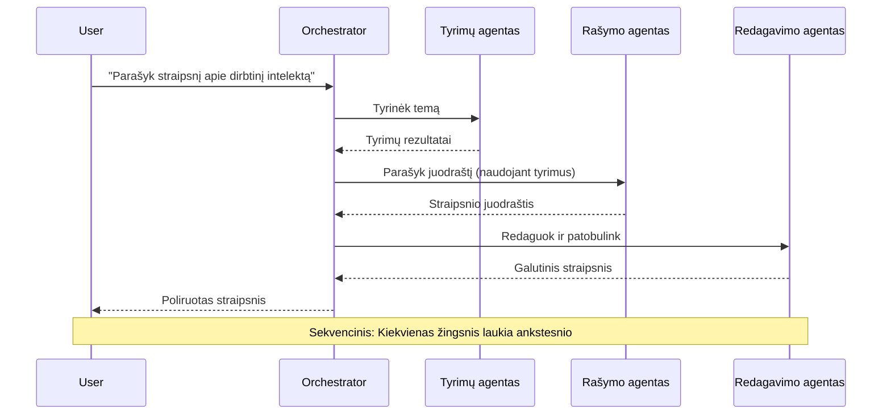
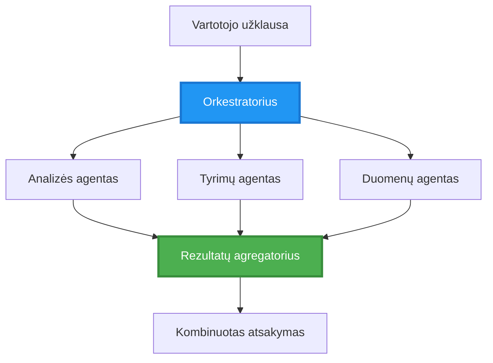
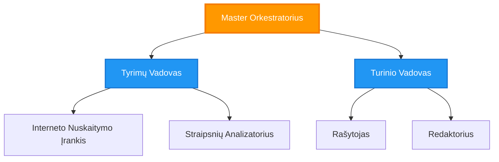
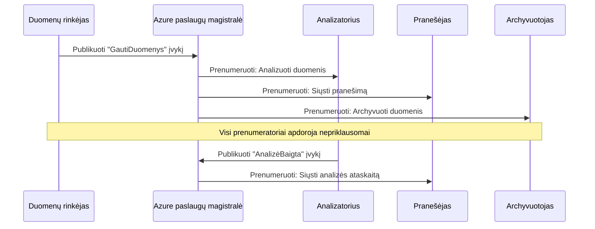
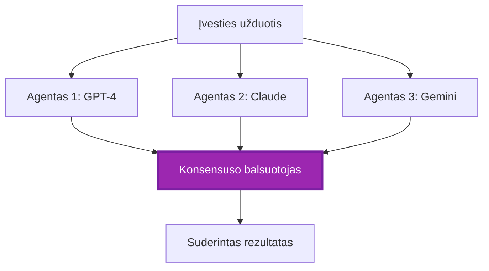
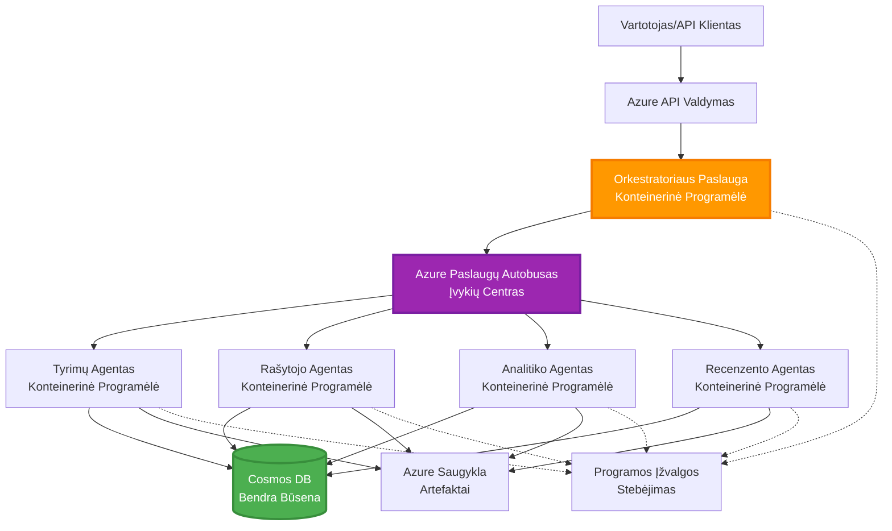

# Daugiagentės koordinacijos modeliai

⏱️ **Numatomas laikas**: 60-75 minutės | 💰 **Numatoma kaina**: ~$100-300/mėn. | ⭐ **Sudėtingumas**: Pažengęs

**📚 Mokymosi kelias:**
- ← Ankstesnis: [Talpos planavimas](capacity-planning.md) - Išteklių dydžio ir mastelio strategijos
- 🎯 **Jūs esate čia**: Daugiagentės koordinacijos modeliai (Orkestracija, komunikacija, būsenos valdymas)
- → Kitas: [SKU pasirinkimas](sku-selection.md) - Tinkamų Azure paslaugų pasirinkimas
- 🏠 [Kurso pradžia](../../README.md)

---

## Ką išmoksite

Baigę šią pamoką, jūs:
- Suprasite **daugiagentės architektūros** modelius ir kada juos naudoti
- Įgyvendinsite **orkestracijos modelius** (centralizuotas, decentralizuotas, hierarchinis)
- Sukursite **agentų komunikacijos** strategijas (sinchroninis, asinchroninis, įvykių pagrindu)
- Valdysite **bendrą būseną** tarp paskirstytų agentų
- Diegsite **daugiagentes sistemas** Azure su AZD
- Taikysite **koordinacijos modelius** realioms AI situacijoms
- Stebėsite ir šalinsite paskirstytų agentų sistemų klaidas

## Kodėl daugiagentė koordinacija svarbi

### Evoliucija: Nuo vieno agento iki daugiagentės sistemos

**Vienas agentas (Paprasta):**
```
User → Agent → Response
```
- ✅ Lengva suprasti ir įgyvendinti
- ✅ Greitas paprastoms užduotims
- ❌ Ribotas vieno modelio galimybėmis
- ❌ Negali paralelizuoti sudėtingų užduočių
- ❌ Nėra specializacijos

**Daugiagentė sistema (Pažangi):**
```
           ┌─────────────┐
           │ Orchestrator│
           └──────┬──────┘
        ┌─────────┼─────────┐
        │         │         │
    ┌───▼──┐  ┌──▼───┐  ┌──▼────┐
    │Agent1│  │Agent2│  │Agent3 │
    │(Plan)│  │(Code)│  │(Review)│
    └──────┘  └──────┘  └───────┘
```
- ✅ Specializuoti agentai konkrečioms užduotims
- ✅ Paralelinis vykdymas greičiui
- ✅ Modulinė ir lengvai prižiūrima
- ✅ Geresnė sudėtingų darbo eigų valdymas
- ⚠️ Reikalinga koordinacijos logika

**Analogija**: Vienas agentas yra kaip vienas žmogus, atliekantis visas užduotis. Daugiagentė sistema yra kaip komanda, kur kiekvienas narys turi specializuotus įgūdžius (tyrėjas, programuotojas, recenzentas, rašytojas), dirbanti kartu.

---

## Pagrindiniai koordinacijos modeliai

### Modelis 1: Sekvencinė koordinacija (Atsakomybės grandinė)

**Kada naudoti**: Užduotys turi būti atliktos tam tikra tvarka, kiekvienas agentas remiasi ankstesniu rezultatu.


**Privalumai:**
- ✅ Aiškus duomenų srautas
- ✅ Lengva šalinti klaidas
- ✅ Nuspėjama vykdymo tvarka

**Trūkumai:**
- ❌ Lėtesnis (nėra paralelizmo)
- ❌ Viena klaida blokuoja visą grandinę
- ❌ Negali tvarkyti tarpusavyje priklausomų užduočių

**Pavyzdžiai:**
- Turinio kūrimo procesas (tyrimas → rašymas → redagavimas → publikavimas)
- Kodo generavimas (planavimas → įgyvendinimas → testavimas → diegimas)
- Ataskaitų generavimas (duomenų rinkimas → analizė → vizualizacija → santrauka)

---

### Modelis 2: Paralelinė koordinacija (Fan-Out/Fan-In)

**Kada naudoti**: Nepriklausomos užduotys gali būti vykdomos vienu metu, rezultatai sujungiami pabaigoje.


**Privalumai:**
- ✅ Greitas (paralelinis vykdymas)
- ✅ Atsparus klaidoms (priimtini daliniai rezultatai)
- ✅ Horizontalus mastelio keitimas

**Trūkumai:**
- ⚠️ Rezultatai gali būti gauti ne eilės tvarka
- ⚠️ Reikalinga agregavimo logika
- ⚠️ Sudėtingas būsenos valdymas

**Pavyzdžiai:**
- Duomenų rinkimas iš kelių šaltinių (API + duomenų bazės + interneto naršymas)
- Konkurencinė analizė (kelios sistemos generuoja sprendimus, pasirenkamas geriausias)
- Vertimo paslaugos (vertimas į kelias kalbas vienu metu)

---

### Modelis 3: Hierarchinė koordinacija (Vadovas-Darbuotojas)

**Kada naudoti**: Sudėtingos darbo eigos su sub-užduotimis, reikalingas delegavimas.


**Privalumai:**
- ✅ Tvarko sudėtingas darbo eigas
- ✅ Modulinė ir lengvai prižiūrima
- ✅ Aiškios atsakomybės ribos

**Trūkumai:**
- ⚠️ Sudėtingesnė architektūra
- ⚠️ Didesnė delsos trukmė (kelios koordinacijos pakopos)
- ⚠️ Reikalinga sudėtinga orkestracija

**Pavyzdžiai:**
- Įmonės dokumentų apdorojimas (klasifikavimas → maršrutizavimas → apdorojimas → archyvavimas)
- Daugiapakopės duomenų srautai (įvedimas → valymas → transformavimas → analizė → ataskaita)
- Sudėtingos automatizacijos darbo eigos (planavimas → išteklių paskirstymas → vykdymas → stebėjimas)

---

### Modelis 4: Įvykių pagrindu koordinacija (Publikavimas-Prenumeravimas)

**Kada naudoti**: Agentai turi reaguoti į įvykius, pageidaujamas laisvas susiejimas.


**Privalumai:**
- ✅ Laisvas agentų susiejimas
- ✅ Lengva pridėti naujus agentus (tiesiog prenumeruoti)
- ✅ Asinchroninis apdorojimas
- ✅ Atsparus (pranešimų išsaugojimas)

**Trūkumai:**
- ⚠️ Galutinė konsistencija
- ⚠️ Sudėtingas klaidų šalinimas
- ⚠️ Pranešimų tvarkos iššūkiai

**Pavyzdžiai:**
- Realaus laiko stebėjimo sistemos (įspėjimai, skydeliai, žurnalai)
- Daugiakanaliniai pranešimai (el. paštas, SMS, push, Slack)
- Duomenų apdorojimo srautai (kelios to paties duomenų vartotojos)

---

### Modelis 5: Konsensuso pagrindu koordinacija (Balsavimas/Kvorumas)

**Kada naudoti**: Reikalingas kelių agentų sutikimas prieš tęsiant.


**Privalumai:**
- ✅ Didesnis tikslumas (kelios nuomonės)
- ✅ Atsparus klaidoms (priimtinos mažumos klaidos)
- ✅ Kokybės užtikrinimas įmontuotas

**Trūkumai:**
- ❌ Brangus (kelios modelio užklausos)
- ❌ Lėtesnis (laukiama visų agentų)
- ⚠️ Reikalingas konfliktų sprendimas

**Pavyzdžiai:**
- Turinio moderavimas (kelios sistemos peržiūri turinį)
- Kodo peržiūra (kelios analizės sistemos)
- Medicininė diagnostika (kelios AI sistemos, ekspertų patvirtinimas)

---

## Architektūros apžvalga

### Pilna daugiagentė sistema Azure


**Pagrindiniai komponentai:**

| Komponentas | Paskirtis | Azure paslauga |
|-------------|-----------|----------------|
| **API Gateway** | Įėjimo taškas, greičio ribojimas, autentifikacija | API Management |
| **Orkestratorius** | Koordinuoja agentų darbo eigas | Container Apps |
| **Pranešimų eilė** | Asinchroninė komunikacija | Service Bus / Event Hubs |
| **Agentai** | Specializuoti AI darbuotojai | Container Apps / Functions |
| **Būsenos saugykla** | Bendroji būsena, užduočių stebėjimas | Cosmos DB |
| **Artefaktų saugykla** | Dokumentai, rezultatai, žurnalai | Blob Storage |
| **Stebėjimas** | Paskirstytas sekimas, žurnalai | Application Insights |

---

## Reikalavimai

### Reikalingi įrankiai

```bash
# Patikrinkite Azure Developer CLI
azd version
# ✅ Tikėtasi: azd versija 1.0.0 arba naujesnė

# Patikrinkite Azure CLI
az --version
# ✅ Tikėtasi: azure-cli 2.50.0 arba naujesnė

# Patikrinkite Docker (vietiniam testavimui)
docker --version
# ✅ Tikėtasi: Docker versija 20.10 arba naujesnė
```

### Azure reikalavimai

- Aktyvi Azure prenumerata
- Leidimai sukurti:
  - Container Apps
  - Service Bus vardų sritis
  - Cosmos DB paskyras
  - Saugyklos paskyras
  - Application Insights

### Žinių reikalavimai

Turėtumėte būti baigę:
- [Konfigūracijos valdymas](../getting-started/configuration.md)
- [Autentifikacija ir saugumas](../getting-started/authsecurity.md)
- [Mikropaslaugų pavyzdys](../../../../examples/microservices)

---

## Įgyvendinimo vadovas

### Projekto struktūra

```
multi-agent-system/
├── azure.yaml                    # AZD configuration
├── infra/
│   ├── main.bicep               # Main infrastructure
│   ├── core/
│   │   ├── servicebus.bicep     # Message queue
│   │   ├── cosmos.bicep         # State store
│   │   ├── storage.bicep        # Artifact storage
│   │   └── monitoring.bicep     # Application Insights
│   └── app/
│       ├── orchestrator.bicep   # Orchestrator service
│       └── agent.bicep          # Agent template
└── src/
    ├── orchestrator/            # Orchestration logic
    │   ├── app.py
    │   ├── workflows.py
    │   └── Dockerfile
    ├── agents/
    │   ├── research/            # Research agent
    │   ├── writer/              # Writer agent
    │   ├── analyst/             # Analyst agent
    │   └── reviewer/            # Reviewer agent
    └── shared/
        ├── state_manager.py     # Shared state logic
        └── message_handler.py   # Message handling
```

---

## Pamoka 1: Sekvencinės koordinacijos modelis

### Įgyvendinimas: Turinio kūrimo procesas

Sukurkime sekvencinį procesą: Tyrimas → Rašymas → Redagavimas → Publikavimas

### 1. AZD konfigūracija

**Failas: `azure.yaml`**

```yaml
name: content-pipeline
metadata:
  template: multi-agent-sequential@1.0.0

services:
  orchestrator:
    project: ./src/orchestrator
    language: python
    host: containerapp
  
  research-agent:
    project: ./src/agents/research
    language: python
    host: containerapp
  
  writer-agent:
    project: ./src/agents/writer
    language: python
    host: containerapp
  
  editor-agent:
    project: ./src/agents/editor
    language: python
    host: containerapp
```

### 2. Infrastruktūra: Service Bus koordinacijai

**Failas: `infra/core/servicebus.bicep`**

```bicep
param name string
param location string
param tags object = {}

resource serviceBusNamespace 'Microsoft.ServiceBus/namespaces@2022-10-01-preview' = {
  name: name
  location: location
  tags: tags
  sku: {
    name: 'Standard'
    tier: 'Standard'
  }
  properties: {
    minimumTlsVersion: '1.2'
  }
}

// Queue for orchestrator → research agent
resource researchQueue 'Microsoft.ServiceBus/namespaces/queues@2022-10-01-preview' = {
  parent: serviceBusNamespace
  name: 'research-tasks'
  properties: {
    maxDeliveryCount: 3
    lockDuration: 'PT5M'
    deadLetteringOnMessageExpiration: true
  }
}

// Queue for research agent → writer agent
resource writerQueue 'Microsoft.ServiceBus/namespaces/queues@2022-10-01-preview' = {
  parent: serviceBusNamespace
  name: 'writer-tasks'
  properties: {
    maxDeliveryCount: 3
    lockDuration: 'PT5M'
  }
}

// Queue for writer agent → editor agent
resource editorQueue 'Microsoft.ServiceBus/namespaces/queues@2022-10-01-preview' = {
  parent: serviceBusNamespace
  name: 'editor-tasks'
  properties: {
    maxDeliveryCount: 3
    lockDuration: 'PT5M'
  }
}

output namespace string = serviceBusNamespace.name
output connectionString string = listKeys('${serviceBusNamespace.id}/AuthorizationRules/RootManageSharedAccessKey', serviceBusNamespace.apiVersion).primaryConnectionString
```

### 3. Bendros būsenos valdymas

**Failas: `src/shared/state_manager.py`**

```python
from azure.cosmos import CosmosClient, PartitionKey
from datetime import datetime
import os

class StateManager:
    """Manages shared state across agents using Cosmos DB"""
    
    def __init__(self):
        endpoint = os.environ['COSMOS_ENDPOINT']
        key = os.environ['COSMOS_KEY']
        
        self.client = CosmosClient(endpoint, key)
        self.database = self.client.get_database_client('agent-state')
        self.container = self.database.get_container_client('tasks')
    
    def create_task(self, task_id: str, task_type: str, input_data: dict):
        """Create a new task"""
        task = {
            'id': task_id,
            'type': task_type,
            'status': 'pending',
            'input': input_data,
            'created_at': datetime.utcnow().isoformat(),
            'steps': []
        }
        self.container.create_item(task)
        return task
    
    def update_task_step(self, task_id: str, step_name: str, result: dict):
        """Update task with completed step"""
        task = self.container.read_item(task_id, partition_key=task_id)
        
        task['steps'].append({
            'name': step_name,
            'completed_at': datetime.utcnow().isoformat(),
            'result': result
        })
        
        self.container.replace_item(task_id, task)
        return task
    
    def complete_task(self, task_id: str, final_result: dict):
        """Mark task as complete"""
        task = self.container.read_item(task_id, partition_key=task_id)
        task['status'] = 'completed'
        task['result'] = final_result
        task['completed_at'] = datetime.utcnow().isoformat()
        self.container.replace_item(task_id, task)
        return task
    
    def get_task(self, task_id: str):
        """Retrieve task state"""
        return self.container.read_item(task_id, partition_key=task_id)
```

### 4. Orkestratoriaus paslauga

**Failas: `src/orchestrator/app.py`**

```python
from flask import Flask, request, jsonify
from azure.servicebus import ServiceBusClient, ServiceBusMessage
import json
import uuid
import os
from shared.state_manager import StateManager

app = Flask(__name__)
state_manager = StateManager()

# Ryšys su paslaugų autobusu
servicebus_connection_str = os.environ['SERVICEBUS_CONNECTION_STRING']
servicebus_client = ServiceBusClient.from_connection_string(servicebus_connection_str)

@app.route('/health', methods=['GET'])
def health():
    return jsonify({'status': 'healthy', 'service': 'orchestrator'})

@app.route('/create-content', methods=['POST'])
def create_content():
    """
    Sequential workflow: Research → Write → Edit → Publish
    """
    data = request.json
    topic = data.get('topic')
    
    if not topic:
        return jsonify({'error': 'Topic required'}), 400
    
    # Sukurti užduotį būsenos saugykloje
    task_id = str(uuid.uuid4())
    task = state_manager.create_task(
        task_id=task_id,
        task_type='content_creation',
        input_data={'topic': topic}
    )
    
    # Išsiųsti pranešimą tyrimų agentui (pirmas žingsnis)
    sender = servicebus_client.get_queue_sender('research-tasks')
    message = ServiceBusMessage(
        body=json.dumps({
            'task_id': task_id,
            'topic': topic,
            'next_queue': 'writer-tasks'  # Kur siųsti rezultatus
        }),
        content_type='application/json'
    )
    
    with sender:
        sender.send_messages(message)
    
    return jsonify({
        'task_id': task_id,
        'status': 'started',
        'workflow': 'sequential',
        'steps': ['research', 'write', 'edit', 'publish'],
        'message': 'Content creation pipeline initiated'
    }), 202

@app.route('/task/<task_id>', methods=['GET'])
def get_task_status(task_id):
    """Check task status"""
    try:
        task = state_manager.get_task(task_id)
        return jsonify(task)
    except Exception as e:
        return jsonify({'error': str(e)}), 404

if __name__ == '__main__':
    app.run(host='0.0.0.0', port=8080)
```

### 5. Tyrimo agentas

**Failas: `src/agents/research/app.py`**

```python
from azure.servicebus import ServiceBusClient, ServiceBusMessage
from openai import AzureOpenAI
import json
import os
import time
from shared.state_manager import StateManager

# Inicializuoti klientus
state_manager = StateManager()
servicebus_client = ServiceBusClient.from_connection_string(
    os.environ['SERVICEBUS_CONNECTION_STRING']
)

openai_client = AzureOpenAI(
    api_key=os.environ['AZURE_OPENAI_API_KEY'],
    api_version="2024-02-01",
    azure_endpoint=os.environ['AZURE_OPENAI_ENDPOINT']
)

def process_research_task(message_data):
    """Process research request and pass to writer"""
    task_id = message_data['task_id']
    topic = message_data['topic']
    next_queue = message_data['next_queue']
    
    print(f"🔬 Researching: {topic}")
    
    # Kreiptis į Azure OpenAI dėl tyrimų
    response = openai_client.chat.completions.create(
        model="gpt-4",
        messages=[
            {"role": "system", "content": "You are a research assistant. Provide comprehensive research on the given topic."},
            {"role": "user", "content": f"Research this topic thoroughly: {topic}"}
        ],
        max_tokens=1500
    )
    
    research_results = response.choices[0].message.content
    
    # Atnaujinti būseną
    state_manager.update_task_step(
        task_id=task_id,
        step_name='research',
        result={'research': research_results}
    )
    
    # Siųsti kitam agentui (rašytojui)
    sender = servicebus_client.get_queue_sender(next_queue)
    message = ServiceBusMessage(
        body=json.dumps({
            'task_id': task_id,
            'topic': topic,
            'research': research_results,
            'next_queue': 'editor-tasks'
        }),
        content_type='application/json'
    )
    
    with sender:
        sender.send_messages(message)
    
    print(f"✅ Research complete for task {task_id}")

def main():
    """Listen to research queue"""
    receiver = servicebus_client.get_queue_receiver('research-tasks')
    
    print("🔬 Research Agent started, listening for tasks...")
    
    with receiver:
        while True:
            messages = receiver.receive_messages(max_wait_time=5)
            for message in messages:
                try:
                    message_data = json.loads(str(message))
                    process_research_task(message_data)
                    receiver.complete_message(message)
                except Exception as e:
                    print(f"❌ Error processing message: {e}")
                    receiver.abandon_message(message)

if __name__ == '__main__':
    main()
```

### 6. Rašymo agentas

**Failas: `src/agents/writer/app.py`**

```python
from azure.servicebus import ServiceBusClient, ServiceBusMessage
from openai import AzureOpenAI
import json
import os
from shared.state_manager import StateManager

state_manager = StateManager()
servicebus_client = ServiceBusClient.from_connection_string(
    os.environ['SERVICEBUS_CONNECTION_STRING']
)

openai_client = AzureOpenAI(
    api_key=os.environ['AZURE_OPENAI_API_KEY'],
    api_version="2024-02-01",
    azure_endpoint=os.environ['AZURE_OPENAI_ENDPOINT']
)

def process_writing_task(message_data):
    """Write article based on research"""
    task_id = message_data['task_id']
    topic = message_data['topic']
    research = message_data['research']
    next_queue = message_data['next_queue']
    
    print(f"✍️ Writing article: {topic}")
    
    # Paskambinti Azure OpenAI, kad parašytų straipsnį
    response = openai_client.chat.completions.create(
        model="gpt-4",
        messages=[
            {"role": "system", "content": "You are a professional writer. Write engaging, well-structured articles."},
            {"role": "user", "content": f"Based on this research:\n\n{research}\n\nWrite a comprehensive article about: {topic}"}
        ],
        max_tokens=2000
    )
    
    article_draft = response.choices[0].message.content
    
    # Atnaujinti būseną
    state_manager.update_task_step(
        task_id=task_id,
        step_name='writing',
        result={'draft': article_draft}
    )
    
    # Išsiųsti redaktoriui
    sender = servicebus_client.get_queue_sender(next_queue)
    message = ServiceBusMessage(
        body=json.dumps({
            'task_id': task_id,
            'topic': topic,
            'draft': article_draft
        }),
        content_type='application/json'
    )
    
    with sender:
        sender.send_messages(message)
    
    print(f"✅ Article draft complete for task {task_id}")

def main():
    """Listen to writer queue"""
    receiver = servicebus_client.get_queue_receiver('writer-tasks')
    
    print("✍️ Writer Agent started, listening for tasks...")
    
    with receiver:
        while True:
            messages = receiver.receive_messages(max_wait_time=5)
            for message in messages:
                try:
                    message_data = json.loads(str(message))
                    process_writing_task(message_data)
                    receiver.complete_message(message)
                except Exception as e:
                    print(f"❌ Error: {e}")
                    receiver.abandon_message(message)

if __name__ == '__main__':
    main()
```

### 7. Redagavimo agentas

**Failas: `src/agents/editor/app.py`**

```python
from azure.servicebus import ServiceBusClient
from openai import AzureOpenAI
import json
import os
from shared.state_manager import StateManager

state_manager = StateManager()
servicebus_client = ServiceBusClient.from_connection_string(
    os.environ['SERVICEBUS_CONNECTION_STRING']
)

openai_client = AzureOpenAI(
    api_key=os.environ['AZURE_OPENAI_API_KEY'],
    api_version="2024-02-01",
    azure_endpoint=os.environ['AZURE_OPENAI_ENDPOINT']
)

def process_editing_task(message_data):
    """Edit and finalize article"""
    task_id = message_data['task_id']
    topic = message_data['topic']
    draft = message_data['draft']
    
    print(f"📝 Editing article: {topic}")
    
    # Skambinti Azure OpenAI redagavimui
    response = openai_client.chat.completions.create(
        model="gpt-4",
        messages=[
            {"role": "system", "content": "You are an expert editor. Improve grammar, clarity, and structure."},
            {"role": "user", "content": f"Edit and improve this article:\n\n{draft}"}
        ],
        max_tokens=2000
    )
    
    final_article = response.choices[0].message.content
    
    # Pažymėti užduotį kaip atliktą
    state_manager.complete_task(
        task_id=task_id,
        final_result={
            'topic': topic,
            'final_article': final_article,
            'word_count': len(final_article.split())
        }
    )
    
    print(f"✅ Article finalized for task {task_id}")

def main():
    """Listen to editor queue"""
    receiver = servicebus_client.get_queue_receiver('editor-tasks')
    
    print("📝 Editor Agent started, listening for tasks...")
    
    with receiver:
        while True:
            messages = receiver.receive_messages(max_wait_time=5)
            for message in messages:
                try:
                    message_data = json.loads(str(message))
                    process_editing_task(message_data)
                    receiver.complete_message(message)
                except Exception as e:
                    print(f"❌ Error: {e}")
                    receiver.abandon_message(message)

if __name__ == '__main__':
    main()
```

### 8. Diegimas ir testavimas

```bash
# Inicializuoti ir diegti
azd init
azd up

# Gauti orkestratoriaus URL
ORCHESTRATOR_URL=$(azd env get-values | grep ORCHESTRATOR_URL | cut -d '=' -f2 | tr -d '"')

# Kurti turinį
curl -X POST $ORCHESTRATOR_URL/create-content \
  -H "Content-Type: application/json" \
  -d '{"topic": "The Future of AI in Healthcare"}'
```

**✅ Tikėtinas rezultatas:**
```json
{
  "task_id": "a1b2c3d4-e5f6-7890-abcd-ef1234567890",
  "status": "started",
  "workflow": "sequential",
  "steps": ["research", "write", "edit", "publish"],
  "message": "Content creation pipeline initiated"
}
```

**Užduočių progreso tikrinimas:**
```bash
TASK_ID="a1b2c3d4-e5f6-7890-abcd-ef1234567890"
curl $ORCHESTRATOR_URL/task/$TASK_ID
```

**✅ Tikėtinas rezultatas (baigta):**
```json
{
  "id": "a1b2c3d4-e5f6-7890-abcd-ef1234567890",
  "type": "content_creation",
  "status": "completed",
  "steps": [
    {
      "name": "research",
      "completed_at": "2025-11-19T10:30:00Z",
      "result": {"research": "..."}
    },
    {
      "name": "writing",
      "completed_at": "2025-11-19T10:32:00Z",
      "result": {"draft": "..."}
    }
  ],
  "result": {
    "topic": "The Future of AI in Healthcare",
    "final_article": "...",
    "word_count": 1500
  }
}
```

---

## Pamoka 2: Paralelinės koordinacijos modelis

### Įgyvendinimas: Daugiakryptis tyrimų agregatorius

Sukurkime paralelinę sistemą, kuri vienu metu renka informaciją iš kelių šaltinių.

### Paralelinis orkestratorius

**Failas: `src/orchestrator/parallel_workflow.py`**

```python
from flask import Flask, request, jsonify
from azure.servicebus import ServiceBusClient, ServiceBusMessage
import json
import uuid
import os
from shared.state_manager import StateManager

app = Flask(__name__)
state_manager = StateManager()

servicebus_client = ServiceBusClient.from_connection_string(
    os.environ['SERVICEBUS_CONNECTION_STRING']
)

@app.route('/research-parallel', methods=['POST'])
def research_parallel():
    """
    Parallel workflow: Multiple agents work simultaneously
    """
    data = request.json
    query = data.get('query')
    
    task_id = str(uuid.uuid4())
    task = state_manager.create_task(
        task_id=task_id,
        task_type='parallel_research',
        input_data={
            'query': query,
            'agents': ['web', 'academic', 'news', 'social']
        }
    )
    
    # Išsiuntimas: Siųsti visiems agentams vienu metu
    agents = [
        ('web-research-queue', 'web'),
        ('academic-research-queue', 'academic'),
        ('news-research-queue', 'news'),
        ('social-research-queue', 'social')
    ]
    
    for queue_name, agent_type in agents:
        sender = servicebus_client.get_queue_sender(queue_name)
        message = ServiceBusMessage(
            body=json.dumps({
                'task_id': task_id,
                'query': query,
                'agent_type': agent_type,
                'result_queue': 'aggregation-queue'
            }),
            content_type='application/json'
        )
        
        with sender:
            sender.send_messages(message)
    
    return jsonify({
        'task_id': task_id,
        'status': 'started',
        'workflow': 'parallel',
        'agents_dispatched': 4,
        'message': 'Parallel research initiated'
    }), 202

if __name__ == '__main__':
    app.run(host='0.0.0.0', port=8080)
```

### Agregavimo logika

**Failas: `src/agents/aggregator/app.py`**

```python
from azure.servicebus import ServiceBusClient
import json
import os
from collections import defaultdict
from shared.state_manager import StateManager

state_manager = StateManager()
servicebus_client = ServiceBusClient.from_connection_string(
    os.environ['SERVICEBUS_CONNECTION_STRING']
)

# Sekti rezultatus pagal užduotį
task_results = defaultdict(list)
expected_agents = 4  # internetas, akademinis, naujienos, socialinis

def process_result(message_data):
    """Aggregate results from parallel agents"""
    task_id = message_data['task_id']
    agent_type = message_data['agent_type']
    result = message_data['result']
    
    # Išsaugoti rezultatą
    task_results[task_id].append({
        'agent': agent_type,
        'data': result
    })
    
    print(f"📊 Received result from {agent_type} agent ({len(task_results[task_id])}/{expected_agents})")
    
    # Patikrinti, ar visi agentai baigė (fan-in)
    if len(task_results[task_id]) == expected_agents:
        print(f"✅ All agents completed for task {task_id}. Aggregating...")
        
        # Sujungti rezultatus
        aggregated = {
            'query': message_data['query'],
            'sources': task_results[task_id],
            'summary': generate_summary(task_results[task_id])
        }
        
        # Pažymėti kaip baigtą
        state_manager.complete_task(task_id, aggregated)
        
        # Išvalyti
        del task_results[task_id]
        
        print(f"✅ Aggregation complete for task {task_id}")

def generate_summary(results):
    """Generate summary from all sources"""
    summaries = [r['data'].get('summary', '') for r in results]
    return '\n\n'.join(summaries)

def main():
    """Listen to aggregation queue"""
    receiver = servicebus_client.get_queue_receiver('aggregation-queue')
    
    print("📊 Aggregator started, listening for results...")
    
    with receiver:
        while True:
            messages = receiver.receive_messages(max_wait_time=5)
            for message in messages:
                try:
                    message_data = json.loads(str(message))
                    process_result(message_data)
                    receiver.complete_message(message)
                except Exception as e:
                    print(f"❌ Error: {e}")
                    receiver.abandon_message(message)

if __name__ == '__main__':
    main()
```

**Paralelinio modelio privalumai:**
- ⚡ **4x greitesnis** (agentai veikia vienu metu)
- 🔄 **Atsparus klaidoms** (priimtini daliniai rezultatai)
- 📈 **Mastelio keitimas** (lengvai pridėti daugiau agentų)

---

## Praktiniai pratimai

### Pratimas 1: Pridėti laiko apribojimo valdymą ⭐⭐ (Vidutinis)

**Tikslas**: Įgyvendinti laiko apribojimo logiką, kad agregatorius nelauktų per ilgai lėtų agentų.

**Žingsniai**:

1. **Pridėti laiko apribojimo stebėjimą agregatoriui:**

```python
from datetime import datetime, timedelta

task_timeouts = {}  # task_id -> galiojimo_laikas

def process_result(message_data):
    task_id = message_data['task_id']
    
    # Nustatyti laiko limitą pirmajam rezultatui
    if task_id not in task_timeouts:
        task_timeouts[task_id] = datetime.utcnow() + timedelta(seconds=30)
    
    task_results[task_id].append({
        'agent': message_data['agent_type'],
        'data': message_data['result']
    })
    
    # Patikrinti, ar baigta ARBA pasibaigė laikas
    if len(task_results[task_id]) == expected_agents or \
       datetime.utcnow() > task_timeouts[task_id]:
        
        print(f"📊 Aggregating with {len(task_results[task_id])}/{expected_agents} results")
        
        aggregated = {
            'query': message_data['query'],
            'sources': task_results[task_id],
            'completed_agents': len(task_results[task_id]),
            'timed_out': len(task_results[task_id]) < expected_agents
        }
        
        state_manager.complete_task(task_id, aggregated)
        
        # Išvalymas
        del task_results[task_id]
        del task_timeouts[task_id]
```

2. **Testuoti su dirbtiniais vėlavimais:**

```python
# Viename agente pridėkite vėlavimą, kad imituotumėte lėtą apdorojimą
import time
time.sleep(35)  # Viršija 30 sekundžių laiko limitą
```

3. **Diegti ir patikrinti:**

```bash
azd deploy aggregator

# Pateikti užduotį
curl -X POST $ORCHESTRATOR_URL/research-parallel \
  -H "Content-Type: application/json" \
  -d '{"query": "AI safety research"}'

# Patikrinti rezultatus po 30 sekundžių
curl $ORCHESTRATOR_URL/task/$TASK_ID
```

**✅ Sėkmės kriterijai:**
- ✅ Užduotis baigiasi po 30 sekundžių, net jei agentai nebaigia
- ✅ Atsakymas rodo dalinius rezultatus (`"timed_out": true`)
- ✅ Grąžinami pasiekiami rezultatai (3 iš 4 agentų)

**Laikas**: 20-25 minutės

---

### Pratimas 2: Įgyvendinti pakartojimo logiką ⭐⭐⭐ (Pažangus)

**Tikslas**: Automatiškai pakartoti nepavykusias agentų užduotis prieš pasiduodant.

**Žingsniai**:

1. **Pridėti pakartojimo stebėjimą orkestratoriui:**

```python
from dataclasses import dataclass
from typing import Dict

@dataclass
class RetryConfig:
    max_retries: int = 3
    backoff_seconds: int = 5

retry_counts: Dict[str, int] = {}  # message_id -> bandymų_skaičius

def send_with_retry(queue_name: str, message_data: dict, retry_config: RetryConfig):
    """Send message with retry metadata"""
    message_id = message_data.get('message_id', str(uuid.uuid4()))
    message_data['message_id'] = message_id
    message_data['retry_count'] = retry_counts.get(message_id, 0)
    message_data['max_retries'] = retry_config.max_retries
    
    sender = servicebus_client.get_queue_sender(queue_name)
    message = ServiceBusMessage(
        body=json.dumps(message_data),
        content_type='application/json',
        message_id=message_id
    )
    
    with sender:
        sender.send_messages(message)
```

2. **Pridėti pakartojimo tvarkyklę agentams:**

```python
def process_with_retry(message, receiver, process_func):
    """Process message with automatic retry on failure"""
    try:
        message_data = json.loads(str(message))
        
        # Apdoroti pranešimą
        process_func(message_data)
        
        # Sėkmė - užbaigta
        receiver.complete_message(message)
        
    except Exception as e:
        message_id = message.message_id
        retry_count = message_data.get('retry_count', 0)
        max_retries = message_data.get('max_retries', 3)
        
        if retry_count < max_retries:
            # Bandykite dar kartą: atsisakyti ir iš naujo įtraukti su padidintu skaičiumi
            print(f"⚠️ Retry {retry_count + 1}/{max_retries} for message {message_id}")
            
            message_data['retry_count'] = retry_count + 1
            
            # Grąžinti į tą pačią eilę su vėlavimu
            time.sleep(5 * (retry_count + 1))  # Eksponentinis atsitraukimas
            send_with_retry(queue_name, message_data, RetryConfig())
            
            receiver.complete_message(message)  # Pašalinti originalą
        else:
            # Viršytas maksimalus bandymų skaičius - perkelti į netinkamų laiškų eilę
            print(f"❌ Max retries exceeded for message {message_id}")
            receiver.dead_letter_message(
                message,
                reason="MaxRetriesExceeded",
                error_description=str(e)
            )
```

3. **Stebėti nepavykusių pranešimų eilę:**

```python
def monitor_dead_letters():
    """Check dead letter queue for failed messages"""
    receiver = servicebus_client.get_queue_receiver(
        'research-queue',
        sub_queue='deadletter'
    )
    
    with receiver:
        messages = receiver.receive_messages(max_wait_time=5)
        for message in messages:
            print(f"☠️ Dead letter: {message.message_id}")
            print(f"Reason: {message.dead_letter_reason}")
            print(f"Description: {message.dead_letter_error_description}")
```

**✅ Sėkmės kriterijai:**
- ✅ Nepavykusios užduotys automatiškai pakartojamos (iki 3 kartų)
- ✅ Eksponentinis atidėjimas tarp pakartojimų (5s, 10s, 15s)
- ✅ Po maksimalaus pakartojimų skaičiaus pranešimai patenka į nepavykusių pranešimų eilę
- ✅ Nepavykusių pranešimų eilė gali būti stebima ir pakartotinai vykdoma

**Laikas**: 30-40 minutės

---

### Pratimas 3: Įgyvendinti grandinės pertraukiklį ⭐⭐⭐ (Pažangus)

**Tikslas**: Užkirsti kelią kaskadinėms klaidoms, sustabdant užklausas į nepavykusius agentus.

**Žingsniai**:

1. **Sukurti grandinės pertraukiklio klasę:**

```python
from enum import Enum
from datetime import datetime, timedelta

class CircuitState(Enum):
    CLOSED = "closed"      # Įprastas veikimas
    OPEN = "open"          # Nepavyksta, atmesti užklausas
    HALF_OPEN = "half_open"  # Tikrinama, ar atsigavo

class CircuitBreaker:
    def __init__(self, failure_threshold=5, timeout_seconds=60):
        self.failure_threshold = failure_threshold
        self.timeout_seconds = timeout_seconds
        self.failure_count = 0
        self.last_failure_time = None
        self.state = CircuitState.CLOSED
    
    def call(self, func):
        """Execute function with circuit breaker protection"""
        if self.state == CircuitState.OPEN:
            # Patikrinkite, ar baigėsi laiko limitas
            if datetime.utcnow() - self.last_failure_time > timedelta(seconds=self.timeout_seconds):
                self.state = CircuitState.HALF_OPEN
                print("🔄 Circuit breaker: HALF_OPEN (testing)")
            else:
                raise Exception(f"Circuit breaker OPEN for agent. Try again in {self.timeout_seconds}s")
        
        try:
            result = func()
            
            # Sėkmė
            if self.state == CircuitState.HALF_OPEN:
                self.state = CircuitState.CLOSED
                self.failure_count = 0
                print("✅ Circuit breaker: CLOSED (recovered)")
            
            return result
            
        except Exception as e:
            self.failure_count += 1
            self.last_failure_time = datetime.utcnow()
            
            if self.failure_count >= self.failure_threshold:
                self.state = CircuitState.OPEN
                print(f"🔴 Circuit breaker: OPEN (too many failures)")
            
            raise e
```

2. **Taikyti agentų užklausoms:**

```python
# Orkestratoriuje
agent_circuits = {
    'web': CircuitBreaker(failure_threshold=5, timeout_seconds=60),
    'academic': CircuitBreaker(failure_threshold=5, timeout_seconds=60),
    'news': CircuitBreaker(failure_threshold=5, timeout_seconds=60),
    'social': CircuitBreaker(failure_threshold=5, timeout_seconds=60)
}

def send_to_agent(agent_type, message_data):
    """Send with circuit breaker protection"""
    circuit = agent_circuits[agent_type]
    
    try:
        circuit.call(lambda: send_message(agent_type, message_data))
    except Exception as e:
        print(f"⚠️ Skipping {agent_type} agent: {e}")
        # Tęsti su kitais agentais
```

3. **Testuoti grandinės pertraukiklį:**

```bash
# Simuliuoti pakartotinius gedimus (sustabdyti vieną agentą)
az containerapp stop --name web-research-agent --resource-group rg-agents

# Siųsti kelis užklausas
for i in {1..10}; do
  curl -X POST $ORCHESTRATOR_URL/research-parallel \
    -H "Content-Type: application/json" \
    -d '{"query": "test query '$i'"}'
  sleep 2
done

# Patikrinti žurnalus - turėtų matytis atidarytas grandinės pertraukiklis po 5 gedimų
azd logs orchestrator --tail 50
```

**✅ Sėkmės kriterijai:**
- ✅ Po 5 klaidų grandinė atsidaro (atmeta užklausas)
- ✅ Po 60 sekundžių grandinė pereina į pusiau atvirą būseną (testuoja atsigavimą)
- ✅ Kiti agentai toliau dirba normaliai
- ✅ Grandinė automatiškai užsidaro, kai agentas atsigauna

**Laikas**: 40-50 minutės

---

## Stebėjimas ir klaidų šalinimas

### Paskirstytas sekimas su Application Insights

**Failas: `src/shared/tracing.py`**

```python
from opencensus.ext.azure.log_exporter import AzureLogHandler
from opencensus.ext.azure.trace_exporter import AzureExporter
from opencensus.trace import config_integration
from opencensus.trace.tracer import Tracer
from opencensus.trace.samplers import AlwaysOnSampler
import logging
import os

# Konfigūruoti sekimą
config_integration.trace_integrations(['requests', 'logging'])

connection_string = os.environ.get('APPLICATIONINSIGHTS_CONNECTION_STRING')

# Sukurti sekiklį
tracer = Tracer(
    exporter=AzureExporter(connection_string=connection_string),
    sampler=AlwaysOnSampler()
)

# Konfigūruoti žurnalavimą
logger = logging.getLogger(__name__)
logger.addHandler(AzureLogHandler(connection_string=connection_string))
logger.setLevel(logging.INFO)

def trace_agent_call(agent_name, task_id, operation):
    """Trace agent operations"""
    with tracer.span(name=f'{agent_name}.{operation}') as span:
        span.add_attribute('agent', agent_name)
        span.add_attribute('task_id', task_id)
        span.add_attribute('operation', operation)
        
        try:
            result = operation()
            span.add_attribute('status', 'success')
            return result
        except Exception as e:
            span.add_attribute('status', 'error')
            span.add_attribute('error', str(e))
            raise
```

### Application Insights užklausos

**Stebėti daugiagentės darbo eigas:**

```kusto
// Trace complete workflow for a task
traces
| where customDimensions.task_id == "a1b2c3d4-..."
| project timestamp, message, customDimensions.agent, customDimensions.operation
| order by timestamp asc
```

**Agentų našumo palyginimas:**

```kusto
// Compare agent execution times
dependencies
| where name contains "agent"
| summarize 
    avg_duration = avg(duration),
    p95_duration = percentile(duration, 95),
    count = count()
  by agent = tostring(customDimensions.agent)
| order by avg_duration desc
```

**Klaidų analizė:**

```kusto
// Find which agents fail most
exceptions
| where customDimensions.agent != ""
| summarize 
    failure_count = count(),
    unique_errors = dcount(outerMessage)
  by agent = tostring(customDimensions.agent)
| order by failure_count desc
```

---

## Kainų analizė

### Daugiagentės sistemos kainos (mėnesio įvertinimai)

| Komponentas | Konfigūracija | Kaina |
|-------------|---------------|-------|
| **Orkestratorius** | 1 Container App (1 vCPU, 2GB) | $30-50 |
| **4 Agentai** | 4 Container Apps (0.5 vCPU, 1GB kiekvienas) | $60-120 |
| **Service Bus** | Standartinis lygis, 10M pranešimų | $10-20 |
| **Cosmos DB** | Serverless, 5GB saugykla, 1M RUs | $25-50 |
| **Blob Storage** | 10GB saugykla, 100K operacijų | $5-10 |
| **Application Insights** | 5GB įrašų | $10-15 |
| **Azure OpenAI** | GPT-4, 10M žetonų | $100-300 |
| **Iš viso** | | **$240-565/mėn.** |

### Kainų optimizavimo strategijos

1. **Naudoti serverless, kur įmanoma:**
   ```bicep
   // Cosmos DB serverless (no minimum cost)
   properties: {
     databaseAccountOfferType: 'Standard'
     capabilities: [{ name: 'EnableServerless' }]
   }
   ```

2. **Agentus mastelio keisti iki nulio, kai jie nenaudojami:**
   ```bicep
   scale: {
     minReplicas: 0  // Scale to zero when no messages
     maxReplicas: 10
   }
   ```

3. **Naudoti grupavimą Service Bus:**
   ```python
   # Siųsti žinutes partijomis (pigiau)
   sender.send_messages([message1, message2, message3])
   ```

4. **Kešuoti dažnai naudojamus rezultatus:**
   ```python
   # Naudokite „Azure Cache for Redis“
   if cache.exists(query_hash):
       return cache.get(query_hash)
   ```

---

## Geriausios praktikos

### ✅ DARYKITE:

1. **Naudokite idempotentines operacijas**
   ```python
   # Agentas gali saugiai apdoroti tą pačią žinutę kelis kartus
   def process_task(task_id):
       if state_manager.task_exists(task_id):
           print(f"Task {task_id} already processed, skipping")
           return
       # Apdoroti užduotį...
   ```

2. **Įgyvendinkite išsamų žurnalavimą**
   ```python
   logger.info(f"Agent: {agent_name}, Task: {task_id}, Action: {action}")
   ```

3. **Naudokite
## Trikčių šalinimo vadovas

### Problema: Žinutės užstringa eilėje

**Simptomai:**
- Žinutės kaupiasi eilėje
- Agentai jų neapdoroja
- Užduoties būsena lieka „laukiama“

**Diagnozė:**
```bash
# Patikrinkite eilės gylį
az servicebus queue show \
  --namespace-name mybus \
  --name research-tasks \
  --query "countDetails"

# Patikrinkite agento būklę
azd logs research-agent --tail 50
```

**Sprendimai:**

1. **Padidinkite agentų replikų skaičių:**
   ```bash
   az containerapp update \
     --name research-agent \
     --min-replicas 3 \
     --max-replicas 10
   ```

2. **Patikrinkite „dead letter“ eilę:**
   ```bash
   az servicebus queue show \
     --namespace-name mybus \
     --name research-tasks \
     --query "countDetails.deadLetterMessageCount"
   ```

---

### Problema: Užduoties laikas baigiasi / niekada nebaigiama

**Simptomai:**
- Užduoties būsena lieka „vykdoma“
- Kai kurie agentai užduotį užbaigia, kiti - ne
- Klaidos pranešimų nėra

**Diagnozė:**
```bash
# Patikrinkite užduoties būseną
curl $ORCHESTRATOR_URL/task/$TASK_ID

# Patikrinkite „Application Insights“
# Vykdykite užklausą: traces | where customDimensions.task_id == "..."
```

**Sprendimai:**

1. **Įgyvendinkite laiko limitą agregatoriuje (1 pratimas)**

2. **Patikrinkite agentų gedimus:**
   ```bash
   azd logs --follow | grep "ERROR\|FAIL"
   ```

3. **Įsitikinkite, kad visi agentai veikia:**
   ```bash
   az containerapp list \
     --resource-group rg-agents \
     --query "[].{name:name, status:properties.runningStatus}"
   ```

---

## Sužinokite daugiau

### Oficiali dokumentacija
- [Azure Service Bus](https://learn.microsoft.com/azure/service-bus-messaging/service-bus-messaging-overview)
- [Cosmos DB](https://learn.microsoft.com/azure/cosmos-db/introduction)
- [Container Apps DAPR](https://learn.microsoft.com/azure/container-apps/dapr-overview)
- [Daugiagentės dizaino šablonai](https://learn.microsoft.com/azure/architecture/guide/ai/multi-agent-systems)

### Kiti šio kurso žingsniai
- ← Ankstesnis: [Talpos planavimas](capacity-planning.md)
- → Kitas: [SKU pasirinkimas](sku-selection.md)
- 🏠 [Kurso pradžia](../../README.md)

### Susiję pavyzdžiai
- [Mikropaslaugų pavyzdys](../../../../examples/microservices) - Paslaugų komunikacijos šablonai
- [Azure OpenAI pavyzdys](../../../../examples/azure-openai-chat) - AI integracija

---

## Santrauka

**Jūs išmokote:**
- ✅ Penkis koordinavimo šablonus (sekvencinis, lygiagretus, hierarchinis, įvykių pagrindu, konsensuso)
- ✅ Daugiagentę architektūrą Azure platformoje (Service Bus, Cosmos DB, Container Apps)
- ✅ Būsenos valdymą tarp paskirstytų agentų
- ✅ Laiko limitų valdymą, pakartotinius bandymus ir apsaugos mechanizmus
- ✅ Paskirstytų sistemų stebėjimą ir derinimą
- ✅ Kaštų optimizavimo strategijas

**Pagrindinės išvados:**
1. **Pasirinkite tinkamą šabloną** - Sekvencinis užsakytoms darbo eigoms, lygiagretus greičiui, įvykių pagrindu lankstumui
2. **Atsargiai valdykite būseną** - Naudokite Cosmos DB ar panašius sprendimus bendrai būsenai
3. **Tvarkykite gedimus atsargiai** - Laiko limitai, pakartotiniai bandymai, apsaugos mechanizmai, „dead letter“ eilės
4. **Stebėkite viską** - Paskirstytas sekimas yra būtinas derinimui
5. **Optimizuokite kaštus** - Skalavimas iki nulio, serverless sprendimai, talpyklos naudojimas

**Kiti žingsniai:**
1. Užbaikite praktinius pratimus
2. Sukurkite daugiagentę sistemą savo atvejui
3. Išnagrinėkite [SKU pasirinkimą](sku-selection.md), kad optimizuotumėte našumą ir kaštus

---

<!-- CO-OP TRANSLATOR DISCLAIMER START -->
**Atsakomybės apribojimas**:  
Šis dokumentas buvo išverstas naudojant AI vertimo paslaugą [Co-op Translator](https://github.com/Azure/co-op-translator). Nors siekiame tikslumo, prašome atkreipti dėmesį, kad automatiniai vertimai gali turėti klaidų ar netikslumų. Originalus dokumentas jo gimtąja kalba turėtų būti laikomas autoritetingu šaltiniu. Dėl svarbios informacijos rekomenduojama profesionali žmogaus vertimo paslauga. Mes neprisiimame atsakomybės už nesusipratimus ar neteisingus aiškinimus, atsiradusius naudojant šį vertimą.
<!-- CO-OP TRANSLATOR DISCLAIMER END -->