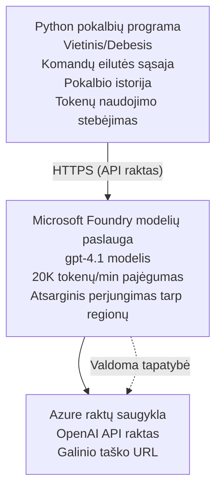

# Microsoft Foundry Models Chat Application

**Mokymosi kelias:** Tarpinis ⭐⭐ | **Laikas:** 35–45 minučių | **Kaina:** $50-200/month

Pilna Microsoft Foundry Models pokalbių programa, diegiama naudojant Azure Developer CLI (azd). Šis pavyzdys demonstruoja gpt-4.1 diegimą, saugų API prieigos valdymą ir paprastą pokalbių sąsają.

## 🎯 Ko išmoksite

- Diegti Microsoft Foundry Models paslaugą su gpt-4.1 modeliu
- Saugiai saugoti OpenAI API raktus Key Vault
- Kurti paprastą pokalbių sąsają naudojant Python
- Stebėti žetonų naudojimą ir išlaidas
- Įdiegti užklausų ribojimą ir klaidų tvarkymą

## 📦 Kas įtraukta

✅ **Microsoft Foundry Models Service** - gpt-4.1 modelio diegimas  
✅ **Python Chat App** - Paprasta komandų eilutės pokalbių sąsaja  
✅ **Key Vault integracija** - Saugus API rakto saugojimas  
✅ **ARM šablonai** - Pilna infrastruktūra kaip kodas  
✅ **Išlaidų stebėjimas** - Žetonų naudojimo sekimas  
✅ **Užklausų ribojimas** - Apsauga nuo kvotos išeikvojimo  

## Architektūra


## Reikalavimai

### Reikalinga

- **Azure Developer CLI (azd)** - [Diegimo vadovas](https://learn.microsoft.com/azure/developer/azure-developer-cli/install-azd)
- **Azure prenumerata** su OpenAI prieiga - [Prašyti prieigos](https://aka.ms/oai/access)
- **Python 3.9+** - [Atsisiųsti Python](https://www.python.org/downloads/)

### Reikalavimų patikra

```bash
# Patikrinkite azd versiją (reikia 1.5.0 arba naujesnės)
azd version

# Patikrinkite prisijungimą prie Azure
azd auth login

# Patikrinkite Python versiją
python --version  # arba python3 --version

# Patikrinkite prieigą prie OpenAI (patikrinkite Azure portale)
az cognitiveservices account list-skus \
  --kind OpenAI \
  --location eastus
```

> **⚠️ Svarbu:** Microsoft Foundry Models reikalauja paraiškos patvirtinimo. Jei dar nepateikėte paraiškos, apsilankykite [aka.ms/oai/access](https://aka.ms/oai/access). Patvirtinimas paprastai užtrunka 1–2 darbo dienas.

## ⏱️ Diegimo laikas

| Phase | Duration | What Happens |
|-------|----------|--------------|
| Prerequisites check | 2-3 minutes | Verify OpenAI quota availability |
| Deploy infrastructure | 8-12 minutes | Create OpenAI, Key Vault, model deployment |
| Configure application | 2-3 minutes | Set up environment and dependencies |
| **Total** | **12-18 minutes** | Ready to chat with gpt-4.1 |

**Pastaba:** Pirmą kartą diegiamas OpenAI gali užtrukti ilgiau dėl modelio paruošimo.

## Greitas pradžios vadovas

```bash
# Eikite į pavyzdį
cd examples/azure-openai-chat

# Inicializuokite aplinką
azd env new myopenai

# Įdiekite viską (infrastruktūrą + konfigūraciją)
azd up
# Būsite paprašyti:
# 1. Pasirinkite Azure prenumeratą
# 2. Pasirinkite vietą, kurioje pasiekiamas OpenAI (pvz., eastus, eastus2, westus)
# 3. Palaukite 12–18 minučių, kol diegimas bus užbaigtas.

# Įdiekite Python priklausomybes
pip install -r requirements.txt

# Pradėkite pokalbį!
python chat.py
```

**Tikėtinas rezultatas:**
```
🤖 Microsoft Foundry Models Chat Application
Connected to: gpt-4.1 (eastus)
Type your message (or 'quit' to exit)

You: Hello! Tell me about Microsoft Foundry Models.
Assistant: Microsoft Foundry Models Service provides REST API access to OpenAI's powerful language models including gpt-4.1, GPT-3.5-Turbo, and Embeddings...

[Tokens used: 145 | Estimated cost: $0.0044]
```

## ✅ Diegimo patikra

### 1 žingsnis: Patikrinkite Azure išteklius

```bash
# Peržiūrėti įdiegtus išteklius
azd show

# Tikėtinas išvesties rezultatas:
# - OpenAI paslauga: (resurso pavadinimas)
# - Raktų saugykla: (resurso pavadinimas)
# - Diegimas: gpt-4.1
# - Vieta: eastus (arba jūsų pasirinktas regionas)
```

### 2 žingsnis: Išbandykite OpenAI API

```bash
# Gauti OpenAI galinį tašką ir raktą
OPENAI_ENDPOINT=$(azd env get-value AZURE_OPENAI_ENDPOINT)
OPENAI_KEY=$(azd env get-value AZURE_OPENAI_API_KEY)

# Išbandyti API užklausą
curl "$OPENAI_ENDPOINT/openai/deployments/gpt-4.1/chat/completions?api-version=2024-08-01-preview" \
  -H "Content-Type: application/json" \
  -H "api-key: $OPENAI_KEY" \
  -d '{
    "messages": [{"role": "user", "content": "Say hello!"}],
    "max_tokens": 50
  }'
```

**Tikėtina atsakymas:**
```json
{
  "choices": [
    {
      "message": {
        "role": "assistant",
        "content": "Hello! How can I assist you today?"
      }
    }
  ],
  "usage": {
    "prompt_tokens": 8,
    "completion_tokens": 9,
    "total_tokens": 17
  }
}
```

### 3 žingsnis: Patikrinkite Key Vault prieigą

```bash
# Išvardinti slaptus duomenis Key Vault
KV_NAME=$(azd env get-value AZURE_KEY_VAULT_NAME)

az keyvault secret list \
  --vault-name $KV_NAME \
  --query "[].name" \
  --output table
```

**Tikėtini secret'ai:**
- `openai-api-key`
- `openai-endpoint`

**Sėkmės kriterijai:**
- ✅ OpenAI paslauga diegta su gpt-4.1
- ✅ API kvietimas grąžina galiojantį atsakymą
- ✅ Slaptažodžiai saugomi Key Vault
- ✅ Veikia žetonų naudojimo sekimas

## Projekto struktūra

```
azure-openai-chat/
├── README.md                   ✅ This guide
├── azure.yaml                  ✅ AZD configuration
├── infra/                      ✅ Infrastructure as Code
│   ├── main.bicep             ✅ Main Bicep template
│   ├── main.parameters.json   ✅ Parameters
│   └── openai.bicep           ✅ OpenAI resource definition
├── src/                        ✅ Application code
│   ├── chat.py                ✅ Chat interface
│   ├── config.py              ✅ Configuration loader
│   └── requirements.txt       ✅ Python dependencies
└── .gitignore                  ✅ Git ignore rules
```

## Programos funkcijos

### Pokalbių sąsaja (`chat.py`)

Pokalbių programa apima:

- **Pokalbių istorija** - Išlaiko kontekstą tarp žinučių
- **Žetonų skaičiavimas** - Stebi naudojimą ir apskaičiuoja sąnaudas
- **Klaidų tvarkymas** - Gražus reagavimas į užklausų ribojimus ir API klaidas
- **Išlaidų vertinimas** - Realaus laiko išlaidų skaičiavimas už žinutę
- **Srautinis palaikymas** - Pasirinktinės srautinės atsakymų galimybės

### Komandos

Pokalbių metu galite naudoti:
- `quit` arba `exit` - Baigti sesiją
- `clear` - Išvalyti pokalbių istoriją
- `tokens` - Rodyti bendrą žetonų naudojimą
- `cost` - Rodyti apskaičiuotas bendrąsias išlaidas

### Konfigūracija (`config.py`)

Užkrauna konfigūraciją iš aplinkos kintamųjų:
```python
AZURE_OPENAI_ENDPOINT  # Iš Key Vault
AZURE_OPENAI_API_KEY   # Iš Key Vault
AZURE_OPENAI_MODEL     # Numatytasis: gpt-4.1
AZURE_OPENAI_MAX_TOKENS # Numatytasis: 800
```

## Naudojimo pavyzdžiai

### Pagrindinis pokalbis

```bash
python chat.py
```

### Pokalbis su pasirinktiniu modeliu

```bash
export AZURE_OPENAI_MODEL=gpt-35-turbo
python chat.py
```

### Srautinė pokalbio versija

```bash
python chat.py --stream
```

### Pavyzdinis pokalbis

```
You: Explain Microsoft Foundry Models Service in 3 sentences.
Assistant: Microsoft Foundry Models Service is Microsoft Azure's cloud platform offering 
that provides access to OpenAI's powerful language models. It enables developers 
to integrate capabilities like gpt-4.1 into their applications with enterprise-grade 
security and compliance. The service includes features for content filtering, 
abuse monitoring, and responsible AI practices.

[Tokens used: 89 | Estimated cost: $0.0027]

You: What models are available?
Assistant: Microsoft Foundry Models Service offers several model families including gpt-4.1 
(most capable), GPT-3.5-Turbo (faster and cost-effective), and Embeddings models 
for vector search. Each model has different capabilities, pricing, and token limits.

[Tokens used: 67 | Estimated cost: $0.0020]

Total session: 156 tokens | $0.0047
```

## Išlaidų valdymas

### Žetonų kainodara (gpt-4.1)

| Model | Input (per 1K tokens) | Output (per 1K tokens) |
|-------|----------------------|------------------------|
| gpt-4.1 | $0.03 | $0.06 |
| GPT-3.5-Turbo | $0.0015 | $0.002 |

### Apskaičiuotos mėnesinės išlaidos

Remiantis naudojimo modeliais:

| Usage Level | Messages/Day | Tokens/Day | Monthly Cost |
|-------------|--------------|------------|--------------|
| **Light** | 20 messages | 3,000 tokens | $3-5 |
| **Moderate** | 100 messages | 15,000 tokens | $15-25 |
| **Heavy** | 500 messages | 75,000 tokens | $75-125 |

**Pagrindinės infrastruktūros išlaidos:** $1-2/month (Key Vault + minimalus skaičiavimas)

### Patarimai, kaip optimizuoti išlaidas

```bash
# 1. Naudokite GPT-3.5-Turbo paprastesnėms užduotims (20 kartų pigiau)
export AZURE_OPENAI_MODEL=gpt-35-turbo

# 2. Sumažinkite maksimalų žetonų skaičių trumpesnėms atsakoms
export AZURE_OPENAI_MAX_TOKENS=400

# 3. Stebėkite žetonų naudojimą
python chat.py --show-tokens

# 4. Nustatykite biudžeto įspėjimus
az consumption budget create \
  --budget-name "openai-budget" \
  --amount 50 \
  --time-grain Monthly
```

## Stebėjimas

### Peržiūrėti žetonų naudojimą

```bash
# Azure portale:
# OpenAI išteklius → Metrikos → Pasirinkite „Žetonų sandorį“

# Arba per Azure CLI:
az monitor metrics list \
  --resource $(azd env get-value AZURE_OPENAI_RESOURCE_ID) \
  --metric "TokenTransaction" \
  --start-time $(date -u -d '1 hour ago' '+%Y-%m-%dT%H:%M:%S') \
  --interval PT1M
```

### Peržiūrėti API žurnalus

```bash
# Diagnostikos žurnalų srautas
az monitor diagnostic-settings create \
  --resource $(azd env get-value AZURE_OPENAI_RESOURCE_ID) \
  --name openai-logs \
  --logs '[{"category": "Audit", "enabled": true}]' \
  --workspace $(azd env get-value LOG_ANALYTICS_WORKSPACE_ID)

# Užklausų žurnalai
az monitor log-analytics query \
  --workspace $(azd env get-value LOG_ANALYTICS_WORKSPACE_ID) \
  --analytics-query "AzureDiagnostics | where Category == 'Audit' | top 10 by TimeGenerated"
```

## Trikčių šalinimas

### Problema: "Access Denied" klaida

**Simptomai:** 403 Forbidden kviečiant API

**Sprendimai:**
```bash
# 1. Patikrinkite, ar OpenAI prieiga patvirtinta
az cognitiveservices account show \
  --name $(azd env get-value AZURE_OPENAI_NAME) \
  --resource-group $(azd env get-value AZURE_RESOURCE_GROUP)

# 2. Patikrinkite, ar API raktas teisingas
azd env get-value AZURE_OPENAI_API_KEY

# 3. Patikrinkite, ar endpoint URL formatas yra teisingas
azd env get-value AZURE_OPENAI_ENDPOINT
# Turėtų būti: https://[name].openai.azure.com/
```

### Problema: "Rate Limit Exceeded"

**Simptomai:** 429 Too Many Requests

**Sprendimai:**
```bash
# 1. Patikrinkite esamą kvotą
az cognitiveservices account deployment show \
  --name $(azd env get-value AZURE_OPENAI_NAME) \
  --resource-group $(azd env get-value AZURE_RESOURCE_GROUP) \
  --deployment-name gpt-4.1

# 2. Prašykite kvotos padidinimo (jei reikia)
# Eikite į Azure portalą → OpenAI išteklius → Kvotos → Prašyti padidinimo

# 3. Įgyvendinkite pakartojimo logiką (jau yra chat.py)
# Programa automatiškai kartoja bandymus su eksponentiniu atidėjimu.
```

### Problema: "Model Not Found"

**Simptomai:** 404 klaida dėl diegimo

**Sprendimai:**
```bash
# 1. Išvardinti galimus diegimus
az cognitiveservices account deployment list \
  --name $(azd env get-value AZURE_OPENAI_NAME) \
  --resource-group $(azd env get-value AZURE_RESOURCE_GROUP)

# 2. Patikrinkite modelio pavadinimą aplinkoje
echo $AZURE_OPENAI_MODEL

# 3. Pakeiskite į teisingą diegimo pavadinimą
export AZURE_OPENAI_MODEL=gpt-4.1  # arba gpt-35-turbo
```

### Problema: Didelis vėlinimas

**Simptomai:** Lėti atsakymo laikai (>5 sekundžių)

**Sprendimai:**
```bash
# 1. Patikrinkite regioninį vėlavimą
# Diegti į vartotojams artimiausią regioną

# 2. Sumažinkite max_tokens greitesniems atsakymams
export AZURE_OPENAI_MAX_TOKENS=400

# 3. Naudokite srautinį perdavimą geresnei naudotojo patirčiai
python chat.py --stream
```

## Saugumo geriausios praktikos

### 1. Apsaugokite API raktus

```bash
# Niekada nekelkite raktų į versijų valdymo sistemą
# Naudokite Key Vault (jau sukonfigūruota)

# Reguliariai keiskite raktus
az cognitiveservices account keys regenerate \
  --name $(azd env get-value AZURE_OPENAI_NAME) \
  --resource-group $(azd env get-value AZURE_RESOURCE_GROUP) \
  --key-name key1
```

### 2. Įdiekite turinio filtravimą

```python
# Microsoft Foundry modeliai turi įmontuotą turinio filtravimą
# Konfigūruokite Azure portale:
# OpenAI išteklius → Turinio filtrai → Sukurti pasirinktinį filtrą

# Kategorijos: Neapykanta, Seksualinis turinys, Smurtas, Savęs žalojimas
# Lygiai: Žemas, Vidutinis, Aukštas filtravimas
```

### 3. Naudokite valdomą tapatybę (produkcijai)

```bash
# Produkcinėse diegimuose naudokite valdomąją tapatybę
# vietoj API raktų (reikalauja, kad programa būtų talpinama Azure)

# Atnaujinkite infra/openai.bicep, kad jame būtų:
# identity: { type: 'SystemAssigned' }
```

## Vystymas

### Vykdyti lokaliai

```bash
# Įdiegti priklausomybes
pip install -r src/requirements.txt

# Nustatyti aplinkos kintamuosius
export AZURE_OPENAI_ENDPOINT="https://[name].openai.azure.com/"
export AZURE_OPENAI_API_KEY="your-api-key"
export AZURE_OPENAI_MODEL="gpt-4.1"

# Paleisti programą
python src/chat.py
```

### Vykdyti testus

```bash
# Įdiegti testų priklausomybes
pip install pytest pytest-cov

# Vykdyti testus
pytest tests/ -v

# Su aprėptimi
pytest tests/ --cov=src --cov-report=html
```

### Atnaujinti modelio diegimą

```bash
# Įdiegti kitą modelio versiją
az cognitiveservices account deployment create \
  --name $(azd env get-value AZURE_OPENAI_NAME) \
  --resource-group $(azd env get-value AZURE_RESOURCE_GROUP) \
  --deployment-name gpt-35-turbo \
  --model-name gpt-35-turbo \
  --model-version "0613" \
  --model-format OpenAI \
  --sku-capacity 20 \
  --sku-name "Standard"
```

## Išvalymas

```bash
# Ištrinti visus Azure išteklius
azd down --force --purge

# Tai pašalina:
# - OpenAI paslauga
# - Key Vault (su 90 dienų laikinu ištrynimu)
# - Išteklių grupė
# - Visi diegimai ir konfigūracijos
```

## Kiti žingsniai

### Išplėsti šį pavyzdį

1. **Pridėti žiniatinklio sąsają** - Kurti React/Vue frontend
   ```bash
   # Pridėkite frontend paslaugą į azure.yaml
   # Diegti į Azure Static Web Apps
   ```

2. **Įdiegti RAG** - Pridėti dokumentų paiešką su Azure AI Search
   ```python
   # Integruoti Azure Cognitive Search
   # Įkelti dokumentus ir sukurti vektorinį indeksą
   ```

3. **Pridėti funkcijų kvietimus** - Leisti naudoti įrankius
   ```python
   # Apibrėžti funkcijas faile chat.py
   # Leisti gpt-4.1 kviesti išorines API
   ```

4. **Daugiamodelio palaikymas** - Diegti kelis modelius
   ```bash
   # Pridėti gpt-35-turbo ir embeddingų modelius
   # Įgyvendinti modelių maršrutizavimo logiką
   ```

### Susiję pavyzdžiai

- **[Retail Multi-Agent](../retail-scenario.md)** - Pažangi daugiaagentinė architektūra
- **[Database App](../../../../examples/database-app)** - Pridėti nuolatinį saugojimą
- **[Container Apps](../../../../examples/container-app)** - Diegti kaip konteinerizuotą paslaugą

### Mokymosi ištekliai

- 📚 [AZD For Beginners Course](../../README.md) - Pagrindinis kurso puslapis
- 📚 [Microsoft Foundry Models Documentation](https://learn.microsoft.com/azure/ai-services/openai/) - Oficialūs dokumentai
- 📚 [OpenAI API Reference](https://platform.openai.com/docs/api-reference) - API detalės
- 📚 [Responsible AI](https://www.microsoft.com/ai/responsible-ai) - Gerosios praktikos

## Papildomi ištekliai

### Dokumentacija
- **[Microsoft Foundry Models Service](https://learn.microsoft.com/azure/ai-services/openai/)** - Išsamus vadovas
- **[gpt-4.1 Models](https://learn.microsoft.com/azure/ai-services/openai/concepts/models)** - Modelio galimybės
- **[Content Filtering](https://learn.microsoft.com/azure/ai-services/openai/concepts/content-filter)** - Saugumo funkcijos
- **[Azure Developer CLI](https://learn.microsoft.com/azure/developer/azure-developer-cli/)** - azd nuoroda

### Mokymai
- **[OpenAI Quickstart](https://learn.microsoft.com/azure/ai-services/openai/quickstart)** - Pirmasis diegimas
- **[Chat Completions](https://learn.microsoft.com/azure/ai-services/openai/how-to/chatgpt)** - Pokalbių programų kūrimas
- **[Function Calling](https://learn.microsoft.com/azure/ai-services/openai/how-to/function-calling)** - Pažangios funkcijos

### Įrankiai
- **[Microsoft Foundry Models Studio](https://oai.azure.com/)** - Internetinė bandymų aplinka
- **[Prompt Engineering Guide](https://platform.openai.com/docs/guides/prompt-engineering)** - Kaip rašyti geresnius prompt'us
- **[Token Calculator](https://platform.openai.com/tokenizer)** - Apskaičiuoti žetonų naudojimą

### Bendruomenė
- **[Azure AI Discord](https://discord.gg/azure)** - Gaukite pagalbą iš bendruomenės
- **[GitHub Discussions](https://github.com/Azure-Samples/openai/discussions)** - Klausimų ir atsakymų forumas
- **[Azure Blog](https://azure.microsoft.com/blog/tag/azure-openai-service/)** - Naujausi pranešimai

---

**🎉 Puiku!** Jūs įdiegėte Microsoft Foundry Models ir sukūrėte veikiančią pokalbių programą. Pradėkite tyrinėti gpt-4.1 galimybes ir eksperimentuokite su skirtingais prompt'ais bei naudojimo atvejais.

**Klausimų?** [Atidarykite issue](https://github.com/microsoft/AZD-for-beginners/issues) arba peržiūrėkite [DUK](../../resources/faq.md)

**Kainų įspėjimas:** Nepamirškite paleidus testavimą vykdyti `azd down`, kad išvengtumėte nuolatinių mokesčių (~$50-100/month už aktyvų naudojimą).

---

<!-- CO-OP TRANSLATOR DISCLAIMER START -->
**Disclaimer**:
Šis dokumentas buvo išverstas naudojant dirbtinio intelekto vertimo paslaugą [Co-op Translator](https://github.com/Azure/co-op-translator). Nors siekiame tikslumo, atkreipkite dėmesį, kad automatizuoti vertimai gali turėti klaidų arba netikslumų. Originalus dokumentas jo gimtąja kalba turėtų būti laikomas autoritetingu šaltiniu. Esant svarbiai informacijai, rekomenduojama pasitelkti profesionalų žmogaus vertimą. Mes neatsakome už jokius nesusipratimus ar neteisingas interpretacijas, kylančias dėl šio vertimo naudojimo.
<!-- CO-OP TRANSLATOR DISCLAIMER END -->