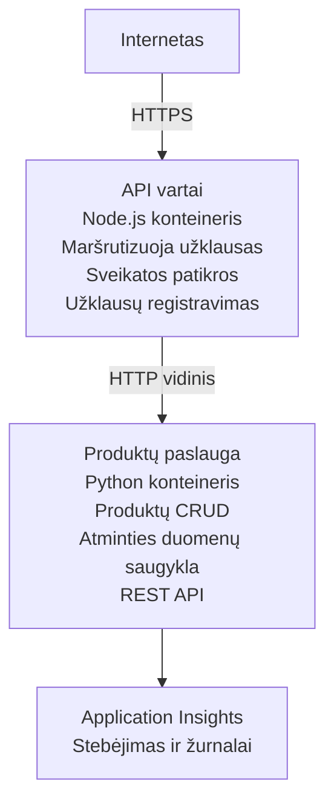

# Mikroservisų architektūra - Container App pavyzdys

⏱️ **Numatomas laikas**: 25-35 minutes | 💰 **Numatomos išlaidos**: ~$50-100/month | ⭐ **Sudėtingumas**: Pažengęs

Supaprastinta, bet funkcinė mikroservisų architektūra, diegiama į Azure Container Apps naudojant AZD CLI. Šis pavyzdys demonstruoja paslaugų tarpusavio komunikaciją, konteinerių orkestravimą ir stebėjimą praktiško 2-paslaugų konfigūracijos pavidalu.

> **📚 Mokymosi požiūris**: Šis pavyzdys prasideda nuo minimalios 2-paslaugų architektūros (API Gateway + Backend Service), kurią jūs galite iš tikrųjų diegti ir išmokti. Išmokę šias pagrindus, pateikiame rekomendacijas, kaip išplėsti į pilną mikroservisų ekosistemą.

## Ką išmoksite

Užbaigę šį pavyzdį, jūs:
- Diegsite kelis konteinerius į Azure Container Apps
- Įgyvendinsite paslaugų tarpusavio komunikaciją su vidiniu tinklu
- Konfigūruosite skalavimą pagal aplinką ir sveikatos patikras
- Stebėsite paskirstytas programas su Application Insights
- Suprasite mikroservisų diegimo modelius ir geriausias praktikas
- Išmoksite palaipsniui plėsti architektūrą nuo paprastos iki sudėtingos

## Architektūra

### Fazė 1: Ką kuriame (įtraukta šiame pavyzdyje)


**Kodėl pradėti paprastai?**
- ✅ Greitas diegimas ir supratimas (25-35 minutes)
- ✅ Išmokite pagrindinius mikroservisų modelius be sudėtingumo
- ✅ Veikiantis kodas, kurį galite keisti ir eksperimentuoti
- ✅ Mažesnės mokymosi išlaidos (~$50-100/month vs $300-1400/month)
- ✅ Sukaupkite pasitikėjimą prieš pridedant duomenų bazes ir pranešimų eiles

**Palyginimas**: Pagalvokite apie tai kaip apie vairavimo mokymąsi. Pradedate nuo tuščio stovėjimo aikštelės (2 paslaugos), įvaldote pagrindus, o tada pereinate į miesto eismą (5+ paslaugų su duomenų bazėmis).

### Fazė 2: Ateities plėtra (referencinė architektūra)

```
Full Architecture (Not Included - For Reference)
├── API Gateway (✅ Included)
├── Product Service (✅ Included)
├── Order Service (🔜 Add next)
├── User Service (🔜 Add next)
├── Notification Service (🔜 Add last)
├── Azure Service Bus (🔜 For async communication)
├── Cosmos DB (🔜 For product persistence)
├── Azure SQL (🔜 For order management)
└── Azure Storage (🔜 For file storage)
```

Žr. skyrių "Expansion Guide" gale dėl žingsnis po žingsnio instrukcijų.

## Įtrauktos funkcijos

✅ **Paslaugų atradimas**: Automatinis DNS pagrindu vykstantis atradimas tarp konteinerių  
✅ **Krovos balansas**: Integruotas krovos balansavimas tarp kopijų  
✅ **Automatinis skalavimas**: Nepriklausomas skalavimas kiekvienai paslaugai pagal HTTP užklausas  
✅ **Sveikatos stebėjimas**: Liveness ir readiness patikros abiem paslaugoms  
✅ **Paskirstytas žurnalas**: Centralizuotas žurnalas su Application Insights  
✅ **Vidinis tinklas**: Saugus paslaugų tarpusavio ryšys  
✅ **Konteinerių orkestravimas**: Automatinis diegimas ir skalavimas  
✅ **Nulinis prastovos laikas atnaujinant**: Rolling atnaujinimai su revizijų valdymu  

## Prieš pradedant

### Reikalingi įrankiai

Prieš pradėdami, įsitikinkite, kad turite įdiegę šiuos įrankius:

1. **[Azure Developer CLI (azd)](https://learn.microsoft.com/azure/developer/azure-developer-cli/install-azd)** (version 1.0.0 or higher)
   ```bash
   azd version
   # Tikėtinas išvestis: azd versija 1.0.0 arba naujesnė
   ```

2. **[Azure CLI](https://learn.microsoft.com/cli/azure/install-azure-cli)** (version 2.50.0 or higher)
   ```bash
   az --version
   # Tikėtina išvestis: azure-cli 2.50.0 arba naujesnė
   ```

3. **[Docker](https://www.docker.com/get-started)** (vietiniam vystymui/testavimui - neprivaloma)
   ```bash
   docker --version
   # Tikėtinas išvestis: Docker versija 20.10 arba naujesnė
   ```

### Azure reikalavimai

- Aktyvi **Azure subscription** ([create a free account](https://azure.microsoft.com/free/))
- Leidimai kurti išteklius jūsų prenumeratoje
- **Contributor** rolė prenumeratoje arba resursų grupėje

### Reikalingos žinios

Tai **pažengusio lygio** pavyzdys. Jums reikėtų:
- Būti užbaigę [Paprastas Flask API pavyzdys](../../../../../examples/container-app/simple-flask-api) 
- Turėti pagrindinį supratimą apie mikroservisų architektūrą
- Susipažinimą su REST API ir HTTP
- Supratimą apie konteinerių sąvokas

**Naujokas Container Apps?** Pradėkite nuo [Paprastas Flask API pavyzdys](../../../../../examples/container-app/simple-flask-api), kad išmoktumėte pagrindus.

## Greitas pradžios vadovas (žingsnis po žingsnio)

### 1 žingsnis: Klonuoti ir pereiti

```bash
git clone https://github.com/microsoft/AZD-for-beginners.git
cd AZD-for-beginners/examples/container-app/microservices
```

**✓ Sėkmės patikrinimas**: Patikrinkite, ar matote `azure.yaml`:
```bash
ls
# Tikėtasi: README.md, azure.yaml, infra/, src/
```

### 2 žingsnis: Prisijunkite prie Azure

```bash
azd auth login
```

Tai atvers jūsų naršyklę Azure autentifikacijai. Prisijunkite naudodami savo Azure paskyros duomenis.

**✓ Sėkmės patikrinimas**: Turėtumėte matyti:
```
Logged in to Azure.
```

### 3 žingsnis: Aplinkos inicijavimas

```bash
azd init
```

Matysite šiuos raginimus:
- **Environment name**: Įveskite trumpą pavadinimą (pvz., `microservices-dev`)
- **Azure subscription**: Pasirinkite savo prenumeratą
- **Azure location**: Pasirinkite regioną (pvz., `eastus`, `westeurope`)

**✓ Sėkmės patikrinimas**: Turėtumėte matyti:
```
SUCCESS: New project initialized!
```

### 4 žingsnis: Diegti infrastruktūrą ir paslaugas

```bash
azd up
```

**Kas vyksta** (užtrunka 8-12 minučių):
1. Sukuriama Container Apps aplinka
2. Sukuriamas Application Insights stebėjimui
3. Statomas API Gateway konteineris (Node.js)
4. Statomas Product Service konteineris (Python)
5. Abi konteineriai diegiami į Azure
6. Konfigūruojamas tinklas ir sveikatos patikros
7. Nustatomas stebėjimas ir žurnavimas

**✓ Sėkmės patikrinimas**: Turėtumėte matyti:
```
SUCCESS: Your application was deployed to Azure in X minutes Y seconds.
Endpoint: https://api-gateway-<unique-id>.azurecontainerapps.io
```

**⏱️ Laikas**: 8-12 minutes

### 5 žingsnis: Išbandyti diegimą

```bash
# Gauti vartų galinį tašką
GATEWAY_URL=$(azd env get-values | grep API_GATEWAY_URL | cut -d '=' -f2 | tr -d '"')

# Patikrinti API vartų būklę
curl $GATEWAY_URL/health

# Tikėtina išvestis:
# {"statusas":"veikiantis","paslauga":"api-gateway","laiko_žyma":"2025-11-19T10:30:00Z"}
```

**Išbandykite produktų paslaugą per API Gateway**:
```bash
# Produktų sąrašas
curl $GATEWAY_URL/api/products

# Tikėtinas rezultatas:
# [
#   {"id":1,"name":"Nešiojamas kompiuteris","price":999.99,"stock":50},
#   {"id":2,"name":"Pelė","price":29.99,"stock":200},
#   {"id":3,"name":"Klaviatūra","price":79.99,"stock":150}
# ]
```

**✓ Sėkmės patikrinimas**: Abu galutiniai taškai grąžina JSON duomenis be klaidų.

---

**🎉 Sveikiname!** Jūs įdiegėte mikroservisų architektūrą Azure!

## Projekto struktūra

Visi įgyvendinimo failai yra įtraukti—tai pilnas, veikiantis pavyzdys:

```
microservices/
│
├── README.md                         # This file
├── azure.yaml                        # AZD configuration
├── .gitignore                        # Git ignore patterns
│
├── infra/                           # Infrastructure as Code (Bicep)
│   ├── main.bicep                   # Main orchestration
│   ├── abbreviations.json           # Naming conventions
│   ├── core/                        # Shared infrastructure
│   │   ├── container-apps-environment.bicep  # Container environment + registry
│   │   └── monitor.bicep            # Application Insights + Log Analytics
│   └── app/                         # Service definitions
│       ├── api-gateway.bicep        # API Gateway container app
│       └── product-service.bicep    # Product Service container app
│
└── src/                             # Application source code
    ├── api-gateway/                 # Node.js API Gateway
    │   ├── app.js                   # Express server with routing
    │   ├── package.json             # Node dependencies
    │   └── Dockerfile               # Container definition
    └── product-service/             # Python Product Service
        ├── main.py                  # Flask API with product data
        ├── requirements.txt         # Python dependencies
        └── Dockerfile               # Container definition
```

**Ką daro kiekvienas komponentas:**

**Infrastruktūra (infra/)**:
- `main.bicep`: Orkestras visiems Azure ištekliams ir jų priklausomybėms
- `core/container-apps-environment.bicep`: Sukuria Container Apps aplinką ir Azure Container Registry
- `core/monitor.bicep`: Nustato Application Insights paskirstytam žurnavimui
- `app/*.bicep`: Atskirų container app apibrėžimai su skalavimu ir sveikatos patikromis

**API Gateway (src/api-gateway/)**:
- Viešai prieinama paslauga, kuri nukreipia užklausas į backend paslaugas
- Įgyvendina žurnavimą, klaidų valdymą ir užklausų persiuntimą
- Demonstruoja paslaugų tarpusavio HTTP komunikaciją

**Product Service (src/product-service/)**:
- Vidinė paslauga su produktų katalogu (traukiama atmintyje supaprastinimui)
- REST API su sveikatos patikromis
- Pavyzdys backend mikroserviso modelio

## Paslaugų apžvalga

### API Gateway (Node.js/Express)

**Portas**: 8080  
**Prieiga**: Vieša (išorinis prieigos taškas)  
**Paskirtis**: Nukreipti įeinančias užklausas į atitinkamas backend paslaugas  

**Galutiniai taškai**:
- `GET /` - Serviso informacija
- `GET /health` - Sveikatos patikros taškas
- `GET /api/products` - Persiunčiama į product service (visų sąrašas)
- `GET /api/products/:id` - Persiunčiama į product service (gauti pagal ID)

**Pagrindinės funkcijos**:
- Užklausų maršrutizavimas su axios
- Centralizuotas žurnavimas
- Klaidų valdymas ir laiko apribojimų tvarkymas
- Paslaugų atradimas per aplinkos kintamuosius
- Application Insights integracija

**Kodo ištrauka** (`src/api-gateway/app.js`):
```javascript
// Vidinė paslaugų komunikacija
app.get('/api/products', async (req, res) => {
  const response = await axios.get(`${PRODUCT_SERVICE_URL}/products`);
  res.json(response.data);
});
```

### Product Service (Python/Flask)

**Portas**: 8000  
**Prieiga**: Tik vidinė (nėra išorinio prieigos taško)  
**Paskirtis**: Tvarko produktų katalogą naudodamas atmintyje laikomus duomenis  

**Galutiniai taškai**:
- `GET /` - Serviso informacija
- `GET /health` - Sveikatos patikros taškas
- `GET /products` - Išvardina visus produktus
- `GET /products/<id>` - Gaukite produktą pagal ID

**Pagrindinės funkcijos**:
- RESTful API su Flask
- Produktų saugykla atmintyje (paprasta, nereikia duomenų bazės)
- Sveikatos stebėjimas su probe'ais
- Struktūruotas žurnavimas
- Application Insights integracija

**Duomenų modelis**:
```python
{
  "id": 1,
  "name": "Laptop",
  "description": "High-performance laptop",
  "price": 999.99,
  "stock": 50
}
```

**Kodėl tik vidinė?**
Product service nėra viešai prieinama. Visos užklausos turi eiti per API Gateway, kuris suteikia:
- Saugumą: Kontroliuojamas prieigos taškas
- Lankstumą: Galimybė keisti backend be poveikio klientams
- Stebėjimą: Centralizuotas užklausų žurnavimas

## Paslaugų komunikacijos supratimas

### Kaip paslaugos bendrauja tarpusavyje

Šiame pavyzdyje API Gateway komunikuoja su Product Service naudojant **vidines HTTP užklausas**:

```javascript
// API vartai (src/api-gateway/app.js)
const PRODUCT_SERVICE_URL = process.env.PRODUCT_SERVICE_URL;

// Atlikti vidinę HTTP užklausą
const response = await axios.get(`${PRODUCT_SERVICE_URL}/products`);
```

**Pagrindiniai punktai**:

1. **DNS pagrindu veikiantis atradimas**: Container Apps automatiškai suteikia DNS vidinėms paslaugoms
   - Product Service FQDN: `product-service.internal.<environment>.azurecontainerapps.io`
   - Supaprastinta: `http://product-service` (Container Apps jį išsprendžia)

2. **Nėra viešo prieigos**: Product Service turi `external: false` Bicep faile
   - Prieinama tik Container Apps aplinkoje
   - Iš interneto jos pasiekti negalima

3. **Aplinkos kintamieji**: Paslaugų URL įjungiami diegimo metu
   - Bicep perduoda vidinį FQDN gateway'ui
   - Programiniame kode nėra įkoduotų URL

**Palyginimas**: Pagalvokite apie tai kaip apie biuro kambarius. API Gateway yra registratūra (vieša), o Product Service yra biuro kambarys (tik vidinis). Aplankytojai turi eiti per registratūrą, kad pasiektų bet kurį kambarį.

## Diegimo parinktys

### Pilnas diegimas (rekomenduojama)

```bash
# Išdiegti infrastruktūrą ir abi paslaugas
azd up
```

Tai diegia:
1. Container Apps aplinką
2. Application Insights
3. Container Registry
4. API Gateway konteinerį
5. Product Service konteinerį

**Laikas**: 8-12 minučių

### Diegti atskirą paslaugą

```bash
# Diegti tik vieną paslaugą (po pradinio azd up)
azd deploy api-gateway

# Arba diegti produkto paslaugą
azd deploy product-service
```

**Naudojimo atvejis**: Kai atnaujinote kodo vienoje paslaugoje ir norite iš naujo diegti tik tą paslaugą.

### Atnaujinti konfigūraciją

```bash
# Pakeisti mastelio parametrus
azd env set GATEWAY_MAX_REPLICAS 30

# Iš naujo diegti su nauja konfigūracija
azd up
```

## Konfigūracija

### Skalavimo konfigūracija

Abi paslaugos yra sukonfigūruotos su HTTP pagrindu veikiančiu automatinio skalavimo mechanizmu jų Bicep failuose:

**API Gateway**:
- Min. kopijų skaičius: 2 (visada bent 2 dėl prieinamumo)
- Maks. kopijų skaičius: 20
- Skalavimo trigeris: 50 vienu metu vykstančių užklausų vienai kopijai

**Product Service**:
- Min. kopijų skaičius: 1 (gali skalėti iki nulio, jei reikia)
- Maks. kopijų skaičius: 10
- Skalavimo trigeris: 100 vienu metu vykstančių užklausų vienai kopijai

**Pritaikyti skalavimą** (faile `infra/app/*.bicep`):
```bicep
scale: {
  minReplicas: 1
  maxReplicas: 10
  rules: [
    {
      name: 'http-scale-rule'
      http: {
        metadata: {
          concurrentRequests: '100'  // Adjust this
        }
      }
    }
  ]
}
```

### Išteklių paskirstymas

**API Gateway**:
- CPU: 1.0 vCPU
- Atmintis: 2 GiB
- Priežastis: Apdoroja visą išorinį srautą

**Product Service**:
- CPU: 0.5 vCPU
- Atmintis: 1 GiB
- Priežastis: Lengvos atminties operacijos

### Sveikatos patikros

Abi paslaugos apima liveness ir readiness probe'us:

```bicep
probes: [
  {
    type: 'Liveness'
    httpGet: {
      path: '/health'
      port: 8080
    }
    initialDelaySeconds: 10
    periodSeconds: 30
  }
  {
    type: 'Readiness'
    httpGet: {
      path: '/health'
      port: 8080
    }
    initialDelaySeconds: 5
    periodSeconds: 10
  }
]
```

**Ką tai reiškia**:
- **Liveness**: Jei sveikatos patikra nepraeina, Container Apps perkrauna konteinerį
- **Readiness**: Jei paslauga nėra paruošta, Container Apps nustoja siųsti srautą į tą kopiją


## Stebėjimas ir matomumas

### Peržiūrėti paslaugų žurnalus

```bash
# Peržiūrėkite žurnalus naudodami azd monitor
azd monitor --logs

# Arba naudokite Azure CLI konkretiems Container Apps:
# Srautiniu būdu peržiūrėkite žurnalus iš API Gateway
az containerapp logs show --name api-gateway --resource-group $RG_NAME --follow

# Peržiūrėkite naujausius produkto paslaugos žurnalus
az containerapp logs show --name product-service --resource-group $RG_NAME --tail 100
```

**Tikėtinas išvestis**:
```
[api-gateway] API Gateway listening on port 8080
[api-gateway] Product Service URL: http://product-service
[api-gateway] GET /api/products 200 - 45ms
[product-service] Retrieved 5 products
```

### Application Insights užklausos

Pereikite į Application Insights Azure portale, tada vykdykite šias užklausas:

**Rasti lėtas užklausas**:
```kusto
requests
| where timestamp > ago(1h)
| where duration > 1000  // Requests taking >1 second
| summarize count() by name, cloud_RoleName
| order by count_ desc
```

**Stebėti paslaugų tarpusavio skambučius**:
```kusto
dependencies
| where timestamp > ago(1h)
| where type == "Http"
| project timestamp, name, target, duration, success
| order by timestamp desc
```

**Klaidų dažnis pagal paslaugą**:
```kusto
exceptions
| where timestamp > ago(24h)
| summarize errorCount = count() by cloud_RoleName, type
| order by errorCount desc
```

**Užklausų kiekis per laiką**:
```kusto
requests
| where timestamp > ago(1h)
| summarize requestCount = count() by bin(timestamp, 5m), cloud_RoleName
| render timechart
```

### Prieiga prie stebėjimo skydelio

```bash
# Gauti Application Insights informaciją
azd env get-values | grep APPLICATIONINSIGHTS

# Atidaryti Azure portalo stebėjimą
az monitor app-insights component show \
  --app $(azd env get-values | grep APPLICATIONINSIGHTS_CONNECTION_STRING | cut -d '=' -f2) \
  --resource-group $(azd env get-values | grep AZURE_RESOURCE_GROUP | cut -d '=' -f2) \
  --query "appId" -o tsv
```

### Tiesioginiai metrikai

1. Pereikite į Application Insights Azure portale
2. Spustelėkite "Live Metrics"
3. Matykite realaus laiko užklausas, klaidas ir našumą
4. Išbandykite paleisdami: `curl $(azd env get-values | grep API_GATEWAY_URL | cut -d '=' -f2 | tr -d '"')/api/products`

## Praktiniai pratimai

[Pastaba: Žr. visus pratimus aukščiau skyriuje "Praktiniai pratimai" dėl išsamių žingsnis po žingsnio instrukcijų, įskaitant diegimo patikrinimą, duomenų keitimą, automatinio skalavimo testus, klaidų tvarkymą ir trečios paslaugos pridėjimą.]

## Kainų analizė

### Numatomos mėnesinės išlaidos (šiam 2 paslaugų pavyzdžiui)

| Ištekliai | Konfigūracija | Numatomos išlaidos |
|----------|--------------|----------------|
| API Gateway | 2-20 replicas, 1 vCPU, 2GB RAM | $30-150 |
| Product Service | 1-10 replicas, 0.5 vCPU, 1GB RAM | $15-75 |
| Container Registry | Basic tier | $5 |
| Application Insights | 1-2 GB/month | $5-10 |
| Log Analytics | 1 GB/month | $3 |
| **Iš viso** | | **$58-243/month** |

**Išlaidų paskirstymas pagal naudojimą**:
- **Mažas srautas** (testavimas/mokymasis): ~$60/month
- **Vidutinis srautas** (maža produkcija): ~$120/month
- **Didelis srautas** (sukrauti periodai): ~$240/month

### Patarimai išlaidoms optimizuoti

1. **Skalavimas iki nulio vystymui**:
   ```bicep
   scale: {
     minReplicas: 0  // Save $30-40/month when not in use
     maxReplicas: 10
   }
   ```

2. **Naudokite Consumption Plan Cosmos DB** (kai jį pridėsite):
   - Mokėkite tik už tai, ką naudojate
   - Nėra minimalaus mokesčio

3. **Nustatykite Application Insights samplinimą**:
   ```javascript
   appInsights.defaultClient.config.samplingPercentage = 50; // Atrinkti 50% užklausų
   ```

4. **Išvalykite, kai nereikia**:
   ```bash
   azd down
   ```

### Nemokamos pakopos parinktys

Mokymuisi/testavimui apsvarstykite:
- Naudokite Azure nemokamus kreditus (per pirmąsias 30 dienų)
- Laikykite minimalų replikų skaičių
- Ištrinkite po testavimo (nereikės nuolatinių mokesčių)

---

## Išvalymas

Norint išvengti nuolatinių mokesčių, ištrinkite visus išteklius:

```bash
azd down --force --purge
```

**Patvirtinimo raginimas**:
```
? Total resources to delete: 6, are you sure you want to continue? (y/N)
```

Įveskite `y`, norėdami patvirtinti.

**Kas bus ištrinta**:
- Container Apps Environment
- Abi Container Apps (gateway ir product service)
- Container Registry
- Application Insights
- Log Analytics Workspace
- Resource Group

**✓ Patikrinkite išvalymą**:
```bash
az group list --query "[?starts_with(name,'rg-microservices')]" --output table
```

Turėtų grąžinti tuščią.

---

## Plėtros gidas: nuo 2 iki 5+ paslaugų

Kai įvaldysite šią 2 paslaugų architektūrą, štai kaip ją išplėsti:

### Phase 1: Add Database Persistence (Next Step)

**Pridėti Cosmos DB produktų paslaugai**:

1. Create `infra/core/cosmos.bicep`:
   ```bicep
   resource cosmosAccount 'Microsoft.DocumentDB/databaseAccounts@2023-04-15' = {
     name: name
     location: location
     kind: 'GlobalDocumentDB'
     properties: {
       databaseAccountOfferType: 'Standard'
       locations: [{ locationName: location, failoverPriority: 0 }]
     }
   }
   ```

2. Atnaujinkite product service, kad naudotų Cosmos DB vietoje atmintyje laikomų duomenų

3. Apskaičiuotos papildomos sąnaudos: ~$25/mėn (serverless)

### Phase 2: Add Third Service (Order Management)

**Sukurti Order Service**:

1. Naujas aplankas: `src/order-service/` (Python/Node.js/C#)
2. Naujas Bicep: `infra/app/order-service.bicep`
3. Atnaujinkite API Gateway, kad nukreiptų `/api/orders`
4. Pridėkite Azure SQL Database užsakymų saugojimui

**Architektūra tampa**:
```
API Gateway → Product Service (Cosmos DB)
           → Order Service (Azure SQL)
```

### Phase 3: Add Async Communication (Service Bus)

**Įgyvendinti įvykių valdomą architektūrą**:

1. Pridėkite Azure Service Bus: `infra/core/servicebus.bicep`
2. Product Service publikuoja "ProductCreated" įvykius
3. Order Service užsiprenumeruoja produktų įvykius
4. Pridėkite Notification Service įvykiams apdoroti

**Šablonas**: Request/Response (HTTP) + Event-Driven (Service Bus)

### Phase 4: Add User Authentication

**Įdiegti User Service**:

1. Sukurkite `src/user-service/` (Go/Node.js)
2. Pridėkite Azure AD B2C arba pasirinktą JWT autentifikaciją
3. API Gateway tikrina tokenus
4. Paslaugos tikrina vartotojo teises

### Phase 5: Production Readiness

**Pridėkite šiuos komponentus**:
- Azure Front Door (globalus apkrovos balansavimas)
- Azure Key Vault (slaptų valdymas)
- Azure Monitor Workbooks (pritaikomos ataskaitos)
- CI/CD Pipeline (GitHub Actions)
- Blue-Green diegimai
- Managed Identity visoms paslaugoms

**Pilnos gamybinės architektūros kaina**: ~$300-1,400/mėn

---

## Sužinokite daugiau

### Susijusi dokumentacija
- [Azure Container Apps Documentation](https://learn.microsoft.com/azure/container-apps/)
- [Microservices Architecture Guide](https://learn.microsoft.com/azure/architecture/guide/architecture-styles/microservices)
- [Application Insights for Distributed Tracing](https://learn.microsoft.com/azure/azure-monitor/app/distributed-tracing)
- [Azure Developer CLI Documentation](https://learn.microsoft.com/azure/developer/azure-developer-cli/)

### Tolimesni žingsniai šiame kurse
- ← Ankstesnis: [Simple Flask API](../../../../../examples/container-app/simple-flask-api) - Pradedančiųjų vieno konteinerio pavyzdys
- → Kitas: [AI Integration Guide](../../../../../examples/docs/ai-foundry) - Pridėti AI galimybes
- 🏠 [Kurso pradžia](../../README.md)

### Palyginimas: kada naudoti ką

**Vieno konteinerio programa** (Simple Flask API pavyzdys):
- ✅ Paprastos programos
- ✅ Monolitinė architektūra
- ✅ Greitas diegimas
- ❌ Ribotas mastelis
- **Kaina**: ~$15-50/mėn

**Mikroservisai** (Šis pavyzdys):
- ✅ Sudėtingos programos
- ✅ Nepriklausomas mastelio keitimas kiekvienai paslaugai
- ✅ Komandų autonomija (skirtingos paslaugos, skirtingos komandos)
- ❌ Sudėtingesnis valdymas
- **Kaina**: ~$60-250/mėn

**Kubernetes (AKS)**:
- ✅ Maksimali kontrolė ir lankstumas
- ✅ Daugiacloud perkeliamumas
- ✅ Pažangus tinklo valdymas
- ❌ Reikalauja Kubernetes įgūdžių
- **Kaina**: ~$150-500/mėn minimaliai

**Rekomendacija**: Pradėkite nuo Container Apps (šis pavyzdys), pereikite prie AKS tik jei jums reikia Kubernetes specifinių funkcijų.

---

## Dažnai užduodami klausimai

**Q: Why only 2 services instead of 5+?**  
A: Educational progression. Įvaldykite pagrindus (servisų tarpusavio ryšys, stebėjimas, mastelio keitimas) su paprastu pavyzdžiu prieš pridėdami sudėtingumą. Šablonai, kuriuos čia išmokstate, taikomi ir 100 paslaugų architektūroms.

**Q: Can I add more services myself?**  
A: Absolutely! Vadovaukitės aukščiau pateiktu plėtros gidu. Kiekviena nauja paslauga seka tą patį modelį: sukurkite src aplanką, sukurkite Bicep failą, atnaujinkite azure.yaml, išdiekite.

**Q: Is this production-ready?**  
A: It's a solid foundation. Gamybai pridėkite: managed identity, Key Vault, nuolatinės duomenų bazės, CI/CD pipeline, stebėjimo įspėjimai ir atsarginių kopijų strategija.

**Q: Why not use Dapr or other service mesh?**  
A: Laikykite paprastą mokymuisi. Kai suprasite natūralią Container Apps tinklo veiklą, galėsite pridėti Dapr pažangesnėms scenarijoms.

**Q: How do I debug locally?**  
A: Vykdykite paslaugas vietoje su Docker:
```bash
cd src/api-gateway
docker build -t local-gateway .
docker run -p 8080:8080 -e PRODUCT_SERVICE_URL=http://localhost:8000 local-gateway
```

**Q: Can I use different programming languages?**  
A: Yes! Šis pavyzdys rodo Node.js (gateway) + Python (product service). Galite maišyti bet kokias kalbas, kurios paleidžiamos konteineriuose.

**Q: What if I don't have Azure credits?**  
A: Naudokite Azure nemokamą pakopą (per pirmąsias 30 dienų su naujais paskyromis) arba diekite trumpam bandymui ir ištrinkite iškart.

---

> **🎓 Mokymosi kelio santrauka**: Išmokote diegti daugiapaslaugę architektūrą su automatiniu mastelio keitimu, vidiniu tinklu, centralizuotu stebėjimu ir gamybai tinkamais šablonais. Šis pagrindas paruošia jus sudėtingoms paskirstytoms sistemoms ir įmonių mikroservisų architektūroms.

**📚 Kurso navigacija:**
- ← Ankstesnis: [Simple Flask API](../../../../../examples/container-app/simple-flask-api)
- → Kitas: [Database Integration Example](../../../../../examples/database-app)
- 🏠 [Kurso pradžia](../../../README.md)
- 📖 [Container Apps Best Practices](../../../docs/chapter-04-infrastructure/deployment-guide.md)

---

<!-- CO-OP TRANSLATOR DISCLAIMER START -->
**Atsakomybės apribojimas**:
Šis dokumentas buvo išverstas naudojant dirbtinio intelekto vertimo paslaugą [Co-op Translator](https://github.com/Azure/co-op-translator). Nors stengiamės užtikrinti tikslumą, atkreipkite dėmesį, kad automatiniai vertimai gali turėti klaidų ar netikslumų. Originalus dokumentas jo gimtąja kalba turėtų būti laikomas autoritetingu šaltiniu. Dėl kritinės informacijos rekomenduojama naudotis profesionalaus vertėjo paslaugomis. Mes neatsakome už jokius nesusipratimus ar neteisingas interpretacijas, kylančias dėl šio vertimo naudojimo.
<!-- CO-OP TRANSLATOR DISCLAIMER END -->