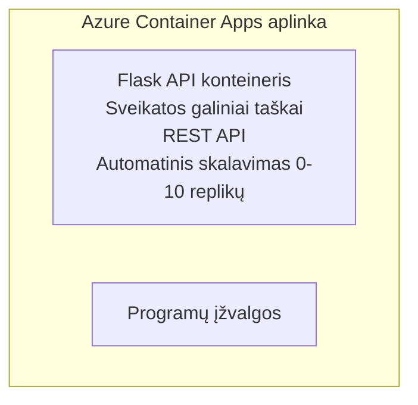

# Paprastas Flask API - Container App pavyzdys

**Mokymosi kelias:** Pradedantiesiems ⭐ | **Laikas:** 25-35 minučių | **Kaina:** $0-15/mėn

Pilnas, veikiantis Python Flask REST API, diegiamas į Azure Container Apps naudojant Azure Developer CLI (azd). Šis pavyzdys demonstruoja konteinerių diegimą, automatinį mastelio keitimą ir stebėjimo pagrindus.

## 🎯 Ką išmoksite

- Diegti konteineryje supakuotą Python programą į Azure
- Konfigūruoti automatinį mastelio keitimą su scale-to-zero
- Įdiegti sveikatos patikras ir pasirengimo patikrinimus
- Stebėti programos žurnalus ir metrikas
- Naudoti Azure Developer CLI greitam diegimui

## 📦 Kas įtraukta

✅ **Flask Application** - Pilnas REST API su CRUD operacijomis (`src/app.py`)  
✅ **Dockerfile** - Gamybai pasiruošusi konteinerio konfigūracija  
✅ **Bicep Infrastructure** - Container Apps aplinka ir API diegimas  
✅ **AZD Configuration** - Vieno komandos diegimo nustatymas  
✅ **Health Probes** - Konfigūruoti liveness ir readiness patikrinimai  
✅ **Auto-scaling** - 0-10 replikų pagal HTTP apkrovą  

## Architektūra


## Reikalavimai

### Reikalinga
- **Azure Developer CLI (azd)** - [Įdiegimo vadovas](https://learn.microsoft.com/azure/developer/azure-developer-cli/install-azd)
- **Azure subscription** - [Nemokama paskyra](https://azure.microsoft.com/free/)
- **Docker Desktop** - [Install Docker](https://www.docker.com/products/docker-desktop/) (lokaliam testavimui)

### Patikrinkite reikalavimus

```bash
# Patikrinkite azd versiją (reikalinga 1.5.0 arba naujesnė)
azd version

# Patikrinkite prisijungimą prie Azure
azd auth login

# Patikrinkite Docker (nebūtina, vietiniam testavimui)
docker --version
```

## ⏱️ Diegimo laikas

| Phase | Duration | What Happens |
|-------|----------|--------------||
| Environment setup | 30 seconds | Create azd environment |
| Build container | 2-3 minutes | Docker build Flask app |
| Provision infrastructure | 3-5 minutes | Create Container Apps, registry, monitoring |
| Deploy application | 2-3 minutes | Push image and deploy to Container Apps |
| **Total** | **8-12 minutes** | Complete deployment ready |

## Greitas startas

```bash
# Eikite į pavyzdį
cd examples/container-app/simple-flask-api

# Inicializuokite aplinką (pasirinkite unikalų pavadinimą)
azd env new myflaskapi

# Diegti viską (infrastruktūrą + programą)
azd up
# Jums bus paprašyta:
# 1. Pasirinkite Azure prenumeratą
# 2. Pasirinkite vietą (pvz., eastus2)
# 3. Palaukite 8–12 minučių, kol diegimas bus baigtas

# Gaukite savo API galinį tašką
azd env get-values

# Išbandykite API
curl $(azd env get-value API_ENDPOINT)/health
```

**Tikėtinas rezultatas:**
```json
{
  "status": "healthy",
  "timestamp": "2025-11-19T10:30:00Z",
  "service": "simple-flask-api",
  "version": "1.0.0"
}
```

## ✅ Patikrinkite diegimą

### 1. žingsnis: Patikrinkite diegimo būseną

```bash
# Peržiūrėti įdiegtas paslaugas
azd show

# Tikėtina išvestis rodo:
# - Paslauga: api
# - Galinis taškas: https://ca-api-[env].xxx.azurecontainerapps.io
# - Būsena: Veikia
```

### 2. žingsnis: Išbandykite API galinius taškus

```bash
# Gauti API galinį tašką
API_URL=$(azd env get-value API_ENDPOINT)

# Sveikatos patikra
curl $API_URL/health

# Šaknies galinio taško patikra
curl $API_URL/

# Sukurti elementą
curl -X POST $API_URL/api/items \
  -H "Content-Type: application/json" \
  -d '{"name": "Test Item", "description": "My first item"}'

# Gauti visus elementus
curl $API_URL/api/items
```

**Sėkmės kriterijai:**
- ✅ Sveikatos galinis taškas grąžina HTTP 200
- ✅ Šakninis galinis taškas rodo API informaciją
- ✅ POST sukuria elementą ir grąžina HTTP 201
- ✅ GET grąžina sukurtus elementus

### 3. žingsnis: Peržiūrėkite žurnalus

```bash
# Tiesiogiai srautiniu būdu peržiūrėkite žurnalus naudodami azd monitor
azd monitor --logs

# Arba naudokite Azure CLI:
az containerapp logs show --name api --resource-group $RG_NAME --follow

# Turėtumėte matyti:
# - Gunicorn paleidimo pranešimus
# - HTTP užklausų žurnalus
# - Programos informacijos žurnalus
```

## Projekto struktūra

```
simple-flask-api/
├── azure.yaml              # AZD configuration
├── infra/
│   ├── main.bicep         # Main infrastructure
│   ├── main.parameters.json
│   └── app/
│       ├── container-env.bicep
│       └── api.bicep
└── src/
    ├── app.py             # Flask application
    ├── requirements.txt
    └── Dockerfile
```

## API galiniai taškai

| Endpoint | Method | Description |
|----------|--------|-------------|
| `/health` | GET | Sveikatos patikra |
| `/api/items` | GET | Išvardinti visus elementus |
| `/api/items` | POST | Sukurti naują elementą |
| `/api/items/{id}` | GET | Gauti konkretų elementą |
| `/api/items/{id}` | PUT | Atnaujinti elementą |
| `/api/items/{id}` | DELETE | Ištrinti elementą |

## Konfigūracija

### Aplinkos kintamieji

```bash
# Nustatyti pasirinktinius nustatymus
azd env set PORT 8000
azd env set LOG_LEVEL info
azd env set MAX_REPLICAS 20
```

### Mastelio konfigūracija

API automatiškai masteliuojasi pagal HTTP srautą:
- **Min Replicas**: 0 (masteliuojasi iki nulio kai nenaudojama)
- **Max Replicas**: 10
- **Concurrent Requests per Replica**: 50

## Vystymas

### Paleisti lokaliai

```bash
# Įdiegti priklausomybes
cd src
pip install -r requirements.txt

# Paleisti programą
python app.py

# Testuoti lokaliai
curl http://localhost:8000/health
```

### Sukurti ir išbandyti konteinerį

```bash
# Sukurti Docker atvaizdą
docker build -t flask-api:local ./src

# Paleisti konteinerį lokaliai
docker run -p 8000:8000 flask-api:local

# Išbandyti konteinerį
curl http://localhost:8000/health
```

## Diegimas

### Pilnas diegimas

```bash
# Diegti infrastruktūrą ir programą
azd up
```

### Tik kodo diegimas

```bash
# Diegti tik programos kodą (infrastruktūra nepakitusi)
azd deploy api
```

### Atnaujinti konfigūraciją

```bash
# Atnaujinti aplinkos kintamuosius
azd env set API_KEY "new-api-key"

# Perdiegti su nauja konfigūracija
azd deploy api
```

## Stebėjimas

### Peržiūrėti žurnalus

```bash
# Srautiniu būdu peržiūrėkite tiesioginius žurnalus naudodami azd monitor
azd monitor --logs

# Arba naudokite Azure CLI, skirtą Container Apps:
az containerapp logs show --name api --resource-group $RG_NAME --follow

# Peržiūrėkite paskutines 100 eilučių
az containerapp logs show --name api --resource-group $RG_NAME --tail 100
```

### Stebėti metrikas

```bash
# Atidaryti Azure Monitor prietaisų skydelį
azd monitor --overview

# Peržiūrėti konkrečius rodiklius
az monitor metrics list \
  --resource $(azd show --output json | jq -r '.services.api.resourceId') \
  --metric "Requests,ResponseTime"
```

## Testavimas

### Sveikatos patikra

```bash
curl $(azd show --output json | jq -r '.services.api.endpoint')/health
```

Tikėtinas atsakymas:
```json
{
  "status": "healthy",
  "timestamp": "2025-11-19T10:30:00Z"
}
```

### Sukurti elementą

```bash
curl -X POST $(azd show --output json | jq -r '.services.api.endpoint')/api/items \
  -H "Content-Type: application/json" \
  -d '{"name": "Test Item", "description": "A test item"}'
```

### Gauti visus elementus

```bash
curl $(azd show --output json | jq -r '.services.api.endpoint')/api/items
```

## Išlaidų optimizavimas

Šis diegimas naudoja scale-to-zero, todėl mokate tik tada, kai API apdoroja užklausas:

- **Budėjimo kaina**: ~$0/mėn (masteliuojama iki nulio)
- **Aktyvi kaina**: ~$0.000024/sekundę už repliką
- **Tikėtinos mėnesinės išlaidos** (mažas naudojimas): $5-15

### Dar labiau sumažinti išlaidas

```bash
# Sumažinti maksimalų replikų skaičių vystymo aplinkai
azd env set MAX_REPLICAS 3

# Naudoti trumpesnį neveikimo laiko limitą
azd env set SCALE_TO_ZERO_TIMEOUT 300  # 5 minutės
```

## Trikčių šalinimas

### Konteineris nepaleidžiamas

```bash
# Patikrinkite konteinerio žurnalus naudodami Azure CLI
az containerapp logs show --name api --resource-group $RG_NAME --tail 100

# Patikrinkite, ar Docker atvaizdas kuriamas lokaliai
docker build -t test ./src
```

### API nepasiekiamas

```bash
# Patikrinkite, ar ingress yra išorinis
az containerapp show --name api --resource-group rg-simple-flask-api \
  --query properties.configuration.ingress.external
```

### Ilgi atsakymo laikai

```bash
# Patikrinti CPU/atminties naudojimą
az monitor metrics list \
  --resource $(azd show --output json | jq -r '.services.api.resourceId') \
  --metric "CPUPercentage,MemoryPercentage"

# Padidinti išteklius, jei reikia
az containerapp update --name api --resource-group rg-simple-flask-api \
  --cpu 1.0 --memory 2Gi
```

## Išvalymas

```bash
# Ištrinti visus išteklius
azd down --force --purge
```

## Kiti žingsniai

### Išplėsti šį pavyzdį

1. **Pridėti duomenų bazę** - Integruoti Azure Cosmos DB arba SQL Database
   ```bash
   # Pridėti Cosmos DB modulį į infra/main.bicep
   # Atnaujinti app.py su duomenų bazės prisijungimu
   ```

2. **Pridėti autentifikaciją** - Įgyvendinti Azure AD arba API raktus
   ```python
   # Pridėti autentifikavimo middleware į app.py
   from functools import wraps
   ```

3. **Sukurti CI/CD** - GitHub Actions darbo eiga
   ```yaml
   # Create .github/workflows/deploy.yml
   name: Deploy to Azure
   on: [push]
   ```

4. **Pridėti valdomą identitetą** - Užtikrinti saugų prieigą prie Azure paslaugų
   ```bicep
   # Update infra/app/api.bicep
   identity: { type: 'SystemAssigned' }
   ```

### Susiję pavyzdžiai

- **[Duomenų bazės programa](../../../../../examples/database-app)** - Pilnas pavyzdys su SQL Database
- **[Mikropaslaugos](../../../../../examples/container-app/microservices)** - Daugiapaslaugė architektūra
- **[Container Apps pagrindinis vadovas](../README.md)** - Visi konteinerių šablonai

### Mokymosi ištekliai

- 📚 [AZD pradedantiesiems kursas](../../../README.md) - Pagrindinė kurso pradžia
- 📚 [Container Apps Patterns](../README.md) - Daugiau diegimo šablonų
- 📚 [AZD Templates Gallery](https://azure.github.io/awesome-azd/) - Bendruomenės šablonai

## Papildomi ištekliai

### Dokumentacija
- **[Flask Documentation](https://flask.palletsprojects.com/)** - Flask karkaso vadovas
- **[Azure Container Apps](https://learn.microsoft.com/azure/container-apps/)** - Oficialūs Azure dokumentai
- **[Azure Developer CLI](https://learn.microsoft.com/azure/developer/azure-developer-cli/)** - azd komandų referencija

### Vadovėliai
- **[Container Apps Quickstart](https://learn.microsoft.com/azure/container-apps/quickstart-portal)** - Išdiekite savo pirmąją programą
- **[Python on Azure](https://learn.microsoft.com/azure/developer/python/)** - Python vystymo gidas
- **[Bicep Language](https://learn.microsoft.com/azure/azure-resource-manager/bicep/)** - Infrastruktūra kaip kodas

### Įrankiai
- **[Azure Portal](https://portal.azure.com)** - Valdykite išteklius vizualiai
- **[VS Code Azure Extension](https://marketplace.visualstudio.com/items?itemName=ms-azuretools.vscode-azurecontainerapps)** - IDE integracija

---

**🎉 Sveikiname!** Jūs įdiegėte gamybai parengtą Flask API į Azure Container Apps su automatinio mastelio keitimu ir stebėjimu.

**Klausimų?** [Atidaryti problemą](https://github.com/microsoft/AZD-for-beginners/issues) arba peržiūrėkite [DUK](../../../resources/faq.md)

---

<!-- CO-OP TRANSLATOR DISCLAIMER START -->
**Atsakomybės apribojimas**:
Šis dokumentas buvo išverstas naudojant dirbtinio intelekto vertimo paslaugą [Co-op Translator](https://github.com/Azure/co-op-translator). Nors siekiame tikslumo, prašome atkreipti dėmesį, kad automatizuoti vertimai gali turėti klaidų ar netikslumų. Originalus dokumentas jo gimtąja kalba turėtų būti laikomas autoritetingu šaltiniu. Kritinei informacijai rekomenduojamas profesionalus žmogaus atliktas vertimas. Mes neatsakome už jokius nesusipratimus ar neteisingas interpretacijas, kilusias dėl šio vertimo naudojimo.
<!-- CO-OP TRANSLATOR DISCLAIMER END -->