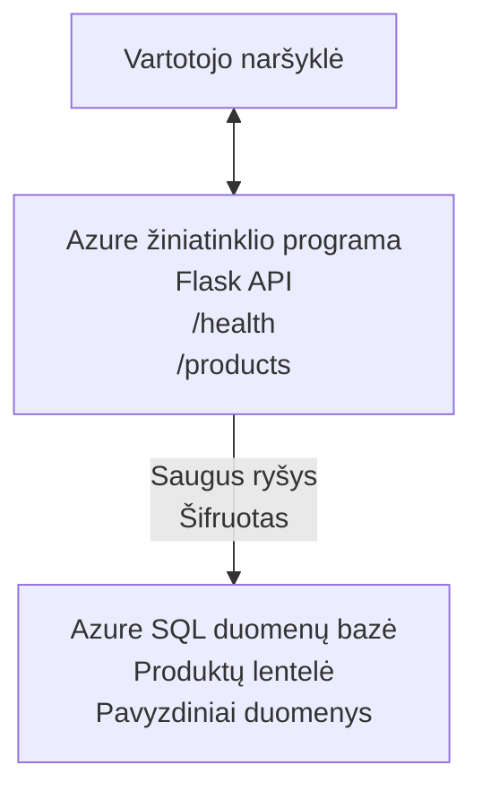

# Diegiame Microsoft SQL duomenų bazę ir žiniatinklio programą su AZD

⏱️ **Numatomas laikas**: 20–30 minučių | 💰 **Numatoma kaina**: ~$15-25/mėn. | ⭐ **Sudėtingumas**: Vidutinis

Šis **pilnas, veikiantis pavyzdys** parodo, kaip naudoti [Azure Developer CLI (azd)](https://learn.microsoft.com/azure/developer/azure-developer-cli/) diegiant Python Flask žiniatinklio programą su Microsoft SQL duomenų baze į Azure. Visi kodai įtraukti ir išbandyti — jokių išorinių priklausomybių nereikia.

## Ko išmoksite

Baigę šį pavyzdį jūs:
- Įdiegsite daugiapakopę programą (žiniatinklio programa + duomenų bazė) naudodami infrastruktūrą kaip kodą
- Suversite saugius duomenų bazės ryšius be slaptažodžių kietojo kodo
- Stebėsite programos būklę su Application Insights
- Efektyviai valdysite Azure išteklius su AZD CLI
- Vadovausitės Azure geriausia praktika saugumo, kaštų optimizavimo ir stebėsenos srityse

## Scenarijaus apžvalga
- **Žiniatinklio programa**: Python Flask REST API su duomenų bazės ryšiu
- **Duomenų bazė**: Azure SQL Database su pavyzdiniais duomenimis
- **Infrastruktūra**: Paruošta naudojant Bicep (modulinės, pakartotinai naudojamos šablonai)
- **Diegimas**: Pilnai automatizuotas su `azd` komandomis
- **Stebėsena**: Application Insights žurnalams ir telemetrijai

## Reikalavimai

### Reikalingi įrankiai

Prieš pradėdami, įsitikinkite, kad turite įdiegtus šiuos įrankius:

1. **[Azure CLI](https://learn.microsoft.com/cli/azure/install-azure-cli)** (versija 2.50.0 arba naujesnė)
   ```sh
   az --version
   # Tikėtina išvestis: azure-cli 2.50.0 arba naujesnė
   ```

2. **[Azure Developer CLI (azd)](https://learn.microsoft.com/azure/developer/azure-developer-cli/install-azd)** (versija 1.0.0 arba naujesnė)
   ```sh
   azd version
   # Tikėtina išvestis: azd versija 1.0.0 arba naujesnė
   ```

3. **[Python 3.8+](https://www.python.org/downloads/)** (lokaliam vystymui)
   ```sh
   python --version
   # Tikėtina išvestis: Python 3.8 arba naujesnė
   ```

4. **[Docker](https://www.docker.com/get-started)** (pasirinktinai, lokaliam konteineriniam vystymui)
   ```sh
   docker --version
   # Tikėtinas rezultatas: Docker versija 20.10 arba naujesnė
   ```

### Azure reikalavimai

- Aktyvi **Azure prenumerata** ([sukurkite nemokamą paskyrą](https://azure.microsoft.com/free/))
- Teisės kurti išteklius jūsų prenumeratoje
- **Owner** arba **Contributor** rolė prenumeratoje arba išteklių grupėje

### Žinių reikalavimai

Tai yra **vidutinio lygio** pavyzdys. Turėtumėte būti susipažinę su:
- Pagrindinėmis komandų eilutės operacijomis
- Pagrindinėmis debesijos sąvokomis (ištekliai, išteklių grupės)
- Pagrindiniu supratimu apie žiniatinklio programas ir duomenų bazes

**Naujas AZD?** Pradėkite nuo [Pradžios vadovas](../../docs/chapter-01-foundation/azd-basics.md).

## Architektūra

Šis pavyzdys diegia dviejų sluoksnių architektūrą su žiniatinklio programa ir SQL duomenų baze:


**Išteklių diegimas:**
- **Resource Group**: Visų išteklių konteineris
- **App Service Plan**: Linux pagrindu talpinimas (B1 lygis efektyvumui)
- **Web App**: Python 3.11 vykdymo aplinka su Flask programa
- **SQL Server**: Valdomas duomenų bazės serveris su TLS 1.2 minimumu
- **SQL Database**: Basic lygis (2GB, tinkamas vystymui/testavimui)
- **Application Insights**: Stebėsena ir žurnalai
- **Log Analytics Workspace**: Centralizuota žurnalų saugykla

**Analogija**: Galvokite apie tai kaip restoraną (žiniatinklio programa) su įeinančiu šaldikliu (duomenų bazė). Klientai užsisako iš meniu (API pabaigos taškai), o virtuvė (Flask programa) paima ingredientus (duomenis) iš šaldiklio. Restorano vadovas (Application Insights) seka viską, kas vyksta.

## Aplanko struktūra

Visi failai yra įtraukti šiame pavyzdyje — jokių išorinių priklausomybių nereikia:

```
examples/database-app/
│
├── README.md                    # This file
├── azure.yaml                   # AZD configuration file
├── .env.sample                  # Sample environment variables
├── .gitignore                   # Git ignore patterns
│
├── infra/                       # Infrastructure as Code (Bicep)
│   ├── main.bicep              # Main orchestration template
│   ├── abbreviations.json      # Azure naming conventions
│   └── resources/              # Modular resource templates
│       ├── sql-server.bicep    # SQL Server configuration
│       ├── sql-database.bicep  # Database configuration
│       ├── app-service-plan.bicep  # Hosting plan
│       ├── app-insights.bicep  # Monitoring setup
│       └── web-app.bicep       # Web application
│
└── src/
    └── web/                    # Application source code
        ├── app.py              # Flask REST API
        ├── requirements.txt    # Python dependencies
        └── Dockerfile          # Container definition
```

**Ką kiekvienas failas atlieka:**
- **azure.yaml**: Nurodo AZD, ką diegti ir kur
- **infra/main.bicep**: Orkestravimas visų Azure išteklių
- **infra/resources/*.bicep**: Atskirų išteklių apibrėžimai (modulinis pakartotiniam naudojimui)
- **src/web/app.py**: Flask programa su duomenų bazės logika
- **requirements.txt**: Python paketų priklausomybės
- **Dockerfile**: Konteinerizacijos nurodymai diegimui

## Greitas pradmenis (žingsnis po žingsnio)

### 1 veiksmas: Nukopijuokite repo ir pereikite

```sh
git clone https://github.com/microsoft/AZD-for-beginners.git
cd AZD-for-beginners/examples/database-app
```

**✓ Sėkmės patikra**: Įsitikinkite, kad matote `azure.yaml` ir `infra/` katalogą:
```sh
ls
# Laukiama: README.md, azure.yaml, infra/, src/
```

### 2 veiksmas: Autentifikuokitės į Azure

```sh
azd auth login
```

Tai atidarys naršyklę Azure autentifikacijai. Prisijunkite su savo Azure paskyra.

**✓ Sėkmės patikra**: Turėtumėte pamatyti:
```
Logged in to Azure.
```

### 3 veiksmas: Inicializuokite aplinką

```sh
azd init
```

**Kas vyksta**: AZD sukuria vietinę konfigūraciją jūsų diegimui.

**Kokius raginimus pamatysite**:
- **Environment name**: Įveskite trumpą pavadinimą (pvz., `dev`, `myapp`)
- **Azure subscription**: Iš sąrašo pasirinkite savo prenumeratą
- **Azure location**: Pasirinkite regioną (pvz., `eastus`, `westeurope`)

**✓ Sėkmės patikra**: Turėtumėte pamatyti:
```
SUCCESS: New project initialized!
```

### 4 veiksmas: Paruoškite Azure išteklius

```sh
azd provision
```

**Kas vyksta**: AZD diegia visą infrastruktūrą (užtrunka 5–8 minutes):
1. Sukuria išteklių grupę
2. Sukuria SQL Serverį ir duomenų bazę
3. Sukuria App Service Plan
4. Sukuria Web App
5. Sukuria Application Insights
6. Konfigūruoja tinklą ir saugumą

**Jums bus prašoma**:
- **SQL admin username**: Įveskite vartotojo vardą (pvz., `sqladmin`)
- **SQL admin password**: Įveskite stiprų slaptažodį (išsaugokite jį!)

**✓ Sėkmės patikra**: Turėtumėte pamatyti:
```
SUCCESS: Your application was provisioned in Azure in X minutes Y seconds.
You can view the resources created under the resource group rg-<env-name> in Azure Portal:
https://portal.azure.com/#@/resource/subscriptions/.../resourceGroups/rg-<env-name>
```

**⏱️ Laikas**: 5–8 minutės

### 5 veiksmas: Diegti programą

```sh
azd deploy
```

**Kas vyksta**: AZD sukompiliuoja ir įdiegia jūsų Flask programą:
1. Supakuoja Python programą
2. Suka Docker konteinerį
3. Nusiunčia jį į Azure Web App
4. Inicializuoja duomenų bazę su pavyzdiniais duomenimis
5. Paleidžia programą

**✓ Sėkmės patikra**: Turėtumėte pamatyti:
```
SUCCESS: Your application was deployed to Azure in X minutes Y seconds.
You can view the resources created under the resource group rg-<env-name> in Azure Portal:
https://portal.azure.com/#@/resource/subscriptions/.../resourceGroups/rg-<env-name>
```

**⏱️ Laikas**: 3–5 minutės

### 6 veiksmas: Naršyti programą

```sh
azd browse
```

Tai atidarys jūsų įdiegtą žiniatinklio programą naršyklėje adresu `https://app-<unique-id>.azurewebsites.net`

**✓ Sėkmės patikra**: Turėtumėte pamatyti JSON išvestį:
```json
{
  "message": "Welcome to the Database App API",
  "endpoints": {
    "/": "This help message",
    "/health": "Health check endpoint",
    "/products": "List all products",
    "/products/<id>": "Get product by ID"
  }
}
```

### 7 veiksmas: Išbandykite API pabaigos taškus

**Būklės patikra** (patikrinkite duomenų bazės ryšį):
```sh
curl https://app-<your-id>.azurewebsites.net/health
```

**Tikėtina atsakymas**:
```json
{
  "status": "healthy",
  "database": "connected"
}
```

**Produktų sąrašas** (pavyzdiniai duomenys):
```sh
curl https://app-<your-id>.azurewebsites.net/products
```

**Tikėtina atsakymas**:
```json
[
  {
    "id": 1,
    "name": "Laptop",
    "description": "High-performance laptop",
    "price": 1299.99,
    "created_at": "2025-11-19T10:30:00"
  },
  ...
]
```

**Gauti vieną produktą**:
```sh
curl https://app-<your-id>.azurewebsites.net/products/1
```

**✓ Sėkmės patikra**: Visi pabaigos taškai grąžina JSON duomenis be klaidų.

---

**🎉 Sveikiname!** Jūs sėkmingai įdiegėte žiniatinklio programą su duomenų baze Azure naudodami AZD.

## Konfigūracijos giluminis aprašymas

### Aplinkos kintamieji

Slaptažodžiai valdomi saugiai per Azure App Service konfigūraciją — **niekada nekodinkite jų tiesiogiai šaltinyje**.

**Automatiškai konfigūruoja AZD**:
- `SQL_CONNECTION_STRING`: Duomenų bazės ryšys su užšifruotais kredencialais
- `APPLICATIONINSIGHTS_CONNECTION_STRING`: Stebėjimo telemetrijos galutinis taškas
- `SCM_DO_BUILD_DURING_DEPLOYMENT`: Leidžia automatinį priklausomybių įdiegimą

**Kur saugomi slaptažodžiai**:
1. Per `azd provision` pateikiate SQL kredencialus per saugius raginimus
2. AZD saugo juos jūsų vietiniame `.azure/<env-name>/.env` faile (ignore'inamas Gite)
3. AZD įterpia juos į Azure App Service konfigūraciją (užšifruota diske)
4. Programa skaito juos per `os.getenv()` vykdymo metu

### Vietinis vystymas

Vietiniam testavimui sukurkite `.env` failą iš pavyzdžio:

```sh
cp .env.sample .env
# Redaguokite .env ir nurodykite savo vietinės duomenų bazės prisijungimo duomenis
```

**Vietinio vystymo darbo eiga**:
```sh
# Įdiegti priklausomybes
cd src/web
pip install -r requirements.txt

# Nustatyti aplinkos kintamuosius
export SQL_CONNECTION_STRING="your-local-connection-string"

# Paleisti programą
python app.py
```

**Testuoti lokaliai**:
```sh
curl http://localhost:8000/health
# Tikėtasi: {"status": "healthy", "database": "connected"}
```

### Infrastruktūra kaip kodas

Visi Azure ištekliai apibrėžti **Bicep šablonuose** (`infra/` katalogas):

- **Modulinis dizainas**: Kiekvienam išteklių tipui yra atskiras failas pakartotiniam naudojimui
- **Parametrizuota**: Galite pritaikyti SKU, regionus, vardų konvencijas
- **Geriausios praktikos**: Laikosi Azure vardų standartų ir saugumo numatytųjų reikšmių
- **Versijų valdymas**: Infrastruktūros pakeitimai sekami Gite

**Pritaikymo pavyzdys**:
Norėdami pakeisti duomenų bazės lygį, redaguokite `infra/resources/sql-database.bicep`:
```bicep
sku: {
  name: 'Standard'  // Changed from 'Basic'
  tier: 'Standard'
  capacity: 10
}
```

## Saugumo geriausios praktikos

Šis pavyzdys seka Azure saugumo gerąsias praktikas:

### 1. **Jokių slaptažodžių šaltinyje**
- ✅ Kredencialai saugomi Azure App Service konfigūracijoje (užšifruota)
- ✅ `.env` failai neįtraukti į Git per `.gitignore`
- ✅ Slaptažodžiai perduodami per saugius parametrus diegimo metu

### 2. **Užšifruoti ryšiai**
- ✅ TLS 1.2 minimumas SQL Serveriui
- ✅ HTTPS tik (HTTPS-only) privalomas Web App
- ✅ Duomenų bazės ryšiai naudoja užšifruotus kanalus

### 3. **Tinklo saugumas**
- ✅ SQL Server ugniasienė sukonfigūruota leisti tik Azure paslaugoms
- ✅ Viešas tinklo prieigos ribojimas (gali būti dar labiau apribota naudojant Private Endpoints)
- ✅ FTPS išjungtas Web App

### 4. **Autentifikacija ir autorizacija**
- ⚠️ **Šiuo metu**: SQL autentifikacija (vartotojo vardas/slaptažodis)
- ✅ **Rekomendacija gamybai**: Naudokite Azure Managed Identity be slaptažodžių

**Norint perjungti į Managed Identity** (gamybai):
1. Įjunkite managed identity Web App
2. Suteikite identitetui SQL teises
3. Atnaujinkite jungties eilutę naudoti managed identity
4. Pašalinkite slaptažodinę autentifikaciją

### 5. **Auditas ir atitiktis**
- ✅ Application Insights registra visus užklausimus ir klaidas
- ✅ SQL Database auditas įjungtas (galima konfigūruoti atitikties reikalavimams)
- ✅ Visi ištekliai pažymėti žymomis valdymui

**Saugumo kontrolinis sąrašas prieš gamybą**:
- [ ] Įjungti Azure Defender for SQL
- [ ] Konfigūruoti Private Endpoints SQL Database
- [ ] Įjungti Web Application Firewall (WAF)
- [ ] Diegti Azure Key Vault slaptažodžių rotacijai
- [ ] Konfigūruoti Azure AD autentifikaciją
- [ ] Įjungti diagnostinį žurnavimą visiems ištekliams

## Kaštų optimizavimas

**Apskaičiuotos mėnesinės išlaidos** (pagal 2025 m. lapkritį):

| Resource | SKU/Tier | Estimated Cost |
|----------|----------|----------------|
| App Service Plan | B1 (Basic) | ~$13/month |
| SQL Database | Basic (2GB) | ~$5/month |
| Application Insights | Pay-as-you-go | ~$2/month (low traffic) |
| **Total** | | **~$20/month** |

**💡 Patarimai, kaip sutaupyti**:

1. **Naudokite nemokamą lygį mokymuisi**:
   - App Service: F1 lygis (nemokamas, ribotas valandų skaičius)
   - SQL Database: Naudokite Azure SQL Database serverless
   - Application Insights: 5GB/mėn nemokamas įvedimas

2. **Sustabdykite išteklius, kai jų nenaudojate**:
   ```sh
   # Sustabdyti žiniatinklio programą (duomenų bazė vis tiek apmokestinama)
   az webapp stop --name <app-name> --resource-group <rg-name>
   
   # Paleisti iš naujo prireikus
   az webapp start --name <app-name> --resource-group <rg-name>
   ```

3. **Ištrinkite viską po testavimo**:
   ```sh
   azd down
   ```
   Tai pašalins VISUS išteklius ir sustabdys mokesčius.

4. **Vystymo vs. gamybos SKU**:
   - **Vystymui**: Basic lygis (naudojamas šiame pavyzdyje)
   - **Gamybai**: Standard/Premium lygiai su redundancija

**Išlaidų stebėsena**:
- Peržiūrėkite išlaidas [Azure Cost Management](https://portal.azure.com/#view/Microsoft_Azure_CostManagement)
- Sukurkite įspėjimus dėl išlaidų, kad nepatirčiau netikėtumų
- Pažymėkite visus išteklius su `azd-env-name` sekimui

**Nemokamo lygio alternatyva**:
Mokymuisi galite pakeisti `infra/resources/app-service-plan.bicep`:
```bicep
sku: {
  name: 'F1'  // Free tier
  tier: 'Free'
}
```
**Pastaba**: Nemokamas lygis turi apribojimus (60 min/dieną CPU, nėra always-on).

## Stebėsena ir pastebimumas

### Application Insights integracija

Šis pavyzdys įtraukia **Application Insights** išsamiam stebėjimui:

**Kas stebima**:
- ✅ HTTP užklausos (latencija, statuso kodai, pabaigos taškai)
- ✅ Programos klaidos ir išimtys
- ✅ Vartotojo žurnalai iš Flask programos
- ✅ Duomenų bazės ryšio būklė
- ✅ Veikimo metrikos (CPU, atmintis)

**Kaip pasiekti Application Insights**:
1. Atidarykite [Azure Portal](https://portal.azure.com)
2. Eikite į savo išteklių grupę (`rg-<env-name>`)
3. Spustelėkite Application Insights išteklių (`appi-<unique-id>`)

Naudingi užklausimai (Application Insights → Logs):

**Peržiūrėti visas užklausas**:
```kusto
requests
| where timestamp > ago(1h)
| order by timestamp desc
| project timestamp, name, url, resultCode, duration
```

**Rasti klaidas**:
```kusto
exceptions
| where timestamp > ago(24h)
| order by timestamp desc
| project timestamp, type, outerMessage, operation_Name
```

**Patikrinti būklės pabaigos tašką**:
```kusto
requests
| where name contains "health"
| summarize count() by resultCode, bin(timestamp, 1h)
```

### SQL Database auditas

**SQL Database auditas įjungtas** norint sekti:
- Duomenų bazės prieigos modelius
- Nepavykusias prisijungimų bandymus
- Schemos pakeitimus
- Duomenų prieigą (atitikties tikslais)

**Kaip pasiekti audito žurnalus**:
1. Azure Portal → SQL Database → Auditing
2. Peržiūrėkite žurnalus Log Analytics workspace

### Realaus laiko stebėsena

**Peržiūrėti gyvąsias metrikas**:
1. Application Insights → Live Metrics
2. Matykite užklausas, gedimus ir veikimą realiu laiku

**Nustatyti įspėjimus**:
Sukurkite įspėjimus dėl kritinių įvykių:
- HTTP 500 klaidos > 5 per 5 minutes
- Duomenų bazės ryšio klaidos
- Aukštas atsako laikas (>2 sekundės)

**Pavyzdys, kaip sukurti įspėjimą**:
```sh
az monitor metrics alert create \
  --name "High-Response-Time" \
  --resource-group <rg-name> \
  --scopes <app-insights-resource-id> \
  --condition "avg requests/duration > 2000" \
  --description "Alert when response time exceeds 2 seconds"
```

## Avarijų diagnostika
### Dažnos problemos ir jų sprendimai

#### 1. `azd provision` nepavyksta su pranešimu „Location not available“

**Simptomas**:  
```
Error: The subscription is not registered for the resource type 'components' in the location 'centralus'.
```
  
**Sprendimas**:  
Pasirinkite kitą Azure regioną arba užregistruokite išteklių teikėją:  
```sh
az provider register --namespace Microsoft.Insights
```
  
#### 2. SQL ryšys nepavyksta diegimo metu

**Simptomas**:  
```
pyodbc.OperationalError: ('08001', '[08001] [Microsoft][ODBC Driver 18 for SQL Server]TCP Provider...')
```
  
**Sprendimas**:  
- Patikrinkite, ar SQL serverio ugniasienė leidžia Azure paslaugas (konfigūruojama automatiškai)  
- Įsitikinkite, kad `azd provision` metu teisingai įvestas SQL administratoriaus slaptažodis  
- Įsitikinkite, kad SQL serveris pilnai provisionintas (gali užtrukti 2-3 minutes)

**Prisijungimo patikrinimas**:  
```sh
# Azure portale pasirinkite SQL duomenų bazę → Užklausų redaktorių
# Pabandykite prisijungti naudodami savo prisijungimo duomenis
```
  
#### 3. Web programoje rodoma „Application Error“

**Simptomas**:  
Naršyklė rodo bendrą klaidos puslapį.

**Sprendimas**:  
Patikrinkite programos žurnalus:  
```sh
# Peržiūrėti naujausius žurnalus
az webapp log tail --name <app-name> --resource-group <rg-name>
```
  
**Dažnos priežastys**:  
- Trūksta aplinkos kintamųjų (patikrinkite App Service → Configuration)  
- Nepavyko įdiegti Python paketų (patikrinkite diegimo žurnalus)  
- Duomenų bazės inicializacijos klaida (patikrinkite SQL ryšį)

#### 4. `azd deploy` nepavyksta su pranešimu „Build Error“

**Simptomas**:  
```
Error: Failed to build project
```
  
**Sprendimas**:  
- Įsitikinkite, kad `requirements.txt` neturi sintaksės klaidų  
- Patikrinkite, ar `infra/resources/web-app.bicep` nurodytas Python 3.11  
- Patikrinkite, ar Dockerfile naudoja teisingą pagrindinį atvaizdą

**Debug vietoje**:  
```sh
cd src/web
docker build -t test-app .
docker run -p 8000:8000 test-app
```
  
#### 5. „Unauthorized“ klaida vykdant AZD komandas

**Simptomas**:  
```
ERROR: (Unauthorized) The client '<id>' with object id '<id>' does not have authorization
```
  
**Sprendimas**:  
Perautentifikuokitės Azure:  
```sh
# Reikalinga AZD darbo eigoms
azd auth login

# Pasirenkama, jei taip pat tiesiogiai naudojate Azure CLI komandas
az login
```
  
Įsitikinkite, kad turite tinkamas teises (Contributor rolę) prenumeratoje.

#### 6. Didelės duomenų bazės sąnaudos

**Simptomas**:  
Netikėtas Azure sąskaitos išrašas.

**Sprendimas**:  
- Patikrinkite, ar nepraleidote paleisti `azd down` po testavimo  
- Patikrinkite, ar SQL duomenų bazė naudoja Basic lygį (ne Premium)  
- Peržiūrėkite išlaidas Azure Cost Management  
- Nustatykite išlaidų įspėjimus

### Pagalba

**Peržiūrėti visus AZD aplinkos kintamuosius**:  
```sh
azd env get-values
```
  
**Patikrinti diegimo būseną**:  
```sh
az webapp show --name <app-name> --resource-group <rg-name> --query state
```
  
**Prieiga prie programos žurnalų**:  
```sh
az webapp log download --name <app-name> --resource-group <rg-name> --log-file app-logs.zip
```
  
**Reikia daugiau pagalbos?**  
- [AZD trikčių šalinimo vadovas](../../docs/chapter-07-troubleshooting/common-issues.md)  
- [Azure App Service trikčių šalinimas](https://learn.microsoft.com/azure/app-service/troubleshoot-diagnostic-logs)  
- [Azure SQL trikčių šalinimas](https://learn.microsoft.com/azure/azure-sql/database/troubleshoot-common-errors-issues)

## Praktiniai pratimai

### 1 pratimas: Patikrinkite savo diegimą (Pradedantiesiems)

**Tikslas**: Patvirtinti, kad visi resursai įdiegti ir programa veikia.

**Veiksmai**:  
1. Išvardinkite visus resursus savo resursų grupėje:  
   ```sh
   az resource list --resource-group rg-<env-name> --output table
   ```
  
**Laukiama**: 6-7 resursai (Web App, SQL Server, SQL Database, App Service Plan, Application Insights, Log Analytics)

2. Išbandykite visus API galinius taškus:  
   ```sh
   curl https://app-<your-id>.azurewebsites.net/
   curl https://app-<your-id>.azurewebsites.net/health
   curl https://app-<your-id>.azurewebsites.net/products
   curl https://app-<your-id>.azurewebsites.net/products/1
   ```
  
**Laukiama**: Visi grąžina galiojančius JSON be klaidų

3. Patikrinkite Application Insights:  
   - Eikite į Application Insights Azure portale  
   - Pasirinkite „Live Metrics“  
   - Atnaujinkite savo naršyklės puslapį web programoje  
   **Laukiama**: Matomas užklausų realaus laiko srautas

**Sėkmės kriterijai**: Visi 6-7 resursai egzistuoja, visi galiniai taškai grąžina duomenis, Live Metrics rodo veiklą.

---

### 2 pratimas: Pridėkite naują API galinį tašką (Vidutinis lygis)

**Tikslas**: Išplėsti Flask programą nauju galiniu tašku.

**Pradinio kodo vieta**: Dabartiniai galiniai taškai `src/web/app.py`

**Veiksmai**:  
1. Redaguokite `src/web/app.py` ir pridėkite naują galinį tašką po `get_product()` funkcijos:  
   ```python
   @app.route('/products/search/<keyword>')
   def search_products(keyword):
       """Search products by name or description."""
       try:
           conn = get_db_connection()
           cursor = conn.cursor()
           cursor.execute(
               "SELECT id, name, description, price, created_at FROM products WHERE name LIKE ? OR description LIKE ?",
               (f'%{keyword}%', f'%{keyword}%')
           )
           
           products = []
           for row in cursor.fetchall():
               products.append({
                   'id': row[0],
                   'name': row[1],
                   'description': row[2],
                   'price': float(row[3]) if row[3] else None,
                   'created_at': row[4].isoformat() if row[4] else None
               })
           
           cursor.close()
           conn.close()
           
           logger.info(f"Search for '{keyword}' returned {len(products)} results")
           return jsonify(products), 200
           
       except Exception as e:
           logger.error(f"Error searching products: {str(e)}")
           return jsonify({'error': str(e)}), 500
   ```
  
2. Diegkite atnaujintą programą:  
   ```sh
   azd deploy
   ```
  
3. Išbandykite naują galinį tašką:  
   ```sh
   curl https://app-<your-id>.azurewebsites.net/products/search/laptop
   ```
  
**Laukiama**: Grąžina produktus, atitinkančius „laptop“

**Sėkmės kriterijai**: Naujas galinis taškas veikia, grąžina filtruotus rezultatus, rodomas Application Insights žurnaluose.

---

### 3 pratimas: Pridėkite stebėjimą ir įspėjimus (Pažengęs lygis)

**Tikslas**: Nustatyti proaktyvų stebėjimą su įspėjimais.

**Veiksmai**:  
1. Sukurkite įspėjimą HTTP 500 klaidoms:  
   ```sh
   # Gauti Application Insights resurso ID
   AI_ID=$(az monitor app-insights component show \
     --app appi-<your-id> \
     --resource-group rg-<env-name> \
     --query id -o tsv)
   
   # Sukurti įspėjimą
   az monitor metrics alert create \
     --name "High-Error-Rate" \
     --resource-group rg-<env-name> \
     --scopes $AI_ID \
     --condition "count requests/failed > 5" \
     --window-size 5m \
     --evaluation-frequency 1m \
     --description "Alert when >5 failed requests in 5 minutes"
   ```
  
2. Sukelkite įspėjimą sukeldami klaidas:  
   ```sh
   # Užklausti neegzistuojančio produkto
   for i in {1..10}; do curl https://app-<your-id>.azurewebsites.net/products/999; done
   ```
  
3. Patikrinkite, ar įspėjimas paleistas:  
   - Azure Portal → Alerts → Alert Rules  
   - Patikrinkite savo el. paštą (jei nustatyta)

**Sėkmės kriterijai**: Įspėjimo taisyklė sukurta, suveikia klaidoms, gaunami pranešimai.

---

### 4 pratimas: Duomenų bazės schemos pakeitimai (Pažengęs lygis)

**Tikslas**: Pridėti naują lentelę ir modifikuoti programą naudoti ją.

**Veiksmai**:  
1. Prisijunkite prie SQL duomenų bazės per Azure Portal Query Editor

2. Sukurkite naują `categories` lentelę:  
   ```sql
   CREATE TABLE categories (
       id INT PRIMARY KEY IDENTITY(1,1),
       name NVARCHAR(50) NOT NULL,
       description NVARCHAR(200)
   );
   
   INSERT INTO categories (name, description) VALUES
   ('Electronics', 'Electronic devices and accessories'),
   ('Office Supplies', 'Office equipment and supplies');
   
   -- Add category to products table
   ALTER TABLE products ADD category_id INT;
   UPDATE products SET category_id = 1; -- Set all to Electronics
   ```
  
3. Atnaujinkite `src/web/app.py`, kad įtrauktumėte kategorijų informaciją į atsakymus

4. Diegkite ir testuokite

**Sėkmės kriterijai**: Nauja lentelė egzistuoja, produktai rodo kategorijų informaciją, programa veikia.

---

### 5 pratimas: Įgyvendinkite talpinimą (Ekspertas)

**Tikslas**: Pridėti Azure Redis Cache našumui pagerinti.

**Veiksmai**:  
1. Pridėkite Redis Cache prie `infra/main.bicep`  
2. Atnaujinkite `src/web/app.py` talpinti produktų užklausas  
3. Išmatuokite našumo pagerėjimą Application Insights pagalba  
4. Palyginkite atsako laikus prieš ir po talpinimo

**Sėkmės kriterijai**: Redis įdiegtas, talpinimas veikia, atsako laikai pagerėja >50%.

**Patvirtinimas**: Pradėkite nuo [Azure Cache for Redis dokumentacijos](https://learn.microsoft.com/azure/azure-cache-for-redis/).

---

## Išvalymas

Kad išvengtumėte nuolatinių mokesčių, ištrinkite visus resursus pabaigus darbą:

```sh
azd down
```
  
**Patvirtinimo promptas**:  
```
? Total resources to delete: 7, are you sure you want to continue? (y/N)
```
  
Įveskite `y`, kad patvirtintumėte.

**✓ Sėkmės patikrinimas**:  
- Visi resursai ištrinti iš Azure portalo  
- Nėra jokių nuolatinių mokesčių  
- Vietinė `.azure/<env-name>` aplanka gali būti ištrinta

**Alternatyva** (išlaikyti infrastruktūrą, ištrinti duomenis):  
```sh
# Ištrinti tik išteklių grupę (palikti AZD konfigūraciją)
az group delete --name rg-<env-name> --yes
```
## Sužinokite daugiau

### Susijusi dokumentacija
- [Azure Developer CLI dokumentacija](https://learn.microsoft.com/azure/developer/azure-developer-cli/)  
- [Azure SQL Database dokumentacija](https://learn.microsoft.com/azure/azure-sql/database/)  
- [Azure App Service dokumentacija](https://learn.microsoft.com/azure/app-service/)  
- [Application Insights dokumentacija](https://learn.microsoft.com/azure/azure-monitor/app/app-insights-overview)  
- [Bicep kalbos atmintinė](https://learn.microsoft.com/azure/azure-resource-manager/bicep/)

### Tolimesni žingsniai šiame kurse
- **[Container Apps pavyzdys](../../../../examples/container-app)**: diegti mikroservisus su Azure Container Apps  
- **[AI integracijos vadovas](../../../../docs/ai-foundry)**: pridėti AI funkcionalumą į savo programą  
- **[Diegimo gerosios praktikos](../../docs/chapter-04-infrastructure/deployment-guide.md)**: produkcijos diegimo modeliai

### Pažangios temos
- **Managed Identity**: pašalinti slaptažodžius, naudoti Azure AD autentifikaciją  
- **Private Endpoints**: saugūs duomenų bazės ryšiai virtualiame tinkle  
- **CI/CD integracija**: diegimą automatizuokite su GitHub Actions arba Azure DevOps  
- **Daugiaplanė aplinka**: nustatykite kūrimo, testavimo ir produkcijos aplinkas  
- **Duomenų bazės migracijos**: naudokite Alembic arba Entity Framework schemos versijavimui

### Palyginimas su kitais metodais

**AZD vs. ARM šablonai**:  
- ✅ AZD: aukštesnio lygio abstrakcija, paprastesnės komandos  
- ⚠️ ARM: daugiau žodžių, smulkesnė kontrolė  

**AZD vs. Terraform**:  
- ✅ AZD: Azure natyvi integracija su Azure paslaugomis  
- ⚠️ Terraform: daugia debesų palaikymas, didesnė ekosistema  

**AZD vs. Azure Portal**:  
- ✅ AZD: pakartojamas, versijomis valdomas, automatizuojamas  
- ⚠️ Portalas: rankiniai paspaudimai, sudėtinga pakartoti  

**Galvokite apie AZD kaip**: Docker Compose Azure – supaprastinta konfigūracija sudėtingiems diegimams.

---

## Dažniausiai užduodami klausimai

**K: Ar galiu naudoti kitą programavimo kalbą?**  
A: Taip! Pakeiskite `src/web/` su Node.js, C#, Go ar bet kokia kita kalba. Atnaujinkite `azure.yaml` ir Bicep.

**K: Kaip pridėti daugiau duomenų bazių?**  
A: Pridėkite kitą SQL duomenų bazės modulį `infra/main.bicep` arba naudokite PostgreSQL/MySQL iš Azure duomenų bazių paslaugų.

**K: Ar galiu tai naudoti produkcijoje?**  
A: Tai pradinis taškas. Produkcijai pridėkite: managed identity, private endpoints, redundanciją, atsargines kopijas, WAF ir patobulintą stebėjimą.

**K: O jei noriu naudoti konteinerius vietoje kodo diegimo?**  
A: Peržiūrėkite [Container Apps pavyzdį](../../../../examples/container-app), kuriame visur naudojami Docker konteineriai.

**K: Kaip prisijungti prie duomenų bazės iš vietinio kompiuterio?**  
A: Pridėkite savo IP prie SQL serverio ugniasienės:  
```sh
az sql server firewall-rule create \
  --resource-group rg-<env-name> \
  --server sql-<unique-id> \
  --name AllowMyIP \
  --start-ip-address <your-ip> \
  --end-ip-address <your-ip>
```
  
**K: Ar galiu naudoti esamą duomenų bazę vietoje naujos?**  
A: Taip, pakeiskite `infra/main.bicep`, kad nurodytumėte esamą SQL serverį ir atnaujinkite ryšio eilutės parametrus.

---

> **Pastaba:** Šis pavyzdys demonstruoja geriausias praktikas diegiant web programą su duomenų baze naudojant AZD. Jame yra veikiantis kodas, išsami dokumentacija ir praktiniai pratimai mokymuisi sustiprinti. Produkcijos diegimams peržiūrėkite saugumą, mastelį, atitiktį ir mokesčių reikalavimus konkrečiai jūsų organizacijai.

**📚 Kurso navigacija:**  
- ← Ankstesnis: [Container Apps pavyzdys](../../../../examples/container-app)  
- → Kitas: [AI integracijos vadovas](../../../../docs/ai-foundry)  
- 🏠 [Kurso pradžia](../../README.md)

---

<!-- CO-OP TRANSLATOR DISCLAIMER START -->
**Perspėjimas**:  
Šis dokumentas buvo išverstas naudojant dirbtinio intelekto vertimo paslaugą [Co-op Translator](https://github.com/Azure/co-op-translator). Nors siekiame tikslumo, prašome atkreipti dėmesį, kad automatizuoti vertimai gali turėti klaidų ar netikslumų. Originalus dokumentas gimtąja kalba turėtų būti laikomas autoritetingu šaltiniu. Svarbiai informacijai rekomenduojama profesionali žmonių atlikta vertimo paslauga. Mes neatsakome už jokius nesusipratimus ar klaidingas interpretacijas, kylančias dėl šio vertimo naudojimo.
<!-- CO-OP TRANSLATOR DISCLAIMER END -->