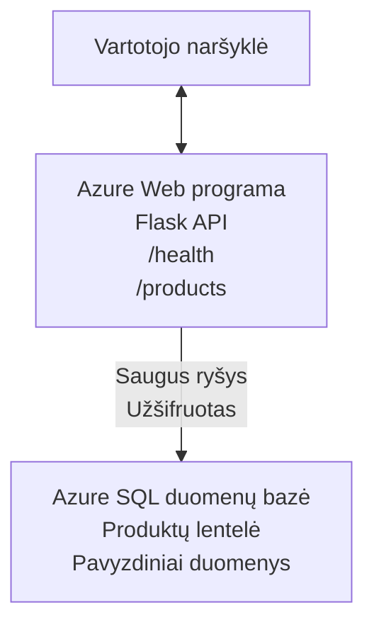

# Microsoft SQL duomenų bazės ir žiniatinklio programos diegimas naudojant AZD

⏱️ **Apskaičiuotas laikas**: 20-30 minučių | 💰 **Apskaičiuotos išlaidos**: ~$15-25/month | ⭐ **Sudėtingumas**: Vidutinis

Šis pilnas, veikiantis pavyzdys demonstruoja, kaip naudoti [Azure Developer CLI (azd)](https://learn.microsoft.com/azure/developer/azure-developer-cli/) diegiant Python Flask žiniatinklio programą su Microsoft SQL duomenų baze į Azure. Visa kodo bazė įtraukta ir išbandyta — nereikia jokių išorinių priklausomybių.

## Ko išmoksite

Atlikdami šį pavyzdį jūs:
- Diegsite daugiasluoksnę programą (web app + duomenų bazė) naudodami infrastruktūrą kaip kodą
- Konfigūruosite saugius duomenų bazės ryšius neįkoduodami slaptažodžių į šaltinio kodą
- Stebėsite programos būklę su Application Insights
- Efektyviai valdysite Azure išteklius naudodami AZD CLI
- Laikysitės Azure gerųjų praktikų dėl saugumo, kaštų optimizavimo ir observabilumo

## Scenarijaus apžvalga
- **Web App**: Python Flask REST API su duomenų bazės jungtimi
- **Database**: Azure SQL duomenų bazė su pavyzdiniais duomenimis
- **Infrastructure**: Tiekiama naudojant Bicep (moduliniai, pakartotinai naudojami šablonai)
- **Deployment**: Visiškai automatizuotas naudojant `azd` komandas
- **Monitoring**: Application Insights žurnalams ir telemetrijai

## Prieš pradedant

### Reikalingi įrankiai

Prieš pradėdami įsitikinkite, kad turite įdiegtus šiuos įrankius:

1. **[Azure CLI](https://learn.microsoft.com/cli/azure/install-azure-cli)** (versija 2.50.0 arba naujesnė)
   ```sh
   az --version
   # Numatomas išvestis: azure-cli 2.50.0 arba naujesnė
   ```

2. **[Azure Developer CLI (azd)](https://learn.microsoft.com/azure/developer/azure-developer-cli/install-azd)** (versija 1.0.0 arba naujesnė)
   ```sh
   azd version
   # Tikėtinas išvestis: azd versija 1.0.0 arba naujesnė
   ```

3. **[Python 3.8+](https://www.python.org/downloads/)** (vietiniam vystymui)
   ```sh
   python --version
   # Tikėtina išvestis: Python 3.8 arba naujesnė
   ```

4. **[Docker](https://www.docker.com/get-started)** (neprivaloma, vietiniam konteinerizuotam vystymui)
   ```sh
   docker --version
   # Tikėtinas rezultatas: Docker versija 20.10 arba naujesnė
   ```

### Azure reikalavimai

- Aktyvi **Azure subscription** ([sukurkite nemokamą paskyrą](https://azure.microsoft.com/free/))
- Teisės kurti išteklius jūsų prenumeratoje
- **Owner** arba **Contributor** rolė prenumeratoje arba resursų grupėje

### Reikalingos žinios

Tai yra **vidutinio lygio** pavyzdys. Turėtumėte būti susipažinę su:
- Pagrindinėmis komandų eilutės operacijomis
- Pagrindinėmis debesų koncepcijomis (ištekliai, resursų grupės)
- Pagrindine supratimu apie žiniatinklio programas ir duomenų bazes

**Naujas prie AZD?** Pirmiausia pradėkite nuo [Pradžios vadovo](../../docs/chapter-01-foundation/azd-basics.md).

## Architektūra

Šis pavyzdys diegia dviejų sluoksnių architektūrą su žiniatinklio programa ir SQL duomenų baze:


**Išteklių diegimas:**
- **Resource Group**: Visų išteklių konteineris
- **App Service Plan**: Linux pagrindu hostinimas (B1 lygis, optimizuota kainai)
- **Web App**: Python 3.11 vykdymo laikas su Flask programa
- **SQL Server**: Tvarkomas duomenų bazės serveris, minimalus TLS 1.2
- **SQL Database**: Basic lygis (2GB, tinkamas vystymui/testavimui)
- **Application Insights**: Stebėjimui ir žurnalams
- **Log Analytics Workspace**: Centralizuota žurnalų saugykla

**Analogiškai**: Įsivaizduokite restoraną (web app) su šaldikliu (duomenų bazė). Klientai užsisako iš meniu (API galiniai taškai), o virtuvė (Flask programa) iš šaldiklio pasiima ingredientus (duomenis). Restorano vadybininkas (Application Insights) stebi viską, kas vyksta.

## Aplankų struktūra

Visi failai įtraukti į šį pavyzdį — nereikia jokių išorinių priklausomybių:

```
examples/database-app/
│
├── README.md                    # This file
├── azure.yaml                   # AZD configuration file
├── .env.sample                  # Sample environment variables
├── .gitignore                   # Git ignore patterns
│
├── infra/                       # Infrastructure as Code (Bicep)
│   ├── main.bicep              # Main orchestration template
│   ├── abbreviations.json      # Azure naming conventions
│   └── resources/              # Modular resource templates
│       ├── sql-server.bicep    # SQL Server configuration
│       ├── sql-database.bicep  # Database configuration
│       ├── app-service-plan.bicep  # Hosting plan
│       ├── app-insights.bicep  # Monitoring setup
│       └── web-app.bicep       # Web application
│
└── src/
    └── web/                    # Application source code
        ├── app.py              # Flask REST API
        ├── requirements.txt    # Python dependencies
        └── Dockerfile          # Container definition
```

**Ką daro kiekvienas failas:**
- **azure.yaml**: Nurodo AZD ką diegti ir kur
- **infra/main.bicep**: Orkestruoja visus Azure išteklius
- **infra/resources/*.bicep**: Atskirų išteklių apibrėžtys (modulinės, pakartotinai naudojamos)
- **src/web/app.py**: Flask programa su duomenų bazės logika
- **requirements.txt**: Python paketų priklausomybės
- **Dockerfile**: Instrukcijos konteinerizavimui diegiant

## Greitas pradžios vadovas (žingsnis po žingsnio)

### 1 žingsnis: Klonuoti ir pereiti

```sh
git clone https://github.com/microsoft/AZD-for-beginners.git
cd AZD-for-beginners/examples/database-app
```

**✓ Patikrinimas**: Patikrinkite, ar matote `azure.yaml` ir `infra/` aplanką:
```sh
ls
# Tikimasi: README.md, azure.yaml, infra/, src/
```

### 2 žingsnis: Prisijungimas prie Azure

```sh
azd auth login
```

Tai atvers jūsų naršyklę Azure autentifikacijai. Prisijunkite naudodami savo Azure paskyrą.

**✓ Patikrinimas**: Turėtumėte matyti:
```
Logged in to Azure.
```

### 3 žingsnis: Inicializuokite aplinką

```sh
azd init
```

**Kas vyksta**: AZD sukuria vietinę konfigūraciją jūsų diegimui.

**Bus rodomi šie pranešimai**:
- **Aplinkos pavadinimas**: Įveskite trumpą pavadinimą (pvz., `dev`, `myapp`)
- **Azure prenumerata**: Pasirinkite prenumeratą iš sąrašo
- **Azure vieta**: Pasirinkite regioną (pvz., `eastus`, `westeurope`)

**✓ Patikrinimas**: Turėtumėte matyti:
```
SUCCESS: New project initialized!
```

### 4 žingsnis: Paruoškite Azure išteklius

```sh
azd provision
```

**Kas vyksta**: AZD diegia visą infrastruktūrą (trunka 5-8 minutes):
1. Sukuria resursų grupę
2. Sukuria SQL Server ir duomenų bazę
3. Sukuria App Service Plan
4. Sukuria Web App
5. Sukuria Application Insights
6. Sukonfigūruoja tinklą ir saugumą

**Jums bus prašoma įvesti**:
- **SQL administratoriaus vartotojo vardas**: Įveskite vartotojo vardą (pvz., `sqladmin`)
- **SQL administratoriaus slaptažodis**: Įveskite stiprų slaptažodį (išsaugokite jį!)

**✓ Patikrinimas**: Turėtumėte matyti:
```
SUCCESS: Your application was provisioned in Azure in X minutes Y seconds.
You can view the resources created under the resource group rg-<env-name> in Azure Portal:
https://portal.azure.com/#@/resource/subscriptions/.../resourceGroups/rg-<env-name>
```

**⏱️ Laikas**: 5-8 minučių

### 5 žingsnis: Diegti programą

```sh
azd deploy
```

**Kas vyksta**: AZD surenka ir įdiegia jūsų Flask programą:
1. Supakuoja Python programą
2. Sukonstruoja Docker konteinerį
3. Paskelbia į Azure Web App
4. Inicializuoja duomenų bazę su pavyzdiniais duomenimis
5. Paleidžia programą

**✓ Patikrinimas**: Turėtumėte matyti:
```
SUCCESS: Your application was deployed to Azure in X minutes Y seconds.
You can view the resources created under the resource group rg-<env-name> in Azure Portal:
https://portal.azure.com/#@/resource/subscriptions/.../resourceGroups/rg-<env-name>
```

**⏱️ Laikas**: 3-5 minučių

### 6 žingsnis: Naršyti programą

```sh
azd browse
```

Tai atidarys jūsų diegtą žiniatinklio programą naršyklėje adresu `https://app-<unique-id>.azurewebsites.net`

**✓ Patikrinimas**: Turėtumėte matyti JSON išvestį:
```json
{
  "message": "Welcome to the Database App API",
  "endpoints": {
    "/": "This help message",
    "/health": "Health check endpoint",
    "/products": "List all products",
    "/products/<id>": "Get product by ID"
  }
}
```

### 7 žingsnis: Išbandykite API galinius taškus

**Health Check** (patikrinkite duomenų bazės ryšį):
```sh
curl https://app-<your-id>.azurewebsites.net/health
```

**Tikėtinas atsakymas**:
```json
{
  "status": "healthy",
  "database": "connected"
}
```

**Produktų sąrašas** (pavyzdiniai duomenys):
```sh
curl https://app-<your-id>.azurewebsites.net/products
```

**Tikėtinas atsakymas**:
```json
[
  {
    "id": 1,
    "name": "Laptop",
    "description": "High-performance laptop",
    "price": 1299.99,
    "created_at": "2025-11-19T10:30:00"
  },
  ...
]
```

**Gauti vieną produktą**:
```sh
curl https://app-<your-id>.azurewebsites.net/products/1
```

**✓ Patikrinimas**: Visi galiniai taškai grąžina JSON duomenis be klaidų.

---

**🎉 Sveikiname!** Jūs sėkmingai įdiegėte žiniatinklio programą su duomenų baze į Azure naudojant AZD.

## Konfigūracijos išsamiau

### Aplinkos kintamieji

Slaptažodžiai valdomi saugiai per Azure App Service konfigūraciją — **niekada neįkoduokite jų į šaltinio kodą**.

**Automatiškai sukonfigūruota per AZD**:
- `SQL_CONNECTION_STRING`: Duomenų bazės ryšys su užšifruotais prisijungimo duomenimis
- `APPLICATIONINSIGHTS_CONNECTION_STRING`: Stebėjimo telemetrijos galinis taškas
- `SCM_DO_BUILD_DURING_DEPLOYMENT`: Leidžia automatinį priklausomybių įdiegimą

**Kur saugomi slaptažodžiai**:
1. Vykdant `azd provision`, jūs pateikiate SQL kredencialus per saugius užklausimus
2. AZD saugo juos vietiniame `.azure/<env-name>/.env` faile (įtrauktas į .gitignore)
3. AZD įterpia juos į Azure App Service konfigūraciją (užšifruota saugojant)
4. Programa skaito juos naudodama `os.getenv()` vykdymo metu

### Vietinis vystymas

Vietiniam testavimui sukurkite `.env` failą iš pavyzdžio:

```sh
cp .env.sample .env
# Redaguokite .env, kad nurodytumėte prisijungimą prie savo vietinės duomenų bazės.
```

**Vietinio vystymo darbo eiga**:
```sh
# Įdiegti priklausomybes
cd src/web
pip install -r requirements.txt

# Nustatyti aplinkos kintamuosius
export SQL_CONNECTION_STRING="your-local-connection-string"

# Paleisti programą
python app.py
```

**Testuoti lokaliai**:
```sh
curl http://localhost:8000/health
# Tikėtinas rezultatas: {"status": "healthy", "database": "connected"}
```

### Infrastruktūra kaip kodas

Visi Azure ištekliai apibrėžti **Bicep šablonuose** (`infra/` aplanke):

- **Modulinis dizainas**: Kiekvienam išteklių tipui yra atskiras failas pakartotinam naudojimui
- **Parametrizuota**: Galima pritaikyti SKU, regionus, pavadinimų konvencijas
- **Gerosios praktikos**: Laikosi Azure pavadinimų standartų ir saugumo numatytųjų nustatymų
- **Versijų valdymas**: Infrastruktūros pakeitimai sekami Git

**Pritaikymo pavyzdys**:
Norėdami pakeisti duomenų bazės lygį, redaguokite `infra/resources/sql-database.bicep`:
```bicep
sku: {
  name: 'Standard'  // Changed from 'Basic'
  tier: 'Standard'
  capacity: 10
}
```

## Saugumo gerosios praktikos

Šis pavyzdys atitinka Azure saugumo gerąsias praktikas:

### 1. **Nėra slaptažodžių šaltinio kode**
- ✅ Kredencialai saugomi Azure App Service konfigūracijoje (užšifruota)
- ✅ `.env` failai neįtraukiami į Git per `.gitignore`
- ✅ Slaptažodžiai perduodami per saugius parametrus diegimo metu

### 2. **Užšifruoti ryšiai**
- ✅ TLS 1.2 minimalus SQL Serveriui
- ✅ Web App priverstinai naudoja tik HTTPS
- ✅ Duomenų bazės ryšiai naudoja užšifruotus kanalus

### 3. **Tinklo saugumas**
- ✅ SQL Server ugniasienė sukonfigūruota leisti tik Azure paslaugoms
- ✅ Viešasis tinklo prieiga apribota (gali būti užrakinta toliau naudojant Private Endpoints)
- ✅ FTPS išjungtas Web App

### 4. **Autentifikacija ir autorizacija**
- ⚠️ **Dabartinė**: SQL autentifikacija (vartotojo vardas/slaptažodis)
- ✅ **Rekomendacija gamybai**: Naudokite Azure Managed Identity be slaptažodžių autentifikacijai

**Norint pereiti prie Managed Identity** (gamybai):
1. Įgalinkite valdomą identitetą Web App
2. Suteikite identitetui SQL teises
3. Atnaujinkite ryšio eilutę naudoti valdomą identitetą
4. Pašalinkite slaptažodžiais pagrįstą autentifikaciją

### 5. **Auditavimas ir atitiktis**
- ✅ Application Insights registruoja visus užklausimus ir klaidas
- ✅ SQL duomenų bazės auditavimas įjungtas (gali būti sukonfigūruotas atitikties reikalavimams)
- ✅ Visi ištekliai žymimi valdymui

**Saugumo kontrolinis sąrašas prieš gamybą**:
- [ ] Įgalinti Azure Defender for SQL
- [ ] Sukonfigūruoti Private Endpoints SQL duomenų bazei
- [ ] Įjungti Web Application Firewall (WAF)
- [ ] Įgyvendinti Azure Key Vault slaptažodžių rotacijai
- [ ] Sukonfigūruoti Azure AD autentifikaciją
- [ ] Įjungti diagnostinį žurnalo rašymą visiems ištekliams

## Kainų optimizavimas

**Apskaičiuotos mėnesinės išlaidos** (2025 m. lapkričio duomenimis):

| Išteklius | SKU/Lygis | Apskaičiuotos išlaidos |
|----------|----------|----------------|
| App Service Plan | B1 (Basic) | ~$13/month |
| SQL Database | Basic (2GB) | ~$5/month |
| Application Insights | Pay-as-you-go | ~$2/month (low traffic) |
| **Total** | | **~$20/month** |

**💡 Taupymo patarimai**:

1. **Naudokite nemokamą lygį mokymuisi**:
   - App Service: F1 lygis (nemokamas, ribotai valandų)
   - SQL Database: Naudokite Azure SQL Database serverless
   - Application Insights: 5GB/mėn. nemokamas įkėlimas

2. **Sustabdykite išteklius, kai jų nenaudojate**:
   ```sh
   # Sustabdyti žiniatinklio programą (duomenų bazė vis tiek apmokestinama)
   az webapp stop --name <app-name> --resource-group <rg-name>
   
   # Paleisti iš naujo, kai reikia
   az webapp start --name <app-name> --resource-group <rg-name>
   ```

3. **Ištrinkite viską po testavimo**:
   ```sh
   azd down
   ```
   Tai pašalina VISUS išteklius ir sustabdo mokėjimus.

4. **Vystymas vs. gamyba – SKU pasirinkimas**:
   - **Vystymui**: Basic lygis (naudojamas šiame pavyzdyje)
   - **Gamybai**: Standard/Premium lygiai su atsargumu

**Kainų stebėjimas**:
- Peržiūrėkite išlaidas [Azure Cost Management](https://portal.azure.com/#view/Microsoft_Azure_CostManagement)
- Sukonfigūruokite išlaidų įspėjimus, kad išvengtumėte netikėtumų
- Pažymėkite visus išteklius su `azd-env-name` stebėjimui

**Nemokama alternatyva**:
Mokymosi tikslais galite pakeisti `infra/resources/app-service-plan.bicep`:
```bicep
sku: {
  name: 'F1'  // Free tier
  tier: 'Free'
}
```
**Pastaba**: Nemokamas lygis turi apribojimų (60 min/dieną CPU, nėra nuolatinio veikimo).

## Stebėjimas ir observabilumas

### Application Insights integracija

Šis pavyzdys įtraukia **Application Insights** išsamiai stebėsenai:

**Kas stebima**:
- ✅ HTTP užklausos (vėlinimas, būsenų kodai, galiniai taškai)
- ✅ Programos klaidos ir išimtys
- ✅ Vartotojo žurnalai iš Flask programos
- ✅ Duomenų bazės ryšio būklė
- ✅ Veikimo metrika (CPU, atmintis)

**Kaip pasiekti Application Insights**:
1. Atidarykite [Azure Portal](https://portal.azure.com)
2. Eikite į savo resursų grupę (`rg-<env-name>`)
3. Spustelėkite Application Insights resursą (`appi-<unique-id>`)

**Naudingos užklausos** (Application Insights → Logs):

**Peržiūrėti visas užklausas**:
```kusto
requests
| where timestamp > ago(1h)
| order by timestamp desc
| project timestamp, name, url, resultCode, duration
```

**Rasti klaidas**:
```kusto
exceptions
| where timestamp > ago(24h)
| order by timestamp desc
| project timestamp, type, outerMessage, operation_Name
```

**Patikrinti sveikatos galinį tašką**:
```kusto
requests
| where name contains "health"
| summarize count() by resultCode, bin(timestamp, 1h)
```

### SQL duomenų bazės auditavimas

**SQL duomenų bazės auditavimas įjungtas** stebėti:
- Duomenų bazės prieigos modelius
- Nepavykusius prisijungimo bandymus
- Schemos pakeitimus
- Duomenų prieigą (atitikties tikslais)

**Kaip pasiekti audit žurnalus**:
1. Azure Portal → SQL Database → Auditing
2. Peržiūrėkite žurnalus Log Analytics workspace

### Realaus laiko stebėjimas

**Peržiūrėti tiesioginius metrinius duomenis**:
1. Application Insights → Live Metrics
2. Matykite užklausas, klaidas ir veikimo rodiklius realiu laiku

**Sukonfigūruoti įspėjimus**:
Sukurkite įspėjimus kritiniams įvykiams:
- HTTP 500 klaidos > 5 per 5 minutes
- Duomenų bazės prisijungimo klaidos
- Ilgas atsako laikas (>2 sekundžių)

**Pavyzdys: įspėjimo kūrimas**:
```sh
az monitor metrics alert create \
  --name "High-Response-Time" \
  --resource-group <rg-name> \
  --scopes <app-insights-resource-id> \
  --condition "avg requests/duration > 2000" \
  --description "Alert when response time exceeds 2 seconds"
```

## Trikčių šalinimas
### Dažnos problemos ir sprendimai

#### 1. `azd provision` nepavyksta dėl "Location not available"

**Simptomas**:
```
Error: The subscription is not registered for the resource type 'components' in the location 'centralus'.
```

**Sprendimas**:
Pasirinkite kitą Azure regioną arba registruokite resursų teikėją:
```sh
az provider register --namespace Microsoft.Insights
```

#### 2. SQL prisijungimas nepavyksta diegimo metu

**Simptomas**:
```
pyodbc.OperationalError: ('08001', '[08001] [Microsoft][ODBC Driver 18 for SQL Server]TCP Provider...')
```

**Sprendimas**:
- Patikrinkite, ar SQL Server tinklo užkarda leidžia Azure paslaugas (konfigūruojama automatiškai)
- Patikrinkite, ar SQL administratoriaus slaptažodis buvo teisingai įvestas per `azd provision`
- Užtikrinkite, kad SQL Server pilnai provisionintas (gali užtrukti 2–3 minutes)

**Patikrinkite prisijungimą**:
```sh
# Azure portale eikite į SQL Database → Query editor
# Pabandykite prisijungti naudodami savo prisijungimo duomenis
```

#### 3. Web App rodo "Application Error"

**Simptomas**:
Naršyklėje matomas bendras klaidos puslapis.

**Sprendimas**:
Patikrinkite programos žurnalus:
```sh
# Peržiūrėti naujausius žurnalų įrašus
az webapp log tail --name <app-name> --resource-group <rg-name>
```

**Dažnos priežastys**:
- Trūksta aplinkos kintamųjų (patikrinkite App Service → Configuration)
- Nepavyko įdiegti Python paketų (patikrinkite diegimo žurnalus)
- Klaida inicializuojant duomenų bazę (patikrinkite SQL ryšį)

#### 4. `azd deploy` nepavyksta su "Build Error"

**Simptomas**:
```
Error: Failed to build project
```

**Sprendimas**:
- Įsitikinkite, kad `requirements.txt` neturi sintaksės klaidų
- Patikrinkite, ar Python 3.11 nurodytas faile `infra/resources/web-app.bicep`
- Patikrinkite, ar Dockerfile turi teisingą bazinį vaizdą

**Debug'inimas lokaliai**:
```sh
cd src/web
docker build -t test-app .
docker run -p 8000:8000 test-app
```

#### 5. "Unauthorized" paleidžiant AZD komandas

**Simptomas**:
```
ERROR: (Unauthorized) The client '<id>' with object id '<id>' does not have authorization
```

**Sprendimas**:
Perprijunkite prie Azure:
```sh
azd auth login
az login
```

Patikrinkite, ar turite tinkamus leidimus (Contributor rolė) prenumeratoje.

#### 6. Didelės duomenų bazės išlaidos

**Simptomas**:
Netikėtas Azure sąskaitos dydis.

**Sprendimas**:
- Patikrinkite, ar nepamiršote paleisti `azd down` po testavimo
- Patikrinkite, ar SQL Database naudoja Basic lygį (ne Premium)
- Peržiūrėkite išlaidas Azure Cost Management
- Sukurkite išlaidų įspėjimus

### Pagalbos gavimas

**Peržiūrėti visus AZD aplinkos kintamuosius**:
```sh
azd env get-values
```

**Patikrinti diegimo būseną**:
```sh
az webapp show --name <app-name> --resource-group <rg-name> --query state
```

**Prieiga prie programos žurnalų**:
```sh
az webapp log download --name <app-name> --resource-group <rg-name> --log-file app-logs.zip
```

**Reikia daugiau pagalbos?**
- [AZD trikčių šalinimo vadovas](../../docs/chapter-07-troubleshooting/common-issues.md)
- [Azure App Service trikčių šalinimas](https://learn.microsoft.com/azure/app-service/troubleshoot-diagnostic-logs)
- [Azure SQL trikčių šalinimas](https://learn.microsoft.com/azure/azure-sql/database/troubleshoot-common-errors-issues)

## Praktinės užduotys

### Užduotis 1: Patikrinkite savo diegimą (Pradedantiesiems)

**Tikslas**: Patvirtinti, kad visi resursai yra įdiegti ir programa veikia.

**Veiksmai**:
1. Išvardinkite visus resursus savo resource group:
   ```sh
   az resource list --resource-group rg-<env-name> --output table
   ```
   **Tikėtasi**: 6–7 resursai (Web App, SQL Server, SQL Database, App Service Plan, Application Insights, Log Analytics)

2. Išbandykite visus API galinius taškus:
   ```sh
   curl https://app-<your-id>.azurewebsites.net/
   curl https://app-<your-id>.azurewebsites.net/health
   curl https://app-<your-id>.azurewebsites.net/products
   curl https://app-<your-id>.azurewebsites.net/products/1
   ```
   **Tikėtasi**: Visi grąžina galiojantį JSON be klaidų

3. Patikrinkite Application Insights:
   - Eikite į Application Insights Azure portale
   - Pereikite į "Live Metrics"
   - Atnaujinkite naršyklę ant web aplikacijos
   **Tikėtasi**: Matomi užklausimai realiu laiku

**Sėkmės kriterijai**: Visi 6–7 resursai egzistuoja, visi galiniai taškai grąžina duomenis, Live Metrics rodo aktyvumą.

---

### Užduotis 2: Pridėti naują API galinį tašką (Vidutinis lygis)

**Tikslas**: Išplėsti Flask aplikaciją su nauju galiniu tašku.

**Pradinis kodas**: Esami galiniai taškai faile `src/web/app.py`

**Veiksmai**:
1. Redaguokite `src/web/app.py` ir pridėkite naują galinį tašką po `get_product()` funkcijos:
   ```python
   @app.route('/products/search/<keyword>')
   def search_products(keyword):
       """Search products by name or description."""
       try:
           conn = get_db_connection()
           cursor = conn.cursor()
           cursor.execute(
               "SELECT id, name, description, price, created_at FROM products WHERE name LIKE ? OR description LIKE ?",
               (f'%{keyword}%', f'%{keyword}%')
           )
           
           products = []
           for row in cursor.fetchall():
               products.append({
                   'id': row[0],
                   'name': row[1],
                   'description': row[2],
                   'price': float(row[3]) if row[3] else None,
                   'created_at': row[4].isoformat() if row[4] else None
               })
           
           cursor.close()
           conn.close()
           
           logger.info(f"Search for '{keyword}' returned {len(products)} results")
           return jsonify(products), 200
           
       except Exception as e:
           logger.error(f"Error searching products: {str(e)}")
           return jsonify({'error': str(e)}), 500
   ```

2. Diekite atnaujintą programą:
   ```sh
   azd deploy
   ```

3. Išbandykite naują galinį tašką:
   ```sh
   curl https://app-<your-id>.azurewebsites.net/products/search/laptop
   ```
   **Tikėtasi**: Grąžina produktus atitinkančius "laptop"

**Sėkmės kriterijai**: Naujas galinis taškas veikia, grąžina filtruotus rezultatus, matomas Application Insights žurnaluose.

---

### Užduotis 3: Pridėti stebėjimą ir įspėjimus (Pažengusiems)

**Tikslas**: Nustatyti proaktyvų stebėjimą su įspėjimais.

**Veiksmai**:
1. Sukurkite įspėjimą HTTP 500 klaidoms:
   ```sh
   # Gauti Application Insights resurso ID
   AI_ID=$(az monitor app-insights component show \
     --app appi-<your-id> \
     --resource-group rg-<env-name> \
     --query id -o tsv)
   
   # Sukurti įspėjimą
   az monitor metrics alert create \
     --name "High-Error-Rate" \
     --resource-group rg-<env-name> \
     --scopes $AI_ID \
     --condition "count requests/failed > 5" \
     --window-size 5m \
     --evaluation-frequency 1m \
     --description "Alert when >5 failed requests in 5 minutes"
   ```

2. Sukelkite įspėjimą sukeldami klaidas:
   ```sh
   # Užklausti neegzistuojančio produkto
   for i in {1..10}; do curl https://app-<your-id>.azurewebsites.net/products/999; done
   ```

3. Patikrinkite, ar įspėjimas buvo suaktyvintas:
   - Azure Portal → Alerts → Alert Rules
   - Patikrinkite savo el. paštą (jei sukonfigūruota)

**Sėkmės kriterijai**: Įspėjimo taisyklė sukurta, suveikia prie klaidų, gaunami pranešimai.

---

### Užduotis 4: Duomenų bazės schemos pakeitimai (Pažengusiems)

**Tikslas**: Pridėti naują lentelę ir pakeisti programą ją naudojant.

**Veiksmai**:
1. Prisijunkite prie SQL Database per Azure Portal Query Editor

2. Sukurkite naują `categories` lentelę:
   ```sql
   CREATE TABLE categories (
       id INT PRIMARY KEY IDENTITY(1,1),
       name NVARCHAR(50) NOT NULL,
       description NVARCHAR(200)
   );
   
   INSERT INTO categories (name, description) VALUES
   ('Electronics', 'Electronic devices and accessories'),
   ('Office Supplies', 'Office equipment and supplies');
   
   -- Add category to products table
   ALTER TABLE products ADD category_id INT;
   UPDATE products SET category_id = 1; -- Set all to Electronics
   ```

3. Atnaujinkite `src/web/app.py`, kad įtrauktumėte kategorijų informaciją į atsakymus

4. Diekite ir testuokite

**Sėkmės kriterijai**: Nauja lentelė egzistuoja, produktai rodo kategorijų informaciją, programa vis dar veikia.

---

### Užduotis 5: Įgyvendinti kešavimą (Ekspertams)

**Tikslas**: Pridėti Azure Redis Cache našumui pagerinti.

**Veiksmai**:
1. Pridėkite Redis Cache į `infra/main.bicep`
2. Atnaujinkite `src/web/app.py`, kad kešuotumėte produktų užklausas
3. Išmatuokite našumo pagerėjimą su Application Insights
4. Palyginkite atsakymo laikus prieš/po kešavimo

**Sėkmės kriterijai**: Redis diegiamas, kešavimas veikia, atsakymo laikai pagerėja >50%.

**Užuomina**: Pradėkite nuo [Azure Cache for Redis dokumentacijos](https://learn.microsoft.com/azure/azure-cache-for-redis/).

---

## Išvalymas

Kad išvengtumėte nuolatinių išlaidų, ištrinkite visus resursus pasibaigus:

```sh
azd down
```

**Patvirtinimo užklausa**:
```
? Total resources to delete: 7, are you sure you want to continue? (y/N)
```

Įveskite `y`, kad patvirtintumėte.

**✓ Sėkmės patikrinimas**: 
- Visi resursai ištrinti iš Azure Portal
- Nėra jokių nuolatinių mokesčių
- Vietinis `.azure/<env-name>` aplankas gali būti ištrintas

**Alternatyva** (palikti infrastruktūrą, ištrinti duomenis):
```sh
# Ištrinti tik resursų grupę (palikti AZD konfigūraciją)
az group delete --name rg-<env-name> --yes
```
## Sužinokite daugiau

### Susijusi dokumentacija
- [Azure Developer CLI dokumentacija](https://learn.microsoft.com/azure/developer/azure-developer-cli/)
- [Azure SQL Database dokumentacija](https://learn.microsoft.com/azure/azure-sql/database/)
- [Azure App Service dokumentacija](https://learn.microsoft.com/azure/app-service/)
- [Application Insights dokumentacija](https://learn.microsoft.com/azure/azure-monitor/app/app-insights-overview)
- [Bicep kalbos nuoroda](https://learn.microsoft.com/azure/azure-resource-manager/bicep/)

### Kiti žingsniai šiame kurse
- **[Container Apps pavyzdys](../../../../examples/container-app)**: Diegti mikroservisus su Azure Container Apps
- **[AI integracijos vadovas](../../../../docs/ai-foundry)**: Pridėti AI galimybes jūsų programai
- **[Diegimo gerosios praktikos](../../docs/chapter-04-infrastructure/deployment-guide.md)**: Produkcinio diegimo šablonai

### Pažangios temos
- **Valdomoji identifikacija**: Pašalinkite slaptažodžius ir naudokite Azure AD autentifikaciją
- **Privatūs galiniai taškai**: Apsaugokite duomenų bazės ryšius virtualiame tinkle
- **CI/CD integracija**: Automatizuokite diegimus su GitHub Actions arba Azure DevOps
- **Multi-aplinkos**: Sukonfigūruokite dev, staging ir production aplinkas
- **Duomenų bazės migracijos**: Naudokite Alembic arba Entity Framework schemos versijavimui

### Palyginimas su kitais požiūriais

**AZD vs. ARM Templates**:
- ✅ AZD: Aukštesnis lygio abstrakcija, paprastesnės komandos
- ⚠️ ARM: Daug žodžių, smulkesnė kontrolė

**AZD vs. Terraform**:
- ✅ AZD: Azure natyvus, integruotas su Azure paslaugomis
- ⚠️ Terraform: Multi-cloud palaikymas, didesnė ekosistema

**AZD vs. Azure Portal**:
- ✅ AZD: Pakartojamas, valdomas versijomis, automatizuojamas
- ⚠️ Portal: Rankiniai paspaudimai, sunku pakartoti

Galvokite apie AZD kaip apie Docker Compose Azure'ui — supaprastinta konfigūracija sudėtingiems diegimams.

---

## Dažnai užduodami klausimai

**Klausimas: Ar galiu naudoti kitą programavimo kalbą?**  
Atsakymas: Taip! Pakeiskite `src/web/` į Node.js, C#, Go arba bet kurią kitą kalbą. Atnaujinkite `azure.yaml` ir Bicep atitinkamai.

**Klausimas: Kaip pridėti daugiau duomenų bazių?**  
Atsakymas: Pridėkite dar vieną SQL Database modulį faile `infra/main.bicep` arba naudokite PostgreSQL/MySQL iš Azure Database paslaugų.

**Klausimas: Ar galiu tai naudoti produkcijoje?**  
Atsakymas: Tai yra pradinis taškas. Diegiant produkcijoje pridėkite: valdomą identitetą, privačius galinius taškus, atsparumą, atsargines kopijas, WAF ir patobulintą stebėjimą.

**Klausimas: Ką daryti, jei noriu naudoti konteinerius vietoje kodo diegimo?**  
Atsakymas: Peržiūrėkite [Container Apps pavyzdį](../../../../examples/container-app), kuris naudoja Docker konteinerius visame procese.

**Klausimas: Kaip prisijungti prie duomenų bazės iš savo vietinio kompiuterio?**  
Atsakymas: Pridėkite savo IP prie SQL Server tinklo užkardos:
```sh
az sql server firewall-rule create \
  --resource-group rg-<env-name> \
  --server sql-<unique-id> \
  --name AllowMyIP \
  --start-ip-address <your-ip> \
  --end-ip-address <your-ip>
```

**Klausimas: Ar galiu naudoti esamą duomenų bazę vietoje naujos kūrimo?**  
Atsakymas: Taip, modifikuokite `infra/main.bicep`, kad nurodytumėte esamą SQL Server ir atnaujinkite ryšio eilutės parametrus.

---

> **Pastaba:** Šis pavyzdys demonstruoja geriausias praktikas diegiant web aplikaciją su duomenų baze naudojant AZD. Jame yra veikiantis kodas, išsami dokumentacija ir praktinės užduotys žinioms stiprinti. Diegiant produkcijoje peržiūrėkite saugumo, skalavimo, atitikties ir kaštų reikalavimus, specifinius jūsų organizacijai.

**📚 Kurso navigacija:**
- ← Ankstesnis: [Container Apps pavyzdys](../../../../examples/container-app)
- → Kitas: [AI integracijos vadovas](../../../../docs/ai-foundry)
- 🏠 [Kurso pradžia](../../README.md)

---

<!-- CO-OP TRANSLATOR DISCLAIMER START -->
**Disclaimer**:
Šis dokumentas buvo išverstas naudojant dirbtinio intelekto vertimo paslaugą [Co-op Translator](https://github.com/Azure/co-op-translator). Nors stengiamės užtikrinti tikslumą, atkreipkite dėmesį, kad automatizuoti vertimai gali turėti klaidų arba netikslumų. Originalus dokumentas jo gimtąja kalba turėtų būti laikomas autoritetingu šaltiniu. Kritinei informacijai rekomenduojamas profesionalus žmogaus vertimas. Mes neatsakome už jokius nesusipratimus ar neteisingas interpretacijas, kylančias dėl šio vertimo naudojimo.
<!-- CO-OP TRANSLATOR DISCLAIMER END -->