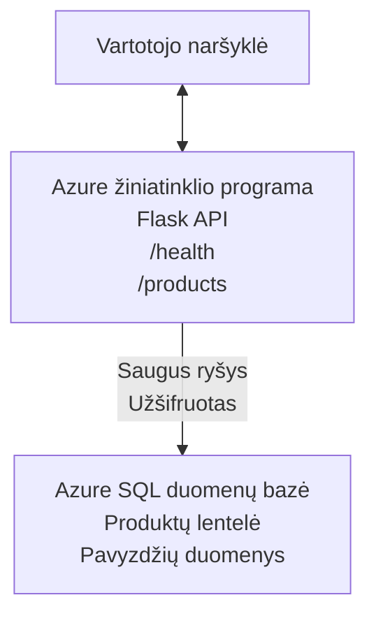

# Diegiant Microsoft SQL duomenų bazę ir Web App su AZD

⏱️ **Apskaičiuotas laikas**: 20-30 minučių | 💰 **Apskaičiuotos išlaidos**: ~$15-25/month | ⭐ **Sudėtingumas**: Vidutinio sudėtingumo

Šis **pilnas, veikiantis pavyzdys** demonstruoja, kaip naudoti [Azure Developer CLI (azd)](https://learn.microsoft.com/azure/developer/azure-developer-cli/) norint iškelti Python Flask žiniatinklio programą su Microsoft SQL duomenų baze į Azure. Visi kodai įtraukti ir išbandyti — nereikia jokių išorinių priklausomybių.

## Ką sužinosite

Baigę šį pavyzdį jūs:
- Išdėstysite daugiasluoksnę programą (web app + duomenų bazė) naudodami infrastruktūrą kaip kodą
- Konfigūruosite saugius duomenų bazės ryšius be slaptažodžių įkapsuliavimo į kodą
- Stebėsite programos būklę su Application Insights
- Efektyviai valdysite Azure išteklius naudodami AZD CLI
- Laikysitės Azure geriausių praktikų saugumo, išlaidų optimizavimo ir stebėsenos srityse

## Scenarijaus apžvalga
- **Web App**: Python Flask REST API su duomenų bazės prisijungimu
- **Database**: Azure SQL Database su pavyzdiniais duomenimis
- **Infrastructure**: Paruošta naudojant Bicep (moduliniai, pakartotinai naudojami šablonai)
- **Deployment**: Visiškai automatizuota naudojant `azd` komandas
- **Monitoring**: Application Insights žurnalams ir telemetriniams duomenims

## Reikalavimai

### Reikalingi įrankiai

Prieš pradėdami, įsitikinkite, kad turite įdiegtus šiuos įrankius:

1. **[Azure CLI](https://learn.microsoft.com/cli/azure/install-azure-cli)** (versija 2.50.0 arba naujesnė)
   ```sh
   az --version
   # Tikėtinas rezultatas: azure-cli 2.50.0 arba naujesnė
   ```

2. **[Azure Developer CLI (azd)](https://learn.microsoft.com/azure/developer/azure-developer-cli/install-azd)** (versija 1.0.0 arba naujesnė)
   ```sh
   azd version
   # Tikėtinas išvestis: azd versija 1.0.0 arba naujesnė
   ```

3. **[Python 3.8+](https://www.python.org/downloads/)** (lokaliam vystymui)
   ```sh
   python --version
   # Tikėtinas rezultatas: Python 3.8 arba naujesnė
   ```

4. **[Docker](https://www.docker.com/get-started)** (neprivaloma, vietiniam konteinerizuotam vystymui)
   ```sh
   docker --version
   # Tikėtinas išvestis: Docker versija 20.10 arba naujesnė
   ```

### Azure reikalavimai

- Aktyvi **Azure prenumerata** ([sukurti nemokamą paskyrą](https://azure.microsoft.com/free/))
- Leidimai kurti išteklius jūsų prenumeratoje
- **Owner** arba **Contributor** rolė prenumeratoje arba išteklių grupėje

### Reikalingos žinios

Tai yra **vidutinio lygio** pavyzdys. Turėtumėte būti susipažinę su:
- Pagrindinėmis komandų eilutės operacijomis
- Pagrindinėmis debesų koncepcijomis (ištekliai, išteklių grupės)
- Pagrindiniu supratimu apie žiniatinklio programas ir duomenų bazes

**Naujokas AZD?** Pirmiausia pradėkite su [Getting Started guide](../../docs/chapter-01-foundation/azd-basics.md).

## Architektūra

Šis pavyzdys išdėsto dviejų sluoksnių architektūrą su žiniatinklio programa ir SQL duomenų baze:



**Išteklių diegimas:**
- **Išteklių grupė**: Visų išteklių konteineris
- **App Service planas**: Linux pagrindu talpinimas (B1 lygis dėl sąnaudų efektyvumo)
- **Web App**: Python 3.11 vykdymo aplinka su Flask programa
- **SQL Server**: Valdomas duomenų bazių serveris su TLS 1.2 minimumu
- **SQL Database**: Basic lygis (2GB, tinkamas vystymui/testavimui)
- **Application Insights**: Stebėjimo ir žurnalų kaupimo įrankis
- **Log Analytics Workspace**: Centralizuota žurnalų saugykla

**Panašumas**: Galvokite apie tai kaip restoraną (web app) su šaldikliu (duomenų bazė). Klientai užsisako iš meniu (API galiniai taškai), o virtuvė (Flask programa) pasiima ingredientus (duomenis) iš šaldiklio. Restorano vadybininkas (Application Insights) seka viską, kas vyksta.

## Aplanko struktūra

Visi failai įtraukti į šį pavyzdį—nereikia jokių išorinių priklausomybių:

```
examples/database-app/
│
├── README.md                    # This file
├── azure.yaml                   # AZD configuration file
├── .env.sample                  # Sample environment variables
├── .gitignore                   # Git ignore patterns
│
├── infra/                       # Infrastructure as Code (Bicep)
│   ├── main.bicep              # Main orchestration template
│   ├── abbreviations.json      # Azure naming conventions
│   └── resources/              # Modular resource templates
│       ├── sql-server.bicep    # SQL Server configuration
│       ├── sql-database.bicep  # Database configuration
│       ├── app-service-plan.bicep  # Hosting plan
│       ├── app-insights.bicep  # Monitoring setup
│       └── web-app.bicep       # Web application
│
└── src/
    └── web/                    # Application source code
        ├── app.py              # Flask REST API
        ├── requirements.txt    # Python dependencies
        └── Dockerfile          # Container definition
```

**Ką atlieka kiekvienas failas:**
- **azure.yaml**: Nurodo AZD, ką diegti ir kur
- **infra/main.bicep**: Orkestruoja visus Azure išteklius
- **infra/resources/*.bicep**: Atskiri išteklių aprašymai (moduliniai, pakartojamai naudojami)
- **src/web/app.py**: Flask programa su duomenų bazės logika
- **requirements.txt**: Python paketų priklausomybės
- **Dockerfile**: Konteinerizacijos nurodymai diegimui

## Greitas pradžios vadovas (žingsnis po žingsnio)

### 1 žingsnis: Klonuoti ir pereiti

```sh
git clone https://github.com/microsoft/AZD-for-beginners.git
cd AZD-for-beginners/examples/database-app
```

**✓ Sėkmės patikra**: Patikrinkite, ar matote `azure.yaml` ir aplanką `infra/`:
```sh
ls
# Tikimasi: README.md, azure.yaml, infra/, src/
```

### 2 žingsnis: Prisijunkite prie Azure

```sh
azd auth login
```

Tai atidarys jūsų naršyklę Azure autentifikacijai. Prisijunkite naudodami savo Azure kredencialus.

**✓ Sėkmės patikra**: Jūs turėtumėte matyti:
```
Logged in to Azure.
```

### 3 žingsnis: Inicializuoti aplinką

```sh
azd init
```

**Kas vyksta**: AZD sukuria vietinę konfigūraciją jūsų diegimui.

**Prašymai, kuriuos pamatysite**:
- **Environment name**: Įveskite trumpą pavadinimą (pvz., `dev`, `myapp`)
- **Azure subscription**: Pasirinkite savo prenumeratą iš sąrašo
- **Azure location**: Pasirinkite regioną (pvz., `eastus`, `westeurope`)

**✓ Sėkmės patikra**: Jūs turėtumėte matyti:
```
SUCCESS: New project initialized!
```

### 4 žingsnis: Paruošti Azure išteklius

```sh
azd provision
```

**Kas vyksta**: AZD diegia visą infrastruktūrą (užtrunka 5–8 minutes):
1. Sukuria išteklių grupę
2. Sukuria SQL Serverį ir duomenų bazę
3. Sukuria App Service planą
4. Sukuria Web App
5. Sukuria Application Insights
6. Konfigūruoja tinklą ir saugumą

**Jūsų bus paprašyta**:
- **SQL admin username**: Įveskite vartotojo vardą (pvz., `sqladmin`)
- **SQL admin password**: Įveskite stiprų slaptažodį (išsaugokite jį!)

**✓ Sėkmės patikra**: Jūs turėtumėte matyti:
```
SUCCESS: Your application was provisioned in Azure in X minutes Y seconds.
You can view the resources created under the resource group rg-<env-name> in Azure Portal:
https://portal.azure.com/#@/resource/subscriptions/.../resourceGroups/rg-<env-name>
```

**⏱️ Laikas**: 5–8 minučių

### 5 žingsnis: Iškelti programą

```sh
azd deploy
```

**Kas vyksta**: AZD surenka ir iškelia jūsų Flask programą:
1. Supakuoja Python programą
2. Sukuria Docker konteinerį
3. Paskelbia į Azure Web App
4. Inicializuoja duomenų bazę su pavyzdiniais duomenimis
5. Paleidžia programą

**✓ Sėkmės patikra**: Jūs turėtumėte matyti:
```
SUCCESS: Your application was deployed to Azure in X minutes Y seconds.
You can view the resources created under the resource group rg-<env-name> in Azure Portal:
https://portal.azure.com/#@/resource/subscriptions/.../resourceGroups/rg-<env-name>
```

**⏱️ Laikas**: 3–5 minutės

### 6 žingsnis: Peržiūrėti programą naršyklėje

```sh
azd browse
```

Tai atidarys jūsų iškeltą web programą naršyklėje adresu `https://app-<unique-id>.azurewebsites.net`

**✓ Sėkmės patikra**: Jūs turėtumėte matyti JSON išvestį:
```json
{
  "message": "Welcome to the Database App API",
  "endpoints": {
    "/": "This help message",
    "/health": "Health check endpoint",
    "/products": "List all products",
    "/products/<id>": "Get product by ID"
  }
}
```

### 7 žingsnis: Išbandykite API galinius taškus

**Sveikatos patikra** (patikrinkite ryšį su duomenų baze):
```sh
curl https://app-<your-id>.azurewebsites.net/health
```

**Tikėtina atsakymas**:
```json
{
  "status": "healthy",
  "database": "connected"
}
```

**Produktų sąrašas** (pavyzdiniai duomenys):
```sh
curl https://app-<your-id>.azurewebsites.net/products
```

**Tikėtina atsakymas**:
```json
[
  {
    "id": 1,
    "name": "Laptop",
    "description": "High-performance laptop",
    "price": 1299.99,
    "created_at": "2025-11-19T10:30:00"
  },
  ...
]
```

**Gauti vieną produktą**:
```sh
curl https://app-<your-id>.azurewebsites.net/products/1
```

**✓ Sėkmės patikra**: Visi galiniai taškai grąžina JSON duomenis be klaidų.

---

**🎉 Sveikiname!** Jūs sėkmingai iškėlėte žiniatinklio programą su duomenų baze į Azure naudojant AZD.

## Išsami konfigūracija

### Aplinkos kintamieji

Slapti duomenys yra saugiai valdomi per Azure App Service konfigūraciją—**niekada neįrašykite jų tiesiogiai į šaltinio kodą**.

**Automatiškai konfigūruoja AZD**:
- `SQL_CONNECTION_STRING`: Duomenų bazės prisijungimas su užšifruotais kredencialais
- `APPLICATIONINSIGHTS_CONNECTION_STRING`: Telemetrijos stebėjimo pabaigos taškas
- `SCM_DO_BUILD_DURING_DEPLOYMENT`: Leidžia automatinį priklausomybių įdiegimą diegimo metu

**Kur saugomi slapti duomenys**:
1. Per `azd provision` jūs pateikiate SQL kredencialus per saugius raginimus
2. AZD saugo juos jūsų vietiniame `.azure/<env-name>/.env` faile (įtrauktame į .gitignore)
3. AZD injektuoja juos į Azure App Service konfigūraciją (užšifruota saugant)
4. Programa skaito juos per `os.getenv()` vykdymo metu

### Vietinis vystymas

Vietiniam testavimui sukurkite `.env` failą iš pavyzdžio:

```sh
cp .env.sample .env
# Redaguokite .env, nurodydami savo vietinio duomenų bazės prisijungimo duomenis
```

**Vietinio vystymo eiga**:
```sh
# Įdiegti priklausomybes
cd src/web
pip install -r requirements.txt

# Nustatyti aplinkos kintamuosius
export SQL_CONNECTION_STRING="your-local-connection-string"

# Paleisti programą
python app.py
```

**Paleisti testuojant vietoje**:
```sh
curl http://localhost:8000/health
# Tikėtasi: {"status": "sveikas", "database": "prijungta"}
```

### Infrastruktūra kaip kodas

Visi Azure ištekliai aprašyti **Bicep šablonuose** (`infra/` aplankas):

- **Modulinis dizainas**: Kiekvienam išteklių tipui atskiras failas pakartotinumui
- **Parametrizuota**: Galima pritaikyti SKU, regionus, pavadinimų konvencijas
- **Geriausios praktikos**: Atitinka Azure pavadinimų standartus ir saugumo numatytuosius nustatymus
- **Versijų valdymas**: Infrastruktūros pakeitimai stebimi Gite

**Pritaikymo pavyzdys**:
Norėdami pakeisti duomenų bazės lygį, redaguokite `infra/resources/sql-database.bicep`:
```bicep
sku: {
  name: 'Standard'  // Changed from 'Basic'
  tier: 'Standard'
  capacity: 10
}
```

## Geriausios saugumo praktikos

Šis pavyzdys laikosi Azure saugumo geriausių praktikų:

### 1. **Nėra slaptų duomenų šaltinio kode**
- ✅ Prisijungimo duomenys saugomi Azure App Service konfigūracijoje (užšifruoti)
- ✅ `.env` failai neįtraukti į Git per `.gitignore`
- ✅ Slaptieji parametrai perduodami per saugius provisioning raginimus

### 2. **Užšifruoti ryšiai**
- ✅ SQL Serveris naudoja TLS 1.2 minimumą
- ✅ Web App priverstinai naudoja HTTPS
- ✅ Duomenų bazės ryšiai naudoja užšifruotus kanalus

### 3. **Tinklo saugumas**
- ✅ SQL Serverio ugniasienė sukonfigūruota leisti tik Azure paslaugas
- ✅ Viešasis prieigos tinklas apribotas (gali būti papildomai užblokuotas naudojant Private Endpoints)
- ✅ FTPS išjungtas Web App aplinkoje

### 4. **Autentifikacija ir autorizacija**
- ⚠️ **Dabartinė**: SQL autentifikacija (vartotojo vardas/slaptažodis)
- ✅ **Rekomendacija gamybai**: Naudoti Azure Managed Identity autentiškumui be slaptažodžio

**Norėdami pereiti prie Managed Identity** (gamybai):
1. Įgalinkite valdomą tapatybę ant Web App
2. Suteikite tapatybei teises SQL serveryje
3. Atnaujinkite prisijungimo eilutę, kad naudotų Managed Identity
4. Pašalinkite slaptažodžiu pagrįstą autentifikaciją

### 5. **Auditas ir atitiktis**
- ✅ Application Insights registruoja visus užklausimus ir klaidas
- ✅ SQL Database auditas įjungtas (gali būti konfigūruojamas atitikties poreikiams)
- ✅ Visi ištekliai pažymėti žymomis valdymui

**Saugumo kontrolinis sąrašas prieš gamybą**:
- [ ] Įjungti Azure Defender for SQL
- [ ] Konfigūruoti Private Endpoints SQL duomenų bazei
- [ ] Įjungti Web Application Firewall (WAF)
- [ ] Įdiegti Azure Key Vault slaptųjų duomenų rotacijai
- [ ] Konfigūruoti Microsoft Entra ID autentifikaciją
- [ ] Įjungti diagnostikos žurnalavimą visiems ištekliams

## Išlaidų optimizavimas

**Apskaičiuotos mėnesinės išlaidos** (pagal 2025 m. lapkričio duomenis):

| Ištekliai | SKU/Lygis | Apskaičiuotos išlaidos |
|----------|----------|----------------|
| App Service Plan | B1 (Basic) | ~$13/month |
| SQL Database | Basic (2GB) | ~$5/month |
| Application Insights | Pay-as-you-go | ~$2/month (mažas srautas) |
| **Viso** | | **~$20/month** |

**💡 Patarimai, kaip sutaupyti**:

1. **Naudokite nemokamą lygį mokymuisi**:
   - App Service: F1 lygis (nemokamas, ribotas valandas)
   - SQL Database: naudokite Azure SQL Database serverless
   - Application Insights: 5GB/mėn nemokamo įkėlimo limitas

2. **Sustabdykite išteklius, kai nenaudojami**:
   ```sh
   # Sustabdyti žiniatinklio programą (duomenų bazė vis tiek kainuos)
   az webapp stop --name <app-name> --resource-group <rg-name>
   
   # Paleisti iš naujo, kai reikia
   az webapp start --name <app-name> --resource-group <rg-name>
   ```

3. **Ištrinkite viską po testavimo**:
   ```sh
   azd down
   ```
   Tai pašalina VISUS išteklius ir sustabdo mokesčius.

4. **Vystymui vs. gamybai SKU**:
   - **Vystymui**: Basic lygis (naudojamas šiame pavyzdyje)
   - **Gamybai**: Standard/Premium lygiai su atsargumu

**Išlaidų stebėjimas**:
- Peržiūrėkite išlaidas per [Azure Cost Management](https://portal.azure.com/#view/Microsoft_Azure_CostManagement)
- Nustatykite išlaidų įspėjimus, kad išvengtumėte staigmenų
- Žymėkite visus išteklius su `azd-env-name` sekimui

**Nemokamo lygio alternatyva**:
Mokymosi tikslais galite pakeisti `infra/resources/app-service-plan.bicep`:
```bicep
sku: {
  name: 'F1'  // Free tier
  tier: 'Free'
}
```
**Pastaba**: Nemokamas lygis turi apribojimų (60 min/dieną CPU, nėra nuolatinio įjungimo).

## Stebėjimas ir matomumas

### Application Insights integracija

Šis pavyzdys apima **Application Insights** išsamiai stebėsenai:

**Kas stebima**:
- ✅ HTTP užklausos (vėlinimas, statuso kodai, galiniai taškai)
- ✅ Programos klaidos ir išimtys
- ✅ Vartotojo žurnavimas iš Flask programos
- ✅ Duomenų bazės ryšio būklė
- ✅ Veikimo metrika (CPU, atmintis)

**Kaip pasiekti Application Insights**:
1. Atidarykite [Azure Portal](https://portal.azure.com)
2. Eikite į savo išteklių grupę (`rg-<env-name>`)
3. Spustelėkite Application Insights išteklių (`appi-<unique-id>`)

**Naudingi užklausimai** (Application Insights → Logs):

**Peržiūrėti visas užklausas**:
```kusto
requests
| where timestamp > ago(1h)
| order by timestamp desc
| project timestamp, name, url, resultCode, duration
```

**Rasti klaidas**:
```kusto
exceptions
| where timestamp > ago(24h)
| order by timestamp desc
| project timestamp, type, outerMessage, operation_Name
```

**Patikrinti sveikatos galinį tašką**:
```kusto
requests
| where name contains "health"
| summarize count() by resultCode, bin(timestamp, 1h)
```

### SQL duomenų bazės auditas

**SQL duomenų bazės auditas įjungtas**, kad būtų stebima:
- Duomenų bazės prieigos modeliai
- Nesėkmingi prisijungimai
- Schemos pakeitimai
- Duomenų prieiga (atitikties tikslais)

**Kaip pasiekti audito žurnalus**:
1. Azure Portal → SQL Database → Auditing
2. Peržiūrėkite žurnalus Log Analytics darbo srityje

### Realaus laiko stebėjimas

**Peržiūrėti tiesioginius rodiklius**:
1. Application Insights → Live Metrics
2. Matykite užklausas, klaidas ir našumą realiu laiku

**Nustatyti įspėjimus**:
Sukurkite įspėjimus kritiniams įvykiams:
- HTTP 500 klaidos > 5 per 5 minutes
- Duomenų bazės prisijungimo klaidos
- Aukšti atsakymo laikai (>2 sekundžių)

**Pavyzdys, kaip sukurti įspėjimą**:
```sh
az monitor metrics alert create \
  --name "High-Response-Time" \
  --resource-group <rg-name> \
  --scopes <app-insights-resource-id> \
  --condition "avg requests/duration > 2000" \
  --description "Alert when response time exceeds 2 seconds"
```

## Trikčių šalinimas
### Dažnos problemos ir sprendimai

#### 1. `azd provision` fails with "Location not available"

**Simptomas**:
```
Error: The subscription is not registered for the resource type 'components' in the location 'centralus'.
```

**Sprendimas**:
Pasirinkite kitą Azure regioną arba užregistruokite resursų teikėją:
```sh
az provider register --namespace Microsoft.Insights
```

#### 2. SQL Connection Fails During Deployment

**Simptomas**:
```
pyodbc.OperationalError: ('08001', '[08001] [Microsoft][ODBC Driver 18 for SQL Server]TCP Provider...')
```

**Sprendimas**:
- Patikrinkite, ar SQL Server tinklo užkarda leidžia Azure paslaugas (sukonfigūruojama automatiškai)
- Patikrinkite, ar SQL administratoriaus slaptažodis buvo teisingai įvestas vykdant `azd provision`
- Įsitikinkite, kad SQL Server pilnai suteiktas (gali užtrukti 2–3 min.)

**Patikrinkite ryšį**:
```sh
# Azure portale eikite į SQL Database → Query editor
# Pabandykite prisijungti naudodami savo prisijungimo duomenis
```

#### 3. Web App Shows "Application Error"

**Simptomas**:
Naršyklė rodo bendrą klaidos puslapį.

**Sprendimas**:
Patikrinkite programos žurnalus:
```sh
# Peržiūrėti naujausius žurnalus
az webapp log tail --name <app-name> --resource-group <rg-name>
```

**Dažnos priežastys**:
- Trūksta aplinkos kintamųjų (patikrinkite App Service → Configuration)
- Nepavyko įdiegti Python paketų (patikrinkite diegimo žurnalus)
- Duomenų bazės inicializavimo klaida (patikrinkite SQL ryšį)

#### 4. `azd deploy` Fails with "Build Error"

**Simptomas**:
```
Error: Failed to build project
```

**Sprendimas**:
- Įsitikinkite, kad `requirements.txt` neturi sintaksės klaidų
- Patikrinkite, kad Python 3.11 nurodytas faile `infra/resources/web-app.bicep`
- Patikrinkite, ar Dockerfile turi teisingą bazinį vaizdą

**Derinkite lokaliai**:
```sh
cd src/web
docker build -t test-app .
docker run -p 8000:8000 test-app
```

#### 5. "Unauthorized" When Running AZD Commands

**Simptomas**:
```
ERROR: (Unauthorized) The client '<id>' with object id '<id>' does not have authorization
```

**Sprendimas**:
Prisijunkite iš naujo prie Azure:
```sh
# Reikalinga AZD darbo srautams
azd auth login

# Pasirenkama, jei taip pat tiesiogiai naudojate Azure CLI komandas
az login
```

Patikrinkite, ar turite tinkamus leidimus (Contributor rolė) prenumeratoje.

#### 6. High Database Costs

**Simptomas**:
Netikėta Azure sąskaita.

**Sprendimas**:
- Patikrinkite, ar nepamiršote paleisti `azd down` po testavimo
- Įsitikinkite, kad SQL Database naudoja Basic lygį (ne Premium)
- Peržiūrėkite išlaidas Azure Cost Management
- Nustatykite išlaidų įspėjimus

### Pagalba

**Peržiūrėti visus AZD aplinkos kintamuosius**:
```sh
azd env get-values
```

**Patikrinti diegimo būseną**:
```sh
az webapp show --name <app-name> --resource-group <rg-name> --query state
```

**Peržiūrėti programos žurnalus**:
```sh
az webapp log download --name <app-name> --resource-group <rg-name> --log-file app-logs.zip
```

**Reikia daugiau pagalbos?**
- [AZD Troubleshooting Guide](../../docs/chapter-07-troubleshooting/common-issues.md)
- [Azure App Service Troubleshooting](https://learn.microsoft.com/azure/app-service/troubleshoot-diagnostic-logs)
- [Azure SQL Troubleshooting](https://learn.microsoft.com/azure/azure-sql/database/troubleshoot-common-errors-issues)

## Praktinės užduotys

### Užduotis 1: Patikrinkite diegimą (Pradedantiesiems)

**Tikslas**: Patvirtinti, kad visi ištekliai yra įdiegti ir programa veikia.

**Veiksmai**:
1. Išvardinkite visus išteklius savo resursų grupėje:
   ```sh
   az resource list --resource-group rg-<env-name> --output table
   ```
   **Numatoma**: 6-7 ištekliai (Web App, SQL Server, SQL Database, App Service Plan, Application Insights, Log Analytics)

2. Išbandykite visus API galinius taškus:
   ```sh
   curl https://app-<your-id>.azurewebsites.net/
   curl https://app-<your-id>.azurewebsites.net/health
   curl https://app-<your-id>.azurewebsites.net/products
   curl https://app-<your-id>.azurewebsites.net/products/1
   ```
   **Numatoma**: Visi grąžina galiojantį JSON be klaidų

3. Patikrinkite Application Insights:
   - Eikite į Application Insights Azure portale
   - Atidarykite "Live Metrics"
   - Atnaujinkite naršyklės puslapį prie web programos
   **Numatoma**: Matyti užklausas realiu laiku

**Sėkmės kriterijai**: Visi 6-7 ištekliai egzistuoja, visi galiniai taškai grąžina duomenis, Live Metrics rodo aktyvumą.

---

### Užduotis 2: Pridėti naują API galinį tašką (Vidutinis)

**Tikslas**: Išplėsti Flask programą nauju galiniu tašku.

**Pradinis kodas**: Dabartiniai galiniai taškai faile `src/web/app.py`

**Veiksmai**:
1. Redaguokite `src/web/app.py` ir pridėkite naują galinį tašką po funkcijos `get_product()`:
   ```python
   @app.route('/products/search/<keyword>')
   def search_products(keyword):
       """Search products by name or description."""
       try:
           conn = get_db_connection()
           cursor = conn.cursor()
           cursor.execute(
               "SELECT id, name, description, price, created_at FROM products WHERE name LIKE ? OR description LIKE ?",
               (f'%{keyword}%', f'%{keyword}%')
           )
           
           products = []
           for row in cursor.fetchall():
               products.append({
                   'id': row[0],
                   'name': row[1],
                   'description': row[2],
                   'price': float(row[3]) if row[3] else None,
                   'created_at': row[4].isoformat() if row[4] else None
               })
           
           cursor.close()
           conn.close()
           
           logger.info(f"Search for '{keyword}' returned {len(products)} results")
           return jsonify(products), 200
           
       except Exception as e:
           logger.error(f"Error searching products: {str(e)}")
           return jsonify({'error': str(e)}), 500
   ```

2. Diegti atnaujintą programą:
   ```sh
   azd deploy
   ```

3. Išbandyti naują galinį tašką:
   ```sh
   curl https://app-<your-id>.azurewebsites.net/products/search/laptop
   ```
   **Numatoma**: Grąžina produktus, atitinkančius "laptop"

**Sėkmės kriterijai**: Naujas galinis taškas veikia, grąžina filtruotus rezultatus, matomas Application Insights žurnaluose.

---

### Užduotis 3: Pridėti stebėjimą ir įspėjimus (Pažengusiems)

**Tikslas**: Nustatyti proaktyvų stebėjimą su įspėjimais.

**Veiksmai**:
1. Sukurkite įspėjimą HTTP 500 klaidoms:
   ```sh
   # Gauti Application Insights resurso identifikatorių
   AI_ID=$(az monitor app-insights component show \
     --app appi-<your-id> \
     --resource-group rg-<env-name> \
     --query id -o tsv)
   
   # Sukurti įspėjimą
   az monitor metrics alert create \
     --name "High-Error-Rate" \
     --resource-group rg-<env-name> \
     --scopes $AI_ID \
     --condition "count requests/failed > 5" \
     --window-size 5m \
     --evaluation-frequency 1m \
     --description "Alert when >5 failed requests in 5 minutes"
   ```

2. Sukelkite įspėjimą sukeldami klaidas:
   ```sh
   # Užklausti neegzistuojančio produkto
   for i in {1..10}; do curl https://app-<your-id>.azurewebsites.net/products/999; done
   ```

3. Patikrinkite, ar įspėjimas įsijungė:
   - Azure Portal → Alerts → Alert Rules
   - Patikrinkite el. paštą (jei sukonfigūruota)

**Sėkmės kriterijai**: Įspėjimo taisyklė sukurta, suveikia klaidų atveju, pranešimai gaunami.

---

### Užduotis 4: Duomenų bazės schemos keitimai (Pažengusiems)

**Tikslas**: Pridėti naują lentelę ir pakeisti programą, kad ją naudotų.

**Veiksmai**:
1. Prisijunkite prie SQL Database naudodami Azure Portal Query Editor

2. Sukurkite naują `categories` lentelę:
   ```sql
   CREATE TABLE categories (
       id INT PRIMARY KEY IDENTITY(1,1),
       name NVARCHAR(50) NOT NULL,
       description NVARCHAR(200)
   );
   
   INSERT INTO categories (name, description) VALUES
   ('Electronics', 'Electronic devices and accessories'),
   ('Office Supplies', 'Office equipment and supplies');
   
   -- Add category to products table
   ALTER TABLE products ADD category_id INT;
   UPDATE products SET category_id = 1; -- Set all to Electronics
   ```

3. Atnaujinkite `src/web/app.py`, kad atsakymai įtrauktų kategorijų informaciją

4. Diegti ir išbandyti

**Sėkmės kriterijai**: Nauja lentelė egzistuoja, produktai rodo kategorijų informaciją, programa vis dar veikia.

---

### Užduotis 5: Įgyvendinti kešavimą (Ekspertams)

**Tikslas**: Pridėti Azure Redis Cache našumui pagerinti.

**Veiksmai**:
1. Pridėkite Redis Cache į `infra/main.bicep`
2. Atnaujinkite `src/web/app.py`, kad kešuotų produktų užklausas
3. Išmatuokite našumo pagerėjimą su Application Insights
4. Palyginkite atsakymo laikus prieš ir po kešavimo

**Sėkmės kriterijai**: Redis diegiamas, kešavimas veikia, atsakymo laikas pagerėja >50%.

**Patarimas**: Pradėkite nuo [Azure Cache for Redis documentation](https://learn.microsoft.com/azure/azure-cache-for-redis/).

---

## Išvalymas

Kad išvengtumėte nuolatinių mokesčių, ištrinkite visus išteklius kai baigsite:

```sh
azd down
```

**Patvirtinimo užklausa**:
```
? Total resources to delete: 7, are you sure you want to continue? (y/N)
```

Įveskite `y`, kad patvirtintumėte.

**✓ Sėkmės patikra**: 
- Visos ištekliai ištrinti iš Azure portalo
- Nėra nuolatinių mokesčių
- Vietinį `.azure/<env-name>` aplanką galima ištrinti

**Alternatyva** (išsaugoti infrastruktūrą, ištrinti duomenis):
```sh
# Ištrinti tik išteklių grupę (palikti AZD konfigūraciją)
az group delete --name rg-<env-name> --yes
```
## Sužinokite daugiau

### Susijusi dokumentacija
- [Azure Developer CLI Documentation](https://learn.microsoft.com/azure/developer/azure-developer-cli/)
- [Azure SQL Database Documentation](https://learn.microsoft.com/azure/azure-sql/database/)
- [Azure App Service Documentation](https://learn.microsoft.com/azure/app-service/)
- [Application Insights Documentation](https://learn.microsoft.com/azure/azure-monitor/app/app-insights-overview)
- [Bicep Language Reference](https://learn.microsoft.com/azure/azure-resource-manager/bicep/)

### Tolimesni žingsniai šiame kurse
- **[Container Apps Example](../../../../examples/container-app)**: Diegti mikroservisus su Azure Container Apps
- **[AI Integration Guide](../../../../docs/ai-foundry)**: Pridėti AI galimybių į savo programą
- **[Deployment Best Practices](../../docs/chapter-04-infrastructure/deployment-guide.md)**: Gamintojo diegimo modelių gairės

### Pažangios temos
- **Valdomoji tapatybė**: Pašalinkite slaptažodžius ir naudokite Microsoft Entra ID autentifikaciją
- **Privatūs galiniai taškai**: Užtikrinkite duomenų bazės ryšius virtualiame tinkle
- **CI/CD integracija**: Automatizuokite diegimus su GitHub Actions arba Azure DevOps
- **Keli aplinkos**: Nustatykite dev, staging ir production aplinkas
- **Duomenų bazių migracijos**: Naudokite Alembic arba Entity Framework schemų versijavimui

### Palyginimas su kitais metodais

**AZD vs. ARM Templates**:
- ✅ AZD: Aukštesnio lygio abstrakcija, paprastesnės komandos
- ⚠️ ARM: Daugiau žodžių, detalesnė kontrolė

**AZD vs. Terraform**:
- ✅ AZD: Azure-natyvus, integruotas su Azure paslaugomis
- ⚠️ Terraform: Multi-cloud palaikymas, didesnė ekosistema

**AZD vs. Azure Portal**:
- ✅ AZD: Kartojama, versijoms valdoma, automatizuojama
- ⚠️ Portal: Rankiniai paspaudimai, sunku atkurti

**Galvokite apie AZD kaip**: Docker Compose Azure – supaprastinta konfigūracija sudėtingiems diegimams.

---

## Dažniausiai užduodami klausimai

**K: Ar galiu naudoti kitą programavimo kalbą?**  
A: Taip! Pakeiskite `src/web/` į Node.js, C#, Go arba bet kurią kitą kalbą. Atnaujinkite `azure.yaml` ir Bicep atitinkamai.

**K: Kaip pridėti daugiau duomenų bazių?**  
A: Pridėkite kitą SQL Database modulį faile `infra/main.bicep` arba naudokite PostgreSQL/MySQL iš Azure Database paslaugų.

**K: Ar tai tinka produkcijai?**  
A: Tai yra pradinė vieta. Produkcijai pridėkite: valdomąją tapatybę, privatųs galinius taškus, atsparumą, atsargines kopijas, WAF ir pagerintą stebėjimą.

**K: O jei noriu naudoti konteinerius vietoje kodo diegimo?**  
A: Peržiūrėkite [Container Apps Example](../../../../examples/container-app), kuris naudoja Docker konteinerius visur.

**K: Kaip prisijungti prie duomenų bazės iš savo kompiuterio?**  
A: Pridėkite savo IP prie SQL Server tinklo užkardos:
```sh
az sql server firewall-rule create \
  --resource-group rg-<env-name> \
  --server sql-<unique-id> \
  --name AllowMyIP \
  --start-ip-address <your-ip> \
  --end-ip-address <your-ip>
```

**K: Ar galiu naudoti esamą duomenų bazę vietoje naujos?**  
A: Taip, pakeiskite `infra/main.bicep`, kad nurodytumėte esamą SQL Server, ir atnaujinkite prisijungimo eilutės parametrus.

---

> **Pastaba:** Šis pavyzdys demonstruoja gerąsias praktikas diegiant web programą su duomenų baze naudojant AZD. Jame yra veikiančio kodo, išsami dokumentacija ir praktinės užduotys mokymuisi sustiprinti. Produkcijai peržiūrėkite saugumo, mastelio, atitikties ir išlaidų reikalavimus, specifinius jūsų organizacijai.

**📚 Kurso navigacija:**
- ← Ankstesnis: [Container Apps Example](../../../../examples/container-app)
- → Kitas: [AI Integration Guide](../../../../docs/ai-foundry)
- 🏠 [Course Home](../../README.md)

---

<!-- CO-OP TRANSLATOR DISCLAIMER START -->
**Atsakomybės apribojimas**:
Šis dokumentas buvo išverstas naudojant dirbtinio intelekto vertimo paslaugą [Co-op Translator](https://github.com/Azure/co-op-translator). Nors siekiame tikslumo, prašome atkreipti dėmesį, kad automatiniai vertimai gali turėti klaidų ar netikslumų. Originalus dokumentas jo gimtąja kalba laikomas autoritetingu šaltiniu. Svarbiai informacijai rekomenduojama naudoti profesionalų žmogiškąjį vertimą. Mes neatsakome už jokius nesusipratimus ar neteisingą interpretaciją, kilusią naudojantis šiuo vertimu.
<!-- CO-OP TRANSLATOR DISCLAIMER END -->