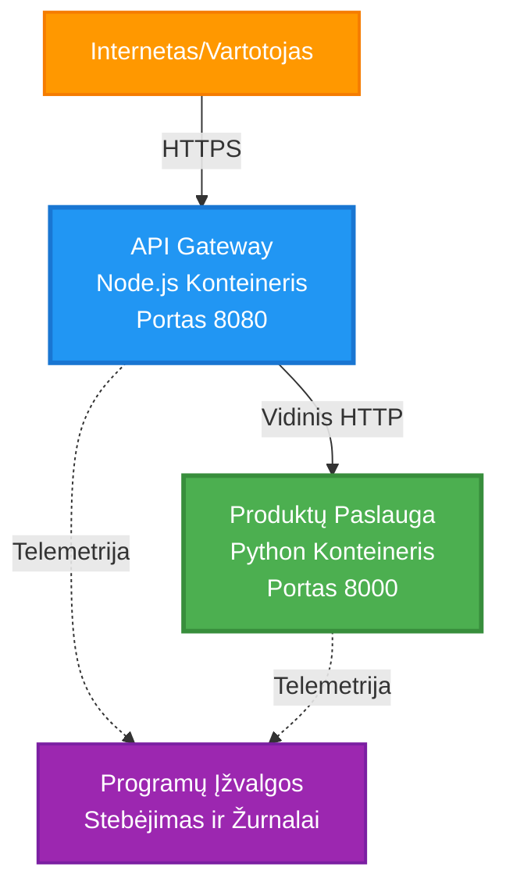
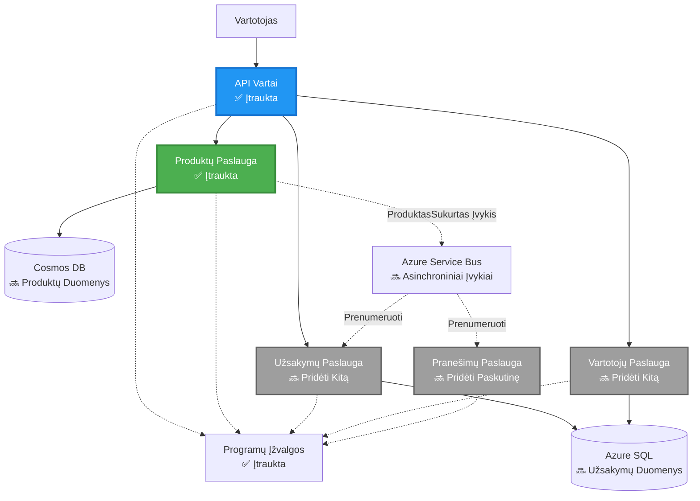
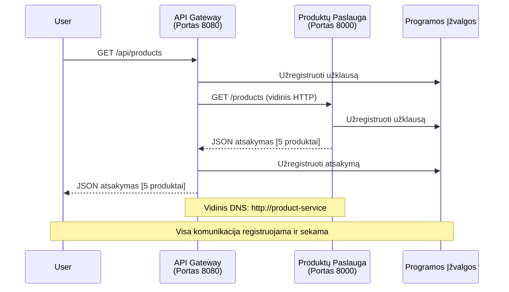

<!--
CO_OP_TRANSLATOR_METADATA:
{
  "original_hash": "eb3a4803a1e80a7f2e64f6bf63738c0f",
  "translation_date": "2025-11-24T10:12:40+00:00",
  "source_file": "examples/microservices/README.md",
  "language_code": "lt"
}
-->
# Mikroservisų architektūra - Konteinerių programos pavyzdys

⏱️ **Numatomas laikas**: 25-35 minutės | 💰 **Numatoma kaina**: ~$50-100/mėn | ⭐ **Sudėtingumas**: Pažengęs

**📚 Mokymosi kelias:**
- ← Ankstesnis: [Paprastas Flask API](../../../../examples/container-app/simple-flask-api) - Vieno konteinerio pagrindai
- 🎯 **Jūs esate čia**: Mikroservisų architektūra (2 paslaugų pagrindas)
- → Kitas: [AI integracija](../../../../docs/ai-foundry) - Pridėkite intelektą savo paslaugoms
- 🏠 [Kurso pradžia](../../README.md)

---

**Supaprastinta, bet funkcionali** mikroservisų architektūra, diegiama Azure Container Apps naudojant AZD CLI. Šis pavyzdys demonstruoja paslaugų tarpusavio komunikaciją, konteinerių orkestraciją ir stebėjimą su praktiniu 2 paslaugų sąrankos modeliu.

> **📚 Mokymosi metodas**: Šis pavyzdys prasideda nuo minimalios 2 paslaugų architektūros (API Gateway + Backend Service), kurią galite iš tikrųjų diegti ir mokytis. Įvaldę šį pagrindą, pateikiame gaires, kaip plėsti iki pilnos mikroservisų ekosistemos.

## Ką išmoksite

Baigę šį pavyzdį, jūs:
- Diegsite kelis konteinerius Azure Container Apps
- Įgyvendinsite paslaugų tarpusavio komunikaciją su vidiniu tinklu
- Konfigūruosite aplinkos pagrindu veikiančią mastelio keitimą ir sveikatos patikrinimus
- Stebėsite paskirstytas programas naudodami Application Insights
- Suprasite mikroservisų diegimo modelius ir geriausią praktiką
- Išmoksite progresyviai plėsti nuo paprastos iki sudėtingos architektūros

## Architektūra

### 1 etapas: Ką kuriame (įtraukta į šį pavyzdį)


**Komponentų detalės:**

| Komponentas | Paskirtis | Prieiga | Ištekliai |
|-------------|-----------|---------|-----------|
| **API Gateway** | Maršrutizuoja išorinius užklausimus į galines paslaugas | Vieša (HTTPS) | 1 vCPU, 2GB RAM, 2-20 replikų |
| **Produktų paslauga** | Valdo produktų katalogą su atmintyje saugomais duomenimis | Tik vidinė | 0.5 vCPU, 1GB RAM, 1-10 replikų |
| **Application Insights** | Centralizuotas žurnalų ir paskirstyto sekimo stebėjimas | Azure Portal | 1-2 GB/mėn duomenų įrašymas |

**Kodėl pradėti paprastai?**
- ✅ Greitai diegti ir suprasti (25-35 minutės)
- ✅ Išmokti pagrindinius mikroservisų modelius be sudėtingumo
- ✅ Veikiantis kodas, kurį galite modifikuoti ir eksperimentuoti
- ✅ Mažesnės mokymosi išlaidos (~$50-100/mėn prieš $300-1400/mėn)
- ✅ Pasitikėjimo ugdymas prieš pridedant duomenų bazes ir pranešimų eilutes

**Analogija**: Tai kaip mokytis vairuoti. Pradėkite nuo tuščios stovėjimo aikštelės (2 paslaugos), įvaldykite pagrindus, tada pereikite prie miesto eismo (5+ paslaugos su duomenų bazėmis).

### 2 etapas: Ateities plėtra (nuorodų architektūra)

Kai įvaldysite 2 paslaugų architektūrą, galite plėsti:


Žr. „Plėtros vadovą“ skyriuje pabaigoje, kad gautumėte žingsnis po žingsnio instrukcijas.

## Įtrauktos funkcijos

✅ **Paslaugų atradimas**: Automatinis DNS pagrindu veikiantis atradimas tarp konteinerių  
✅ **Krovos balansavimas**: Įmontuotas krovos balansavimas tarp replikų  
✅ **Automatinis mastelio keitimas**: Nepriklausomas mastelio keitimas kiekvienai paslaugai pagal HTTP užklausas  
✅ **Sveikatos stebėjimas**: Liveness ir readiness zondai abiem paslaugoms  
✅ **Paskirstytas žurnalų stebėjimas**: Centralizuotas žurnalų stebėjimas su Application Insights  
✅ **Vidinis tinklas**: Saugus paslaugų tarpusavio komunikavimas  
✅ **Konteinerių orkestracija**: Automatinis diegimas ir mastelio keitimas  
✅ **Atnaujinimai be prastovų**: Rolling updates su versijų valdymu  

## Reikalavimai

### Reikalingi įrankiai

Prieš pradėdami, patikrinkite, ar turite šiuos įrankius:

1. **[Azure Developer CLI (azd)](https://learn.microsoft.com/azure/developer/azure-developer-cli/install-azd)** (versija 1.0.0 ar naujesnė)
   ```bash
   azd version
   # Tikėtinas rezultatas: azd versija 1.0.0 arba aukštesnė
   ```

2. **[Azure CLI](https://learn.microsoft.com/cli/azure/install-azure-cli)** (versija 2.50.0 ar naujesnė)
   ```bash
   az --version
   # Tikėtinas rezultatas: azure-cli 2.50.0 arba naujesnė
   ```

3. **[Docker](https://www.docker.com/get-started)** (vietiniam kūrimui/testavimui - neprivaloma)
   ```bash
   docker --version
   # Tikėtinas rezultatas: Docker versija 20.10 arba naujesnė
   ```

### Patikrinkite savo sąranką

Paleiskite šias komandas, kad patvirtintumėte pasirengimą:

```bash
# Patikrinkite Azure Developer CLI
azd version
# ✅ Tikėtasi: azd versija 1.0.0 arba naujesnė

# Patikrinkite Azure CLI
az --version
# ✅ Tikėtasi: azure-cli 2.50.0 arba naujesnė

# Patikrinkite Docker (neprivaloma)
docker --version
# ✅ Tikėtasi: Docker versija 20.10 arba naujesnė
```

**Sėkmės kriterijai**: Visos komandos grąžina versijų numerius, atitinkančius arba viršijančius minimalius reikalavimus.

### Azure reikalavimai

- Aktyvi **Azure prenumerata** ([sukurkite nemokamą paskyrą](https://azure.microsoft.com/free/))
- Leidimai kurti išteklius jūsų prenumeratoje
- **Contributor** rolė prenumeratoje arba išteklių grupėje

### Žinių reikalavimai

Tai yra **pažengusio lygio** pavyzdys. Turėtumėte:
- Baigti [Paprasto Flask API pavyzdį](../../../../examples/container-app/simple-flask-api) 
- Turėti pagrindinį mikroservisų architektūros supratimą
- Būti susipažinę su REST API ir HTTP
- Suprasti konteinerių koncepcijas

**Naujokas konteinerių programose?** Pradėkite nuo [Paprasto Flask API pavyzdžio](../../../../examples/container-app/simple-flask-api), kad išmoktumėte pagrindus.

## Greitas startas (žingsnis po žingsnio)

### 1 žingsnis: Klonuokite ir pereikite

```bash
git clone https://github.com/microsoft/AZD-for-beginners.git
cd AZD-for-beginners/examples/microservices
```

**✓ Sėkmės patikrinimas**: Patikrinkite, ar matote `azure.yaml`:
```bash
ls
# Tikimasi: README.md, azure.yaml, infra/, src/
```

### 2 žingsnis: Autentifikuokitės su Azure

```bash
azd auth login
```

Tai atidaro jūsų naršyklę Azure autentifikacijai. Prisijunkite su savo Azure kredencialais.

**✓ Sėkmės patikrinimas**: Turėtumėte matyti:
```
Logged in to Azure.
```

### 3 žingsnis: Inicializuokite aplinką

```bash
azd init
```

**Klausimai, kuriuos matysite**:
- **Aplinkos pavadinimas**: Įveskite trumpą pavadinimą (pvz., `microservices-dev`)
- **Azure prenumerata**: Pasirinkite savo prenumeratą
- **Azure vieta**: Pasirinkite regioną (pvz., `eastus`, `westeurope`)

**✓ Sėkmės patikrinimas**: Turėtumėte matyti:
```
SUCCESS: New project initialized!
```

### 4 žingsnis: Diekite infrastruktūrą ir paslaugas

```bash
azd up
```

**Kas vyksta** (trunka 8-12 minučių):

```mermaid
graph LR
    A[azd up] --> B[Sukurti Išteklių Grupę]
    B --> C[Diegti Konteinerių Registrą]
    C --> D[Diegti Žurnalų Analitiką]
    D --> E[Diegti Programos Įžvalgas]
    E --> F[Sukurti Konteinerių Aplinką]
    F --> G[Sukurti API Vartų Atvaizdą]
    F --> H[Sukurti Produkto Paslaugos Atvaizdą]
    G --> I[Įkelti į Registrą]
    H --> I
    I --> J[Diegti API Vartus]
    I --> K[Diegti Produkto Paslaugą]
    J --> L[Konfigūruoti Ingress & Sveikatos Patikrinimus]
    K --> L
    L --> M[Diegimas Baigtas ✓]
    
    style A fill:#2196F3,stroke:#1976D2,stroke-width:3px,color:#fff
    style M fill:#4CAF50,stroke:#388E3C,stroke-width:3px,color:#fff
```


**✓ Sėkmės patikrinimas**: Turėtumėte matyti:
```
SUCCESS: Your application was deployed to Azure in X minutes Y seconds.
Endpoint: https://api-gateway-<unique-id>.azurecontainerapps.io
```

**⏱️ Laikas**: 8-12 minučių

### 5 žingsnis: Išbandykite diegimą

```bash
# Gauti šliuzo galinį tašką
GATEWAY_URL=$(azd env get-values | grep API_GATEWAY_URL | cut -d '=' -f2 | tr -d '"')

# Patikrinti API šliuzo būklę
curl $GATEWAY_URL/health
```

**✅ Tikėtinas rezultatas:**
```json
{
  "status": "healthy",
  "service": "api-gateway",
  "timestamp": "2025-11-19T10:30:00Z"
}
```

**Išbandykite produktų paslaugą per gateway**:
```bash
# Sąrašo produktai
curl $GATEWAY_URL/api/products
```

**✅ Tikėtinas rezultatas:**
```json
[
  {"id":1,"name":"Laptop","price":999.99,"stock":50},
  {"id":2,"name":"Mouse","price":29.99,"stock":200},
  {"id":3,"name":"Keyboard","price":79.99,"stock":150}
]
```

**✓ Sėkmės patikrinimas**: Abu galiniai taškai grąžina JSON duomenis be klaidų.

---

**🎉 Sveikiname!** Jūs įdiegėte mikroservisų architektūrą Azure!

## Projekto struktūra

Visi įgyvendinimo failai yra įtraukti—tai yra pilnas, veikiantis pavyzdys:

```
microservices/
│
├── README.md                         # This file
├── azure.yaml                        # AZD configuration
├── .gitignore                        # Git ignore patterns
│
├── infra/                           # Infrastructure as Code (Bicep)
│   ├── main.bicep                   # Main orchestration
│   ├── abbreviations.json           # Naming conventions
│   ├── core/                        # Shared infrastructure
│   │   ├── container-apps-environment.bicep  # Container environment + registry
│   │   └── monitor.bicep            # Application Insights + Log Analytics
│   └── app/                         # Service definitions
│       ├── api-gateway.bicep        # API Gateway container app
│       └── product-service.bicep    # Product Service container app
│
└── src/                             # Application source code
    ├── api-gateway/                 # Node.js API Gateway
    │   ├── app.js                   # Express server with routing
    │   ├── package.json             # Node dependencies
    │   └── Dockerfile               # Container definition
    └── product-service/             # Python Product Service
        ├── main.py                  # Flask API with product data
        ├── requirements.txt         # Python dependencies
        └── Dockerfile               # Container definition
```

**Ką daro kiekvienas komponentas:**

**Infrastruktūra (infra/)**:
- `main.bicep`: Orkestruoja visus Azure išteklius ir jų priklausomybes
- `core/container-apps-environment.bicep`: Sukuria Container Apps aplinką ir Azure Container Registry
- `core/monitor.bicep`: Nustato Application Insights paskirstytam žurnalų stebėjimui
- `app/*.bicep`: Individualių konteinerių programų apibrėžimai su mastelio keitimu ir sveikatos patikrinimais

**API Gateway (src/api-gateway/)**:
- Viešai prieinama paslauga, kuri maršrutizuoja užklausas į galines paslaugas
- Įgyvendina žurnalų stebėjimą, klaidų tvarkymą ir užklausų persiuntimą
- Demonstruoja paslaugų tarpusavio HTTP komunikaciją

**Produktų paslauga (src/product-service/)**:
- Vidinė paslauga su produktų katalogu (paprastumo dėlei atmintyje)
- REST API su sveikatos patikrinimais
- Galinės mikroservisų paslaugos modelio pavyzdys

## Paslaugų apžvalga

### API Gateway (Node.js/Express)

**Portas**: 8080  
**Prieiga**: Vieša (išorinis įėjimas)  
**Paskirtis**: Maršrutizuoja gaunamas užklausas į tinkamas galines paslaugas  

**Galiniai taškai**:
- `GET /` - Paslaugos informacija
- `GET /health` - Sveikatos patikrinimo galinis taškas
- `GET /api/products` - Persiuntimas į produktų paslaugą (visi produktai)
- `GET /api/products/:id` - Persiuntimas į produktų paslaugą (pagal ID)

**Pagrindinės funkcijos**:
- Užklausų maršrutizavimas su axios
- Centralizuotas žurnalų stebėjimas
- Klaidų tvarkymas ir laiko valdymas
- Paslaugų atradimas per aplinkos kintamuosius
- Application Insights integracija

**Kodo akcentas** (`src/api-gateway/app.js`):
```javascript
// Vidinė paslaugų komunikacija
app.get('/api/products', async (req, res) => {
  const response = await axios.get(`${PRODUCT_SERVICE_URL}/products`, {
    timeout: 5000
  });
  res.json(response.data);
});
```

### Produktų paslauga (Python/Flask)

**Portas**: 8000  
**Prieiga**: Tik vidinė (be išorinio įėjimo)  
**Paskirtis**: Valdo produktų katalogą su atmintyje saugomais duomenimis  

**Galiniai taškai**:
- `GET /` - Paslaugos informacija
- `GET /health` - Sveikatos patikrinimo galinis taškas
- `GET /products` - Visi produktai
- `GET /products/<id>` - Produktas pagal ID

**Pagrindinės funkcijos**:
- RESTful API su Flask
- Atmintyje saugoma produktų parduotuvė (paprasta, be duomenų bazės)
- Sveikatos stebėjimas su zondais
- Struktūrizuotas žurnalų stebėjimas
- Application Insights integracija

**Duomenų modelis**:
```python
{
  "id": 1,
  "name": "Laptop",
  "description": "High-performance laptop",
  "price": 999.99,
  "stock": 50
}
```

**Kodėl tik vidinė prieiga?**
Produktų paslauga nėra viešai prieinama. Visos užklausos turi būti siunčiamos per API Gateway, kuris užtikrina:
- Saugumą: Kontroliuojamas prieigos taškas
- Lankstumą: Galima keisti galinę paslaugą nepaveikiant klientų
- Stebėjimą: Centralizuotas užklausų žurnalų stebėjimas

## Paslaugų komunikacijos supratimas

### Kaip paslaugos bendrauja tarpusavyje


Šiame pavyzdyje API Gateway bendrauja su Produktų paslauga naudodamas **vidinius HTTP skambučius**:

```javascript
// API Gateway (src/api-gateway/app.js)
const PRODUCT_SERVICE_URL = process.env.PRODUCT_SERVICE_URL;

// Atlikti vidinį HTTP užklausą
const response = await axios.get(`${PRODUCT_SERVICE_URL}/products`);
```

**Pagrindiniai punktai**:

1. **DNS pagrindu veikiantis atradimas**: Container Apps automatiškai suteikia DNS vidinėms paslaugoms
   - Produktų paslaugos FQDN: `product-service.internal.<environment>.azurecontainerapps.io`
   - Supaprastinta kaip: `http://product-service` (Container Apps tai išsprendžia)

2. **Be viešos prieigos**: Produktų paslauga turi `external: false` Bicep faile
   - Prieinama tik Container Apps aplinkoje
   - Negalima pasiekti iš interneto

3. **Aplinkos kintamieji**: Paslaugų URL įterpiami diegimo metu
   - Bicep perduoda vidinį FQDN į gateway
   - Nėra kietai užkoduotų URL programos kode

**Analogija**: Tai kaip biuro kambariai. API Gateway yra registratūra (viešai prieinama), o Produktų paslauga yra biuro kambarys (tik vidinė). Lankytojai turi eiti per registratūrą, kad pasiektų bet kurį biurą.

## Diegimo parinktys

### Pilnas diegimas (rekomenduojama)

```bash
# Įdiegti infrastruktūrą ir abi paslaugas
azd up
```

Tai diegia:
1. Container Apps aplinką
2. Application Insights
3. Container Registry
4. API Gateway konteinerį
5. Produktų paslaugos konteinerį

**Laikas**: 8-12 minučių

### Diegti atskirą paslaugą

```bash
# Įdiegti tik vieną paslaugą (po pradinio azd up)
azd deploy api-gateway

# Arba įdiegti produkto paslaugą
azd deploy product-service
```

**Naudojimo atvejis**: Kai atnaujinote kodą vienoje paslaugoje ir norite iš naujo diegti tik tą paslaugą.

### Atnaujinti konfigūraciją

```bash
# Pakeisti mastelio parametrus
azd env set GATEWAY_MAX_REPLICAS 30

# Iš naujo įdiegti su nauja konfigūracija
azd up
```

## Konfigūracija

### Mastelio keitimo konfigūracija

Abi paslaugos yra konfigūruotos HTTP pagrindu veikiančiam automatinio mastelio keitimui jų Bicep failuose:

**API Gateway**:
- Min replikos: 2 (visada bent 2 dėl prieinamumo)
- Maks replikos: 20
- Mastelio keitimo trigeris: 50 vienu metu vykdomų užklausų per repliką

**Produktų paslauga**:
- Min replikos: 1 (gali būti mastelio keitimas iki nulio, jei reikia)
- Maks replikos: 10
- Mastelio keitimo trigeris: 100 vienu metu vykdomų užklausų per repliką

**Tinkinti mastelio keitimą** (faile `infra/app/*.bicep`):
```bicep
scale: {
  minReplicas: 1
  maxReplicas: 10
  rules: [
    {
      name: 'http-scale-rule'
      http: {
        metadata: {
          concurrentRequests: '100'  // Adjust this
        }
      }
    }
  ]
}
```

### Išteklių paskirstymas

**API Gateway**:
- CPU: 1.0 vCPU
- Atmintis: 2 GiB
- Priežastis: Tvarko visą išorinį srautą

**Produktų paslauga**:
- CPU: 0.5 vCPU
- Atmintis: 1 GiB
- Priežastis: Lengvi atmintyje saugomi veiksmai

### Sveikatos patikrinimai

Abi paslaugos apima liveness ir readiness zondus:

```bicep
probes: [
  {
    type: 'Liveness'
    httpGet: {
      path: '/health'
      port: 8080
    }
    initialDelaySeconds: 10
    periodSeconds: 30
  }
  {
    type: 'Readiness'
    httpGet: {
      path: '/health'
      port: 8080
    }
    initialDelaySeconds: 5
    periodSeconds: 10
  }
]
```

**Ką tai reiškia**:
- **Liveness**: Jei sveikatos patikrinimas nepavyksta, Container Apps iš naujo paleidžia konteinerį
- **Readiness**: Jei nepasiruošęs, Container Apps sustabdo srauto nukreipimą į tą repliką

## Stebėjimas ir stebėjimo galimybės

### Peržiūrėti paslaugų žurnalus

```bash
# Transliuoti žurnalus iš API Gateway
azd logs api-gateway --follow

# Peržiūrėti naujausius produktų paslaugos žurnalus
azd logs product-service --tail 100

# Peržiūrėti visus abiejų paslaugų žurnalus
azd logs --follow
```

**Tikėtinas rezultatas**:
```
[api-gateway] API Gateway listening on port 8080
[api-gateway] Product Service URL: http://product-service
[api-gateway] GET /api/products 200 - 45ms
[product-service] Retrieved 5 products
```

### Application Insights užklausos

Pasiekite Application Insights Azure portale, tada vykdykite šias užklausas:

**Rasti lėtas užklausas**:
```kusto
requests
| where timestamp > ago(1h)
| where duration > 1000  // Requests taking >1 second
| summarize count() by name, cloud_RoleName
| order by count_ desc
```

**Sekti paslaugų tarpusavio skambučius**:
```kusto
dependencies
| where timestamp > ago(1h)
| where type == "Http"
| project timestamp, name, target, duration, success
| order by timestamp desc
```

**Klaidų dažnis pagal paslaugą**:
```kusto
exceptions
| where timestamp > ago(24h)
| summarize errorCount = count() by cloud_RoleName, type
| order by errorCount desc
```


3. Iš naujo įdiegti abu servisus:

```bash
azd deploy product-service
azd deploy api-gateway
```

4. Patikrinti naują galinį tašką:

```bash
GATEWAY_URL=$(azd env get-values | grep API_GATEWAY_URL | cut -d '=' -f2 | tr -d '"')

# Sukurti naują produktą
curl -X POST $GATEWAY_URL/api/products \
  -H "Content-Type: application/json" \
  -d '{"name":"USB Cable","price":9.99,"stock":500}'
```

**✅ Tikėtinas rezultatas:**
```json
{"id":6,"name":"USB Cable","description":"","price":9.99,"stock":500}
```

5. Patikrinti, ar jis rodomas sąraše:

```bash
curl $GATEWAY_URL/api/products
# Dabar turėtų rodyti 6 produktus, įskaitant naują USB kabelį
```

**Sėkmės kriterijai**:
- ✅ POST užklausa grąžina HTTP 201
- ✅ Naujas produktas rodomas GET /api/products sąraše
- ✅ Produktas turi automatiškai didėjantį ID

**Laikas**: 10-15 minučių

---

### Užduotis 2: Pakeisti automatinio mastelio keitimo taisykles ⭐⭐ (Vidutinis)

**Tikslas**: Pakeisti Product Service, kad jis mastelį keistų agresyviau

**Pradinis taškas**: `infra/app/product-service.bicep`

**Žingsniai**:

1. Atidarykite `infra/app/product-service.bicep` ir suraskite `scale` bloką (apie 95 eilutę)

2. Pakeiskite iš:
```bicep
scale: {
  minReplicas: 1
  maxReplicas: 10
  rules: [
    {
      name: 'http-scale-rule'
      http: {
        metadata: {
          concurrentRequests: '100'  // OLD
        }
      }
    }
  ]
}
```

Į:
```bicep
scale: {
  minReplicas: 2  // Always have 2 running
  maxReplicas: 20  // Allow more scaling
  rules: [
    {
      name: 'http-scale-rule'
      http: {
        metadata: {
          concurrentRequests: '20'  // Scale at lower threshold
        }
      }
    }
  ]
}
```

3. Iš naujo įdiegti infrastruktūrą:

```bash
azd up
```

4. Patikrinti naują mastelio keitimo konfigūraciją:

```bash
az containerapp show \
  --name $(azd env get-values | grep PRODUCT_SERVICE | head -1 | cut -d '/' -f5) \
  --resource-group $(azd env get-values | grep AZURE_RESOURCE_GROUP | cut -d '=' -f2 | tr -d '"') \
  --query "properties.template.scale" -o json
```

**✅ Tikėtinas rezultatas:**
```json
{
  "minReplicas": 2,
  "maxReplicas": 20,
  "rules": [...]
}
```

5. Patikrinti mastelio keitimą su apkrova:

```bash
# Generuoti lygiagrečius užklausas
for i in {1..500}; do curl $GATEWAY_URL/api/products & done

# Stebėti mastelio keitimą
azd logs product-service --follow
# Ieškoti: „Container Apps“ mastelio keitimo įvykių
```

**Sėkmės kriterijai**:
- ✅ Product Service visada veikia bent su 2 replikomis
- ✅ Esant apkrovai, mastelis padidėja daugiau nei iki 2 replikų
- ✅ Azure Portal rodo naujas mastelio keitimo taisykles

**Laikas**: 15-20 minučių

---

### Užduotis 3: Pridėti individualų stebėjimo užklausą ⭐⭐ (Vidutinis)

**Tikslas**: Sukurti individualią Application Insights užklausą produktų API našumui stebėti

**Žingsniai**:

1. Eikite į Application Insights Azure portale:
   - Atidarykite Azure Portal
   - Suraskite savo resursų grupę (rg-microservices-*)
   - Spustelėkite Application Insights resursą

2. Kairiajame meniu spustelėkite "Logs"

3. Sukurkite šią užklausą:

```kusto
requests
| where timestamp > ago(1h)
| where name contains "products"
| summarize 
    RequestCount = count(),
    AvgDuration = avg(duration),
    P95Duration = percentile(duration, 95),
    SuccessRate = 100.0 * countif(success == true) / count()
  by bin(timestamp, 5m)
| render timechart
```

4. Spustelėkite "Run", kad paleistumėte užklausą

5. Išsaugokite užklausą:
   - Spustelėkite "Save"
   - Pavadinimas: "Product API Performance"
   - Kategorija: "Performance"

6. Sukurkite testinį srautą:

```bash
for i in {1..100}; do curl $GATEWAY_URL/api/products; sleep 1; done
```

7. Atnaujinkite užklausą, kad pamatytumėte duomenis

**✅ Tikėtinas rezultatas:**
- Grafikas, rodantis užklausų skaičių laikui bėgant
- Vidutinė trukmė < 500ms
- Sėkmės rodiklis = 100%
- 5 minučių laiko intervalai

**Sėkmės kriterijai**:
- ✅ Užklausa rodo 100+ užklausų
- ✅ Sėkmės rodiklis yra 100%
- ✅ Vidutinė trukmė < 500ms
- ✅ Grafikas rodo 5 minučių laiko intervalus

**Mokymosi rezultatas**: Suprasti, kaip stebėti paslaugų našumą naudojant individualias užklausas

**Laikas**: 10-15 minučių

---

### Užduotis 4: Įgyvendinti pakartotinio bandymo logiką ⭐⭐⭐ (Sudėtinga)

**Tikslas**: Pridėti pakartotinio bandymo logiką API Gateway, kai Product Service laikinai nepasiekiamas

**Pradinis taškas**: `src/api-gateway/app.js`

**Žingsniai**:

1. Įdiegti pakartotinio bandymo biblioteką:

```bash
cd src/api-gateway
npm install axios-retry --save
cd ../..
```

2. Atnaujinti `src/api-gateway/app.js` (pridėti po axios importo):

```javascript
const axiosRetry = require('axios-retry');

// Konfigūruoti pakartojimo logiką
axiosRetry(axios, {
  retries: 3,
  retryDelay: (retryCount) => {
    return retryCount * 1000; // 1s, 2s, 3s
  },
  retryCondition: (error) => {
    // Pakartoti tinklo klaidų arba 5xx atsakymų atveju
    return axiosRetry.isNetworkOrIdempotentRequestError(error) ||
           (error.response && error.response.status >= 500);
  }
});

console.log('Retry logic configured: 3 retries with exponential backoff');
```

3. Iš naujo įdiegti API Gateway:

```bash
azd deploy api-gateway
```

4. Patikrinti pakartotinio bandymo elgesį, simuliuojant paslaugos gedimą:

```bash
# Sumažinkite produkto paslaugą iki 0 (simuliuokite gedimą)
az containerapp update \
  --name $(azd env get-values | grep PRODUCT_SERVICE | head -1 | cut -d '/' -f5) \
  --resource-group $(azd env get-values | grep AZURE_RESOURCE_GROUP | cut -d '=' -f2 | tr -d '"') \
  --min-replicas 0 \
  --max-replicas 0

# Pabandykite pasiekti produktus (bandys 3 kartus)
time curl -v $GATEWAY_URL/api/products
# Stebėkite: Atsakymas užtrunka ~6 sekundes (1s + 2s + 3s bandymai)

# Atkurkite produkto paslaugą
az containerapp update \
  --name $(azd env get-values | grep PRODUCT_SERVICE | head -1 | cut -d '/' -f5) \
  --resource-group $(azd env get-values | grep AZURE_RESOURCE_GROUP | cut -d '=' -f2 | tr -d '"') \
  --min-replicas 1 \
  --max-replicas 10
```

5. Peržiūrėti pakartotinių bandymų žurnalus:

```bash
azd logs api-gateway --tail 50
# Ieškokite: Bandymo pakartoti pranešimų
```

**✅ Tikėtinas elgesys:**
- Užklausos bandomos 3 kartus prieš nepavykstant
- Kiekvienas bandymas laukia ilgiau (1s, 2s, 3s)
- Sėkmingos užklausos po paslaugos atnaujinimo
- Žurnaluose rodomi pakartotinių bandymų bandymai

**Sėkmės kriterijai**:
- ✅ Užklausos bandomos 3 kartus prieš nepavykstant
- ✅ Kiekvienas bandymas laukia ilgiau (eksponentinis atidėjimas)
- ✅ Sėkmingos užklausos po paslaugos atnaujinimo
- ✅ Žurnaluose rodomi pakartotinių bandymų bandymai

**Mokymosi rezultatas**: Suprasti atsparumo modelius mikroservisuose (circuit breakers, pakartotiniai bandymai, laiko limitai)

**Laikas**: 20-25 minutės

---

## Žinių patikrinimo taškas

Baigę šį pavyzdį, patikrinkite savo supratimą:

### 1. Paslaugų komunikacija ✓

Patikrinkite savo žinias:
- [ ] Ar galite paaiškinti, kaip API Gateway aptinka Product Service? (DNS pagrįsta paslaugų aptikimas)
- [ ] Kas nutinka, jei Product Service neveikia? (Gateway grąžina 503 klaidą)
- [ ] Kaip pridėtumėte trečią paslaugą? (Sukurti naują Bicep failą, pridėti prie main.bicep, sukurti src aplanką)

**Praktinis patikrinimas:**
```bash
# Simuliuoti paslaugos gedimą
az containerapp update --name <product-service-name> --min-replicas 0 --max-replicas 0
curl $GATEWAY_URL/api/products
# ✅ Tikėtasi: 503 Paslauga neprieinama

# Atkurti paslaugą
az containerapp update --name <product-service-name> --min-replicas 1 --max-replicas 10
```

### 2. Stebėjimas ir stebimumas ✓

Patikrinkite savo žinias:
- [ ] Kur matote paskirstytus žurnalus? (Application Insights Azure portale)
- [ ] Kaip stebite lėtas užklausas? (Kusto užklausa: `requests | where duration > 1000`)
- [ ] Ar galite nustatyti, kuri paslauga sukėlė klaidą? (Patikrinkite `cloud_RoleName` lauką žurnaluose)

**Praktinis patikrinimas:**
```bash
# Sukurti lėto užklausos simuliaciją
curl "$GATEWAY_URL/api/products?delay=2000"

# Užklausti Application Insights dėl lėtų užklausų
# Eiti į Azure Portal → Application Insights → Logs
# Vykdyti: requests | where duration > 1000 | project timestamp, name, duration, cloud_RoleName
```

### 3. Mastelio keitimas ir našumas ✓

Patikrinkite savo žinias:
- [ ] Kas sukelia automatinį mastelio keitimą? (HTTP vienu metu vykdomų užklausų taisyklės: 50 gateway, 100 produktui)
- [ ] Kiek replikų šiuo metu veikia? (Patikrinkite su `az containerapp revision list`)
- [ ] Kaip padidintumėte Product Service iki 5 replikų? (Atnaujinkite minReplicas Bicep faile)

**Praktinis patikrinimas:**
```bash
# Generuoti apkrovą, kad būtų galima išbandyti automatinį mastelio keitimą
for i in {1..1000}; do curl $GATEWAY_URL/api/products & done

# Stebėti replikų didėjimą
azd logs api-gateway --follow
# ✅ Tikėtasi: Matyti mastelio keitimo įvykius žurnaluose
```

**Sėkmės kriterijai**: Galite atsakyti į visus klausimus ir patikrinti su praktiniais komandomis.

---

## Kainų analizė

### Numatoma mėnesio kaina (šiam 2 paslaugų pavyzdžiui)

| Resursas | Konfigūracija | Numatoma kaina |
|----------|--------------|----------------|
| API Gateway | 2-20 replikų, 1 vCPU, 2GB RAM | $30-150 |
| Product Service | 1-10 replikų, 0.5 vCPU, 1GB RAM | $15-75 |
| Container Registry | Basic tier | $5 |
| Application Insights | 1-2 GB/mėn | $5-10 |
| Log Analytics | 1 GB/mėn | $3 |
| **Iš viso** | | **$58-243/mėn** |

### Kainų paskirstymas pagal naudojimą

**Mažas srautas** (testavimas/mokymasis): ~60 $/mėn
- API Gateway: 2 replikos × 24/7 = $30
- Product Service: 1 replika × 24/7 = $15
- Stebėjimas + registras = $13

**Vidutinis srautas** (maža gamyba): ~120 $/mėn
- API Gateway: 5 vidutinės replikos = $75
- Product Service: 3 vidutinės replikos = $45
- Stebėjimas + registras = $13

**Didelis srautas** (aktyvūs laikotarpiai): ~240 $/mėn
- API Gateway: 15 vidutinių replikų = $225
- Product Service: 8 vidutinės replikos = $120
- Stebėjimas + registras = $13

### Kainų optimizavimo patarimai

1. **Mastelio mažinimas iki nulio vystymui**:
   ```bicep
   scale: {
     minReplicas: 0  // Save $30-40/month when not in use
     maxReplicas: 10
   }
   ```

2. **Naudokite Cosmos DB vartojimo planą** (kai pridėsite jį):
   - Mokėkite tik už tai, ką naudojate
   - Nėra minimalaus mokesčio

3. **Nustatykite Application Insights mėginių ėmimą**:
   ```javascript
   appInsights.defaultClient.config.samplingPercentage = 50; // Atrinkite 50% užklausų
   ```

4. **Išvalykite, kai nereikia**:
   ```bash
   azd down --force --purge
   ```

### Nemokamos galimybės

Mokymuisi/testavimui apsvarstykite:
- ✅ Naudokite Azure nemokamus kreditus ($200 per pirmąsias 30 dienų su naujomis paskyromis)
- ✅ Laikykite minimalias replikas (sutaupysite ~50% išlaidų)
- ✅ Ištrinkite po testavimo (jokių nuolatinių mokesčių)
- ✅ Mastelio mažinimas iki nulio tarp mokymosi sesijų

**Pavyzdys**: Vykdant šį pavyzdį 2 valandas per dieną × 30 dienų = ~5 $/mėn vietoj 60 $/mėn

---

## Trikčių šalinimo greitoji nuoroda

### Problema: `azd up` nepavyksta su "Prenumerata nerasta"

**Sprendimas**:
```bash
# Prisijunkite dar kartą su aiškia prenumerata
az account set --subscription <your-subscription-id>
azd env set AZURE_SUBSCRIPTION_ID <your-subscription-id>
azd up
```

### Problema: API Gateway grąžina 503 "Product service unavailable"

**Diagnostika**:
```bash
# Patikrinkite produkto paslaugų žurnalus
azd logs product-service --tail 50

# Patikrinkite produkto paslaugų būklę
az containerapp show \
  --name $(azd env get-values | grep PRODUCT_SERVICE | head -1 | cut -d '/' -f5) \
  --resource-group $(azd env get-values | grep AZURE_RESOURCE_GROUP | cut -d '=' -f2 | tr -d '"') \
  --query "properties.runningStatus"
```

**Dažnos priežastys**:
1. Product service nepradėjo veikti (patikrinkite Python klaidas žurnaluose)
2. Sveikatos patikra nepavyksta (patikrinkite `/health` galinį tašką)
3. Konteinerio vaizdo kūrimas nepavyko (patikrinkite registrą dėl vaizdo)

### Problema: Automatinis mastelio keitimas neveikia

**Diagnostika**:
```bash
# Patikrinkite dabartinį replikų skaičių
az containerapp revision list \
  --name $(azd env get-values | grep API_GATEWAY | head -1 | cut -d '/' -f5) \
  --resource-group $(azd env get-values | grep AZURE_RESOURCE_GROUP | cut -d '=' -f2 | tr -d '"') \
  --query "[].properties.replicas"

# Generuokite apkrovą testavimui
for i in {1..1000}; do curl $GATEWAY_URL/api/products & done

# Stebėkite mastelio keitimo įvykius
azd logs api-gateway --follow | grep -i scale
```

**Dažnos priežastys**:
1. Apkrova nepakankama, kad suaktyvintų mastelio taisyklę (reikia >50 vienu metu vykdomų užklausų)
2. Pasiektas maksimalus replikų skaičius (patikrinkite Bicep konfigūraciją)
3. Mastelio taisyklė neteisingai sukonfigūruota Bicep faile (patikrinkite concurrentRequests reikšmę)

### Problema: Application Insights nerodo žurnalų

**Diagnostika**:
```bash
# Patikrinkite, ar nustatytas ryšio eilutė
azd env get-values | grep APPLICATIONINSIGHTS

# Patikrinkite, ar paslaugos siunčia telemetriją
az monitor app-insights component show \
  --app $(azd env get-values | grep APPLICATIONINSIGHTS_NAME | cut -d '=' -f2 | tr -d '"') \
  --resource-group $(azd env get-values | grep AZURE_RESOURCE_GROUP | cut -d '=' -f2 | tr -d '"') \
  --query "properties.InstrumentationKey"
```

**Dažnos priežastys**:
1. Ryšio eilutė neperduota į konteinerį (patikrinkite aplinkos kintamuosius)
2. Application Insights SDK nesukonfigūruotas (patikrinkite importus kode)
3. Ugniasienė blokuoja telemetriją (retai, patikrinkite tinklo taisykles)

### Problema: Docker kūrimas nepavyksta lokaliai

**Diagnostika**:
```bash
# Testuoti API Gateway kūrimą
cd src/api-gateway
docker build -t test-gateway .

# Testuoti Product Service kūrimą
cd ../product-service
docker build -t test-product .
```

**Dažnos priežastys**:
1. Trūksta priklausomybių package.json/requirements.txt
2. Dockerfile sintaksės klaidos
3. Tinklo problemos atsisiunčiant priklausomybes

**Vis dar kyla problemų?** Žiūrėkite [Dažnų problemų vadovą](../../docs/troubleshooting/common-issues.md) arba [Azure Container Apps trikčių šalinimas](https://learn.microsoft.com/azure/container-apps/troubleshooting)

---

## Išvalymas

Kad išvengtumėte nuolatinių mokesčių, ištrinkite visus resursus:

```bash
azd down --force --purge
```

**Patvirtinimo raginimas**:
```
? Total resources to delete: 6, are you sure you want to continue? (y/N)
```

Įveskite `y`, kad patvirtintumėte.

**Kas bus ištrinta**:
- Container Apps aplinka
- Abi Container Apps (gateway ir product service)
- Container Registry
- Application Insights
- Log Analytics Workspace
- Resursų grupė

**✓ Patikrinkite išvalymą**:
```bash
az group list --query "[?starts_with(name,'rg-microservices')]" --output table
```

Turėtų grąžinti tuščią.

---

## Plėtros vadovas: nuo 2 iki 5+ paslaugų

Kai įvaldysite šią 2 paslaugų architektūrą, štai kaip plėsti:

### 1 etapas: Pridėti duomenų bazės išsaugojimą (Kitas žingsnis)

**Pridėti Cosmos DB Product Service**:

1. Sukurti `infra/core/cosmos.bicep`:
   ```bicep
   resource cosmosAccount 'Microsoft.DocumentDB/databaseAccounts@2023-04-15' = {
     name: name
     location: location
     kind: 'GlobalDocumentDB'
     properties: {
       databaseAccountOfferType: 'Standard'
       consistencyPolicy: { defaultConsistencyLevel: 'Session' }
       locations: [{ locationName: location, failoverPriority: 0 }]
     }
   }
   ```

2. Atnaujinti product service, kad naudotų Azure Cosmos DB Python SDK vietoj atminties duomenų

3. Numatoma papildoma kaina: ~25 $/mėn (serverless)

### 2 etapas: Pridėti trečią paslaugą (Užsakymų valdymas)

**Sukurti Order Service**:

1. Naujas aplankas: `src/order-service/` (Python/Node.js/C#)
2. Naujas Bicep: `infra/app/order-service.bicep`
3. Atnaujinti API Gateway, kad nukreiptų `/api/orders`
4. Pridėti Azure SQL Database užsakymų išsaugojimui

**Architektūra tampa**:
```
API Gateway → Product Service (Cosmos DB)
           → Order Service (Azure SQL)
```

### 3 etapas: Pridėti asinchroninę komunikaciją (Service Bus)

**Įgyvendinti įvykių valdomą architektūrą**:

1. Pridėti Azure Service Bus: `infra/core/servicebus.bicep`
2. Product Service skelbia "ProductCreated" įvykius
3. Order Service prenumeruoja produktų įvykius
4. Pridėti Notification Service įvykiams apdoroti

**Modelis**: Užklausa/Atsakymas (HTTP) + Įvykių valdymas (Service Bus)

### 4 etapas: Pridėti vartotojų autentifikaciją

**Įgyvendinti User Service**:

1. Sukurti `src/user-service/` (Go/Node.js)
2. Pridėti Azure AD B2C arba individualų JWT autentifikavimą
3. API Gateway tikrina žetonus prieš nukreipdamas
4. Paslaugos tikrina vartotojų teises

### 5 etapas: Paruošimas gamybai

**Pridėti šiuos komponentus**:
- ✅ Azure Front Door (globalus apkrovos balansavimas)
- ✅ Azure Key Vault (slaptų duomenų valdymas)
- ✅ Azure Monitor Workbooks (individualūs prietaisų skydeliai)
- ✅ CI/CD Pipeline (GitHub Actions)
- ✅ Blue-Green diegimai
- ✅ Valdomos tapatybės visoms paslaugoms

**Pilnos gamybos architektūros kaina**: ~300-1,400 $/mėn

---

## Sužinokite daugiau

### Susijusi dokumentacija
- [Azure Container Apps dokumentacija](https://learn.microsoft.com/azure/container-apps/)
- [Mikroservisų architektūros vadovas](https://learn.microsoft.com/azure/architecture/guide/architecture-styles/microservices)
- [Application Insights paskirstytam sekimui](https://learn.microsoft.com/azure/azure-monitor/app/distributed-tracing)
- [Azure Developer CLI dokumentacija](https://learn.microsoft.com/azure/developer/azure-developer-cli/)

### Kiti šio kurso žingsniai
- ← Ankstesnis: [Paprastas Flask API](../../../../examples/container-app/simple-flask-api) - Pradedančiųjų vieno konteinerio pavyzdys
- → Kitas: [AI integracijos vadovas](../../../../docs/ai-foundry) - Pridėti AI galimybes
- 🏠 [Kurso pradžia](../../README.md)

### Palyginimas: Kada naudoti ką

| Funkcija | Vienas konteineris | Mikroservisai (Šis) | Kubernetes (AKS) |
|----------|--------------------|---------------------|------------------|
| **Naudojimo atvejis** | Paprastos programos | Sudėtingos programos | Įmonių programos |
| **Mastelio ke
| **Geriausia naudoti** | MVP, prototipai | Produkcinės aplikacijos | Multi-cloud, pažangus tinklas |

**Rekomendacija**: Pradėkite nuo Container Apps (šis pavyzdys), pereikite prie AKS tik tada, jei jums reikia Kubernetes specifinių funkcijų.

---

## Dažniausiai užduodami klausimai

**K: Kodėl tik 2 paslaugos, o ne 5+?**  
A: Mokymosi progresija. Išmokite pagrindus (paslaugų komunikacija, stebėjimas, mastelio keitimas) su paprastu pavyzdžiu prieš pridėdami sudėtingumą. Čia išmokti modeliai taikomi ir 100 paslaugų architektūroms.

**K: Ar galiu pats pridėti daugiau paslaugų?**  
A: Žinoma! Sekite plėtros vadovą aukščiau. Kiekviena nauja paslauga seka tą patį modelį: sukurkite src aplanką, sukurkite Bicep failą, atnaujinkite azure.yaml, diekite.

**K: Ar tai paruošta produkcijai?**  
A: Tai tvirtas pagrindas. Produkcijai pridėkite: valdomą identitetą, Key Vault, nuolatines duomenų bazes, CI/CD procesą, stebėjimo įspėjimus ir atsarginių kopijų strategiją.

**K: Kodėl nenaudoti Dapr ar kitų paslaugų tinklų?**  
A: Mokymosi paprastumas. Kai suprasite natūralų Container Apps tinklą, galėsite pridėti Dapr pažangesniems scenarijams (būsenos valdymas, pub/sub, ryšiai).

**K: Kaip derinti lokaliai?**  
A: Paleiskite paslaugas lokaliai su Docker:  
```bash
cd src/api-gateway
docker build -t local-gateway .
docker run -p 8080:8080 -e PRODUCT_SERVICE_URL=http://localhost:8000 local-gateway
```
  
**K: Ar galiu naudoti skirtingas programavimo kalbas?**  
A: Taip! Šiame pavyzdyje naudojamas Node.js (gateway) + Python (produktų paslauga). Galite maišyti bet kokias kalbas, kurios veikia konteineriuose: C#, Go, Java, Ruby, PHP ir kt.

**K: Ką daryti, jei neturiu Azure kreditų?**  
A: Naudokite Azure nemokamą planą (pirmas 30 dienų su naujomis paskyromis suteikia $200 kreditų) arba diekite trumpiems testavimo laikotarpiams ir ištrinkite iškart. Šis pavyzdys kainuoja ~2 $/dieną.

**K: Kuo tai skiriasi nuo Azure Kubernetes Service (AKS)?**  
A: Container Apps yra paprastesnis (nereikia Kubernetes žinių), bet mažiau lankstus. AKS suteikia pilną Kubernetes kontrolę, bet reikalauja daugiau žinių. Pradėkite nuo Container Apps, pereikite prie AKS, jei reikia.

**K: Ar galiu tai naudoti su esamomis Azure paslaugomis?**  
A: Taip! Galite prisijungti prie esamų duomenų bazių, saugyklų, Service Bus ir kt. Atnaujinkite Bicep failus, kad nurodytumėte esamus išteklius, o ne kurtumėte naujus.

---

> **🎓 Mokymosi kelio santrauka**: Išmokote diegti daugiapaslaugę architektūrą su automatiniu mastelio keitimu, vidiniu tinklu, centralizuotu stebėjimu ir produkcijai paruoštais modeliais. Šis pagrindas paruošia jus sudėtingoms paskirstytoms sistemoms ir įmonių mikroservisų architektūroms.

**📚 Kurso navigacija:**
- ← Ankstesnis: [Paprastas Flask API](../../../../examples/container-app/simple-flask-api)
- → Kitas: [Duomenų bazės integracijos pavyzdys](../../../../database-app)
- 🏠 [Kurso pradžia](../../README.md)
- 📖 [Container Apps geriausios praktikos](../../docs/deployment/deployment-guide.md)

---

**✨ Sveikiname!** Jūs baigėte mikroservisų pavyzdį. Dabar suprantate, kaip kurti, diegti ir stebėti paskirstytas aplikacijas Azure Container Apps. Pasiruošę pridėti AI galimybes? Peržiūrėkite [AI integracijos vadovą](../../../../docs/ai-foundry)!

---

<!-- CO-OP TRANSLATOR DISCLAIMER START -->
**Atsakomybės apribojimas**:  
Šis dokumentas buvo išverstas naudojant AI vertimo paslaugą [Co-op Translator](https://github.com/Azure/co-op-translator). Nors siekiame tikslumo, prašome atkreipti dėmesį, kad automatiniai vertimai gali turėti klaidų ar netikslumų. Originalus dokumentas jo gimtąja kalba turėtų būti laikomas autoritetingu šaltiniu. Dėl svarbios informacijos rekomenduojama profesionali žmogaus vertimo paslauga. Mes neprisiimame atsakomybės už nesusipratimus ar neteisingus aiškinimus, kylančius dėl šio vertimo naudojimo.
<!-- CO-OP TRANSLATOR DISCLAIMER END -->