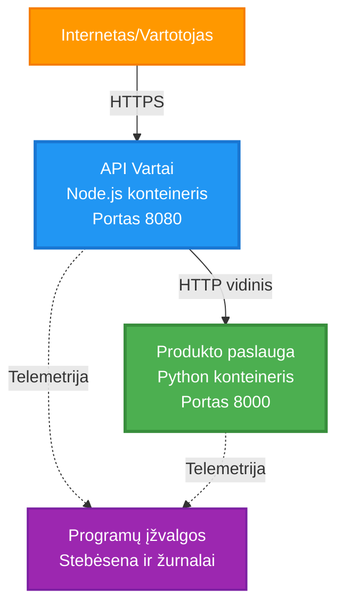
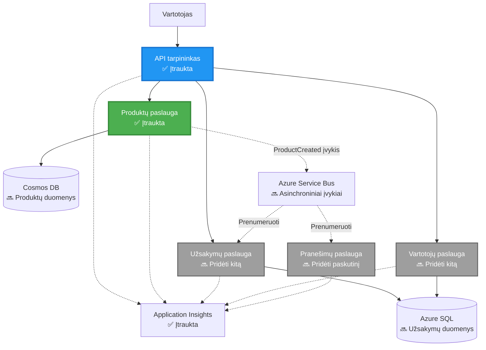
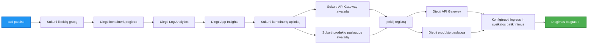
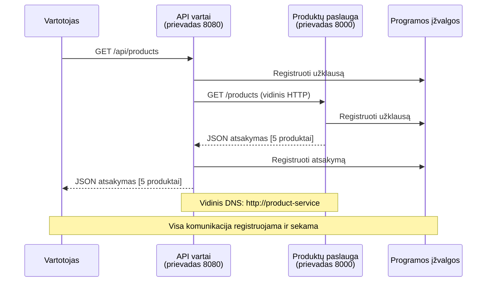

# Mikroservisų architektūra - Container App pavyzdys

⏱️ **Įvertinamas laikas**: 25-35 minutes | 💰 **Įvertinama kaina**: ~$50-100/month | ⭐ **Sunkumo lygis**: Pažengęs

**📚 Mokymosi kelias:**
- ← Ankstesnis: [Paprastas Flask API](../../../../examples/container-app/simple-flask-api) - Vieno konteinerio pagrindai
- 🎯 **Jūs esate čia**: Mikroservisų architektūra (2 paslaugų pagrindas)
- → Toliau: [Dirbtinio intelekto integracija](../../../../docs/ai-foundry) - Įtraukite intelektą į savo paslaugas
- 🏠 [Kurso pradžia](../../README.md)

---

A **supaprastinta, bet funkcionali** mikroservisų architektūra, išdiegta į Azure Container Apps naudojant AZD CLI. Šis pavyzdys demonstruoja paslaugų tarpusavio komunikaciją, konteinerių orkestravimą ir stebėjimą praktišku 2 paslaugų rinkiniu.

> **📚 Mokymosi metodas**: Šis pavyzdys prasideda nuo minimalaus 2 paslaugų architektūros (API vartai + Back-end paslauga), kurią galite iš tikrųjų išdiegti ir iš jos mokytis. Išmokę šiuos pagrindus, pateikiame gaires, kaip išplėsti į pilną mikroservisų ekosistemą.

## Ką išmoksite

Baigę šį pavyzdį jūs:
- Išdiegsite kelis konteinerius į Azure Container Apps
- Įgyvendinsite paslaugų tarpusavio komunikaciją naudodami vidinį tinklą
- Sukonfigūruosite mastelio keitimą pagal aplinką ir sveikatos patikrinimus
- Stebėsite paskirstytas programas su Application Insights
- Suprasite mikroservisų diegimo modelius ir gerąsias praktikas
- Išmoksite laipsniško išplėtimo nuo paprastos iki sudėtingesnės architektūros

## Architektūra

### Fazė 1: Ką kuriame (įtraukta šiame pavyzdyje)


```mermaid
graph TB
    Internet[Internetas/Vartotojas]
    Gateway[API Vartai<br/>Node.js konteineris<br/>Portas 8080]
    Product[Produkto paslauga<br/>Python konteineris<br/>Portas 8000]
    AppInsights[Programų įžvalgos<br/>Stebėsena ir žurnalai]
    
    Internet -->|HTTPS| Gateway
    Gateway -->|HTTP vidinis| Product
    Gateway -.->|Telemetrija| AppInsights
    Product -.->|Telemetrija| AppInsights
    
    style Gateway fill:#2196F3,stroke:#1976D2,stroke-width:3px,color:#fff
    style Product fill:#4CAF50,stroke:#388E3C,stroke-width:3px,color:#fff
    style Internet fill:#FF9800,stroke:#F57C00,stroke-width:2px,color:#fff
    style AppInsights fill:#9C27B0,stroke:#7B1FA2,stroke-width:2px,color:#fff
```
**Komponentų detalės:**

| Komponentas | Paskirtis | Prieiga | Ištekliai |
|-----------|---------|--------|-----------|
| **API Gateway** | Nukreipia išorinius užklausimus į backend paslaugas | Vieša (HTTPS) | 1 vCPU, 2GB RAM, 2-20 replikių |
| **Product Service** | Valdo produktų katalogą su atmintyje saugomais duomenimis | Tik vidinė | 0.5 vCPU, 1GB RAM, 1-10 replikių |
| **Application Insights** | Centralizuota žurnalinė registracija ir paskirstytas sekimas | Azure Portal | 1-2 GB/mėn duomenų surinkimas |

**Kodėl pradėti paprastai?**
- ✅ Greitai išdiegti ir suprasti (25-35 minutes)
- ✅ Išmokti pagrindinius mikroservisų modelius be sudėtingumo
- ✅ Veikiantis kodas, kurį galite modifikuoti ir eksperimentuoti
- ✅ Mažesnės mokymosi sąnaudos (~$50-100/month vs $300-1400/month)
- ✅ Įgykite pasitikėjimo prieš pridedant duomenų bazes ir pranešimų eiles

**Analogiškai**: Pagalvokite apie tai kaip apie automobilio vairavimo mokymąsi. Pradedate nuo tuščio stovėjimo aikštelės (2 paslaugos), įvaldote pagrindus, tada pereinate prie miesto eismo (5+ paslaugos su duomenų bazėmis).

### Fazė 2: Ateities plėtra (referencinė architektūra)


```mermaid
graph TB
    User[Vartotojas]
    Gateway[API tarpininkas<br/>✅ Įtraukta]
    Product[Produktų paslauga<br/>✅ Įtraukta]
    Order[Užsakymų paslauga<br/>🔜 Pridėti kitą]
    UserSvc[Vartotojų paslauga<br/>🔜 Pridėti kitą]
    Notify[Pranešimų paslauga<br/>🔜 Pridėti paskutinį]
    
    CosmosDB[(Cosmos DB<br/>🔜 Produktų duomenys)]
    AzureSQL[(Azure SQL<br/>🔜 Užsakymų duomenys)]
    ServiceBus[Azure Service Bus<br/>🔜 Asinchroniniai įvykiai]
    AppInsights[Application Insights<br/>✅ Įtraukta]
    
    User --> Gateway
    Gateway --> Product
    Gateway --> Order
    Gateway --> UserSvc
    
    Product --> CosmosDB
    Order --> AzureSQL
    UserSvc --> AzureSQL
    
    Product -.->|ProductCreated įvykis| ServiceBus
    ServiceBus -.->|Prenumeruoti| Notify
    ServiceBus -.->|Prenumeruoti| Order
    
    Gateway -.-> AppInsights
    Product -.-> AppInsights
    Order -.-> AppInsights
    UserSvc -.-> AppInsights
    Notify -.-> AppInsights
    
    style Product fill:#4CAF50,stroke:#388E3C,stroke-width:3px,color:#fff
    style Gateway fill:#2196F3,stroke:#1976D2,stroke-width:3px,color:#fff
    style Order fill:#9E9E9E,stroke:#616161,stroke-width:2px,color:#fff
    style UserSvc fill:#9E9E9E,stroke:#616161,stroke-width:2px,color:#fff
    style Notify fill:#9E9E9E,stroke:#616161,stroke-width:2px,color:#fff
```
Žr. skiltį „Išplėtimo vadovas“ dokumento pabaigoje dėl žingsnis po žingsnio instrukcijų.

## Įtrauktos funkcijos

✅ **Paslaugų aptikimas**: Automatinis DNS pagrindu veikiančio aptikimo mechanizmas tarp konteinerių  
✅ **Krovos balansavimas**: Integruotas krovos balansavimas tarp replikų  
✅ **Automatinis skalavimas**: Nepriklausomas mastelio keitimas kiekvienai paslaugai pagal HTTP užklausas  
✅ **Sveikatos stebėjimas**: Liveness ir readiness patikrinimai abiem paslaugoms  
✅ **Paskirstyta žurnalinė registracija**: Centralizuotas žurnalų rinkimas su Application Insights  
✅ **Vidinis tinklas**: Saugus paslaugų tarpusavio bendravimas  
✅ **Konteinerių orkestracija**: Automatinis diegimas ir skalavimas  
✅ **Atnaujinimai be nutrūkimų**: Rolling atnaujinimai su versijų valdymu  

## Išankstiniai reikalavimai

### Reikalingi įrankiai

Prieš pradėdami, įsitikinkite, kad turite įdiegtus šiuos įrankius:

1. **[Azure Developer CLI (azd)](https://learn.microsoft.com/azure/developer/azure-developer-cli/install-azd)** (versija 1.0.0 arba naujesnė)
   ```bash
   azd version
   # Numatoma išvestis: azd versija 1.0.0 arba naujesnė
   ```

2. **[Azure CLI](https://learn.microsoft.com/cli/azure/install-azure-cli)** (versija 2.50.0 arba naujesnė)
   ```bash
   az --version
   # Laukiama išvestis: azure-cli 2.50.0 arba naujesnė
   ```

3. **[Docker](https://www.docker.com/get-started)** (lokaliam vystymui/testavimui - neprivaloma)
   ```bash
   docker --version
   # Tikėtinas išvestis: Docker versija 20.10 arba naujesnė
   ```

### Patikrinkite savo nustatymus

Paleiskite šias komandas, kad patvirtintumėte, jog esate pasiruošę:

```bash
# Patikrinkite Azure Developer CLI
azd version
# ✅ Tikimasi: azd versija 1.0.0 arba naujesnė

# Patikrinkite Azure CLI
az --version
# ✅ Tikimasi: azure-cli 2.50.0 arba naujesnė

# Patikrinkite Docker (neprivaloma)
docker --version
# ✅ Tikimasi: Docker versija 20.10 arba naujesnė
```

**Sėkmės kriterijai**: Visos komandos grąžina versijų numerius, atitinkančius arba viršijančius minimalius reikalavimus.

### Azure reikalavimai

- Aktyvi **Azure prenumerata** ([create a free account](https://azure.microsoft.com/free/))
- Leidimai kurti išteklius jūsų prenumeratoje
- **Contributor** rolė prenumeratoje arba išteklių grupėje

### Reikalingos žinios

Tai **pažengęs** pavyzdys. Jums reikėtų turėti:
- Baigtą [Paprastas Flask API pavyzdį](../../../../examples/container-app/simple-flask-api) 
- Pagrindines žinias apie mikroservisų architektūrą
- Susipažinimą su REST API ir HTTP
- Supratimą apie konteinerių koncepcijas

**Naujas prie Container Apps?** Pradėkite nuo [Paprasto Flask API pavyzdžio](../../../../examples/container-app/simple-flask-api), kad sužinotumėte pagrindus.

## Greitas pradėjimas (žingsnis po žingsnio)

### Žingsnis 1: Klonuoti ir pereiti

```bash
git clone https://github.com/microsoft/AZD-for-beginners.git
cd AZD-for-beginners/examples/microservices
```

**✓ Sėkmės patikrinimas**: Įsitikinkite, kad matote `azure.yaml`:
```bash
ls
# Laukiama: README.md, azure.yaml, infra/, src/
```

### Žingsnis 2: Autentifikuokitės prie Azure

```bash
azd auth login
```

Tai atvers jūsų naršyklę Azure autentifikacijai. Prisijunkite naudodami savo Azure paskyros duomenis.

**✓ Sėkmės patikrinimas**: Turėtumėte matyti:
```
Logged in to Azure.
```

### Žingsnis 3: Inicializuokite aplinką

```bash
azd init
```

**Matysite šiuos raginimus**:
- **Aplinkos pavadinimas**: Įveskite trumpą pavadinimą (pvz., `microservices-dev`)
- **Azure prenumerata**: Pasirinkite savo prenumeratą
- **Azure vieta**: Pasirinkite regioną (pvz., `eastus`, `westeurope`)

**✓ Sėkmės patikrinimas**: Turėtumėte matyti:
```
SUCCESS: New project initialized!
```

### Žingsnis 4: Diegti infrastruktūrą ir paslaugas

```bash
azd up
```

**Kas vyksta** (trunka 8-12 minučių):


```mermaid
graph LR
    A[azd paleisti] --> B[Sukurti išteklių grupę]
    B --> C[Diegti konteinerių registrą]
    C --> D[Diegti Log Analytics]
    D --> E[Diegti App Insights]
    E --> F[Sukurti konteinerių aplinką]
    F --> G[Sukurti API Gateway atvaizdą]
    F --> H[Sukurti produkto paslaugos atvaizdą]
    G --> I[Įkelti į registrą]
    H --> I
    I --> J[Diegti API Gateway]
    I --> K[Diegti produkto paslaugą]
    J --> L[Konfigūruoti Ingress ir sveikatos patikrinimus]
    K --> L
    L --> M[Diegimas baigtas ✓]
    
    style A fill:#2196F3,stroke:#1976D2,stroke-width:3px,color:#fff
    style M fill:#4CAF50,stroke:#388E3C,stroke-width:3px,color:#fff
```
**✓ Sėkmės patikrinimas**: Turėtumėte matyti:
```
SUCCESS: Your application was deployed to Azure in X minutes Y seconds.
Endpoint: https://api-gateway-<unique-id>.azurecontainerapps.io
```

**⏱️ Laikas**: 8-12 minutes

### Žingsnis 5: Išbandykite diegimą

```bash
# Gauti gateway galinį tašką
GATEWAY_URL=$(azd env get-values | grep API_GATEWAY_URL | cut -d '=' -f2 | tr -d '"')

# Patikrinti API Gateway būklę
curl $GATEWAY_URL/health
```

**✅ Tikėtinas išvestis:**
```json
{
  "status": "healthy",
  "service": "api-gateway",
  "timestamp": "2025-11-19T10:30:00Z"
}
```

**Išbandykite produktų paslaugą per API tarpininką**:
```bash
# Išvardinti produktus
curl $GATEWAY_URL/api/products
```

**✅ Tikėtinas išvestis:**
```json
[
  {"id":1,"name":"Laptop","price":999.99,"stock":50},
  {"id":2,"name":"Mouse","price":29.99,"stock":200},
  {"id":3,"name":"Keyboard","price":79.99,"stock":150}
]
```

**✓ Sėkmės patikrinimas**: Abu galiniai taškai grąžina JSON duomenis be klaidų.

---

**🎉 Sveikiname!** Jūs įdiegėte mikroservisų architektūrą Azure!

## Projekto struktūra

Visi įgyvendinimo failai įtraukti—tai pilnas, veikiantis pavyzdys:

```
microservices/
│
├── README.md                         # This file
├── azure.yaml                        # AZD configuration
├── .gitignore                        # Git ignore patterns
│
├── infra/                           # Infrastructure as Code (Bicep)
│   ├── main.bicep                   # Main orchestration
│   ├── abbreviations.json           # Naming conventions
│   ├── core/                        # Shared infrastructure
│   │   ├── container-apps-environment.bicep  # Container environment + registry
│   │   └── monitor.bicep            # Application Insights + Log Analytics
│   └── app/                         # Service definitions
│       ├── api-gateway.bicep        # API Gateway container app
│       └── product-service.bicep    # Product Service container app
│
└── src/                             # Application source code
    ├── api-gateway/                 # Node.js API Gateway
    │   ├── app.js                   # Express server with routing
    │   ├── package.json             # Node dependencies
    │   └── Dockerfile               # Container definition
    └── product-service/             # Python Product Service
        ├── main.py                  # Flask API with product data
        ├── requirements.txt         # Python dependencies
        └── Dockerfile               # Container definition
```

**Ką daro kiekvienas komponentas:**

**Infrastruktūra (infra/)**:
- `main.bicep`: Orkestruoja visus Azure išteklius ir jų priklausomybes
- `core/container-apps-environment.bicep`: Sukuria Container Apps aplinką ir Azure Container Registry
- `core/monitor.bicep`: Nustato Application Insights paskirstytai žurnalizacijai
- `app/*.bicep`: Atskirų konteinerio programų apibrėžtys su skalavimu ir sveikatos patikrinimais

**API Gateway (src/api-gateway/)**:
- Viešai prieinama paslauga, kuri nukreipia užklausas į backend paslaugas
- Įgyvendina žurnalinimą, klaidų tvarkymą ir užklausų persiuntimą
- Demonstruoja paslaugų tarpusavio HTTP komunikaciją

**Product Service (src/product-service/)**:
- Vidinė paslauga su produktų katalogu (pagal paprastumą saugoma atmintyje)
- REST API su sveikatos patikrinimais
- Back-end mikroserviso šablono pavyzdys

## Paslaugų apžvalga

### API Gateway (Node.js/Express)

**Prievadas**: 8080  
**Prieiga**: Vieša (išorinis įėjimas)  
**Paskirtis**: Nukreipia įeinančias užklausas į tinkamas backend paslaugas  

**Galiniai taškai**:
- `GET /` - Paslaugos informacija
- `GET /health` - Sveikatos patikros galinis taškas
- `GET /api/products` - Persiunčia į produktų paslaugą (sąrašas)
- `GET /api/products/:id` - Persiunčia į produktų paslaugą (gauti pagal ID)

**Pagrindinės savybės**:
- Užklausų maršrutizavimas su axios
- Centralizuotas žurnalinimas
- Klaidos tvarkymas ir timeout valdymas
- Paslaugų aptikimas per aplinkos kintamuosius
- Application Insights integracija

**Kodo ištrauka** (`src/api-gateway/app.js`):
```javascript
// Vidinė paslaugų komunikacija
app.get('/api/products', async (req, res) => {
  const response = await axios.get(`${PRODUCT_SERVICE_URL}/products`, {
    timeout: 5000
  });
  res.json(response.data);
});
```

### Product Service (Python/Flask)

**Prievadas**: 8000  
**Prieiga**: Tik vidinė (be išorinio įėjimo)  
**Paskirtis**: Valdo produktų katalogą su atmintyje saugomais duomenimis  

**Galiniai taškai**:
- `GET /` - Paslaugos informacija
- `GET /health` - Sveikatos patikros galinis taškas
- `GET /products` - Išvardina visus produktus
- `GET /products/<id>` - Gauti produktą pagal ID

**Pagrindinės savybės**:
- RESTful API su Flask
- Produktų saugykla atmintyje (paprasta, nereikalinga duomenų bazė)
- Sveikatos stebėjimas su patikrinimais
- Struktūruotas žurnalinimas
- Application Insights integracija

**Duomenų modelis**:
```python
{
  "id": 1,
  "name": "Laptop",
  "description": "High-performance laptop",
  "price": 999.99,
  "stock": 50
}
```

**Kodėl tik vidinė?**
Produktų paslauga nėra viešai atverta. Visos užklausos turi keliauti per API tarpininką, kuris suteikia:
- Saugumą: Kontroliuojamas prieigos taškas
- Lankstumą: Galima pakeisti backend be įtakos klientams
- Stebėjimą: Centralizuotas užklausų žurnalinimas

## Kaip paslaugos bendrauja tarpusavyje

### Kaip paslaugos bendrauja tarpusavyje


```mermaid
sequenceDiagram
    participant User as Vartotojas
    participant Gateway as API vartai<br/>(prievadas 8080)
    participant Product as Produktų paslauga<br/>(prievadas 8000)
    participant AI as Programos įžvalgos
    
    User->>Gateway: GET /api/products
    Gateway->>AI: Registruoti užklausą
    Gateway->>Product: GET /products (vidinis HTTP)
    Product->>AI: Registruoti užklausą
    Product-->>Gateway: JSON atsakymas [5 produktai]
    Gateway->>AI: Registruoti atsakymą
    Gateway-->>User: JSON atsakymas [5 produktai]
    
    Note over Gateway,Product: Vidinis DNS: http://product-service
    Note over User,AI: Visa komunikacija registruojama ir sekama
```
Šiame pavyzdyje API Gateway bendrauja su Product Service naudodamas **vidinius HTTP skambučius**:

```javascript
// API vartai (src/api-gateway/app.js)
const PRODUCT_SERVICE_URL = process.env.PRODUCT_SERVICE_URL;

// Atlikti vidinę HTTP užklausą
const response = await axios.get(`${PRODUCT_SERVICE_URL}/products`);
```

**Pagrindiniai punktai**:

1. **Atradimas pagal DNS**: Container Apps automatiškai suteikia DNS vidinėms paslaugoms
   - Product Service FQDN: `product-service.internal.<environment>.azurecontainerapps.io`
   - Supaprastinta kaip: `http://product-service` (Container Apps išsprendžia tai)

2. **Nėra viešo atvėrimo**: Product Service turi `external: false` Bicep faile
   - Prieinama tik Container Apps aplinkoje
   - Negalima pasiekti per internetą

3. **Aplinkos kintamieji**: Paslaugų URL injekuojami diegimo metu
   - Bicep perduoda vidinį FQDN į gateway
   - Nėra įkoduotų URL programos kode

**Analogiškai**: Pagalvokite apie tai kaip apie biuro kambarius. API Gateway yra registratūra (viešas), o Product Service yra biuro kambarys (tik vidinis). Lankytojai turi pereiti per registratūrą, kad patektų į bet kurį biuro kambarį.

## Diegimo parinktys

### Pilnas diegimas (rekomenduojama)

```bash
# Įdiegti infrastruktūrą ir abi paslaugas
azd up
```

Tai įdiegia:
1. Container Apps aplinką
2. Application Insights
3. Container Registry
4. API Gateway konteinerį
5. Product Service konteinerį

**Laikas**: 8-12 minučių

### Diegti atskirą paslaugą

```bash
# Diegti tik vieną paslaugą (po pradinio azd up)
azd deploy api-gateway

# Arba diegti 'product' paslaugą
azd deploy product-service
```

**Naudojimo atvejis**: Kai atnaujinote kodo vienoje paslaugoje ir norite išdiegti tik tą paslaugą.

### Atnaujinti konfigūraciją

```bash
# Pakeisti mastelio keitimo parametrus
azd env set GATEWAY_MAX_REPLICAS 30

# Perdiegti su nauja konfigūracija
azd up
```

## Konfigūracija

### Skalavimo konfigūracija

Abi paslaugos yra sukonfigūruotos su HTTP pagrindu veikiančiu automatinio skalavimo mechanizmu jų Bicep failuose:

**API Gateway**:
- Min. replikių skaičius: 2 (visada bent 2 dėl prieinamumo)
- Maks. replikių skaičius: 20
- Skalavimo trigeris: 50 lygiagrečių užklausų per kopiją

**Product Service**:
- Min. replikių skaičius: 1 (gali skalauti iki nulio, jei reikia)
- Maks. replikių skaičius: 10
- Skalavimo trigeris: 100 lygiagrečių užklausų per kopiją

**Priderinkite skalavimą** (faile `infra/app/*.bicep`):
```bicep
scale: {
  minReplicas: 1
  maxReplicas: 10
  rules: [
    {
      name: 'http-scale-rule'
      http: {
        metadata: {
          concurrentRequests: '100'  // Adjust this
        }
      }
    }
  ]
}
```

### Išteklių paskirstymas

**API Gateway**:
- CPU: 1.0 vCPU
- Memory: 2 GiB
- Priežastis: Tvarko visą išorinį srautą

**Product Service**:
- CPU: 0.5 vCPU
- Memory: 1 GiB
- Priežastis: Lengvos atmintyje vykdomos operacijos

### Sveikatos patikrinimai

Abu paslaugos apima gyvybingumo (liveness) ir parengties (readiness) patikrinimus:

```bicep
probes: [
  {
    type: 'Liveness'
    httpGet: {
      path: '/health'
      port: 8080
    }
    initialDelaySeconds: 10
    periodSeconds: 30
  }
  {
    type: 'Readiness'
    httpGet: {
      path: '/health'
      port: 8080
    }
    initialDelaySeconds: 5
    periodSeconds: 10
  }
]
```

**Ką tai reiškia**:
- **Gyvybingumas**: Jei sveikatos patikra nepraeina, Container Apps perkraus konteinerį
- **Parengtis**: Jei nėra parengta, Container Apps nustoja nukreipti srautą į tą kopiją

## Stebėjimas ir observabilumas

### Peržiūrėti paslaugų žurnalus

```bash
# Peržiūrėkite žurnalus naudodami azd monitor
azd monitor --logs

# Arba naudokite Azure CLI konkretiems Container Apps:
# Srautiniu būdu peržiūrėkite žurnalus iš API Gateway
az containerapp logs show --name api-gateway --resource-group $RG_NAME --follow

# Peržiūrėkite neseniai produkto paslaugos žurnalus
az containerapp logs show --name product-service --resource-group $RG_NAME --tail 100
```

**Tikėtinas išvestis**:
```
[api-gateway] API Gateway listening on port 8080
[api-gateway] Product Service URL: http://product-service
[api-gateway] GET /api/products 200 - 45ms
[product-service] Retrieved 5 products
```

### Application Insights užklausos

Atidarykite Application Insights Azure portale, tada paleiskite šias užklausas:

**Rasti lėtas užklausas**:
```kusto
requests
| where timestamp > ago(1h)
| where duration > 1000  // Requests taking >1 second
| summarize count() by name, cloud_RoleName
| order by count_ desc
```

**Stebėti paslaugų tarpusavio skambučius**:
```kusto
dependencies
| where timestamp > ago(1h)
| where type == "Http"
| project timestamp, name, target, duration, success
| order by timestamp desc
```

**Klaidų dažnis pagal paslaugą**:
```kusto
exceptions
| where timestamp > ago(24h)
| summarize errorCount = count() by cloud_RoleName, type
| order by errorCount desc
```

**Užklausų kiekis laikui bėgant**:
```kusto
requests
| where timestamp > ago(1h)
| summarize requestCount = count() by bin(timestamp, 5m), cloud_RoleName
| render timechart
```

### Prieiga prie stebėjimo skydelio

```bash
# Gauti Application Insights informaciją
azd env get-values | grep APPLICATIONINSIGHTS

# Atidaryti Azure portalo stebėjimą
az monitor app-insights component show \
  --app $(azd env get-values | grep APPLICATIONINSIGHTS_CONNECTION_STRING | cut -d '=' -f2) \
  --resource-group $(azd env get-values | grep AZURE_RESOURCE_GROUP | cut -d '=' -f2) \
  --query "appId" -o tsv
```

### Tiesioginės metrikos

1. Eikite į Application Insights Azure portale
2. Spustelėkite "Live Metrics"
3. Matykite realaus laiko užklausas, klaidas ir našumą
4. Išbandykite paleisdami: `curl $(azd env get-values | grep API_GATEWAY_URL | cut -d '=' -f2 | tr -d '"')/api/products`

## Praktinės užduotys

### Uždavinys 1: Pridėti naują produkto galinį tašką ⭐ (Lengva)

**Tikslas**: Pridėti POST galinį tašką kuriant naujus produktus

**Pradinis taškas**: `src/product-service/main.py`

**Veiksmai**:

1. Pridėkite šį endpoint'ą po `get_product` funkcijos faile `main.py`:

```python
@app.route('/products', methods=['POST'])
def create_product():
    """Create a new product"""
    data = request.get_json()
    
    # Patikrinti privalomus laukus
    if not data or 'name' not in data or 'price' not in data:
        return jsonify({'error': 'Missing required fields: name, price'}), 400
    
    new_id = max(p['id'] for p in products) + 1
    new_product = {
        'id': new_id,
        'name': data['name'],
        'description': data.get('description', ''),
        'price': float(data['price']),
        'stock': int(data.get('stock', 0))
    }
    products.append(new_product)
    logger.info(f"Created product {new_id}")
    return jsonify(new_product), 201
```

2. Pridėkite POST maršrutą į API tarpininką (`src/api-gateway/app.js`):

```javascript
// Pridėkite tai po GET /api/products maršruto
app.post('/api/products', async (req, res) => {
  try {
    console.log(`Forwarding POST request to ${PRODUCT_SERVICE_URL}/products`);
    const response = await axios.post(`${PRODUCT_SERVICE_URL}/products`, req.body, {
      timeout: 5000
    });
    res.status(201).json(response.data);
  } catch (error) {
    console.error('Error calling product service:', error.message);
    res.status(503).json({
      error: 'Product service unavailable',
      message: error.message
    });
  }
});
```

3. Iš naujo paleiskite abu servisus:

```bash
azd deploy product-service
azd deploy api-gateway
```

4. Išbandykite naują galinį tašką:

```bash
GATEWAY_URL=$(azd env get-values | grep API_GATEWAY_URL | cut -d '=' -f2 | tr -d '"')

# Sukurti naują produktą
curl -X POST $GATEWAY_URL/api/products \
  -H "Content-Type: application/json" \
  -d '{"name":"USB Cable","price":9.99,"stock":500}'
```

**✅ Tikėtinas išvestis:**
```json
{"id":6,"name":"USB Cable","description":"","price":9.99,"stock":500}
```

5. Patikrinkite, ar jis pasirodo sąraše:

```bash
curl $GATEWAY_URL/api/products
# Dabar turėtų rodyti 6 produktus, įskaitant naują USB kabelį
```

**Sėkmės kriterijai**:
- ✅ POST užklausa grąžina HTTP 201
- ✅ Naujas produktas pasirodo GET /api/products sąraše
- ✅ Produktas turi automatiškai didinamą ID

**Laikas**: 10-15 minučių

---

### Užduotis 2: Pakeisti automatinio mastelio keitimo taisykles ⭐⭐ (Vidutinė)

**Tikslas**: Kad Product Service skalėtų agresyviau

**Pradinis taškas**: `infra/app/product-service.bicep`

**Žingsniai**:

1. Atidarykite `infra/app/product-service.bicep` ir suraskite `scale` bloką (apie 95 eilutę)

2. Pakeiskite iš:
```bicep
scale: {
  minReplicas: 1
  maxReplicas: 10
  rules: [
    {
      name: 'http-scale-rule'
      http: {
        metadata: {
          concurrentRequests: '100'  // OLD
        }
      }
    }
  ]
}
```

Į:
```bicep
scale: {
  minReplicas: 2  // Always have 2 running
  maxReplicas: 20  // Allow more scaling
  rules: [
    {
      name: 'http-scale-rule'
      http: {
        metadata: {
          concurrentRequests: '20'  // Scale at lower threshold
        }
      }
    }
  ]
}
```

3. Iš naujo diegkite infrastruktūrą:

```bash
azd up
```

4. Patikrinkite naują skalavimo konfigūraciją:

```bash
az containerapp show \
  --name $(azd env get-values | grep PRODUCT_SERVICE | head -1 | cut -d '/' -f5) \
  --resource-group $(azd env get-values | grep AZURE_RESOURCE_GROUP | cut -d '=' -f2 | tr -d '"') \
  --query "properties.template.scale" -o json
```

**✅ Tikėtinas išvestis:**
```json
{
  "minReplicas": 2,
  "maxReplicas": 20,
  "rules": [...]
}
```

5. Išbandykite automatinį mastelio keitimą su apkrova:

```bash
# Sugeneruoti lygiagrečias užklausas
for i in {1..500}; do curl $GATEWAY_URL/api/products & done

# Stebėkite skalavimo procesą naudodami Azure CLI
az containerapp logs show --name product-service --resource-group $RG_NAME --follow
# Ieškokite: Container Apps skalavimo įvykių
```

**Sėkmės kriterijai**:
- ✅ Product Service visada veikia bent su 2 replikomis
- ✅ Esant apkrovai, skalė padidėja virš 2 replikų
- ✅ Azure Portal rodo naujas skalavimo taisykles

**Laikas**: 15-20 minučių

---

### Užduotis 3: Pridėti pasirinktinę monitoringo užklausą ⭐⭐ (Vidutinė)

**Tikslas**: Sukurti pasirinktinę Application Insights užklausą, kad stebėtumėte produkto API veikimą

**Žingsniai**:

1. Pereikite į Application Insights Azure Portal:
   - Eikite į Azure Portal
   - Suraskite savo resursų grupę (rg-microservices-*)
   - Spustelėkite Application Insights resursą

2. Kairiajame meniu spustelėkite „Logs“

3. Sukurkite šią užklausą:

```kusto
requests
| where timestamp > ago(1h)
| where name contains "products"
| summarize 
    RequestCount = count(),
    AvgDuration = avg(duration),
    P95Duration = percentile(duration, 95),
    SuccessRate = 100.0 * countif(success == true) / count()
  by bin(timestamp, 5m)
| render timechart
```

4. Spustelėkite „Run“, kad vykdytumėte užklausą

5. Išsaugokite užklausą:
   - Spustelėkite „Save“
   - Pavadinimas: "Produktų API našumas"
   - Kategorija: "Veikimas"

6. Generuokite testinį srautą:

```bash
for i in {1..100}; do curl $GATEWAY_URL/api/products; sleep 1; done
```

7. Atnaujinkite užklausą, kad pamatytumėte duomenis

**✅ Tikėtinas išvestis:**
- Diagrama, rodanti užklausų skaičių laiko atžvilgiu
- Vidutinė užklausos trukmė < 500 ms
- Sėkmės rodiklis = 100%
- Laiko intervalai po 5 minutes

**Sėkmės kriterijai**:
- ✅ Užklausa rodo 100+ užklausų
- ✅ Sėkmės rodiklis yra 100%
- ✅ Vidutinė trukmė < 500 ms
- ✅ Diagrama naudoja 5 minučių laiko intervalus

**Mokymosi rezultatas**: Suprasti, kaip stebėti paslaugos našumą naudojant pasirinktines užklausas

**Laikas**: 10-15 minučių

---

### Užduotis 4: Įgyvendinti pakartojimų logiką ⭐⭐⭐ (Išplėstinė)

**Tikslas**: Pridėti pakartojimų logiką API Gateway, kai Product Service laikinai nepasiekiamas

**Pradinis taškas**: `src/api-gateway/app.js`

**Žingsniai**:

1. Įdiekite retry biblioteką:

```bash
cd src/api-gateway
npm install axios-retry --save
cd ../..
```

2. Atnaujinkite `src/api-gateway/app.js` (pridėkite po axios importo):

```javascript
const axiosRetry = require('axios-retry');

// Nustatyti pakartotinių bandymų logiką
axiosRetry(axios, {
  retries: 3,
  retryDelay: (retryCount) => {
    return retryCount * 1000; // 1 s, 2 s, 3 s
  },
  retryCondition: (error) => {
    // Kartoti bandymus tinklo klaidų arba 5xx atsakymų atveju
    return axiosRetry.isNetworkOrIdempotentRequestError(error) ||
           (error.response && error.response.status >= 500);
  }
});

console.log('Retry logic configured: 3 retries with exponential backoff');
```

3. Iš naujo diegkite API Gateway:

```bash
azd deploy api-gateway
```

4. Išbandykite pakartojimų elgesį imituodami paslaugos gedimą:

```bash
# Sumažinti produktų paslaugą iki 0 (simuliuoti gedimą)
az containerapp update \
  --name $(azd env get-values | grep PRODUCT_SERVICE | head -1 | cut -d '/' -f5) \
  --resource-group $(azd env get-values | grep AZURE_RESOURCE_GROUP | cut -d '=' -f2 | tr -d '"') \
  --min-replicas 0 \
  --max-replicas 0

# Bandykite pasiekti produktus (bus bandyta iš naujo 3 kartus)
time curl -v $GATEWAY_URL/api/products
# Pastebėkite: atsakymas trunka ~6 sekundes (1s + 2s + 3s pakartotiniai bandymai)

# Atstatyti produktų paslaugą
az containerapp update \
  --name $(azd env get-values | grep PRODUCT_SERVICE | head -1 | cut -d '/' -f5) \
  --resource-group $(azd env get-values | grep AZURE_RESOURCE_GROUP | cut -d '=' -f2 | tr -d '"') \
  --min-replicas 1 \
  --max-replicas 10
```

5. Peržiūrėkite pakartojimų žurnalus:

```bash
az containerapp logs show --name api-gateway --resource-group $RG_NAME --tail 50
# Ieškoti: pranešimų apie bandymų pakartojimus
```

**✅ Tikėtinas elgesys:**
- Užklausos pakartojamos 3 kartus prieš žlugimą
- Kiekvienas pakartojimas laukia ilgiau (1s, 2s, 3s)
- Sėkmingos užklausos po paslaugos paleidimo iš naujo
- Žurnalai rodo pakartojimų bandymus

**Sėkmės kriterijai**:
- ✅ Užklausos pakartojamos 3 kartus prieš žlugimą
- ✅ Kiekvienas pakartojimas laukia ilgiau (eksponentinis vėlavimas)
- ✅ Sėkmingos užklausos po paslaugos perkrovimo
- ✅ Žurnalai rodo pakartojimų bandymus

**Mokymosi rezultatas**: Suprasti atsparumo modelius mikroservisuose (circuit breakers, retries, timeouts)

**Laikas**: 20-25 minučių

---

## Žinių patikrinimas

Baigus šį pavyzdį, patikrinkite savo supratimą:

### 1. Paslaugų komunikacija ✓

Išbandykite savo žinias:
- [ ] Ar galite paaiškinti, kaip API Gateway atranda Product Service? (paslaugų atranka per DNS)
- [ ] Kas nutinka, jei Product Service neveikia? (Gateway grąžina 503 klaidą)
- [ ] Kaip pridėtumėte trečią paslaugą? (Sukurti naują Bicep failą, pridėti į main.bicep, sukurti src aplanką)

**Praktinis patikrinimas:**
```bash
# Simuliuoti paslaugos gedimą
az containerapp update --name <product-service-name> --min-replicas 0 --max-replicas 0
curl $GATEWAY_URL/api/products
# ✅ Tikėtinas: 503 Paslauga neprieinama

# Atkurti paslaugą
az containerapp update --name <product-service-name> --min-replicas 1 --max-replicas 10
```

### 2. Monitoravimas ir stebimumas ✓

Išbandykite savo žinias:
- [ ] Kur matote paskirstytus žurnalus? (Application Insights Azure Portal)
- [ ] Kaip sekti lėtas užklausas? (Kusto užklausa: `requests | where duration > 1000`)
- [ ] Ar galite nustatyti, kuri paslauga sukėlė klaidą? (Patikrinkite `cloud_RoleName` lauką žurnaluose)

**Praktinis patikrinimas:**
```bash
# Sukurti lėtos užklausos simuliaciją
curl "$GATEWAY_URL/api/products?delay=2000"

# Užklausti Application Insights dėl lėtų užklausų
# Eikite į Azure portalą → Application Insights → Logs
# Paleiskite: requests | where duration > 1000 | project timestamp, name, duration, cloud_RoleName
```

### 3. Skalavimas ir našumas ✓

Išbandykite savo žinias:
- [ ] Kas sukelia autoskalavimą? (HTTP vienalaikių užklausų taisyklės: 50 gateway'ui, 100 product'ui)
- [ ] Kiek replikų dabar veikia? (Patikrinkite su `az containerapp revision list`)
- [ ] Kaip padarytumėte, kad Product Service skalėtų į 5 replikas? (Atnaujinkite minReplicas Bicep faile)

**Praktinis patikrinimas:**
```bash
# Sukurti apkrovą automatinio mastelio keitimo testavimui
for i in {1..1000}; do curl $GATEWAY_URL/api/products & done

# Stebėkite replikų skaičiaus didėjimą naudodami Azure CLI
az containerapp logs show --name api-gateway --resource-group $RG_NAME --follow
# ✅ Tikimasi: matyti mastelio keitimo įvykius žurnaluose
```

**Sėkmės kriterijai**: Galite atsakyti į visus klausimus ir patikrinti tai praktiškai vykdydami komandas.

---

## Kaštų analizė

### Apskaičiuoti mėnesiniai kaštai (už šį 2 paslaugų pavyzdį)

| Išteklius | Konfigūracija | Apskaičiuota kaina |
|----------|--------------|----------------|
| API Gateway | 2-20 replikų, 1 vCPU, 2GB RAM | $30-150 |
| Product Service | 1-10 replikų, 0.5 vCPU, 1GB RAM | $15-75 |
| Container Registry | Basic lygis | $5 |
| Application Insights | 1-2 GB/mėn. | $5-10 |
| Log Analytics | 1 GB/mėn. | $3 |
| **Iš viso** | | **$58-243/mėn.** |

### Kaštų paskirstymas pagal naudojimą

**Mažas srautas** (testavimas/mokymasis): ~$60/mėn.
- API Gateway: 2 replikos × 24/7 = $30
- Product Service: 1 replika × 24/7 = $15
- Stebėjimas + Registras = $13

**Vidutinis srautas** (maža produkcija): ~$120/mėn.
- API Gateway: vidutiniškai 5 replikos = $75
- Product Service: vidutiniškai 3 replikos = $45
- Stebėjimas + Registras = $13

**Didelis srautas** (apkrovos periodais): ~$240/mėn.
- API Gateway: vid. 15 replikų = $225
- Product Service: vid. 8 replikų = $120
- Stebėjimas + Registras = $13

### Patarimai, kaip optimizuoti kaštus

1. **Mastelis iki nulio plėtrai**:
   ```bicep
   scale: {
     minReplicas: 0  // Save $30-40/month when not in use
     maxReplicas: 10
   }
   ```

2. **Naudokite Consumption planą Cosmos DB** (kai jį pridėsite):
   - Mokėkite tik už tai, ką naudojate
   - Nėra minimalaus mokesčio

3. **Nustatykite Application Insights imties ėmimą**:
   ```javascript
   appInsights.defaultClient.config.samplingPercentage = 50; // Atrinkti 50% užklausų
   ```

4. **Išvalykite, kai nereikalinga**:
   ```bash
   azd down --force --purge
   ```

### Nemokamo lygio parinktys

Mokymuisi/testavimui apsvarstykite:
- ✅ Naudokite Azure nemokamus kreditus ($200 pirmiems 30 dienų naujoms paskyroms)
- ✅ Laikykitės minimalių replikų (taupo ~50% kaštų)
- ✅ Ištrinkite po testavimo (nereikia nuolatinių mokesčių)
- ✅ Sumažinkite iki nulio tarp mokymosi sesijų

**Pavyzdys**: Jei paleidžiate šį pavyzdį 2 val./dieną × 30 dienų = ~ $5/mėn. vietoje $60/mėn.

---

## Greitos problemų sprendimo gairės

### Problema: `azd up` nepavyksta su klaida "Subscription not found"

**Sprendimas**:
```bash
# Prisijunkite iš naujo nurodydami prenumeratą
az account set --subscription <your-subscription-id>
azd env set AZURE_SUBSCRIPTION_ID <your-subscription-id>
azd up
```

### Problema: API Gateway grąžina 503 "Product service unavailable"

**Diagnozė**:
```bash
# Patikrinkite produkto paslaugos žurnalus naudodami Azure CLI
az containerapp logs show --name product-service --resource-group $RG_NAME --tail 50

# Patikrinkite produkto paslaugos būklę
az containerapp show \
  --name $(azd env get-values | grep PRODUCT_SERVICE | head -1 | cut -d '/' -f5) \
  --resource-group $(azd env get-values | grep AZURE_RESOURCE_GROUP | cut -d '=' -f2 | tr -d '"') \
  --query "properties.runningStatus"
```

**Dažnos priežastys**:
1. Product service nepakilo (patikrinkite žurnalus dėl Python klaidų)
2. Sveikatos patikra nepraeina (patikrinkite, ar `/health` endpoint'as veikia)
3. Konteinerio įvaizdžio kūrimas nepavyko (patikrinkite registrą dėl įvaizdžio)

### Problema: Automatinis mastelio keitimas neveikia

**Diagnozė**:
```bash
# Patikrinkite dabartinį kopijų skaičių
az containerapp revision list \
  --name $(azd env get-values | grep API_GATEWAY | head -1 | cut -d '/' -f5) \
  --resource-group $(azd env get-values | grep AZURE_RESOURCE_GROUP | cut -d '=' -f2 | tr -d '"') \
  --query "[].properties.replicas"

# Sukurkite apkrovą testavimui
for i in {1..1000}; do curl $GATEWAY_URL/api/products & done

# Stebėkite mastelio keitimo įvykius naudodami Azure CLI
az containerapp logs show --name api-gateway --resource-group $RG_NAME --follow | grep -i scale
```

**Dažnos priežastys**:
1. Neužtenka apkrovos skalavimo taisyklei suaktyvinti (reikia >50 vienalaikių užklausų)
2. Pasiektas maksimalus replikų skaičius (patikrinkite Bicep konfigūraciją)
3. Skalavimo taisyklė neteisingai sukonfigūruota Bicep (patikrinkite concurrentRequests reikšmę)

### Problema: Application Insights nerodo žurnalų

**Diagnozė**:
```bash
# Patikrinkite, ar nustatyta prisijungimo eilutė
azd env get-values | grep APPLICATIONINSIGHTS

# Patikrinkite, ar paslaugos siunčia telemetriją
az monitor app-insights component show \
  --app $(azd env get-values | grep APPLICATIONINSIGHTS_NAME | cut -d '=' -f2 | tr -d '"') \
  --resource-group $(azd env get-values | grep AZURE_RESOURCE_GROUP | cut -d '=' -f2 | tr -d '"') \
  --query "properties.InstrumentationKey"
```

**Dažnos priežastys**:
1. Ryšio eilutė nepradėta perduoti konteineriui (patikrinkite aplinkos kintamuosius)
2. Application Insights SDK nesukonfigūruotas (patikrinkite importus kode)
3. Ugniasienė blokuoja telemetriją (retai, patikrinkite tinklo taisykles)

### Problema: Docker build nepavyksta lokaliai

**Diagnozė**:
```bash
# Testuoti API vartų kūrimą
cd src/api-gateway
docker build -t test-gateway .

# Testuoti Produktų paslaugos kūrimą
cd ../product-service
docker build -t test-product .
```

**Dažnos priežastys**:
1. Trūksta priklausomybių package.json/requirements.txt
2. Dockerfile sintaksės klaidos
3. Tinklo problemos atsisiunčiant priklausomybes

**Vis dar užstrigote?** Žr. [Dažnų problemų vadovas](../../docs/chapter-07-troubleshooting/common-issues.md) arba [Azure Container Apps trikčių šalinimas](https://learn.microsoft.com/azure/container-apps/troubleshooting)

---

## Išvalymas

Norėdami išvengti nuolatinių mokesčių, ištrinkite visus išteklius:

```bash
azd down --force --purge
```

**Patvirtinimo užklausa**:
```
? Total resources to delete: 6, are you sure you want to continue? (y/N)
```

Įveskite `y`, kad patvirtintumėte.

**Kas bus ištrinta**:
- Container Apps aplinka
- Abu Container Apps (gateway ir product service)
- Konteinerių registras
- Application Insights
- Log Analytics darbinė sritis
- Resursų grupė

**✓ Patvirtinkite išvalymą**:
```bash
az group list --query "[?starts_with(name,'rg-microservices')]" --output table
```

Turėtų grąžinti tuščią.

---

## Plėtros vadovas: Nuo 2 iki 5+ paslaugų

Kai įvaldysite šią 2 paslaugų architektūrą, štai kaip ją plėsti:

### Fazė 1: Pridėti duomenų bazės saugojimą (kitas žingsnis)

**Pridėti Cosmos DB Product Service'ui**:

1. Sukurkite `infra/core/cosmos.bicep`:
   ```bicep
   resource cosmosAccount 'Microsoft.DocumentDB/databaseAccounts@2023-04-15' = {
     name: name
     location: location
     kind: 'GlobalDocumentDB'
     properties: {
       databaseAccountOfferType: 'Standard'
       consistencyPolicy: { defaultConsistencyLevel: 'Session' }
       locations: [{ locationName: location, failoverPriority: 0 }]
     }
   }
   ```

2. Atnaujinkite product service, kad naudotų Azure Cosmos DB Python SDK vietoje atmintyje laikomų duomenų

3. Apskaičiuoti papildomi kaštai: ~ $25/mėn. (serverless)

### Fazė 2: Pridėti trečią paslaugą (Užsakymų valdymas)

**Sukurti Order Service**:

1. Naujas aplankas: `src/order-service/` (Python/Node.js/C#)
2. Naujas Bicep: `infra/app/order-service.bicep`
3. Atnaujinkite API Gateway, kad nukreiptų `/api/orders`
4. Pridėkite Azure SQL Database užsakymų saugojimui

**Architektūra tampa**:
```
API Gateway → Product Service (Cosmos DB)
           → Order Service (Azure SQL)
```

### Fazė 3: Pridėti asinchroninę komunikaciją (Service Bus)

**Įgyvendinti įvykių valdomą architektūrą**:

1. Pridėti Azure Service Bus: `infra/core/servicebus.bicep`
2. Product Service paskelbia „ProductCreated“ įvykius
3. Order Service užsiprenumeruoja produkto įvykius
4. Pridėkite Notification Service įvykių apdorojimui

**Modelis**: Užklausa/Atsakymas (HTTP) + Įvykių valdymas (Service Bus)

### Fazė 4: Pridėti vartotojų autentifikaciją

**Įgyvendinti User Service**:

1. Sukurkite `src/user-service/` (Go/Node.js)
2. Pridėkite Azure AD B2C arba pasirinktą JWT autentifikaciją
3. API Gateway validuoja tokenus prieš nukreipimą
4. Paslaugos tikrina vartotojo teises

### Fazė 5: Paruošimas gamybai

**Pridėkite šiuos komponentus**:
- ✅ Azure Front Door (globalus apkrovos balansavimas)
- ✅ Azure Key Vault (slaptumų valdymas)
- ✅ Azure Monitor Workbooks (pasirinktinių informacinių skydų kūrimas)
- ✅ CI/CD Pipeline (GitHub Actions)
- ✅ Blue-Green diegimai
- ✅ Valdomos tapatybės visoms paslaugoms

**Pilnos gamybinės architektūros kaštai**: ~ $300-1,400/mėn.

---

## Sužinokite daugiau

### Susijusi dokumentacija
- [Azure Container Apps dokumentacija](https://learn.microsoft.com/azure/container-apps/)
- [Mikroservisų architektūros vadovas](https://learn.microsoft.com/azure/architecture/guide/architecture-styles/microservices)
- [Application Insights apie paskirstytą trasavimą](https://learn.microsoft.com/azure/azure-monitor/app/distributed-tracing)
- [Azure Developer CLI dokumentacija](https://learn.microsoft.com/azure/developer/azure-developer-cli/)

### Kiti žingsniai šiame kurse
- ← Ankstesnis: [Paprasta Flask API](../../../../examples/container-app/simple-flask-api) - Paprastas vieno konteinerio pavyzdys pradedantiesiems
- → Toliau: [AI integracijos vadovas](../../../../docs/ai-foundry) - Pridėti AI galimybes
- 🏠 [Kurso pradžia](../../README.md)

### Palyginimas: Kada naudoti ką

| Savybė | Vienas konteineris | Mikroservisai (šiame) | Kubernetes (AKS) |
|---------|-----------------|---------------------|------------------|
| **Panaudojimo atvejis** | Paprastos programos | Sudėtingos programos | Įmonės programos |
| **Mastelis** | Viena paslauga | Skalavimas pagal paslaugą | Didžiausias lankstumas |
| **Sudėtingumas** | Žemas | Vidutinis | Aukštas |
| **Komandos dydis** | 1-3 programuotojai | 3-10 programuotojai | 10+ programuotojų |
| **Kaina** | ~$15-50/mėn. | ~$60-250/mėn. | ~$150-500/mėn. |
| **Diegimo laikas** | 5-10 minučių | 8-12 minučių | 15-30 minučių |
| **Geriausia** | MVP sprendimams, prototipams | Produkcinėms programoms | Daugiadebesėms, pažangiam tinklų valdymui |

**Recommendation**: Start with Container Apps (this example), move to AKS only if you need Kubernetes-specific features.

---

## Dažnai užduodami klausimai

**Klausimas: Kodėl tik 2 paslaugos vietoje 5+?**  
Atsakymas: Mokymosi eiga. Pirmiau įsisavinkite pagrindus (paslaugų komunikacija, stebėsena, mastelio keitimas) su paprastu pavyzdžiu prieš didinant sudėtingumą. Čia įgyti modeliai taikomi 100 paslaugų architektūroms.

**Klausimas: Ar galiu pats pridėti daugiau paslaugų?**  
Atsakymas: Žinoma! Vadovaukitės aukščiau pateiktu išplėtimo gidu. Kiekviena nauja paslauga seka tą pačią tvarką: sukurkite src aplanką, sukurkite Bicep failą, atnaujinkite azure.yaml, išdiegti.

**Klausimas: Ar tai paruošta produkcijai?**  
Atsakymas: Tai tvirtas pagrindas. Produkcijai pridėkite: valdomą tapatybę, Key Vault, nuolatines duomenų bazes, CI/CD pipeline, stebėjimo įspėjimus ir atsarginės kopijos strategiją.

**Klausimas: Kodėl nenaudoti Dapr ar kitos paslaugų tinklelio (service mesh)?**  
Atsakymas: Laikykite paprastą mokymuisi. Kai suprasite vietinį Container Apps tinklų veikimą, galite sluoksniuoti Dapr pažangesnėms situacijoms (būsenos valdymas, pub/sub, sąsajos).

**Klausimas: Kaip derinti lokalioje aplinkoje?**  
Atsakymas: Paleiskite paslaugas lokaliai su Docker:  
```bash
cd src/api-gateway
docker build -t local-gateway .
docker run -p 8080:8080 -e PRODUCT_SERVICE_URL=http://localhost:8000 local-gateway
```

**Klausimas: Ar galiu naudoti skirtingas programavimo kalbas?**  
Atsakymas: Taip! Šis pavyzdys naudoja Node.js (gateway) + Python (produktų paslauga). Galite maišyti bet kokias kalbas, kurios veikia konteineriuose: C#, Go, Java, Ruby, PHP, ir kt.

**Klausimas: O jei neturiu Azure kreditų?**  
Atsakymas: Naudokite Azure nemokamą lygį (pirmi 30 dienų naujiems paskyroms suteikiami $200 kreditų) arba diegkite trumpam testavimui ir ištrinkite iškart. Šis pavyzdys kainuoja ~2 USD per dieną.

**Klausimas: Kuo tai skiriasi nuo Azure Kubernetes Service (AKS)?**  
Atsakymas: Container Apps yra paprastesnis (nereikia Kubernetes žinių), bet mažiau lankstus. AKS suteikia jums pilną Kubernetes kontrolę, bet reikalauja daugiau įgūdžių. Pradėkite nuo Container Apps, pereikite prie AKS, jei prireiks.

**Klausimas: Ar galiu tai naudoti su esamomis Azure paslaugomis?**  
Atsakymas: Taip! Galite prijungti prie esamų duomenų bazių, saugojimo paskyrų, Service Bus ir kt. Atnaujinkite Bicep failus, kad nurodytumėte esamus išteklius vietoje naujų kūrimo.

---

> **🎓 Mokymosi kelio santrauka**: Išmokote diegti daugiaservisę architektūrą su automatinio mastelio keitimu, vidiniu tinklų susiejimu, centralizuota stebėsena ir produkcijai parengtais modeliais. Šis pagrindas paruošia jus sudėtingoms paskirstytoms sistemoms ir įmonių mikroservisų architektūroms.

**📚 Kurso navigacija:**
- ← Ankstesnis: [Paprastas Flask API](../../../../examples/container-app/simple-flask-api)
- → Kitas: [Duomenų bazės integracijos pavyzdys](../../../../database-app)
- 🏠 [Kurso pradžia](../../README.md)
- 📖 [Container Apps geriausios praktikos](../../docs/chapter-04-infrastructure/deployment-guide.md)

---

**✨ Sveikiname!** Baigėte mikroservisų pavyzdį. Dabar suprantate, kaip kurti, diegti ir stebėti paskirstytas programas Azure Container Apps aplinkoje. Pasiruošę pridėti dirbtinio intelekto galimybių? Peržiūrėkite [Dirbtinio intelekto integracijos vadovas](../../../../docs/ai-foundry)!

---

<!-- CO-OP TRANSLATOR DISCLAIMER START -->
Atsakomybės apribojimas:
Šis dokumentas buvo išverstas naudojant dirbtinio intelekto vertimų paslaugą Co-op Translator (https://github.com/Azure/co-op-translator). Nors siekiame tikslumo, atkreipkite dėmesį, kad automatizuoti vertimai gali turėti klaidų ar netikslumų. Originalus dokumentas originalia kalba turėtų būti laikomas autoritetingu šaltiniu. Kritinei informacijai rekomenduojama kreiptis į profesionalų žmogaus vertėją. Mes neatsakome už jokius nesusipratimus ar neteisingus aiškinimus, kilusius dėl šio vertimo naudojimo.
<!-- CO-OP TRANSLATOR DISCLAIMER END -->