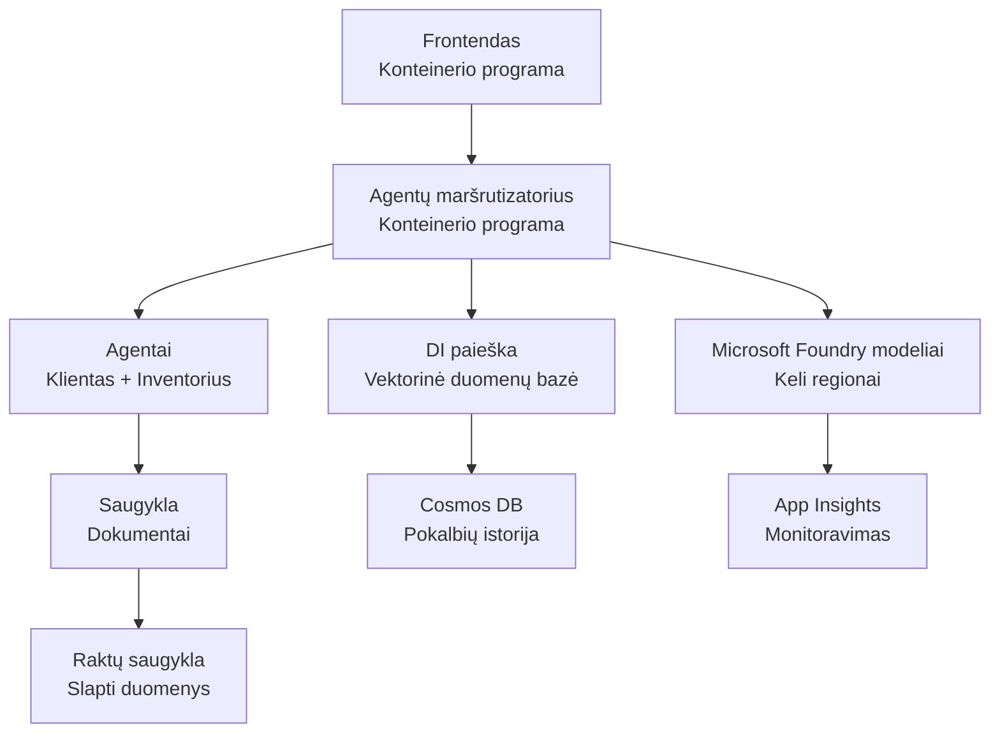

# Mažmeninės prekybos daugiagentų sprendimas - infrastruktūros šablonas

**5 skyrius: Produkcijos diegimo paketas**
- **📚 Kurso pradžia**: [AZD For Beginners](../../README.md)
- **📖 Susijęs skyrius**: [Chapter 5: Multi-Agent AI Solutions](../../README.md#-chapter-5-multi-agent-ai-solutions-advanced)
- **📝 Scenarijaus vadovas**: [Pilna architektūra](../retail-scenario.md)
- **🎯 Greitas diegimas**: [Vieno paspaudimo diegimas](#-quick-deployment)

> **⚠️ TIK INFRASTRUKTŪROS ŠABLONAS**  
> Šis ARM šablonas diegia **Azure išteklius** daugiagentų sistemai.  
>  
> **Kas bus diegiama (15–25 minučių):**
> - ✅ Microsoft Foundry Models (gpt-4.1, gpt-4.1-mini, embeddings trijuose regionuose)
> - ✅ AI Search paslauga (tuščia, paruošta indekso kūrimui)
> - ✅ Container Apps (laikini vaizdai, paruošta jūsų kodui)
> - ✅ Saugykla, Cosmos DB, Key Vault, Application Insights
>  
> **Kas NĖRA įtraukta (reikia vystymo):**
> - ❌ Agentų įgyvendinimo kodas (Customer Agent, Inventory Agent)
> - ❌ Maršrutizavimo logika ir API galiniai taškai
> - ❌ Frontendo pokalbių vartotojo sąsaja
> - ❌ Paieškos indekso schemos ir duomenų srautai
> - ❌ **Numatomas vystymo laikas: 80–120 valandų**
>  
> **Naudokite šį šabloną, jei:**
> - ✅ Norite paruošti Azure infrastruktūrą daugiagentiniam projektui
> - ✅ Ketinate atskirai vystyti agentų įgyvendinimą
> - ✅ Reikia gamybai paruoštos infrastruktūros bazės
>  
> **Nenaudokite, jei:**
> - ❌ Tikitės iš karto turėti veikiančią daugiagentų demonstracinę versiją
> - ❌ Ieškote pilnų programos kodo pavyzdžių

## Apžvalga

Šis katalogas turi išsamų Azure Resource Manager (ARM) šabloną, skirtą diegti **infrastruktūros pagrindą** daugiagentinei klientų aptarnavimo sistemai. Šablonas paruošia visas reikalingas Azure paslaugas, tinkamai sukonfigūruotas ir sujungtas, paruoštas jūsų programos vystymui.

**Po diegimo turėsite:** Azure infrastruktūrą, paruoštą gamybai  
**Kad užbaigtumėte sistemą, reikia:** Agentų kodo, frontendo UI ir duomenų konfigūracijos (žr. [Architektūros vadovas](../retail-scenario.md))

## 🎯 Kas bus diegiama

### Pagrindinė infrastruktūra (būsena po diegimo)

✅ **Microsoft Foundry Models paslaugos** (paruošta API užklausoms)
  - Pagrindinis regionas: gpt-4.1 diegimas (20K TPM talpa)
  - Antrinis regionas: gpt-4.1-mini diegimas (10K TPM talpa)
  - Tercijinis regionas: teksto embeddingų modelis (30K TPM talpa)
  - Įvertinimo regionas: gpt-4.1 grader modelis (15K TPM talpa)
  - **Būsena:** Pilnai veikianti - API užklausas galima siųsti iš karto

✅ **Azure AI Search** (tuščia - paruošta konfigūracijai)
  - Vektorinės paieškos galimybės įjungtos
  - Standartinis lygis su 1 particija, 1 replika
  - **Būsena:** Paslauga veikia, bet reikalingas indekso sukūrimas
  - **Reikalingas veiksmas:** Sukurkite paieškos indeksą su savo schema

✅ **Azure saugybos paskyra** (tuščia - paruošta įkėlimams)
  - Blob konteineriai: `documents`, `uploads`
  - Saugus konfigūracija (tik HTTPS, be viešo priėjimo)
  - **Būsena:** Paruošta priimti failus
  - **Reikalingas veiksmas:** Įkelkite savo produktų duomenis ir dokumentus

⚠️ **Container Apps aplinka** (įdiegti laikini vaizdai)
  - Agentų maršrutizatoriaus programa (nginx numatytasis vaizdas)
  - Frontendo programa (nginx numatytasis vaizdas)
  - Automatinis mastelio keitimas sukonfigūruotas (0-10 egzempliorių)
  - **Būsena:** Veikia laikini konteineriai
  - **Reikalingas veiksmas:** Sukurkite ir įdiekite savo agentų programas

✅ **Azure Cosmos DB** (tuščia - paruošta duomenims)
  - Duomenų bazė ir konteineris iš anksto sukonfigūruoti
  - Optimizuota mažam delsos laikui
  - TTL įjungtas automatinio valymo
  - **Būsena:** Paruošta saugoti pokalbių istoriją

✅ **Azure Key Vault** (pasirenkama - paruošta slaptiesiems duomenims)
  - Minkštasis ištrynimas įjungtas
  - RBAC sukonfigūruotas valdomoms tapatybėms
  - **Būsena:** Paruošta saugoti API raktus ir prisijungimo eilutes

✅ **Application Insights** (pasirenkama - stebėjimas aktyvus)
  - Prijungta prie Log Analytics darbo srities
  - Pasirinktiniai metrikai ir įspėjimai sukonfigūruoti
  - **Būsena:** Paruošta gauti telemetriją iš jūsų programų

✅ **Document Intelligence** (paruošta API užklausoms)
  - S0 lygis gamybiniams apkrovoms
  - **Būsena:** Paruošta apdoroti įkeltus dokumentus

✅ **Bing Search API** (paruošta API užklausoms)
  - S1 lygis realiojo laiko paieškoms
  - **Būsena:** Paruošta žiniatinklio paieškos užklausoms

### Diegimo režimai

| Mode | OpenAI Capacity | Container Instances | Search Tier | Storage Redundancy | Best For |
|------|-----------------|---------------------|-------------|-------------------|----------|
| **Minimal** | 10K-20K TPM | 0-2 replicas | Basic | LRS (Local) | Dev/test, learning, proof-of-concept |
| **Standard** | 30K-60K TPM | 2-5 replicas | Standard | ZRS (Zone) | Production, moderate traffic (<10K users) |
| **Premium** | 80K-150K TPM | 5-10 replicas, zone-redundant | Premium | GRS (Geo) | Enterprise, high traffic (>10K users), 99.99% SLA |

**Kainos poveikis:**
- **Minimal → Standard:** ~4x kainos padidėjimas ($100-370/mo → $420-1,450/mo)
- **Standard → Premium:** ~3x kainos padidėjimas ($420-1,450/mo → $1,150-3,500/mo)
- **Pasirinkimas priklauso nuo:** numatomo apkrovimo, SLA reikalavimų, biudžeto apribojimų

**Talpos planavimas:**
- **TPM (Žetonai per minutę):** Bendra visų modelių diegimų suma
- **Konteinerių instancijos:** Automatinio mastelio diapazonas (min-maks replikos)
- **Paieškos lygis:** Įtakoja užklausų našumą ir indekso dydžio apribojimus

## 📋 Privalomi reikalavimai

### Reikalingi įrankiai
1. **Azure CLI** (versija 2.50.0 arba naujesnė)
   ```bash
   az --version  # Patikrinti versiją
   az login      # Autentifikuoti
   ```

2. **Aktyvi Azure prenumerata** su Owner arba Contributor prieiga
   ```bash
   az account show  # Patvirtinkite prenumeratą
   ```

### Reikalingos Azure kvotos

Prieš diegimą, patikrinkite, ar tiksliniuose regionuose yra pakankamai kvotų:

```bash
# Patikrinkite Microsoft Foundry modelių prieinamumą jūsų regione
az cognitiveservices account list-skus \
  --kind OpenAI \
  --location eastus2

# Patikrinkite OpenAI kvotą (pvz. gpt-4.1)
az cognitiveservices usage list \
  --location eastus2 \
  --query "[?name.value=='OpenAI.Standard.gpt-4.1']"

# Patikrinkite Container Apps kvotą
az provider show \
  --namespace Microsoft.App \
  --query "resourceTypes[?resourceType=='managedEnvironments'].locations"
```

**Minimalios reikalaujamos kvotos:**
- **Microsoft Foundry Models:** 3-4 modelių diegimai per regionus
  - gpt-4.1: 20K TPM (Žetonai per minutę)
  - gpt-4.1-mini: 10K TPM
  - text-embedding-ada-002: 30K TPM
  - **Pastaba:** gpt-4.1 kai kuriuose regionuose gali turėti laukimo sąrašą - patikrinkite [modelių prieinamumą](https://learn.microsoft.com/azure/ai-services/openai/concepts/models)
- **Container Apps:** Valdoma aplinka + 2-10 konteinerių instancijų
- **AI Search:** Standartinis lygis (Basic nepakanka vektorinėms paieškoms)
- **Cosmos DB:** Standartinis provisioned throughput

**Jei kvotos nepakankamos:**
1. Eikite į Azure Portal → Quotas → Request increase
2. Arba naudokite Azure CLI:
   ```bash
   az support tickets create \
     --ticket-name "OpenAI-Quota-Increase" \
     --severity "minimal" \
     --description "Request quota increase for Microsoft Foundry Models gpt-4.1 in eastus2"
   ```
3. Apsvarstykite alternatyvius regionus su prieinamumu

## 🚀 Greitas diegimas

### Parinktis 1: Naudojant Azure CLI

```bash
# Klonuoti arba atsisiųsti šablono failus
git clone <repository-url>
cd examples/retail-multiagent-arm-template

# Padaryti diegimo skriptą vykdomu
chmod +x deploy.sh

# Diegti su numatytomis nustatymomis
./deploy.sh -g myResourceGroup

# Diegti gamybai su premium funkcijomis
./deploy.sh -g myProdRG -e prod -m premium -l eastus2
```

### Parinktis 2: Naudojant Azure Portal

[](https://portal.azure.com/#create/Microsoft.Template/uri/https%3A%2F%2Fraw.githubusercontent.com%2Fmicrosoft%2Fazd-for-beginners%2Fmain%2Fexamples%2Fretail-multiagent-arm-template%2Fazuredeploy.json)

### Parinktis 3: Tiesiogiai naudojant Azure CLI

```bash
# Sukurti išteklių grupę
az group create --name myResourceGroup --location eastus2

# Diegti šabloną
az deployment group create \
  --resource-group myResourceGroup \
  --template-file azuredeploy.json \
  --parameters azuredeploy.parameters.json
```

## ⏱️ Diegimo laikas

### Ką tikėtis

| Phase | Duration | What Happens |
|-------|----------|--------------||
| **Template Validation** | 30-60 sekundžių | Azure patvirtina ARM šablono sintaksę ir parametrus |
| **Resource Group Setup** | 10-20 sekundžių | Sukuria resursų grupę (jei reikia) |
| **OpenAI Provisioning** | 5-8 minučių | Sukuria 3-4 OpenAI paskyras ir diegia modelius |
| **Container Apps** | 3-5 minučių | Sukuria aplinką ir diegia laikinius konteinerius |
| **Search & Storage** | 2-4 minučių | Provisionina AI Search paslaugą ir saugybos paskyras |
| **Cosmos DB** | 2-3 minučių | Sukuria duomenų bazę ir konfigūruoja konteinerius |
| **Monitoring Setup** | 2-3 minučių | Sukonfigūruoja Application Insights ir Log Analytics |
| **RBAC Configuration** | 1-2 minučių | Sukonfigūruoja valdomas tapatybes ir leidimus |
| **Total Deployment** | **15-25 minučių** | Visa infrastruktūra paruošta |

**Po diegimo:**
- ✅ **Infrastruktūra paruošta:** Visos Azure paslaugos įdiegtos ir veikia
- ⏱️ **Programos vystymas:** 80-120 valandų (jūsų atsakomybė)
- ⏱️ **Indekso konfigūracija:** 15-30 minučių (reikalinga jūsų schema)
- ⏱️ **Duomenų įkėlimas:** Priklauso nuo duomenų rinkinio dydžio
- ⏱️ **Testavimas ir patvirtinimas:** 2-4 valandos

---

## ✅ Patikrinkite diegimo sėkmę

### 1 žingsnis: Patikrinkite išteklių provizionavimą (2 minutės)

```bash
# Patikrinkite, ar visi ištekliai buvo sėkmingai įdiegti
az resource list \
  --resource-group myResourceGroup \
  --query "[?provisioningState!='Succeeded'].{Name:name, Status:provisioningState, Type:type}" \
  --output table
```

**Tikėtina būsena:** Tuščias sąrašas (visi ištekliai rodomi su "Succeeded" būsena)

### 2 žingsnis: Patikrinkite Microsoft Foundry Models diegimus (3 minutės)

```bash
# Išvardinti visas OpenAI paskyras
az cognitiveservices account list \
  --resource-group myResourceGroup \
  --query "[?kind=='OpenAI'].{Name:name, Location:location, Status:properties.provisioningState}" \
  --output table

# Patikrinti modelių diegimus pagrindiniame regione
OPENAI_NAME=$(az cognitiveservices account list \
  --resource-group myResourceGroup \
  --query "[?kind=='OpenAI'] | [0].name" -o tsv)

az cognitiveservices account deployment list \
  --name $OPENAI_NAME \
  --resource-group myResourceGroup \
  --output table
```

**Tikėtina būsena:** 
- 3-4 OpenAI paskyros (pagrindinis, antrinis, tercijinis, įvertinimo regionai)
- 1-2 modelių diegimai kiekvienai paskyrai (gpt-4.1, gpt-4.1-mini, text-embedding-ada-002)

### 3 žingsnis: Išbandykite infrastruktūros galinius taškus (5 minutės)

```bash
# Gauti Container App URL adresus
az containerapp list \
  --resource-group myResourceGroup \
  --query "[].{Name:name, URL:properties.configuration.ingress.fqdn, Status:properties.runningStatus}" \
  --output table

# Išbandyti maršrutizatoriaus galinį tašką (atsakys laikinas paveikslėlis)
ROUTER_URL=$(az containerapp show \
  --name retail-router \
  --resource-group myResourceGroup \
  --query "properties.configuration.ingress.fqdn" -o tsv)

echo "Testing: https://$ROUTER_URL"
curl -I https://$ROUTER_URL || echo "Container running (placeholder image - expected)"
```

**Tikėtina būsena:** 
- Container Apps rodo "Running" būseną
- Laikinasis nginx atsako su HTTP 200 arba 404 (programos kodo dar nėra)

### 4 žingsnis: Patikrinkite Microsoft Foundry Models API prieigą (3 minutės)

```bash
# Gauti OpenAI galinį tašką ir raktą
OPENAI_ENDPOINT=$(az cognitiveservices account show \
  --name $OPENAI_NAME \
  --resource-group myResourceGroup \
  --query "properties.endpoint" -o tsv)

OPENAI_KEY=$(az cognitiveservices account keys list \
  --name $OPENAI_NAME \
  --resource-group myResourceGroup \
  --query "key1" -o tsv)

# Išbandyti gpt-4.1 diegimą
curl "${OPENAI_ENDPOINT}openai/deployments/gpt-4.1/chat/completions?api-version=2024-08-01-preview" \
  -H "Content-Type: application/json" \
  -H "api-key: $OPENAI_KEY" \
  -d '{
    "messages": [{"role": "user", "content": "Say hello"}],
    "max_tokens": 10
  }'
```

**Tikėtina būsena:** JSON atsakymas su pokalbio pabaiga (patvirtina, kad OpenAI veikia)

### Kas veikia priešingai nei kas ne

**✅ Veiks po diegimo:**
- Microsoft Foundry Models modeliai įdiegti ir priima API užklausas
- AI Search paslauga veikia (tuščia, indekso nėra)
- Container Apps veikia (laikiniai nginx vaizdai)
- Saugybos paskyros prieinamos ir paruoštos įkėlimams
- Cosmos DB paruošta duomenų operacijoms
- Application Insights renka infrastruktūros telemetriją
- Key Vault paruoštas slaptiesiems duomenims

**❌ Dar neveikia (reikia vystymo):**
- Agentų galiniai taškai (programos kodas neįdiegtas)
- Pokalbių funkcionalumas (reikalingas frontend + backend įgyvendinimas)
- Paieškos užklausos (indeksas dar nesukurtas)
- Dokumentų apdorojimo pipeline (duomenys neįkelti)
- Vartotojiška telemetrija (reikalinga programų instrumentacija)

**Tolimesni žingsniai:** Žr. [Post-Deployment Configuration](#-post-deployment-next-steps), kad vystytumėte ir įdiegtumėte savo programą

---

## ⚙️ Konfigūracijos parinktys

### Šablono parametrai

| Parameter | Type | Default | Description |
|-----------|------|---------|-------------|
| `projectName` | string | "retail" | Prefiksas visiems resursų pavadinimams |
| `location` | string | Resource group location | Pagrindinis diegimo regionas |
| `secondaryLocation` | string | "westus2" | Antrinis regionas daugiaregioniniam diegimui |
| `tertiaryLocation` | string | "francecentral" | Regionas embeddingų modeliui |
| `environmentName` | string | "dev" | Aplinkos žymėjimas (dev/staging/prod) |
| `deploymentMode` | string | "standard" | Diegimo konfigūracija (minimal/standard/premium) |
| `enableMultiRegion` | bool | true | Įjungti daugiaregioninį diegimą |
| `enableMonitoring` | bool | true | Įjungti Application Insights ir žurnalus |
| `enableSecurity` | bool | true | Įjungti Key Vault ir išplėstinį saugumą |

### Parametrų pritaikymas

Redaguokite `azuredeploy.parameters.json`:

```json
{
  "$schema": "https://schema.management.azure.com/schemas/2019-04-01/deploymentParameters.json#",
  "contentVersion": "1.0.0.0",
  "parameters": {
    "projectName": {
      "value": "mycompany"
    },
    "environmentName": {
      "value": "prod"
    },
    "deploymentMode": {
      "value": "premium"
    },
    "location": {
      "value": "eastus2"
    }
  }
}
```

## 🏗️ Architektūros apžvalga


## 📖 Diegimo scenarijaus naudojimas

`deploy.sh` scenarijus suteikia interaktyvią diegimo patirtį:

```bash
# Rodyti pagalbą
./deploy.sh --help

# Pagrindinis diegimas
./deploy.sh -g myResourceGroup

# Išplėstinis diegimas su pasirinktiniais nustatymais
./deploy.sh \
  -g myProductionRG \
  -p companyname \
  -e prod \
  -m premium \
  -l eastus2

# Vystymo diegimas be kelių regionų
./deploy.sh \
  -g myDevRG \
  -e dev \
  -m minimal \
  --no-multi-region \
  --no-security
```

### Scenarijaus ypatybės

- ✅ **Prieš diegimą patikrinama** (Azure CLI, prisijungimo būsena, šablono failai)
- ✅ **Resursų grupės valdymas** (sukuriama, jei nėra)
- ✅ **Šablono validacija** prieš diegimą
- ✅ **Progreso stebėjimas** su spalvotu išvedimu
- ✅ **Diegimo išvestis** rodoma
- ✅ **Gairės po diegimo**

## 📊 Diegimo stebėjimas

### Patikrinkite diegimo būseną

```bash
# Išvardinti diegimus
az deployment group list --resource-group myResourceGroup --output table

# Gauti diegimo detales
az deployment group show \
  --resource-group myResourceGroup \
  --name retail-deployment-YYYYMMDD-HHMMSS

# Stebėti diegimo eigą
az deployment group create \
  --resource-group myResourceGroup \
  --template-file azuredeploy.json \
  --parameters azuredeploy.parameters.json \
  --verbose
```

### Diegimo išvestys

Po sėkmingo diegimo bus prieinamos šios išvestys:

- **Frontend URL**: Viešasis žiniatinklio sąsajos galinis taškas
- **Router URL**: API galinis taškas agentų maršrutizatoriui
- **OpenAI Endpoints**: Pagrindiniai ir antriniai OpenAI paslaugų endpoint'ai
- **Search Service**: Azure AI Search paslaugos endpoint'as
- **Storage Account**: Saugybos paskyros pavadinimas dokumentams
- **Key Vault**: Key Vault pavadinimas (jei įjungta)
- **Application Insights**: Stebėjimo paslaugos pavadinimas (jei įjungta)

## 🔧 Po diegimo: Tolimesni žingsniai
> **📝 Svarbu:** Infrastruktūra įdiegta, tačiau jums reikia sukurti ir įdiegti programos kodą.

### 1 etapas: Sukurti agentų programas (Jūsų atsakomybė)

ARM šablonas sukuria **tuščias Container Apps** su laikinais nginx atvaizdais. Jūs turite:

**Reikalingas vystymas:**
1. **Agentų įgyvendinimas** (30–40 val.)
   - Klientų aptarnavimo agentas su gpt-4.1 integracija
   - Inventoriaus agentas su gpt-4.1-mini integracija
   - Agentų maršrutizavimo logika

2. **Frontend kūrimas** (20–30 val.)
   - Pokalbių sąsajos UI (React/Vue/Angular)
   - Failų įkėlimo funkcionalumas
   - Atsakymų pateikimas ir formatavimas

3. **Backend paslaugos** (12–16 val.)
   - FastAPI arba Express maršrutizatorius
   - Autentifikacijos middleware
   - Telemetrijos integracija

**Žr.:** [Architektūros gidas](../retail-scenario.md) dėl išsamių įgyvendinimo šablonų ir kodo pavyzdžių

### 2 etapas: Konfigūruokite AI paieškos indeksą (15–30 minučių)

Sukurkite paieškos indeksą, atitinkantį jūsų duomenų modelį:

```bash
# Gaukite paieškos paslaugos detales
SEARCH_NAME=$(az search service list \
  --resource-group myResourceGroup \
  --query "[0].name" -o tsv)

SEARCH_KEY=$(az search admin-key show \
  --service-name $SEARCH_NAME \
  --resource-group myResourceGroup \
  --query "primaryKey" -o tsv)

# Sukurkite indeksą pagal savo schemą (pavyzdys)
curl -X POST "https://${SEARCH_NAME}.search.windows.net/indexes?api-version=2023-11-01" \
  -H "Content-Type: application/json" \
  -H "api-key: ${SEARCH_KEY}" \
  -d '{
    "name": "products",
    "fields": [
      {"name": "id", "type": "Edm.String", "key": true},
      {"name": "title", "type": "Edm.String", "searchable": true},
      {"name": "content", "type": "Edm.String", "searchable": true},
      {"name": "category", "type": "Edm.String", "filterable": true},
      {"name": "content_vector", "type": "Collection(Edm.Single)", 
       "searchable": true, "dimensions": 1536, "vectorSearchProfile": "default"}
    ],
    "vectorSearch": {
      "algorithms": [{"name": "default", "kind": "hnsw"}],
      "profiles": [{"name": "default", "algorithm": "default"}]
    }
  }'
```

**Ištekliai:**
- [AI paieškos indekso schemos dizainas](https://learn.microsoft.com/azure/search/search-what-is-an-index)
- [Vektorinės paieškos konfigūracija](https://learn.microsoft.com/azure/search/vector-search-how-to-create-index)

### 3 etapas: Įkelkite savo duomenis (laikas skiriasi)

Kai turėsite produktų duomenis ir dokumentus:

```bash
# Gaukite saugojimo paskyros duomenis
STORAGE_NAME=$(az storage account list \
  --resource-group myResourceGroup \
  --query "[0].name" -o tsv)

STORAGE_KEY=$(az storage account keys list \
  --account-name $STORAGE_NAME \
  --resource-group myResourceGroup \
  --query "[0].value" -o tsv)

# Įkelkite savo dokumentus
az storage blob upload-batch \
  --destination documents \
  --source /path/to/your/product/docs \
  --account-name $STORAGE_NAME \
  --account-key $STORAGE_KEY

# Pavyzdys: vieno failo įkėlimas
az storage blob upload \
  --container-name documents \
  --name "product-manual.pdf" \
  --file /path/to/product-manual.pdf \
  --account-name $STORAGE_NAME \
  --account-key $STORAGE_KEY
```

### 4 etapas: Sukurkite ir diegkite savo programas (8–12 val.)

Kai sukursite savo agentų kodą:

```bash
# 1. Sukurkite Azure Container Registry (jei reikia)
az acr create \
  --name myregistry \
  --resource-group myResourceGroup \
  --sku Basic

# 2. Sukurkite ir įkelkite agentų maršrutizatoriaus atvaizdą
docker build -t myregistry.azurecr.io/agent-router:v1 /path/to/your/router/code
az acr login --name myregistry
docker push myregistry.azurecr.io/agent-router:v1

# 3. Sukurkite ir įkelkite frontend atvaizdą
docker build -t myregistry.azurecr.io/frontend:v1 /path/to/your/frontend/code
docker push myregistry.azurecr.io/frontend:v1

# 4. Atnaujinkite Container Apps naudodami savo atvaizdus
az containerapp update \
  --name retail-router \
  --resource-group myResourceGroup \
  --image myregistry.azurecr.io/agent-router:v1

az containerapp update \
  --name retail-frontend \
  --resource-group myResourceGroup \
  --image myregistry.azurecr.io/frontend:v1

# 5. Konfigūruokite aplinkos kintamuosius
az containerapp update \
  --name retail-router \
  --resource-group myResourceGroup \
  --set-env-vars \
    OPENAI_ENDPOINT=secretref:openai-endpoint \
    OPENAI_KEY=secretref:openai-key \
    SEARCH_ENDPOINT=secretref:search-endpoint \
    SEARCH_KEY=secretref:search-key
```

### 5 etapas: Išbandykite savo programą (2–4 val.)

```bash
# Gaukite savo programos URL
ROUTER_URL=$(az containerapp show \
  --name retail-router \
  --resource-group myResourceGroup \
  --query "properties.configuration.ingress.fqdn" -o tsv)

# Išbandykite agento galinį tašką (kai jūsų kodas bus išdiegtas)
curl -X POST "https://${ROUTER_URL}/chat" \
  -H "Content-Type: application/json" \
  -d '{
    "message": "Hello, I need help with my order",
    "agent": "customer"
  }'

# Patikrinkite programos žurnalus
az containerapp logs show \
  --name retail-router \
  --resource-group myResourceGroup \
  --follow
```

### Įgyvendinimo ištekliai

**Architektūra ir dizainas:**
- 📖 [Išsamus architektūros gidas](../retail-scenario.md) - Išsamūs įgyvendinimo šablonai
- 📖 [Daugiagentės dizaino šablonai](https://learn.microsoft.com/azure/architecture/ai-ml/guide/multi-agent-systems)

**Kodo pavyzdžiai:**
- 🔗 [Microsoft Foundry modelių pokalbių pavyzdys](https://github.com/Azure-Samples/azure-search-openai-demo) - RAG modelis
- 🔗 [Semantic Kernel](https://github.com/microsoft/semantic-kernel) - Agentų karkasas (C#)
- 🔗 [LangChain Azure](https://github.com/langchain-ai/langchain) - Agentų orkestracija (Python)
- 🔗 [AutoGen](https://github.com/microsoft/autogen) - Daugiagentės pokalbės

**Apskaičiuotas bendras darbo kiekis:**
- Infrastruktūros diegimas: 15–25 minučių (✅ Baigta)
- Programų kūrimas: 80–120 valandų (🔨 Jūsų darbas)
- Testavimas ir optimizavimas: 15–25 valandų (🔨 Jūsų darbas)

## 🛠️ Trikčių šalinimas

### Dažnos problemos

#### 1. Viršyta Microsoft Foundry modelių kvota

```bash
# Patikrinkite dabartinį kvotos naudojimą
az cognitiveservices usage list --location eastus2

# Prašykite kvotos padidinimo
az support tickets create \
  --ticket-name "OpenAI-Quota-Increase" \
  --severity "minimal" \
  --description "Request quota increase for Microsoft Foundry Models in region X"
```

#### 2. Container Apps diegimas nepavyko

```bash
# Patikrinkite konteinerio programėlės žurnalus
az containerapp logs show \
  --name retail-router \
  --resource-group myResourceGroup \
  --follow

# Paleisti iš naujo konteinerio programėlę
az containerapp revision restart \
  --name retail-router \
  --resource-group myResourceGroup
```

#### 3. Paieškos paslaugos inicializacija

```bash
# Patikrinti paieškos paslaugos būseną
az search service show \
  --name <search-service-name> \
  --resource-group myResourceGroup

# Išbandyti ryšį su paieškos paslauga
curl -X GET "https://<search-service-name>.search.windows.net/indexes?api-version=2023-11-01" \
  -H "api-key: <search-admin-key>"
```

### Diegimo tikrinimas

```bash
# Patvirtinkite, kad visi ištekliai yra sukurti
az resource list \
  --resource-group myResourceGroup \
  --output table

# Patikrinkite išteklių būklę
az resource list \
  --resource-group myResourceGroup \
  --query "[?provisioningState!='Succeeded'].{Name:name, Status:provisioningState, Type:type}" \
  --output table
```

## 🔐 Saugumo svarstymai

### Raktų valdymas
- Visi slaptieji duomenys saugomi Azure Key Vault (kai įjungta)
- Container Apps naudoja valdomą tapatybę autentifikacijai
- Saugyklos paskyros turi saugius numatytuosius nustatymus (tik HTTPS, jokia vieša blob prieiga)

### Tinklo saugumas
- Container Apps naudoja vidinį tinklą, kur įmanoma
- Paieškos paslauga sukonfigūruota su privačių galinių taškų parinktimi
- Cosmos DB sukonfigūruota su minimaliais būtiniausiais leidimais

### RBAC konfigūracija
```bash
# Priskirkite reikiamus vaidmenis valdomai tapatybei
az role assignment create \
  --assignee <container-app-managed-identity> \
  --role "Cognitive Services OpenAI User" \
  --scope <openai-resource-id>
```

## 💰 Sąnaudų optimizavimas

### Kainų sąmata (mėnesinė, USD)

| Režimas | OpenAI | Container Apps | Paieška | Saugykla | Apytikslė suma |
|------|--------|----------------|--------|---------|------------|
| Minimalus | $50-200 | $20-50 | $25-100 | $5-20 | $100-370 |
| Standartinis | $200-800 | $100-300 | $100-300 | $20-50 | $420-1450 |
| Premium | $500-2000 | $300-800 | $300-600 | $50-100 | $1150-3500 |

### Sąnaudų stebėsena

```bash
# Nustatyti biudžeto įspėjimus
az consumption budget create \
  --account-name <subscription-id> \
  --budget-name "retail-budget" \
  --amount 500 \
  --time-grain Monthly \
  --start-date 2024-01-01 \
  --end-date 2024-12-31
```

## 🔄 Atnaujinimai ir priežiūra

### Šablono atnaujinimai
- Valdykite ARM šablonų failų versijas
- Pirmiausia išbandykite pakeitimus kūrimo aplinkoje
- Naudokite inkrementinio diegimo režimą atnaujinimams

### Išteklių atnaujinimai
```bash
# Atnaujinti su naujais parametrais
az deployment group create \
  --resource-group myResourceGroup \
  --template-file azuredeploy.json \
  --parameters azuredeploy.parameters.json \
  --mode Incremental
```

### Atsarginė kopija ir atkūrimas
- Įjungta Cosmos DB automatinė atsarginė kopija
- Key Vault įjungta minkštojo ištrinimo funkcija
- Container app versijos palaikomos grąžinimui atgal

## 📞 Palaikymas

- **Šablono problemos**: [GitHub Issues](https://github.com/microsoft/azd-for-beginners/issues)
- **Azure palaikymas**: [Azure Support Portal](https://portal.azure.com/#blade/Microsoft_Azure_Support/HelpAndSupportBlade)
- **Bendruomenė**: [Azure AI Discord](https://discord.gg/microsoft-azure)

---

**⚡ Pasiruošę diegti savo daugiaagentę sprendimą?**

Pradėkite nuo: `./deploy.sh -g myResourceGroup`

---

<!-- CO-OP TRANSLATOR DISCLAIMER START -->
**Disclaimer**:
Šis dokumentas buvo išverstas naudojant dirbtinio intelekto vertimo paslaugą [Co-op Translator](https://github.com/Azure/co-op-translator). Nors siekiame tikslumo, prašome atkreipti dėmesį, kad automatizuoti vertimai gali turėti klaidų arba netikslumų. Originalus dokumentas jo gimtąja kalba turėtų būti laikomas autoritetingu šaltiniu. Svarbios informacijos atveju rekomenduojamas profesionalus žmogaus vertimas. Mes neprisiimame atsakomybės už bet kokius nesusipratimus ar neteisingus aiškinimus, kilusius dėl šio vertimo naudojimo.
<!-- CO-OP TRANSLATOR DISCLAIMER END -->