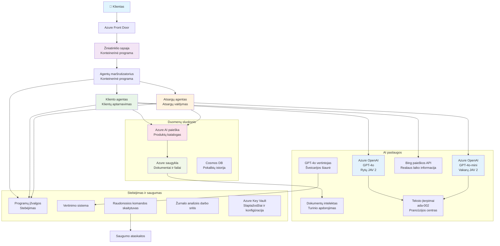

<!--
CO_OP_TRANSLATOR_METADATA:
{
  "original_hash": "77db71c83f2e7fbc9f50320bd1cc7116",
  "translation_date": "2025-11-24T09:08:27+00:00",
  "source_file": "examples/retail-scenario.md",
  "language_code": "lt"
}
-->
# Daugiaveiksmė klientų aptarnavimo sprendimas – Mažmenininko scenarijus

**5 skyrius: Daugiaveiksmiai AI sprendimai**
- **📚 Kurso pagrindinis puslapis**: [AZD pradedantiesiems](../README.md)
- **📖 Dabartinis skyrius**: [5 skyrius: Daugiaveiksmiai AI sprendimai](../README.md#-chapter-5-multi-agent-ai-solutions-advanced)
- **⬅️ Būtinos žinios**: [2 skyrius: AI-pirmasis vystymas](../docs/ai-foundry/azure-ai-foundry-integration.md)
- **➡️ Kitas skyrius**: [6 skyrius: Prieš diegimą atliekamas patikrinimas](../docs/pre-deployment/capacity-planning.md)
- **🚀 ARM šablonai**: [Diegimo paketas](retail-multiagent-arm-template/README.md)

> **⚠️ ARCHITEKTŪROS VADOVAS – NE VEIKIANTI ĮGYVENDINIMO VERSIJA**  
> Šis dokumentas pateikia **išsamų architektūros planą** daugiaveiksmės sistemos kūrimui.  
> **Kas jau yra:** ARM šablonas infrastruktūros diegimui (Azure OpenAI, AI Search, Container Apps ir kt.)  
> **Ką turite sukurti:** Agentų kodą, maršrutizavimo logiką, vartotojo sąsają, duomenų srautus (numatoma 80–120 valandų)  
>  
> **Naudokite tai kaip:**
> - ✅ Architektūros nuorodą savo daugiaveiksmio projekto kūrimui
> - ✅ Mokymosi vadovą daugiaveiksmio dizaino modeliams
> - ✅ Infrastruktūros šabloną Azure resursų diegimui
> - ❌ NE paruoštą naudoti programą (reikalingas reikšmingas vystymas)

## Apžvalga

**Mokymosi tikslas:** Suprasti architektūrą, dizaino sprendimus ir įgyvendinimo metodiką, kuriant gamybai paruoštą daugiaveiksmį klientų aptarnavimo pokalbių robotą mažmenininkui su pažangiomis AI galimybėmis, įskaitant inventoriaus valdymą, dokumentų apdorojimą ir intelektualius klientų sąveikos sprendimus.

**Laikas užbaigti:** Skaitymas + supratimas (2–3 valandos) | Pilnas įgyvendinimas (80–120 valandų)

**Ką išmoksite:**
- Daugiaveiksmės architektūros modelius ir dizaino principus
- Daugiaregionines Azure OpenAI diegimo strategijas
- AI Search integraciją su RAG (Retrieval-Augmented Generation)
- Agentų vertinimo ir saugumo testavimo sistemas
- Gamybos diegimo aspektus ir kaštų optimizavimą

## Architektūros tikslai

**Švietimo dėmesys:** Ši architektūra demonstruoja įmonių modelius daugiaveiksmėms sistemoms.

### Sistemos reikalavimai (jūsų įgyvendinimui)

Gamybinis klientų aptarnavimo sprendimas reikalauja:
- **Kelių specializuotų agentų** skirtingiems klientų poreikiams (klientų aptarnavimas + inventoriaus valdymas)
- **Daugiamodelio diegimo** su tinkamu pajėgumų planavimu (GPT-4o, GPT-4o-mini, įterpimai skirtinguose regionuose)
- **Dinaminės duomenų integracijos** su AI Search ir failų įkėlimais (vektorinė paieška + dokumentų apdorojimas)
- **Išsamios stebėsenos** ir vertinimo galimybių (Application Insights + individualūs metrikai)
- **Gamybinio lygio saugumo** su raudonosios komandos patikrinimais (pažeidžiamumo skenavimas + agentų vertinimas)

### Ką šis vadovas pateikia

✅ **Architektūros modeliai** – Patikrintas dizainas masteliui pritaikytoms daugiaveiksmėms sistemoms  
✅ **Infrastruktūros šablonai** – ARM šablonai visų Azure paslaugų diegimui  
✅ **Kodo pavyzdžiai** – Nuorodų įgyvendinimai pagrindiniams komponentams  
✅ **Konfigūracijos gairės** – Žingsnis po žingsnio nustatymo instrukcijos  
✅ **Geriausios praktikos** – Saugumo, stebėsenos, kaštų optimizavimo strategijos  

❌ **Neįtraukta** – Pilnai veikianti programa (reikalingas vystymo darbas)

## 🗺️ Įgyvendinimo planas

### 1 etapas: Architektūros studijavimas (2–3 valandos) – PRADĖKITE ČIA

**Tikslas:** Suprasti sistemos dizainą ir komponentų sąveiką

- [ ] Perskaitykite šį dokumentą
- [ ] Peržiūrėkite architektūros diagramą ir komponentų ryšius
- [ ] Supraskite daugiaveiksmio modelius ir dizaino sprendimus
- [ ] Išnagrinėkite kodo pavyzdžius agentų įrankiams ir maršrutizavimui
- [ ] Peržiūrėkite kaštų įvertinimus ir pajėgumų planavimo gaires

**Rezultatas:** Aiškus supratimas, ką reikia sukurti

### 2 etapas: Infrastruktūros diegimas (30–45 minutės)

**Tikslas:** Paruošti Azure resursus naudojant ARM šabloną

```bash
cd retail-multiagent-arm-template
./deploy.sh -g myResourceGroup -m standard
```

**Kas bus įdiegta:**
- ✅ Azure OpenAI (3 regionai: GPT-4o, GPT-4o-mini, įterpimai)
- ✅ AI Search paslauga (tuščia, reikia indekso konfigūracijos)
- ✅ Container Apps aplinka (vietos rezervavimo vaizdai)
- ✅ Saugyklos paskyros, Cosmos DB, Key Vault
- ✅ Application Insights stebėsena

**Ko trūksta:**
- ❌ Agentų įgyvendinimo kodo
- ❌ Maršrutizavimo logikos
- ❌ Vartotojo sąsajos
- ❌ Paieškos indekso schemos
- ❌ Duomenų srautų

### 3 etapas: Programos kūrimas (80–120 valandų)

**Tikslas:** Įgyvendinti daugiaveiksmę sistemą pagal šią architektūrą

1. **Agentų įgyvendinimas** (30–40 valandų)
   - Pagrindinė agento klasė ir sąsajos
   - Klientų aptarnavimo agentas su GPT-4o
   - Inventoriaus agentas su GPT-4o-mini
   - Įrankių integracijos (AI Search, Bing, failų apdorojimas)

2. **Maršrutizavimo paslauga** (12–16 valandų)
   - Užklausų klasifikavimo logika
   - Agentų pasirinkimas ir koordinavimas
   - FastAPI/Express backend

3. **Vartotojo sąsajos kūrimas** (20–30 valandų)
   - Pokalbių sąsajos UI
   - Failų įkėlimo funkcionalumas
   - Atsakymų atvaizdavimas

4. **Duomenų srautas** (8–12 valandų)
   - AI Search indekso kūrimas
   - Dokumentų apdorojimas su Document Intelligence
   - Įterpimų generavimas ir indeksavimas

5. **Stebėsena ir vertinimas** (10–15 valandų)
   - Individualios telemetrijos įgyvendinimas
   - Agentų vertinimo sistema
   - Raudonosios komandos saugumo skeneris

### 4 etapas: Diegimas ir testavimas (8–12 valandų)

- Sukurkite Docker vaizdus visoms paslaugoms
- Įkelkite į Azure Container Registry
- Atnaujinkite Container Apps su realiais vaizdais
- Sujunkite aplinkos kintamuosius ir slaptažodžius
- Paleiskite vertinimo testų rinkinį
- Atlikite saugumo skenavimą

**Bendra numatoma trukmė:** 80–120 valandų patyrusiems kūrėjams

## Sprendimo architektūra

### Architektūros diagrama


### Komponentų apžvalga

| Komponentas | Paskirtis | Technologija | Regionas |
|-------------|-----------|--------------|----------|
| **Web Frontend** | Vartotojo sąsaja klientų sąveikai | Container Apps | Pagrindinis regionas |
| **Agent Router** | Maršrutizuoja užklausas tinkamam agentui | Container Apps | Pagrindinis regionas |
| **Customer Agent** | Tvarko klientų aptarnavimo užklausas | Container Apps + GPT-4o | Pagrindinis regionas |
| **Inventory Agent** | Valdo atsargas ir užsakymus | Container Apps + GPT-4o-mini | Pagrindinis regionas |
| **Azure OpenAI** | LLM inferencija agentams | Cognitive Services | Daugiaregionis |
| **AI Search** | Vektorinė paieška ir RAG | AI Search Service | Pagrindinis regionas |
| **Storage Account** | Failų įkėlimai ir dokumentai | Blob Storage | Pagrindinis regionas |
| **Application Insights** | Stebėsena ir telemetrija | Monitor | Pagrindinis regionas |
| **Grader Model** | Agentų vertinimo sistema | Azure OpenAI | Antrinis regionas |

## 📁 Projekto struktūra

> **📍 Statuso legenda:**  
> ✅ = Yra saugykloje  
> 📝 = Nuorodinis įgyvendinimas (kodo pavyzdys šiame dokumente)  
> 🔨 = Reikia sukurti

```
retail-multiagent-solution/              🔨 Your project directory
├── .azure/                              🔨 Azure environment configs
│   ├── config.json                      🔨 Global config
│   └── env/
│       ├── .env.development             🔨 Dev environment
│       ├── .env.staging                 🔨 Staging environment
│       └── .env.production              🔨 Production environment
│
├── azure.yaml                          🔨 AZD main configuration
├── azure.parameters.json               🔨 Deployment parameters
├── README.md                           🔨 Solution documentation
│
├── infra/                              🔨 Infrastructure as Code (you create)
│   ├── main.bicep                      🔨 Main Bicep template (optional, ARM exists)
│   ├── main.parameters.json            🔨 Parameters file
│   ├── modules/                        📝 Bicep modules (reference examples below)
│   │   ├── ai-services.bicep           📝 Azure OpenAI deployments
│   │   ├── search.bicep                📝 AI Search configuration
│   │   ├── storage.bicep               📝 Storage accounts
│   │   ├── container-apps.bicep        📝 Container Apps environment
│   │   ├── monitoring.bicep            📝 Application Insights
│   │   ├── security.bicep              📝 Key Vault and RBAC
│   │   └── networking.bicep            📝 Virtual networks and DNS
│   ├── arm-template/                   ✅ ARM template version (EXISTS)
│   │   ├── azuredeploy.json            ✅ ARM main template (retail-multiagent-arm-template/)
│   │   └── azuredeploy.parameters.json ✅ ARM parameters
│   └── scripts/                        ✅/🔨 Deployment scripts
│       ├── deploy.sh                   ✅ Main deployment script (EXISTS)
│       ├── setup-data.sh               🔨 Data setup script (you create)
│       └── configure-rbac.sh           🔨 RBAC configuration (you create)
│
├── src/                                🔨 Application source code (YOU BUILD THIS)
│   ├── agents/                         📝 Agent implementations (examples below)
│   │   ├── base/                       🔨 Base agent classes
│   │   │   ├── agent.py                🔨 Abstract agent class
│   │   │   └── tools.py                🔨 Tool interfaces
│   │   ├── customer/                   🔨 Customer service agent
│   │   │   ├── agent.py                📝 Customer agent implementation (see below)
│   │   │   ├── prompts.py              🔨 System prompts
│   │   │   └── tools/                  🔨 Agent-specific tools
│   │   │       ├── search_tool.py      📝 AI Search integration (example below)
│   │   │       ├── bing_tool.py        📝 Bing Search integration (example below)
│   │   │       └── file_tool.py        🔨 File processing tool
│   │   └── inventory/                  🔨 Inventory management agent
│   │       ├── agent.py                🔨 Inventory agent implementation
│   │       ├── prompts.py              🔨 System prompts
│   │       └── tools/                  🔨 Agent-specific tools
│   │           ├── inventory_search.py 🔨 Inventory search tool
│   │           └── database_tool.py    🔨 Database query tool
│   │
│   ├── router/                         🔨 Agent routing service (you build)
│   │   ├── main.py                     🔨 FastAPI router application
│   │   ├── routing_logic.py            🔨 Request routing logic
│   │   └── middleware.py               🔨 Authentication & logging
│   │
│   ├── frontend/                       🔨 Web user interface (you build)
│   │   ├── Dockerfile                  🔨 Container configuration
│   │   ├── package.json                🔨 Node.js dependencies
│   │   ├── src/                        🔨 React/Vue source code
│   │   │   ├── components/             🔨 UI components
│   │   │   ├── pages/                  🔨 Application pages
│   │   │   ├── services/               🔨 API services
│   │   │   └── styles/                 🔨 CSS and themes
│   │   └── public/                     🔨 Static assets
│   │
│   ├── shared/                         🔨 Shared utilities (you build)
│   │   ├── config.py                   🔨 Configuration management
│   │   ├── telemetry.py                📝 Telemetry utilities (example below)
│   │   ├── security.py                 🔨 Security utilities
│   │   └── models.py                   🔨 Data models
│   │
│   └── evaluation/                     🔨 Evaluation and testing (you build)
│       ├── evaluator.py                📝 Agent evaluator (example below)
│       ├── red_team_scanner.py         📝 Security scanner (example below)
│       ├── test_cases.json             📝 Evaluation test cases (example below)
│       └── reports/                    🔨 Generated reports
│
├── data/                               🔨 Data and configuration (you create)
│   ├── search-schema.json              📝 AI Search index schema (example below)
│   ├── initial-docs/                   🔨 Initial document corpus
│   │   ├── product-manuals/            🔨 Product documentation (your data)
│   │   ├── policies/                   🔨 Company policies (your data)
│   │   └── faqs/                       🔨 Frequently asked questions (your data)
│   ├── fine-tuning/                    🔨 Fine-tuning datasets (optional)
│   │   ├── training.jsonl              🔨 Training data
│   │   └── validation.jsonl            🔨 Validation data
│   └── evaluation/                     🔨 Evaluation datasets
│       ├── test-conversations.json     📝 Test conversation data (example below)
│       └── ground-truth.json           🔨 Expected responses
│
├── scripts/                            # Utility scripts
│   ├── setup/                          # Setup scripts
│   │   ├── bootstrap.sh                # Initial environment setup
│   │   ├── install-dependencies.sh     # Install required tools
│   │   └── configure-env.sh            # Environment configuration
│   ├── data-management/                # Data management scripts
│   │   ├── upload-documents.py         # Document upload utility
│   │   ├── create-search-index.py      # Search index creation
│   │   └── sync-data.py                # Data synchronization
│   ├── deployment/                     # Deployment automation
│   │   ├── deploy-agents.sh            # Agent deployment
│   │   ├── update-frontend.sh          # Frontend updates
│   │   └── rollback.sh                 # Rollback procedures
│   └── monitoring/                     # Monitoring scripts
│       ├── health-check.py             # Health monitoring
│       ├── performance-test.py         # Performance testing
│       └── security-scan.py            # Security scanning
│
├── tests/                              # Test suites
│   ├── unit/                           # Unit tests
│   │   ├── test_agents.py              # Agent unit tests
│   │   ├── test_router.py              # Router unit tests
│   │   └── test_tools.py               # Tool unit tests
│   ├── integration/                    # Integration tests
│   │   ├── test_end_to_end.py          # E2E test scenarios
│   │   └── test_api.py                 # API integration tests
│   └── load/                           # Load testing
│       ├── load_test_config.yaml       # Load test configuration
│       └── scenarios/                  # Load test scenarios
│
├── docs/                               # Documentation
│   ├── architecture.md                 # Architecture documentation
│   ├── deployment-guide.md             # Deployment instructions
│   ├── agent-configuration.md          # Agent setup guide
│   ├── troubleshooting.md              # Troubleshooting guide
│   └── api/                            # API documentation
│       ├── agent-api.md                # Agent API reference
│       └── router-api.md               # Router API reference
│
├── hooks/                              # AZD lifecycle hooks
│   ├── preprovision.sh                 # Pre-provisioning tasks
│   ├── postprovision.sh                # Post-provisioning setup
│   ├── prepackage.sh                   # Pre-packaging tasks
│   └── postdeploy.sh                   # Post-deployment validation
│
└── .github/                            # GitHub workflows
    └── workflows/
        ├── ci-cd.yml                   # CI/CD pipeline
        ├── security-scan.yml           # Security scanning
        └── performance-test.yml        # Performance testing
```

---

## 🚀 Greitas startas: Ką galite padaryti dabar

### 1 variantas: Tik infrastruktūros diegimas (30 minučių)

**Ką gaunate:** Visos Azure paslaugos paruoštos vystymui

```bash
# Klonuoti saugyklą
git clone https://github.com/microsoft/AZD-for-beginners.git
cd AZD-for-beginners/examples/retail-multiagent-arm-template

# Diegti infrastruktūrą
./deploy.sh -g myResourceGroup -m standard

# Patikrinti diegimą
az resource list --resource-group myResourceGroup --output table
```

**Tikėtinas rezultatas:**
- ✅ Azure OpenAI paslaugos įdiegtos (3 regionai)
- ✅ AI Search paslauga sukurta (tuščia)
- ✅ Container Apps aplinka paruošta
- ✅ Saugyklos, Cosmos DB, Key Vault sukonfigūruoti
- ❌ Dar neveikiantys agentai (tik infrastruktūra)

### 2 variantas: Architektūros studijavimas (2–3 valandos)

**Ką gaunate:** Gilus daugiaveiksmio modelio supratimas

1. Perskaitykite šį dokumentą
2. Peržiūrėkite kodo pavyzdžius kiekvienam komponentui
3. Supraskite dizaino sprendimus ir kompromisus
4. Išnagrinėkite kaštų optimizavimo strategijas
5. Suplanuokite savo įgyvendinimo metodą

**Tikėtinas rezultatas:**
- ✅ Aiškus sistemos architektūros modelis
- ✅ Reikalingų komponentų supratimas
- ✅ Realistiški darbo įvertinimai
- ✅ Įgyvendinimo planas

### 3 variantas: Pilnos sistemos kūrimas (80–120 valandų)

**Ką gaunate:** Gamybai paruoštas daugiaveiksmis sprendimas

1. **1 etapas:** Diegti infrastruktūrą (atlikta aukščiau)
2. **2 etapas:** Įgyvendinti agentus naudojant žemiau pateiktus kodo pavyzdžius (30–40 valandų)
3. **3 etapas:** Sukurti maršrutizavimo paslaugą (12–16 valandų)
4. **4 etapas:** Sukurti vartotojo sąsają (20–30 valandų)
5. **5 etapas:** Konfigūruoti duomenų srautus (8–12 valandų)
6. **6 etapas:** Pridėti stebėseną ir vertinimą (10–15 valandų)

**Tikėtinas rezultatas:**
- ✅ Pilnai veikianti daugiaveiksmė sistema
- ✅ Gamybinio lygio stebėsena
- ✅ Saugumo patikrinimas
- ✅ Kaštų optimizuotas diegimas

---

## 📚 Architektūros nuoroda ir įgyvendinimo vadovas

Toliau pateikiami skyriai apima detalius architektūros modelius, konfigūracijos pavyzdžius ir nuorodų kodą, kuris padės jūsų įgyvendinimui.
## ✅ Paruoštas naudoti ARM šablonas

> **✨ TAI TIKRAI VEIKIA!**  
> Skirtingai nuo aukščiau pateiktų konceptualių kodo pavyzdžių, ARM šablonas yra **tikras, veikiantis infrastruktūros diegimas**, įtrauktas į šį saugyklą.

### Ką šis šablonas iš tikrųjų daro

ARM šablonas, esantis [`retail-multiagent-arm-template/`](../../../examples/retail-multiagent-arm-template), sukuria **visą Azure infrastruktūrą**, reikalingą daugiaagentinei sistemai. Tai yra **vienintelis paruoštas naudoti komponentas** – visa kita reikalauja kūrimo.

### Kas įtraukta į ARM šabloną

ARM šablonas, esantis [`retail-multiagent-arm-template/`](../../../examples/retail-multiagent-arm-template), apima:

#### **Pilna infrastruktūra**
- ✅ **Daugiaregioniai Azure OpenAI** diegimai (GPT-4o, GPT-4o-mini, embeddings, grader)
- ✅ **Azure AI Search** su vektorinės paieškos galimybėmis
- ✅ **Azure Storage** su dokumentų ir įkėlimo konteineriais
- ✅ **Container Apps Environment** su automatinio mastelio keitimu
- ✅ **Agent Router & Frontend** konteinerių programos
- ✅ **Cosmos DB** pokalbių istorijos saugojimui
- ✅ **Application Insights** išsamiam stebėjimui
- ✅ **Key Vault** saugiam slaptažodžių valdymui
- ✅ **Document Intelligence** failų apdorojimui
- ✅ **Bing Search API** realaus laiko informacijai

#### **Diegimo režimai**
| Režimas | Naudojimo atvejis | Ištekliai | Numatoma kaina/mėn. |
|---------|-------------------|-----------|---------------------|
| **Minimalus** | Kūrimas, testavimas | Pagrindiniai SKUs, vienas regionas | $100-370 |
| **Standartinis** | Gamyba, vidutinė apimtis | Standartiniai SKUs, keli regionai | $420-1,450 |
| **Premium** | Įmonės lygis, didelė apimtis | Premium SKUs, HA nustatymas | $1,150-3,500 |

### 🎯 Greito diegimo parinktys

#### 1 parinktis: Vieno paspaudimo Azure diegimas

[](https://portal.azure.com/#create/Microsoft.Template/uri/https%3A%2F%2Fraw.githubusercontent.com%2Fmicrosoft%2Fazd-for-beginners%2Fmain%2Fexamples%2Fretail-multiagent-arm-template%2Fazuredeploy.json)

#### 2 parinktis: Azure CLI diegimas

```bash
# Nukopijuokite saugyklą
git clone https://github.com/microsoft/azd-for-beginners.git
cd azd-for-beginners/examples/retail-multiagent-arm-template

# Padarykite diegimo scenarijų vykdomą
chmod +x deploy.sh

# Diekite su numatytais nustatymais (Standartinis režimas)
./deploy.sh -g myResourceGroup

# Diekite gamybai su aukščiausios kokybės funkcijomis
./deploy.sh -g myProdRG -e prod -m premium -l eastus2

# Diekite minimalią versiją kūrimui
./deploy.sh -g myDevRG -e dev -m minimal --no-multi-region
```

#### 3 parinktis: Tiesioginis ARM šablono diegimas

```bash
# Sukurti išteklių grupę
az group create --name myResourceGroup --location eastus2

# Tiesiogiai įdiegti šabloną
az deployment group create \
  --resource-group myResourceGroup \
  --template-file azuredeploy.json \
  --parameters azuredeploy.parameters.json \
  --parameters projectName=retail environmentName=prod
```

### Šablono rezultatai

Po sėkmingo diegimo gausite:

```json
{
  "frontendUrl": "https://retail-frontend-abc123.azurecontainerapps.io",
  "routerUrl": "https://retail-router-abc123.azurecontainerapps.io",
  "openAiEndpointPrimary": "https://retail-openai-primary-abc123.openai.azure.com/",
  "searchServiceEndpoint": "https://retail-search-abc123.search.windows.net",
  "storageAccountName": "retailstorage123abc",
  "keyVaultName": "retail-kv-abc123",
  "applicationInsightsName": "retail-ai-abc123"
}
```

### 🔧 Konfigūravimas po diegimo

ARM šablonas rūpinasi infrastruktūros kūrimu. Po diegimo:

1. **Sukonfigūruokite paieškos indeksą**:
   ```bash
   # Naudokite pateiktą paieškos schemą
   curl -X POST "${SEARCH_ENDPOINT}/indexes?api-version=2023-11-01" \
     -H "Content-Type: application/json" \
     -H "api-key: ${SEARCH_KEY}" \
     -d @../data/search-schema.json
   ```

2. **Įkelkite pradinius dokumentus**:
   ```bash
   # Įkelkite produktų vadovus ir žinių bazę
   az storage blob upload-batch \
     --destination documents \
     --source ../data/initial-docs \
     --account-name ${STORAGE_ACCOUNT}
   ```

3. **Diekite agentų kodą**:
   ```bash
   # Kurkite ir diegkite tikras agentų programas
   docker build -t myregistry.azurecr.io/agent-router:latest ./src/router
   az containerapp update \
     --name retail-router \
     --resource-group myResourceGroup \
     --image myregistry.azurecr.io/agent-router:latest
   ```

### 🎛️ Pritaikymo parinktys

Redaguokite `azuredeploy.parameters.json`, kad pritaikytumėte savo diegimą:

```json
{
  "projectName": {"value": "mycompany"},
  "environmentName": {"value": "prod"},
  "deploymentMode": {"value": "premium"},
  "location": {"value": "eastus2"},
  "enableMultiRegion": {"value": true},
  "enableMonitoring": {"value": true},
  "enableSecurity": {"value": true}
}
```

### 📊 Diegimo funkcijos

- ✅ **Išankstinių sąlygų patikrinimas** (Azure CLI, kvotos, leidimai)
- ✅ **Daugiaregionis aukštas prieinamumas** su automatiniu perjungimu
- ✅ **Išsamus stebėjimas** su Application Insights ir Log Analytics
- ✅ **Saugumo geriausios praktikos** su Key Vault ir RBAC
- ✅ **Kainų optimizavimas** su konfigūruojamais diegimo režimais
- ✅ **Automatinis mastelio keitimas** pagal paklausos modelius
- ✅ **Atnaujinimai be prastovų** su Container Apps versijomis

### 🔍 Stebėjimas ir valdymas

Po diegimo stebėkite savo sprendimą per:

- **Application Insights**: Veikimo metrikos, priklausomybių stebėjimas ir individuali telemetrija
- **Log Analytics**: Centralizuotas visų komponentų žurnalų rinkimas
- **Azure Monitor**: Išteklių sveikatos ir prieinamumo stebėjimas
- **Kainų valdymas**: Realaus laiko išlaidų stebėjimas ir biudžeto įspėjimai

---

## 📚 Pilnas įgyvendinimo vadovas

Šis scenarijaus dokumentas kartu su ARM šablonu suteikia viską, ko reikia, norint diegti gamybai paruoštą daugiaagentinį klientų aptarnavimo sprendimą. Įgyvendinimas apima:

✅ **Architektūros dizainas** - Išsamus sistemos dizainas su komponentų ryšiais  
✅ **Infrastruktūros kūrimas** - Pilnas ARM šablonas vieno paspaudimo diegimui  
✅ **Agentų konfigūravimas** - Išsamus klientų ir inventoriaus agentų nustatymas  
✅ **Daugiamodelinis diegimas** - Strateginis modelių išdėstymas regionuose  
✅ **Paieškos integracija** - AI paieška su vektorinėmis galimybėmis ir duomenų indeksavimu  
✅ **Saugumo įgyvendinimas** - Red teaming, pažeidžiamumo skenavimas ir saugumo praktikos  
✅ **Stebėjimas ir vertinimas** - Išsami telemetrija ir agentų vertinimo sistema  
✅ **Gamybos pasirengimas** - Įmonės lygio diegimas su HA ir nelaimių atkūrimu  
✅ **Kainų optimizavimas** - Protingas maršrutizavimas ir naudojimo pagrindu mastelio keitimas  
✅ **Trikčių šalinimo vadovas** - Dažniausios problemos ir jų sprendimo strategijos

---

## 📊 Santrauka: Ką išmokote

### Aptartos architektūros schemos

✅ **Daugiaagentės sistemos dizainas** - Specializuoti agentai (Klientų + Inventoriaus) su dedikuotais modeliais  
✅ **Daugiaregionis diegimas** - Strateginis modelių išdėstymas kainų optimizavimui ir patikimumui  
✅ **RAG architektūra** - AI paieškos integracija su vektoriniais embedding'ais pagrįstiems atsakymams  
✅ **Agentų vertinimas** - Dedikuotas grader modelis kokybės vertinimui  
✅ **Saugumo sistema** - Red teaming ir pažeidžiamumo skenavimo modeliai  
✅ **Kainų optimizavimas** - Modelių maršrutizavimas ir pajėgumų planavimo strategijos  
✅ **Gamybos stebėjimas** - Application Insights su individualia telemetrija  

### Ką suteikia šis dokumentas

| Komponentas | Statusas | Kur rasti |
|-------------|----------|-----------|
| **Infrastruktūros šablonas** | ✅ Paruoštas diegimui | [`retail-multiagent-arm-template/`](../../../examples/retail-multiagent-arm-template) |
| **Architektūros diagramos** | ✅ Užbaigtos | Mermaid diagrama aukščiau |
| **Kodo pavyzdžiai** | ✅ Pavyzdinės implementacijos | Visame dokumente |
| **Konfigūravimo modeliai** | ✅ Išsamios gairės | 1-10 skyriai aukščiau |
| **Agentų implementacijos** | 🔨 Jūs kuriate tai | ~40 valandų kūrimo |
| **Frontend UI** | 🔨 Jūs kuriate tai | ~25 valandų kūrimo |
| **Duomenų srautai** | 🔨 Jūs kuriate tai | ~10 valandų kūrimo |

### Realijos: Kas iš tikrųjų egzistuoja

**Saugykloje (paruošta dabar):**
- ✅ ARM šablonas, diegiantis 15+ Azure paslaugų (azuredeploy.json)
- ✅ Diegimo skriptas su patikrinimu (deploy.sh)
- ✅ Parametrų konfigūracija (azuredeploy.parameters.json)

**Nurodyta dokumente (jūs kuriate):**
- 🔨 Agentų implementacijos kodas (~30-40 valandų)
- 🔨 Maršrutizavimo paslauga (~12-16 valandų)
- 🔨 Frontend aplikacija (~20-30 valandų)
- 🔨 Duomenų nustatymo skriptai (~8-12 valandų)
- 🔨 Stebėjimo sistema (~10-15 valandų)

### Jūsų kiti žingsniai

#### Jei norite diegti infrastruktūrą (30 minučių)
```bash
cd retail-multiagent-arm-template
./deploy.sh -g myResourceGroup
```

#### Jei norite sukurti visą sistemą (80-120 valandų)
1. ✅ Perskaitykite ir supraskite šį architektūros dokumentą (2-3 valandos)
2. ✅ Diekite infrastruktūrą naudodami ARM šabloną (30 minučių)
3. 🔨 Implementuokite agentus naudodami pavyzdinius kodo modelius (~40 valandų)
4. 🔨 Sukurkite maršrutizavimo paslaugą su FastAPI/Express (~15 valandų)
5. 🔨 Sukurkite frontend UI su React/Vue (~25 valandų)
6. 🔨 Konfigūruokite duomenų srautą ir paieškos indeksą (~10 valandų)
7. 🔨 Pridėkite stebėjimą ir vertinimą (~15 valandų)
8. ✅ Testuokite, užtikrinkite saugumą ir optimizuokite (~10 valandų)

#### Jei norite išmokti daugiaagentinių modelių (studijuokite)
- 📖 Peržiūrėkite architektūros diagramą ir komponentų ryšius
- 📖 Studijuokite kodo pavyzdžius SearchTool, BingTool, AgentEvaluator
- 📖 Supraskite daugiaregionio diegimo strategiją
- 📖 Išmokite vertinimo ir saugumo sistemas
- 📖 Taikykite modelius savo projektuose

### Pagrindinės išvados

1. **Infrastruktūra vs. aplikacija** - ARM šablonas teikia infrastruktūrą; agentai reikalauja kūrimo
2. **Daugiaregionė strategija** - Strateginis modelių išdėstymas mažina išlaidas ir gerina patikimumą
3. **Vertinimo sistema** - Dedikuotas grader modelis leidžia nuolatinį kokybės vertinimą
4. **Saugumas pirmiausia** - Red teaming ir pažeidžiamumo skenavimas yra būtini gamybai
5. **Kainų optimizavimas** - Protingas maršrutizavimas tarp GPT-4o ir GPT-4o-mini taupo 60-80%

### Numatoma kaina

| Diegimo režimas | Infrastruktūra/mėn. | Kūrimas (vienkartinis) | Pirmo mėnesio išlaidos |
|-----------------|---------------------|------------------------|------------------------|
| **Minimalus** | $100-370 | $15K-25K (80-120 val.) | $15.1K-25.4K |
| **Standartinis** | $420-1,450 | $15K-25K (tas pats darbas) | $15.4K-26.5K |
| **Premium** | $1,150-3,500 | $15K-25K (tas pats darbas) | $16.2K-28.5K |

**Pastaba:** Infrastruktūra sudaro <5% visų naujų implementacijų išlaidų. Didžiausia investicija yra kūrimo darbas.

### Susiję ištekliai

- 📚 [ARM šablono diegimo vadovas](retail-multiagent-arm-template/README.md) - Infrastruktūros nustatymas
- 📚 [Azure OpenAI geriausios praktikos](https://learn.microsoft.com/azure/ai-services/openai/) - Modelių diegimas
- 📚 [AI paieškos dokumentacija](https://learn.microsoft.com/azure/search/) - Vektorinės paieškos konfigūracija
- 📚 [Container Apps modeliai](https://learn.microsoft.com/azure/container-apps/) - Mikroservisų diegimas
- 📚 [Application Insights](https://learn.microsoft.com/azure/azure-monitor/app/app-insights-overview) - Stebėjimo nustatymas

### Klausimai ar problemos?

- 🐛 [Pranešti apie problemas](https://github.com/microsoft/AZD-for-beginners/issues) - Šablono klaidos ar dokumentacijos netikslumai
- 💬 [GitHub diskusijos](https://github.com/microsoft/AZD-for-beginners/discussions) - Architektūros klausimai
- 📖 [DUK](../../resources/faq.md) - Dažniausiai užduodami klausimai
- 🔧 [Trikčių šalinimo vadovas](../../docs/troubleshooting/common-issues.md) - Diegimo problemos

---

**Šis išsamus scenarijus pateikia įmonės lygio architektūros planą daugiaagentinėms AI sistemoms, kartu su infrastruktūros šablonais, įgyvendinimo gairėmis ir geriausiomis gamybos praktikomis, skirtomis kurti sudėtingus klientų aptarnavimo sprendimus naudojant Azure Developer CLI.**

---

<!-- CO-OP TRANSLATOR DISCLAIMER START -->
**Atsakomybės apribojimas**:  
Šis dokumentas buvo išverstas naudojant AI vertimo paslaugą [Co-op Translator](https://github.com/Azure/co-op-translator). Nors siekiame tikslumo, prašome atkreipti dėmesį, kad automatiniai vertimai gali turėti klaidų ar netikslumų. Originalus dokumentas jo gimtąja kalba turėtų būti laikomas autoritetingu šaltiniu. Dėl svarbios informacijos rekomenduojama profesionali žmogaus vertimo paslauga. Mes neprisiimame atsakomybės už nesusipratimus ar neteisingus aiškinimus, atsiradusius naudojant šį vertimą.
<!-- CO-OP TRANSLATOR DISCLAIMER END -->