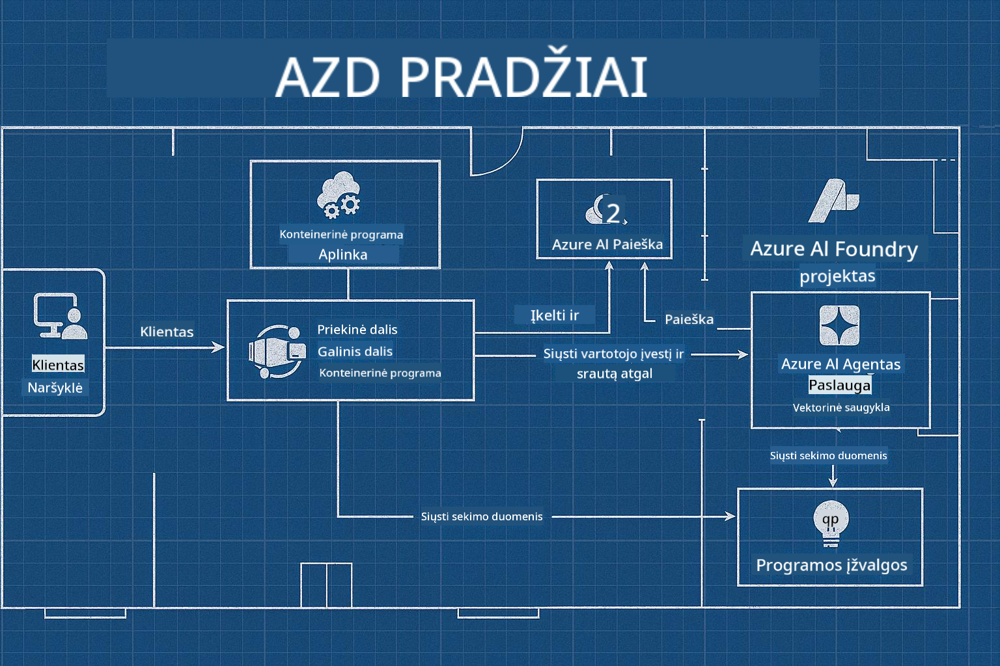

<!--
CO_OP_TRANSLATOR_METADATA:
{
  "original_hash": "245d24997bbcf2bae93bb2a503845d37",
  "translation_date": "2025-09-23T12:11:39+00:00",
  "source_file": "workshop/README.md",
  "language_code": "lt"
}
-->
# AZD dirbtinio intelekto kūrėjų dirbtuvės

## AZD šablonai

Kuriant įmonės lygio dirbtinio intelekto sprendimą pagal jūsų specifinį scenarijų, tai labai panašu į savo namo statybą. Galite jį suprojektuoti patys, statyti plyta po plytos ir prisiimti atsakomybę už tai, kad jis atitiktų visus valdymo ir kūrimo reikalavimus.

**ARBA ....**

Galite dirbti su architektu, kuris pateiks jums _brėžinį_ pradiniam namui, o tada padės jį _pritaikyti_ pagal jūsų poreikius. Tai leidžia jums susitelkti ties tuo, kas daro **jūsų namus** ypatingus, o pagrindinę elektros instaliaciją, vandentiekį ir kitas priklausomybes pasirūpins ekspertai.

**Tai yra [AI App Templates](https://ai.azure.com/templates)** idėja – serija brėžinių, skirtų kurti įvairių tipų dirbtinio intelekto „namus“, priklausomai nuo jūsų pagrindinių poreikių ir priklausomybių.

## Šablonų pritaikymas

Šablonai sukurti darbui su [Azure AI Foundry](https://ai.azure.com). Galvokite apie šią platformą kaip apie „statybos rangovą“, turintį visus išteklius, įrankius ir ekspertizę, reikalingą darbui atlikti!

Viskas, ką jums reikia padaryti, tai pasirinkti [pradinius šablonus](https://learn.microsoft.com/en-us/azure/ai-foundry/how-to/develop/ai-template-get-started). Pavyzdžiui, mes susitelksime į _Get Started with AI Agents_ šabloną, kad sukurtume „Agentinį DI namą“, kuris jau turi funkcijas, tokias kaip DI paieška, Red Teaming, vertinimai, sekimas, stebėjimas ir dar daugiau!



Viskas, ko jums reikia, tai rezervuoti laiką su architektu, kuris padės jums pritaikyti šabloną. [GitHub Copilot for Azure](https://learn.microsoft.com/en-us/azure/developer/github-copilot-azure/get-started) gali būti jūsų gidas. Tiesiog „pasikalbėkite su juo“, kad:

- Sužinotumėte apie Azure funkcijas jūsų šablone
- Diegtumėte Azure išteklius
- Gautumėte informaciją apie savo diegimą
- Diagnozuotumėte ir spręstumėte problemas!

Šiose dirbtuvėse mes išmoksime _išskaidyti_ esamą šabloną (kad suprastume, ką jis siūlo), tada _pritaikyti_ jį (kad atitiktų mūsų reikalavimus) – žingsnis po žingsnio.

DI šablonai **padaro tai veikiančiu** – baigę dirbtuves išmoksite **padaryti tai savo**.

----

**Dirbtuvių navigacija**
- **📚 Kurso pradžia**: [AZD pradedantiesiems](../README.md)
- **📖 Susiję skyriai**: Apima [1 skyrių](../README.md#-chapter-1-foundation--quick-start), [2 skyrių](../README.md#-chapter-2-ai-first-development-recommended-for-ai-developers) ir [5 skyrių](../README.md#-chapter-5-multi-agent-ai-solutions-advanced)
- **🛠️ Praktinis darbas**: [DI dirbtuvių laboratorija](../docs/ai-foundry/ai-workshop-lab.md)
- **🚀 Kiti žingsniai**: [Dirbtuvių laboratorijos moduliai](../../../workshop)

Sveiki atvykę į praktines dirbtuves, skirtas mokytis Azure Developer CLI (AZD), akcentuojant DI programų diegimą. Šios dirbtuvės sukurtos tam, kad nuo AZD pagrindų pereitumėte prie gamybai paruoštų DI sprendimų diegimo.

## Dirbtuvių apžvalga

**Trukmė:** 2-3 valandos  
**Lygis:** Pradedantysis iki vidutinio  
**Būtinos žinios:** Pagrindinės Azure, komandų eilutės įrankių ir DI koncepcijų žinios

### Ką išmoksite

- **AZD pagrindai**: Suprasti infrastruktūrą kaip kodą naudojant AZD
- 🤖 **DI paslaugų integracija**: Diegti Azure OpenAI, DI paiešką ir kitas DI paslaugas
- **Konteinerių diegimas**: Naudoti Azure Container Apps DI programoms
- **Saugumo geriausios praktikos**: Įgyvendinti valdomą tapatybę ir saugias konfigūracijas
- **Stebėjimas ir stebimumas**: Nustatyti Application Insights DI darbo krūviams
- **Gamybos modeliai**: Įmonės lygio diegimo strategijos

## Dirbtuvių struktūra

### 1 modulis: AZD pagrindai (30 minučių)
- AZD diegimas ir konfigūravimas
- AZD projekto struktūros supratimas
- Pirmasis AZD diegimas
- **Laboratorija**: Paprastos interneto programos diegimas

### 2 modulis: Azure OpenAI integracija (45 minutės)
- Azure OpenAI išteklių nustatymas
- Modelio diegimo strategijos
- API prieigos ir autentifikacijos konfigūravimas
- **Laboratorija**: Pokalbių programos diegimas su GPT-4

### 3 modulis: RAG programos (45 minutės)
- Azure DI paieškos integracija
- Dokumentų apdorojimas su Azure Document Intelligence
- Vektoriniai įterpimai ir semantinė paieška
- **Laboratorija**: Dokumentų klausimų ir atsakymų sistemos kūrimas

### 4 modulis: Gamybos diegimas (30 minučių)
- Konteinerių programų konfigūravimas
- Skalavimas ir našumo optimizavimas
- Stebėjimas ir registravimas
- **Laboratorija**: Diegimas gamybai su stebimumu

### 5 modulis: Pažangūs modeliai (15 minučių)
- Diegimas keliuose aplinkose
- CI/CD integracija
- Kaštų optimizavimo strategijos
- **Apibendrinimas**: Gamybos pasirengimo kontrolinis sąrašas

## Būtinos sąlygos

### Reikalingi įrankiai

Prieš dirbtuves įdiekite šiuos įrankius:

```bash
# Azure Developer CLI
curl -fsSL https://aka.ms/install-azd.sh | bash

# Azure CLI
curl -sL https://aka.ms/InstallAzureCLIDeb | sudo bash

# Git
sudo apt-get install git

# Docker
curl -fsSL https://get.docker.com -o get-docker.sh
sudo sh get-docker.sh

# Python 3.10+
sudo apt-get install python3.10 python3.10-venv python3-pip
```

### Azure paskyros nustatymas

1. **Azure prenumerata**: [Registruokitės nemokamai](https://azure.microsoft.com/free/)
2. **Azure OpenAI prieiga**: [Prašyti prieigos](https://aka.ms/oai/access)
3. **Reikalingi leidimai**:
   - Prenumeratos arba išteklių grupės „Contributor“ rolė
   - „User Access Administrator“ (RBAC priskyrimams)

### Patikrinkite būtinas sąlygas

Paleiskite šį scenarijų, kad patikrintumėte savo nustatymus:

```bash
#!/bin/bash
echo "Verifying workshop prerequisites..."

# Check AZD installation
if command -v azd &> /dev/null; then
    echo "✅ Azure Developer CLI: $(azd --version)"
else
    echo "❌ Azure Developer CLI not found"
fi

# Check Azure CLI
if command -v az &> /dev/null; then
    echo "✅ Azure CLI: $(az --version | head -n1)"
else
    echo "❌ Azure CLI not found"
fi

# Check Docker
if command -v docker &> /dev/null; then
    echo "✅ Docker: $(docker --version)"
else
    echo "❌ Docker not found"
fi

# Check Python
if command -v python3 &> /dev/null; then
    echo "✅ Python: $(python3 --version)"
else
    echo "❌ Python 3 not found"
fi

# Check Azure login
if az account show &> /dev/null; then
    echo "✅ Azure: Logged in as $(az account show --query user.name -o tsv)"
else
    echo "❌ Azure: Not logged in (run 'az login')"
fi

echo "Setup verification complete!"
```

## Dirbtuvių medžiaga

### Laboratoriniai pratimai

Kiekvienas modulis apima praktines laboratorijas su pradiniu kodu ir žingsnis po žingsnio instrukcijomis:

- **[lab-1-azd-basics/](../../../workshop/lab-1-azd-basics)** - Pirmasis AZD diegimas
- **[lab-2-openai-chat/](../../../workshop/lab-2-openai-chat)** - Pokalbių programa su Azure OpenAI
- **[lab-3-rag-search/](../../../workshop/lab-3-rag-search)** - RAG programa su DI paieška
- **[lab-4-production/](../../../workshop/lab-4-production)** - Gamybos diegimo modeliai
- **[lab-5-advanced/](../../../workshop/lab-5-advanced)** - Pažangūs diegimo scenarijai

### Nuorodų medžiaga

- **[DI Foundry integracijos vadovas](../docs/ai-foundry/azure-ai-foundry-integration.md)** - Išsamūs integracijos modeliai
- **[DI modelio diegimo vadovas](../docs/ai-foundry/ai-model-deployment.md)** - Modelio diegimo geriausios praktikos
- **[Gamybos DI praktikos](../docs/ai-foundry/production-ai-practices.md)** - Įmonės diegimo modeliai
- **[DI trikčių šalinimo vadovas](../docs/troubleshooting/ai-troubleshooting.md)** - Dažniausios problemos ir sprendimai

### Pavyzdiniai šablonai

Greito starto šablonai dažniems DI scenarijams:

```
workshop/templates/
├── minimal-chat/          # Basic OpenAI chat app
├── rag-application/       # RAG with AI Search
├── multi-model/          # Multiple AI services
└── production-ready/     # Enterprise template
```

## Pradžia

### 1 variantas: GitHub Codespaces (rekomenduojama)

Greitas būdas pradėti dirbtuves:

[](https://github.com/codespaces/new?hide_repo_select=true&ref=main&repo=YOUR_REPO_ID)

### 2 variantas: Vietinis kūrimas

1. **Klonuokite dirbtuvių saugyklą:**
```bash
git clone https://github.com/YOUR_ORG/AZD-for-beginners.git
cd AZD-for-beginners/workshop
```

2. **Prisijunkite prie Azure:**
```bash
az login
azd auth login
```

3. **Pradėkite nuo 1 laboratorijos:**
```bash
cd lab-1-azd-basics
cat README.md  # Follow the instructions
```

### 3 variantas: Instruktoriaus vedamos dirbtuvės

Jei dalyvaujate instruktoriaus vedamame užsiėmime:

- 🎥 **Dirbtuvių įrašas**: [Prieinamas pagal poreikį](https://aka.ms/azd-ai-workshop)
- 💬 **Discord bendruomenė**: [Prisijunkite gyvai pagalbai](https://aka.ms/foundry/discord)
- **Dirbtuvių atsiliepimai**: [Pasidalinkite savo patirtimi](https://aka.ms/azd-workshop-feedback)

## Dirbtuvių tvarkaraštis

### Savarankiškas mokymasis (3 valandos)

```
⏰ 00:00 - 00:30  Module 1: AZD Foundations
⏰ 00:30 - 01:15  Module 2: Azure OpenAI Integration
⏰ 01:15 - 02:00  Module 3: RAG Applications
⏰ 02:00 - 02:30  Module 4: Production Deployment
⏰ 02:30 - 02:45  Module 5: Advanced Patterns
⏰ 02:45 - 03:00  Q&A and Next Steps
```

### Instruktoriaus vedamas užsiėmimas (2,5 valandos)

```
⏰ 00:00 - 00:15  Welcome & Prerequisites Check
⏰ 00:15 - 00:40  Module 1: Live Demo + Lab
⏰ 00:40 - 01:20  Module 2: OpenAI Integration
⏰ 01:20 - 01:30  Break
⏰ 01:30 - 02:10  Module 3: RAG Applications
⏰ 02:10 - 02:30  Module 4: Production Patterns
⏰ 02:30 - 02:45  Module 5: Advanced Topics
⏰ 02:45 - 03:00  Q&A and Resources
```

## Sėkmės kriterijai

Baigę šias dirbtuves, galėsite:

✅ **Diegti DI programas** naudodami AZD šablonus  
✅ **Konfigūruoti Azure OpenAI** paslaugas su tinkamu saugumu  
✅ **Kurti RAG programas** su Azure DI paieškos integracija  
✅ **Įgyvendinti gamybos modelius** įmonės DI darbo krūviams  
✅ **Stebėti ir šalinti problemas** DI programų diegimuose  
✅ **Taikyti kaštų optimizavimo** strategijas DI darbo krūviams  

## Bendruomenė ir pagalba

### Dirbtuvių metu

- 🙋 **Klausimai**: Naudokite dirbtuvių pokalbį arba pakelkite ranką
- 🐛 **Problemos**: Peržiūrėkite [trikčių šalinimo vadovą](../docs/troubleshooting/ai-troubleshooting.md)
- **Patarimai**: Dalinkitės atradimais su kitais dalyviais

### Po dirbtuvių

- 💬 **Discord**: [Azure DI Foundry bendruomenė](https://aka.ms/foundry/discord)
- **GitHub problemos**: [Pranešti apie šablonų problemas](https://github.com/YOUR_ORG/AZD-for-beginners/issues)
- 📧 **Atsiliepimai**: [Dirbtuvių vertinimo forma](https://aka.ms/azd-workshop-feedback)

## Kiti žingsniai

### Tęskite mokymąsi

1. **Pažangūs scenarijai**: Tyrinėkite [diegimą keliuose regionuose](../docs/ai-foundry/production-ai-practices.md#multi-region-deployment)
2. **CI/CD integracija**: Nustatykite [GitHub Actions darbo eigas](../docs/deployment/github-actions.md)
3. **Individualūs šablonai**: Kurkite savo [AZD šablonus](../docs/getting-started/custom-templates.md)

### Taikykite savo projektuose

1. **Vertinimas**: Naudokite mūsų [pasirengimo kontrolinį sąrašą](./production-readiness-checklist.md)
2. **Šablonai**: Pradėkite nuo mūsų [DI specifinių šablonų](../../../workshop/templates)
3. **Pagalba**: Prisijunkite prie [Azure DI Foundry Discord](https://aka.ms/foundry/discord)

### Pasidalinkite savo sėkme

- ⭐ **Pažymėkite saugyklą**, jei šios dirbtuvės jums padėjo
- 🐦 **Dalinkitės socialiniuose tinkluose** su #AzureDeveloperCLI #AzureAI
- 📝 **Parašykite tinklaraščio įrašą** apie savo DI diegimo kelionę

---

## Dirbtuvių atsiliepimai

Jūsų atsiliepimai padeda mums tobulinti dirbtuvių patirtį:

| Aspektas | Įvertinimas (1-5) | Komentarai |
|----------|-------------------|------------|
| Turinys | ⭐⭐⭐⭐⭐ | |
| Praktinės laboratorijos | ⭐⭐⭐⭐⭐ | |
| Dokumentacija | ⭐⭐⭐⭐⭐ | |
| Sudėtingumo lygis | ⭐⭐⭐⭐⭐ | |
| Bendra patirtis | ⭐⭐⭐⭐⭐ | |

**Pateikti atsiliepimus**: [Dirbtuvių vertinimo forma](https://aka.ms/azd-workshop-feedback)

---

**Ankstesnis:** [DI trikčių šalinimo vadovas](../docs/troubleshooting/ai-troubleshooting.md) | **Kitas:** Pradėkite nuo [1 laboratorijos: AZD pagrindai](../../../workshop/lab-1-azd-basics)

**Pasiruošę pradėti kurti DI programas su AZD?**

[Pradėkite 1 laboratoriją: AZD pagrindai →](./lab-1-azd-basics/README.md)

---

