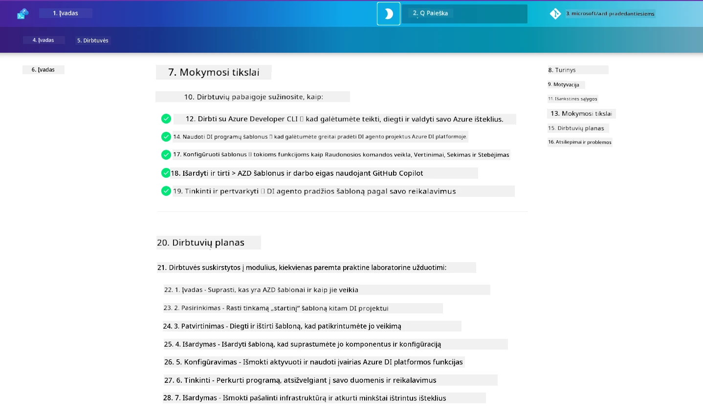

<div align="center">
  <div style="background: linear-gradient(135deg, #0078d4, #106ebe); border-radius: 10px; padding: 20px; margin: 20px 0; box-shadow: 0 4px 15px rgba(0, 120, 212, 0.3); border: 2px solid #005a9e;">
    <h2 style="color: white; margin: 0; font-size: 24px; text-shadow: 1px 1px 2px rgba(0,0,0,0.3);">
      🎯 AZD dirbtuvės DI kūrėjams
    </h2>
    <p style="color: white; margin: 10px 0 0 0; font-size: 16px; text-shadow: 1px 1px 2px rgba(0,0,0,0.3);">
      <strong>Praktinės dirbtuvės, skirtos kurti DI programas naudojant Azure Developer CLI.</strong><br>
      Įveikite 7 modulius, kad įvaldytumėte AZD šablonus ir DI diegimo darbo eigas.
    </p>
    <div style="margin-top: 15px;">
      <span style="background: rgba(255,255,255,0.2); padding: 5px 10px; border-radius: 15px; color: white; font-size: 14px;">
        📅 Paskutinį kartą atnaujinta: 2026 m. vasaris
      </span>
    </div>
  </div>
</div>

# AZD dirbtuvės DI kūrėjams

Sveiki atvykę į praktines dirbtuves, skirtas mokytis Azure Developer CLI (AZD) su orientacija į DI programų diegimą. Šios dirbtuvės padės įgyti praktinį supratimą apie AZD šablonus per 3 žingsnius:

1. **Discovery** - suraskite jums tinkamą šabloną.
1. **Deployment** - išdėstykite ir patikrinkite, kad veikia
1. **Customization** - modifikuokite ir iteruokite, kad taptų jūsų!

Per šias dirbtuves taip pat susipažinsite su pagrindiniais kūrėjo įrankiais ir darbo eigomis, padedančiomis supaprastinti jūsų viso proceso kūrimo kelią.

<br/>

## Naršyklėje veikiantis vadovas

Dirbtuvių pamokos yra Markdown formatu. Galite naršyti jas tiesiogiai GitHub - arba paleisti naršyklėje veikiančią peržiūrą, kaip parodyta žemiau esančioje ekrano nuotraukoje.



Norėdami naudoti šią parinktį - forkinkite saugojimo vietą į savo profilį ir paleiskite GitHub Codespaces. Kai VS Code terminalas bus aktyvus, įveskite šią komandą:

```bash title="" linenums="0"
mkdocs serve > /dev/null 2>&1 &
```

Po kelių sekundžių pamatysite iššokantį dialogo langą. Pasirinkite parinktį `Atidaryti naršyklėje`. Naršyklėje veikiantis vadovas atsidarys naujame skirtuke. Kai kurios šios peržiūros naudos:

1. **Built-in search** - greitai raskite raktinius žodžius ar pamokas.
1. **Copy icon** - užveskite pelę ant kodo blokų, kad pamatytumėte šią parinktį
1. **Theme toggle** - perjungti tarp tamsios ir šviesios temos
1. **Get help** - spustelėkite Discord piktogramą apačioje, kad prisijungtumėte!

<br/>

## Dirbtuvių apžvalga

**Trukmė:** 3-4 valandos  
**Lygis:** Nuo pradedančiojo iki vidutinio lygio  
**Išankstiniai reikalavimai:** Susipažinimas su Azure, DI sąvokomis, VS Code ir komandine eilute.

Tai praktinės dirbtuvės, kuriose mokotės atlikdami užduotis. Baigę pratimus, rekomenduojame peržiūrėti AZD For Beginners kursą, kad tęstumėte mokymąsi apie saugumo ir produktyvumo gerąsias praktikas.

| Time| Module  | Objective |
|:---|:---|:---|
| 15 mins | [Įvadas](docs/instructions/0-Introduction.md) | Nustatykite pradžią, supraskite tikslus |
| 30 mins | [Pasirinkti DI šabloną](docs/instructions/1-Select-AI-Template.md) | Išnagrinėkite galimybes ir pasirinkite pradžios tašką | 
| 30 mins | [Patikrinti DI šabloną](docs/instructions/2-Validate-AI-Template.md) | Išdėstykite numatytą sprendimą Azure |
| 30 mins | [Išardyti DI šabloną](docs/instructions/3-Deconstruct-AI-Template.md) | Išnagrinėkite struktūrą ir konfigūraciją |
| 30 mins | [Konfigūruoti DI šabloną](docs/instructions/4-Configure-AI-Template.md) | Aktyvuokite ir išbandykite turimas funkcijas |
| 30 mins | [Pritaikyti DI šabloną](docs/instructions/5-Customize-AI-Template.md) | Adaptuokite šabloną savo poreikiams |
| 30 mins | [Išardyti infrastruktūrą](docs/instructions/6-Teardown-Infrastructure.md) | Išvalykite ir atlaisvinkite išteklius |
| 15 mins | [Apibendrinimas ir tolesni žingsniai](docs/instructions/7-Wrap-up.md) | Mokymosi ištekliai, dirbtuvių iššūkis |

<br/>

## Ko išmoksite

Mąstykite apie AZD šabloną kaip mokymosi smėlio dėžę, kurioje galite išbandyti įvairias galimybes ir įrankius pilno kūrimo proceso metu Microsoft Foundry aplinkoje. Baigę šias dirbtuves, turėsite intuicinį supratimą apie įvairius įrankius ir koncepcijas šiame kontekste.

| Concept  | Objective |
|:---|:---|
| **Azure Developer CLI** | Suprasti įrankio komandas ir darbo eigas|
| **AZD Templates**| Suprasti projekto struktūrą ir konfigūraciją|
| **Azure AI Agent**| Paruošti ir išdiegti Microsoft Foundry projektą  |
| **Azure AI Search**| Įgalinti kontekstinę inžineriją su agentais |
| **Observability**| Išnagrinėti sekimą, monitoriavimą ir vertinimus |
| **Red Teaming**| Išnagrinėti priešišką testavimą ir mitigacijas |

<br/>

## Dirbtuvių struktūra

Dirbtuvės struktūruotos taip, kad nuvestų jus nuo šablono paieškos iki diegimo, išardymo ir pritaikymo - naudojant oficialų [Getting Started with AI Agents](https://github.com/Azure-Samples/get-started-with-ai-agents) pradžios šabloną kaip pagrindą.

### [Modulis 1: Pasirinkti DI šabloną](docs/instructions/1-Select-AI-Template.md) (30 mins)

- Kas yra DI šablonai?
- Kur galiu rasti DI šablonus?
- Kaip pradėti kurti DI agentus?
- **Laboratorija**: Greitas startas su GitHub Codespaces

### [Modulis 2: Patikrinti DI šabloną](docs/instructions/2-Validate-AI-Template.md) (30 mins)

- Kokios yra DI šablono architektūra?
- Kas yra AZD kūrimo darbo eiga?
- Kaip gauti pagalbą su AZD kūrimu?
- **Laboratorija**: Išdėstymas ir patikrinimas AI Agents šablono

### [Modulis 3: Išardyti DI šabloną](docs/instructions/3-Deconstruct-AI-Template.md) (30 mins)

- Išnagrinėkite savo aplinką `.azure/` 
- Išnagrinėkite savo išteklių nustatymus `infra/` 
- Išnagrinėkite savo AZD konfigūraciją `azure.yaml`s
- **Laboratorija**: Modifikuokite aplinkos kintamuosius ir pakartotinai išdėstykite

### [Modulis 4: Konfigūruoti DI šabloną](docs/instructions/4-Configure-AI-Template.md) (30 mins)
- Išnagrinėkite: Retrieval Augmented Generation
- Išnagrinėkite: Agentų vertinimą ir Red Teaming
- Išnagrinėkite: sekimą ir monitoriavimą
- **Laboratorija**: Išnagrinėkite DI agentą + Observability 

### [Modulis 5: Pritaikyti DI šabloną](docs/instructions/5-Customize-AI-Template.md) (30 mins)
- Nustatykite: PRD su scenarijaus reikalavimais
- Konfigūruokite: aplinkos kintamuosius AZD
- Įgyvendinkite: gyvenimo ciklo kablius papildomoms užduotims
- **Laboratorija**: Pritaikykite šabloną savo scenarijui

### [Modulis 6: Išardyti infrastruktūrą](docs/instructions/6-Teardown-Infrastructure.md) (30 mins)
- Apžvalga: Kas yra AZD šablonai?
- Apžvalga: Kodėl naudoti Azure Developer CLI?
- Kiti žingsniai: Išbandykite kitą šabloną!
- **Laboratorija**: Atjungti infrastruktūrą ir išvalyti

<br/>

## Dirbtuvių iššūkis

Norite sau užduoti iššūkį ir padaryti daugiau? Štai keletas projekto pasiūlymų - arba pasidalykite savo idėjomis su mumis!!

| Project | Description |
|:---|:---|
|1. **Išardyti sudėtingą DI šabloną** | Naudokite mūsų aprašytą darbo eigą ir įrankius ir pažiūrėkite, ar galite išdėstyti, patikrinti ir pritaikyti kitą DI sprendimo šabloną. _Ką sužinojote?_|
|2. **Pritaikyti pagal savo scenarijų**  | Pabandykite parašyti PRD (Produkto reikalavimų dokumentą) kitam scenarijui. Tada naudokite GitHub Copilot savo šablono repozitorijoje Agent Model - ir paprašykite jo sugeneruoti pritaikymo darbo eigą. _Ką sužinojote? Kaip galėtumėte patobulinti šiuos pasiūlymus?_|
| | |

## Turite atsiliepimų?

1. Paskelbkite issue šiame repozitorijoje - pažymėkite jį `Workshop` patogumui.
1. Prisijunkite prie Microsoft Foundry Discord - susisiekite su kolegomis!


| | | 
|:---|:---|
| **📚 Kurso pradžia**| [AZD For Beginners](../README.md)|
| **📖 Dokumentacija** | [Get started with AI templates](https://learn.microsoft.com/en-us/azure/ai-foundry/how-to/develop/ai-template-get-started)|
| **🛠️DI šablonai** | [Microsoft Foundry Templates](https://ai.azure.com/templates) |
|**🚀 Kiti žingsniai** | [Pradėti dirbtuves](../../../workshop) |
| | |

<br/>

---

**Navigacija:** [Pagrindinis kursas](../README.md) | [Įvadas](docs/instructions/0-Introduction.md) | [Modulis 1: Pasirinkti šabloną](docs/instructions/1-Select-AI-Template.md)

**Pasiruošę pradėti kurti DI programas su AZD?**

[Pradėti dirbtuves: Įvadas →](docs/instructions/0-Introduction.md)

---

<!-- CO-OP TRANSLATOR DISCLAIMER START -->
Atsakomybės apribojimas:
Šis dokumentas buvo išverstas naudojant dirbtinio intelekto vertimo paslaugą [Co-op Translator](https://github.com/Azure/co-op-translator). Nors siekiame tikslumo, atkreipkite dėmesį, kad automatiniai vertimai gali turėti klaidų arba netikslumų. Originalų dokumentą originalioje kalboje reikėtų laikyti autoritetingu šaltiniu. Jei informacija yra kritinė, rekomenduojama pasitelkti profesionalų žmogaus vertėją. Mes neatsakome už jokius nesusipratimus ar neteisingas interpretacijas, kylančias dėl šio vertimo naudojimo.
<!-- CO-OP TRANSLATOR DISCLAIMER END -->