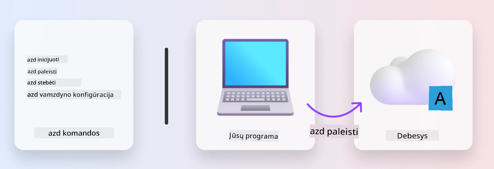
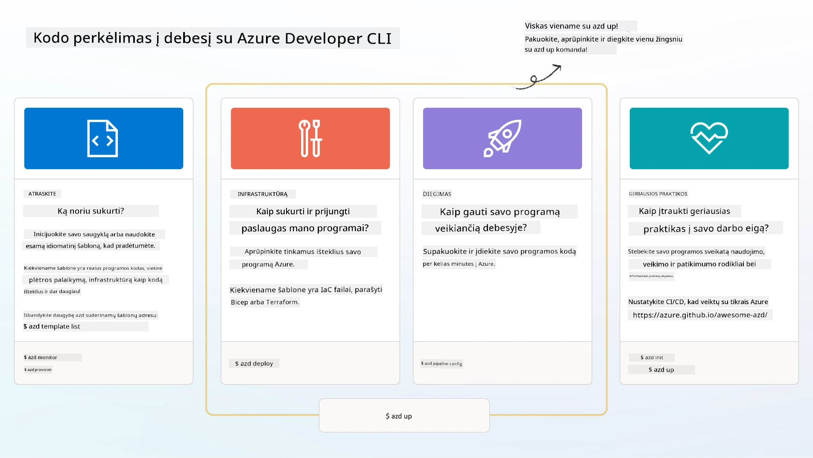

<!--
CO_OP_TRANSLATOR_METADATA:
{
  "original_hash": "06d6207eff634aefcaa41739490a5324",
  "translation_date": "2025-09-25T02:01:28+00:00",
  "source_file": "workshop/docs/instructions/1-Select-AI-Template.md",
  "language_code": "lt"
}
-->
# 1. Pasirinkite šabloną

!!! tipas "IKI ŠIO MODULIO PABAIGOS JŪS GALĖSITE"

    - [ ] Apibūdinti, kas yra AZD šablonai
    - [ ] Atrasti ir naudoti AZD šablonus dirbtiniam intelektui
    - [ ] Pradėti naudotis AI Agents šablonu
    - [ ] **Laboratorija 1:** AZD greitas startas su GitHub Codespaces

---

## 1. Statytojo analogija

Sukurti modernią, įmonės poreikius atitinkančią dirbtinio intelekto programą _nuo nulio_ gali būti sudėtinga. Tai šiek tiek primena naujo namo statymą savarankiškai, plyta po plytos. Taip, tai įmanoma! Bet tai nėra pats efektyviausias būdas pasiekti norimą rezultatą!

Vietoj to, dažnai pradedame nuo esamo _projektavimo plano_ ir dirbame su architektu, kad pritaikytume jį savo asmeniniams poreikiams. Būtent tokį požiūrį verta taikyti kuriant intelektualias programas. Pirmiausia, suraskite tinkamą projektavimo architektūrą, kuri atitinka jūsų problemos sritį. Tada dirbkite su sprendimų architektu, kad pritaikytumėte ir sukurtumėte sprendimą pagal savo specifinį scenarijų.

Bet kur rasti šiuos projektavimo planus? Ir kaip rasti architektą, kuris norėtų išmokyti mus, kaip pritaikyti ir įdiegti šiuos planus savarankiškai? Šiame seminare atsakysime į šiuos klausimus, pristatydami tris technologijas:

1. [Azure Developer CLI](https://aka.ms/azd) - atvirojo kodo įrankis, kuris pagreitina kūrėjo kelią nuo vietinio kūrimo (build) iki debesų diegimo (ship).
1. [Azure AI Foundry Templates](https://ai.azure.com/templates) - standartizuoti atvirojo kodo saugyklos, kuriose yra pavyzdinis kodas, infrastruktūra ir konfigūracijos failai AI sprendimų architektūrai diegti.
1. [GitHub Copilot Agent Mode](https://code.visualstudio.com/docs/copilot/chat/chat-agent-mode) - kodavimo agentas, pagrįstas Azure žiniomis, kuris gali padėti naršyti kodų bazėje ir atlikti pakeitimus naudojant natūralią kalbą.

Turėdami šiuos įrankius, galime _atrasti_ tinkamą šabloną, _įdiegti_ jį, kad patikrintume, ar jis veikia, ir _pritaikyti_ jį savo specifiniams scenarijams. Pasinerkime ir sužinokime, kaip tai veikia.

---

## 2. Azure Developer CLI

[Azure Developer CLI](https://learn.microsoft.com/en-us/azure/developer/azure-developer-cli/) (arba `azd`) yra atvirojo kodo komandų eilutės įrankis, kuris gali pagreitinti jūsų kelią nuo kodo iki debesų, siūlydamas kūrėjui patogias komandas, kurios nuosekliai veikia tiek jūsų IDE (kūrimo), tiek CI/CD (devops) aplinkose.

Naudojant `azd`, jūsų diegimo procesas gali būti toks paprastas:

- `azd init` - Inicializuoja naują AI projektą iš esamo AZD šablono.
- `azd up` - Vienu žingsniu sukuria infrastruktūrą ir įdiegia jūsų programą.
- `azd monitor` - Gaukite realaus laiko stebėjimo ir diagnostikos duomenis apie įdiegtą programą.
- `azd pipeline config` - Nustatykite CI/CD procesus, kad automatizuotumėte diegimą į Azure.

**🎯 | PRATIMAS**: <br/> Išbandykite `azd` komandų eilutės įrankį savo GitHub Codespaces aplinkoje dabar. Pradėkite įvesdami šią komandą, kad pamatytumėte, ką įrankis gali atlikti:

```bash title="" linenums="0"
azd help
```



---

## 3. AZD šablonas

Kad `azd` galėtų tai pasiekti, jam reikia žinoti, kokią infrastruktūrą sukurti, kokius konfigūracijos nustatymus taikyti ir kokią programą įdiegti. Čia pasitarnauja [AZD šablonai](https://learn.microsoft.com/en-us/azure/developer/azure-developer-cli/azd-templates?tabs=csharp).

AZD šablonai yra atvirojo kodo saugyklos, kurios sujungia pavyzdinį kodą su infrastruktūros ir konfigūracijos failais, reikalingais sprendimų architektūrai diegti. Naudojant _Infrastruktūra kaip kodas_ (IaC) metodą, šablonų resursų apibrėžimai ir konfigūracijos nustatymai gali būti valdomi versijomis (kaip ir programos šaltinio kodas), sukuriant pakartotinai naudojamus ir nuoseklius darbo procesus tarp projekto naudotojų.

Kuriant arba naudojant AZD šabloną _savo_ scenarijui, apsvarstykite šiuos klausimus:

1. Ką jūs kuriate? → Ar yra šablonas, turintis pradinį kodą tam scenarijui?
1. Kaip jūsų sprendimas yra suprojektuotas? → Ar yra šablonas, turintis reikalingus resursus?
1. Kaip jūsų sprendimas yra diegiamas? → Pagalvokite apie `azd deploy` su išankstinio/pokonfigūracijos veiksmais!
1. Kaip galite jį dar labiau optimizuoti? → Pagalvokite apie integruotą stebėjimą ir automatizavimo procesus!

**🎯 | PRATIMAS**: <br/> 
Apsilankykite [Awesome AZD](https://azure.github.io/awesome-azd/) galerijoje ir naudokite filtrus, kad peržiūrėtumėte daugiau nei 250 šiuo metu prieinamų šablonų. Pažiūrėkite, ar galite rasti tokį, kuris atitinka _jūsų_ scenarijaus reikalavimus.



---

## 4. AI programų šablonai

---

