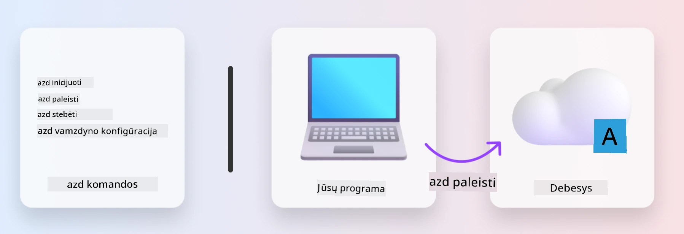
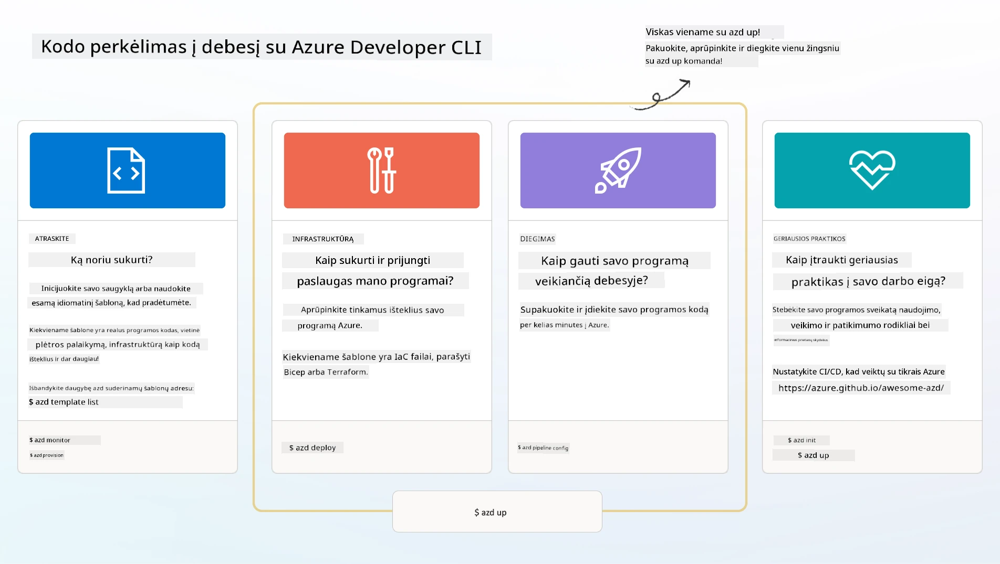

# 1. Pasirinkite šabloną

!!! tip "PABAIGOJE ŠIO MODULIO JŪS GALĖSITE"

    - [ ] Apibūdinti, kas yra AZD šablonai
    - [ ] Atrasti ir naudoti AZD šablonus AI
    - [ ] Pradėti darbą su AI Agents šablonu
    - [ ] **Laboratorija 1:** AZD greitas startas Codespaces arba dev konteineryje

---

## 1. Statytojo analogija

Kurti modernią, įmonėms paruoštą AI programą _nuo nulio_ gali būti bauginanti užduotis. Tai šiek tiek panašu į naujų namų statybą savarankiškai, plyta po plytos. Taip, tai įmanoma! Tačiau tai nėra efektyviausias būdas pasiekti norimą rezultatą!

Vietoje to dažnai pradedame nuo esamo _dizaino plano_ ir dirbame su architektu, kad pritaikytume jį savo poreikiams. Būtent tokį požiūrį verta taikyti kuriant intelektualias programas. Pirmiausia raskite tinkamą architektūrinį sprendimą, atitinkantį jūsų problemos sritį. Tada bendradarbiaukite su sprendimų architektu, kad pritaikytumėte ir išvystytumėte sprendimą konkrečiam scenarijui.

Bet kur galime rasti šiuos dizaino planus? Ir kaip rasti architektą, pasiruošusį išmokyti mus, kaip patiems pritaikyti ir diegti šiuos planus? Šiame užsiėmime atsakome į šiuos klausimus pristatydami jums tris technologijas:

1. [Azure Developer CLI](https://aka.ms/azd) - atviro kodo įrankis, kuris pagreitina kūrėjų kelią nuo vietinio kūrimo (build) iki debesų diegimo (ship).
1. [Microsoft Foundry Templates](https://ai.azure.com/templates) - standartizuotos atvirojo kodo saugyklos, kuriose yra pavyzdinis kodas, infrastruktūra ir konfigūracijos failai AI sprendimo architektūros diegimui.
1. [GitHub Copilot Agent Mode](https://code.visualstudio.com/docs/copilot/chat/chat-agent-mode) - programavimo agentas, paremtas Azure žiniomis, kuris gali nukreipti mus naršant kodo bazę ir atliekant pakeitimus – naudojant natūralią kalbą.

Su šiomis priemonėmis galime _atrasti_ tinkamą šabloną, jį _įdiegti_, kad patvirtintume, jog jis veikia, ir _pritaikyti_ jį prie savo specifinių scenarijų. Panagrinėkime, kaip tai veikia.

---

## 2. Azure Developer CLI

[Azure Developer CLI](https://learn.microsoft.com/en-us/azure/developer/azure-developer-cli/) (arba `azd`) yra atviro kodo komandinės eilutės įrankis, kuris gali pagreitinti jūsų kelionę nuo kodo iki debesies su rinkiniu draugiškų kūrėjui komandų, kurios veikia nuosekliai jūsų IDE (kūrimo) ir CI/CD (devops) aplinkose.

Su `azd` jūsų diegimo kelias gali būti toks paprastas:

- `azd init` - Inicializuoja naują AI projektą iš esamo AZD šablono.
- `azd up` - Sukuria infrastruktūrą ir diegia jūsų programą vienu žingsniu.
- `azd monitor` - Gaukite realaus laiko stebėjimą ir diagnostiką jūsų įdiegtai programai.
- `azd pipeline config` - Nustato CI/CD vamzdynus (pipelines), kad automatizuotų diegimą į Azure.

**🎯 | UŽDUOTIS**: <br/> Išbandykite `azd` komandinės eilutės įrankį jūsų dabartinėje darbo aplinkoje. Tai gali būti GitHub Codespaces, dev container arba vietinė kloninė kopija su įdiegtomis priklausomybėmis. Pradėkite įvesdami šią komandą, kad pamatytumėte, ką įrankis gali:

```bash title="" linenums="0"
azd help
```



---

## 3. AZD šablonas

Tam, kad `azd` tai pasiektų, jam reikia žinoti, kokią infrastruktūrą teikti, kokius konfigūracijos nustatymus taikyti ir kurią programą diegti. Čia įsijungia [AZD šablonai](https://learn.microsoft.com/en-us/azure/developer/azure-developer-cli/azd-templates?tabs=csharp).

AZD šablonai yra atvirojo kodo saugyklos, kurios sujungia pavyzdinį kodą su infrastruktūros ir konfigūracijos failais, reikalingais sprendimo architektūros diegimui.
Naudodami _Infrastructure-as-Code_ (IaC) požiūrį, jie leidžia valdyti šablono resursų apibrėžimus ir konfigūracijos nustatymus per versijų kontrolę (kaip ir programos šaltinio kodą) – sukuriant pakartotinai naudojamus ir nuoseklius darbo procesus projekto naudotojams.

Kuriant arba pernaudojant AZD šabloną _jūsų_ scenarijui, apsvarstykite šiuos klausimus:

1. Ką jūs statote? → Ar yra šablonas, turintis pradinį kodą tam scenarijui?
1. Kaip architektūriškai sukonstruotas jūsų sprendimas? → Ar yra šablonas, turintis reikiamus resursus?
1. Kaip jūsų sprendimas diegiamas? → Pagalvokite apie `azd deploy` su prieš/po apdorojimo kabliukais!
1. Kaip galite tai dar labiau optimizuoti? → Pagalvokite apie įmontuotą stebėjimą ir automatizacijos vamzdynus!

**🎯 | UŽDUOTIS**: <br/> 
Apsilankykite [Awesome AZD](https://azure.github.io/awesome-azd/) galerijoje ir naudokite filtrus, kad ištirtumėte daugiau nei 250 šablonų, kurie šiuo metu prieinami. Pažiūrėkite, ar galite rasti tokį, kuris atitinka _jūsų_ scenarijaus reikalavimus.



---

## 4. AI programų šablonai

AI varomoms programoms Microsoft pateikia specializuotus šablonus, kuriuose yra **Microsoft Foundry** ir **Foundry Agents**. Šie šablonai pagreitina jūsų kelią kuriant intelektualias, gamybai pasirengusias programas.

### Microsoft Foundry ir Foundry Agents šablonai

Pasirinkite žemiau esantį šabloną diegimui. Kiekvienas šablonas yra prieinamas [Awesome AZD](https://azure.github.io/awesome-azd/) ir gali būti inicializuotas viena komanda.

| Šablonas | Aprašymas | Diegimo komanda |
|----------|-------------|----------------|
| **[AI Chat with RAG](https://azure.github.io/awesome-azd/?tags=ai&tags=rag)** | Pokalbių programa su Retrieval Augmented Generation, naudojant Microsoft Foundry | `azd init -t azure-samples/azure-search-openai-demo` |
| **[Foundry Agent Service Starter](https://azure.github.io/awesome-azd/?tags=ai&tags=agents)** | Kurti AI agentus su Foundry Agents autonominiam užduočių vykdymui | `azd init -t azure-samples/foundry-agent-service-starter` |
| **[Multi-Agent Orchestration](https://azure.github.io/awesome-azd/?tags=ai&tags=agents)** | Koordinuoti kelis Foundry Agents sudėtingiems darbo eigoms | `azd init -t azure-samples/multi-agent-orchestration` |
| **[AI Document Intelligence](https://azure.github.io/awesome-azd/?tags=ai&tags=document)** | Išgauti ir analizuoti dokumentus su Microsoft Foundry modeliais | `azd init -t azure-samples/ai-document-processing` |
| **[Conversational AI Bot](https://azure.github.io/awesome-azd/?tags=ai&tags=bot)** | Kurti intelektualius pokalbių robotus su Microsoft Foundry integracija | `azd init -t azure-samples/ai-chat-protocol` |
| **[AI Image Generation](https://azure.github.io/awesome-azd/?tags=ai&tags=dalle)** | Generuoti vaizdus naudojant DALL-E per Microsoft Foundry | `azd init -t azure-samples/ai-image-generation` |
| **[Semantic Kernel Agent](https://azure.github.io/awesome-azd/?tags=ai&tags=semantic-kernel)** | AI agentai naudojant Semantic Kernel su Foundry Agents | `azd init -t azure-samples/semantic-kernel-agent` |
| **[AutoGen Multi-Agent](https://azure.github.io/awesome-azd/?tags=ai&tags=autogen)** | Daugiagentinės sistemos naudojant AutoGen karkasą | `azd init -t azure-samples/autogen-multi-agent` |

### Greitas startas

1. **Peržiūrėkite šablonus**: Apsilankykite [https://azure.github.io/awesome-azd/] ir filtruokite pagal `AI`, `Agents` arba `Microsoft Foundry`
2. **Pasirinkite savo šabloną**: Rinkitės tą, kuris atitinka jūsų naudojimo atvejį
3. **Inicializuokite**: Vykdykite `azd init` komandą pasirinktam šablonui
4. **Diegti**: Vykdykite `azd up`, kad paruoštumėte infrastruktūrą ir įdiegtumėte

**🎯 | UŽDUOTIS**: <br/>
Pasirinkite vieną iš aukščiau pateiktų šablonų pagal jūsų scenarijų:

- **Kuriate pokalbių robotą?** → Pradėkite su **AI Chat with RAG** arba **Conversational AI Bot**
- **Reikia autonominių agentų?** → Išbandykite **Foundry Agent Service Starter** arba **Multi-Agent Orchestration**
- **Apdorojate dokumentus?** → Naudokite **AI Document Intelligence**
- **Norite AI pagalbos programuojant?** → Tyrinėkite **Semantic Kernel Agent** arba **AutoGen Multi-Agent**

```bash title="Example: Deploy the AI Chat with RAG template" linenums="0"
azd init -t azure-samples/azure-search-openai-demo
azd up
```

!!! info "Atraskite daugiau šablonų"
    The [Awesome AZD Gallery](https://azure.github.io/awesome-azd/) contains 250+ templates. Use the filters to find templates matching your specific requirements for language, framework, and Azure services.

---

<!-- CO-OP TRANSLATOR DISCLAIMER START -->
**Atsakomybės apribojimas**:
Šis dokumentas buvo išverstas naudojant dirbtinio intelekto vertimo paslaugą [Co-op Translator](https://github.com/Azure/co-op-translator). Nors siekiame tikslumo, atkreipkite dėmesį, kad automatizuoti vertimai gali turėti klaidų ar netikslumų. Originalus dokumentas jo gimtąja kalba turėtų būti laikomas autoritetingu šaltiniu. Kritinei informacijai rekomenduojamas profesionalus žmogaus vertimas. Mes neatsakome už jokius nesusipratimus ar neteisingus aiškinimus, kilusius dėl šio vertimo naudojimo.
<!-- CO-OP TRANSLATOR DISCLAIMER END -->