<!--
CO_OP_TRANSLATOR_METADATA:
{
  "original_hash": "7816c6ec50c694c331e7c6092371be4d",
  "translation_date": "2025-09-25T02:16:24+00:00",
  "source_file": "workshop/docs/instructions/2-Validate-AI-Template.md",
  "language_code": "lt"
}
-->
# 2. Patvirtinti šabloną

!!! tip "BAIGĘ ŠĮ MODULĮ GALĖSITE"

    - [ ] Analizuoti AI sprendimų architektūrą
    - [ ] Suprasti AZD diegimo darbo eigą
    - [ ] Naudoti GitHub Copilot pagalbai dėl AZD naudojimo
    - [ ] **Laboratorija 2:** Diegti ir patvirtinti AI agentų šabloną

---

## 1. Įvadas

[Azure Developer CLI](https://learn.microsoft.com/en-us/azure/developer/azure-developer-cli/) arba `azd` yra atvirojo kodo komandinės eilutės įrankis, kuris supaprastina kūrėjų darbo eigą kuriant ir diegiant programas į Azure.

[AZD šablonai](https://learn.microsoft.com/azure/developer/azure-developer-cli/azd-templates) yra standartizuoti saugyklos, kuriose yra pavyzdinis programos kodas, _infrastruktūros kaip kodo_ elementai ir `azd` konfigūracijos failai, skirti suderintai sprendimų architektūrai. Infrastruktūros paruošimas tampa toks paprastas kaip `azd provision` komanda, o naudojant `azd up` galima vienu metu paruošti infrastruktūrą **ir** įdiegti programą!

Todėl jūsų programos kūrimo procesas gali prasidėti tiesiog suradus tinkamą _AZD pradinį šabloną_, kuris geriausiai atitinka jūsų programos ir infrastruktūros poreikius, o tada pritaikant saugyklą pagal jūsų scenarijaus reikalavimus.

Prieš pradėdami, įsitikinkime, kad turite įdiegtą Azure Developer CLI.

1. Atidarykite VS Code terminalą ir įveskite šią komandą:

      ```bash title="" linenums="0"
      azd version
      ```

1. Turėtumėte pamatyti kažką panašaus į tai!

      ```bash title="" linenums="0"
      azd version 1.19.0 (commit b3d68cea969b2bfbaa7b7fa289424428edb93e97)
      ```

**Dabar esate pasiruošę pasirinkti ir diegti šabloną su azd**

---

## 2. Šablono pasirinkimas

Azure AI Foundry platforma siūlo [rekomenduojamų AZD šablonų rinkinį](https://learn.microsoft.com/en-us/azure/ai-foundry/how-to/develop/ai-template-get-started), kuris apima populiarius sprendimų scenarijus, tokius kaip _daugiagentė darbo eigos automatizacija_ ir _daugiarūšis turinio apdorojimas_. Šiuos šablonus taip pat galite atrasti apsilankę Azure AI Foundry portale.

1. Apsilankykite [https://ai.azure.com/templates](https://ai.azure.com/templates)
1. Prisijunkite prie Azure AI Foundry portalo, kai būsite paraginti – pamatysite kažką panašaus.

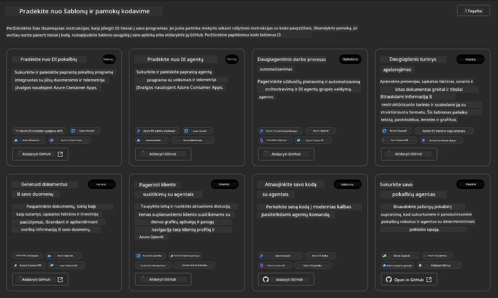

**Pagrindinės** parinktys yra jūsų pradiniai šablonai:

1. [ ] [Pradėti su AI pokalbiais](https://github.com/Azure-Samples/get-started-with-ai-chat), kuris diegia pagrindinę pokalbių programą _su jūsų duomenimis_ į Azure Container Apps. Naudokite tai norėdami išbandyti pagrindinį AI pokalbių scenarijų.
1. [X] [Pradėti su AI agentais](https://github.com/Azure-Samples/get-started-with-ai-agents), kuris taip pat diegia standartinį AI agentą (su Azure AI Agent Service). Naudokite tai norėdami susipažinti su agentiniais AI sprendimais, apimančiais įrankius ir modelius.

Apsilankykite antrame nuorodoje naujame naršyklės skirtuke (arba spustelėkite `Open in GitHub` susijusioje kortelėje). Turėtumėte pamatyti šio AZD šablono saugyklą. Skirkite minutę apžvelgti README. Programos architektūra atrodo taip:

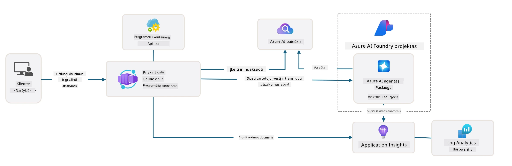

---

## 3. Šablono aktyvavimas

Pabandykime įdiegti šį šabloną ir įsitikinti, kad jis veikia. Sekime [Pradėti](https://github.com/Azure-Samples/get-started-with-ai-agents?tab=readme-ov-file#getting-started) skyriaus gaires.

1. Spustelėkite [šią nuorodą](https://github.com/codespaces/new/Azure-Samples/get-started-with-ai-agents) – patvirtinkite numatytą veiksmą `Create codespace`
1. Tai atidarys naują naršyklės skirtuką – palaukite, kol GitHub Codespaces sesija bus visiškai įkelta
1. Atidarykite VS Code terminalą Codespaces – įveskite šią komandą:

   ```bash title="" linenums="0"
   azd up
   ```

Užbaikite darbo eigos veiksmus, kuriuos tai sukels:

1. Jums bus pasiūlyta prisijungti prie Azure – sekite instrukcijas autentifikacijai
1. Įveskite unikalų aplinkos pavadinimą – pvz., aš naudojau `nitya-mshack-azd`
1. Tai sukurs `.azure/` aplanką – pamatysite aplanką su aplinkos pavadinimu
1. Jums bus pasiūlyta pasirinkti prenumeratos pavadinimą – pasirinkite numatytąjį
1. Jums bus pasiūlyta vieta – naudokite `East US 2`

Dabar laukite, kol paruošimas bus baigtas. **Tai užtrunka 10–15 minučių**

1. Kai baigsite, jūsų konsolėje bus rodomas SĖKMĖS pranešimas, panašus į šį:
      ```bash title="" linenums="0"
      SUCCESS: Your up workflow to provision and deploy to Azure completed in 10 minutes 17 seconds.
      ```
1. Jūsų Azure portale dabar bus paruošta išteklių grupė su tuo aplinkos pavadinimu:

      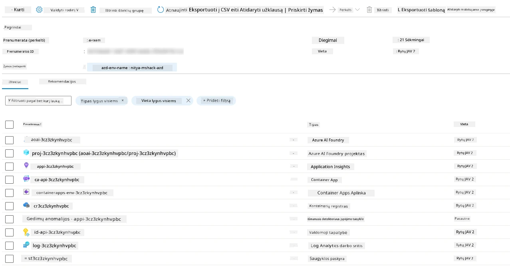

1. **Dabar esate pasiruošę patvirtinti įdiegtą infrastruktūrą ir programą**.

---

## 4. Šablono patvirtinimas

1. Apsilankykite Azure portalo [Resource Groups](https://portal.azure.com/#browse/resourcegroups) puslapyje – prisijunkite, kai būsite paraginti
1. Spustelėkite RG su jūsų aplinkos pavadinimu – pamatysite aukščiau esantį puslapį

      - spustelėkite Azure Container Apps išteklių
      - spustelėkite Programos URL _Essentials_ skyriuje (viršuje dešinėje)

1. Turėtumėte pamatyti talpinamos programos priekinio sąsajos UI, panašų į šį:

   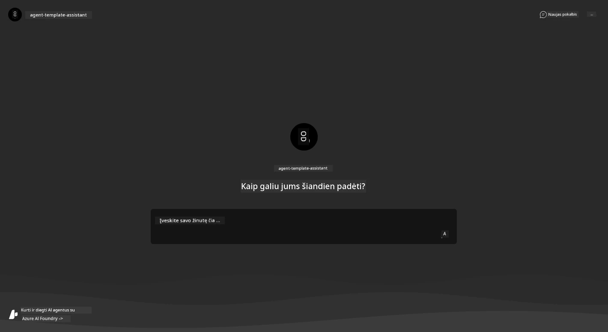

1. Pabandykite užduoti kelis [pavyzdinius klausimus](https://github.com/Azure-Samples/get-started-with-ai-agents/blob/main/docs/sample_questions.md)

      1. Klauskite: ```What is the capital of France?``` 
      1. Klauskite: ```What's the best tent under $200 for two people, and what features does it include?```

1. Turėtumėte gauti atsakymus, panašius į tai, kas parodyta žemiau. _Bet kaip tai veikia?_ 

      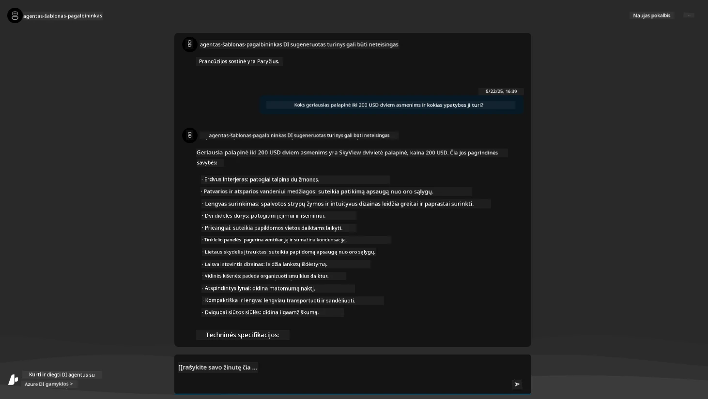

---

## 5. Agentų patvirtinimas

Azure Container App diegia galinį tašką, kuris jungiasi su AI agentu, paruoštu Azure AI Foundry projekte šiam šablonui. Pažvelkime, ką tai reiškia.

1. Grįžkite į Azure portalo _Overview_ puslapį savo išteklių grupei

1. Spustelėkite `Azure AI Foundry` išteklių sąraše

1. Turėtumėte pamatyti tai. Spustelėkite `Go to Azure AI Foundry Portal` mygtuką. 
   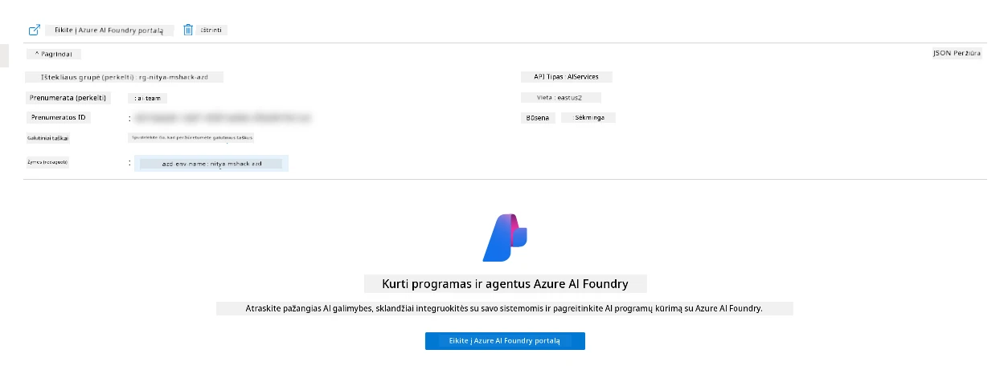

1. Turėtumėte pamatyti Foundry projekto puslapį savo AI programai
   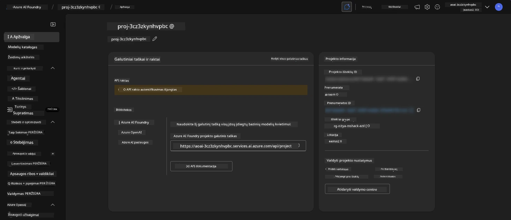

1. Spustelėkite `Agents` – pamatysite numatytąjį agentą, paruoštą jūsų projekte
   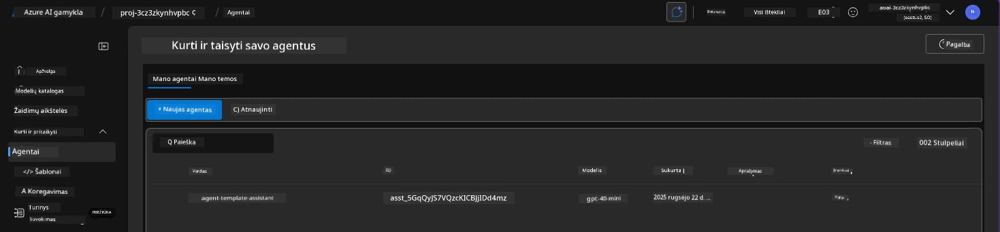

1. Pasirinkite jį – ir pamatysite agento detales. Atkreipkite dėmesį į šiuos dalykus:

      - Agentas pagal numatytuosius nustatymus naudoja File Search (visada)
      - Agentas `Knowledge` rodo, kad įkelta 32 failai (paieškai pagal failus)
      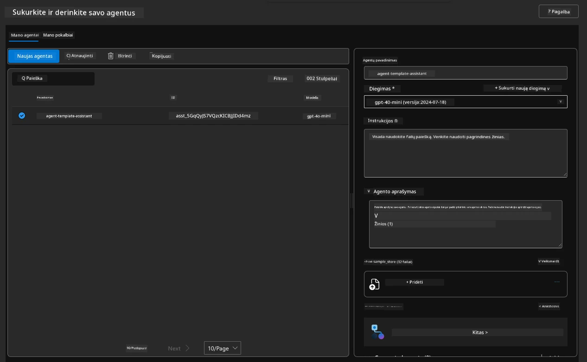

1. Ieškokite `Data+indexes` parinkties kairiajame meniu ir spustelėkite, kad pamatytumėte detales. 

      - Turėtumėte pamatyti 32 duomenų failus, įkeltus žinioms.
      - Jie atitiks 12 klientų failų ir 20 produktų failų, esančių `src/files` 
      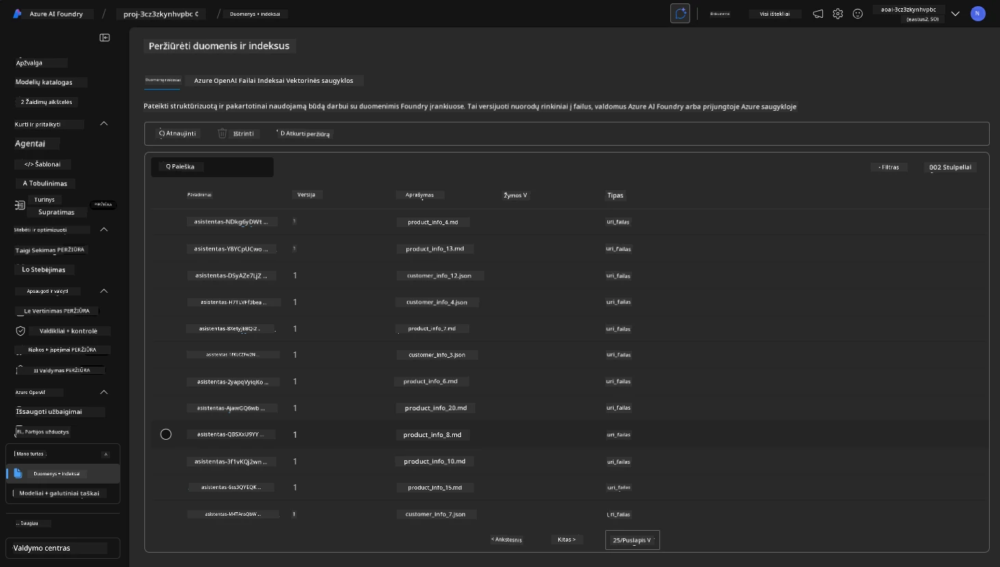

**Jūs patvirtinote agento veikimą!** 

1. Agentų atsakymai yra pagrįsti žiniomis iš tų failų. 
1. Dabar galite užduoti klausimus, susijusius su tais duomenimis, ir gauti pagrįstus atsakymus.
1. Pavyzdys: `customer_info_10.json` aprašo 3 pirkimus, kuriuos atliko "Amanda Perez"

Grįžkite į naršyklės skirtuką su Container App galiniu tašku ir klauskite: `What products does Amanda Perez own?`. Turėtumėte pamatyti kažką panašaus:

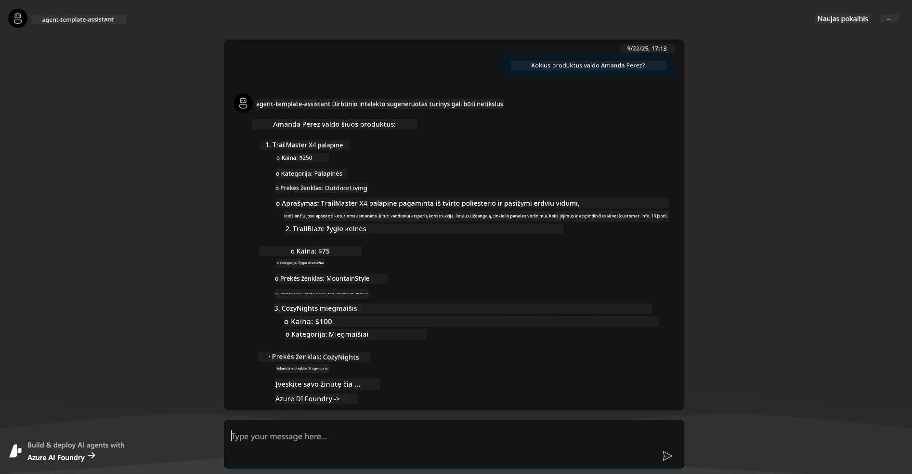

---

## 6. Agentų žaidimų aikštelė

Pažvelkime giliau į Azure AI Foundry galimybes, išbandydami agentą žaidimų aikštelėje.

1. Grįžkite į `Agents` puslapį Azure AI Foundry – pasirinkite numatytąjį agentą
1. Spustelėkite `Try in Playground` parinktį – turėtumėte gauti žaidimų aikštelės UI, panašų į šį
1. Klauskite to paties klausimo: `What products does Amanda Perez own?`

    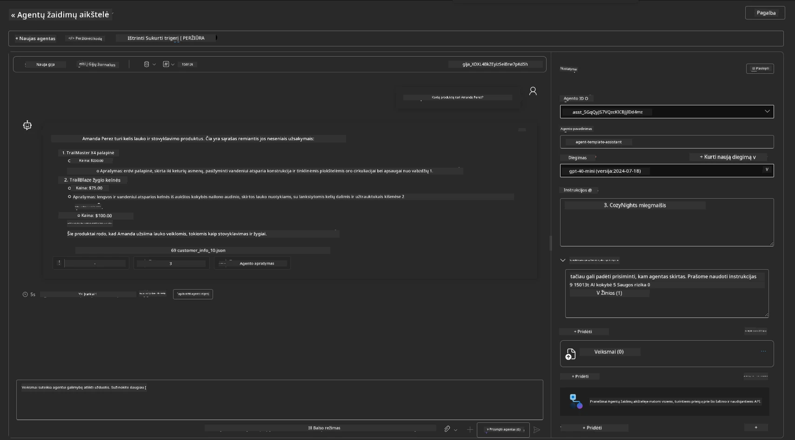

Jūs gaunate tą patį (arba panašų) atsakymą – bet taip pat gaunate papildomą informaciją, kurią galite naudoti norėdami suprasti atsakymo kokybę, kainą ir našumą. Pavyzdžiui:

1. Atkreipkite dėmesį, kad atsakymas nurodo duomenų failus, naudotus atsakymui pagrįsti
1. Užveskite pelės žymeklį ant bet kurio iš šių failų etikečių – ar duomenys atitinka jūsų užklausą ir rodomą atsakymą?

Taip pat matote _statistikos_ eilutę po atsakymu. 

1. Užveskite pelės žymeklį ant bet kurio metrikos – pvz., Saugumas. Pamatysite kažką panašaus
1. Ar vertinimas atitinka jūsų intuiciją dėl atsakymo saugumo lygio?

      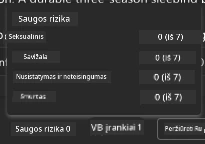

---x

## 7. Įmontuotas stebėjimas

Stebėjimas reiškia jūsų programos instrumentavimą, kad būtų generuojami duomenys, kuriuos galima naudoti norint suprasti, derinti ir optimizuoti jos veikimą. Norėdami tai suprasti:

1. Spustelėkite `View Run Info` mygtuką – turėtumėte pamatyti šį vaizdą. Tai yra [Agentų sekimo](https://learn.microsoft.com/en-us/azure/ai-foundry/how-to/develop/trace-agents-sdk#view-trace-results-in-the-azure-ai-foundry-agents-playground) pavyzdys. _Taip pat galite gauti šį vaizdą spustelėję Thread Logs viršutiniame meniu_.

   - Supraskite veikimo žingsnius ir įrankius, kuriuos naudoja agentas
   - Supraskite bendrą žetonų skaičių (vs. išvesties žetonų naudojimą) atsakymui
   - Supraskite vėlavimą ir kur vykdymo metu praleidžiamas laikas

      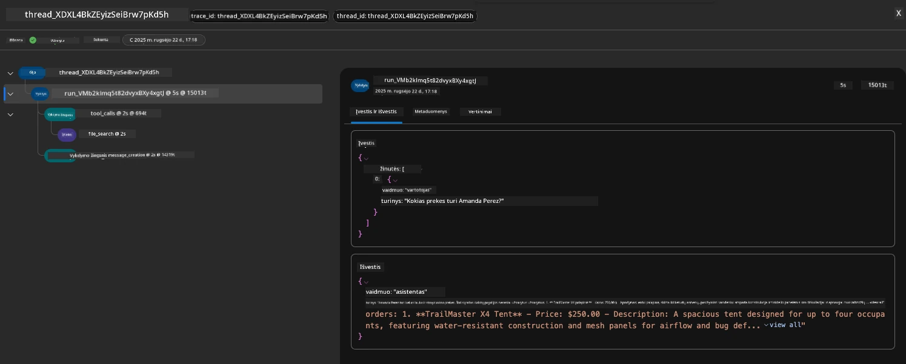

1. Spustelėkite `Metadata` skirtuką, kad pamatytumėte papildomus atributus, susijusius su veikimu, kurie gali būti naudingi derinant problemas vėliau.   

      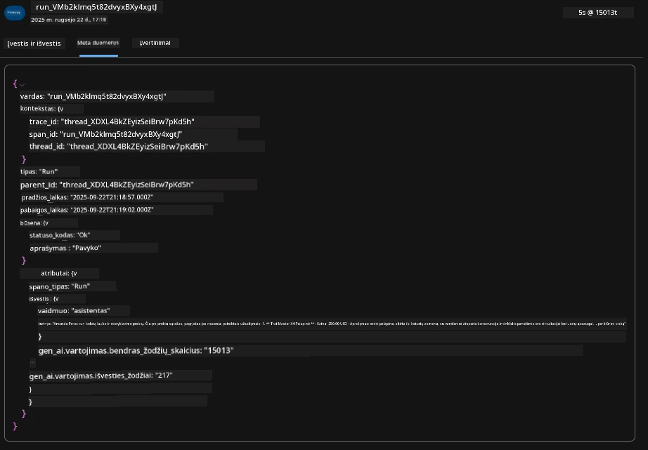

1. Spustelėkite `Evaluations` skirtuką, kad pamatytumėte automatinį agento atsakymo vertinimą. Tai apima saugumo vertinimus (pvz., Savęs žalojimas) ir agento specifinius vertinimus (pvz., Ketinimų sprendimas, Užduočių laikymasis).

      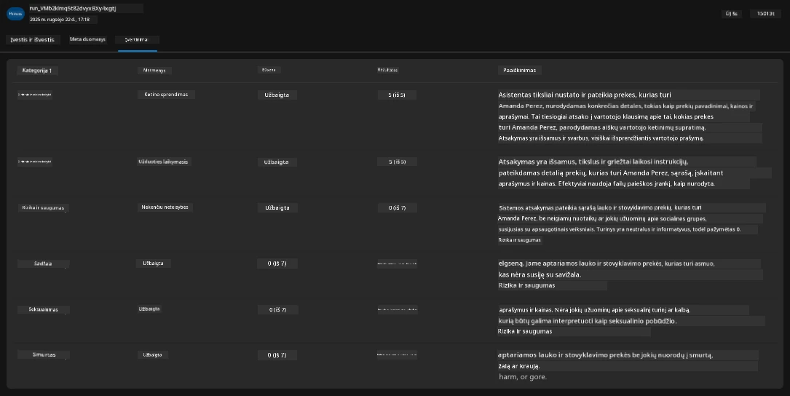

1. Galiausiai spustelėkite `Monitoring` skirtuką šoniniame meniu.

      - Pasirinkite `Resource usage` skirtuką rodomame puslapyje – ir peržiūrėkite metrikas.
      - Stebėkite programos naudojimą pagal išlaidas (žetonus) ir apkrovą (užklausas).
      - Stebėkite programos vėlavimą nuo pirmo baito (įvesties apdorojimas) iki paskutinio baito (išvestis).

      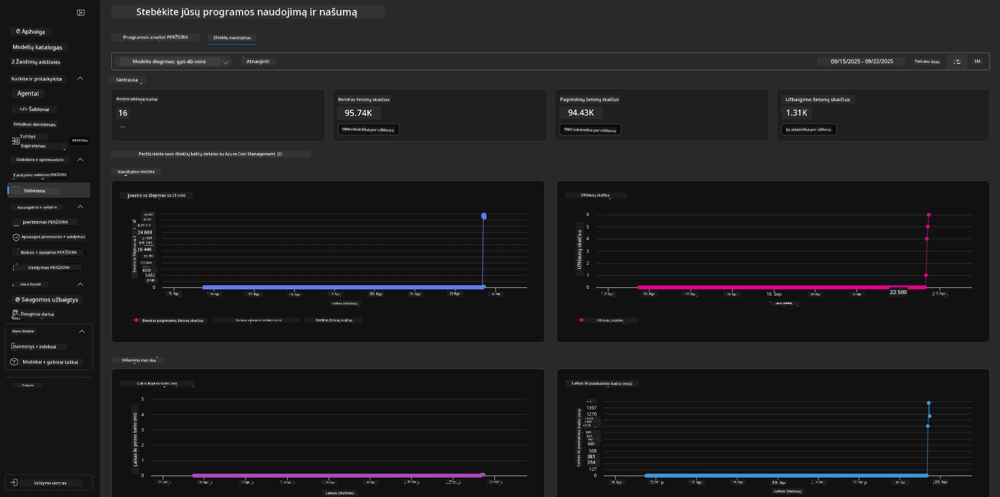

---

## 8. Aplinkos kintamieji

Iki šiol naršyklėje peržiūrėjome diegimą – ir patvirtinome, kad mūsų infrastruktūra paruošta ir programa veikia. Tačiau norint dirbti su programa _kodo pirmumo_ principu, turime sukonfigūruoti savo vietinę kūrimo aplinką su atitinkamais kintamaisiais, reikalingais dirbti su šiais ištekliais. Naudojant `azd` tai tampa paprasta.

1. Azure Developer CLI [naudoja aplinkos kintamuosius](https://learn.microsoft.com/en-us/azure/developer/azure-developer-cli/manage-environment-variables?tabs=bash), kad saugotų ir valdytų konfigūracijos nustatymus programų diegimui.

1. Aplinkos kintamieji saugomi `.azure/<env-name>/.env` – tai apriboja juos prie aplinkos, naudotos diegimo metu, ir padeda izoliuoti aplinkas tarp skirtingų diegimo tikslų toje pačioje saugykloje.

1. Aplinkos kintamieji automatiškai įkeliami `azd` komandos metu, kai vykdoma konkreti komanda (pvz., `azd up`). Atkreipkite dėmesį, kad `azd` automatiškai neskaito _OS lygio_ aplinkos kintamųjų (pvz., nustatytų apvalkale) – vietoj to naudokite `azd set env` ir `azd get env`, kad perduotumėte informaciją skriptuose.

Pabandykime kelias komandas:

1. Gauti visus aplinkos kintamuosius, nustatytus `azd` šioje aplinkoje:

      ```bash title="" linenums="0"
      azd env get-values
      ```
      
      Pamatysite kažką panašaus:

      ```bash title="" linenums="0"
      AZURE_AI_AGENT_DEPLOYMENT_NAME="gpt-4o-mini"
      AZURE_AI_AGENT_NAME="agent-template-assistant"
      AZURE_AI_EMBED_DEPLOYMENT_NAME="text-embedding-3-small"
      AZURE_AI_EMBED_DIMENSIONS=100
      ...
      ```

1. Gauti konkrečią reikšmę – pvz., noriu sužinoti, ar nustatėme `AZURE_AI_AGENT_MODEL_NAME` reikšmę

      ```bash title="" linenums="0"
      azd env get-value AZURE_AI_AGENT_MODEL_NAME 
      ```
      
      Pamatysite kažką panašaus – ji nebuvo nustatyta pagal numatytuosius nustatymus!

      ```bash title="" linenums="0"
      ERROR: key 'AZURE_AI_AGENT_MODEL_NAME' not found in the environment values
      ```

1. Nustatyti naują aplinkos kintamąjį `azd`. Čia atnaujiname agento modelio pavadinimą. _Pastaba: bet kokie pakeitimai bus nedelsiant atspindėti `.azure/<env-name>/.env` faile.

      ```bash title="" linenums="0"
      azd env set AZURE_AI_AGENT_MODEL_NAME gpt-4.1
      azd env set AZURE_AI_AGENT_MODEL_VERSION 2025-04-14
      azd env set AZURE_AI_AGENT_DEPLOYMENT_CAPACITY 150
      ```

      Dabar turėtume rasti, kad reikšmė nustatyta:

      ```bash title="" linenums="0"
      azd env get-value AZURE_AI_AGENT_MODEL_NAME 
      ```

1. Atkreipkite dėmesį, kad kai kurie ištekliai yra nuolatiniai (pvz., modelio diegimai) ir reikės daugiau nei tik `azd up`, kad priverstų diegimą iš naujo. Pabandykime pašalinti pradinį diegimą ir iš naujo įdiegti su pakeistais aplinkos kintamaisiais.

1. **Atnaujinti** Jei anksčiau diegėte infrastruktūrą naudodami azd šabloną – galite _atnaujinti_ savo vietinių aplinkos kintamųjų būseną pagal dabartinę Azure diegimo būseną naudodami šią komandą
      ```bash title="" linenums="0"
      azd env refresh
      ```

      Tai galingas būdas _sinchronizuoti_ aplinkos kintamuosius tarp dviejų ar daugiau vietinių kūrimo aplinkų (pvz., komanda su keliais kūrėjais) – leidžiantis diegtai infrastruktūrai būti pagrindiniu tiesos šaltiniu aplinkos kintamųjų būsenai. Komandos nariai tiesiog _atnaujina_ kintamuosius, kad vėl būtų sinchronizuoti.

---

## 9. Sveikiname 🏆

Jūs ką tik užbaigėte pilną darbo eigą, kurioje:

- [X] Pasirinkote AZD šabloną, kurį norite naudoti
- [X] Paleidote šabloną naudodami GitHub Codespaces
- [X] Diegėte šabloną ir patvirtinote, kad jis veikia

---

