# 2. Patvirtinti šabloną

> Patikrinta su `azd 1.23.12` 2026 m. kovo mėn.

!!! tip "ŠIO MODULIO PABAIGOJE JŪS GALĖSITE"

    - [ ] Išanalizuoti DI sprendimo architektūrą
    - [ ] Suprasti AZD diegimo darbo eigą
    - [ ] Naudoti GitHub Copilot pagalbai dirbant su AZD
    - [ ] **Laboratorinis darbas 2:** Diegti ir patvirtinti AI agentų šabloną

---


## 1. Įvadas

The [Azure Developer CLI](https://learn.microsoft.com/en-us/azure/developer/azure-developer-cli/) arba `azd` yra atvirojo kodo komandų eilutės įrankis, kuris supaprastina kūrėjo darbo eigą kuriant ir diegiant programas į Azure. 

[AZD šablonai](https://learn.microsoft.com/azure/developer/azure-developer-cli/azd-templates) yra standartizuoti saugyklų rinkiniai, kuriuose yra pavyzdinio programos kodo, _infrastruktūra kaip kodas_ ištekliai ir `azd` konfigūracijos failai integralios sprendimo architektūros užtikrinimui. Infrastruktūros paruošimas tampa toks paprastas kaip įvykdyti komandą `azd provision` - o naudojant `azd up` galite vienu metu paruošti infrastruktūrą **ir** diegti savo programą!

Todėl programos kūrimo proceso pradžia gali būti tokia paprasta, kaip rasti tinkamą _AZD Starter šabloną_, kuris geriausiai atitinka jūsų programos ir infrastruktūros poreikius - o tada pritaikyti saugyklą pagal jūsų scenarijaus reikalavimus.

Prieš pradėdami, įsitikinkime, kad turite įdiegtą Azure Developer CLI.

1. Atidarykite VS Code terminalą ir įveskite šią komandą:

      ```bash title="" linenums="0"
      azd version
      ```

1. Turėtumėte pamatyti kažką panašaus!

      ```bash title="" linenums="0"
      azd version 1.23.12 (commit <current-build>)
      ```

**Dabar esate pasirengę pasirinkti ir diegti šabloną naudojant azd**

---

## 2. Šablono pasirinkimas

Microsoft Foundry platforma siūlo [rinkinį rekomenduojamų AZD šablonų](https://learn.microsoft.com/en-us/azure/ai-foundry/how-to/develop/ai-template-get-started), kurie apima populiarias sprendimų scenarijus, tokius kaip _daugelio agentų darbo eigos automatizavimas_ ir _daugiamodalis turinio apdorojimas_. Šiuos šablonus taip pat galite rasti apsilankę Microsoft Foundry portale.

1. Apsilankykite [https://ai.azure.com/templates](https://ai.azure.com/templates)
1. Prisijunkite prie Microsoft Foundry portalo, kai būsite paraginti - pamatysite kažką panašaus.

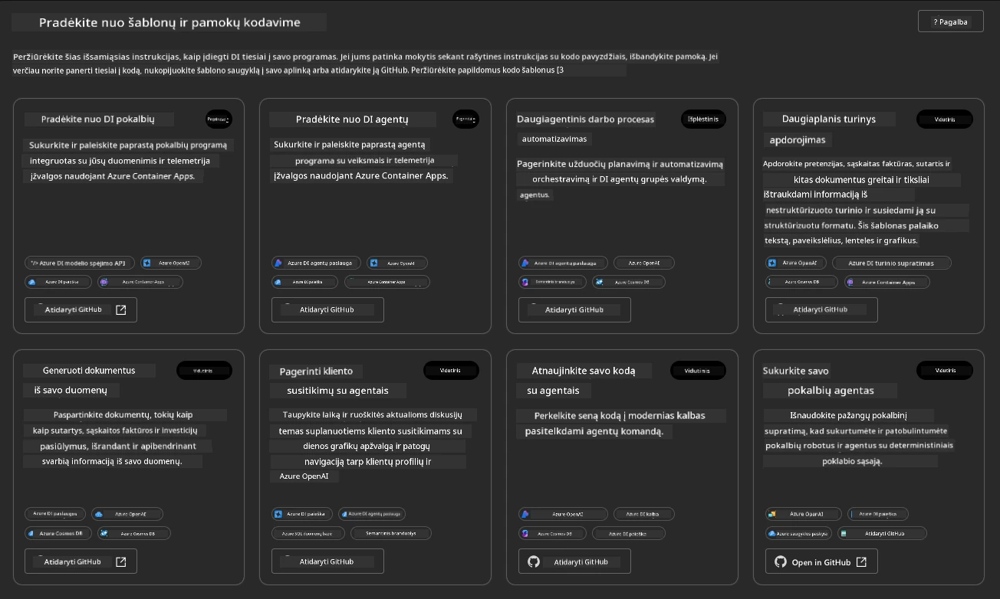


Parinktys **Basic** yra jūsų pradžios šablonai:

1. [ ] [Get Started with AI Chat](https://github.com/Azure-Samples/get-started-with-ai-chat) kuris diegia paprastą pokalbių programą _su jūsų duomenimis_ į Azure Container Apps. Naudokite tai, norėdami ištirti pagrindinį DI pokalbių scenarijų.
1. [X] [Get Started with AI Agents](https://github.com/Azure-Samples/get-started-with-ai-agents) kuris taip pat diegia standartinį DI agentą (su Foundry agentais). Naudokite tai, kad susipažintumėte su agentiniais DI sprendimais, įtraukiant įrankius ir modelius.

Atsidarykite antrą nuorodą naujame naršyklės skirtuke (arba spustelėkite `Open in GitHub` susijusioje kortelėje). Turėtumėte matyti šio AZD šablono saugyklą. Skirkite minutę README peržiūrai. Programos architektūra atrodo taip:

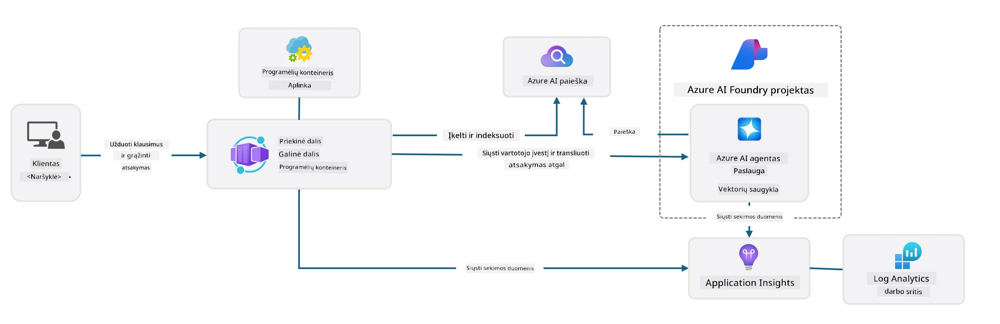

---

## 3. Šablono aktyvavimas

Pabandykime įdiegti šį šabloną ir įsitikinti, kad jis galioja. Vadovausimės [Getting Started](https://github.com/Azure-Samples/get-started-with-ai-agents?tab=readme-ov-file#getting-started) skyriaus nurodymais.

1. Pasirinkite darbo aplinką šablono saugyklai:

      - **GitHub Codespaces**: Spustelėkite [this link](https://github.com/codespaces/new/Azure-Samples/get-started-with-ai-agents) ir patvirtinkite `Create codespace`
      - **Local clone or dev container**: Klonuokite `Azure-Samples/get-started-with-ai-agents` ir atidarykite jį VS Code

1. Palaukite, kol VS Code terminalas bus paruoštas, tada įveskite šią komandą:

   ```bash title="" linenums="0"
   azd up
   ```

Įvykdykite darbo eigos veiksmus, kuriuos tai inicijuos:

1. Jums bus pasiūlyta prisijungti prie Azure - atlikite autentifikavimo nurodymus
1. Įveskite unikalų aplinkos pavadinimą - pvz., aš naudojau `nitya-mshack-azd`
1. Tai sukurs `.azure/` aplanką - pamatysite poaplankį su aplinkos pavadinimu
1. Jums bus pasiūlyta pasirinkti prenumeratos pavadinimą - pasirinkite numatytąją
1. Jums bus užklausta vietos - naudokite `East US 2`

Dabar laukiate, kol užbaigsis provisinimas. **Tai užtrunka 10–15 minučių**

1. Kai bus baigta, jūsų konsolėje bus rodoma SUCCESS žinutė panašiai kaip čia:
      ```bash title="" linenums="0"
      SUCCESS: Your up workflow to provision and deploy to Azure completed in 10 minutes 17 seconds.
      ```
1. Jūsų Azure portalas dabar turės pagal aplinkos pavadinimą provisuotą resursų grupę:

      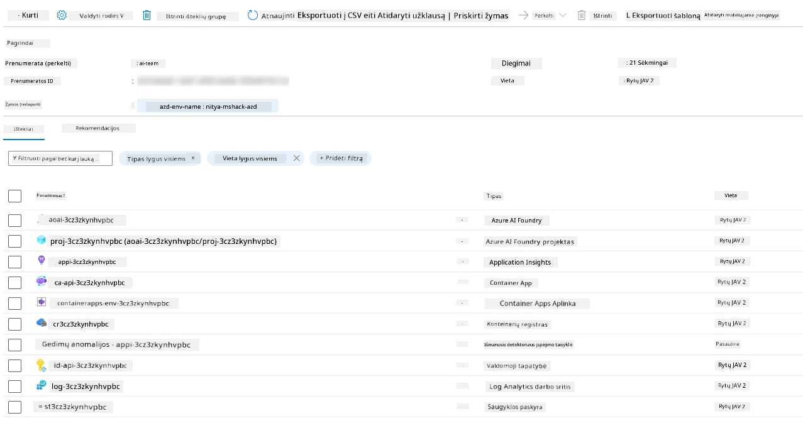

1. **Dabar esate pasirengę patikrinti įdiegtą infrastruktūrą ir programą**.

---

## 4. Šablono patikra

1. Apsilankykite Azure portalo [Resource Groups](https://portal.azure.com/#browse/resourcegroups) puslapyje - prisijunkite, kai būsite paraginti
1. Spustelėkite RG jūsų aplinkos pavadinimui - pamatysite aukščiau nurodytą puslapį

      - spustelėkite Azure Container Apps išteklių
      - spustelėkite Application Url skyriuje _Essentials_ (viršuje dešinėje)

1. Turėtumėte pamatyti talpinamos programos front-end sąsają, panašią į šią:

   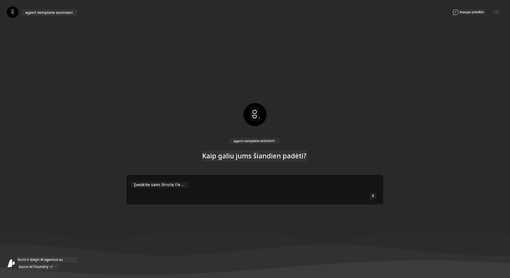

1. Pabandykite užduoti kelis [pavyzdinius klausimus](https://github.com/Azure-Samples/get-started-with-ai-agents/blob/main/docs/sample_questions.md)

      1. Užduokite: ```What is the capital of France?``` 
      1. Užduokite: ```What's the best tent under $200 for two people, and what features does it include?```

1. Turėtumėte gauti atsakymus panašius į parodytus žemiau. _Bet kaip tai veikia?_ 

      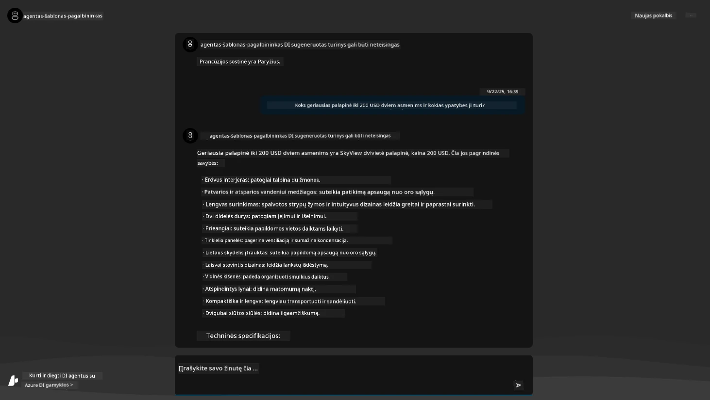

---

## 5. Agentų patikra

Azure Container App diegia galinį tašką, kuris jungiasi prie AI agente, provisuoto Microsoft Foundry projekte šiam šablonui. Pažiūrėkime, ką tai reiškia.

1. Grįžkite į Azure portalo _Overview_ puslapį jūsų resursų grupei

1. Spustelėkite `Microsoft Foundry` išteklių tame sąraše

1. Turėtumėte matyti šį vaizdą. Spustelėkite mygtuką `Go to Microsoft Foundry Portal`. 
   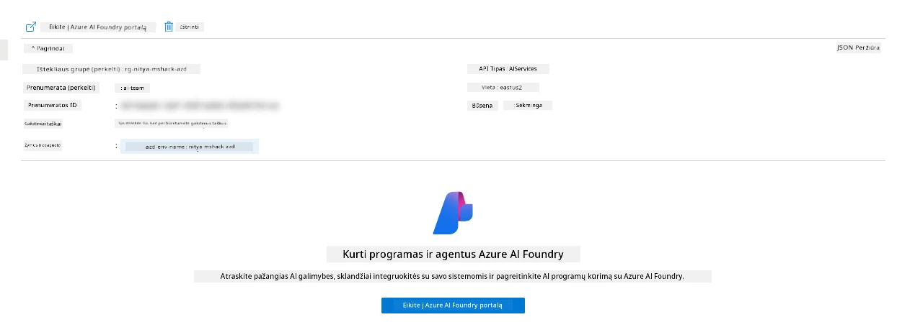

1. Turėtumėte matyti Foundry projekto puslapį jūsų DI programai
   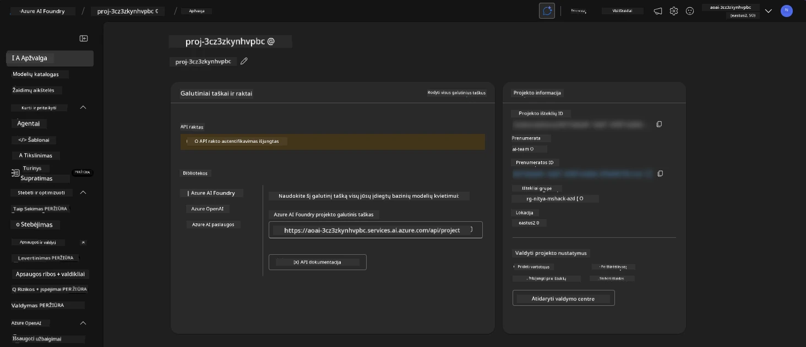

1. Spustelėkite `Agents` - pamatysite numatytąjį agentą provisuotą jūsų projekte
   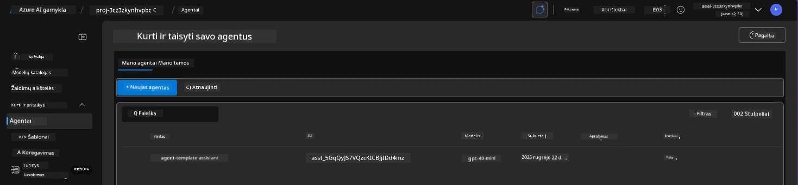

1. Pasirinkite jį - ir matysite agento detales. Atkreipkite dėmesį į šiuos dalykus:

      - Agentas pagal numatytuosius nustatymus naudoja File Search (visada)
      - Agentas `Knowledge` nurodo, kad buvo įkelta 32 failai (skirti failų paieškai)
      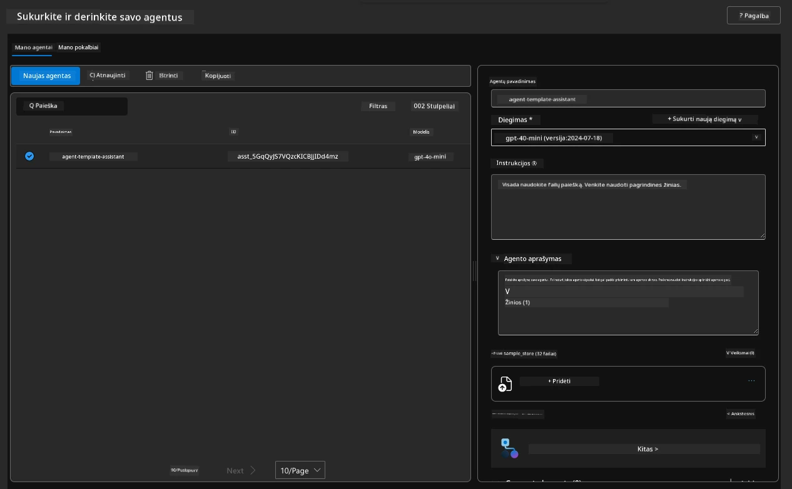

1. Kairiajame meniu raskite parinktį `Data+indexes` ir spustelėkite detales. 

      - Turėtumėte matyti 32 duomenų failus, įkeltus žinių bazei.
      - Jie atitiks 12 klientų failų ir 20 produktų failų esantį `src/files` 
      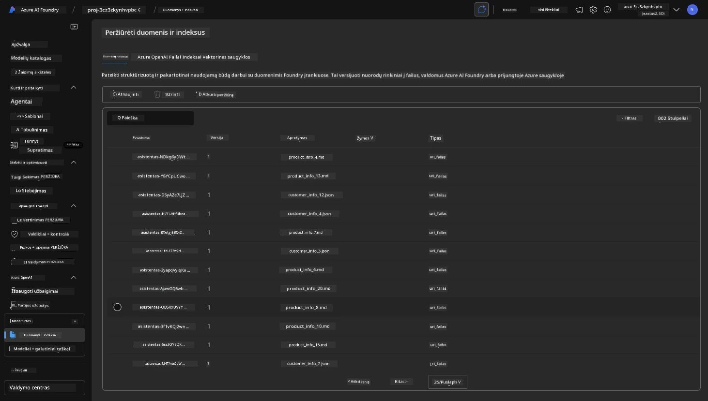

**Jūs patvirtinote agento veikimą!** 

1. Ageno atsakymai remiasi žiniomis iš tų failų. 
1. Dabar galite užduoti klausimus, susijusius su tais duomenimis, ir gauti pagrįstus atsakymus.
1. Pavyzdys: `customer_info_10.json` aprašo 3 pirkimus, kuriuos atliko "Amanda Perez"

Grįžkite į naršyklės skirtuką su Container App galiniu tašku ir užduokite: `What products does Amanda Perez own?`. Turėtumėte matyti kažką panašaus:

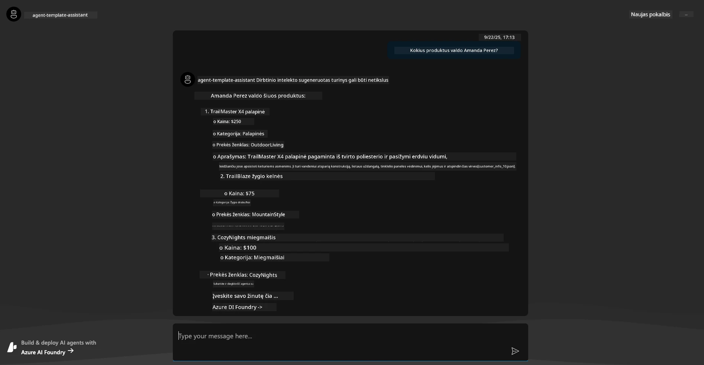

---

## 6. Agentų aikštelė

Sukurkime šiek tiek daugiau intuicijos apie Microsoft Foundry galimybes, išbandydami agentą Agents Playground.

1. Grįžkite į `Agents` puslapį Microsoft Foundry - pasirinkite numatytąjį agentą
1. Spustelėkite parinktį `Try in Playground` - turėtumėte gauti Playground sąsają panašią į šią
1. Užduokite tą patį klausimą: `What products does Amanda Perez own?`

    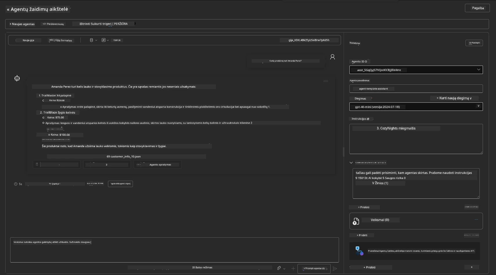

Gaunate tokį pat (ar panašų) atsakymą - tačiau taip pat gaunate papildomos informacijos, kurią galite panaudoti suprasti agentinės programos atsakymų kokybę, kainą ir našumą. Pavyzdžiui:

1. Atkreipkite dėmesį, kad atsakyme nurodomi duomenų failai, naudoti atsakymo "pagrindimui"
1. Užveskite pelę ant bet kurios iš šių bylos žymių - ar duomenys atitinka jūsų užklausą ir parodytą atsakymą?

Taip pat apačioje matote eilutę su statistika.

1. Užveskite pelę ant bet kurio rodiklio - pvz., Safety. Pamatysite kažką panašaus
1. Ar įvertinimas atitinka jūsų nuojautą apie atsakymo saugumo lygį?

      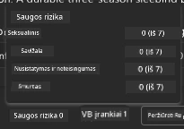

---

## 7. Įmontuota stebėsena

Stebėsena reiškia programos instrumentavimą, kad būtų generuojami duomenys, kuriuos galima naudoti veiklai suprasti, derinti ir optimizuoti. Norėdami tai pajausti:

1. Spustelėkite mygtuką `View Run Info` - turėtumėte pamatyti šį vaizdą. Tai yra pavyzdys [Agentų sekimo](https://learn.microsoft.com/en-us/azure/ai-foundry/how-to/develop/trace-agents-sdk#view-trace-results-in-the-azure-ai-foundry-agents-playground) veikimo. _Šį vaizdą taip pat galite gauti spustelėję Thread Logs viršutinio lygio meniu_.

   - Susipažinkite su vykdymo žingsniais ir agento naudojamais įrankiais
   - Supraskite bendrą žetonų skaičių (palyginti su išvesties žetonų naudojimu) atsakymui
   - Supraskite delsą ir kur vyksta laiko sąnaudų paskirstymas vykdyme

      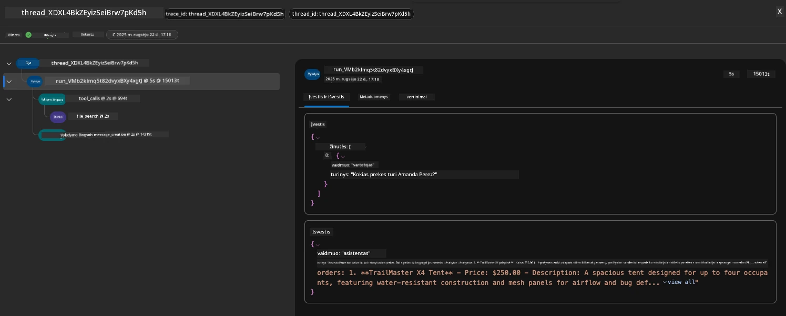

1. Spustelėkite skirtuką `Metadata`, kad pamatytumėte papildomas vykdymo savybes, kurios gali suteikti naudingą kontekstą vėlesniam trikčių šalinimui.   

      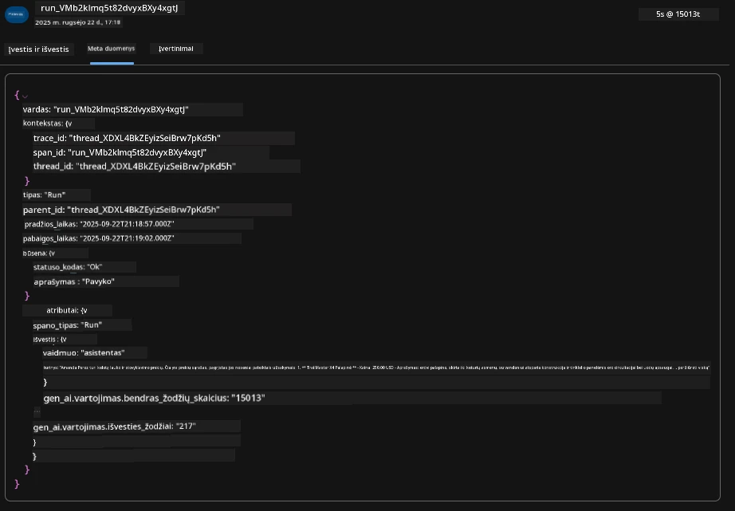


1. Spustelėkite skirtuką `Evaluations`, kad pamatytumėte automatinio įvertinimo rezultatus apie agento atsakymą. Tai apima saugumo vertinimus (pvz., savęs žalojimas) ir agentui specifinius vertinimus (pvz., ketinimo išsprendimas, užduoties laikymasis).

      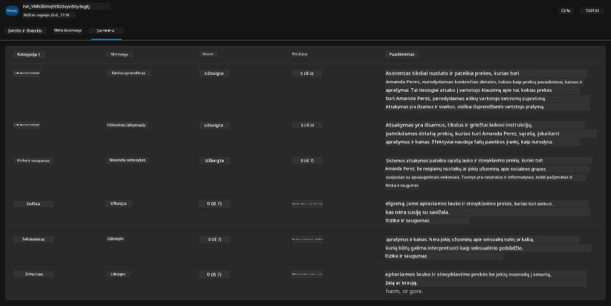

1. Galiausiai, spustelėkite skirtuką `Monitoring` šoninėje meniu juostoje.

      - Pasirinkite skirtuką `Resource usage` rodomame puslapyje - ir peržiūrėkite metrikas.
      - Stebėkite programos naudojimą pagal kaštus (žetonus) ir apkrovą (užklausas).
      - Stebėkite programos delsą iki pirmo baito (įvesties apdorojimas) ir paskutinio baito (išvestis).

      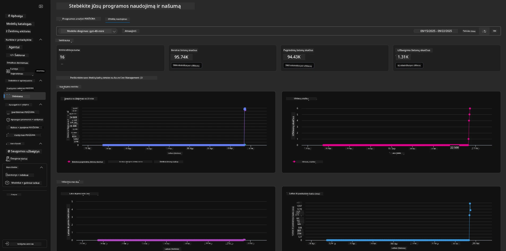

---

## 8. Aplinkos kintamieji

Iki šiol peržiūrėjome diegimą naršyklėje ir patvirtinome, kad mūsų infrastruktūra yra provisuota ir programa veikia. Bet dirbti su programa „pirmiausia kodu“ reiškia, kad turime sukonfigūruoti savo vietinę kūrimo aplinką su atitinkamais kintamaisiais, reikalingais darbui su šiais ištekliais. Naudojant `azd` tai padaryti paprasta.

1. The Azure Developer CLI [uses environment variables](https://learn.microsoft.com/en-us/azure/developer/azure-developer-cli/manage-environment-variables?tabs=bash) to store and manage configuration settings for  the application deployments.

1. Aplinkos kintamieji saugomi `.azure/<env-name>/.env` - tai apriboja juos prie diegimo metu naudotos `env-name` aplinkos ir padeda atskirti aplinkas tarp skirtingų diegimo tikslų toje pačioje saugykloje.

1. Aplinkos kintamieji yra automatiškai įkeliami vykdant `azd` komandą, kai ji vykdo konkretų veiksmą (pvz., `azd up`). Atkreipkite dėmesį, kad `azd` automatiškai neskaito operacinės sistemos lygmens aplinkos kintamųjų (pvz., nustatytų šerelyje) - vietoje to naudokite `azd set env` ir `azd get env`, kad perrašytumėte informaciją skriptuose.


Išbandykime kelias komandas:

1. Gaukite visus aplinkos kintamuosius, nustatytus `azd` šioje aplinkoje:

      ```bash title="" linenums="0"
      azd env get-values
      ```
      
      Matysite kažką panašaus:

      ```bash title="" linenums="0"
      AZURE_AI_AGENT_DEPLOYMENT_NAME="gpt-4.1-mini"
      AZURE_AI_AGENT_NAME="agent-template-assistant"
      AZURE_AI_EMBED_DEPLOYMENT_NAME="text-embedding-3-small"
      AZURE_AI_EMBED_DIMENSIONS=100
      ...
      ```

1. Gaukite konkretų reikšmės lauką - pvz., noriu sužinoti, ar nustatėme `AZURE_AI_AGENT_MODEL_NAME` reikšmę

      ```bash title="" linenums="0"
      azd env get-value AZURE_AI_AGENT_MODEL_NAME 
      ```
      
      Matysite kažką panašaus - ji nebuvo nustatyta pagal numatytuosius!

      ```bash title="" linenums="0"
      ERROR: key 'AZURE_AI_AGENT_MODEL_NAME' not found in the environment values
      ```

1. Nustatykite naują aplinkos kintamąjį `azd`. Čia atnaujiname agente modelio pavadinimą. _Pastaba: bet kokie pakeitimai bus nedelsiant atspindėti faile `.azure/<env-name>/.env`._

      ```bash title="" linenums="0"
      azd env set AZURE_AI_AGENT_MODEL_NAME gpt-4.1
      azd env set AZURE_AI_AGENT_MODEL_VERSION 2025-04-14
      azd env set AZURE_AI_AGENT_DEPLOYMENT_CAPACITY 150
      ```

      Dabar turėtume rasti, kad reikšmė nustatyta:

      ```bash title="" linenums="0"
      azd env get-value AZURE_AI_AGENT_MODEL_NAME 
      ```

1. Atkreipkite dėmesį, kad kai kurie ištekliai yra persistent (pvz., modelių diegimai) ir reikalauja daugiau nei vien `azd up`, kad priverstų pakartotinį diegimą. Pabandykime išardyti pradinį diegimą ir vėl įdiegti su pakeistais aplinkos kintamaisiais.

1. **Atnaujinimas** Jei anksčiau diegėte infrastruktūrą naudodami azd šabloną - galite _atnaujinti_ vietinių aplinkos kintamųjų būseną pagal esamą Azure diegimo būseną naudodami šią komandą:

      ```bash title="" linenums="0"
      azd env refresh
      ```

      Tai galingas būdas _sinchronizuoti_ aplinkos kintamuosius tarp dviejų ar daugiau vietinių kūrimo aplinkų (pvz., komanda su keliais programuotojais) - leidžiantis diegtai infrastruktūrai tarnauti kaip pagrindinei nuorodai dėl aplinkos kintamųjų būsenos. Komandos nariai tiesiog _atnaujina_ kintamuosius, kad vėl būtų sinchronizuoti.

---

## 9. Sveikiname 🏆

Jūs ką tik baigėte visą darbo eigą, kurioje:

- [X] Pasirinkote AZD šabloną, kurį norite naudoti
- [X] Atidarėte šabloną palaikomoje kūrimo aplinkoje
- [X] Išdiegėte šabloną ir patvirtinote, kad jis veikia

---

<!-- CO-OP TRANSLATOR DISCLAIMER START -->
**Atsakomybės apribojimas**:
Šis dokumentas buvo išverstas naudojant dirbtinio intelekto vertimo paslaugą [Co-op Translator](https://github.com/Azure/co-op-translator). Nors siekiame tikslumo, atkreipkite dėmesį, kad automatiniai vertimai gali turėti klaidų ar netikslumų. Originalus dokumentas jo gimtąja kalba turėtų būti laikomas autoritetingu šaltiniu. Jei informacija yra kritinė, rekomenduojamas profesionalus žmogaus vertimas. Mes neatsakome už jokius nesusipratimus ar neteisingus aiškinimus, kylančius naudojant šį vertimą.
<!-- CO-OP TRANSLATOR DISCLAIMER END -->