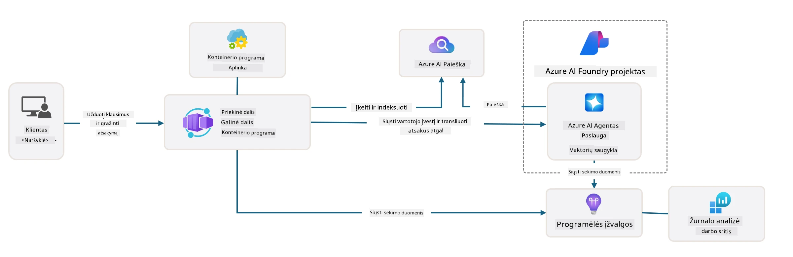

<!--
CO_OP_TRANSLATOR_METADATA:
{
  "original_hash": "4e403f041411361140d6beb88ab2a181",
  "translation_date": "2025-09-25T02:32:00+00:00",
  "source_file": "workshop/docs/instructions/3-Deconstruct-AI-Template.md",
  "language_code": "lt"
}
-->
# 3. Išskaidykite šabloną

!!! tipas "BAIGĘ ŠĮ MODULĮ GALĖSITE"

    - [ ] Punktas
    - [ ] Punktas
    - [ ] Punktas
    - [ ] **Laboratorija 3:** 

---

Naudodami AZD šablonus ir Azure Developer CLI (`azd`) galime greitai pradėti AI kūrimo kelionę su standartizuotais saugyklomis, kurios pateikia pavyzdinį kodą, infrastruktūrą ir konfigūracijos failus - kaip paruoštą _pradinį_ projektą.

**Tačiau dabar mums reikia suprasti projekto struktūrą ir kodų bazę - ir sugebėti pritaikyti AZD šabloną - neturint jokios ankstesnės patirties ar supratimo apie AZD!**

---

## 1. Aktyvuokite GitHub Copilot

### 1.1 Įdiekite GitHub Copilot Chat

Laikas išbandyti [GitHub Copilot su Agent Mode](https://code.visualstudio.com/docs/copilot/chat/chat-agent-mode). Dabar galime naudoti natūralią kalbą, kad apibūdintume savo užduotį aukštu lygiu ir gautume pagalbą ją vykdant. Šiai laboratorijai naudosime [Copilot Free planą](https://github.com/github-copilot/signup), kuris turi mėnesinį užbaigimų ir pokalbių sąveikų limitą.

Plėtinį galima įdiegti iš rinkos, tačiau jis jau turėtų būti pasiekiamas jūsų Codespaces aplinkoje. _Spustelėkite `Open Chat` iš Copilot piktogramos išskleidžiamojo meniu - ir įveskite užklausą, pvz., `What can you do?`_ - jums gali būti paprašyta prisijungti. **GitHub Copilot Chat paruoštas**.

### 1.2 Įdiekite MCP serverius

Kad Agent Mode būtų efektyvus, jam reikia prieigos prie tinkamų įrankių, kurie padėtų gauti žinių arba atlikti veiksmus. Čia gali padėti MCP serveriai. Konfigūruosime šiuos serverius:

1. [Azure MCP Server](../../../../../workshop/docs/instructions)
1. [Microsoft Docs MCP Server](../../../../../workshop/docs/instructions)

Norėdami juos aktyvuoti:

1. Sukurkite failą `.vscode/mcp.json`, jei jis dar neegzistuoja
1. Nukopijuokite šį turinį į failą - ir paleiskite serverius!
   ```json title=".vscode/mcp.json"
   {
      "servers": {
         "Azure MCP Server": {
            "command": "npx",
            "args": [
            "-y",
            "@azure/mcp@latest",
            "server",
            "start"
            ]
         },
         "microsoft.docs.mcp": {
            "type": "http",
            "url": "https://learn.microsoft.com/api/mcp"
         }
      }
   }
   ```

??? įspėjimas "Gali būti, kad gausite klaidą, jog `npx` nėra įdiegtas (spustelėkite, kad pamatytumėte sprendimą)"

      Norėdami tai ištaisyti, atidarykite `.devcontainer/devcontainer.json` failą ir pridėkite šią eilutę prie funkcijų skyriaus. Tada perkurkite konteinerį. Dabar turėtumėte turėti įdiegtą `npx`.

      ```title="" linenums="0"
         "features": {
            "ghcr.io/devcontainers/features/node:1": {},
            ...
         },
      ```

---

### 1.3 Išbandykite GitHub Copilot Chat

**Pirmiausia naudokite `az login`, kad autentifikuotumėte su Azure iš VS Code komandinės eilutės.**

Dabar turėtumėte galėti užklausti savo Azure prenumeratos būsenos ir užduoti klausimus apie įdiegtus išteklius ar konfigūraciją. Išbandykite šias užklausas:

1. `List my Azure resource groups`
1. `#foundry list my current deployments`

Taip pat galite užduoti klausimus apie Azure dokumentaciją ir gauti atsakymus, pagrįstus Microsoft Docs MCP serveriu. Išbandykite šias užklausas:

1. `#microsoft_docs_search What is Azure Developer CLI?`
1. `#microsoft_docs_search Show me a Python tutorial to chat with deployed model`

Arba galite paprašyti kodo fragmentų, kad atliktumėte užduotį. Išbandykite šią užklausą.

1. `Give me a Python code example that uses AAD for an interactive chat client`

Režime `Ask` tai pateiks kodą, kurį galite nukopijuoti ir išbandyti. Režime `Agent` tai gali žengti dar vieną žingsnį ir sukurti atitinkamus išteklius jums - įskaitant nustatymo scenarijus ir dokumentaciją - kad padėtų jums atlikti užduotį.

**Dabar esate pasiruošę pradėti tyrinėti šablono saugyklą**

---

## 2. Išskaidykite architektūrą

??? užklausa "KLAUSKITE: Paaiškinkite programos architektūrą, esančią docs/images/architecture.png, vienu paragrafu"

      Ši programa yra AI pagrįsta pokalbių programa, sukurta Azure, kuri demonstruoja modernią agentų pagrindu veikiančią architektūrą. Sprendimas yra pagrįstas Azure Container App, kuri talpina pagrindinį programos kodą, apdorojantį vartotojo įvestį ir generuojantį intelektualius atsakymus per AI agentą.

      Architektūra naudoja Azure AI Foundry Project kaip AI galimybių pagrindą, jungiantis prie Azure AI Services, kurios teikia pagrindinius kalbos modelius (pvz., GPT-4o-mini) ir agento funkcionalumą. Vartotojo sąveika vyksta per React pagrįstą frontendą į FastAPI backendą, kuris bendrauja su AI agento paslauga, kad generuotų kontekstinius atsakymus.

      Sistema apima žinių paieškos galimybes per failų paiešką arba Azure AI Search paslaugą, leidžiančią agentui pasiekti ir cituoti informaciją iš įkeltų dokumentų. Operacinės kokybės užtikrinimui architektūra apima išsamų stebėjimą per Application Insights ir Log Analytics Workspace, skirtą sekimui, registravimui ir našumo optimizavimui.

      Azure Storage teikia blob saugyklą programos duomenims ir failų įkėlimams, o Managed Identity užtikrina saugų prieigą tarp Azure išteklių be kredencialų saugojimo. Visa sprendimas yra sukurtas skalavimui ir palaikomumui, su konteinerizuota programa, automatiškai skalavimui pagal poreikį, tuo pačiu užtikrinant įmontuotą saugumą, stebėjimą ir CI/CD galimybes per Azure valdomų paslaugų ekosistemą.



---

## 3. Saugyklos struktūra

!!! užklausa "KLAUSKITE: Paaiškinkite šablono aplankų struktūrą. Pradėkite nuo vizualinio hierarchinio diagramos."

??? informacija "ATSAKYMAS: Vizualinė hierarchinė diagrama"

      ```bash title="" 
      get-started-with-ai-agents/
      ├── 📋 Konfigūracija ir nustatymai
      │   ├── azure.yaml                    # Azure Developer CLI konfigūracija
      │   ├── docker-compose.yaml           # Vietiniai kūrimo konteineriai
      │   ├── pyproject.toml                # Python projekto konfigūracija
      │   ├── requirements-dev.txt          # Kūrimo priklausomybės
      │   └── .devcontainer/                # VS Code kūrimo konteinerio nustatymai
      │
      ├── 🏗️ Infrastruktūra (infra/)
      │   ├── main.bicep                    # Pagrindinis infrastruktūros šablonas
      │   ├── api.bicep                     # API specifiniai ištekliai
      │   ├── main.parameters.json          # Infrastruktūros parametrai
      │   └── core/                         # Moduliniai infrastruktūros komponentai
      │       ├── ai/                       # AI paslaugų konfigūracijos
      │       ├── host/                     # Talpinimo infrastruktūra
      │       ├── monitor/                  # Stebėjimas ir registravimas
      │       ├── search/                   # Azure AI Search nustatymai
      │       ├── security/                 # Saugumas ir tapatybė
      │       └── storage/                  # Saugyklos paskyros konfigūracijos
      │
      ├── 💻 Programos šaltinis (src/)
      │   ├── api/                          # Backend API
      │   │   ├── main.py                   # FastAPI programos įėjimas
      │   │   ├── routes.py                 # API maršrutų apibrėžimai
      │   │   ├── search_index_manager.py   # Paieškos funkcionalumas
      │   │   ├── data/                     # API duomenų tvarkymas
      │   │   ├── static/                   # Statiniai web ištekliai
      │   │   └── templates/                # HTML šablonai
      │   ├── frontend/                     # React/TypeScript frontend
      │   │   ├── package.json              # Node.js priklausomybės
      │   │   ├── vite.config.ts            # Vite kūrimo konfigūracija
      │   │   └── src/                      # Frontend šaltinio kodas
      │   ├── data/                         # Pavyzdiniai duomenų failai
      │   │   └── embeddings.csv            # Iš anksto apskaičiuoti įterpimai
      │   ├── files/                        # Žinių bazės failai
      │   │   ├── customer_info_*.json      # Klientų duomenų pavyzdžiai
      │   │   └── product_info_*.md         # Produktų dokumentacija
      │   ├── Dockerfile                    # Konteinerio konfigūracija
      │   └── requirements.txt              # Python priklausomybės
      │
      ├── 🔧 Automatizavimas ir scenarijai (scripts/)
      │   ├── postdeploy.sh/.ps1           # Po diegimo nustatymai
      │   ├── setup_credential.sh/.ps1     # Kredencialų konfigūracija
      │   ├── validate_env_vars.sh/.ps1    # Aplinkos patikrinimas
      │   └── resolve_model_quota.sh/.ps1  # Modelio kvotos valdymas
      │
      ├── 🧪 Testavimas ir vertinimas
      │   ├── tests/                        # Vienetų ir integracijos testai
      │   │   └── test_search_index_manager.py
      │   ├── evals/                        # Agentų vertinimo sistema
      │   │   ├── evaluate.py               # Vertinimo paleidiklis
      │   │   ├── eval-queries.json         # Testo užklausos
      │   │   └── eval-action-data-path.json
      │   ├── sandbox/                      # Kūrimo žaidimų aikštelė
      │   │   ├── 1-quickstart.py           # Pradžios pavyzdžiai
      │   │   └── aad-interactive-chat.py   # Autentifikacijos pavyzdžiai
      │   └── airedteaming/                 # AI saugumo vertinimas
      │       └── ai_redteaming.py          # Red team testavimas
      │
      ├── 📚 Dokumentacija (docs/)
      │   ├── deployment.md                 # Diegimo vadovas
      │   ├── local_development.md          # Vietinio nustatymo instrukcijos
      │   ├── troubleshooting.md            # Dažnos problemos ir sprendimai
      │   ├── azure_account_setup.md        # Azure prielaidos
      │   └── images/                       # Dokumentacijos ištekliai
      │
      └── 📄 Projekto metaduomenys
         ├── README.md                     # Projekto apžvalga
         ├── CODE_OF_CONDUCT.md           # Bendruomenės gairės
         ├── CONTRIBUTING.md              # Prisidėjimo vadovas
         ├── LICENSE                      # Licencijos sąlygos
         └── next-steps.md                # Po diegimo gairės
      ```

### 3.1 Pagrindinė programos architektūra

Šis šablonas seka **pilnos apimties web programos** modelį su:

- **Backend**: Python FastAPI su Azure AI integracija
- **Frontend**: TypeScript/React su Vite kūrimo sistema
- **Infrastruktūra**: Azure Bicep šablonai debesų ištekliams
- **Konteinerizacija**: Docker nuosekliam diegimui

### 3.2 Infrastruktūra kaip kodas (bicep)

Infrastruktūros sluoksnis naudoja **Azure Bicep** šablonus, organizuotus moduliškai:

   - **`main.bicep`**: Orkestruoja visus Azure išteklius
   - **`core/` moduliai**: Pakartotinai naudojami komponentai skirtingoms paslaugoms
      - AI paslaugos (Azure OpenAI, AI Search)
      - Konteinerių talpinimas (Azure Container Apps)
      - Stebėjimas (Application Insights, Log Analytics)
      - Saugumas (Key Vault, Managed Identity)

### 3.3 Programos šaltinis (`src/`)

**Backend API (`src/api/`)**:

- REST API, pagrįstas FastAPI
- Azure AI Agent paslaugos integracija
- Paieškos indekso valdymas žinių paieškai
- Failų įkėlimas ir apdorojimo galimybės

**Frontend (`src/frontend/`)**:

- Modernus React/TypeScript SPA
- Vite greitam kūrimui ir optimizuotiems buildams
- Pokalbių sąsaja agentų sąveikai

**Žinių bazė (`src/files/`)**:

- Pavyzdiniai klientų ir produktų duomenys
- Demonstruoja failų pagrindu veikiančią žinių paiešką
- JSON ir Markdown formato pavyzdžiai

### 3.4 DevOps ir automatizavimas

**Scenarijai (`scripts/`)**:

- Kryžminės platformos PowerShell ir Bash scenarijai
- Aplinkos patikrinimas ir nustatymas
- Po diegimo konfigūracija
- Modelio kvotos valdymas

**Azure Developer CLI integracija**:

- `azure.yaml` konfigūracija `azd` darbo eigoms
- Automatinis paruošimas ir diegimas
- Aplinkos kintamųjų valdymas

### 3.5 Testavimas ir kokybės užtikrinimas

**Vertinimo sistema (`evals/`)**:

- Agentų našumo vertinimas
- Užklausų-atsakymų kokybės testavimas
- Automatinė vertinimo sistema

**AI saugumas (`airedteaming/`)**:

- Red team testavimas AI saugumui
- Saugumo pažeidžiamumo skenavimas
- Atsakingos AI praktikos

---

## 4. Sveikiname 🏆

Jūs sėkmingai naudojote GitHub Copilot Chat su MCP serveriais, kad ištirtumėte saugyklą.

- [X] Aktyvavote GitHub Copilot Azure
- [X] Supratote programos architektūrą
- [X] Ištyrėte AZD šablono struktūrą

Tai suteikia jums supratimą apie _infrastruktūrą kaip kodą_ šio šablono atveju. Toliau pažvelgsime į AZD konfigūracijos failą.

---

