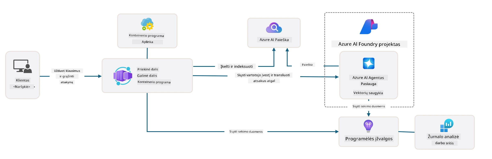

# 3. Išardyti šabloną

!!! tip "BY THE END OF THIS MODULE YOU WILL BE ABLE TO"

    - [ ] Aktyvuoti GitHub Copilot su MCP serveriais Azure pagalbai
    - [ ] Suprasti AZD šablono aplankų struktūrą ir komponentus
    - [ ] Išnagrinėti infrastruktūrą kaip kodą (Bicep) organizavimo modelius
    - [ ] **Lab 3:** Naudoti GitHub Copilot, kad ištirtumėte ir suprastumėte repozitorijos architektūrą 

---


Naudodami AZD šablonus ir Azure Developer CLI (`azd`), galime greitai pradėti savo AI kūrimo projektą su standartizuotais repozitorijomis, kurios suteikia pavyzdinį kodą, infrastruktūros ir konfigūracijos failus — paruoštą įdiegti _starter_ projektą.

**Tačiau dabar turime suprasti projekto struktūrą ir kodo bazę — ir gebėti pritaikyti AZD šabloną — be jokios ankstesnės patirties ar supratimo apie AZD!**

---

## 1. Aktyvuokite GitHub Copilot

### 1.1 Įdiekite GitHub Copilot Chat

Dabar laikas išbandyti [GitHub Copilot with Agent Mode](https://code.visualstudio.com/docs/copilot/chat/chat-agent-mode). Dabar galime naudoti natūralią kalbą apibūdinti užduotį aukštu lygiu ir gauti pagalbą jos vykdymui. Šiam laboratoriniam darbui naudosime [Copilot Free plan](https://github.com/github-copilot/signup), kuriame yra mėnesinis užbaigimų ir pokalbių interakcijų limitas.

Plėtinį galima įdiegti iš marketplace, tačiau jis turėtų būti jau prieinamas jūsų Codespaces aplinkoje. _Spustelėkite `Open Chat` iš Copilot piktogramos išskleidžiamojo meniu - ir įveskite užklausą, pvz., `What can you do?`_ - gali prireikti prisijungti. **GitHub Copilot Chat pasiruošęs**.

### 1.2. Įdiekite MCP serverius

Norint, kad Agent režimas būtų efektyvus, jam reikia prieigos prie tinkamų įrankių, kurie padėtų surinkti žinias ar atlikti veiksmus. Čia MCP serveriai gali padėti. Mes sukonfigūruosime šiuos serverius:

1. [Azure MCP Server](../../../../../workshop/docs/instructions)
1. [Microsoft Docs MCP Server](../../../../../workshop/docs/instructions)

Norėdami juos suaktyvinti:

1. Sukurkite failą `.vscode/mcp.json`, jei jis neegzistuoja
1. Kopijuokite žemiau pateiktą turinį į tą failą - ir paleiskite serverius!
   ```json title=".vscode/mcp.json"
   {
      "servers": {
         "Azure MCP Server": {
            "command": "npx",
            "args": [
            "-y",
            "@azure/mcp@latest",
            "server",
            "start"
            ]
         },
         "microsoft.docs.mcp": {
            "type": "http",
            "url": "https://learn.microsoft.com/api/mcp"
         }
      }
   }
   ```

??? warning "You may get an error that `npx` is not installed (click to expand for fix)"

      Norėdami ištaisyti, atidarykite failą `.devcontainer/devcontainer.json` ir pridėkite šią eilutę į features skyrių. Tada iš naujo pastatykite konteinerį. Dabar turėtumėte turėti įdiegtą `npx`.

      ```title="" linenums="0"
         "features": {
            "ghcr.io/devcontainers/features/node:1": {},
            ...
         },
      ```

---

### 1.3. Išbandykite GitHub Copilot Chat

**Pirmiausia naudokite `az login`, kad autentifikuotumėte Azure iš VS Code komandų eilutės.**

Dabar turėtumėte galėti užklausti savo Azure prenumeratos būsenos ir užduoti klausimus apie išdėstytus išteklius ar konfigūraciją. Išbandykite šias užklausas:

1. `List my Azure resource groups`
1. `#foundry list my current deployments`

Taip pat galite klausti apie Azure dokumentaciją ir gauti atsakymus, pagrįstus Microsoft Docs MCP serveriu. Išbandykite šias užklausas:

1. `#microsoft_docs_search What is Azure Developer CLI?`
1. `#microsoft_docs_search Show me a Python tutorial to chat with deployed model`

Arba galite paprašyti kodo fragmentų konkrečiai užduočiai užbaigti. Išbandykite šią užklausą.

1. `Give me a Python code example that uses AAD for an interactive chat client`

„Ask“ režime tai pateiks kodą, kurį galite nukopijuoti ir išbandyti. „Agent“ režime tai gali žengti dar vieną žingsnį ir sukurti atitinkamus išteklius jums — įskaitant diegimo scenarijus ir dokumentaciją — kad padėtų įvykdyti tą užduotį.

**Dabar esate pasiruošę pradėti tyrinėti šablono repozitoriją**

---

## 2. Išardyti architektūrą

??? prompt "ASK: Explain the application architecture in docs/images/architecture.png in 1 paragraph"

      Ši programa yra AI varoma pokalbių programa, sukurta Azure aplinkoje, kuri demonstruoja modernią agentinę architektūrą. Sprendimas sukasi apie Azure Container App, kuri talpina pagrindinį programos kodą, apdoroja vartotojo įvestį ir generuoja išmanius atsakymus per AI agentą.
      
      Architektūra remiasi Microsoft Foundry Project kaip AI galimybių pagrindu, jungiantis prie Azure AI paslaugų, kurios teikia kalbų modelius (pvz., GPT-4o-mini) ir agentų funkcionalumą. Vartotojo sąveika teka per React pagrindu sukurtą frontend’ą į FastAPI backend’ą, kuris bendrauja su AI agento paslauga, kad sugeneruotų kontekstinius atsakymus.
      
      Sistema įtraukia žinių atgavimo galimybes per failų paiešką arba Azure AI Search paslaugą, leidžiančią agentui pasiekti ir cituoti informaciją iš įkeltų dokumentų. Operaciniam meistriškumui užtikrinti architektūroje yra išsami stebėsena per Application Insights ir Log Analytics Workspace trasavimui, žurnalui ir našumo optimizavimui.
      
      Azure Storage suteikia blob saugyklą programos duomenims ir failų įkėlimams, o Managed Identity užtikrina saugų prieigos tarp Azure išteklių mechanizmą be slaptažodžių saugojimo. Visas sprendimas sukurtas siekiant skalės ir išlaikymo paprastumo, o konteinerizuota programa automatiškai pritaiko mastą pagal paklausą ir suteikia įmontuotą saugumą, stebėjimą ir CI/CD galimybes per Azure valdomų paslaugų ekosistemą.



---

## 3. Repozitorijos struktūra

!!! prompt "ASK: Explain the template folder structure. Start with a visual hierarchical diagram."

??? info "ANSWER: Visual Hierarchical Diagram"

      ```bash title="" 
      get-started-with-ai-agents/
      ├── 📋 Configuration & Setup
      │   ├── azure.yaml                    # Azure Developer CLI configuration
      │   ├── docker-compose.yaml           # Local development containers
      │   ├── pyproject.toml                # Python project configuration
      │   ├── requirements-dev.txt          # Development dependencies
      │   └── .devcontainer/                # VS Code dev container setup
      │
      ├── 🏗️ Infrastructure (infra/)
      │   ├── main.bicep                    # Main infrastructure template
      │   ├── api.bicep                     # API-specific resources
      │   ├── main.parameters.json          # Infrastructure parameters
      │   └── core/                         # Modular infrastructure components
      │       ├── ai/                       # AI service configurations
      │       ├── host/                     # Hosting infrastructure
      │       ├── monitor/                  # Monitoring and logging
      │       ├── search/                   # Azure AI Search setup
      │       ├── security/                 # Security and identity
      │       └── storage/                  # Storage account configs
      │
      ├── 💻 Application Source (src/)
      │   ├── api/                          # Backend API
      │   │   ├── main.py                   # FastAPI application entry
      │   │   ├── routes.py                 # API route definitions
      │   │   ├── search_index_manager.py   # Search functionality
      │   │   ├── data/                     # API data handling
      │   │   ├── static/                   # Static web assets
      │   │   └── templates/                # HTML templates
      │   ├── frontend/                     # React/TypeScript frontend
      │   │   ├── package.json              # Node.js dependencies
      │   │   ├── vite.config.ts            # Vite build configuration
      │   │   └── src/                      # Frontend source code
      │   ├── data/                         # Sample data files
      │   │   └── embeddings.csv            # Pre-computed embeddings
      │   ├── files/                        # Knowledge base files
      │   │   ├── customer_info_*.json      # Customer data samples
      │   │   └── product_info_*.md         # Product documentation
      │   ├── Dockerfile                    # Container configuration
      │   └── requirements.txt              # Python dependencies
      │
      ├── 🔧 Automation & Scripts (scripts/)
      │   ├── postdeploy.sh/.ps1           # Post-deployment setup
      │   ├── setup_credential.sh/.ps1     # Credential configuration
      │   ├── validate_env_vars.sh/.ps1    # Environment validation
      │   └── resolve_model_quota.sh/.ps1  # Model quota management
      │
      ├── 🧪 Testing & Evaluation
      │   ├── tests/                        # Unit and integration tests
      │   │   └── test_search_index_manager.py
      │   ├── evals/                        # Agent evaluation framework
      │   │   ├── evaluate.py               # Evaluation runner
      │   │   ├── eval-queries.json         # Test queries
      │   │   └── eval-action-data-path.json
      │   ├── sandbox/                      # Development playground
      │   │   ├── 1-quickstart.py           # Getting started examples
      │   │   └── aad-interactive-chat.py   # Authentication examples
      │   └── airedteaming/                 # AI safety evaluation
      │       └── ai_redteaming.py          # Red team testing
      │
      ├── 📚 Documentation (docs/)
      │   ├── deployment.md                 # Deployment guide
      │   ├── local_development.md          # Local setup instructions
      │   ├── troubleshooting.md            # Common issues & fixes
      │   ├── azure_account_setup.md        # Azure prerequisites
      │   └── images/                       # Documentation assets
      │
      └── 📄 Project Metadata
         ├── README.md                     # Project overview
         ├── CODE_OF_CONDUCT.md           # Community guidelines
         ├── CONTRIBUTING.md              # Contribution guide
         ├── LICENSE                      # License terms
         └── next-steps.md                # Post-deployment guidance
      ```

### 3.1. Pagrindinė programos architektūra

Šis šablonas laikosi **pilnos eilės (full-stack) žiniatinklio programos** modelio su:

- **Backend**: Python FastAPI su Azure AI integracija
- **Frontend**: TypeScript/React su Vite build sistema
- **Infrastruktūra**: Azure Bicep šablonai debesų ištekliams
- **Konteinerizacija**: Docker nuosekliam diegimui

### 3.2 Infrastruktūra kaip kodas (Bicep)

Infrastruktūros sluoksnis naudoja **Azure Bicep** šablonus, organizuotus moduliariai:

   - **`main.bicep`**: Koordinuoja visus Azure išteklius
   - **`core/` modules**: Pakartotinai naudojami komponentai skirtingoms paslaugoms
      - AI paslaugos (Azure OpenAI, AI Search)
      - Konteinerių talpinimas (Azure Container Apps)
      - Stebėsena (Application Insights, Log Analytics)
      - Saugumas (Key Vault, Managed Identity)

### 3.3 Programos šaltinis (`src/`)

**Galinė API (`src/api/`)**:

- REST API, paremta FastAPI
- Integracija su Foundry Agentais
- Paieškos indeksų valdymas žinių atgavimui
- Failų įkėlimo ir apdorojimo galimybės

**Frontend (`src/frontend/`)**:

- Moderni React/TypeScript SPA
- Vite greitam vystymui ir optimizuotiems build'ams
- Pokalbių sąsaja agentų sąveikoms

**Žinių bazė (`src/files/`)**:

- Pavyzdiniai klientų ir produktų duomenys
- Demonstruoja failų pagrindu atliekamą žinių atgavimą
- JSON ir Markdown formato pavyzdžiai


### 3.4 DevOps ir automatizavimas

**Skriptai (`scripts/`)**:

- Kryžminės platformos PowerShell ir Bash skriptai
- Aplinkos kintamųjų patikrinimas ir nustatymas
- Po diegimo konfigūravimas
- Modelių kvotų valdymas

**Azure Developer CLI integracija**:

- `azure.yaml` konfigūracija `azd` darbflows
- Automatizuotas teikimas ir diegimas
- Aplinkos kintamųjų valdymas

### 3.5 Testavimas ir kokybės užtikrinimas

**Įvertinimo sistema (`evals/`)**:

- Agentų našumo vertinimas
- Užklausų-atsakymų kokybės testavimas
- Automatizuotas vertinimo pipeline

**AI sauga (`airedteaming/`)**:

- Red team testavimas AI saugai
- Saugumo pažeidžiamumo skenavimas
- Atsakingos AI praktikos

---

## 4. Sveikiname 🏆

Jūs sėkmingai panaudojote GitHub Copilot Chat su MCP serveriais, kad ištirtumėte repozitoriją.

- [X] Aktyvavote GitHub Copilot Azure
- [X] Supratote programos architektūrą
- [X] Išnagrinėjote AZD šablono struktūrą

Tai suteikia jums supratimą apie šio šablono _infrastruktūrą kaip kodą_ turimus išteklius. Toliau peržiūrėsime konfigūracijos failą AZD.

---

<!-- CO-OP TRANSLATOR DISCLAIMER START -->
Atsakomybės apribojimas:
Šis dokumentas buvo išverstas naudojant dirbtinio intelekto vertimo paslaugą Co-op Translator (https://github.com/Azure/co-op-translator). Nors siekiame tikslumo, atkreipkite dėmesį, kad automatizuoti vertimai gali turėti klaidų ar netikslumų. Originalus dokumentas jo gimtąja kalba turėtų būti laikomas autoritetingu šaltiniu. Esant kritinei informacijai rekomenduojamas profesionalus (žmogaus) vertimas. Mes neatsakome už jokius nesusipratimus ar neteisingas interpretacijas, kilusias dėl šio vertimo naudojimo.
<!-- CO-OP TRANSLATOR DISCLAIMER END -->