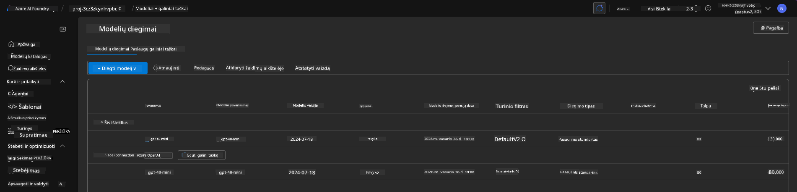
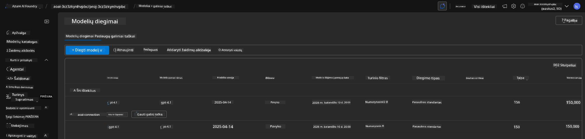

<!--
CO_OP_TRANSLATOR_METADATA:
{
  "original_hash": "6539a34c770f3ceff282370d72ee74dc",
  "translation_date": "2025-09-25T02:18:03+00:00",
  "source_file": "workshop/docs/instructions/6-Teardown-Infrastructure.md",
  "language_code": "lt"
}
-->
# 6. Infrastruktūros išardymas

!!! tipas "BAIGĘ ŠĮ MODULĮ GALĖSITE"

    - [ ] Punktas
    - [ ] Punktas
    - [ ] Punktas

---

## Papildomos užduotys

Prieš išardant projektą, skirkite kelias minutes laisvai tyrinėjimui.

!!! pavojus "NITYA-TODO: Pateikti keletą pasiūlymų, ką išbandyti"

---

## Infrastruktūros išardymas

1. Infrastruktūros išardymas yra toks paprastas kaip:

      ```bash title="" linenums="0"
      azd down --purge
      ```
1. `--purge` vėliava užtikrina, kad taip pat bus ištrinti minkštai ištrinti Cognitive Service resursai, taip atlaisvinant šių resursų užimtą kvotą. Kai procesas bus baigtas, pamatysite kažką panašaus į tai:

      ```bash title="" linenums="0"
      ? Total resources to delete: 11, are you sure you want to continue? Yes
      Deleting your resources can take some time.
      (✓) Done: Deleted resource group rg-nitya-mshack-azd
      (✓) Done: Purging Cognitive Account: aoai-3cz3zkynhvpbc

      SUCCESS: Your application was removed from Azure in 11 minutes 4 seconds.
      ```

1. (Pasirinktinai) Jei dabar vėl paleisite `azd up`, pastebėsite, kad gpt-4.1 modelis bus įdiegtas, nes aplinkos kintamasis buvo pakeistas (ir išsaugotas) vietiniame `.azure` aplanke.

      Štai modelio diegimai **prieš**:

      

      Ir štai jie **po**:
      

---

