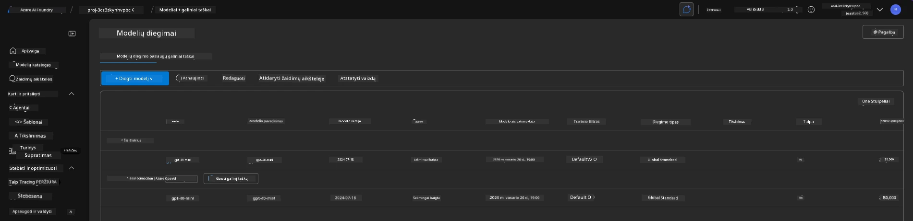
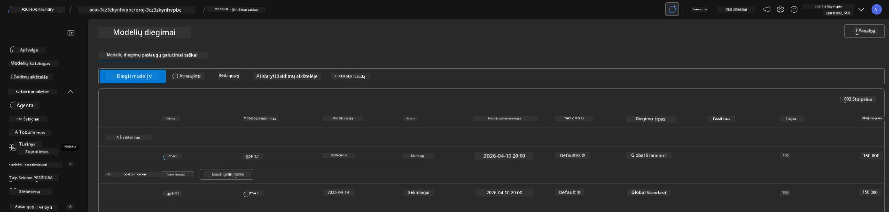

# 6. Infrastruktūros išardymas

!!! tip "MODULIO PABAIGOJE JŪS GALĖSITE"

    - [ ] Suprasti išteklių valymo ir kaštų valdymo svarbą
    - [ ] Naudoti `azd down`, kad saugiai pašalintumėte infrastruktūrą
    - [ ] Atkurti minkštai ištrintas kognityvines paslaugas, jei reikia
    - [ ] **Laboratorija 6:** Išvalyti Azure išteklius ir patikrinti jų pašalinimą

---

## Papildomi pratimai

Prieš išardydami projektą, skirkite kelias minutes atvirai tyrinėjimui.

!!! info "Išbandykite šias tyrinėjimo užklausas"

    **Eksperimentuokite su GitHub Copilot:**
    
    1. Paklauskite: `Kokius kitus AZD šablonus galėčiau išbandyti daugiaagentiniams scenarijams?`
    2. Paklauskite: `Kaip galiu pritaikyti agento nurodymus sveikatos priežiūros scenarijai?`
    3. Paklauskite: `Kokie aplinkos kintamieji valdo kaštų optimizavimą?`
    
    **Išnagrinėkite Azure portalą:**
    
    1. Peržiūrėkite Application Insights metrikas savo diegimui
    2. Patikrinkite paskirtų išteklių kaštų analizę
    3. Dar kartą ištirkite Microsoft Foundry portalo agentų žaidimų aikštelę

---

## Infrastruktūros pašalinimas

1. Infrastruktūros išardymas yra toks paprastas:
      
      ```bash title="" linenums="0"
      azd down --purge
      ```
1. `--purge` vėliava užtikrina, kad taip pat bus pašalinti minkštai ištrinti kognityvinių paslaugų ištekliai, taip atlaisvinant šių išteklių užimtą kvotą. Kai procesas bus baigtas, pamatysite kažką panašaus į tai:
      
      ```bash title="" linenums="0"
      ? Total resources to delete: 11, are you sure you want to continue? Yes
      Deleting your resources can take some time.
      (✓) Done: Deleted resource group rg-nitya-mshack-azd
      (✓) Done: Purging Cognitive Account: aoai-3cz3zkynhvpbc

      SUCCESS: Your application was removed from Azure in 11 minutes 4 seconds.
      ```

1. (Pasirinktinai) Jei dabar vėl paleisite `azd up`, pastebėsite, kad diegiamas gpt-4.1 modelis, nes aplinkos kintamasis buvo pakeistas (ir išsaugotas) vietiniame `.azure` aplanke. 

      Čia yra modelių diegimai **prieš**:

      

      O štai **po**:
      

---

<!-- CO-OP TRANSLATOR DISCLAIMER START -->
Atsakomybės apribojimas:
Šis dokumentas buvo išverstas naudojant dirbtinio intelekto vertimų paslaugą Co-op Translator (https://github.com/Azure/co-op-translator). Nors stengiamės užtikrinti tikslumą, atkreipkite dėmesį, kad automatizuoti vertimai gali turėti klaidų ar netikslumų. Originalus dokumentas jo gimtąja kalba turėtų būti laikomas autoritetingu šaltiniu. Esant kritinei informacijai, rekomenduojamas profesionalus žmogaus vertimas. Mes neatsakome už jokius nesusipratimus ar neteisingus aiškinimus, kylančius dėl šio vertimo naudojimo.
<!-- CO-OP TRANSLATOR DISCLAIMER END -->