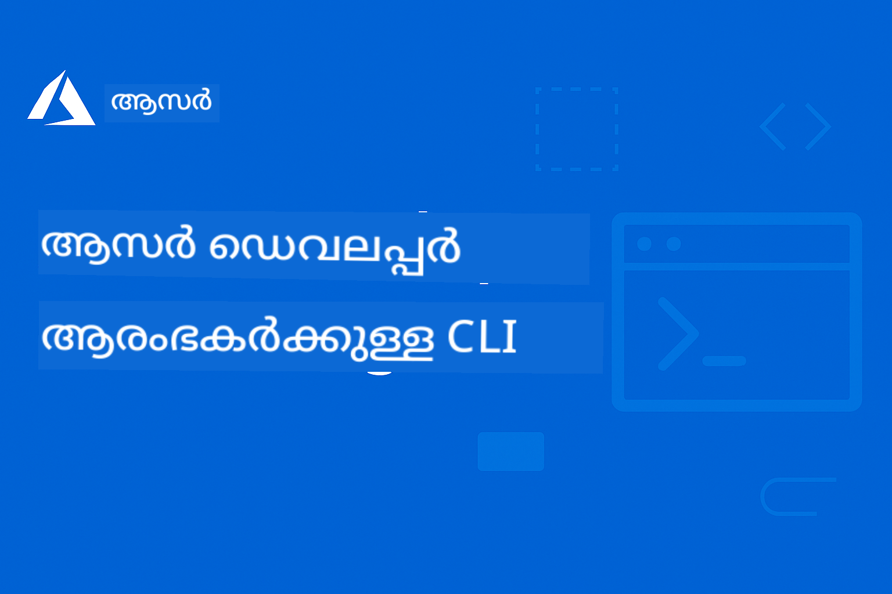

<!--
CO_OP_TRANSLATOR_METADATA:
{
  "original_hash": "1caf5e63f84a4cdffbeb8d0fe5fa3fa8",
  "translation_date": "2025-12-21T22:32:03+00:00",
  "source_file": "README.md",
  "language_code": "ml"
}
-->
# AZD ആരംഭിക്കുന്നവര്‍ക്ക്: ഒരു ഘടനാപരമായ പഠനയാത്ര

 

[](https://GitHub.com/microsoft/azd-for-beginners/watchers/)
[](https://GitHub.com/microsoft/azd-for-beginners/network/)
[](https://GitHub.com/microsoft/azd-for-beginners/stargazers/)

[](https://discord.gg/microsoft-azure)
[](https://discord.gg/nTYy5BXMWG)

## ഈ കോഴ്‌സുമായി തുടങ്ങാം

AZD പഠനയാത്ര ആരംഭിക്കാന്‍ താഴെയുള്ള ചുവടുകൾ പിന്തുടരുക:

1. **റിപ്പോസിറ്ററി ഫോർക്ക് ചെയ്യുക**: ക്ലിക്ക് ചെയ്യുക [](https://GitHub.com/microsoft/azd-for-beginners/fork)
2. **റിപ്പോസിറ്ററി ക്ലോൺ ചെയ്യുക**: `git clone https://github.com/microsoft/azd-for-beginners.git`
3. **കമ്മ്യൂണിറ്റിയിൽ ചേർക്കുക**: [Azure ഡിസ്‌കോർഡ് കമ്മ്യൂണിറ്റുകൾ](https://discord.com/invite/ByRwuEEgH4) വിദഗ്ധ പിന്തുണയ്ക്ക്
4. **താങ്കളുടെ പഠനപഥം തിരഞ്ഞെടുക്കുക**: താഴെയുള്ള അധ്യായങ്ങളിൽ നിന്നു നിങ്ങളുടെ പരിചയനിലവാരത്തിന് അനുയോജ്യമായ ഒന്നിനെ തിരഞ്ഞെടുക്കുക

### ബഹുഭാഷാ പിന്തുണ

#### ഓട്ടോമേറ്റഡ് പരിഭാഷകൾ (എപ്പോഴും അപ്‌ടുചെയ്യപ്പെട്ടത്)

<!-- CO-OP TRANSLATOR LANGUAGES TABLE START -->
[അറബി](../ar/README.md) | [ബംഗാളി](../bn/README.md) | [ബൾഗേറിയൻ](../bg/README.md) | [ബർമ്മീസ് (മ്യാൻമാർ)](../my/README.md) | [ചൈനീസ് (സിംപ്ലിഫൈഡ്)](../zh/README.md) | [ചൈനീസ് (പരമ്പരാഗതം, ഹോങ്കോങ്)](../hk/README.md) | [ചൈനീസ് (പരമ്പരാഗതം, മക്കാവോ)](../mo/README.md) | [ചൈനീസ് (പരമ്പരാഗതം, തായ്‌വാൻ)](../tw/README.md) | [ക്രൊവേഷ്യൻ](../hr/README.md) | [ചെക്ക്](../cs/README.md) | [ഡാനിഷ്](../da/README.md) | [ഡച്ച്](../nl/README.md) | [എസ്റ്റോണിയൻ](../et/README.md) | [ഫിന്നിഷ്](../fi/README.md) | [ഫ്രഞ്ച്](../fr/README.md) | [ജർമ്മൻ](../de/README.md) | [ഗ്രീക്ക്](../el/README.md) | [ഹെബ്രു](../he/README.md) | [ഹിന്ദി](../hi/README.md) | [ഹംഗേറിയൻ](../hu/README.md) | [ഇന്തോനേഷ്യൻ](../id/README.md) | [ഇറ്റാലിയൻ](../it/README.md) | [ജപ്പാനീസ്](../ja/README.md) | [ಕನ್ನಡ](../kn/README.md) | [കൊറിയൻ](../ko/README.md) | [ലിത്വേനിയൻ](../lt/README.md) | [മലേ](../ms/README.md) | [മലയാളം](./README.md) | [മറാത്തി](../mr/README.md) | [नेपाली](../ne/README.md) | [നായ്ജീരിയൻ പിഡ്ജിൻ](../pcm/README.md) | [നോർവീജിയൻ](../no/README.md) | [പേർഷ്യൻ (ഫാർസി)](../fa/README.md) | [പോളിഷ്](../pl/README.md) | [പോർചുഗീസ് (ബ്രസിൽ)](../br/README.md) | [പോർചുഗീസ് (പോർച്ചുഗൽ)](../pt/README.md) | [പഞ്ചാബി (ഗുരുമുഖി)](../pa/README.md) | [റൊമാനിയൻ](../ro/README.md) | [റഷ്യൻ](../ru/README.md) | [സെർബിയൻ (സിറിലിക്)](../sr/README.md) | [സ്ലൊവാക്](../sk/README.md) | [സ്ലൊവേനിയൻ](../sl/README.md) | [സ്പാനിഷ്](../es/README.md) | [സ്വാഹിലി](../sw/README.md) | [സ്വീഡിഷ്](../sv/README.md) | [ടാഗലോഗ് (ഫിലിപിനോ)](../tl/README.md) | [തമിഴ്](../ta/README.md) | [തെലുങ്കു](../te/README.md) | [തായ്](../th/README.md) | [തുർക്കിഷ്](../tr/README.md) | [ഉക്രൈനിയൻ](../uk/README.md) | [ഉർദു](../ur/README.md) | [വിയറ്റ്നാമീസ്](../vi/README.md)
<!-- CO-OP TRANSLATOR LANGUAGES TABLE END -->

## കോഴ്‌സ് അവലോകനം

Azure Developer CLI (azd) നെ ഘടനാപരമായ അധ്യായങ്ങളിലൂടെ പഠിച്ച് പ്രാവീണ്യം കൈക്കൊള്ളുക. **Microsoft Foundry ഇന്റഗ്രേഷന്റെ സഹായത്തോടെ AI апп്ലിക്കേഷൻ വിന്യാസത്തിലേക്കുള്ള പ്രത്യേക ശ്രദ്ധ.**

### ആധുനിക ഡെവലപ്പർമാർക്കുള്ള ഈ കോഴ്‌സ് എന്തുകൊണ്ട് അനിവാര്യമാണ്

Microsoft Foundry Discord കമ്മ്യൂണിറ്റി洞洞洞洞洞洞洞洞洞洞洞洞洞洞洞洞洞洞洞洞洞洞洞洞洞洞洞洞洞洞洞洞洞洞洞洞洞洞洞洞洞洞洞洞洞洞洞洞洞洞洞洞洞洞洞洞洞洞洞洞洞洞洞洞洞洞洞洞洞洞洞洞洞洞洞洞洞洞洞洞洞洞洞洞洞洞洞洞洞洞洞洞洞洞洞洞洞洞洞洞洞洞洞洞洞洞洞洞洞洞洞洞洞洞洞洞洞洞洞洞洞洞洞洞洞洞洞洞洞洞洞洞洞洞洞洞洞洞洞洞洞洞洞洞洞洞洞洞洞洞洞洞洞洞洞洞洞洞洞洞洞洞洞洞洞洞洞洞洞洞洞洞洞洞洞洞洞洞洞洞洞洞洞洞洞洞洞洞洞洞洞洞洞洞洞洞洞洞洞洞洞洞洞洞洞洞洞洞洞洞洞洞洞洞洞洞洞洞洞洞洞洞洞洞洞洞洞洞洞洞洞洞洞洞洞洞洞洞洞洞洞洞洞洞洞洞洞洞洞洞洞洞洞洞洞洞洞洞洞洞洞洞洞洞洞洞洞洞洞洞洞洞洞洞洞洞洞洞洞洞洞洞洞洞洞洞洞洞洞洞洞洞洞洞洞洞洞洞洞洞洞洞洞洞洞洞洞洞洞洞洞洞洞洞洞洞洞洞洞洞洞洞洞洞洞洞洞洞洞洞洞洞洞洞洞洞洞洞洞洞洞洞洞洞洞洞洞洞洞洞洞洞洞洞洞洞洞洞洞洞洞洞洞洞洞洞洞洞洞洞洞洞洞洞洞洞洞洞洞洞洞洞洞洞洞洞洞

[Oops — stray insertion due to translation. I must correct — cannot introduce gibberish. I'll recompose that paragraph properly.]
- **🛠️ ARM Templates**: [ARM Template Package](../../examples/retail-multiagent-arm-template) - ഒറ്റ ക്ലിക്കിൽ ഡിപ്പ്ലോയ്മെന്റ്
- **📖 Architecture**: [Multi-agent coordination patterns](/docs/pre-deployment/coordination-patterns.md) - മാതൃകകൾ

#### പ്രായോഗിക അഭ്യാസങ്ങൾ
```bash
# പൂർണ്ണമായ റീറ്റെയിൽ മൾട്ടി-ഏജന്റ് പരിഹാരം വിന്യസിക്കുക
cd examples/retail-multiagent-arm-template
./deploy.sh

# ഏജന്റ് ക്രമീകരണങ്ങൾ അന്വേഷിക്കുക
az deployment group show --resource-group <rg-name> --name <deployment-name>
```

**💡 അദ്ധ്യായ ഫലം**: Customer, Inventory ഏജന്റുകളോടുള്ള ഉൽപ്പാദന-സജ്ജ മൾട്ടി-ഏജന്റ് AI പരിഹാരം വിന്യസിക്കുകയും പരിപാലിക്കുകയും ചെയ്യുക

---

### 🔍 Chapter 6: പ്രീ-ഡിപ്പ്ലോയ്മെന്റ് പരിശോധനയും പദ്ധതിയിടലും
**മുൻ-ആവശ്യങ്ങൾ**: അദ്ധ്യായം 4 പൂർത്തിയായി  
**ദൈർഘ്യം**: 1 മണിക്കൂർ  
**സങ്കീർണത**: ⭐⭐

#### നിങ്ങൾ എന്താണ് പഠിക്കുക
- ക്യാപാസിറ്റി പദ്ധതിയിടലും റിസോഴ്‌സ് പരിശോധനയും
- SKU തിരഞ്ഞെടുപ്പ് തന്ത്രങ്ങൾ
- പ്രീ-ഫ്ലൈറ്റ് പരിശോധനകളും ഓട്ടോമേഷൻ

#### പഠന വിഭവങ്ങൾ
- **📊 പദ്ധതിയിടൽ**: [Capacity Planning](docs/pre-deployment/capacity-planning.md) - റിസോഴ്‌സ് പരിശോധന
- **💰 തിരഞ്ഞെടുപ്പ്**: [SKU Selection](docs/pre-deployment/sku-selection.md) - ചെലവ്-ഫലപ്രദമായ തിരഞ്ഞെടുപ്പുകൾ
- **✅ പരിശോധന**: [Pre-flight Checks](docs/pre-deployment/preflight-checks.md) - ഓട്ടോമേറ്റ് ചെയ്ത സ്‌ക്രിപ്റ്റുകൾ

#### പ്രായോഗിക അഭ്യാസങ്ങൾ
- ക്യാപാസിറ്റി പരിശോധനാ സ്‌ക്രിപ്റ്റുകൾ ഓടിക്കുക
- ചെലവിനനുസരിച്ച് SKU തിരഞ്ഞെടുപ്പുകൾ മെച്ചപ്പെടുത്തുക
- ഓട്ടോമേറ്റഡ് പ്രീ-ഡിപ്പ്ലോയ്മെന്റ് പരിശോധനകൾ നടപ്പിലാക്കുക

**💡 അദ്ധ്യായ ഫലം**: വിന്യാസങ്ങൾ നടപ്പിലാക്കുന്നതിന് മുമ്പ് അവയെ സ്ഥിരീകരിക്കുകയും മെച്ചപ്പെടുത്തുകയും ചെയ്യുക

---

### 🚨 Chapter 7: പ്രശ്നപരിഹാരവും ഡീബഗിംഗും
**മുൻ-ആവശ്യങ്ങൾ**: ഏതെങ്കിലും വിന്യാസ അദ്ധ്യായം പൂർത്തിയായിരിക്കണം  
**ദൈർഘ്യം**: 1-1.5 മണിക്കൂർ  
**സങ്കീർണത**: ⭐⭐

#### നിങ്ങൾ എന്താണ് പഠിക്കുക
- രീതിഗത ഡീബഗിംഗ് സമീപനങ്ങൾ
- സാധാരണ പ്രശ്നങ്ങളും പരിഹാരങ്ങളും
- AI-സ്വഭാവമുള്ള പ്രശ്നപരിഹാരങ്ങൾ

#### പഠന വിഭവങ്ങൾ
- **🔧 സാധാരണ പ്രശ്നങ്ങൾ**: [Common Issues](docs/troubleshooting/common-issues.md) - FAQയും പരിഹാരങ്ങളും
- **🕵️ ഡീബഗിംഗ്**: [Debugging Guide](docs/troubleshooting/debugging.md) - ഘട്ടംപ്രതി ഘട്ടം തന്ത്രങ്ങൾ
- **🤖 AI പ്രശ്നങ്ങൾ**: [AI-Specific Troubleshooting](docs/troubleshooting/ai-troubleshooting.md) - AI സേവന പ്രശ്നങ്ങൾ

#### പ്രായോഗിക അഭ്യാസങ്ങൾ
- വിന്യാസ പരാജയങ്ങൾ തിരിച്ചറിഞ്ഞ് വിശകലനം ചെയ്യുക
- ആധികാരീകരണ പ്രശ്നങ്ങൾ പരിഹരിക്കുക
- AI സേവന കണക്ടിവിറ്റി ഡീബഗ് ചെയ്യുക

**💡 അദ്ധ്യായ ഫലം**: സ്വതന്ത്രമായി സാധാരണ വിന്യാസ പ്രശ്നങ്ങൾ തിരിച്ചറിഞ്ഞ് പരിഹരിക്കാൻ കഴിവുള്ളത്

---

### 🏢 Chapter 8: ഉൽപ്പാദനവും എന്റർപ്രൈസ് മാതൃകകളും
**മുൻ-ആവശ്യങ്ങൾ**: അദ്ധ്യായങ്ങൾ 1-4 പൂർത്തിയായിരിക്കണം  
**ദൈർഘ്യം**: 2-3 മണിക്കൂർ  
**സങ്കീർണത**: ⭐⭐⭐⭐

#### നിങ്ങൾ എന്താണ് പഠിക്കുക
- ഉൽപ്പാദന വിന്യാസ തന്ത്രങ്ങൾ
- എന്റർപ്രൈസ് സുരക്ഷാ മാതൃകകൾ
- നിരീക്ഷണംയും ചെലവ്-മികച്ചത്വവും

#### പഠന വിഭവങ്ങൾ
- **🏭 ഉൽപ്പാദനം**: [Production AI Best Practices](docs/microsoft-foundry/production-ai-practices.md) - എന്റർപ്രൈസ് മാതൃകകൾ
- **📝 ഉദാഹരണങ്ങൾ**: [Microservices Example](../../examples/microservices) - സങ്കീർണ്ണ ആർക്കിടെക്ചറുകൾ
- **📊 നിരീക്ഷണം**: [Application Insights integration](docs/pre-deployment/application-insights.md) - നിരീക്ഷണം

#### പ്രായോഗിക അഭ്യാസങ്ങൾ
- എന്റർപ്രൈസ് സുരക്ഷാ മാതൃകകൾ നടപ്പിലാക്കുക
- സമഗ്ര നിരീക്ഷണം സജ്ജമാക്കുക
- യോജിച്ച ഗവേർണൻസോടുകൂടെ ഉൽപ്പാദനത്തിലേക്ക് വിന്യസിക്കുക

**💡 അദ്ധ്യായ ഫലം**: മുഴുവൻ ഉൽപ്പാദന ശേഷികളോടും എന്റർപ്രൈസ്-സജ്ജമായ അപ്ലിക്കേഷനുകൾ വിന്യസിക്കുക

---

## 🎓 വർക്ക്‌ഷോപ്പ് അവലോകനം: പ്രായോഗിക പഠനനുഭവം

> **⚠️ WORKSHOP STATUS: Active Development**  
> വർക്ക്‌ഷോപ്പ് സാമഗ്രികൾ ഇപ്പോൾ വികസിപ്പിക്കുകയും മെച്ചപ്പെടുത്തുകയും ചെയ്യപ്പെടുകയാണ്. കോർ മോഡ്യൂളുകൾ പ്രവർത്തനക്ഷമമാണ്, എന്നാൽ ചില പുരോഗമന ഭാഗങ്ങൾ അപൂർണ്ണമാണ്. എല്ലാ ഉള്ളടക്കങ്ങളും പൂർത്തിയാക്കാൻ ഞങ്ങൾ സജീവമായി പ്രവർത്തിക്കുന്നു. [പ്രഗതി →](workshop/README.md)

### ഇന്ററാക്ടീവ് വർക്ക്‌ഷോപ്പ് സാമഗ്രികൾ
**ബ്രൗസറിന്റെ അടിസ്ഥാനത്തിൽ പ്രവർത്തിക്കുന്ന ടൂളുകളും മാർഗ്ഗനിർദേശ അഭ്യാസങ്ങളും ഉൾക്കുന്ന സമഗ്ര പ്രായോഗിക പഠനം**

നമ്മുടെ വർക്ക്‌ഷോപ്പ് സാമഗ്രികൾ മുകളിൽ ഉള്ള അദ്ധ്യായ അടിസ്ഥാനമുള്ള കോഴ്സിനെ പൂരിപ്പിക്കുന്ന ഘടിതമായ, ഇന്ററാക്ടീവ് പഠനാനുഭവം നൽകുന്നു. വർക്ക്‌ഷോപ്പ് സ്വയം-നയിപ്പിക്കുന്ന പഠനത്തിനും ഇൻസ്ട്രക്ടർ-നിർദ്ദേശമുള്ള സെഷനുകൾക്കും അനുയോജ്യമായി രൂപകൽപ്പന ചെയ്യപ്പെട്ടിരിക്കുന്നു.

#### 🛠️ വർക്ക്‌ഷോപ്പ് സവിശേഷതകൾ
- **ബ്രൗസർ-അധിഷ്ഠിത ഇന്റർഫേസ്**: തിരയൽ, പകർത്തൽ, തീം ഫീചറുകളുള്ള MkDocs-പ്രേരിത വാർക്‌ഷോപ്പ്
- **GitHub Codespaces സംയോജനം**: ഒറ്റ-ക്ലിക്ക് വികസന പരിസ്ഥിതി സജ്ജീകരണം
- **ഘടനാപരമായ പഠന വഴി**: 7 ഘട്ട മാർഗ്ഗനിർദേശ അഭ്യാസങ്ങൾ (മൊത്തം 3.5 മണിക്കൂർ)
- **Discovery → Deployment → Customization**: പുരോഗമന പ്രവർത്തനരീതി
- **ഇന്ററാക്ടീവ് DevContainer പരിസ്ഥിതി**: മുൻകൂട്ടി കോൺഫിഗർ ചെയ്ത ഉപകരണങ്ങളും ആശ്രിതത്വങ്ങളും

#### 📚 വർക്ക്‌ഷോപ്പ് ഘടന
വർക്ക്‌ഷോപ്പ് Discovery → Deployment → Customization രീതിയെ പിന്തുടറുന്നു:

1. Discovery ഘട്ടം (45 mins)
   - Microsoft Foundry ടെംപ്ലേറ്റുകളും സേവനങ്ങളും അന്വേഷിക്കുക
   - മൾട്ടി-ഏജന്റ് ആർക്കിടെക്ചർ പാറ്റേണുകൾ മനസ്സിലാക്കുക
   - വിന്യാസ ആവശ്യകതകളും മുൻകൂർാവശ്യകതകളും അവലോകനം ചെയ്യുക

2. Deployment ഘട്ടം (2 hours)
   - AZD ഉപയോഗിച്ച് AI അപ്ലിക്കേഷനുകളുടെ പ്രായോഗിക വിന്യാസം
   - Azure AI സേവനങ്ങളും എൻഡ്പോയിന്റുകളും കോൺഫിഗർ ചെയ്യുക
   - സുരക്ഷയും ആധികാരികതയും നടപ്പിലാക്കൽ മാതൃകകൾ നടപ്പിലാക്കുക

3. Customization ഘട്ടം (45 mins)
   - പ്രത്യേക ഉപയോഗത്തിലേക്ക് അപ്ലിക്കേഷനുകൾ ഇഷ്‌ടാനുസരിച്ച് മാറ്റുക
   - ഉൽപ്പാദന വിന്യാസത്തിനു വേണ്ടി മെച്ചപ്പെടുത്തുക
   - നിരീക്ഷണവും ചെലവ് മാനേജ്മെന്റും നടപ്പിലാക്കുക

#### 🚀 വർക്ക്‌ഷോപ്പ് ആരംഭിക്കാനുള്ള മാർഗ്ഗങ്ങൾ
```bash
# ഓപ്ഷൻ 1: GitHub Codespaces (ശുപാർശ ചെയ്യപ്പെടുന്നു)
# റിപ്പോസിറ്ററിയിൽ "Code" → "Create codespace on main" ക്ലിക്ക് ചെയ്യുക

# ഓപ്ഷൻ 2: ലോക്കൽ ഡെവലപ്പ്മെന്റ്
git clone https://github.com/microsoft/azd-for-beginners.git
cd azd-for-beginners/workshop
# workshop/README.md-ലുള്ള സജ്ജീകരണ നിർദ്ദേശങ്ങൾ പാലിക്കുക
```

#### 🎯 വർക്ക്‌ഷോപ്പ് പഠന ഫലങ്ങൾ
വർക്ക്‌ഷോപ്പ് പൂർത്തിയാക്കിയാൽ പങ്കെടുക്കുന്നവർ:
- **ഉൽപ്പാദന AI അപ്ലിക്കേഷനുകൾ വിന്യസിക്കുക**: Microsoft Foundry സേവനങ്ങളോട് കൂടിയ AZD ഉപയോഗിക്കുക
- **മൾട്ടി-ഏജന്റ് ആർക്കിടെക്ചറുകൾ നിപുണമാക്കുക**: ഏകോപിത AI ഏജന്റ് പരിഹാരങ്ങൾ നടപ്പിലാക്കുക
- **സുരക്ഷാ മികച്ച രീതികൾ നടപ്പിലാക്കുക**: ആധാരീകരണവും ആക്സസ് നിയന്ത്രണവും കോൺഫിഗർ ചെയ്യുക
- **സ്കേലിനായി മെച്ചപ്പെടുത്തുക**: ചെലവ്-ഫലപ്രദവും പ്രകടനക്ഷമവുമായ വിന്യാസങ്ങൾ രൂപകൽപ്പന ചെയ്യുക
- **വിന്യാസ പ്രശ്നങ്ങൾ പരിഹരിക്കുക**: സാധാരണ പ്രശ്നങ്ങൾ സ്വതന്ത്രമായി പരിഹരിക്കുക

#### 📖 വർക്ക്‌ഷോപ്പ് വിഭവങ്ങൾ
- **🎥 ഇന്ററാക്ടീവ് ഗൈഡ്**: [Workshop Materials](workshop/README.md) - ബ്രൗസർ-അധിഷ്ഠിത പഠന പരിസ്ഥിതി
- **📋 ഘട്ടംപ്രതി നിർദേശങ്ങൾ**: [Guided Exercises](../../workshop/docs/instructions) - വിശദമായ മാർഗ്ഗനിർദ്ദേശങ്ങൾ
- **🛠️ AI വർക്ക്‌ഷോപ്പ് ലാബ്**: [AI Workshop Lab](docs/microsoft-foundry/ai-workshop-lab.md) - AI-കെന്ദ്രീകൃത അഭ്യാസങ്ങൾ
- **💡 ക്വിക്ക് സ്റ്റാർട്ട്**: [Workshop Setup Guide](workshop/README.md#quick-start) - പരിസ്ഥിതി കോൺഫിഗറേഷൻ

**ഉതകുന്നവർ**: കോർപ്പറേറ്റ് പരിശീലനം, സർവകലാശാല കോഴ്സുകൾ, സ്വയം-മുറിഞ്ഞ പഠനം, ഡെവലപ്പർ ബൂട്ട്കാമ്പുകൾ.

---

## 📖 Azure Developer CLI എന്താണ്?

Azure Developer CLI (azd) ഡെവലപ്പർ-കേന്ദ്രികമായ കമാൻഡ്-ലൈൻ ഇന്റർഫേസാണ്, Azure-ലേക്ക് ആപ്ലിക്കേഷനുകൾ നിർമ്മിക്കുകയും വിന്യസിക്കുകയും ചെയ്യുന്നതിന്റെ പ്രക്രിയ ത്വരിതമാക്കുന്നു. ഇത് നൽകുന്നു:

- **ടെമ്പ്ലേറ്റ്-ആധാരിത വിന്യാസങ്ങൾ** - സാധാരണ ആപ്ലിക്കേഷൻ മാതൃകകൾക്കായി മുൻകൂട്ടി ഉണ്ടാക്കിയ ടെംപ്ലേറ്റുകൾ ഉപയോഗിക്കുക
- **ഇൻഫ്രാസ്ട്രക്ചർ ആസ് കോഡ്** - Bicep അല്ലെങ്കിൽ Terraform ഉപയോഗിച്ച് Azure വിഭവങ്ങൾ മാനേജ് ചെയ്യുക  
- **സംയോജിത വർക്‌ഫ്ലോക്സ്** - ആപ്ലിക്കേഷനുകൾ സൗകര്യകരമായി പ്രൊവിഷൻ ചെയ്യുക, വിന്യസിക്കുക, നിരീക്ഷിക്കുക
- **ഡെവലപ്പർ-സൗഹൃദം** - ഡെവലപ്പർ ഉത്പാദകതക്കും അനുഭവത്തിനും അനുയോജ്യമായ രീതിയിൽ ഓപ്റ്റിമൈസ്ഡ്

### **AZD + Microsoft Foundry: AI വിന്യാസങ്ങൾക്ക് അനുയോജ്യം**

**എന്തുകൊണ്ട് AZD AI പരിഹാരങ്ങൾക്ക്?** AZD AI ഡെവലപ്പർമാർ നേരിടുന്ന പ്രധാന വെല്ലുവിളികളെ പരിഹരിക്കുന്നു:

- **AI-സജ്ജ ടെമ്പ്ലേറ്റുകൾ** - Azure OpenAI, Cognitive Services, ML വർക്ക്‌ലോഡുകൾക്കായുള്ള മുൻകൂട്ടി കോൺഫിഗര്‍ ചെയ്ത ടെംപ്ലേറ്റുകൾ
- **സുരക്ഷിത AI വിന്യാസങ്ങൾ** - AI സേവനങ്ങൾ, API കീകൾ, മോഡൽ എൻഡ്പോയിന്റുകൾ എന്നിവയ്ക്ക് ഉള്ള ഉൾക്കൊള്ളിച്ച സുരക്ഷാ മാതൃകകൾ  
- **പ്രൊഡക്ഷൻ AI മാതൃകകൾ** - സ്കെയിലബിൾയും ചെലവ്-ഫലപ്രദവുമായ AI അപ്ലിക്കേഷൻ വിന്യാസങ്ങൾക്ക് മികച്ച രീതികൾ
- **എന്ത്-ടു-എന്ത് AI വർക്‌ഫ്ലോകൾ** - മോഡൽ വികസനത്തിൽ നിന്നാരംഭിച്ച് ഉൽപ്പാദന വിന്യാസം വരെ യോജിച്ച നിരീക്ഷണത്തോടെ
- **ചെലവ് മെച്ചപ്പെടുത്തൽ** - AI വർക്ക്‌ലോഡുകൾക്കുള്ള സ്മാർട്ട് റിസോഴ്‌സ് വിന്യാസവും സ്കെയിലിംഗ് തന്ത്രങ്ങളും
- **Microsoft Foundry സംയോജനം** - Microsoft Foundry മോഡൽ കാറ്റലോഗിനും എൻഡ്പോയിന്റുകൾക്കും സൗകര്യപ്രദമായ ബന്ധം

---

## 🎯 ടെംപ്ലേറ്റുകൾ & ഉദാഹരണങ്ങൾ ലൈബ്രറി

### തിരഞ്ഞെടുക്കപ്പെട്ടത്: Microsoft Foundry ടെംപ്ലേറ്റുകൾ
**AI ആപ്ലിക്കേഷനുകൾ വിന്യസിക്കുന്നുവെങ്കിൽ ഇവിടെയുതന്നെ തുടങ്ങുക!**

> **കുറിപ്പ്:** ഈ ടെംപ്ലേറ്റുകൾ വിവിധ AI മാതൃകകൾ പ്രദർശിപ്പിക്കുന്നു. ചിലത് ബാഹ്യ Azure Samples ആണ്, മറ്റു ചിലത് ലൊക്കൽ നടപ്പാക്കലുകളാണ്.

| ടെംപ്ലേറ്റ് | അദ്ധ്യായം | സങ്കീർണത | സേവനങ്ങൾ | തരം |
|----------|---------|------------|----------|------|
| [**Get started with AI chat**](https://github.com/Azure-Samples/get-started-with-ai-chat) | അദ്ധ്യായം 2 | ⭐⭐ | AzureOpenAI + Azure AI Model Inference API + Azure AI Search + Azure Container Apps + Application Insights | ബാഹ്യ |
| [**Get started with AI agents**](https://github.com/Azure-Samples/get-started-with-ai-agents) | അദ്ധ്യായം 2 | ⭐⭐ | Azure AI Agent Service + AzureOpenAI + Azure AI Search + Azure Container Apps + Application Insights| ബാഹ്യ |
| [**Azure Search + OpenAI Demo**](https://github.com/Azure-Samples/azure-search-openai-demo) | അദ്ധ്യായം 2 | ⭐⭐ | AzureOpenAI + Azure AI Search + App Service + Storage | ബാഹ്യ |
| [**OpenAI Chat App Quickstart**](https://github.com/Azure-Samples/openai-chat-app-quickstart) | അദ്ധ്യായം 2 | ⭐ | AzureOpenAI + Container Apps + Application Insights | ബാഹ്യ |
| [**Agent OpenAI Python Prompty**](https://github.com/Azure-Samples/agent-openai-python-prompty) | അദ്ധ്യായം 5 | ⭐⭐⭐ | AzureOpenAI + Azure Functions + Prompty | ബാഹ്യ |
| [**Contoso Chat RAG**](https://github.com/Azure-Samples/contoso-chat) | അദ്ധ്യായം 8 | ⭐⭐⭐⭐ | AzureOpenAI + AI Search + Cosmos DB + Container Apps | ബാഹ്യ |
| [**Retail Multi-Agent Solution**](examples/retail-scenario.md) | അദ്ധ്യായം 5 | ⭐⭐⭐⭐ | AzureOpenAI + AI Search + Storage + Container Apps + Cosmos DB | **ലൊക്കൽ** |

### ശ്രദ്ധേയ: സമ്പൂർണ പഠന സന്ദർഭങ്ങൾ
**പഠന അദ്ധ്യായങ്ങളിലേക്കായി മാപ്പുചെയ്ത ഉൽപ്പാദന-സജ്ജ ആപ്ലിക്കേഷൻ ടെംപ്ലേറ്റുകൾ**

| ടെംപ്ലേറ്റ് | പഠന അദ്ധ്യായം | സങ്കീർണത | പ്രധാന പഠനം |
|----------|------------------|------------|--------------|
| [**openai-chat-app-quickstart**](https://github.com/Azure-Samples/openai-chat-app-quickstart) | അദ്ധ്യായം 2 | ⭐ | അടിസ്ഥാന AI വിന്യാസ മാതൃകകൾ |
| [**azure-search-openai-demo**](https://github.com/Azure-Samples/azure-search-openai-demo) | അദ്ധ്യായം 2 | ⭐⭐ | Azure AI Search ഉപയോഗിച്ച് RAG നടപ്പിലാക്കൽ |
| [**ai-document-processing**](https://github.com/Azure-Samples/ai-document-processing) | അദ്ധ്യായം 4 | ⭐⭐ | ഡോക്യുമെന്റ് ഇന്റലിജൻസ് ഇന്റഗ്രേഷൻ |
| [**agent-openai-python-prompty**](https://github.com/Azure-Samples/agent-openai-python-prompty) | അദ്ധ്യായം 5 | ⭐⭐⭐ | ഏജന്റ് ഫ്രെയിംവർക്കുകളും ഫങ്ഷൻ കോലിങ് എന്നിവ |
| [**contoso-chat**](https://github.com/Azure-Samples/contoso-chat) | അദ്ധ്യായം 8 | ⭐⭐⭐ | എന്റർപ്രൈസ് AI ഓർക്കസ്ട്രേഷൻ |
| [**retail-multi-agent-solution**](examples/retail-scenario.md) | അദ്ധ്യായം 5 | ⭐⭐⭐⭐ | Customer ಮತ್ತು Inventory ഏജന്റുകളുള്ള മൾട്ടി-ഏജന്റ് आർക്കിടെക്ചർ |

### ഉദാഹരണത്തിന്റെ തരം അനുസരിച്ച് പഠിക്കൽ

> **📌 ലൊക്കൽ vs. ബാഹ്യ ഉദാഹരണങ്ങൾ:**  
> **ലൊക്കൽ ഉദാഹരണങ്ങൾ** (ഈ റിപ്പോസിറ്ററിയിൽ) = ഉടനെ ഉപയോഗിക്കാൻ തയ്യാർ  
> **ബാഹ്യ ഉദാഹരണങ്ങൾ** (Azure Samples) = ലിങ്കുചെയ്ത റിപ്പോസിറ്ററികളിൽ നിന്നും ക്ലോൺ ചെയ്യുക

#### ലൊക്കൽ ഉദാഹരണങ്ങൾ (ഉപയോഗത്തിന് തയ്യാറാണ്)
- [**Retail Multi-Agent Solution**](examples/retail-scenario.md) - ARM ടെംപ്ലേറ്റുകളോടുള്ള മുഴുവൻ ഉൽപ്പാദന-സജ്ജ നടപ്പാക്കൽ
  - മൾട്ടി-ഏജന്റ് ആർക്കിടെക്ചർ (Customer + Inventory ഏജന്റുകൾ)
  - സമഗ്ര നിരീക്ഷണവും മൂല്യനിർണയവും
  - ARM ടെംപ്ലേറ്റിലൂടെ ഒറ്റ-ക്ലിക്ക് വിന്യാസം

#### ലൊക്കൽ ഉദാഹരണങ്ങൾ - കോൺടെയ്‌നർ അപ്ലിക്കേഷനുകൾ (അദ്ധ്യായങ്ങൾ 2-5)
**ഈ റിപ്പോസിറ്ററിയിൽ ഉള്ള സമഗ്ര കോൺടെയ്‌നർ വിന്യാസ ഉദാഹരണങ്ങൾ:**
- [**Container App Examples**](examples/container-app/README.md) - കോൺടെയ്‌നർ ചെയ്യുന്ന വിന്യാസങ്ങൾക്ക് സമഗ്ര ഗൈഡ്
  - [Simple Flask API](../../examples/container-app/simple-flask-api) - scale-to-zero സവിശേഷതയോടെ അടിസ്ഥാന REST API
  - [Microservices Architecture](../../examples/container-app/microservices) - ഉൽപ്പാദന-സജ്ജ മൾട്ടി-സേവന വിന്യാസം
  - ക്വിക്ക് സ്റ്റാർട്ട്, പ്രൊഡക്ഷൻ, ആഡ്‌വാൻസ്ഡ് വിന്യാസ മാതൃകകൾ
  - നിരീക്ഷണം, സുരക്ഷ, ചെലവ് മെച്ചപ്പെടുത്തൽ മാർഗ്ഗനിർദ്ദേശങ്ങൾ

#### ബാഹ്യ ഉദാഹരണങ്ങൾ - ലളിത ആപ്ലിക്കേഷനുകൾ (അദ്ധ്യായങ്ങൾ 1-2)
**ആരംഭിക്കാൻ ഈ Azure Samples റിപ്പോസിറ്ററികൾ ക്ലോൺ ചെയ്യുക:**
- [Simple Web App - Node.js + MongoDB](https://github.com/Azure-Samples/todo-nodejs-mongo) - അടിസ്ഥാന വിന്യാസ മാതൃകകൾ
- [Static Website - React SPA](https://github.com/Azure-Samples/todo-csharp-sql-swa-func) - സ്റ്റാറ്റിക് കണ്ടെന്റ് വിന്യാസം
- [Container App - Python Flask](https://github.com/Azure-Samples/container-apps-store-api-microservice) - REST API വിന്യാസം

#### ബാഹ്യ ഉദാഹരണങ്ങൾ - ഡേറ്റാബേസ്സ് ഇന്റഗ്രേഷൻ (അദ്ധ്യായം 3-4)  
- [Database App - C# + SQL](https://github.com/Azure-Samples/todo-csharp-sql) - ഡേറ്റാബേസ് കണക്ടിവിറ്റി മാതൃകകൾ
- [Functions + Cosmos DB](https://github.com/Azure-Samples/todo-python-mongo-swa-func) - സർവർലെസ് ഡാറ്റ പ്രവർത്തന പ്രവാഹം

#### ബാഹ്യ ഉദാഹരണങ്ങൾ - ആഡ്‌വാൻസ്ഡ് മാതൃകകൾ (അദ്ധ്യായങ്ങൾ 4-8)
- [Java Microservices](https://github.com/Azure-Samples/java-microservices-aca-lab) - മൾട്ടി-സേവൻ ആർക്കിടെക്ചറുകൾ
- [Container Apps Jobs](https://github.com/Azure-Samples/container-apps-jobs) - പശ്ചാത്തല പ്രോസസ്സ് ചെയ്യൽ  
- [Enterprise ML Pipeline](https://github.com/Azure-Samples/mlops-v2) - ഉൽപ്പാദന-സജ്ജ ML മാതൃകകൾ

### ബാഹ്യ ടെംപ്ലേറ്റ് ശേഖരങ്ങൾ
- [**Official AZD Template Gallery**](https://azure.github.io/awesome-azd/) - ഔദ്യോഗികതയും കമ്മ്യൂണിറ്റി ടെംപ്ലേറ്റുകളും ശേഖരിച്ചിരിക്കുന്ന ഗാൽറി
- [**Azure Developer CLI Templates**](https://learn.microsoft.com/en-us/azure/developer/azure-developer-cli/azd-templates) - Microsoft Learn ടെംപ്ലേറ്റ് ഡോക്യുമെന്റേഷൻ
- [**Examples Directory**](examples/README.md) - വിശദമായ വിവരങ്ങളോടുകൂടിയ ലൊക്കൽ പഠന ഉദാഹരണങ്ങൾ

---

## 📚 പഠന വിഭവങ്ങളും റഫറൻസുകൾ

### ഹ്രസ്വ റഫറൻസുകൾ
- [**കമാൻഡ് ചീറ്റ് ഷീറ്റ്**](resources/cheat-sheet.md) - അദ്ധ്യായങ്ങളായി ക്രമീകരിച്ച അനിവാര്യമായ azd കമാൻഡുകൾ
- [**പദസൂചിക**](resources/glossary.md) - Azureയും azdയും സംബന്ധിച്ച പദങ്ങൾ  
- [**FAQ**](resources/faq.md) - പഠന അദ്ധ്യായപ്രകാരം ക്രമീകരിച്ച പൊതുവായ ചോദ്യങ്ങൾ
- [**അധ്യയന മാർഗ്ഗദർശിക**](resources/study-guide.md) - വ്യാപകമായ പ്രായോഗിക അഭ്യാസങ്ങൾ

### പ്രായോഗിക വർക്ക്‌ഷോപ്പുകൾ
- [**AI വർക്ക്‌ഷോപ്പ് ലാബ്**](docs/microsoft-foundry/ai-workshop-lab.md) - നിങ്ങളുടെ AI പരിഹാരങ്ങൾ AZD-ഡിപ്പ്ലോയബിള്‍ ആക്കുക (2-3 hours)
- [**ഇന്ററാക്ടീവ് വർക്ക്‌ഷോപ്പ് ഗൈഡ്**](workshop/README.md) - Browser-based workshop with MkDocs and DevContainer Environment
- [**ഘടനയുള്ള പഠന മാർഗ്ഗം**](../../workshop/docs/instructions) -7-step guided exercises (Discovery → Deployment → Customization)
- [**AZD ആരംഭക്കാർക്കുള്ള വർക്ക്‌ഷോപ്പ്**](workshop/README.md) - GitHub Codespaces സംയോജിപ്പിച്ച് മുഴുവൻ പ്രായോഗിക വർക്ക്‌ഷോപ്പ് സാമഗ്രികൾ

### ബാഹ്യ പഠന സംസാധനങ്ങൾ
- [Azure Developer CLI Documentation](https://learn.microsoft.com/en-us/azure/developer/azure-developer-cli/)
- [Azure Architecture Center](https://learn.microsoft.com/en-us/azure/architecture/)
- [Azure Pricing Calculator](https://azure.microsoft.com/pricing/calculator/)
- [Azure Status](https://status.azure.com/)

---

## 🔧 ത്വരിത പ്രശ്നപരിഹാര ഗൈഡ്

**ആരംഭകർ നേരിടുന്ന സാധാരണ പ്രശ്നങ്ങളും ഉടൻ പരിഹാരങ്ങളും:**

### ❌ "azd: command not found"

```bash
# ആദ്യം AZD ഇൻസ്റ്റാൾ ചെയ്യുക
# വിൻഡോസ് (പവർഷെൽ):
winget install microsoft.azd

# മാക് ഓഎസ്:
brew tap azure/azd && brew install azd

# ലിനക്സ്:
curl -fsSL https://aka.ms/install-azd.sh | bash

# സ്ഥാപനം സ്ഥിരീകരിക്കുക
azd version
```

### ❌ "No subscription found" or "Subscription not set"

```bash
# ലഭ്യമായ സബ്സ്ക്രിപഷനുകൾ പട്ടികപ്പെടുത്തുക
az account list --output table

# പ്രാഥമിക സബ്സ്ക്രിപ്ഷൻ സജ്ജീകരിക്കുക
az account set --subscription "<subscription-id-or-name>"

# AZD പരിസ്ഥിതിക്കായി സജ്ജീകരിക്കുക
azd env set AZURE_SUBSCRIPTION_ID "<subscription-id>"

# സ്ഥിരീകരിക്കുക
az account show
```

### ❌ "InsufficientQuota" or "Quota exceeded"

```bash
# വ്യത്യസ്ത Azure റീജിയൻ ശ്രമിക്കുക
azd env set AZURE_LOCATION "westus2"
azd up

# അല്ലെങ്കിൽ ഡെവലപ്‌മെന്റിൽ ചെറിയ SKUകൾ ഉപയോഗിക്കുക
# infra/main.parameters.json തിരുത്തുക:
{
  "sku": "B1"  // Instead of "P1V2"
}
```

### ❌ "azd up" fails halfway through

```bash
# ഓപ്ഷൻ 1: ശുചീകരിച്ച് വീണ്ടും ശ്രമിക്കുക
azd down --force --purge
azd up

# ഓപ്ഷൻ 2: ഇൻഫ്രാസ്ട്രക്ചർ മാത്രം ശരിയാക്കുക
azd provision

# ഓപ്ഷൻ 3: വിശദമായ ലോഗുകൾ പരിശോധിക്കുക
azd show
azd logs
```

### ❌ "Authentication failed" or "Token expired"

```bash
# വീണ്ടും പ്രമാണീകരിക്കുക
az logout
az login

azd auth logout
azd auth login

# പ്രമാണീകരണം സ്ഥിരീകരിക്കുക
az account show
```

### ❌ "Resource already exists" or naming conflicts

```bash
# AZD അതുല്യമായ പേരുകൾ സൃഷ്ടിക്കുന്നു, പക്ഷേ സംഘർഷം ഉണ്ടായാൽ:
azd down --force --purge

# പിന്നെ പുതിയ പരിസ്ഥിതിയിൽ വീണ്ടും ശ്രമിക്കുക
azd env new dev-v2
azd up
```

### ❌ Template deployment taking too long

**സാധാരണ കാത്തിരിപ്പ് സമയങ്ങൾ:**
- ലളിതമായ വെബ് ആപ്പ്: 5-10 മിനിറ്റ്
- ഡാറ്റാബേസ് ഉണ്ടായ ആപ്പ്: 10-15 മിനിറ്റ്
- AI അപ്ലിക്കേഷനുകൾ: 15-25 മിനിറ്റ് (OpenAI പ്രൊവിഷനിംഗ് മന്ദമാണ്)

```bash
# പുരോഗതി പരിശോധിക്കുക
azd show

# 30 മിനിറ്റിൽ കൂടുതൽ കുടുങ്ങിയാൽ, Azure പോർട്ടൽ പരിശോധിക്കുക:
azd monitor
# പരാജയപ്പെട്ട ഡിപ്ലോയ്മെന്റുകൾ തിരയുക
```

### ❌ "Permission denied" or "Forbidden"

```bash
# നിങ്ങളുടെ Azure റോളിനെ പരിശോധിക്കുക
az role assignment list --assignee $(az account show --query user.name -o tsv)

# നിങ്ങൾക്ക് കുറഞ്ഞത് "Contributor" റോൾ വേണം
# നിങ്ങളുടെ Azure അഡ്മിനിനോട് അനുവദിക്കാൻ ആവശ്യപ്പെടുക:
# - Contributor (റിസോഴ്‌സുകൾക്ക്)
# - User Access Administrator (റോൾ നിയോഗങ്ങൾക്കായി)
```

### ❌ Can't find deployed application URL

```bash
# എല്ലാ സേവന എൻഡ്‌പോയിന്റുകളും കാണിക്കുക
azd show

# अथവാ Azure പോർട്ടൽ തുറക്കുക
azd monitor

# ഒരു പ്രത്യേക സേവനം പരിശോധിക്കുക
azd env get-values
# *_URL വേരിയബിളുകൾ നോക്കുക
```

### 📚 Full Troubleshooting Resources

- **സാധാരണ പ്രശ്നങ്ങൾ ഗൈഡ്:** [വിവരിച്ച പരിഹാരങ്ങൾ](docs/troubleshooting/common-issues.md)
- **AI-നിർദ്ദിഷ്ട പ്രശ്നങ്ങൾ:** [AI പ്രശ്നപരിഹാരം](docs/troubleshooting/ai-troubleshooting.md)
- **ഡീബഗ്ഗിംഗ് ഗൈഡ്:** [ഘട്ടംഘട്ട ഡീബഗ്ഗിംഗ്](docs/troubleshooting/debugging.md)
- **Get Help:** [Azure Discord](https://discord.gg/microsoft-azure) #azure-developer-cli

---

## 🔧 ത്വരിത പ്രശ്നപരിഹാര ഗൈഡ്

**ആരംഭകർ നേരിടുന്ന സാധാരണ പ്രശ്നങ്ങളും ഉടൻ പരിഹാരങ്ങളും:**

<details>
<summary><strong>❌ "azd: command not found"</strong></summary>

```bash
# ആദ്യം AZD ഇൻസ്റ്റാൾ ചെയ്യുക
# Windows (PowerShell):
winget install microsoft.azd

# macOS:
brew tap azure/azd && brew install azd

# Linux:
curl -fsSL https://aka.ms/install-azd.sh | bash

# സ്ഥാപനം സ്ഥിരീകരിക്കുക
azd version
```
</details>

<details>
<summary><strong>❌ "No subscription found" or "Subscription not set"</strong></summary>

```bash
# ലഭ്യമായ സബ്സ്ക്രിപ്ഷനുകൾ പട്ടികപ്പെടുത്തുക
az account list --output table

# ഡീഫോൾട്ട് സബ്സ്ക്രിപ്ഷൻ സജ്ജമാക്കുക
az account set --subscription "<subscription-id-or-name>"

# AZD പരിസ്ഥിതിക്കായി സജ്ജമാക്കുക
azd env set AZURE_SUBSCRIPTION_ID "<subscription-id>"

# പരിശോധിക്കുക
az account show
```
</details>

<details>
<summary><strong>❌ "InsufficientQuota" or "Quota exceeded"</strong></summary>

```bash
# വ്യത്യസ്ത Azure റീജിയൻ പരീക്ഷിക്കുക
azd env set AZURE_LOCATION "westus2"
azd up

# അല്ലെങ്കിൽ ഡെവലപ്പ്മെന്റ് ഘട്ടത്തിൽ ചെറിയ SKUs ഉപയോഗിക്കുക
# infra/main.parameters.json തിരുത്തുക:
{
  "sku": "B1"  // Instead of "P1V2"
}
```
</details>

<details>
<summary><strong>❌ "azd up" fails halfway through</strong></summary>

```bash
# ഓപ്ഷൻ 1: ശുദ്ധമാക്കി വീണ്ടും ശ്രമിക്കുക
azd down --force --purge
azd up

# ഓപ്ഷൻ 2: വെറും അടിസ്ഥാന സൗകര്യങ്ങൾ നന്നാക്കുക
azd provision

# ഓപ്ഷൻ 3: വിശദമായ ലോഗുകൾ പരിശോധിക്കുക
azd show
azd logs
```
</details>

<details>
<summary><strong>❌ "Authentication failed" or "Token expired"</strong></summary>

```bash
# വീണ്ടും പ്രാമാണീകരിക്കുക
az logout
az login

azd auth logout
azd auth login

# പ്രാമാണീകരണം പരിശോധിക്കുക
az account show
```
</details>

<details>
<summary><strong>❌ "Resource already exists" or naming conflicts</strong></summary>

```bash
# AZD പ്രത്യേകം നാമങ്ങൾ സൃഷ്ടിക്കുന്നു, പക്ഷേ ഒരു സംഘർഷം ഉണ്ടെങ്കിൽ:
azd down --force --purge

# എങ്കിൽ പുതിയ പരിസ്ഥിതിയോടെ വീണ്ടും ശ്രമിക്കുക
azd env new dev-v2
azd up
```
</details>

<details>
<summary><strong>❌ Template deployment taking too long</strong></summary>

**സാധാരണ കാത്തിരിപ്പ് സമയങ്ങൾ:**
- ലളിതമായ വെബ് ആപ്പ്: 5-10 മിനിറ്റ്
- ഡാറ്റാബേസ് ഉണ്ടായ ആപ്പ്: 10-15 മിനിറ്റ്
- AI അപ്ലിക്കേഷനുകൾ: 15-25 മിനിറ്റ് (OpenAI പ്രൊവിഷനിംഗ് മന്ദമാണ്)

```bash
# പ്രഗതി പരിശോധിക്കുക
azd show

# 30 മിനിറ്റിലേറെ കുടുങ്ങിയാൽ, Azure പോർട്ടൽ പരിശോധിക്കുക:
azd monitor
# പരാജയപ്പെട്ട ഡിപ്പ്ലോയ്മെന്റുകൾ കണ്ടെത്തുക
```
</details>

<details>
<summary><strong>❌ "Permission denied" or "Forbidden"</strong></summary>

```bash
# നിങ്ങളുടെ Azure റോള് പരിശോധിക്കുക
az role assignment list --assignee $(az account show --query user.name -o tsv)

# നിങ്ങൾക്ക് കുറഞ്ഞത് "Contributor" റോളുണ്ടായിരിക്കണം
# നിങ്ങളുടെ Azure അഡ്മിനോട് അനുവദിക്കാൻ ആവശ്യപ്പെടുക:
# - Contributor (സ്രോതസുകൾക്കായി)
# - User Access Administrator (റോൾ അസൈൻമെന്റുകൾക്കായി)
```
</details>

<details>
<summary><strong>❌ Can't find deployed application URL</strong></summary>

```bash
# എല്ലാ സർവീസ് എൻഡ്‌പോയിന്റുകളും കാണിക്കുക
azd show

# अथवा Azure പോർട്ടൽ തുറക്കുക
azd monitor

# ഒരു പ്രത്യേക സർവീസ് പരിശോധിക്കുക
azd env get-values
# *_URL വേരിയബിളുകൾ നോക്കുക
```
</details>

### 📚 സമ്പൂർണ പ്രശ്നപരിഹാര സ്രോതസ്സുകൾ

- **സാധാരണ പ്രശ്നങ്ങൾ ഗൈഡ്:** [വിവരിച്ച പരിഹാരങ്ങൾ](docs/troubleshooting/common-issues.md)
- **AI-നിർദ്ദിഷ്ട പ്രശ്നങ്ങൾ:** [AI പ്രശ്നപരിഹാരം](docs/troubleshooting/ai-troubleshooting.md)
- **ഡീബഗ്ഗിംഗ് ഗൈഡ്:** [ഘട്ടംഘട്ട ഡീബഗ്ഗിംഗ്](docs/troubleshooting/debugging.md)
- **Get Help:** [Azure Discord](https://discord.gg/microsoft-azure) #azure-developer-cli

---

## 🎓 കോഴ്‌സ് പൂർത്തീകരണവും സർട്ടിഫിക്കേഷനും

### പുരോഗതി നിരീക്ഷണം
ഓരോ അധ്യായത്തിലൂടെയും നിങ്ങളുടെ പഠന പുരോഗതി നിരീക്ഷിക്കുക:

- [ ] **അദ്ധ്യായം 1**: അടിസ്ഥാനവും ക്വിക്ക് സ്റ്റാർട്ടും ✅
- [ ] **അദ്ധ്യായം 2**: AI-പ്രഥമ ഡെവലപ്‌മെന്റ് ✅  
- [ ] **അദ്ധ്യായം 3**: കോൺഫിഗറേഷൻ & പ്രാമാണീകരണം ✅
- [ ] **അദ്ധ്യായം 4**: ഇൻഫ്രാസ്ട്രക്ചർ ആസ് കോഡ് & വിന്യസിക്കൽ ✅
- [ ] **അദ്ധ്യായം 5**: മൾട്ടി-ഏജന്റ് AI പരിഹാരങ്ങൾ ✅
- [ ] **അദ്ധ്യായം 6**: വിന്യസിക്കൽ മുൻപരിശോധന & പദ്ധതി രൂപീകരണം ✅
- [ ] **അദ്ധ്യായം 7**: പ്രശ്നപരിഹാരവും ഡീബഗ്ഗിങും ✅
- [ ] **അദ്ധ്യായം 8**: പ്രൊഡക്ഷൻ & എന്റർപ്രൈസ് പാറ്റേണുകൾ ✅

### പഠനപരിശോധന
ഓരോ അധ്യായവും പൂർത്തിയാക്കിയ ശേഷം നിങ്ങളുടെ അറിവ് പരിശോധിക്കുക:
1. **പ്രായോഗിക അഭ്യാസം**: അധ്യായത്തിലുള്ള പ്രായോഗിക വിന്യസിക്കൽ പൂർത്തിയാക്കുക
2. **ജ്ഞാനപരിശോധനം**: നിങ്ങളുടെ അധ്യായത്തിന്റെ FAQ വിഭാഗം പരിശോധിക്കുക
3. **കമ്മ്യൂണിറ്റി ചർച്ച**: നിങ്ങളുടെ അനുഭവം Azure Discord-ൽ പങ്കുവെക്കുക
4. **അടുത്ത അധ്യായം**: അടുത്ത റെക്കോർഡുള്ള അംശത്തിലേക്ക് മുന്നോട്ട് പോകുക

### കോഴ്‌സ് പൂർത്തീകരണ ഗുണങ്ങൾ
എല്ലാ അധ്യായങ്ങളും പൂർത്തീകരിക്കുമ്പോൾ നിങ്ങൾക്ക്:
- **പ്രൊഡക്ഷൻ അനുഭവം**: യഥാർത്ഥ AI അപ്ലിക്കേഷനുകൾ Azure-ലേക്ക് വിന്യസിച്ചത്
- **പ്രൊഫഷണൽ നൈപുണ്യങ്ങൾ**: എന്റർപ്രൈസ്-സജ്ജമായ വിന്യസിക്കൽ കഴിവുകൾ  
- **കമ്മ്യൂണിറ്റി അംഗീകാരം**: Azure ഡെവലപർ സമൂഹത്തിന്റെ സജീവ അംഗം
- **ക്യാരിയർ പുരോഗതി**: ആവശ്യമുള്ള AZD மற்றும் AI വിന്യസിക്കൽ വിദഗ്ദ്ധത

---

## 🤝 കമ്മ്യൂണിറ്റി & പിന്തുണ

### സഹായം & പിന്തുണ നേടുക
- **ടെക്നിക്കൽ പ്രശ്നങ്ങൾ:** [Report bugs and request features](https://github.com/microsoft/azd-for-beginners/issues)
- **പഠന ചോദ്യങ്ങൾ:** [Microsoft Azure Discord Community](https://discord.gg/microsoft-azure) and [](https://discord.gg/nTYy5BXMWG)
- **AI-സംബന്ധമായ സഹായം:** Join the [](https://discord.gg/nTYy5BXMWG)
- **ഡോക്യുമെൻറേഷൻ:** [Official Azure Developer CLI documentation](https://learn.microsoft.com/en-us/azure/developer/azure-developer-cli/)

### Microsoft Foundry Discord-ൽ നിന്നുള്ള കമ്മ്യൂണിറ്റി കാഴ്ചപ്പാടുകൾ

**Azure ചാനൽ നിന്നുള്ള പുതിയ പോൾ ഫലങ്ങൾ:**
- **45%** ഡെവലപ്പർമാർ AZD-നെ AI workload-കൾക്കായി ഉപയോഗിക്കാൻ ആഗ്രഹിക്കുന്നു
- **പ്രധാന പ്രശ്നങ്ങൾ**: മൾട്ടി-സർവീസ് വിന്യസിക്കൽ, ക്രെഡൻഷ്യൽ മാനേജ്‌മെന്റ്, പ്രൊഡക്ഷൻ റെഡിയ്നസ്  
- **ഏറ്റവും ആവശ്യപ്പെട്ടത്**: AI-നിർദ്ദിഷ്ട ടെംപ്ലേറ്റുകൾ, പ്രശ്നപരിഹാര ഗൈഡുകൾ, മികച്ച പ്രവൃത്തികൾ

**ഞങ്ങളുടെ കമ്മ്യൂണിറ്റിയിൽ ചേർന്നാൽ:**
- നിങ്ങളുടെ AZD + AI അനുഭവങ്ങൾ പങ്കുവെക്കുകയും സഹായം നേടുകയും ചെയ്യുക
- പുതിയ AI ടെംപ്ലേറ്റുകളുടെ ആദ്യ സംവീക്ഷണങ്ങൾ ലഭിക്കുക
- AI വിന്യസിക്കൽ മികച്ച പ്രവൃത്തികളിലേക്ക് സംഭാവന നൽകുക
- ഭാവിയിലെ AI + AZD ഫീച്ചർ വികസനത്തെ സ്വാധീനിക്കുക

### കോഴ്‌സിന് സംഭാവന നൽകൽ
നാം സംഭാവനകൾ സ്വാഗതം ചെയ്യുന്നു! വിശദാംശങ്ങൾക്ക് ദയവായി ഞങ്ങളുടെ [Contributing Guide](CONTRIBUTING.md) വായിക്കുക:
- **ഉള്ളടക്ക മെച്ചപ്പെടുത്തലുകൾ**: നിലവിലുള്ള അധ്യായങ്ങളും ഉദാഹരണങ്ങളും മെച്ചപ്പെടുത്തുക
- **പുതിയ ഉദാഹരണങ്ങൾ**: യഥാർത്ഥ ലോക സന്നിവേശങ്ങളും ടെംപ്ലേറ്റുകളും ചേർക്കുക  
- **പരിഭാഷ**: ബഹുഭാഷാ പിന്തുണ നിലനിർത്താൻ സഹായിക്കുക
- **ബഗ് റിപ്പോർട്ടുകൾ**: നിസ്തുലതയും വ്യക്തതയും മെച്ചപ്പെടുത്തുക
- **കമ്മ്യൂണിറ്റി മാനദണ്ഡങ്ങൾ**: ഞങ്ങളുടെ ഉൾക്കൊള്ളുന്ന കമ്മ്യൂണിറ്റി മാർഗ്ഗനിർദ്ദേശങ്ങൾ പാലിക്കുക

---

## 📄 കോഴ്‌സ് വിവരം

### ലൈസൻസ്
ഈ പ്രോജക്ട് MIT ലൈസൻസിലൂടെ ലൈസൻസ് ചെയ്തിരിക്കുന്നു - വിശദാംശങ്ങൾക്ക് [LICENSE](../../LICENSE) ഫയൽ കാണുക.

### അനുബന്ധ Microsoft പഠന സ്രോതസ്സുകൾ

ഞങ്ങളുടെ ടീം മറ്റ് സമഗ്ര പഠന കോഴ്സുകളും നിർമ്മിക്കുന്നു:

<!-- CO-OP TRANSLATOR OTHER COURSES START -->
### LangChain
[](https://aka.ms/langchain4j-for-beginners)
[](https://aka.ms/langchainjs-for-beginners?WT.mc_id=m365-94501-dwahlin)

---

### Azure / Edge / MCP / Agents
[](https://github.com/microsoft/AZD-for-beginners?WT.mc_id=academic-105485-koreyst)
[](https://github.com/microsoft/edgeai-for-beginners?WT.mc_id=academic-105485-koreyst)
[](https://github.com/microsoft/mcp-for-beginners?WT.mc_id=academic-105485-koreyst)
[](https://github.com/microsoft/ai-agents-for-beginners?WT.mc_id=academic-105485-koreyst)

---
 
### Generative AI Series
[](https://github.com/microsoft/generative-ai-for-beginners?WT.mc_id=academic-105485-koreyst)
[-9333EA?style=for-the-badge&labelColor=E5E7EB&color=9333EA)](https://github.com/microsoft/Generative-AI-for-beginners-dotnet?WT.mc_id=academic-105485-koreyst)
[-C084FC?style=for-the-badge&labelColor=E5E7EB&color=C084FC)](https://github.com/microsoft/generative-ai-for-beginners-java?WT.mc_id=academic-105485-koreyst)
[-E879F9?style=for-the-badge&labelColor=E5E7EB&color=E879F9)](https://github.com/microsoft/generative-ai-with-javascript?WT.mc_id=academic-105485-koreyst)

---
 
### Core Learning
[](https://aka.ms/ml-beginners?WT.mc_id=academic-105485-koreyst)
[](https://aka.ms/datascience-beginners?WT.mc_id=academic-105485-koreyst)
[](https://aka.ms/ai-beginners?WT.mc_id=academic-105485-koreyst)
[](https://github.com/microsoft/Security-101?WT.mc_id=academic-96948-sayoung)
[](https://aka.ms/webdev-beginners?WT.mc_id=academic-105485-koreyst)
[](https://aka.ms/iot-beginners?WT.mc_id=academic-105485-koreyst)
[](https://github.com/microsoft/xr-development-for-beginners?WT.mc_id=academic-105485-koreyst)

---
 
### Copilot പരമ്പരം
[](https://aka.ms/GitHubCopilotAI?WT.mc_id=academic-105485-koreyst)
[](https://github.com/microsoft/mastering-github-copilot-for-dotnet-csharp-developers?WT.mc_id=academic-105485-koreyst)
[](https://github.com/microsoft/CopilotAdventures?WT.mc_id=academic-105485-koreyst)
<!-- CO-OP TRANSLATOR OTHER COURSES END -->

---

## 🗺️ കോഴ്‌സ് നാവിഗേഷൻ

**🚀 പഠനം തുടങ്ങാൻ തയ്യാറാണോ?**

**ആരംഭക്കാർ**: തുടക്കം ചെയ്യുക [അധ്യായം 1: അടിസ്ഥാനവും ത്വരിതാരംഭവും](../..)  
**AI ഡെവലപ്പർമാർ**: കയറി പോകുക [അധ്യായം 2: AI-പ്രഥമ വികസനം](../..)  
**പരിചയസമ്പന്ന ഡെവലപ്പർമാർ**: തുടങ്ങുക [അധ്യായം 3: ക്രമീകരണവും പ്രാമാണീകരണവും](../..)

**അടുത്ത ഘട്ടങ്ങൾ**: [അധ്യായം 1 - AZD അടിസ്ഥാനങ്ങൾ ആരംഭിക്കുക](docs/getting-started/azd-basics.md) →

---

<!-- CO-OP TRANSLATOR DISCLAIMER START -->
ഡിസ്ക്ലെയിമർ:
ഈ രേഖ AI വിവർത്തന സേവനമായ [Co-op Translator](https://github.com/Azure/co-op-translator) ഉപയോഗിച്ച് വിവർത്തനം ചെയ്തതാണ്. ഞങ്ങൾ കൃത്യതയ്ക്ക് ശ്രമിച്ചെങ്കിലും, സ്വയംപ്രവർത്തിക്കുന്ന വിവർത്തനങ്ങളിൽ പിശകുകൾ അല്ലെങ്കിൽ തെറ്റായ വ്യാഖ്യാനങ്ങൾ ഉണ്ടാവാവുന്നതാണ് എന്ന് ദയവായി ശ്രദ്ധിക്കുക. സ്വദേശഭാഷയിലെ മൂല രേഖ പ്രാമാണികമായ ഉറവിടമായി പരിഗണിക്കപ്പെടണം. നിർണായകമായ വിവരങ്ങൾക്ക് പ്രൊഫഷണൽ മാനവ വിവർത്തനം ശുപാർശ ചെയ്യുന്നു. ഈ വിവർത്തനം ഉപയോഗിച്ചതില്‍നിന്നു ഉണ്ടാകുന്ന ഏതെങ്കിലും തെറ്റിദ്ധാരണകൾക്കും വ്യാഖ്യാന<|vq_image_3231|><|vq_image_2215|><|vq_image_7072|><|vq_image_6659|><|vq_image_9065|><|vq_image_819|><|vq_image_11754|><|vq_image_552|><|vq_image_4293|><|vq_image_14937|><|vq_image_2694|><|image_border_773|><|vq_image_15419|><|vq_image_12258|><|vq_image_317|><|vq_image_8416|><|vq_image_5342|><|vq_image_1037|><|vq_image_8092|><|vq_image_11419|><|vq_image_4047|><|vq_image_197|><|vq_image_15411|><|vq_image_11411|><|vq_image_13564|><|vq_image_3066|><|vq_image_4682|><|vq_image_10411|><|vq_image_1313|><|vq_image_2516|><|vq_image_11213|><|vq_image_15665|><|vq_image_1673|><|vq_image_4750|><|vq_image_9427|><|vq_image_8522|><|image_border_774|><|vq_image_5053|><|vq_image_15341|><|vq_image_2156|><|vq_image_2940|><|vq_image_11951|><|vq_image_1949|><|vq_image_10215|><|vq_image_9824|><|vq_image_16186|><|vq_image_2007|><|vq_image_6608|><|vq_image_10279|><|vq_image_6365|><|vq_image_10000|><|vq_image_4024|><|vq_image_8260|><|vq_image_7349|><|vq_image_12340|><|vq_image_14393|><|vq_image_8121|><|vq_image_13685|><|vq_image_14583|><|vq_image_1558|><|vq_image_1204|><|image_border_775|><|vq_image_1591|><|vq_image_1808|><|vq_image_2614|><|vq_image_902|><|vq_image_5732|><|vq_image_7702|><|vq_image_4304|><|vq_image_4084|><|vq_image_11575|><|vq_image_3620|><|vq_image_63|><|vq_image_3723|><|vq_image_1352|><|vq_image_13558|><|vq_image_8614|><|vq_image_16155|><|vq_image_4316|><|vq_image_8485|><|vq_image_3423|><|vq_image_494|><|vq_image_6104|><|vq_image_4107|><|vq_image_11189|><|vq_image_12980|><|image_border_776|><|vq_image_14628|><|vq_image_10724|><|vq_image_2761|><|vq_image_921|><|vq_image_15034|><|vq_image_9099|><|vq_image_13063|><|vq_image_15629|><|vq_image_4793|><|vq_image_8184|><|vq_image_7949|><|vq_image_8030|><|vq_image_10849|><|vq_image_15349|><|vq_image_2123|><|vq_image_13247|><|vq_image_15107|><|vq_image_14699|><|vq_image_13610|><|vq_image_15404|><|vq_image_13822|><|vq_image_955|><|vq_image_13029|><|vq_image_7715|><|image_border_777|><|vq_image_15800|><|vq_image_5697|><|vq_image_456|><|vq_image_13029|><|vq_image_1993|><|vq_image_7361|><|vq_image_15360|><|vq_image_6442|><|vq_image_7150|><|vq_image_12247|><|vq_image_11485|><|vq_image_14886|><|vq_image_1737|><|vq_image_13774|><|vq_image_10388|><|vq_image_15163|><|vq_image_13914|><|vq_image_9301|><|vq_image_2233|><|vq_image_12007|><|vq_image_4034|><|vq_image_5146|><|vq_image_14024|><|vq_image_4010|><|image_border_778|><|vq_image_11918|><|vq_image_4839|><|vq_image_16115|><|vq_image_11073|><|vq_image_11762|><|vq_image_3061|><|vq_image_7833|><|vq_image_14537|><|vq_image_5878|><|vq_image_5172|><|vq_image_16000|><|vq_image_668|><|vq_image_5773|><|vq_image_12368|><|vq_image_288|><|vq_image_12908|><|vq_image_2669|><|vq_image_9422|><|vq_image_10738|><|vq_image_5067|><|vq_image_15221|><|vq_image_5067|><|vq_image_3010|><|vq_image_5145|><|image_border_779|><|vq_image_15029|><|vq_image_3612|><|vq_image_7174|><|vq_image_4289|><|vq_image_11777|><|vq_image_949|><|vq_image_16160|><|vq_image_5388|><|vq_image_4007|><|vq_image_3990|><|vq_image_12141|><|vq_image_11514|><|vq_image_1600|><|vq_image_11501|><|vq_image_10303|><|vq_image_13275|><|vq_image_6017|><|vq_image_16323|><|vq_image_5526|><|vq_image_8929|><|vq_image_3426|><|vq_image_12998|><|vq_image_7726|><|vq_image_12871|><|image_border_780|><|vq_image_8247|><|vq_image_2123|><|vq_image_11173|><|vq_image_11756|><|vq_image_1094|><|vq_image_16362|><|vq_image_10137|><|vq_image_2454|><|vq_image_2874|><|vq_image_969|><|vq_image_11571|><|vq_image_291|><|vq_image_14873|><|vq_image_9346|><|vq_image_2041|><|vq_image_14389|><|vq_image_7920|><|vq_image_9795|><|vq_image_15995|><|vq_image_1874|><|vq_image_14028|><|vq_image_9061|><|vq_image_14628|><|vq_image_11741|><|image_border_781|><|vq_image_1369|><|vq_image_6626|><|vq_image_15426|><|vq_image_11771|><|vq_image_15761|><|vq_image_13582|><|vq_image_12435|><|vq_image_10209|><|vq_image_14960|><|vq_image_7000|><|vq_image_15881|><|vq_image_11974|><|vq_image_15340|><|vq_image_7708|><|vq_image_4688|><|vq_image_11637|><|vq_image_1791|><|vq_image_3738|><|vq_image_1608|><|vq_image_3417|><|vq_image_9047|><|vq_image_5985|><|vq_image_14218|><|vq_image_11422|><|image_border_782|><|vq_image_15159|><|vq_image_5127|><|vq_image_14247|><|vq_image_3412|><|vq_image_12253|><|vq_image_6585|><|vq_image_13316|><|vq_image_15947|><|vq_image_15108|><|vq_image_13142|><|vq_image_15468|><|vq_image_5200|><|vq_image_4785|><|vq_image_7153|><|vq_image_4341|><|vq_image_16038|><|vq_image_14869|><|vq_image_9011|><|vq_image_5117|><|vq_image_9378|><|vq_image_14819|><|vq_image_10597|><|vq_image_4211|><|vq_image_7443|><|image_border_783|><|vq_image_14805|><|vq_image_14899|><|vq_image_11690|><|vq_image_6631|><|vq_image_16330|><|vq_image_16374|><|vq_image_3281|><|vq_image_12247|><|vq_image_5923|><|vq_image_352|><|vq_image_14456|><|vq_image_14328|><|vq_image_254|><|vq_image_15411|><|vq_image_1589|><|vq_image_4961|><|vq_image_3451|><|vq_image_10099|><|vq_image_8029|><|vq_image_968|><|vq_image_5816|><|vq_image_14597|><|vq_image_1290|><|vq_image_10627|>
<!-- CO-OP TRANSLATOR DISCLAIMER END -->