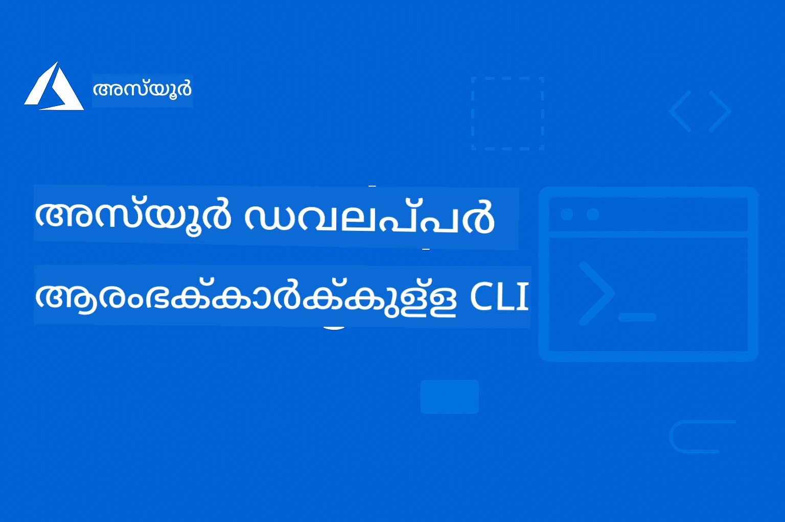

# AZD തുടക്കക്കാർക്ക്: ഒരു ഘടനാപരമായ പഠന യാത്ര

 

[](https://GitHub.com/microsoft/azd-for-beginners/watchers/)
[](https://GitHub.com/microsoft/azd-for-beginners/network/)
[](https://GitHub.com/microsoft/azd-for-beginners/stargazers/)

[](https://discord.com/invite/nkVh3dp)
[](https://discord.gg/nTYy5BXMWG)

---

### സ്വയമ് പരിഭാഷകൾ (എപ്പോഴും അപ്-ടു-ഡേറ്റ്)

<!-- CO-OP TRANSLATOR LANGUAGES TABLE START -->
[Arabic](../ar/README.md) | [Bengali](../bn/README.md) | [Bulgarian](../bg/README.md) | [Burmese (Myanmar)](../my/README.md) | [Chinese (Simplified)](../zh-CN/README.md) | [Chinese (Traditional, Hong Kong)](../zh-HK/README.md) | [Chinese (Traditional, Macau)](../zh-MO/README.md) | [Chinese (Traditional, Taiwan)](../zh-TW/README.md) | [Croatian](../hr/README.md) | [Czech](../cs/README.md) | [Danish](../da/README.md) | [Dutch](../nl/README.md) | [Estonian](../et/README.md) | [Finnish](../fi/README.md) | [French](../fr/README.md) | [German](../de/README.md) | [Greek](../el/README.md) | [Hebrew](../he/README.md) | [Hindi](../hi/README.md) | [Hungarian](../hu/README.md) | [Indonesian](../id/README.md) | [Italian](../it/README.md) | [Japanese](../ja/README.md) | [Kannada](../kn/README.md) | [Khmer](../km/README.md) | [Korean](../ko/README.md) | [Lithuanian](../lt/README.md) | [Malay](../ms/README.md) | [Malayalam](./README.md) | [Marathi](../mr/README.md) | [Nepali](../ne/README.md) | [Nigerian Pidgin](../pcm/README.md) | [Norwegian](../no/README.md) | [Persian (Farsi)](../fa/README.md) | [Polish](../pl/README.md) | [Portuguese (Brazil)](../pt-BR/README.md) | [Portuguese (Portugal)](../pt-PT/README.md) | [Punjabi (Gurmukhi)](../pa/README.md) | [Romanian](../ro/README.md) | [Russian](../ru/README.md) | [Serbian (Cyrillic)](../sr/README.md) | [Slovak](../sk/README.md) | [Slovenian](../sl/README.md) | [Spanish](../es/README.md) | [Swahili](../sw/README.md) | [Swedish](../sv/README.md) | [Tagalog (Filipino)](../tl/README.md) | [Tamil](../ta/README.md) | [Telugu](../te/README.md) | [Thai](../th/README.md) | [Turkish](../tr/README.md) | [Ukrainian](../uk/README.md) | [Urdu](../ur/README.md) | [Vietnamese](../vi/README.md)

> **പ്രാദേശികമായി ക്ലോൺ ചെയ്യാൻ ഇഷ്ടപ്പെടുന്നുണ്ടോ?**
>
> ഈ റെപ്പോസിറ്ററി 50-കൂടുതല്‍ ഭാഷാ പരിഭാഷകൾ ഉൾക്കൊള്ളുന്നു, ഇത് ഡൗൺലോഡ് വലിപ്പം വളരെയധികം വർധിപ്പിക്കുന്നു. പരിഭാഷകളില്ലാതെ ക്ലോൺ ചെയ്യാൻ, സ്പാര്സ് ചെക്ക്ഔട്ട് ഉപയോഗിക്കുക:
>
> **Bash / macOS / Linux:**
> ```bash
> git clone --filter=blob:none --sparse https://github.com/microsoft/AZD-for-beginners.git
> cd AZD-for-beginners
> git sparse-checkout set --no-cone '/*' '!translations' '!translated_images'
> ```
>
> **CMD (Windows):**
> ```cmd
> git clone --filter=blob:none --sparse https://github.com/microsoft/AZD-for-beginners.git
> cd AZD-for-beginners
> git sparse-checkout set --no-cone "/*" "!translations" "!translated_images"
> ```
>
> ഇത് കോഴ്സ് പൂര്‍ത്തിയാക്കാന്‍ ആവശ്യമായ എല്ലാ കാര്യങ്ങളും വളരെ വേഗത്തിൽ ഡൗൺലോഡ് ചെയ്യാൻ സഹായിക്കും.
<!-- CO-OP TRANSLATOR LANGUAGES TABLE END -->

## 🆕 ഇന്നു azd യില്‍ പുതിയതെന്ത്

Azure Developer CLI പരമ്പരാഗത വെബ് ആപ്പുകളും API കളും കടന്നുപോയി. ഇന്ന്, azd ആണ് Azure ലേക്ക് **ഏതൊരു** ആപ്ലിക്കേഷനും ഡിപ്ലോയ് ചെയ്യാനുള്ള ഒറ്റ ഉപകരണം—AI-ശക്തമായ ആപ്ലിക്കേഷനും ബുദ്ധിമാനായ ഏജന്റുമടങ്ങിയവ അടങ്ങും.

നിങ്ങൾക്കായി ഇതിന്റെ അർത്ഥം:

- **AI ഏജന്റുകൾ ഇപ്പോൾ ആദ്യ-തരം azd വേൽക്കളാണ്.** നിങ്ങൾക്ക് നിലവിലുള്ള `azd init` → `azd up` പ്രവൃത്തി പ്രവാഹം ഉപയോഗിച്ച് AI ഏജന്റ് പ്രോജക്റ്റുകൾ തുടങ്ങിയ്, ഡിപ്ലോയ് ചെയ്ത് മാനേജു ചെയ്യാം.
- **Microsoft Foundry സംയോജനത്തോടെ** മോഡൽ ഡിപ്ലോയ്മെന്റ്, ഏജന്റ് ഹോസ്റ്റിംഗ്, AI സേവന കോൺഫിഗറേഷൻ azd ടെംപ്ലേറ്റ് സമ്പ്രദായത്തിൽ നേരിട്ട് പോകുന്നു.
- **പ്രധാന പ്രവൃത്തി പ്രവാഹം മാറിയിട്ടില്ല.** നിങ്ങള്‍ todo ആപ്പ്, മൈക്രോസർവീസ്, അല്ലെങ്കിൽ മൾട്ടി-ഏജന്റ് AI സൊല്യൂഷൻ ഡിപ്ലോയ് ചെയ്താലും, കമാൻഡുകൾ ഒന്നே.

നിങ്ങൾ മുമ്പ് azd ഉപയോഗിച്ചിട്ടുണ്ടെങ്കിൽ, AI പിന്തുണ ഒരു സ്വാഭാവിക വിപുലീകരണമാണെന്നും—വയറ്റിൽ പുത്തൻ ടൂൾ അല്ല, അല്ലെങ്കിൽ ഒരു വിദഗ്ധ ട്രാക്ക് അല്ല. പുതിയതായി തുടങ്ങിയാൽ, എല്ലാം ഒരേ പ്രവൃത്തി പ്രവാഹം കൊണ്ട് പഠിക്കും.

---

## 🚀 Azure Developer CLI (azd) എന്താണ്?

**Azure Developer CLI (azd)** ഒരു ഡെവലപ്പർ സൗഹൃദ കമാൻഡ്-ലൈൻ ഉപകരണം ആണ്, ഇത് Azure ലേക്ക് ആപ്ലിക്കേഷനുകൾ ഡിപ്ലോയ് ചെയ്യുന്നത് എളുപ്പമാക്കുന്നു. നിരവധി Azure റിസോഴ്സുകൾ കൈയോടെ സൃഷ്ടിക്കുകയും ബന്ധിപ്പിക്കുകയും ചെയ്യാനുള്ള പകരം, ഒന്നാമത്തെ കമാൻഡ് ഉപയോഗിച്ച് മുഴുവൻ ആപ്ലിക്കേഷൻ ഡിപ്ലോയ് ചെയ്യാം.

### `azd up` - അതിന്റെ മാജിക്

```bash
# ഈ ഒറ്റ കമാന്‍‍ഡ് എല്ലാം ചെയ്യുന്നു:
# ✅ എല്ലാ Azure റിസോഴ്‌സുകളും സൃഷ്ടിക്കുന്നു
# ✅ നെറ്റ്‌വർക്കിംഗ്‌യും സുരക്ഷയും ക്രമീകരിക്കുന്നു
# ✅ നിങ്ങളുടെ ആപ്ലിക്കേഷൻ കോഡ് നിര്‍മ്മിക്കുന്നു
# ✅ Azure-ലേക്ക് വിന്യസിക്കുന്നു
# ✅ പ്രവർത്തനക്ഷമമായ ഒരു URL നിങ്ങൾക്ക് നൽകുന്നു
azd up
```

**ഇതായിരുന്നു!** Azure പോർട്ടൽ ക്ലിക്ക് ചെയ്യേണ്ട, സങ്കീർണ ARM ടെംപ്ലേറ്റുകൾ പഠിക്കേണ്ട, മാനുവൽ കോൺഫിഗറേഷൻ ഒന്നും വേണ്ട—സ്വല്പം തൊഴിൽ ചെയ്യുന്ന ആപ്ലിക്കേഷൻ Azure-ൽ.

---

## ❓ Azure Developer CLI vs Azure CLI: വ്യത്യാസം എന്ത്?

ഇതാണ് തുടക്കക്കാർ കൂടുതലായി ചോദിക്കുന്നത്. എളുപ്പത്തിൽ മറുപടി:

| ഫീച്ചർ | **Azure CLI (`az`)** | **Azure Developer CLI (`azd`)** |
|---------|---------------------|--------------------------------|
| **ഉദ്ദേശ്യം** | വ്യക്തിഗത Azure റിസോഴ്സ് മാനേജ് ചെയ്യുക | പൂര്‍ണ്ണമായ ആപ്ലിക്കേഷനുകള്‍ ഡിപ്ലോയ് ചെയ്യുക |
| **ചിന്താഗതിയും** | അടിസ്ഥാന ഘടനാമൂലം | ആപ്ലിക്കേഷൻ കേന്ദ്രീകൃതം |
| **ഉദാഹരണം** | `az webapp create --name myapp...` | `azd up` |
| **പഠന വക്രം** | Azure സേവനങ്ങൾ അറിയണം | നിങ്ങളുടെ ആപ്പ് മാത്രമേ അറിയണം |
| **ശ്രേഷ്ഠം** | ഡെവ്‌ഓപ്സ്, സ്ഥിതി | ഡെവലപ്പർമാർ, പ്രോട്ടോടൈപ്പിംഗ് |

### ലളിതമായ ഉപമ

- **Azure CLI** ഒരു വീടു പണിയാൻ ആവശ്യമായ എല്ലാ ഉപകരണങ്ങളുമായി സമാനമാണ്—തണ്ട്, സംഘടിപ്പങ്ങൾ, വെളിപാടുകൾ. നിങ്ങൾക്ക് എല്ലാം പണിയാം, പക്ഷെ നിർമ്മാണം അറിയണം.
- **Azure Developer CLI** ഒരു കോൺട്രാക്ടർ നിയമിക്കാൻ തുല്യമാണ്—നിങ്ങൾ എന്ത് വേണമെന്ന് പറയുക, അവർ പണികൾ കൈകാര്യം ചെയ്യും.

### എപ്പോൾ ഏത് ഉപയോഗിക്കും

| സാഹചര്യീകൽ | ഇത് ഉപയോഗിക്കുക |
|----------|----------------|
| "എനിക്ക് എന്റെ വെബ് ആപ്പ് വേഗത്തിൽ ഡിപ്ലോയ് ചെയ്യാൻ ആഗ്രഹം" | `azd up` |
| "ഞാൻ ഒറ്റ ഒരു സ്റ്റോറേജ് അക്കൗണ്ട് സൃഷ്ടിക്കണം" | `az storage account create` |
| "ഞാൻ ഒരു പൂർണ്ണ AI ആപ്ലിക്കേഷൻ പണിയുകയാണ്" | `azd init --template azure-search-openai-demo` |
| "ഞാൻ പ്രത്യേക Azure റിസോഴ്‌സിന്റെ ഡീബഗ്ഗ് ആവശ്യം ഉണ്ട്" | `az resource show` |
| "നമുക്ക് പ്രൊഡക്ഷന്‍ റെഡി ഡിപ്ലോയ്മെന്റ് ലക്ഷ്യമിടാം" | `azd up --environment production` |

### അവ ചേർന്ന് പ്രവർത്തിക്കുന്നു!

AZD നെ Azure CLI അടിയിൽ ഉപയോഗിക്കുന്നു. നിങ്ങൾ രണ്ടും ഉപയോഗിക്കാം:
```bash
# AZD ഉപയോഗിച്ച് നിങ്ങളുടെ ആപ്പ് വിന്യസിക്കുക
azd up

# തുടർന്ന് Azure CLI ഉപയോഗിച്ച് പ്രത്യേക റിസോഴ്‌സുകൾ സൂക്ഷ്മമായി ക്രമീകരിക്കുക
az webapp config set --name myapp --always-on true
```

---

## 🌟 Awesome AZD-ൽ നിന്നുള്ള ടെംപ്ലേറ്റുകൾ കണ്ടെത്തുക

ശൂന്യസ്ഥലത്തിൽ നിന്ന് തുടങ്ങേണ്ടതില്ല! **Awesome AZD** ആഡ്-ടു-ഡിപ്ലോയ് ടെംപ്ലേറ്റുകളുടെ കമ്മ്യൂണിറ്റി ശേഖരമാണ്:

| റിസോഴ്സ് | വിവരണം |
|----------|----------|
| 🔗 [**Awesome AZD ഗാലറി**](https://azure.github.io/awesome-azd/) | ഒറ്റ ക്ലിക്കിൽ 200-ഓવું ടെംപ്ലേറ്റുകൾ ബ്രൗസ് ചെയ്യുക |
| 🔗 [**ഒരു ടെംപ്ലേറ്റ് സമർപ്പിക്കുക**](https://github.com/Azure/awesome-azd/issues) | നിങ്ങളുടെ സ്വന്തം ടെംപ്ലേറ്റ് കമ്മ്യൂണിറ്റിക്ക് സംഭാവന ചെയ്യുക |
| 🔗 [**GitHub റിപോസിറ്ററി**](https://github.com/Azure/awesome-azd) | സ്റ്റാർ ചെയ്യാനായി സ്രോതസ്സ് പരിശോധിക്കുക |

### Awesome AZD-നിന്നുള്ള ജനപ്രിയ AI ടെംപ്ലേറ്റുകൾ

```bash
# RAG ചാറ്റ് Microsoft Foundry മോഡലുകളോടും AI Search-ഉം ചേർന്ന്
azd init --template azure-search-openai-demo

# വേഗമുള്ള AI ചാറ്റ് അപ്ലിക്കേഷൻ
azd init --template openai-chat-app-quickstart

# Foundry ഏജന്റുകളോടുകൂടിയ AI ഏജന്റുകൾ
azd init --template get-started-with-ai-agents
```

---

## 🎯 ആരംഭിക്കാൻ 3 പടികൾ

ആരംഭിക്കുവാൻ മുമ്പ്, നിങ്ങൾ ഡിപ്ലോയ് ചെയ്യാൻ ഉദ്ദേശിക്കുന്ന ടെംപ്ലേറ്റ് മിഷീൻ തയ്യാറാണെന്ന് ഉറപ്പാക്കുക:

**Windows:**
```powershell
.\validate-setup.ps1
```

**macOS / Linux:**
```bash
bash ./validate-setup.sh
```

ഏതെങ്കിലും ആവശ്യമായ പരിശോധന പരാജയപ്പെട്ടാൽ, ആദ്യം അത് പരിഹരിച്ച് പിന്നീട് വേഗത്തിലുള്ള തുടക്കം തുടരുക.

### പടി 1: AZD ഇൻസ്റ്റാൾ ചെയ്യുക (2 മിനിറ്റ്)

**Windows:**
```powershell
winget install microsoft.azd
```

**macOS:**
```bash
brew tap azure/azd && brew install azd
```

**Linux:**
```bash
curl -fsSL https://aka.ms/install-azd.sh | bash
```

### പടി 2: AZD-ക്കായിAuthenticate ചെയ്യുക

```bash
# ഈ കോഴ്സിൽ നിങ്ങൾ നേരിട്ട് Azure CLI കമാൻഡുകൾ ഉപയോഗിക്കാൻ പദ്ധതിയിടുകയാണെങ്കിൽ ഐച്ഛികമാണ്
az login

# AZD വർക്ക്‌ഫ്ലോകുകൾക്ക് ആവശ്യമാണ്
azd auth login
```

നിങ്ങൾക്ക് ആവശ്യമുണ്ടെന്നുറപ്പാകാത്ത പക്ഷം, [Installation & Setup](docs/chapter-01-foundation/installation.md#authentication-setup) ൽ പൂർണ്ണ സെറ്റപ്പ് ഫ്ലോ പിന്തുടരുക.

### പടി 3: നിങ്ങളുടെ ആദ്യ ആപ്പ് ഡിപ്ലോയ് ചെയ്യുക

```bash
# ടെംപ്ലേറ്റിൽ നിന്ന് ആരംഭിക്കുക
azd init --template todo-nodejs-mongo

# Azure-ലേക്ക് വിന്യസിക്കുക (എല്ലാം സൃഷ്ടിക്കുന്നു!)
azd up
```

**🎉 അതായ്ക!** നിങ്ങളുടെ ആപ്പ് ഇപ്പോൾ Azure-ൽ ലൈവ്.

### ക്ലീൻ അപ്പ് (മറക്കരുത്!)

```bash
# Remove all resources when done experimenting
azd down --force --purge
```

---

## 📚 ഈ കോഴ്സ് ഉപയോഗിക്കുന്ന വിധം

ഈ കോഴ്സ് **പോഗ്രസീവ് പഠനത്തിന് ആകർഷകമാക്കപ്പെട്ടതാണ്** - നിങ്ങൾക്ക് എളുപ്പമുള്ള ഭാഗത്തുനിന്ന് തുടങ്ങിയ് മുന്നോട്ട് പോകാം:

| നിങ്ങളുടെ പരിചയം | ഇവിടെ തുടങ്ങുക |
|-----------------|---------------|
| **Azure-ക്ക് പുതിയവർ** | [Chapter 1: Foundation](#-chapter-1-foundation--quick-start) |
| **Azure അറിയാം, AZD-ക്ക് പുതിയവർ** | [Chapter 1: Foundation](#-chapter-1-foundation--quick-start) |
| **AI ആപ്ലിക്കേഷനുകൾ ഡിപ്ലോയ് ചെയ്യാൻ ആഗ്രഹം** | [Chapter 2: AI-First Development](#-chapter-2-ai-first-development-recommended-for-ai-developers) |
| **പ്രായോഗിക പരിശീലനം വേണം** | [🎓 Interactive Workshop](workshop/README.md) - 3-4 മണിക്കൂർ ഗൈഡഡ് ലാബ് |
| **പ്രൊഡക്ഷൻ മാതൃകകൾക്കായി** | [Chapter 8: Production & Enterprise](#-chapter-8-production--enterprise-patterns) |

### വേഗത്തിലുള്ള സജ്ജീകരണം

1. **ഈ റെപ്പോസ് ഫോർക്ക് ചെയ്യുക**: [](https://GitHub.com/microsoft/azd-for-beginners/fork)
2. **ക്ലോൺ ചെയ്യുക**: `git clone https://github.com/YOUR-USERNAME/azd-for-beginners.git`
3. **സഹായം നേടുക**: [Azure Discord Community](https://discord.com/invite/ByRwuEEgH4)

> **പ്രാദേശികമായി ക്ലോൺ ചെയ്യാൻ ഇഷ്ടപ്പെടുന്നുണ്ടോ?**

> ഈ റിപോസിറ്ററി 50-കൂടുതല്‍ ഭാഷാ പരിഭാഷകൾ ഉൾക്കൊള്ളുന്നു, ഇത് ഡൗൺലോഡ് വലുപ്പം വളരെയേറെ വർധിപ്പിക്കുന്നു. പരിഭാഷകളില്ലാതെ ക്ലോൺ ചെയ്യാൻ, സ്പാര്സ് ചെക്ക്ഔട്ട് ഉപയോഗിക്കുക:
> ```bash
> git clone --filter=blob:none --sparse https://github.com/microsoft/AZD-for-beginners.git
> cd AZD-for-beginners
> git sparse-checkout set --no-cone '/*' '!translations' '!translated_images'
> ```
> ഇത് കോഴ്സ് പൂർത്തിയാക്കാൻ നിങ്ങൾക്കാവശ്യമായ എല്ലാ കാര്യങ്ങളും വളരെ വേഗത്തിൽ ഡൗൺലോഡ് ചെയ്യാൻ സഹായിക്കും.

## കോഴ്സ് അവലോകനം

ക്രമം അനുസരിച്ച് അധ്യായങ്ങളിലൂടെ Azure Developer CLI (azd) ൽ നിപുണന്മാർ ആകാൻ സഹായിക്കുന്ന കോഴ്സ്. **Microsoft Foundry സംയോജനത്തോടെ AI ആപ്ലിക്കേഷൻ ഡിപ്ലോയ്‌മെന്റിൽ പ്രത്യേക ശ്രദ്ധ.**

### ഈ കോഴ്സ് ആധുനിക ഡെവലപ്പർമാർക്കായുള്ള അത്യാവശ്യമാണ്

Microsoft Foundry Discord കമ്മ്യൂണിറ്റി വിവരങ്ങൾ അടിസ്ഥാനമാക്കി, **45% ഡെവലപ്പർമാർ AI വേലകൾക്കായി AZD ഉപയോഗിക്കാൻ ആഗ്രഹിക്കുന്നു** എങ്കിലും ഇവയിൽ പ്രശ്‌നങ്ങൾ നേരിടുന്നു:
- സങ്കീർണ മൾട്ടി-സേവീസ് AI ഘടനകൾ
- പ്രൊഡക്ഷൻ AI ഡിപ്ലോയ്മെന്റ് മികച്ച രീതികൾ  
- Azure AI സേവന സംയോജനം, കോൺഫിഗറേഷൻ
- AI വേലകളുടെ ചെലവ് മിതവൽക്കരണം
- AI-നിർദ്ദിഷ്ട ഡിപ്ലോയ്മെന്റ് പ്രശ്‌ന പരിഹാരം

### പഠന ലക്ഷ്യങ്ങൾ

ഈ ഘടനാപരമായ കോഴ്സ് പൂര്‍ത്തിയാക്കിയാൽ, നിങ്ങൾ:
- **AZD അടിസ്ഥാനപരമെന്നു കൈകാര്യം ചെയ്യുക**: മുഖ്യ ആശയങ്ങൾ, ഇൻസ്റ്റാൾ, കോൺഫിഗർ
- **AI ആപ്ലിക്കേഷനുകൾ ഡിപ്ലോയ് ചെയ്യുക**: AZD ഉപയോഗിച്ച് Microsoft Foundry സേവനങ്ങൾ
- **Infrastructure as Code നടപ്പിലാക്കുക**: Bicep ടെംപ്ലേറ്റുകളിൽ Azure റിസോഴ്‌സുകൾ മാനേജ് ചെയ്യുക
- **ഡിപ്ലോയ്മെന്റുകൾ ഡീബഗ് ചെയ്യുക**: സാധാരണ പ്രശ്‌നങ്ങൾ പരിഹരിക്കുക
- **പ്രൊഡക്ഷൻ മാനേജ്‌മെന്റ് മെച്ചപ്പെടുത്തുക**: സുരക്ഷ, സ്കെയിലിംഗ്, മോണിറ്ററിംഗ്, ചെലവ് നിയന്ത്രണം
- **മൾട്ടി-ഏജന്റ് സൊല്യൂഷനുകൾ പണിയുക**: സങ്കീർണ AI ഘടനകൾ ഡിപ്ലോയ് ചെയ്യുക

## തുടങ്ങുന്നതിനു മുന്നിൽ: അക്കൗണ്ടുകൾ, ആക്‌സസ്, ആശങ്കകൾ

Chapter 1 തുടങ്ങുന്നതിന് മുൻപ് താഴെപ്പറയുന്നവ ഒരുക്കിയിട്ടുണ്ടെന്ന് ഉറപ്പാക്കുക. ഈ ഗൈഡിലെ ഇൻസ്റ്റലേഷൻ ഘട്ടങ്ങൾ ഇവയ്ക്ക് അടിസ്ഥാനമാക്കിയുള്ളതാണ്.
- **ഒരു Azure സബ്സ്ക്രിപ്ഷൻ**: ജോലി പ്രവർത്തന സാധ്യതയുള്ള സബ്സ്ക്രിപ്ഷനോ നിങ്ങളുടെ സ്വന്തം അക്കൗണ്ടിലൂടെയോ ഉപയോഗിക്കാം, അല്ലെങ്കിൽ തുടങ്ങിയതിന് ഒരു [സൗജന്യ ട്രയൽ](https://aka.ms/azurefreetrial) സൃഷ്ടിക്കാം.
- **Azure വിഭവങ്ങൾ സൃഷ്ടിക്കാനുള്ള അധികാരം**: കൂടുതൽ പല പരിശീലനങ്ങൾക്കും, ലക്ഷ്യമിടുന്ന സബ്സ്ക്രിപ്ഷനിൽ അല്ലെങ്കിൽ റിസോഴ്‌സ് ഗ്രൂപ്പിൽ കുറഞ്ഞതും **Contributor** അധികാരം ഉണ്ടായിരിക്കണം. ചില അധ്യായങ്ങൾ റിസോഴ്‌സ് ഗ്രൂപ്പ്, മാനേജുചെയ്ത ഐഡന്റിറ്റികൾ, RBAC നിയോഗങ്ങൾ സൃഷ്ടിക്കാൻ കഴിവുണ്ടെന്ന് കരുതും.
- [**GitHub അക്കൗണ്ട്**](https://github.com): റിപ്പോസിറ്ററി ഫോർക്ക് ചെയ്യാനും, സ്വന്തം മാറ്റങ്ങൾ പിന്തുടരാനും, GitHub Codespaces വർക്ക്‌ഷോപ്പിനായി ഉപയോഗിക്കാനും ഇത് സഹായിക്കും.
- **ടെംപ്ലേറ്റ് റൺടൈം മുൻകൂട്ടിയുള്ള ആവശ്യകതകൾ**: ചില ടെംപ്ലേറ്റുകൾക്ക് Node.js, Python, Java, Docker പോലുള്ള പ്രാദേശിക ഉപകരണങ്ങൾ ആവശ്യമാണ്. മിസ്സിംഗ് ഉപകരണങ്ങൾ മുന്‍കൂട്ടി കാണാൻ ആരംഭിക്കുന്നതിന് മുമ്പ് സെറ്റപ്പ് വാലിഡേറ്റർ പ്രവർത്തിപ്പിക്കുക.
- **അടിസ്ഥാന ടെർമിനൽ പരിചയം**: വിദഗ്ധർ ആകേണ്ടതില്ല, എന്നാൽ `git clone`, `azd auth login`, `azd up` പോലുള്ള കമാൻഡുകൾ നടത്താൻ സുഖമായിരിക്കണം.

> **ഇന്റർപ്രൈസ് സബ്സ്ക്രിപ്ഷനിൽ ജോലി ചെയ്യുകയാണോ?**  
> നിങ്ങളുടെ Azure പരിസരം ഒരു അഡ്മിനിസ്ട്രേറ്റർ പാരാമർശം ചെയ്യുകയാണെങ്കിൽ, നിങ്ങൾ ഉപയോഗിക്കാൻ പോകുന്ന സബ്സ്ക്രിപ്ഷനിലോ റിസോഴ്‌സ് ഗ്രൂപ്പിലോ വിഭവങ്ങൾ വിന്യസിക്കാൻ കഴിയുമെന്ന് മുൻകൂട്ടി സ്ഥിരീകരിച്ച് നോക്കി വാങ്ങുക. കഴിയാതെപോയാൽ, വർക്ക്‌ഷോപ്പ് ആരംഭിക്കുന്നതിന് മുൻപ് സാൻഡ്ബോക്‌സ് സബ്സ്ക്രിപ്ഷനോ Contributor അധികാരമോ അഭ്യർത്ഥിക്കുക.

> **Azure തുടക്കക്കാരനാണോ?**  
> നിങ്ങളുടെ സ്വന്തം Azure ട്രയൽ അല്ലെങ്കിൽ പേ-ആസ്-യൂ-ഗോ സബ്സ്ക്രിപ്ഷൻ https://aka.ms/azurefreetrial-യിൽ ആരംഭിക്കുക, ടെനന്റ് തസ്തിക അംഗീകാരങ്ങൾക്കായി കാത്തിരിയ്ക്കാതെ പരിശീലനങ്ങൾ മുഴുവൻ നന്നായി പൂർത്തിയാക്കാൻ.

## 🗺️ കോഴ്‌സ് മാപ്പ്: അധ്യായം പ്രകാരം വേഗത്തില്‍ നാവിഗേഷന്‍

ഓരോ അധ്യായത്തിനും പഠന ലക്ഷ്യങ്ങൾ, വേഗത്തിലുള്ള തുടങ്ങൽ, പരിശീലനങ്ങൾ അടങ്ങിയ സമർപ്പിച്ച README ഉണ്ട്:

| അധ്യായം | വിഷയം | പാഠങ്ങൾ | ദൈർഘ്യം | ദുര്‍ളഭത |
|---------|-------|---------|----------|------------|
| **[അധ്യായം 1: അടിസ്ഥാനങ്ങൾ](docs/chapter-01-foundation/README.md)** | തുടങ്ങൽ | [AZD അടിസ്ഥാനങ്ങൾ](docs/chapter-01-foundation/azd-basics.md) &#124; [സ്ഥാപനം](docs/chapter-01-foundation/installation.md) &#124; [ആദ്യ പദ്ധതിയ](docs/chapter-01-foundation/first-project.md) | 30-45 മിനിറ്റ് | ⭐ |
| **[അധ്യായം 2: AI വികസനം](docs/chapter-02-ai-development/README.md)** | AI-ഫസ്റ്റ് ആപ്പുകൾ | [Foundry ഇന്റഗ്രേഷൻ](docs/chapter-02-ai-development/microsoft-foundry-integration.md) &#124; [AI ഏജന്റുകൾ](docs/chapter-02-ai-development/agents.md) &#124; [മോഡൽ വിന്യസനം](docs/chapter-02-ai-development/ai-model-deployment.md) &#124; [വർക്‌ഷോപ്പ്](docs/chapter-02-ai-development/ai-workshop-lab.md) | 1-2 മണിക്കൂർ | ⭐⭐ |
| **[അധ്യായം 3: കോൺഫിഗറേഷൻ](docs/chapter-03-configuration/README.md)** | തെളിയിക്കൽ & സുരക്ഷ | [കോൺഫിഗറേഷൻ](docs/chapter-03-configuration/configuration.md) &#124; [തെളിയിക്കൽ & സുരക്ഷ](docs/chapter-03-configuration/authsecurity.md) | 45-60 മിനിറ്റ് | ⭐⭐ |
| **[അധ്യായം 4: ഇൻഫ്രാസ്ട്രക്ചർ](docs/chapter-04-infrastructure/README.md)** | IaC & വിന്യാസം | [വിന്യാസ ഗൈഡ്](docs/chapter-04-infrastructure/deployment-guide.md) &#124; [പ്രൊവിഷനിംഗ്](docs/chapter-04-infrastructure/provisioning.md) | 1-1.5 മണിക്കൂർ | ⭐⭐⭐ |
| **[അധ്യായം 5: മൾട്ടി-ഏജന്റ്](docs/chapter-05-multi-agent/README.md)** | AI ഏജന്റ് പരിഹാരങ്ങൾ | [റീട്ടെയിൽ സീനാരിയോ](examples/retail-scenario.md) &#124; [കോഓർഡിനേഷൻ പാറ്റേണുകൾ](docs/chapter-06-pre-deployment/coordination-patterns.md) | 2-3 മണിക്കൂർ | ⭐⭐⭐⭐ |
| **[അധ്യായം 6: പ്രീ-ഡിപ്ലോയ്മെന്റ്](docs/chapter-06-pre-deployment/README.md)** | പദ്ധതിയിടൽ & പരിശോധന | [പ്രിഫ്ലൈറ്റ് പരിശോധനകൾ](docs/chapter-06-pre-deployment/preflight-checks.md) &#124; [ക്ഷമത പദ്ധതിയിടൽ](docs/chapter-06-pre-deployment/capacity-planning.md) &#124; [SKU തിരഞ്ഞെടുപ്പ്](docs/chapter-06-pre-deployment/sku-selection.md) &#124; [ആപ്പ് ഇൻസൈറ്റ്‌സ്](docs/chapter-06-pre-deployment/application-insights.md) | 1 മണിക്കൂർ | ⭐⭐ |
| **[അധ്യായം 7: തകരാറുകൾ പരിഹരിക്കൽ](docs/chapter-07-troubleshooting/README.md)** | ഡിബഗ് & പരിഹാരം | [സാധാരണ പ്രശ്‌നങ്ങൾ](docs/chapter-07-troubleshooting/common-issues.md) &#124; [ഡിബഗ്ഗിംഗ്](docs/chapter-07-troubleshooting/debugging.md) &#124; [AI പ്രശ്‌നങ്ങൾ](docs/chapter-07-troubleshooting/ai-troubleshooting.md) | 1-1.5 മണിക്കൂർ | ⭐⭐ |
| **[അധ്യായം 8: പ്രൊഡക്ഷൻ](docs/chapter-08-production/README.md)** | എന്റർപ്രൈസ് പാറ്റേൺസ് | [പ്രൊഡക്ഷൻ പ്രാക്റ്റീസുകൾ](docs/chapter-08-production/production-ai-practices.md) | 2-3 മണിക്കൂർ | ⭐⭐⭐⭐ |
| **[🎓 വർക്ക്‌ഷോപ്പ്](workshop/README.md)** | ഹാൻഡ്‌സ്-ഓൺ ലാബ് | [പരിചയം](workshop/docs/instructions/0-Introduction.md) &#124; [തിരഞ്ഞെടുപ്പ്](workshop/docs/instructions/1-Select-AI-Template.md) &#124; [പരിശോധന](workshop/docs/instructions/2-Validate-AI-Template.md) &#124; [വ്യാഖ്യാനം](workshop/docs/instructions/3-Deconstruct-AI-Template.md) &#124; [കോൺഫിഗറേഷൻ](workshop/docs/instructions/4-Configure-AI-Template.md) &#124; [അനുകൂലനങ്ങൾ](workshop/docs/instructions/5-Customize-AI-Template.md) &#124; [ടിയർഡൗൺ](workshop/docs/instructions/6-Teardown-Infrastructure.md) &#124; [Wrap-up](workshop/docs/instructions/7-Wrap-up.md) | 3-4 മണിക്കൂർ | ⭐⭐ |

**മൊത്തം കോഴ്‌സ് ദൈർഘ്യം:** ഏകദേശം 10-14 മണിക്കൂർ | **തകരാറ് പുരോഗതി:** തുടങ്ങി→ പ്രൊഡക്ഷൻ-സജ്ജം

---

## 📚 പഠന അധ്യായങ്ങൾ

*നിങ്ങളുടെ അനുഭവവും ലക്ഷ്യങ്ങളും അടിസ്ഥാനമാക്കി പഠന മാർഗം തിരഞ്ഞെടുക്കുക*

### 🚀 അധ്യായം 1: അടിസ്ഥാനവും വേഗത്തിലുള്ള തുടക്കവും  
**പൂർവ്വാവശ്യങ്ങൾ**: Azure സബ്സ്ക്രിപ്ഷൻ, അടിസ്ഥാന കമാൻഡ് ലൈൻ അറിവ്  
**ദൈർഘ്യം**: 30-45 മിനിട്ട്  
**ദുര്‍ളഭത**: ⭐

#### നിങ്ങളെ പഠിപ്പിക്കാൻ ഉദ്ദേശിച്ചിരിക്കുന്നത്  
- Azure Developer CLI അടിസ്ഥാനങ്ങൾ മനസ്സിലാക്കൽ  
- നിങ്ങളുടെ പ്ലാറ്റ്‌ഫോമിൽ AZD ഇൻസ്റ്റാൾ ചെയ്യൽ  
- ആദ്യ വിജയകരമായ വിന്യാസം

#### പഠന რესോഴ്‌സുകൾ  
- **🎯 ഇതു മുതൽ തുടങ്ങുക**: [Azure Developer CLI എന്താണ്?](#what-is-azure-developer-cli)  
- **📖 സിദ്ധാന്തം**: [AZD അടിസ്ഥാനങ്ങൾ](docs/chapter-01-foundation/azd-basics.md) - പ്രധാന ആശയങ്ങളും പരിവാചകങ്ങളും  
- **⚙️ സെറ്റപ്പ്**: [സ്ഥാപനവും സെറ്റപ്പും](docs/chapter-01-foundation/installation.md) - പ്ലാറ്റ്‌ഫോം വ്യത്യസ്തമായ ഗൈഡുകൾ  
- **🛠️ പ്രായോഗികം**: [നിങ്ങളുടെ ആദ്യ പദ്ധതി](docs/chapter-01-foundation/first-project.md) - പടിത്തടി ചേർന്ന് ട്യൂട്ടോറിയൽ  
- **📋 വേഗത്തിലുള്ള റഫറൻസ്**: [കമാൻഡ് ചീറ്റ് ഷീറ്റ്](resources/cheat-sheet.md)

#### പ്രായോഗിക പ്രത്യേകതകൾ  
```bash
# വേഗത്തിലുള്ള ഇൻസ്റ്റാളേഷൻ പരിശോധന
azd version

# നിങ്ങളുടെ ആദ്യ അപ്ലിക്കേഷൻ വിന്യസിക്കുക
azd init --template todo-nodejs-mongo
azd up
```
  
**💡 അധ്യായ ഫലം**: AZD ഉപയോഗിച്ച് ഒരു ലളിതമായ വെബ് ആപ്പلیکേഷൻ Azure-ലേക്ക് വിജയകരമായി വിന്യസിക്കുക

**✅ വിജയ പരിശോധന:**  
```bash
# ചോപ്റ്റർ 1 പൂർത്തിയാക്കിയശേഷം, നിങ്ങൾക്ക് കഴിയും:
azd version              # ഇൻസ്റ്റാൾ ചെയ്ത പതിപ്പ് കാണിക്കുന്നു
azd init --template todo-nodejs-mongo  # പ്രോജക്ട് ആരംഭിക്കുന്നു
azd up                  # Azure-ലേക്ക് വിന്യസിക്കുന്നു
azd show                # ഫലപ്രദമായി പ്രവർത്തിക്കുന്ന ആപ്പ് URL കാണിക്കുന്നു
# ആപ്പ് ബ്രൗസറിൽ തുറന്നു പ്രവർത്തിക്കുന്നു
azd down --force --purge  # വിഭവങ്ങൾ ശുചിയാക്കുന്നു
```
  
**📊 സമയ നിക്ഷേപം:** 30-45 മിനിറ്റ്  
**📈 പഠന ശേഷി:** അടിസ്ഥാന ആപ്ലിക്കേഷനുകൾ സ്വതന്ത്രമായി വിന്യസിക്കാൻ കഴിയും

---

### 🤖 അധ്യായം 2: AI-ഫസ്റ്റ് വികസനം (AI ഡെവലപ്പർമാർക്കു ശുപാർശ ചെയ്തു)  
**പൂർവ്വാവശ്യങ്ങൾ**: അധ്യായം 1 പൂർത്തിയായി  
**ദൈർഘ്യം**: 1-2 മണിക്കൂർ  
**ദുര്‍ളഭത**: ⭐⭐

#### നിങ്ങളെ പഠിപ്പിക്കാൻ ഉദ്ദേശിച്ചിരിക്കുന്നത്  
- AZD-നോടുള്ള Microsoft Foundry ഇന്റഗ്രേഷൻ  
- AI സജ്ജമായ ആപ്ലിക്കേഷനുകൾ വിന്യസിക്കൽ  
- AI സേവന കോൺഫിഗറേഷനുകൾ മനസ്സിലാക്കൽ

#### പഠന რესോഴ്‌സുകൾ  
- **🎯 ഇതു മുതൽ തുടങ്ങി**: [Microsoft Foundry ഇന്റഗ്രേഷൻ](docs/chapter-02-ai-development/microsoft-foundry-integration.md)  
- **🤖 AI ഏജന്റുകൾ**: [AI ഏജന്റുകൾ മാർഗ്ഗനിർദേശങ്ങൾ](docs/chapter-02-ai-development/agents.md) - AZD ഉപയോഗിച്ച് ബുദ്ധിമുട്ടുള്ള ഏജന്റുകൾ വിന്യസിക്കുക  
- **📖 പാറ്റേണുകൾ**: [AI മോഡൽ വിന്യസനം](docs/chapter-02-ai-development/ai-model-deployment.md) - AI മോഡലുകൾ വിന്യസിക്കുകയും കൈകാര്യം ചെയ്യുകയും ചെയ്യുക  
- **🛠️ വർക്ക്‌ഷോപ്പ്**: [AI വർക്ക്‌ഷോപ്പ് ലാബ്](docs/chapter-02-ai-development/ai-workshop-lab.md) - നിങ്ങളുടെ AI പരിഹാരങ്ങൾ AZD-യ്ക്ക് അനുയോജ്യമായി മാറ്റുക  
- **🎥 ഇന്ററാക്ടീവ് ഗൈഡ്**: [വർക്ക്‌ഷോപ്പ് വസ്തുക്കൾ](workshop/README.md) - MkDocs * DevContainer പരിസ്ഥിതിയിലൂടെയുള്ള ബ്രൗസർ-അടിസ്ഥാന പഠനം  
- **📋 ടെംപ്ലേറ്റുകൾ**: [Microsoft Foundry ടെംപ്ലേറ്റുകൾ](#വർക്‌ഷോപ്പ്-വിഭവങ്ങൾ)  
- **📝 ഉദാഹരണങ്ങൾ**: [AZD വിന്യാസ ഉദാഹരണങ്ങൾ](examples/README.md)

#### പ്രായോഗിക പ്രത്യേകതകൾ  
```bash
# നിങ്ങളുടെ ആദ്യ AI അപ്ലിക്കേഷൻ വിന്യസിക്കുക
azd init --template azure-search-openai-demo
azd up

# കൂടുതൽ AI ടെംപ്ലേറ്റുകൾ പരീക്ഷിക്കൂ
azd init --template openai-chat-app-quickstart
azd init --template agent-openai-python-prompty
```
  
**💡 അധ്യായ ഫലം**: RAG സൗകര്യങ്ങൾ ഉള്ള AI-സജ്ജമായ ചാറ്റ് ആപ്പ് വിന്യസിക്കുകയും കോൺഫിഗർ ചെയ്യുകയും ചെയ്യുക

**✅ വിജയ പരിശോധന:**  
```bash
# അധ്യായം 2 കഴിഞ്ഞ ശേഷം, നിങ്ങൾക്ക് കഴിയേണ്ടത്:
azd init --template azure-search-openai-demo
azd up
# AI ചാറ്റ് ഇന്റർഫെയ്സ് പരിശോദിക്കുക
# ചോദനകൾ ചോദിച്ച് സ്രോതസ്സുകളോടുകൂടിയ AI-ാൽ പ്രവർത്തിതമായ മറുപടികൾ നേടുക
# തിരയൽ സംയോജനം പ്രവർത്തിക്കുന്നതായിട്ടാണ് സ്ഥിരീകരിക്കുക
azd monitor  # ആപ്ലിക്കേഷൻ ഇൻസൈറ്റ്സ് ടെലിമെട്രി കാണിക്കുന്നു എന്നത് പരിശോധിക്കുക
azd down --force --purge
```
  
**📊 സമയ നിക്ഷേപം:** 1-2 മണിക്കൂർ  
**📈 പഠന ശേഷി:** പ്രൊഡക്ഷൻ-സജ്ജമായ AI ആപ്പുകൾ വിന്യസിക്കുകയും കോൺഫിഗർ ചെയ്യുകയും ചെയ്യാൻ കഴിയും  
**💰 ചെലവു ബോധ്യമുണ്ട്:** $80-150/മാസം ഡെവ് ചെലവുകൾ, $300-3500/മാസം പ്രൊഡക്ഷൻ ചെലവുകൾ മനസ്സിലാക്കുക

#### 💰 AI വിന്യാസത്തിനായി ചെലവു പരിഗണനകൾ

**ഡെവലപ്പ്മെന്റ് പരിസ്ഥിതി (അനുമാനിച്ചു $80-150/മാസം):**  
- Microsoft Foundry മോഡലുകൾ (പേ-ആസ്-യൂ-ഗോ): $0-50/മാസം (ടോകൺ ഉപയോഗത്തിനുള്ള അടിസ്ഥാനത്തിൽ)  
- AI സെർച്ച് (ബേസിക് ടയർ): $75/മാസം  
- കന്റൈനർ ആപ്പുകൾ (ഉപഭോഗ അടിസ്ഥാനമായി): $0-20/മാസം  
- സ്റ്റോറേജ് (സ്റ്റാൻഡേർഡ്): $1-5/മാസം

**പ്രൊഡക്ഷൻ പരിസ്ഥിതി (അനുമാനിച്ചു $300-3500+/മാസം):**  
- Microsoft Foundry മോഡലുകൾ (PTU സ്ഥിരതയുള്ള പ്രകടനത്തിനായി): $3,000+/മാസം അല്ലെങ്കിൽ ഉയർന്ന വോളിയമുള്ള പേ-ആസ്-യൂ  
- AI സെർച്ച് (സ്റ്റാൻഡേർഡ് ടയർ): $250/മാസം  
- കന്റൈനർ ആപ്പുകൾ (ഡെഡിക്കേറ്റഡ്): $50-100/മാസം  
- ആപ്പ് ഇൻസൈറ്റ്‌സ്: $5-50/മാസം  
- സ്റ്റോറേജ് (പ്രീമിയം): $10-50/മാസം

**💡 ചെലവു കുറക്കാനുള്ള സൂചനകൾ:**  
- പഠനത്തിനായി **Free Tier** Microsoft Foundry മോഡലുകൾ ഉപയോഗിക്കുക (Azure OpenAI 50,000 ടോകൺ/മാസം ഉൾപ്പെടെ)  
- സജീവമായി വികസിപ്പിക്കാത്തപ്പോൾ `azd down` പ്രവർത്തിപ്പിച്ച് വിഭവങ്ങൾ ഒഴിവാക്കുക  
- ഉപഭോഗ അടിസ്ഥാന ബില്ലിംഗ് ഉപയോഗിച്ച് തുടങ്ങുക, പ്രൊഡക്ഷനിലേക്കു മാത്രം PTU-യിലേക്ക് അപ്‌ഗ്രേഡ് ചെയ്യുക  
- വിന്യാസത്തിനു മുമ്പ് ചെലവ് നിഗമിക്കാൻ `azd provision --preview` ഓടിക്കുക  
- ഓട്ടോ-സ്കെയ്ലിംഗ് സജ്ജമാക്കുക: ആക്ട്വൽ ഉപയോഗത്തിനുള്ള ബിൽ മാത്രം നൽകുക

**ചെലവ് നിരീക്ഷണം:**  
```bash
# ആകാംക്ഷയുള്ള മാസത്തിലേതായ ചെലവുകൾ പരിശോധിക്കുക
azd provision --preview

# അസ്യൂർ പോർട്ടലിൽ യഥാർത്ഥ ചെലവുകൾ നിരീക്ഷിക്കുക
az consumption budget list --resource-group <your-rg>
```
  
---

### ⚙️ അധ്യായം 3: കോൺഫിഗറേഷൻ & തപാൽ സാങ്കേതിക വിദ്യ  
**പൂർവ്വാവശ്യങ്ങൾ**: അധ്യായം 1 പൂർത്തിയായി  
**ദൈർഘ്യം**: 45-60 മിനിറ്റ്  
**ദുര്‍ള്ളഭത**: ⭐⭐

#### നിങ്ങളെ പഠിപ്പിക്കാൻ ഉദ്ദേശിച്ചിരിക്കുന്നത്  
- പരിസ്ഥിതിയുടെ കോൺഫിഗറേഷൻ മാനേജ്മെന്റ്  
- തെളിയിക്കൽയും സുരക്ഷയും മികച്ച രീതികൾ  
- വിഭവങ്ങളുടെ പേരിടൽവും രൂപീകരണവും

#### പഠന റെസോർസ്  
- **📖 കോൺഫിഗറേഷൻ**: [കോൺഫിഗറേഷൻ ഗൈഡ്](docs/chapter-03-configuration/configuration.md) - പരിസ്ഥിതി ക്രമീകരണം  
- **🔐 സുരക്ഷ**: [തെളിയിക്കൽ മാതൃകകളും മാനേജുചെയ്ത ഐഡന്റിറ്റിയും](docs/chapter-03-configuration/authsecurity.md) - തെളിയിക്കൽ മാതൃകകൾ  
- **📝 ഉദാഹരണങ്ങൾ**: [ഡാറ്റാബേസ് ആപ്പ് ഉദാഹരണം](examples/database-app/README.md) - AZD ഡാറ്റാബേസ് ഉദാഹരണങ്ങൾ

#### പ്രായോഗിക പരിശീലനങ്ങൾ  
- ഒരുাধিক പരിസ്ഥിതികൾ (ഡെവ്, സ്റ്റേജിങ്, പ്രൊഡക്ഷൻ) കോൺഫിഗർ ചെയ്യുക  
- മാനേജുചെയ്ത ഐഡന്റിറ്റി തെളിയിക്കൽ സജ്ജമാക്കുക  
- പരിസ്ഥിതി-സ്വഭാവമായ കോൺഫിഗറേഷനുകൾ നടപ്പിലാക്കുക

**💡 അധ്യായ ഫലം**: ശരിയായ തെളിയിക്കലും സുരക്ഷയും ഉള്ള ഒരുাধিক പരിസ്ഥിതികളുടെ കാര്യക്ഷമമായ കൈകാര്യം

---

### 🏗️ അധ്യായം 4: ഇൻഫ്രാസ്ട്രക്ചർ കോഡ് & വിന്യാസം  
**പൂർവ്വാവശ്യങ്ങൾ**: അധ്യായങ്ങൾ 1-3 പൂർത്തിയായി  
**ദൈർഘ്യം**: 1-1.5 മണിക്കൂർ  
**ദുര്‍ള്ളഭത**: ⭐⭐⭐

#### നിങ്ങളെ പഠിപ്പിക്കാൻ ഉദ്ദേശിച്ചിരിക്കുന്നത്  
- വിപുലമായ വിന്യാസ മാതൃകകൾ  
- Bicep ഉപയോഗിച്ചുള്ള ഘടനാപരമായ ഇൻഫ്രാസ്ട്രക്ചർ  
- വിഭവ പ്രൊവിഷനിംഗ് തന്ത്രങ്ങൾ

#### പഠന റെസോർസ്  
- **📖 വിന്യാസം**: [വിന്യാസ ഗൈഡ്](docs/chapter-04-infrastructure/deployment-guide.md) - സമഗ്ര പ്രവൃത്തിതന്ത്രങ്ങൾ  
- **🏗️ പ്രൊവിഷനിംഗ്**: [വിഭവങ്ങൾ പ്രൊവിഷൻ ചെയ്യൽ](docs/chapter-04-infrastructure/provisioning.md) - Azure വിഭവ മാനേജ്മെന്റ്  
- **📝 ഉദാഹരണങ്ങൾ**: [കണ്ടെയ്‌നർ ആപ്പ് ഉദാഹരണം](../../examples/container-app) - കണ്ടെയ്‌നറൈസ്ഡ് വിന്യാസങ്ങൾ

#### പ്രായോഗിക പരിശീലനങ്ങൾ  
- ഓർമ്മപ്പെടുത്തലുകൾ ഉള്ള Bicep ടെംപ്ലേറ്റുകൾ സൃഷ്ടിക്കുക  
- മൾട്ടിസർവീസ് ആപ്ലിക്കേഷനുകൾ വിന്യസിക്കുക  
- ബ്ലൂ-ഗ്രീൻ വിന്യാസ തന്ത്രങ്ങൾ നടപ്പിലാക്കുക

**💡 അധ്യായ ഫലം**: പ്രായോഗികമായ ബൈസ്പ് ടെംപ്ലേറ്റുകൾ ഉപയോഗിച്ച് സങ്കീർണ്ണമായ മൾട്ടിസർവീസ് ആപ്ലിക്കേഷനുകൾ വിന്യസിക്കുക

---

### 🎯 അധ്യായം 5: മൾട്ടി-ഏജന്റ് AI പരിഹാരങ്ങൾ (ഉന്നത തലക്കെട്ട്)  
**പൂർ‍വാഭ്യാസങ്ങൾ**: അധ്യായങ്ങൾ 1-2 പൂർത്തിയായി  
**ദൈർഘ്യം**: 2-3 മണിക്കൂർ  
**ദുര്‍ള്ളഭത**: ⭐⭐⭐⭐

#### നിങ്ങളെ പഠിപ്പിക്കാൻ ഉദ്ദേശിച്ചിരിക്കുന്നത്  
- മൾട്ടി-ഏജന്റ് ആർക്കിടെക്ചർ മാതൃകകൾ  
- ഏജന്റ് ഓർക്കസ്ട്രേഷൻ, കോഓർഡിനേഷൻ  
- പ്രൊഡക്ഷൻ-സജ്ജ AI വിന്യാസങ്ങൾ

#### പഠന റെസോർസ്  
- **🤖 പ്രമുഖ പ്രോജക്ട്**: [റീട്ടെയിൽ മൾട്ടി-ഏജന്റ് പരിഹാരം](examples/retail-scenario.md) - സമ്പൂർണ നടപ്പാക്കൽ  
- **🛠️ ARM ടെംപ്ലേറ്റുകൾ**: [ARM ടെംപ്ലേറ്റ് പാക്കേജ്](../../examples/retail-multiagent-arm-template) - ഒറ്റ ക്ലിക്കിൽ വിന്യാസം  
- **📖 ആർക്കിടെക്ചർ**: [മൾട്ടി-ഏജന്റ് കോഓർഡിനേഷൻ പാറ്റേണുകൾ](docs/chapter-06-pre-deployment/coordination-patterns.md) - മാതൃകകൾ

#### പ്രായോഗിക പരിശീലനങ്ങൾ  
```bash
# പൂർണ റീടെയിൽ മൾട്ടി-ഏജന്റ് പരിഹാരം വിന്യാസം ചെയ്യുക
cd examples/retail-multiagent-arm-template
./deploy.sh

# ഏജന്റ് ക്രമീകരണങ്ങൾ അന്വേഷിക്കുക
az deployment group show --resource-group <rg-name> --name <deployment-name>
```
  
**💡 അധ്യായ ഫലം**: Customer, Inventory ഏജന്റുകളുള്ള പ്രൊഡക്ഷൻ-സജ്ജമായ മൾട്ടി-ഏജന്റ് AI പരിഹാരം വിന്യസിക്കുകയും കൈകാര്യം ചെയ്യുകയും ചെയ്യുക

---

### 🔍 അധ്യായം 6: പ്രീ-ഡിപ്ലോയ്മെന്റ് പരിശോധന & പദ്ധതിയിടൽ  
**പൂർവാവശ്യങ്ങൾ**: അധ്യായം 4 പൂർത്തിയായി  
**ദൈർഘ്യം**: 1 മണിക്കൂർ  
**ദുര്‍ള്ളഭത**: ⭐⭐
#### നിങ്ങൾ പഠിക്കുന്നതെന്താണ്
- ശേഷി പദ്ധതിയിടലും വിഭവ സാധുത പരിശോധനയും
- SKU തിരഞ്ഞെടുപ്പ് തന്ത്രങ്ങൾ
- പ്രീ-ഫ്ലൈറ്റ് പരിശോധനകളും ഓട്ടോമേഷൻ

#### പഠന വിഭവങ്ങൾ
- **📊 പദ്ധതിയിടല്**: [Capacity Planning](docs/chapter-06-pre-deployment/capacity-planning.md) - വിഭവ സാധുത പരിശോധന
- **💰 തിരഞ്ഞെടുപ്പ്**: [SKU Selection](docs/chapter-06-pre-deployment/sku-selection.md) - ചെലവിൽ ഭദ്രമായ തിരഞ്ഞെടുക്കലുകൾ
- **✅ സാധുത പരിശോധന**: [Pre-flight Checks](docs/chapter-06-pre-deployment/preflight-checks.md) - ഓട്ടോമേറ്റഡ് സ്ക്രിപ്ടുകൾ

#### പ്രായോഗിക വ്യായാമങ്ങൾ
- ശേഷി സാധുത പരിശോധന സ്ക്രിപ്റ്റുകൾ റൺ ചെയ്യുക
- ചെലവ് കുറയ്ക്കാനായി SKU തിരഞ്ഞെടുപ്പുകൾ മെച്ചപ്പെടുത്തുക
- ഓട്ടോമേറ്റഡ് പ്രീ-ഡിപ്പ്ലോയ്മെന്റ് പരിശോധനകൾ നടപ്പിലാക്കുക

**💡 അധ്യായ ഫലം**: നടപ്പാക്കുന്നതിന് മുമ്പ് ഡിപ്ലോയ്മെന്റുകൾ സാധുത പരിശോധനയും മെച്ചപ്പുറം.

---

### 🚨 അധ്യായം 7: പ്രശ്നപരിഹാരവും ഡിബഗ്ഗിംഗും
**പൂര്വാവശ്യങ്ങൾ**: ഏതെങ്കിലും ഡിപ്ലോയ്മെന്റ് അധ്യായം പൂർത്തിയായി  
**അവധിയും**: 1-1.5 മണിക്കൂർ  
**സങ്കീർണത**: ⭐⭐

#### നിങ്ങൾ പഠിക്കുന്നതെന്താണ്
- സമഗ്രമായ ഡിബഗ്ഗിംഗ് സമീപനങ്ങൾ
- സാധാരണ പ്രശ്നങ്ങൾക്കും പരിഹാരങ്ങൾക്കും
- എഐ-വിശിഷ്ട പ്രശ്നപരിഹാരം

#### പഠന വിഭവങ്ങൾ
- **🔧 സാധാരണ പ്രശ്നങ്ങൾ**: [Common Issues](docs/chapter-07-troubleshooting/common-issues.md) - ചോദ്യോത്തരങ്ങളും പരിഹാരങ്ങളും
- **🕵️ ഡിബഗ്ഗിംഗ്**: [Debugging Guide](docs/chapter-07-troubleshooting/debugging.md) - ഘട്ടം ദ്വാരം തന്ത്രങ്ങൾ
- **🤖 എഐ പ്രശ്നങ്ങൾ**: [AI-Specific Troubleshooting](docs/chapter-07-troubleshooting/ai-troubleshooting.md) - എഐ സർവീസ് പ്രശ്നങ്ങൾ

#### പ്രായോഗിക വ്യായാമങ്ങൾ
- ഡിപ്ലോയ്മെന്റ് പരാജയങ്ങൾ നിരീക്ഷിക്കുക
- അംഗീകാര പ്രശ്നങ്ങൾ പരിഹരിക്കുക
- എഐ സർവീസ് ബന്ധം ഡിബഗ് ചെയ്യുക

**💡 അധ്യായ ഫലം**: സ്വതന്ത്രമായി സാധാരണ ഡിപ്ലോയ്മെന്റ് പ്രശ്നങ്ങൾ നിർണയിക്കുകയും പരിഹരിക്കുകയും ചെയ്യുക

---

### 🏢 അധ്യായം 8: പ്രൊഡക്ഷൻ & എന്റർപ്രൈസ് പാറ്റേണ്സ്
**പൂര്വാവശ്യങ്ങൾ**: അധ്യായങ്ങൾ 1-4 പൂർത്തിയായി  
**അവധിയും**: 2-3 മണിക്കൂർ  
**സങ്കീർണത**: ⭐⭐⭐⭐

#### നിങ്ങൾ പഠിക്കുന്നതെന്താണ്
- പ്രൊഡക്ഷൻ ഡിപ്ലോയ്മെന്റ് തന്ത്രങ്ങൾ
- എന്റർപ്രൈസ് സുരക്ഷാ പാറ്റേണുകൾ
- നിരീക്ഷണംയും ചെലവ് മെച്ചപ്പെടുത്തലും

#### പഠന വിഭവങ്ങൾ
- **🏭 പ്രൊഡക്ഷൻ**: [Production AI Best Practices](docs/chapter-08-production/production-ai-practices.md) - എന്റർപ്രൈസ് പാറ്റേണുകൾ
- **📝 ഉദാഹരണങ്ങൾ**: [Microservices Example](../../examples/microservices) - സങ്കീര്‍ണ്ണ معماريات
- **📊 നിരീക്ഷണം**: [Application Insights integration](docs/chapter-06-pre-deployment/application-insights.md) - നിരീക്ഷണം

#### പ്രായോഗിക വ്യായാമങ്ങൾ
- എന്റർപ്രൈസ് സുരക്ഷാ പാറ്റേണുകൾ നടപ്പിലാക്കുക
- സമഗ്രമായ നിരീക്ഷണം ക്രമീകരിക്കുക
- ശരിയായ ഭരണകൂടത്തോടൊപ്പം പ്രൊഡക്ഷനിലേക്ക് ഡിപ്ലോയ് ചെയ്യുക

**💡 അധ്യായ ഫലം**: പ്രൊഡക്ഷൻ ശേഷിയുള്ള എന്റർപ്രൈസ്-സജ്ജമായ ആപ്ലിക്കേഷനുകൾ ഡിപ്ലോയ് ചെയ്യുക

---

## 🎓 വർക്‌ഷോപ്പ് അവലോകനം: കൈകാര്യം പഠന അനുഭവം

> **⚠️ വർക്‌ഷോപ്പ് നില**: സജീവ വികസനം  
> വർക്‌ഷോപ്പ് വസ്തുക്കൾ ഇപ്പോഴും വികസിപ്പിക്കുകയും മെച്ചപ്പെടുത്തുകയും ചെയ്യുകയാണ്. പ്രധാന മോഡ്യൂളുകൾ പ്രവർത്തനക്ഷമമാണ്, എന്നാൽ ചില ഉന്നത വിഭാഗങ്ങൾ പൂര്‍ണമല്ല. എല്ലാ ഉള്ളടക്കങ്ങളും പൂര്‍ത്തിയാക്കാന്‍ ഞങ്ങൾ പ്രത്യേകമായി പരിശ്രമിക്കുന്നു. [പ്രയാസം പിന്തുടരുക →](workshop/README.md)

### ഇന്ററാക്ടീവ് വർക്‌ഷോപ്പ് മെറ്റീരിയലുകൾ
**ബ്രൗസർ-അധിഷ്ഠിത ഉപകരണങ്ങളോടും മാർഗ്ഗനിർദ്ദേശ വ്യായാമങ്ങളോടും സമ്പൂർണമായ കൈകാര്യം പഠന환경**

നമ്മുടെ വർക്‌ഷോപ്പ് മെറ്റീരിയലുകൾ മിതമായ ഘടനയുള്ള, ഇന്ററാക്ടീവ് പഠനാനുഭവം നൽകുന്നു, മുകളിൽ കൊടുത്ത അധ്യായ അടിസ്ഥാന പരിപാടിയുമായി കൂട്ടിയാണ്. ഈ വർക്‌ഷോപ്പ് സ്വയം-paced പഠനത്തിനും ഇൻസ്ട്രക്ടർ-നയ പ്രസംഗങ്ങൾക്കും അനുയോജ്യമാണ്.

#### 🛠️ വർക്‌ഷോപ്പ് സവിശേഷതകൾ
- **ബ്രൗസർ-അധിഷ്ഠിത ഇന്റർഫേസ്**: MkDocs-പവർ ചെയ്ത സംഗ്രഹവും തിരച്ചിലും പകർപ്പും വിഷുവൽ തീമും
- **GitHub Codespaces ഇന്റഗ്രേഷൻ**: ഒരു ക്ളിക്കിൽ ഡെവലപ്മെന്റ് പരിസ്ഥിതി സജ്ജീകരണം
- **സംഘടിത പഠന പാത**: 8-മോഡ്യൂൾ മാർഗ്ഗനിർദ്ദേശ വ്യായാമങ്ങൾ (മൊത്തം 3-4 മണിക്കൂര്)
- **പടിദർമ്മ മുന്നേറ്റം**: പരിചയം → തിരഞ്ഞെടുപ്പ് → സാധുത → വിഭജനം → ക്രമീകരണം → ഇഷ്ടാനുസൃതം → ചെറുക്കൽ → സമാപനം
- **ഇന്ററാക്ടീവ് DevContainer പരിസ്ഥിതി**: മുൻകൂർ ക്രമീകരിച്ച ഉപകരണങ്ങളും ആശ്രമങ്ങളും

#### 📚 വർക്‌ഷോപ്പ് മോഡ്യൂൾ ഘടന
വർക്‌ഷോപ്പ് ഒരു **8-മോഡ്യൂൾ പടിവാതിൽ രീതികൾ** പിന്തുടരുന്നു, നിങ്ങളെ കണ്ടെത്തലിൽ നിന്ന് ഡിപ്ലോയ്മെന്റ് മാസ്റ്ററിയിലേക്കുള്ള യാത്രയിലേക്ക്:

| മോഡ്യൂൾ | വിഷയം | നിങ്ങൾ ചെയ്യുന്നത് | ദൈർഘ്യം |
|--------|-------|----------------|----------|
| **0. പരിചയം** | വർക്‌ഷോപ്പ് അവലോകനം | പഠന ഉദ്ദേശ്യങ്ങൾ, പൂർ‌വാവശ്യങ്ങൾ, വർക്‌ഷോപ്പ് ഘടന മനസിലാക്കുക | 15 മിനിറ്റ് |
| **1. തിരഞ്ഞെടുപ്പ്** | ടെംപ്ലേറ്റ് കണ്ടെത്തൽ | AZD ടെംപ്ലേറ്റുകൾ അന്വേഷിച്ച് നിങ്ങളുടെ സാഹചര്യത്തിന് ശരിയായ AI ടെംപ്ലേറ്റ് തിരഞ്ഞെടുക്കുക | 20 മിനിറ്റ് |
| **2. സാധുത** | ഡിപ്ലോയ് & സ്ഥിരീകരണം | `azd up` ഉപയോഗിച്ച് ടെംപ്ലേറ്റ് ഡിപ്ലോയ് ചെയ്ത് ഇൻഫ്രാസ്ട്രക്ചർ പ്രവൃത്തി സ്ഥിതീകരിക്കുക | 30 മിനിറ്റ് |
| **3. വിഭജനം** | ഘടന മനസ്സിലാക്കുക | GitHub Copilot ഉപയോഗിച്ച് ടെംപ്ലേറ്റ് ആർക്കിടെക്ചർ, ബൈസിപ് ഫയലുകൾ, കോഡ് ഓർഗനൈസേഷൻ പരിശോധിക്കുക | 30 മിനിറ്റ് |
| **4. ക്രമീകരണം** | azure.yaml തീർച്ചയായ പഠനം | `azure.yaml` ക്രമീകരണങ്ങൾ, ലൈഫ്സൈക്കിൾ ഹുക്സ്, എൻവയിറൻമെന്റ് വേരിയബിളുകൾ ആധിക്യതരമായി പഠിക്കുക | 30 മിനിറ്റ് |
| **5. ഇഷ്ടാനുസൃതം** | നിങ്ങളുടെ രീതിയിലാക്കുക | AI Search, ട്രേസിംഗ്, വിലയിരുത്തൽ സജ്ജമാക്കുകയും നിങ്ങളുടെ സാഹചര്യത്തിന് ഇഷ്ടാനുസൃതമാക്കുക | 45 മിനിറ്റ് |
| **6. ചെറുക്കൽ** | സംശുദ്ധിചെയ്യുക | `azd down --purge` ഉപയോഗിച്ച് സുരക്ഷിതമായി വിഭവങ്ങൾ പിൻവലിക്കുക | 15 മിനിറ്റ് |
| **7. സമാപനം** | അടുത്ത പടികൾ | യാഥാർത്ഥ്യങ്ങൾ അവലോകനം ചെയ്ത് പ്രധാന ആശയങ്ങൾ സംഗ്രഹിച്ച് പഠന യാത്ര തുടർക്കുക | 15 മിനിറ്റ് |

**വർക്‌ഷോപ്പ് പ്രവാഹം:**
```
Introduction → Selection → Validation → Deconstruction → Configuration → Customization → Teardown → Wrap-up
     ↓            ↓           ↓              ↓               ↓              ↓            ↓           ↓
  Overview    Find the     Deploy &      Explore        Master         Customize     Clean up    Review &
             right        verify        code &        azure.yaml      for your      resources   next steps
             template                   structure                     scenario
```

#### 🚀 വർക്‌ഷോപ്പുമായി തുടങ്ങുന്നത്
```bash
# ഓപ്‌ഷൻ 1: GitHub Codespaces (ശുപാർശ ചെയ്‌തിരിക്കുന്നത്)
# റിപ്പോസിറ്ററിയിൽ "Code" → "Create codespace on main" ക്ലിക്ക് ചെയ്യുക

# ഓപ്‌ഷൻ 2: ലോക്കൽ ഡെവലപ്പ്‌മെന്റ്
git clone https://github.com/microsoft/azd-for-beginners.git
cd azd-for-beginners/workshop
# workshop/README.md ൽ ഉള്ള സെറ്റപ്പ് നിർദ്ദേശങ്ങൾ പിന്തുടരുക
```

#### 🎯 വർക്‌ഷോപ്പ് പഠന ഫലങ്ങൾ
വർക്‌ഷോപ്പ് പൂർത്തിയാക്കുന്നതിലൂടെ പങ്കാളികൾ:
- **പ്രൊഡക്ഷൻ AI ആപ്ലിക്കേഷനുകൾ ഡിപ്ലോയ് ചെയ്യുക**: Microsoft Foundry സേവനങ്ങൾ ഉപയോഗിച്ച് AZD ഉപയോഗിക്കുക
- **മൾട്ടി-എജന്റ് ആർക്കിടെക്ചറുകൾ അനാവരണം ചെയ്യുക**: ഏകോപിത AI ഏജന്റ് സൊല്യൂഷനുകൾ നടപ്പിലാക്കുക
- **സുരക്ഷാ മികച്ച രീതികൾ നടപ്പിലാക്കുക**: അംഗീകാരം, ആക്‌സസ് നിയന്ത്രണം ക്രമീകരിക്കുക
- **വ്യാപ്തിക്കായി മെച്ചപ്പെടുത്തുക**: ചെലവിൽ തക്കതും മിതവുമായ ഡിപ്ലോയ്മെന്റുകൾ രൂപകൽപ്പന ചെയ്യുക
- **ഡിപ്ലോയ്മെന്റ് പ്രശ്നപരിഹാരം**: സാധാരണ പ്രശ്നങ്ങൾ സ്വതന്ത്രമായി പരിഹരിക്കുക

#### 📖 വർക്‌ഷോപ്പ് വിഭവങ്ങൾ
- **🎥 ഇന്ററാക്ടീവ് മാർഗ്ഗനിർദേശം**: [Workshop Materials](workshop/README.md) - ബ്രൗസർ അടിസ്ഥാന ലേണിംഗ് എൻവയൺമെന്റ്
- **📋 മോഡ്യൂൾ അനുസൃത നിർദ്ദേശങ്ങൾ**:
  - [0. പരിചയം](workshop/docs/instructions/0-Introduction.md) - വർക്‌ഷോപ്പ് അവലോകനവും ലക്ഷ്യങ്ങളും
  - [1. തിരഞ്ഞെടുപ്പ്](workshop/docs/instructions/1-Select-AI-Template.md) - AI ടെംപ്ലേറ്റുകൾ കണ്ടെത്തലും തിരഞ്ഞെടുപ്പും
  - [2. സാധുത](workshop/docs/instructions/2-Validate-AI-Template.md) - ടെംപ്ലേറ്റുകൾ ഡിപ്ലോയ്മെന്റ് & സ്ഥിരീകരണം
  - [3. വിഭജനം](workshop/docs/instructions/3-Deconstruct-AI-Template.md) - ടെംപ്ലേറ്റ് ആർക്കിടെക്ചർ അധ്യക്ഷത
  - [4. ക്രമീകരണം](workshop/docs/instructions/4-Configure-AI-Template.md) - azure.yaml പരിപൂർണ്ണം
  - [5. ഇഷ്ടാനുസൃതം](workshop/docs/instructions/5-Customize-AI-Template.md) - നിങ്ങളുടെ സാഹചര്യത്തിന് ഇഷ്ടാനുസൃതം
  - [6. ചെറുക്കൽ](workshop/docs/instructions/6-Teardown-Infrastructure.md) - വിഭവങ്ങൾ ശുചീകരിക്കുക
  - [7. സമാപനം](workshop/docs/instructions/7-Wrap-up.md) - അവലോകനം & അടുത്ത പടികൾ
- **🛠️ AI വർക്‌ഷോപ്പ് ലാബ്**: [AI Workshop Lab](docs/chapter-02-ai-development/ai-workshop-lab.md) - AI കേന്ദ്രീകൃത വ്യായാമങ്ങൾ
- **💡 ക്വിക് സ്റ്റാർട്ട്**: [Workshop Setup Guide](workshop/README.md#quick-start) - പരിസ്ഥിതി ക്രമീകരണം

**ഉതകുന്നവർക്ക്**: കോർപ്പറേറ്റ് പരിശീലനം, സർവകലാശാല കോഴ്സുകൾ, സ്വയം-പേസ് പഠനം, ഡെവലപ്പർ ബൂട്ട്ക്യാമ്പുകൾ.

---

## 📖 ആഴത്തിലുള്ള പഠനം: AZD ശേഷികൾ

അടിസ്ഥാനങ്ങളെക്കാൾ പുറമേ, AZD പ്രൊഡക്ഷൻ ഡിപ്ലോയ്മെന്റുകൾക്കായി ശക്തമായ സവിശേഷതകൾ നൽകുന്നു:

- **ടെംപ്ലേറ്റ് അടിസ്ഥാന ഡിപ്ലോയ്മെന്റുകൾ** - സാധാരണ ആപ്ലിക്കേഷൻ പാറ്റേണുകൾക്കായി മുൻകൂർ നിർമിച്ച ടെംപ്ലേറ്റുകൾ ഉപയോഗിക്കുക
- **കോഡ് രൂപത്തിലുള്ള ഇൻഫ്രასტ്രക്ചർ** - ബൈസിപ് അല്ലെങ്കിൽ ടെറഫോം ഉപയോഗിച്ച് Azure വിഭവങ്ങൾ നിയന്ത്രിക്കുക  
- **ഇന്റഗ്രേറ്റഡ് വർക്‌ഫ്ലോകൾ** - ആപ്ലിക്കേഷനുകൾ തുടർച്ചയായി പ്രൊവിഷൻ ചെയ്യുകയും ഡിപ്ലോയ് ചെയ്യുകയും നിരീക്ഷിക്കുകയും ചെയ്യുക
- **ഡെവലപ്പർ സൗഹൃദം** - ഡെവലപ്പർ ഉൽപ്പാദകത്വവും അനുഭവവും മെച്ചപ്പെടുത്താൻ അനുയോജ്യമായത്

### **AZD + Microsoft Foundry: AI ഡിപ്ലോയ്മെന്റുകൾക്കായി ഉത്തമം**

**എന്തുകൊണ്ട് AI പരിഹാരങ്ങൾക്കായി AZD?** AZD AI ഡെവലപ്പർമാരുടെ മുഖ്യ വെല്ലുവിളികളെ നേരിടുന്നു:

- **AI-സജ്ജമായ ടെംപ്ലേറ്റുകൾ** - Microsoft Foundry മോഡലുകൾ, കോഗ്നിറ്റീവ് സർവീസസ്, ML വർക്ക്‌ലോഡുകൾക്കായി മുൻകൂർ ക്രമീകരിച്ച ടെംപ്ലേറ്റുകൾ
- **സുരക്ഷിത AI ഡിപ്ലോയ്മെന്റുകൾ** - AI സേവനങ്ങൾ, API കീസുകൾ, മോഡൽ എൻഡ്‌പോയിന്റുകൾക്കുള്ള ഉൾക്കൊള്ളിച്ച സുരക്ഷാ പതാക്കൾ  
- **പ്രൊഡക്ഷൻ AI പാറ്റേണുകൾ** - സ്കെയിലബിൾ, ചെലവിൽ ഭദ്രമായ AI ആപ്ലിക്കേഷൻ ഡിപ്ലോയ്മെന്റ് മികച്ച രീതികൾ
- **എന്തിന്നുമെടുത്ത AI വർക്‌ഫ്ലോകൾ** - മോഡൽ വികസനത്തിൽ നിന്ന് പ്രൊഡക്ഷൻ വരെ ശരിയായ നിരീക്ഷണത്തോടൊപ്പം
- **ചെലവ് മെച്ചപ്പെടുത്തൽ** - AI വർക്ക്‌ലോഡുകൾക്കായി സ്മാർട്ട് വിഭവൻ വകുപ്പും സ്കെയിലും
- **Microsoft Foundry ഇന്റഗ്രേഷൻ** - Microsoft Foundry മോഡൽ കാറ്റലോഗും എൻഡ്‌പോയിന്റുകളും സൗകര്യമുള്ള കണക്ഷൻ

---

## 🎯 ടെംപ്ലേറ്റുകളും ഉദാഹരണ ലൈബ്രറിയും

### ഫീച്ചർഡ്: Microsoft Foundry ടെംപ്ലേറ്റുകൾ
**AI ആപ്ലിക്കേഷനുകൾ ഡിപ്ലോയ് ചെയ്യുന്നതിന് ഇവിടെ തുടങ്ങൂ!**

> **കുറിപ്പ്:** ഈ ടെംപ്ലേറ്റുകൾ വിവിധ AI പാറ്റേണുകൾ കാണിക്കുന്നു. ചിലത് പുറമ്പോക്ക Azure സാമ്പിളുകളും, മറ്റുള്ളവയ്ക്ക് ഈ റിപ്പോസിറ്ററിയിലുള്ള പ്രാദേശിക നടപ്പാക്കലുകളും ആണ്.

| ടെംപ്ലേറ്റ് | അധ്യായം | സങ്കീർണത | സേവനങ്ങൾ | തരം |
|----------|---------|------------|----------|------|
| [**Get started with AI chat**](https://github.com/Azure-Samples/get-started-with-ai-chat) | അധ്യായം 2 | ⭐⭐ | AzureOpenAI + Azure AI Model Inference API + Azure AI Search + Azure Container Apps + Application Insights | പുറം |
| [**Get started with AI agents**](https://github.com/Azure-Samples/get-started-with-ai-agents) | അധ്യായം 2 | ⭐⭐ | Foundry Agents + AzureOpenAI + Azure AI Search + Azure Container Apps + Application Insights| പുറം |
| [**Azure Search + OpenAI Demo**](https://github.com/Azure-Samples/azure-search-openai-demo) | അധ്യായം 2 | ⭐⭐ | AzureOpenAI + Azure AI Search + App Service + Storage | പുറം |
| [**OpenAI Chat App Quickstart**](https://github.com/Azure-Samples/openai-chat-app-quickstart) | അധ്യായം 2 | ⭐ | AzureOpenAI + Container Apps + Application Insights | പുറം |
| [**Agent OpenAI Python Prompty**](https://github.com/Azure-Samples/agent-openai-python-prompty) | അധ്യായം 5 | ⭐⭐⭐ | AzureOpenAI + Azure Functions + Prompty | പുറം |
| [**Contoso Chat RAG**](https://github.com/Azure-Samples/contoso-chat) | അധ്യായം 8 | ⭐⭐⭐⭐ | AzureOpenAI + AI Search + Cosmos DB + Container Apps | പുറം |
| [**Retail Multi-Agent Solution**](examples/retail-scenario.md) | അധ്യായം 5 | ⭐⭐⭐⭐ | AzureOpenAI + AI Search + Storage + Container Apps + Cosmos DB | **പ്രാദേശികം** |

### ഫീച്ചർഡ്: പൂർണ പഠന സാഹചര്യങ്ങൾ
**പഠന അധ്യായങ്ങളുമായി മാപ്പ് ചെയ്ത പ്രൊഡക്ഷൻ- റെഡിയായ ആപ്ലിക്കേഷൻ ടെംപ്ലേറ്റുകൾ**

| ടെംപ്ലേറ്റ് | പഠന അധ്യായം | സങ്കീർണത | മുഖ്യ പഠനം |
|----------|------------------|------------|--------------|
| [**openai-chat-app-quickstart**](https://github.com/Azure-Samples/openai-chat-app-quickstart) | അധ്യായം 2 | ⭐ | അടിസ്ഥാന AI ഡിപ്ലോയ്മെന്റ് പാറ്റേണുകൾ |
| [**azure-search-openai-demo**](https://github.com/Azure-Samples/azure-search-openai-demo) | അധ്യായം 2 | ⭐⭐ | Azure AI Search ഉപയോഗിച്ച് RAG നടപ്പാക്കൽ |
| [**ai-document-processing**](https://github.com/Azure-Samples/ai-document-processing) | അധ്യായം 4 | ⭐⭐ | ഡോക്യുമെന്റ് ഇന്റലിജൻസ് ഇന്റഗ്രേഷൻ |
| [**agent-openai-python-prompty**](https://github.com/Azure-Samples/agent-openai-python-prompty) | അധ്യായം 5 | ⭐⭐⭐ | ഏജന്റ് ഫ്രെയിംവർക്ക്, ഫംഗ്ഷൻ കോളിംഗ് |
| [**contoso-chat**](https://github.com/Azure-Samples/contoso-chat) | അധ്യായം 8 | ⭐⭐⭐ | എന്റർപ്രൈസ് AI ഓർക്കസ്‌ട്രേഷൻ |
| [**retail-multi-agent-solution**](examples/retail-scenario.md) | അധ്യായം 5 | ⭐⭐⭐⭐ | കസ്റ്റമറും ഇൻവെൻററി ഏജന്റുമുള്ള മൾട്ടി-എജന്റ് ആർക്കിടെക്ചർ |

### ഉദാഹരണ തരം അധിഷ്ഠിത പഠനം

> **📌 പ്രാദേശികവും പുറം ഉദാഹരണങ്ങളും:**  
> **പ്രാദേശിക ഉദാഹരണങ്ങൾ** (ഈ റിപ്പോയിൽ) = ഉടൻ ഉപയോഗം  
> **പുറം ഉദാഹരണങ്ങൾ** (Azure സാമ്പിളുകൾ) = ബന്ധപ്പെട്ട റിപ്പോസിറ്ററികളിൽ നിന്ന് ക്ലോൺ ചെയ്യുക

#### പ്രാദേശിക ഉദാഹരണങ്ങൾ (ഉടൻ ഉപയോഗത്തിന് സജ്ജം)
- [**Retail Multi-Agent Solution**](examples/retail-scenario.md) - പ്രൊഡക്ഷൻ റെഡി സമ്പൂർണ്ണ നടപ്പാക്കൽ ARM ടെംപ്ലേറ്റുകൾ ഉപയോഗിച്ച്
  - മൾട്ടി-എജന്റ് ആർക്കിടെക്ചർ (കസ്റ്റമർ + ഇൻവെൻററി ഏജന്റുകൾ)
  - സമഗ്ര നിരീക്ഷണം, വിലയിരുത്തൽ
  - ഒരു ക്ലിക്കിൽ ARM ടെംപ്ലേറ്റ് മുഖേന ഡിപ്ലോയ്മെന്റ്

#### പ്രാദേശിക ഉദാഹരണങ്ങൾ - കണ്ടെയ്‌നർ ആപ്ലിക്കേഷനുകൾ (അധ്യായങ്ങൾ 2-5)
**ഈ റിപ്പോസിറ്ററിയിൽ സമഗ്രമായ കണ്ടെയ്‌നർ ഡിപ്ലോയ്മെന്റ് ഉദാഹരണങ്ങൾ:**
- [**Container App Examples**](examples/container-app/README.md) - കണ്ടെയ്‌നർ ഡിപ്ലോയ്മെന്റിനുള്ള സമഗ്ര മാർഗ്ഗനിർദേശം
  - [സിമ്പിൾ ഫ്ലാസ്ക് API](../../examples/container-app/simple-flask-api) - സ്കെയിലിന് അനുയോജ്യമായ അടിസ്ഥാന REST API
  - [മൈക്രോസർവീസസ് ആർക്കിടെക്ചർ](../../examples/container-app/microservices) - പ്രൊഡക്ഷൻ റെഡി മൾട്ടി-സേവീസ് ഡിപ്ലോയ്മെന്റ്
  - ക്വിക്ക് സ്റ്റാർട്ട്, പ്രൊഡക്ഷൻ, ഉന്നത ഡിപ്ലോയ്മെന്റ് പാറ്റേണുകൾ
  - നിരീക്ഷണം, സുരക്ഷ, ചെലവ് മെച്ചപ്പെടുത്തൽ മാർഗ്ഗങ്ങൾ

#### പുറം ഉദാഹരണങ്ങൾ - ലളിത ആപ്ലിക്കേഷനുകൾ (അധ്യായങ്ങൾ 1-2)
**ഇവ പിടിച്ചെടുക്കാൻ ഈ Azure സാമ്പിളുകൾ ക്ലോൺ ചെയ്യുക:**
- [Simple Web App - Node.js + MongoDB](https://github.com/Azure-Samples/todo-nodejs-mongo) - അടിസ്ഥാന ഡിപ്ലോയ്മെന്റ് പാറ്റേണുകൾ
- [Static Website - React SPA](https://github.com/Azure-Samples/todo-csharp-sql-swa-func) - സ്റ്റാറ്റിക് ഉള്ളടക്ക ഡിപ്ലോയ്മെന്റ്
- [Container App - Python Flask](https://github.com/Azure-Samples/container-apps-store-api-microservice) - REST API ഡിപ്ലോയ്മെന്റ്

#### പുറം ഉദാഹരണങ്ങൾ - ഡാറ്റാബേസ് ഇന്റഗ്രേഷൻ (അധ്യായം 3-4)  

- [ഡേറ്റാബേസ് ആപ്പ് - C# + SQL](https://github.com/Azure-Samples/todo-csharp-sql) - ഡേറ്റാബേസ് കണക്റ്റിവിറ്റി പാറ്റേണുകൾ  
- [ഫംഗ്ഷൻസ് + കോസ്‌മോസ് DB](https://github.com/Azure-Samples/todo-python-mongo-swa-func) - സെർവർലെസ്സ് ഡാറ്റ വർക്ക്‌ഫ്ലോ

#### External Examples - അഡ്വാൻസ്ഡ് പാറ്റേണുകൾ (അദ്ധ്യായങ്ങൾ 4-8)  
- [ജാവാ മൈക്രോസർവിസുകൾ](https://github.com/Azure-Samples/java-microservices-aca-lab) - മൾട്ടി-സർവീസ് ആർക്കിടെക്ചറുകൾ  
- [കണ്ടെയ്‌നർ ആപ്പ്സ് ജോബ്സ്](https://github.com/Azure-Samples/container-apps-jobs) - ബാക്ക്ഗ്രൗണ്ട് പ്രോസസിംഗ്  
- [എന്റർപ്രൈസ് ML പൈപ്പ്‌ലൈൻ](https://github.com/Azure-Samples/mlops-v2) - പ്രൊഡക്ഷൻ-റെഡി ML പാറ്റേണുകൾ

### External Template Collections  
- [**ഓഫിഷ്യൽ AZD ടെംപ്ലേറ്റ് ഗ്യാലറി**](https://azure.github.io/awesome-azd/) - ഔദ്യോഗികവും കമ്മ്യൂണിറ്റി ടെംപ്ലേറ്റുകളുമായി ക്യൂറേറ്റ് ചെയ്ത ശേഖരം  
- [**ആസ്യൂർ ഡെവലപ്പർ CLI ടെംപ്ലേറ്റുകൾ**](https://learn.microsoft.com/en-us/azure/developer/azure-developer-cli/azd-templates) - മൈക്രോസോഫ്റ്റ് ലേൺ ടെംപ്ലേറ്റ് ഡോക്യുമെന്റേഷൻ  
- [**ഉദാഹരണങ്ങൾ ഡയറക്ടറി**](examples/README.md) - വിശദമായ വ്യാഖ്യാനങ്ങളോടുകൂടിയ ലോക്കൽ ലേണിംഗ് ഉദാഹരണങ്ങൾ

---

## 📚 പഠന വിഭവങ്ങളും റഫറൻസുകളും

### ക്വിക്ക് റഫറൻസുകൾ  
- [**കമാൻഡ് ചീറ്റ്ഷീറ്റ്**](resources/cheat-sheet.md) - സെക്ഷനുകളായി ക്രമീകരിച്ച അനിവാര്യമായ azd കമാൻഡുകൾ  
- [**ഗ്ലോസറി**](resources/glossary.md) - ആസ്യൂറും azd പദങ്ങൾ  
- [**FAQ**](resources/faq.md) - പഠന സെക്ഷനുകളായി ക്രമീകരിച്ച സാധാരണ ചോദ്യങ്ങൾ  
- [**സ്റ്റഡീ ഗൈഡ്**](resources/study-guide.md) - സമഗ്ര പിന്തിരിപ്പിക്കൽ അഭ്യാസങ്ങൾ

### ഹാൻഡ്‌സ്-ഓൺ വർക്ക്‌ഷോപ്പുകൾ  
- [**AI വർക്ക്‌ഷോപ്പ് ലാബ്**](docs/chapter-02-ai-development/ai-workshop-lab.md) - നിങ്ങളുടെ AI പരിഹാരങ്ങൾ AZD-യിൽ ഡിപ്ലോയബിളായി നിർമ്മിക്കുക (2-3 മണിക്കൂർ)  
- [**ഇന്ററാക്ടീവ് വർക്ക്‌ഷോപ്പ്**](workshop/README.md) - MkDocs, GitHub കോഡ്സ്പേസുമായി 8-മൊഡ്യൂൾ ഗൈഡ് ചെയ്തു അഭ്യാസങ്ങൾ  
  - തുടർച്ച: പരിചയം → തിരഞ്ഞെടുപ്പ് → പരിശോധന → ലഘൂകനം → കോൺഫിഗറേഷൻ → ഇഷ്ടാനുസരണം → ഡീസ്മാന്റിൾ → സമാപനം

### External Learning Resources  
- [Azure Developer CLI ഡോക്യുമെന്റേഷൻ](https://learn.microsoft.com/en-us/azure/developer/azure-developer-cli/)  
- [Azure Architecture Center](https://learn.microsoft.com/en-us/azure/architecture/)  
- [Azure Pricing Calculator](https://azure.microsoft.com/pricing/calculator/)  
- [Azure Status](https://status.azure.com/)

### നിങ്ങളുടെ എഡിറ്ററിനായി AI ഏജന്റ് സ്കില്ലുകൾ  
- [**Microsoft Azure Skills on skills.sh**](https://skills.sh/microsoft/github-copilot-for-azure) - Azure AI, Foundry, ഡിപ്ലോയ്മെന്റ്, ഡയഗ്നോസ്റ്റിക്സ്, ചിലവ് മെച്ചപ്പെടുത്തല് നിര്‍ദ്ദേശങ്ങൾ ഉൾപ്പെടെ 37 ഓപ്പൺ ഏജന്റ് സ്കില്ലുകൾ. GitHub Copilot, Cursor, Claude Code അല്ലെങ്കിൽ പിന്തുണയുള്ള ഏജന്റുകളിൽ ഇൻസ്റ്റാൾ ചെയ്യുക:  
  ```bash
  npx skills add microsoft/github-copilot-for-azure
  ```
  
---

## 🔧 ക്വിക്ക് ട്രബിള്ഷൂട്ടിങ് ഗൈഡ്

**പുതിയവർ നേരിടുന്ന സാധാരണ പ്രശ്‌നങ്ങളും സ്ഥിരം പരിഹാരങ്ങളും:**

<details>
<summary><strong>❌ "azd: command not found"</strong></summary>

```bash
# ആദ്യം AZD ഇൻസ്റ്റാൾ ചെയ്യുക
# വിൻഡോസ് (പവർഷെൽ):
winget install microsoft.azd

# macOS:
brew tap azure/azd && brew install azd

# ലിനക്സ്സ്:
curl -fsSL https://aka.ms/install-azd.sh | bash

# ഇൻസ്റ്റലേഷൻ സ്ഥിരീകരിക്കുക
azd version
```
</details>

<details>
<summary><strong>❌ "No subscription found" അല്ലെങ്കിൽ "Subscription not set"</strong></summary>

```bash
# ലഭ്യമായ സബ്സ്ക്രിപ്ഷനുകളുടെ പട്ടിക
az account list --output table

# ഡീഫോൾട്ട് സബ്സ്ക്രിപ്ഷൻ സജ്ജീകരിക്കുക
az account set --subscription "<subscription-id-or-name>"

# AZD പരിസ്ഥിതിക്കായി സജ്ജമാക്കുക
azd env set AZURE_SUBSCRIPTION_ID "<subscription-id>"

# സ്ഥിരീകരിക്കുക
az account show
```
</details>

<details>
<summary><strong>❌ "InsufficientQuota" അല്ലെങ്കിൽ "Quota exceeded"</strong></summary>

```bash
# വ്യത്യസ്തമായ Azure പ്രദേശം ശ്രമിക്കുക
azd env set AZURE_LOCATION "westus2"
azd up

# അല്ലെങ്കിൽ വികസനത്തിൽ ചെറിയ SKUs ഉപയോഗിക്കുക
# infra/main.parameters.json എഡിറ്റ് ചെയ്യുക:
{
  "sku": "B1"  // Instead of "P1V2"
}
```
</details>

<details>
<summary><strong>❌ "azd up" ചിലതു നടുവിൽ പരാജയപ്പെടുന്നു</strong></summary>

```bash
# ഓപ്ഷൻ 1: ശുചிகരിക്കുകയും വീണ്ടും ശ്രമിക്കുകയും ചെയ്യുക
azd down --force --purge
azd up

# ഓപ്ഷൻ 2: ഇൻഫ്രാസ്ട്രക്ടർ മാത്രം പരിഹരിക്കുക
azd provision

# ഓപ്ഷൻ 3: വിശദമായ സ്ഥിതി പരിശോധിക്കുക
azd show

# ഓപ്ഷൻ 4: Azure Monitor-ൽ ലോഗുകൾ പരിശോധിക്കുക
azd monitor --logs
```
</details>

<details>
<summary><strong>❌ "Authentication failed" അല്ലെങ്കിൽ "Token expired"</strong></summary>

```bash
# AZD-ക്കായി വീണ്ടും प्रमाणीകരിക്കുക
azd auth logout
azd auth login

# ഓപ്ഷണൽ: നിങ്ങൾ az കമാൻഡുകൾ പ്രവർത്തിപ്പിക്കുന്നുവെങ്കിൽ Azure CLI-ഉം റഫ്രഷ് ചെയ്യുക
az logout
az login

# प्रमाणीകരണം പരിശോധിക്കുക
az account show
```
</details>

<details>
<summary><strong>❌ "Resource already exists" അല്ലെങ്കിൽ നാമവിഭാഗനിർത്ഥങ്ങൾ</strong></summary>

```bash
# AZD പ്രത്യേക പേരുകൾ സൃഷ്ടിക്കുന്നു, പക്ഷേ വെറുമെയ്ക്ക് ഇവിടെയാണ്:
azd down --force --purge

# പിന്നെ പുതിയ പരിസ്ഥിതിയോടെ വീണ്ടും ശ്രമിക്കുക
azd env new dev-v2
azd up
```
</details>

<details>
<summary><strong>❌ ടെംപ്ലേറ്റ് ഡിപ്ലോയ്മെന്റ് വളരെ വൈകുന്നു</strong></summary>

**സാധാരണ കാത്തിരിപ്പ് സമയം:**  
- ലളിത വെബ് ആപ്പ്: 5-10 മിനിറ്റ്  
- ഡാറ്റാബേസോടുള്ള ആപ്പ്: 10-15 മിനിറ്റ്  
- AI അപ്ലിക്കേഷനുകൾ: 15-25 മിനിറ്റ് (OpenAI പ്രൊവിഷനിങിൽ മന്ദഗതിയുണ്ട്)

```bash
# പുരോഗതി പരിശോധിക്കുക
azd show

# 30 മിനിറ്റിൽ കൂടുതൽ തട്ടിക്കുകയാണെങ്കിൽ, Azure പോർട്ടൽ പരിശോധിക്കുക:
azd monitor --overview
# പരാജയപ്പെട്ട വിന്യസനങ്ങൾ പരിശോധിക്കുക
```
</details>

<details>
<summary><strong>❌ "Permission denied" അല്ലെങ്കിൽ "Forbidden"</strong></summary>

```bash
# നിങ്ങളുടെ ആസ്യൂർ റോളുകൾ പരിശോധിക്കുക
az role assignment list --assignee $(az account show --query user.name -o tsv)

# കുറഞ്ഞത് "കൺട്രിബ്യൂട്ടർ" റോളോ ഉണ്ടായിരിക്കണം
# റോളുകൾ അനുവദിക്കാൻ നിങ്ങളുടെ ആസ്യൂർ അഡ്മിനോട് ചോദിക്കൂ:
# - കൺട്രിബ്യൂട്ടർ (സ്രോതസ്സുകൾക്കായി)
# - ഉപയോക്തൃ ആക്‌സസ് അഡ്മിനിസ്ട്രേറ്റർ (റോളുകൾ ഏർപ്പെടുത്തുന്നതിനായി)
```
</details>

<details>
<summary><strong>❌ ഡിപ്ലോയുചെയ്ത അപ്ലിക്കേഷൻ URL കണ്ടെത്താനാകുന്നില്ല</strong></summary>

```bash
# എല്ലാ സർവീസ് എൻഡ്‌പോയിന്റുകളും കാണിക്കുക
azd show

# അല്ലെങ്കിൽ ആസ്യൂർ പോർട്ടൽ തുറക്കൂ
azd monitor

# പ്രത്യേക സർവീസ് പരിശോധിക്കുക
azd env get-values
# *_URL വേരിയബിളുകൾ കാണുക
```
</details>

### 📚 സമഗ്ര ട്രബിൾഷൂട്ടിങ് വിഭവങ്ങൾ

- **സാധാരണ പ്രശ്‌നങ്ങൾ ഗൈഡ്:** [വിശദമായ പരിഹാരങ്ങൾ](docs/chapter-07-troubleshooting/common-issues.md)  
- **AI-നിധിഷ്ട പ്രശ്‌നങ്ങൾ:** [AI ട്രബിൾഷൂട്ടിങ്](docs/chapter-07-troubleshooting/ai-troubleshooting.md)  
- **ഡീബഗ്ഗിംഗ് ഗൈഡ്:** [പടിപടിയായി ഡീബഗ്ഗിങ്](docs/chapter-07-troubleshooting/debugging.md)  
- **സഹായം ലഭിക്കുക:** [Azure Discord](https://discord.gg/microsoft-azure) #azure-developer-cli

---

## 🎓 കോഴ്‌സ് പൂർത്തിയാക്കലും സർട്ടിഫിക്കേഷനും

### പുരോഗതി ട്രാക്കിങ്  
ഓരോ അദ്ധ്യായത്തിലും നിങ്ങളുടെ പഠന പുരോഗതി ട്രാക്ക് ചെയ്യുക:

- [ ] **അദ്ധ്യായം 1**: അടിസ്ഥാനവും ക്വിക്ക് സ്റ്റാർട്ടും ✅  
- [ ] **അദ്ധ്യായം 2**: AI-ഫസ്റ്റ് ഡിവലപ്പ്മെന്റ് ✅  
- [ ] **അദ്ധ്യായം 3**: കോൺഫിഗറേഷൻ & ആഥന്റിക്കേഷൻ ✅  
- [ ] **അദ്ധ്യായം 4**: ഇൻഫ്രാസ്ട്രക്ചർ ആസ് കോഡ് & ഡിപ്ലോയ്മെന്റ് ✅  
- [ ] **അദ്ധ്യായം 5**: മൾട്ടി-ഏജന്റ് AI പരിഹാരങ്ങൾ ✅  
- [ ] **അദ്ധ്യായം 6**: പ്രി-ഡിപ്ലോയ്മെന്റ് പരിശോധിക്കൽ & പ്ലാനിങ് ✅  
- [ ] **അദ്ധ്യായം 7**: ട്രബിൾഷൂട്ടിങ് & ഡീബഗ്ഗിങ് ✅  
- [ ] **അദ്ധ്യായം 8**: പ്രൊഡക്ഷൻ & എന്റർപ്രൈസ് പാറ്റേണുകൾ ✅

### പഠന സ്ഥിരീകരണം  
ഓരോ അദ്ധ്യായവും പൂർത്തിയാക്കിയ ശേഷം നിങ്ങളുടെ അറിവ് സ്ഥിരീകരിക്കുക:  
1. **പ്രായോഗിക അഭ്യാസം**: അദ്ധ്യായത്തിലെ ഹാൻഡ്‌സ്-ഓൺ ഡിപ്ലോയ്മെന്റ് പൂർത്തിയാക്കുക  
2. **അറിവ് പരിശോധന**: നിങ്ങളുടെ അദ്ധ്യായത്തിലെ FAQ വിഭാഗം പരിശോധിക്കുക  
3. **കമ്മ്യൂണിറ്റി ചർച്ച**: Azure Discord-ിൽ നിങ്ങളുടെ അനുഭവം പങ്കുവയ്ക്കുക  
4. **അടുത്ത അദ്ധ്യായം**: അടുത്ത സങ്കീർണ്ണതാ തലത്തിലേക്ക് നീങ്ങുക

### കോഴ്‌സ് പൂർത്തീകരണ ഫലങ്ങൾ  
എല്ലാ അദ്ധ്യായങ്ങളും പൂർത്തിയാക്കിയപ്പോൾ നിങ്ങൾക്കുണ്ട്:  
- **പ്രൊഡക്ഷൻ അനുഭവം**: Azure-ൽ യഥാർത്ഥ AI അപ്ലിക്കേഷനുകൾ ഡിപ്ലോയു ചെയ്തത്  
- **പ്രൊഫഷണൽ സ്‌കില്ലുകൾ**: എന്റർപ്രൈസ് റെഡി ഡിപ്ലോയ്മെന്റ് കഴിവുകൾ  
- **കമ്മ്യൂണിറ്റി അംഗീകാരം**: ആസ്യൂർ ഡെവലപ്പർ കമ്മ്യൂണിറ്റിയുടെ സജീവ അംഗം  
- **കരിയർ പുരോഗതി**: ആവശ്യമുള്ള AZD & AI ഡിപ്ലോയ്മെന്റ് വിദഗ്ധത

---

## 🤝 കമ്മ്യൂണിറ്റി & പിന്തുണ

### സഹായം & പിന്തുണ ലഭിക്കുക  
- **ടെക്നിക്കൽ പ്രശ്‌നങ്ങൾ**: [ബഗുകൾ റിപ്പോർട്ട് ചെയ്യുക, ഫീച്ചറുകൾ അഭ്യർത്ഥിക്കുക](https://github.com/microsoft/azd-for-beginners/issues)  
- **പഠന ചോദ്യങ്ങൾ**: [Microsoft Azure Discord Community](https://discord.gg/microsoft-azure) &  [](https://discord.gg/nTYy5BXMWG)  
- **AI-നിധിഷ്ട സഹായം**: [](https://discord.gg/nTYy5BXMWG) ചേരുക  
- **ഡോക്യുമെന്റേഷൻ**: [ഓഫിഷ്യൽ Azure Developer CLI ഡോക്യുമെന്റേഷൻ](https://learn.microsoft.com/en-us/azure/developer/azure-developer-cli/)

### Microsoft Foundry Discord-യിലെ കമ്മ്യൂണിറ്റി ഇൻസൈറ്റുകൾ

**#Azure ചാനലിൽ അടുത്തകാലത്തെ പോൾ ഫലം:**  
- **45%** ഡെവലപ്പർമാർ AI വർക്ക്‌ലോഡുകളിലേക്ക് AZD ഉപയോഗിക്കണമെന്ന് ആഗ്രഹിക്കുന്നു  
- **പ്രധാന വെല്ലുവിളികൾ**: മൾട്ടി-സർവീസ് ഡിപ്ലോയ്മെന്റുകൾ, ക്രെഡൻഷ്യൽ മാനേജ്മെന്റ്, പ്രൊഡക്ഷൻ റെഡിനസ്  
- **കൂടുതൽ അഭ്യർ‍ഥനകൾ**: AI-നിധിഷ്ട ടെംപ്ലേറ്റുകൾ, ട്രബിൾഷൂട്ടിങ് ഗൈഡുകൾ, മികച്ച പ്രക്രിയകൾ

**ഞങ്ങളുടെ കമ്മ്യൂണിറ്റിയിൽ ചേരുക:**  
- നിങ്ങളുടെ AZD + AI അനുഭവങ്ങൾ പങ്കുവെച്ച് സഹായം ലഭിക്കുക  
- പുതിയ AI ടെംപ്ലേറ്റുകളുടെ പ്രാരംഭ പ്രിവ്യൂകൾക്ക് ആക്‌സസ് നേടുക  
- AI ഡിപ്ലോയ്മെന്റ് മികച്ച പ്രവൃത്തികൾക്ക് സംഭാവന നല്‍കുക  
- ഭാവി AI + AZD ഫീച്ചർ വികസനത്തെ സ്വാധീനിക്കുക

### കോഴ്‌സിന് സംഭാവന ചെയ്യുന്നത്  
സംഭാവനകൾ സ്വാഗതം! വിശദാംശങ്ങൾക്ക് ഞങ്ങളുടെ [Contributing Guide](CONTRIBUTING.md) വായിക്കുക:  
- **കണ്ടന്റ് മെച്ചപ്പെടുത്തലുകൾ**: നിലവിലുള്ള അദ്ധ്യായങ്ങളും ഉദാഹരണങ്ങളും മെച്ചപ്പെടുത്തുക  
- **പുതിയ ഉദാഹരണങ്ങൾ**: യഥാർത്ഥ ലോക ദൃശ്യംകളും ടെംപ്ലേറ്റുകളും ചേർക്കുക  
- **ഭാഷാന്തരം**: ബഹുഭാഷാ പിന്തുണ പരിപാലിക്കാൻ സഹായിക്കുക  
- **ബഗ് റിപ്പോർട്ടുകൾ**: ശുദ്ധിയേറിയതും ഫലപ്രദമുള്ളതുമായ റെക്കോർഡുകൾ നൽകുക  
- **കമ്മ്യൂണിറ്റി മാനദണ്ഡങ്ങൾ**: ഉൾക്കഴിച്ച കമ്മ്യൂണിറ്റി മാർഗനിർദേശങ്ങൾ പാലിക്കുക

---

## 📄 കോഴ്‌സ് വിവരങ്ങൾ

### ലൈസൻസ്  
ഈ പ്രോജക്ട് MIT ലൈസൻസിന്റെ അടിസ്ഥാനത്തിലാണ് - വിശദങ്ങൾക്ക് [LICENSE](../../LICENSE) ഫയൽ കാണുക.

### ബന്ധപ്പെട്ട Microsoft പഠന വിഭവങ്ങൾ  

ഞങ്ങളുടെ ടീം മറ്റു സമഗ്രമായ പഠന കോഴ്‌സുകളും നിർമ്മിക്കുന്നു:

<!-- CO-OP TRANSLATOR OTHER COURSES START -->  
### LangChain  
[](https://aka.ms/langchain4j-for-beginners)  
[](https://aka.ms/langchainjs-for-beginners?WT.mc_id=m365-94501-dwahlin)  
[](https://github.com/microsoft/langchain-for-beginners?WT.mc_id=m365-94501-dwahlin)  
---

### Azure / Edge / MCP / ഏജന്റുകൾ  
[](https://github.com/microsoft/AZD-for-beginners?WT.mc_id=academic-105485-koreyst)  
[](https://github.com/microsoft/edgeai-for-beginners?WT.mc_id=academic-105485-koreyst)  
[](https://github.com/microsoft/mcp-for-beginners?WT.mc_id=academic-105485-koreyst)  
[](https://github.com/microsoft/ai-agents-for-beginners?WT.mc_id=academic-105485-koreyst)  

---

### ജനറേറ്റീവ് AI സീരിസ്  
[](https://github.com/microsoft/generative-ai-for-beginners?WT.mc_id=academic-105485-koreyst)  
[-9333EA?style=for-the-badge&labelColor=E5E7EB&color=9333EA)](https://github.com/microsoft/Generative-AI-for-beginners-dotnet?WT.mc_id=academic-105485-koreyst)  
[-C084FC?style=for-the-badge&labelColor=E5E7EB&color=C084FC)](https://github.com/microsoft/generative-ai-for-beginners-java?WT.mc_id=academic-105485-koreyst)  
[-E879F9?style=for-the-badge&labelColor=E5E7EB&color=E879F9)](https://github.com/microsoft/generative-ai-with-javascript?WT.mc_id=academic-105485-koreyst)  

---

### കോർ ലേണിംഗ്  
[](https://aka.ms/ml-beginners?WT.mc_id=academic-105485-koreyst)
[](https://aka.ms/datascience-beginners?WT.mc_id=academic-105485-koreyst)
[](https://aka.ms/ai-beginners?WT.mc_id=academic-105485-koreyst)
[](https://github.com/microsoft/Security-101?WT.mc_id=academic-96948-sayoung)
[](https://aka.ms/webdev-beginners?WT.mc_id=academic-105485-koreyst)
[](https://aka.ms/iot-beginners?WT.mc_id=academic-105485-koreyst)
[](https://github.com/microsoft/xr-development-for-beginners?WT.mc_id=academic-105485-koreyst)

---
 
### കോപിലറ്റ് സീരീസ്
[](https://aka.ms/GitHubCopilotAI?WT.mc_id=academic-105485-koreyst)
[](https://github.com/microsoft/mastering-github-copilot-for-dotnet-csharp-developers?WT.mc_id=academic-105485-koreyst)
[](https://github.com/microsoft/CopilotAdventures?WT.mc_id=academic-105485-koreyst)
<!-- CO-OP TRANSLATOR OTHER COURSES END -->

---

## 🗺️ കോഴ്സ് നാവിഗേഷൻ

**🚀 പഠനം ആരംഭിക്കാൻ തയ്യാറാണോ?**

**ആരംഭക്കാർ**: [അധ്യായം 1: അടിസ്ഥാനവും ദ്രുത തുടക്കവും](#-chapter-1-foundation--quick-start)  
**AI ഡെവലപ്പർമാർ**: [അധ്യായം 2: AI-മੁੱਖ ഡെവലപ്‌മെന്റ്](#-chapter-2-ai-first-development-recommended-for-ai-developers)  
**പരിചയസമ്പന്നർ**: [അധ്യായം 3: കോൺഫിഗറേഷൻ & ഓതന്റിക്കേഷൻ](#️-chapter-3-configuration--authentication)

**അടുത്ത ഘട്ടം**: [അധ്യായം 1 - AZD അടിസ്ഥാനങ്ങൾ ആരംഭിക്കുക](docs/chapter-01-foundation/azd-basics.md) →

---

<!-- CO-OP TRANSLATOR DISCLAIMER START -->
**അസ്‌പഷ്ടീകരണം**:  
ഈ ഡോക്യുമെന്റ് എഐ വിവർത്തന സേവനം [Co-op Translator](https://github.com/Azure/co-op-translator) ഉപയോഗിച്ച് വിവർത്തനം ചെയ്തതാണ്. നമുക്ക് കൃത്യതയ്ക്കായി ശ്രമിച്ചുണ്ടെങ്കിലും, യാന്ത്രിക വിവർത്തനങ്ങളിൽ പിഴച്ചുകൾ അല്ലെങ്കിൽ തെറ്റായ വിവരങ്ങൾ ഉണ്ടാകാൻ സാധ്യതയുണ്ട്. അവിടെ ഉള്ള യഥാർത്ഥ ഡോക്യുമെന്റ് തന്നെ അതിന്റെ ഭാഷയിൽ authoritative ഉറവിടമെന്ന നിലയിലാണ് പരിഗണിക്കേണ്ടത്. നിർണായക വിവരങ്ങൾക്ക്, പ്രൊഫഷണൽ മനുഷ്യ വിവർത്തനം ശുപാർശ ചെയ്യപ്പെടുന്നു. ഈ വിവർത്തനം ഉപയോഗിച്ചതിൽ നിന്നുള്ള ബോധപ്പിഴവുകൾക്കും തെറ്റായ വ്യാഖ്യാനങ്ങൾക്കും ഞങ്ങൾ ഉത്തരവാദികളല്ല.
<!-- CO-OP TRANSLATOR DISCLAIMER END -->