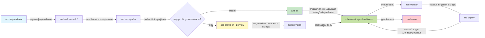
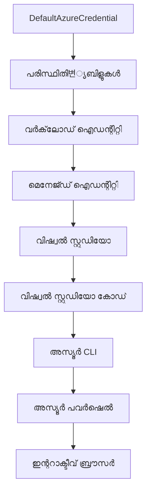

# AZD അടിസ്ഥാനങ്ങൾ - Azure Developer CLI മനസ്സിലാക്കൽ

# AZD അടിസ്ഥാനങ്ങൾ - പ്രാഥമിക ആശയങ്ങളും അടിസ്ഥാനങ്ങളും

**അദ്ധ്യായ നവിഗേഷൻ:**
- **📚 കോഴ്സ് ഹോം**: [AZD For Beginners](../../README.md)
- **📖 നിലവിലുള്ള അദ്ധ്യായം**: അദ്ധ്യായം 1 - അടിസ്ഥാനവും ക്വിക്ക് സ്റ്റാർട്ടും
- **⬅️ മുമ്പ്**: [Course Overview](../../README.md#-chapter-1-foundation--quick-start)
- **➡️ അടുത്തത്**: [Installation & Setup](installation.md)
- **🚀 അടുത്ത അദ്ധ്യായം**: [Chapter 2: AI-First Development](../chapter-02-ai-development/microsoft-foundry-integration.md)

## പരിചയം

ഈ പാഠം നിങ്ങളെ Azure Developer CLI (azd) എന്ന ശക്തമായ കമാൻഡ്-ലൈൻ ടൂളിലേക്ക് പരിചയപ്പെടുത്തുന്നു, ഇത് നിങ്ങളുടെ പ്രാദേശിക വികസനത്തിൽനിന്നും Azure ഡിപ്ലോയ്മെന്റിലേക്കുള്ള യാത്ര വേഗത്തിലാക്കുന്നു. നിങ്ങൾ അടിസ്ഥാന ആശയങ്ങൾ, കോർ ഫീച്ചറുകൾ അറിയുകയും azd ക്ലൗഡ്-നെറ്റീവ് അപേക്ഷയുടെ ഡിപ്ലോയ്മെന്റ് എങ്ങനെ ലളിതമാക്കുന്നു എന്ന് മനസ്സിലാക്കുകയും ചെയ്യും.

## പഠന ലക്ഷ്യങ്ങൾ

ഈ പാഠം പൂർത്തിയാക്കിയാൽ, നിങ്ങൾക്ക്:
- Azure Developer CLI എന്താണെന്ന് അതിന്റെ പ്രധാന ലക്ഷ്യവും മനസിലാക്കാം
- ടെംപ്ലേറ്റുകൾ, എൻവയോൺമെന്റുകൾ, സർവിസുകൾ എന്ന കോർ ആശയങ്ങൾ പഠിക്കാം
- ടെംപ്ലേറ്റ് പ്രേരിത വികസനവും Infrastructure as Codeoയും ഉൾപ്പെടുന്ന പ്രധാന ഫീച്ചറുകൾ അന്വേഷിക്കാം
- azd പ്രോജക്ട് ഘടനയും വർക്‌ഫ്ലോയും മനസ്സിലാക്കാം
- നിങ്ങളുടെ വികസന പരിസ്ഥിതി വേണ്ടി azd ഇൻസ്റ്റാൾ ചെയ്യാനും കോൺഫിഗർ ചെയ്യാനും തയ്യാറാകാം

## പഠന ഫലങ്ങൾ

ഈ പാഠം പൂർത്തിയാക്കിയതിന് ശേഷം, നിങ്ങൾക്ക്:
- ആധുനിക ക്ലൗഡ് വികസന വർക്‌ഫ്ലോക്സ്സിൽ azdയ്ക്കുള്ള പങ്ക് വിശദീകരിക്കാം
- azd പ്രോജക്ട് ഘടനയുടെ ഘടകങ്ങൾ തിരിച്ചറിയാം
- ടെംപ്ലേറ്റുകൾ, എൻവയോൺമെന്റുകൾ, സർവിസുകൾ എങ്ങനെ ചേർന്ന് പ്രവർത്തിക്കുന്നു എന്ന് വിശകലനം ചെയ്യാം
- azd ഉപയോഗിച്ച് Infrastructure as Codeന്റെ ഗുണങ്ങൾ മനസ്സിലാക്കാം
- വ്യത്യസ്ത azd കമാൻഡുകളും അവയുടെ ലക്ഷ്യങ്ങളും തിരിച്ചറിയാം

## Azure Developer CLI (azd) എന്താണ്?

Azure Developer CLI (azd) ഒരു കമാൻഡ്-ലൈൻ ടൂളാണ്, പ്രാദേശിക വികസനത്തിൽനിന്ന് Azure ഡിപ്ലോയ്മെന്റ് വേഗത്തിലാക്കാൻ രൂപകൽപ്പന ചെയ്തതാണ്. അത് Azure-ലുള്ള ക്ലൗഡ്-നെറ്റീവ് ആപ്പ്ലിക്കേഷനുകളുടെ നിർമ്മാണം, ഡിപ്ലോയ്മെന്റ്, മാനേജുമെന്റ് ലളിതമാക്കുന്നു.

### azd ഉപയോഗിച്ച് എന്ത് ഡിപ്ലോയ്മെന്റ് നടത്താം?

azd വ്യാപകമായ ജോലി ഭാരം പിന്തുണയ്ക്കുന്നു—അത് ഇപ്പോഴും വർദ്ധിച്ചു കൊണ്ടിരിക്കുന്നു. ഇന്ന്, നിങ്ങൾ azd ഉപയോഗിച്ച് ഡിപ്ലോയ്മെന്റ് നടത്താൻ കഴിയും:

| ജോലി തരം | ഉദാഹരണങ്ങൾ | ഒരേ വർക്‌ഫ്ലോ? |
|-------------|------------|------------------|
| **പരമ്പരാഗത ആപ്ലിക്കേഷനുകൾ** | വെബ് ആപ്പുകൾ, REST API-കൾ, സ്റ്റാറ്റിക് സൈറ്റുകൾ | ✅ `azd up` |
| **സർവിസുകളും മൈക്രോസർവിസുകളും** | കണ്ടെയ്ൻർ ആപ്പുകൾ, ഫംഗ്ഷൻ ആപ്പുകൾ, മൾട്ടി-സർവിസ് ബാക്ക് എന്‍ഡുകൾ | ✅ `azd up` |
| **AI പ്രേരിത ആപ്ലിക്കേഷനുകൾ** | Microsoft Foundry മോഡലുകൾ ഉപയോഗിക്കുന്ന ചാറ്റ് ആപ്പുകൾ, AI Search സവിശേഷതയുള്ള RAG സൊല്യൂഷനുകൾ | ✅ `azd up` |
| **ബുദ്ധിമാനായ ഏജന്റുകൾ** | Foundry-യിൽ ഹോസ്റ്റുചെയ്ത ഏജന്റുകൾ, മൾട്ടി ഏജന്റ് ഓർക്കസ്ട്രേഷൻസ് | ✅ `azd up` |

പ്രധാനമായ മനസ്സിലാക്കേണ്ട കാര്യം, **നിങ്ങൾ എന്ത് ഡിപ്ലോയ്മെന്റ് നടത്തுகிறിട്ടും azd ലൈഫ്‌സൈകിൾ ഒരുപിടിയുള്ളതാണ്**. നിങ്ങൾ ഒരു പ്രോജക്ട് ആരംഭിക്കും, ഇൻഫ്രാസ്ട്രക്ചർ അനുവദിക്കും, കോഡ് ഡിപ്ലോയ്മെന്റ് ചെയ്യും, ആപ്പ് നിരീക്ഷിക്കുകയും അന്തിമത്തിൽ ക്ലീൻ അപ്പ് നടത്തുകയും ചെയ്യും—അത് ഒരു ലളിതമായ വെബ്സൈറ്റ് ആണോ, സങ്കീർണ്ണമായ AI ഏജന്റ് ആണോ.

ഈ തുടർച്ചuillez. azd AI കഴിവുകളെ നിങ്ങളുടെ ആപ്പ്ലിക്കേഷൻ ഉപയോഗിക്കാൻ കഴിയുന്ന മറ്റൊരു സർവിസായി കാണുന്നു, അടിസ്ഥാനപരമായി വ്യത്യസ്തമായ ഒന്നായി അല്ല. Microsoft Foundry മോഡലുകൾ പിന്തുണയ്ക്കുന്ന ഒരു ചാറ്റ് എൻഡ്പോയിന്റ് azd ദൃഷ്ടിയിൽ വെറും മറ്റൊരു സർവിസായിരുന്നു, കോൺഫിഗർ ചെയ്ത് ഡിപ്ലോയ്മെന്റ് ചെയ്യേണ്ടത്.

### 🎯 AZD എന്തിന് ഉപയോഗിക്കണം? യാഥാർത്ഥ്യത്തോടെ താരതമ്യം

ഡാറ്റാബേസുള്ള ലളിതമായ ഒരു വെബ് ആപ്പ് ഡിപ്ലോയ്മെന്റ് താരതമ്യം ചെയ്യാം:

#### ❌ AZD ഇല്ലാതെ: മാനുവൽ Azure ഡിപ്ലോയ്മെന്റ് (30+ മിനിറ്റ്)

```bash
# ഘടകം 1: റിസോഴ്സ് ഗ്രൂപ്പ് സൃഷ്ടിക്കുക
az group create --name myapp-rg --location eastus

# ഘടകം 2: ആപ്പ് സർവീസ് പ്ലാൻ സൃഷ്ടിക്കുക
az appservice plan create --name myapp-plan \
  --resource-group myapp-rg \
  --sku B1 --is-linux

# ഘടകം 3: വെബ് ആപ്പ് സൃഷ്ടിക്കുക
az webapp create --name myapp-web-unique123 \
  --resource-group myapp-rg \
  --plan myapp-plan \
  --runtime "NODE:18-lts"

# ഘടകം 4: കോസ്മോസ് ഡിബി അക്കൗണ്ട് സൃഷ്ടിക്കുക (10-15 മിനിറ്റ്)
az cosmosdb create --name myapp-cosmos-unique123 \
  --resource-group myapp-rg \
  --kind MongoDB

# ഘടകം 5: ഡാറ്റാബേസ് സൃഷ്ടിക്കുക
az cosmosdb mongodb database create \
  --account-name myapp-cosmos-unique123 \
  --resource-group myapp-rg \
  --name tododb

# ഘടകം 6: കോളക്ഷൻ സൃഷ്ടിക്കുക
az cosmosdb mongodb collection create \
  --account-name myapp-cosmos-unique123 \
  --resource-group myapp-rg \
  --database-name tododb \
  --name todos

# ഘടകം 7: കണക്ഷൻ സ്ട്രിംഗ് നേടുക
CONN_STR=$(az cosmosdb keys list \
  --name myapp-cosmos-unique123 \
  --resource-group myapp-rg \
  --type connection-strings \
  --query "connectionStrings[0].connectionString" -o tsv)

# ഘടകം 8: ആപ്പ് സജ്ജീകരണങ്ങൾ ക്രമീകരിക്കുക
az webapp config appsettings set \
  --name myapp-web-unique123 \
  --resource-group myapp-rg \
  --settings MONGODB_URI="$CONN_STR"

# ഘടകം 9: ലോഗിംഗ് എനേബിൾ ചെയ്യുക
az webapp log config --name myapp-web-unique123 \
  --resource-group myapp-rg \
  --application-logging filesystem \
  --detailed-error-messages true

# ഘടകം 10: ആപ്ലിക്കേഷൻ ഇൻസൈറ്റ്സ് സജ്ജമാക്കുക
az monitor app-insights component create \
  --app myapp-insights \
  --location eastus \
  --resource-group myapp-rg

# ഘടകം 11: ആപ്പ് ഇൻസൈറ്റ്സ് വെബ് ആപ്പിനോട് ലിങ്കുചെയ്യുക
INSTRUMENTATION_KEY=$(az monitor app-insights component show \
  --app myapp-insights \
  --resource-group myapp-rg \
  --query "instrumentationKey" -o tsv)

az webapp config appsettings set \
  --name myapp-web-unique123 \
  --resource-group myapp-rg \
  --settings APPINSIGHTS_INSTRUMENTATIONKEY="$INSTRUMENTATION_KEY"

# ഘടകം 12: ആപ്പ് ലൊക്കലായി നിർമ്മിക്കുക
npm install
npm run build

# ഘടകം 13: ഡിപ്പ്ലോയ്മെന്റ് പാക്കേജ് സൃഷ്ടിക്കുക
zip -r app.zip . -x "*.git*" "node_modules/*"

# ഘടകം 14: ആപ്പ് ഡിപ്പ്ലോയ്മെന്റ് നടത്തുക
az webapp deployment source config-zip \
  --resource-group myapp-rg \
  --name myapp-web-unique123 \
  --src app.zip

# ഘടകം 15: കാത്തിരിക്കൂ, ഇത് ജോലി ചെയ്യുമെന്ന് പ്രാർത്ഥിക്കൂ 🙏
# (ഓട്ടോമാറ്റിക് പരിശോധന ഇല്ല, മാനുവൽ ടെസ്റ്റിംഗ് ആവശ്യമാണ്)
```

**പ്രശ്നങ്ങൾ:**
- ❌ ഓർമ്മിക്കാൻ 15-കൂടുതൽ കമാൻഡുകൾ, ക്രമത്തിൽ ചെയ്യേണ്ടത്
- ❌ 30-45 മിനിറ്റ് മാനുവൽ ജോലി
- ❌ തെറ്റ് വരുമെന്ന സാധ്യത (ടൈപ്പോ, തെറ്റായ പാരാമീറ്ററുകൾ)
- ❌ കണക്ഷൻ സ്റ്റ്രിങ്ങുകൾ ടെർമിനലിന്റെ ചരിത്രത്തിൽ പുറത്ത് കാണപ്പെടുന്നു
- ❌ പരാജയമായാൽ ഓട്ടോമാറ്റിക് റോൾബാക്ക് ഇല്ല
- ❌ ടീമംഗങ്ങൾക്ക് പുനരാവർത്തനം ചെയ്യാൻ ബുദ്ധിമുട്ട്
- ❌ ഓരോ തവണ വ്യത്യസ്തമാണ് (പുനരാവർത്തനയോഗ്യമല്ല)

#### ✅ AZD ഉപയോഗിച്ച്: ഓട്ടോമാറ്റഡ് ഡിപ്ലോയ്മെന്റ് (5 കമാൻഡുകൾ, 10-15 മിനിറ്റ്)

```bash
# ഘട്ടം 1: ടെംപ്ലേറ്റിൽ നിന്ന് ആരംഭിക്കുക
azd init --template todo-nodejs-mongo

# ഘട്ടം 2: സ്ഥിരീകരിക്കുക
azd auth login

# ഘട്ടം 3: പരിസ്ഥിതി സൃഷ്ടിക്കുക
azd env new dev

# ഘട്ടം 4: മാറ്റങ്ങൾ മുൻകൂട്ടി കാണിക്കുക (ഐച്ഛികം കൂടാതെ ശുപാർശ ചെയുന്നത്)
azd provision --preview

# ഘട്ടം 5: എല്ലാം വിന്യസിക്കുക
azd up

# ✨ പൂർത്തിയായി! എല്ലാം വിന്യസിച്ചും, ക്രമീകരിച്ചും, നിരീക്ഷിച്ചും കഴിഞ്ഞു
```

**പ്രയോജനങ്ങൾ:**
- ✅ **5 കമാൻഡുകൾ** 15+ മാനുവൽ ഘട്ടങ്ങളിലേക്ക്
- ✅ **10-15 മിനിറ്റ്** ആക്റ്റീവ് സമയം (വലിയ ഭാരം Azure-വിനോട് കാത്തിരിപ്പാണ്)
- ✅ **ഉല്ലംഘനരഹിതം** - ഓട്ടോമാറ്റഡ്, ടെസ്റ്റ് ചെയ്ത്
- ✅ **സീക്രെറ്റുകൾ സുരക്ഷിതമായി** Key Vault വഴി കൈകാര്യം ചെയ്യുന്നു
- ✅ **പരാജയങ്ങളിൽ ഓട്ടോമാറ്റിക് റോൾബാക്ക്**
- ✅ **പൂർണ്ണ പുനരാവർത്തനയോഗ്യമായ** ഒരേ ഫലം എല്ലാവർഷവും
- ✅ **ടീം-സജ്ജം** - ഒരുത്തൻ കൂടിയാലോചന കൊണ്ട് ഡിപ്ലോയ്മെന്റ് ചെയ്യാം
- ✅ **Infrastructure as Code** - വേർഷൻ നിയന്ത്രിത Bicep ടെംപ്ലേറ്റുകൾ
- ✅ **ഇൻബിൽഡ് മോണിറ്ററിംഗ്** - Application Insights ഓട്ടോമാറ്റിക് കോൺഫിഗർ ചെയ്യുന്നു

### 📊 സമയം & പിഴവ് കുറവ്

| അളവുക| മാനുവൽ ഡിപ്ലോയ്മെന്റ് | AZD ഡിപ്ലോയ്മെന്റ് | മെച്ചപ്പെടുത്തൽ |
|:-------|:---------------------|:------------------|:--------------|
| **കമാൻഡുകൾ** | 15+ | 5 | 67% കുറവ് |
| **സമയം** | 30-45 മിനിറ്റ് | 10-15 മിനിറ്റ് | 60% വേഗം |
| **പിഴവ് നിരക്ക്** | ~40% | <5% | 88% കുറവ് |
| **സ്ഥിരത** | കുറഞ്ഞത് (മാനുവൽ) | 100% (ഓട്ടോമാറ്റഡ്) | പരിപൂർണ്ണം |
| **ടീം ഓൺബോർഡിംഗ്** | 2-4 മണിക്കൂർ | 30 മിനിട്ട് | 75% വേഗം |
| **റോൾബാക്ക് സമയം** | 30+ മിനിറ്റ് (മാനുവൽ) | 2 മിനിറ്റ് (ഓട്ടോമാറ്റഡ്) | 93% വേഗം |

## കോർ ആശയങ്ങൾ

### ടെംപ്ലേറ്റുകൾ
ടെംപ്ലേറ്റുകൾ azdയുടെ അടിസ്ഥാനമാണ്. അവ ഉൾക്കൊള്ളുന്നു:
- **ആപ്ലിക്കേഷൻ കോഡ്** - നിങ്ങളുടെ സോഴ്സ് കോഡ് മായി ആശ്രിതങ്ങൾ
- **ഇൻഫ്രാസ്ട്രക്ചർ നിർവചനങ്ങൾ** - Bicep അല്ലെങ്കിൽ Terraform-ൽ നിർവചിച്ച Azure റിസോഴ്‌സുകൾ
- **കോൺഫിഗറേഷൻ ഫയലുകൾ** - സജ്ജീകരണങ്ങളും എൻവയോൺമെന്റ് വേലിയുമാറ്റങ്ങളും
- **ഡിപ്ലോയ്മെന്റ് സ്ക്രിപ്റ്റുകൾ** - ഓട്ടോമാറ്റഡ് ഡിപ്ലോയ്മെന്റ് വർക്‌ഫ്ലോകൾ

### എൻവയോൺമെന്റുകൾ
എൻവയോൺമെന്റുകൾ വ്യത്യസ്ത ഡിപ്ലോയ്മെന്റ് ലക്ഷ്യങ്ങളെ പ്രതിനിധീകരിക്കുന്നു:
- **ഡവലപ്പ്മെന്റ്** - ടെസ്റ്റിംഗിനും വികസനത്തിനും
- **സ്റ്റേജിംഗ്** - പ്രീ-പ്രൊഡക്ഷൻ പരിസ്ഥിതി
- **പ്രൊഡക്ഷൻ** - സജീവ പ്രൊഡക്ഷൻ പരിസ്ഥിതി

ഓരോ എൻവയോൺമെന്റിനും സ്വന്തം:
- Azure റിസോഴ്‌സ് ഗ്രൂപ്പ്
- കോൺഫിഗറേഷൻ സജ്ജീകരണങ്ങൾ
- ഡിപ്ലോയ്മെന്റ് നില

### സർവിസുകൾ
സർവിസുകൾ നിങ്ങളുടെ ആപ്പ്ലിക്കേഷന്റെ നിർമ്മാസംഗ്രഹണ ഘടകങ്ങളാണ്:
- **ഫ്രണ്ട്എൻഡ്** - വെബ് ആപ്പുകൾ, സിംഗിൾ പേജ് ആപ്പുകൾ (SPA)
- **ബാക്ക്എൻഡ്** - APIs, മൈക്രോസർവിസുകൾ
- **ഡാറ്റാബേസ്** - ഡാറ്റാ സംഭരണ പരിഹാരങ്ങൾ
- **സ്റ്റോറേജ്** - ഫയൽ, ബ്ലോബ് സ്റ്റോറേജ്

## പ്രധാന ഫീച്ചറുകൾ

### 1. ടെംപ്ലേറ്റ്-ഡ്രിവൺ വികസനം
```bash
# ലഭ്യമായ ടെംപ്ലേറ്റുകൾ ബ്രൗസ് ചെയ്യുക
azd template list

# ഒരു ടെംപ്ലേറ്റ് നിന്ന് പ്രാരംഭിക്കുക
azd init --template <template-name>
```

### 2. Infrastructure as Code
- **Bicep** - Azure-യുടെ ഡൊമെയ്ൻ-സ്പെസിഫിക് ഭാഷ
- **Terraform** - ബഹുനൈത്ര ഇൻഫ്രാസ്ട്രക്ചർ ടൂൾ
- **ARM ടെംപ്ലേറ്റുകൾ** - Azure റിസോഴ്‌സ് മാനേജർ ടെംപ്ലേറ്റുകൾ

### 3. സംയോജിത വർക്‌ഫ്ലോകൾ
```bash
# മൊത്തത്തിലുള്ള വിന്യാസ പ്രവൃത്തി പ്രവാഹം
azd up            # പ്രൊവിഷൻ + വിന്യസിപ്പിക്കൽ ആദ്യമായുള്ള സജ്ജീകരണത്തിന് ഹാൻഡ്‌സ് ഓഫ് ആണ്

# 🧪 പുതിയത്: വിന്യാസ മാറ്റങ്ങൾ വിന്യാസത്തിന পূর্বം അവലോകനം ചെയ്യുക (സുരക്ഷിതം)
azd provision --preview    # മാറ്റങ്ങൾ വരുത്താതെ ഇൻഫ്രാസ്‌ട്രക്ചർ വിന്യാസം അനുകരണ ചെയ്യുക

azd provision     # ഇൻഫ്രാസ്‌ട്രക്ചർ അപ്ഡേറ്റ് ചെയ്താൽ ആസ്യൂർ റിസോഴ്‌സുകൾ സൃഷ്ടിക്കാൻ ഇത് ഉപയോഗിക്കുക
azd deploy        # അപ്‌ഡേറ്റ് കഴിഞ്ഞാൽ അപ്ലിക്കേഷൻ കോഡ് വിന്യാസിപ്പിക്കുക അല്ലെങ്കിൽ പുനര്വിന്യാസം ചെയ്യുക
azd down          # റിസോഴ്‌സുകൾ ശുചീകരിക്കുക
```

#### 🛡️ പ്രിവ്യൂയുമായി സുരക്ഷിത ഇൻഫ്രാസ്ട്രക്ചർ പ്ലാനിംഗ്
`azd provision --preview` കമാൻഡ് സുരക്ഷിത ഡിപ്ലോയ്മെന്റുകൾക്കായി ഗെയിം-ചേഞ്ചറാണ്:
- **ഡ്രൈ-റൺ വിശകലനം** - എന്ത് സൃഷ്ടിക്കും, മാറ്റുകയും ഇല്ലാതാക്കുകയും ചെയ്യും എന്ന് കാണിക്കുന്നു
- **പൂജ്യം അപകടം** - Azure പരിസ്ഥിതിയിൽ യഥാർത്ഥ മാറ്റങ്ങൾ വരുത്തുന്നില്ല
- **ടീം സഹകരണം** - ഡിപ്ലോയ്മെന്റിന് മുമ്പ് പ്രിവ്യൂ ഫലങ്ങൾ പങ്കുവെക്കാം
- **ചെലവ് കണക്കുകൂട്ടൽ** - ഒപ്പം ബാധ്യതകൾക്ക് മുമ്പിൽ വിഭവ ചെലവ് മനസ്സിലാക്കാം

```bash
# ഉദാഹരണ പ്രിവ്യൂ പ്രവർത്തനസ്രോതസ്സ്
azd provision --preview           # എന്ത് മാറുമെന്ന് കാണുക
# ഔട്ട്‌പുട്ട് അവലോകനം ചെയ്യുക, ടീമിനൊപ്പം ചര്‍ച്ച ചെയ്യുക
azd provision                     # ആത്മവിശ്വാസത്തോടെ മാറ്റങ്ങൾ പ്രയോഗിക്കുക
```

### 📊 ദൃശ്യ ചിത്രം: AZD വികസന വർക്‌ഫ്ലോ


**വർക്‌ഫ്ലോ വിശദീകരണം:**
1. **Init** - ടെംപ്ലേറ്റ് അല്ലെങ്കിൽ പുതിയ പ്രോജക്ടുമായും തുടങ്ങുക
2. **Auth** - Azure-യിൽ അംഗീകാരം നേടുക
3. **Environment** - വേർതിരിച്ച ഡിപ്ലോയ്മെന്റ് എൻവയോൺമെന്റ് സൃഷ്ടിക്കുക
4. **Preview** - 🆕 എപ്പോഴും മുൻകൂർ ഇൻഫ്രാസ്ട്രക്ചർ മാറ്റങ്ങൾ പരിശോധിക്കുക (സുരക്ഷിത പ്രാക്ടീസ്)
5. **Provision** - Azure റിസോഴ്‌സുകൾ സൃഷ്ടിക്കുകയും അപ്‌ഡേറ്റ് ചെയ്യുകയും ചെയ്യുക
6. **Deploy** - നിങ്ങളുടെ ആപ്ലിക്കേഷൻ കോഡ് പുഷ് ചെയ്യുക
7. **Monitor** - ആപ്ലിക്കേഷൻ പ്രകടനം നിരീക്ഷിക്കുക
8. **Iterate** - മാറ്റങ്ങൾ വരുത്തി വീണ്ടും ഡിപ്ലോയ്മെന്റ് നടത്തുക
9. **Cleanup** - ജോലിയെന്തെങ്കിലും കഴിഞ്ഞാൽ റിസോഴ്‌സുകൾ നീക്കം ചെയ്യുക

### 4. എൻവയോൺമെന്റ് മാനേജ്മെന്റ്
```bash
# പരിസരങ്ങൾ സൃഷ്ടിക്കുകയും നിയന്ത്രിക്കുകയും ചെയ്യുക
azd env new <environment-name>
azd env select <environment-name>
azd env list
```

### 5. എക്സ്റ്റൻഷനുകളും AI കമാൻഡുകളും

azd കോർ CLI-യുടെ പുറമേ കഴിവുകൾ കൂട്ടാൻ ഒരു എക്സ്റ്റൻഷൻ സിസ്റ്റം ഉപയോഗിക്കുന്നു. ഇത് പ്രത്യേകിച്ച് AI ജോലി ഭാരം ഉപയോഗിക്കുന്നതിന് പ്രയോജനകരമാണ്:

```bash
# ലഭ്യമായ വിപുലീകരണങ്ങൾ പട്ടികപ്പെടുത്തുക
azd extension list

# ഫൗണ്ട്രി ഏജൻറ്സ് എക്സ്റ്റൻഷൻ ഇൻസ്റ്റാൾ ചെയ്യുക
azd extension install azure.ai.agents

# ഒരു മാനിഫെസ്റ്റിൽ നിന്ന് AI ഏജന്റ് പ്രോജക്ട് ആരംഭിക്കുക
azd ai agent init -m agent-manifest.yaml

# AI-സഹായമുള്ള വികസനത്തിനായി MCP സെർവർ ആരംഭിക്കുക (ആൽഫ)
azd mcp start
```

> എക്സ്റ്റൻഷനുകൾ വിശദീകരിച്ചിരിക്കുന്നു [Chapter 2: AI-First Development](../chapter-02-ai-development/agents.md) യിലും [AZD AI CLI Commands](../chapter-08-production/production-ai-practices.md#azd-ai-cli-commands-and-extensions) റഫറൻസിലും.

## 📁 പ്രോജക്ട് ഘടന

സാധാരണ azd പ്രോജക്ട് ഘടന:
```
my-app/
├── .azd/                    # azd configuration
│   └── config.json
├── .azure/                  # Azure deployment artifacts
├── .devcontainer/          # Development container config
├── .github/workflows/      # GitHub Actions
├── .vscode/               # VS Code settings
├── infra/                 # Infrastructure code
│   ├── main.bicep        # Main infrastructure template
│   ├── main.parameters.json
│   └── modules/          # Reusable modules
├── src/                  # Application source code
│   ├── api/             # Backend services
│   └── web/             # Frontend application
├── azure.yaml           # azd project configuration
└── README.md
```

## 🔧 കോൺഫിഗറേഷൻ ഫയലുകൾ

### azure.yaml
പ്രധാന പ്രോജക്ട് കോൺഫിഗറേഷൻ ഫയൽ:
```yaml
name: my-awesome-app
metadata:
  template: my-template@1.0.0

services:
  web:
    project: ./src/web
    language: js
    host: appservice
  api:
    project: ./src/api
    language: js
    host: appservice

hooks:
  preprovision:
    shell: pwsh
    run: echo "Preparing to provision..."
```

### .azure/config.json
എൻവയോൺമെന്റ്-സ്പെസിഫിക് കോൺഫിഗറേഷൻ:
```json
{
  "version": 1,
  "defaultEnvironment": "dev",
  "environments": {
    "dev": {
      "subscriptionId": "your-subscription-id",
      "location": "eastus"
    }
  }
}
```

## 🎪 പൊതുവായ വർക്‌ഫ്ലോകൾ ഹാൻഡ്‌സ്-ഓൺ അഭ്യാസങ്ങളോടൊപ്പം

> **💡 പഠന ടിപ്പ്:** നിങ്ങളുടെ AZD నైപുണ്യങ്ങളെ ക്രമമായി വികസിപ്പിക്കാൻ ഈ അഭ്യാസങ്ങൾ അനുസരിക്കുക.

### 🎯 അഭ്യാസം 1: നിങ്ങളുടെ ആദ്യത്തെ പ്രോജക്ട് ഇൻഷ്യലൈസ് ചെയ്യുക

**ലക്ഷ്യം:** AZD പ്രോജക്ട് സൃഷ്ടിച്ച് അതിന്റെ ഘടന അന്വേഷിക്കുക

**പടി-കൾ:**
```bash
# ആയുക്തമായ ഒരു ടെംപ്ലേറ്റ് ഉപയോഗിക്കുക
azd init --template todo-nodejs-mongo

# സൃഷ്ടിച്ച ഫയലുകൾ പരിശോധിക്കുക
ls -la  # മറഞ്ഞ ഫയലുകൾ ഉൾപ്പെടെ എല്ലാ ഫയലുകളും കാണുക

# സൃഷ്ടിച്ച പ്രധാന ഫയലുകൾ:
# - azure.yaml (പ്രധാന ക്രമീകരണം)
# - infra/ (പരിസരസൗകര്യ കോഡ്)
# - src/ (അപ്ലിക്കേഷൻ കോഡ്)
```

**✅ വിജയം:** നിങ്ങൾക്ക് azure.yaml, infra/, src/ ഡയറക്റ്ററികൾ ലഭിച്ചു

---

### 🎯 അഭ്യാസം 2: Azure-ക്കു ഡിപ്ലോയ്ചെയ്യുക

**ലക്ഷ്യം:** ഒരു സമഗ്രമായി ഡിപ്ലോയ്മെന്റ് പൂർത്തിയാക്കുക

**പടി-കൾ:**
```bash
# 1. പ്രാമാണീകരണം
az login && azd auth login

# 2. പരിസ്ഥിതി സൃഷ്ടിക്കുക
azd env new dev
azd env set AZURE_LOCATION eastus

# 3. മാറ്റങ്ങൾ പുര്‍വ്വദൃഷ്ടി ചെയ്യുക (ശുഭവിവേകപ്പെട്ടത്)
azd provision --preview

# 4. എല്ലാം വിന്യാസപ്പെടുത്തുക
azd up

# 5. വിന്യാസം പരിശോധിക്കുക
azd show    # നിങ്ങളുടെ ആപ്പ് URL കാണുക
```

**പ്രതീക്ഷിക്കുന്ന സമയം:** 10-15 മിനിട്ട്  
**✅ വിജയം:** ആപ്ലിക്കേഷൻ URL ബ്രൗസർ തുറക്കുന്നു

---

### 🎯 അഭ്യാസം 3: ബഹു എൻവയോൺമെന്റുകൾ

**ലക്ഷ്യം:** ഡവലപ്പ്മെന്റ്, സ്റ്റേജിംഗ് എൻവയോൺമെന്റുകൾക്ക് ഡിപ്ലോയ്മെന്റ് നടത്തുക

**പടി-കൾ:**
```bash
# ഇതിനകം dev ഉണ്ടെങ്കിൽ, staging സൃഷ്ടിക്കുക
azd env new staging
azd env set AZURE_LOCATION westus2
azd up

# അവയ്ക്കിടയിൽ മാറ്റം വരുത്തുക
azd env list
azd env select dev
```

**✅ വിജയം:** Azure പോർട്ടലിൽ രണ്ട് വേർതിരിച്ച റിസോഴ്‌സ് ഗ്രൂപ്പുകൾ

---

### 🛡️ ക്ലീൻ സ്ലേറ്റ്: `azd down --force --purge`

നിങ്ങൾ സമ്പൂർണ്ണമായി റീസെറ്റ് ചെയ്യേണ്ടപ്പോൾ:

```bash
azd down --force --purge
```

**എന്താണ് ചെയ്യുന്നത്:**
- `--force`: സ്ഥിരീകരണം ചോദിക്കാതെ
- `--purge`: എല്ലാ ലോക്കൽ സ്റ്റേറ്റ്, Azure റിസോഴ്‌സുകളും നീക്കം ചെയ്യുക

**എപ്പോഴെങ്കിൽ ഉപയോഗിക്കാം:**
- ഡിപ്ലോയ്മെന്റ് മദ്ധ്യത്തിൽ പരാജയപ്പെട്ടപ്പോൾ
- പ്രോജക്ട് മാറ്റുമ്പോൾ
- പുതിയ തുടക്കം ആവശ്യമുള്ളപ്പോൾ

---

## 🎪 യഥാർത്ഥ വർക്‌ഫ്ലോ റഫറൻസ്

### ഒരു പുതിയ പ്രോജക്ട് ആരംഭിക്കൽ
```bash
# മാർഗ്ഗം 1: നിലവിലുള്ള ടെംപ്ലേറ്റ് ഉപയോഗിക്കുക
azd init --template todo-nodejs-mongo

# മാർഗ്ഗം 2: തുടക്കം മുതൽ ആരംഭിക്കുക
azd init

# മാർഗ്ഗം 3: നിലവിലെ ഡയറക്ടറി ഉപയോഗിക്കുക
azd init .
```

### ഡവലപ്പ്മെന്റ് സൈക്കിൾ
```bash
# ഡെവലപ്പ്മെന്റ് പരിസ്ഥിതി സജ്ജമാക്കുക
azd auth login
azd env new dev
azd env select dev

# എല്ലാം വിന്യസിക്കുക
azd up

# മാറ്റങ്ങൾ വരുത്തി വീണ്ടും വിന്യസിക്കുക
azd deploy

# പൂർത്തിയാക്കുമ്പോൾ ശുചിത്വം നടത്തുക
azd down --force --purge # Azure Developer CLI-യിലെ കമാൻഡ് നിങ്ങളുടെ പരിസ്ഥിതിക്ക് ഒരു **കഠിന പുനഃസജ്ജീകരണമാണ്**—പ്രധാനമായും പരാജയപ്പെട്ട വിന്യാസങ്ങൾ പരിഹരിക്കുമ്പോൾ, ഉപേക്ഷിക്കപ്പെട്ട സ്രോതസുകൾ ശുചിയാക്കുമ്പോൾ, അല്ലെങ്കിൽ പുതിയ വിന്യാസത്തിനായി തയ്യാറെടുക്കുമ്പോൾ ഏറ്റവും പ്രയോജനപ്രദമാണ്.
```

## `azd down --force --purge` മനസ്സിലാക്കൽ
`azd down --force --purge` കമാൻഡ് azd എൻവയോൺമെന്റ് മുഴുവനും അനുബന്ധ റിസോഴ്‌സുകളും നശിപ്പിക്കാൻ ശക്തമായ മാർഗ്ഗമാണ്. ഓരോ ഫ്‌ളാഗിന്റെ പ്രവർത്തനം ചുവടെ:
```
--force
```
- സ്ഥിരീകരണ പ്രോംപ്റ്റുകൾ ഒഴിവാക്കുന്നു
- മാനുവൽ ഇൻപുട്ട് സാദ്ധ്യമാകാത്ത ഓട്ടോമേഷൻ/സ്ക്രിപ്റ്റിംഗിന് അനുയോജ്യം
- CLI അനിയമിതത്വങ്ങൾ കണ്ടെത്തിയാലും തടസ്സമില്ലാതെ ടിയർഡൗൺ നടത്തുന്നു

```
--purge
```
**എല്ലാ അനുബന്ധ മെടാ-ഡേറ്റയും ഇല്ലാതാക്കുന്നു:**
എൻവയോൺമെന്റ് സ്റ്റേറ്റ്  
ലോക്കൽ `.azure` ഫോളിഡർ  
കാഷ് ചെയ്ത ഡിപ്ലോയ്മെന്റ് വിവരങ്ങൾ  
ഇതിലൂടെ azd മുൻ ഡിപ്ലോയ്മെന്റ് “മെമ്മറി” നിലനിർത്തുന്നതിൽ നിന്നു ഒഴിവാകുന്നു, ഇത് മിസ്മാച്ച് ചെയ്‌ത റിസോഴ്‌സ് ഗ്രൂപ്പുകൾ അല്ലെങ്കിൽ പഴക്കം ചെന്ന രജിസ്‌ട്രി റഫറൻസുകൾ പോലുള്ള പ്രശ്നങ്ങൾ ഉണ്ടാക്കുന്നു.

### ഇരു ഫ്‌ളാഗുകളും എന്തിന് ഉപയോഗിക്കുക?
`azd up` പാതിരൂപം നിലനിർത്തൽ, ഭാഗിക ഡിപ്ലോയ്മെന്റുകൾ കാരണം തടസ്സം നേരിടുമ്പോൾ ഈ കോംബോ ഒരു **ശുദ്ധമായ തുടക്കം** ഉറപ്പാക്കുന്നു.

മാനുവൽ റിസോഴ്‌സ് നീക്കം ചെയ്യുന്നപ്പോൾ, ടെംപ്ലേറ്റുകൾ, എൻവയോൺമെന്റുകൾ അല്ലെങ്കിൽ റിസോഴ്‌സ് ഗ്രൂപ്പ് നാമകരണം മാറുമ്പോൾ ഇത് പ്രത്യേകിച്ച് സഹായകരമാണ്.

### ബഹു എൻവയോൺമെന്റുകൾ മാനേജ്മെന്റ്
```bash
# സ്റ്റേജിംഗ് പരിസ്ഥിതി സൃഷ്ടിക്കുക
azd env new staging
azd env select staging
azd up

# ഡെവിലേക്ക് തിരിച്ചുയിരിക്കുക
azd env select dev

# പരിസരങ്ങൾ താരതമ്യം ചെയ്യുക
azd env list
```

## 🔐 അംഗീകരണം (Authentication) ഒപ്പം ക്രെഡൻഷ്യലുകൾ

അംഗീകാരം മനസിലാക്കുക വിജയകരമായ azd ഡിപ്ലോയ്മെന്റിന് നിർണായകമാണ്. Azure ഒട്ടേറെ അംഗീകാരണ മാർഗ്ഗങ്ങൾ ഉപയോഗിക്കുന്നു, azd മറ്റൊരു Azure ഉപകരണങ്ങൾ ഉപയോഗിക്കുന്നതു പോലെ തന്നെ ക്രെഡൻഷ്യൽ ചെയിൻ ഉപയോഗിക്കുന്നു.

### Azure CLI Authentication (`az login`)

azd ഉപയോഗിക്കുന്നതിന് മുമ്പ്, Azure-യിൽ അംഗീകരണം നേടേണ്ടതാണ്. സാധാരണ മാർഗം Azure CLI ഉപയോഗിച്ച്:

```bash
# ഇന്ററാക്ടീവ് ലോഗിൻ (ബ്രൗസർ തുറക്കുന്നു)
az login

# പ്രത്യേക ടെനന്റുമായി ലോഗിൻ ചെയ്യുക
az login --tenant <tenant-id>

# സർവീസ് പ്രിൻസിപ്പലുമായി ലോഗിൻ ചെയ്യുക
az login --service-principal -u <app-id> -p <password> --tenant <tenant-id>

# നിലവിലുള്ള ലോഗിൻ നില പരിശോധിക്കുക
az account show

# ലഭ്യമായ സബ്സ്ക്രിപ്ഷനുകൾ പട്ടിക ക്രമീകരിക്കുക
az account list --output table

# ഡീഫോൾട്ട് സബ്സ്ക്രിപ്ഷൻ സെറ്റ് ചെയ്യുക
az account set --subscription <subscription-id>
```

### അംഗീകരണ പ്രവাহം
1. **ഇന്ററാക്ടിവ് ലോഗിൻ**: സാധാരണ ബ്രൗസർ തുറക്കുന്നു
2. **ഡിവൈസ് കോഡ് ഫ്ലോ**: ബ്രൗസർ ഇല്ലാത്ത എൻവയോൺമെന്റുകൾക്ക്
3. **സർവീസ് പ്രിൻസിപ്പൽ**: ഓട്ടോമേഷൻ, CI/CD സ്ട്രീംലൈനിംഗിന്
4. **മാനേജ്ഡ് ഐഡന്റിറ്റി**: Azure ഹോസ്റ്റുചെയ്ത ആപ്ലിക്കേഷനുകൾക്കായി

### DefaultAzureCredential ചെൻ

`DefaultAzureCredential` എന്നത് ക്രെഡൻഷ്യൽ പ്രദാനം ചെയ്യുന്ന ഒരു ടൈപ്പാണ്, കോളമായി ബഹുസംഖ്യ ക്രെഡൻഷ്യൽ സ്രോതസ്സുകൾ ഓട്ടോമാറ്റിക്കായി പുനരന്തരം ടെസ്റ്റ് ചെയ്യുന്നു:

#### ചെൻ ഓർഡർ

#### 1. പരിസ്ഥിതി വേരിയബിളുകൾ
```bash
# സെർവീസ് പ്രിൻസിപ്പൽക്ക് അന്തരീക്ഷവേരിയബിളുകൾ സജ്ജമാക്കുക
export AZURE_CLIENT_ID="<app-id>"
export AZURE_CLIENT_SECRET="<password>"
export AZURE_TENANT_ID="<tenant-id>"
```

#### 2. വർക്ക്‌ലോഡ് ഐഡന്റിറ്റി (Kubernetes/GitHub Actions)
സ്വയമേവ ഉപയോഗിക്കുന്നു:
- Azure Kubernetes Service (AKS) വർക്ക്‌ലോഡ് ഐഡന്റിറ്റിയോടെ
- GitHub Actions OIDC ഫെഡറേഷൻ ഉപയോഗിച്ച്
- മറ്റ് ഫെഡറേറ്റഡ് ഐഡന്റിറ്റി സാഹചര്യങ്ങൾ

#### 3. മാനേജ്ഡ് ഐഡന്റിറ്റി
Azure റിസോഴ്‌സുകൾക്കായി:
- വിർചുവൽ മെഷീനുകൾ
- ആപ്പ് സർവീസ്
- Azure Functions
- കണ്ടെയ്ൻർ ഇൻസ്റ്റൻസുകൾ

```bash
# മാനേജഡ് ഐഡന്റിറ്റി ഉപയോഗിച്ച് ആസ്യൂർ ശേഷിപ്പിൽ പ്രവർത്തിക്കുന്നുണ്ടോ എന്ന് പരിശോധിക്കുക
az account show --query "user.type" --output tsv
# മടക്കും മൂല്യം: മാനേജഡ് ഐഡന്റിറ്റി ഉപയോഗിക്കുന്നുണ്ടെങ്കിൽ "servicePrincipal"
```

#### 4. ഡവലപ്പർ ടൂൾസ് ഇന്റഗ്രേഷൻ
- **Visual Studio**: സൈൻ-ഇൻ അക്കൗണ്ട് സ്വയമേവ ഉപയോഗിക്കുന്നു
- **VS Code**: Azure അക്കൗണ്ട് എക്സ്റ്റൻഷൻ ക്രെഡൻഷ്യലുകൾ ഉപയോഗിക്കുന്നു
- **Azure CLI**: `az login` ക്രെഡൻഷ്യലുകൾ ഉപയോഗിക്കുന്നു (പ്രാദേശിക വികസനത്തിന് സാധാരണ)

### AZD അംഗീകാരം സജ്ജമാക്കൽ

```bash
# മാർഗം 1: Azure CLI ഉപയോഗിക്കുക (വികസനത്തിനായി ശുപാർശ ചെയ്യുന്നു)
az login
azd auth login  # നിലവിലുള്ള Azure CLI വിശ്വാസപത്രങ്ങൾ ഉപയോഗിക്കുന്നു

# മാർഗം 2: നേരിട്ടുള്ള azd സാക്ഷ്യപ്പെടുത്തൽ
azd auth login --use-device-code  # ഹെഡ്‌ലസ് പരിസ്ഥിതികൾക്കായി

# മാർഗം 3: സാക്ഷ്യപ്പെടുത്തലിന്റെ നില പരിശോധിക്കുക
azd auth login --check-status

# മാർഗം 4: ലോഗൗട്ട് ചെയ്ത് വീണ്ടും സാക്ഷ്യപ്പെടുത്തുക
azd auth logout
azd auth login
```

### അംഗീകരണ മികച്ച ജോലിയരിവുകൾ

#### പ്രാദേശിക വികസനത്തിന്
```bash
# 1. Azure CLI ഉപയോഗിച്ച് ലോഗിൻ ചെയ്യുക
az login

# 2. ശരിയായ സബ്സ്ക്രിപ്ഷൻ സ്ഥിരീകരിക്കുക
az account show
az account set --subscription "Your Subscription Name"

# 3. നിലവിലുള്ള ക്രെഡൻഷ്യലുകളുമായ് azd ഉപയോഗിക്കുക
azd auth login
```

#### CI/CD പൈപ്പ്ലൈനുകൾക്കായി
```yaml
# GitHub Actions example
- name: Azure Login
  uses: azure/login@v1
  with:
    creds: ${{ secrets.AZURE_CREDENTIALS }}

- name: Deploy with azd
  run: |
    azd auth login --client-id ${{ secrets.AZURE_CLIENT_ID }} \
                    --client-secret ${{ secrets.AZURE_CLIENT_SECRET }} \
                    --tenant-id ${{ secrets.AZURE_TENANT_ID }}
    azd up --no-prompt
```

#### പ്രൊഡക്ഷൻ പരിസ്ഥിതികൾക്കായി
- Azure റിസോഴ്‌സുകളിൽ പ്രവർത്തിക്കുമ്പോൾ **മാനേജ്ഡ് ഐഡന്റിറ്റി** ഉപയോഗിക്കുക
- ഓട്ടോമേഷൻ സാഹചര്യങ്ങളിൽ **സർവീസ് പ്രിൻസിപ്പൽ** ഉപയോഗിക്കുക
- ക്രെഡൻഷ്യലുകൾ കോഡിൽ അല്ലെങ്കിൽ കോൺഫിഗറേഷൻ ഫയലിൽ സൂക്ഷിക്കാൻ ഒഴിയുക
- പ്രത്യേകം കോൺഫിഗറേഷനുകൾ **Azure Key Vault** വഴി കൈകാര്യം ചെയ്യുക

### സാധാരണ അംഗീകാരം പ്രശ്നങ്ങളും പരിഹാരങ്ങളും

#### പ്രശ്നം: "No subscription found"
```bash
# പരിഹാരമാർഗം: ഡിഫോൾട്ട് സബ്സ്ക്രിപ്ഷൻ സജ്ജമാക്കുക
az account list --output table
az account set --subscription "<subscription-id>"
azd env set AZURE_SUBSCRIPTION_ID "<subscription-id>"
```

#### പ്രശ്നം: "Insufficient permissions"
```bash
# പരിഹാരം: ആവശ്യമായ റോളുകൾ പരിശോധിച്ച് നിയോഗിക്കുക
az role assignment list --assignee $(az account show --query user.name --output tsv)

# സാധാരണ ആവശ്യമായ റോളുകൾ:
# - കണ്‌ട്രിബ്യൂട്ടർ (റിസോഴ്‌സ് മാനേജ്‌മെന്റിനായി)
# - യൂസർ ആക്‌സസ് അഡ്മിനിസ്‌ട്രേറ്റർ (റോൾ നിയോഗങ്ങൾക്കായി)
```

#### പ്രശ്നം: "Token expired"
```bash
# പരിഹാരം: വീണ്ടും ശുദ്ധീകരിക്കുക
az logout
az login
azd auth logout
azd auth login
```

### വ്യത്യസ്ത സാഹചര്യങ്ങളിൽ അംഗീകാരം

#### പ്രാദേശിക വികസനം
```bash
# വ്യക്തിഗത വികസന അക്കൗണ്ട്
az login
azd auth login
```

#### ടീമിന്റെ വികസനം
```bash
# സംഘടനയ്ക്ക് പ്രത്യേക വാടകക്കാരനെ ഉപയോഗിക്കുക
az login --tenant contoso.onmicrosoft.com
azd auth login
```

#### മൾട്ടി-ടെനന്റ് സാഹചര്യങ്ങൾ
```bash
# വാടകക്കാർ മടങ്ങിവരവു നടത്തുക
az login --tenant tenant1.onmicrosoft.com
# വാടകക്കാരൻ 1-ലേക്ക് ഇൻസ്റ്റാൾ ചെയ്യുക
azd up

az login --tenant tenant2.onmicrosoft.com  
# വാടകക്കാരൻ 2-ലേക്ക് ഇൻസ്റ്റാൾ ചെയ്യുക
azd up
```

### സുരക്ഷാ പരിഗണനകൾ
1. **ക്രമസൂചന സൂക്ഷ്മത**: ക്രമസൂചനകൾ സോഴ്സ് കോഡിൽ സൂക്ഷിക്കരുത്  
2. **പരിധി പരിധി**: സർവീസ് പ്രിൻസിപ്പലുകൾക്ക് കുറഞ്ഞ അനുവാദത്തിന്റെ സിദ്ധാന്തം ഉപയോഗിക്കുക  
3. **ടോക്കൺ ഭ്രമണം**: സർവീസ് പ്രിൻസിപ്പൽ രഹസ്യങ്ങൾ പതിവായി ഭ്രമണം ചെയ്യുക  
4. **ഓഡിറ്റ് ട്രയൽ**: പ്രാമാണീകരണവും വിന്യസന പ്രവർത്തനങ്ങളും നിരീക്ഷിക്കുക  
5. **നെറ്റ്‌വർക്ക് സുരക്ഷ**: സാധ്യമായപ്പോൾ സ്വകാര്യ എന്റ്പോയിന്റുകൾ ഉപയോഗിക്കുക  

### പ്രാമാണീകരണ തകരാറുകൾ പരിഹരിക്കൽ

```bash
# തിരിച്ചറിവ് ആരോഗ്യം പ്രശ്നങ്ങൾ
azd auth login --check-status
az account show
az account get-access-token

# പൊതുവായ ഡയഗ്നോസ്റ്റിക് കമാൻഡുകൾ
whoami                          # നിലവിലെ ഉപയോക്തൃ സാന്ദർഭ്യം
az ad signed-in-user show      # അസ്യൂർ AD ഉപയോക്തൃ വിശദാംശങ്ങൾ
az group list                  # റിസോഴ്‌സ് ആക്സസ് പരിശോധിക്കുക
```
  
## `azd down --force --purge` മനസിലാക്കൽ  

### കണ്ടെത്തൽ  
```bash
azd template list              # ടെംപ്ലേറ്റുകൾ ബ്രൗസ് ചെയ്യുക
azd template show <template>   # ടെംപ്ലേറ്റ് വിശദാംശങ്ങൾ
azd init --help               # 초기 설정 ഓപ്ഷനുകൾ
```
  
### പ്രോജക്റ്റ് മാനേജ്മെന്റ്  
```bash
azd show                     # പ്രോജക്ട് അവലോകനം
azd env show                 # നിലവിലെ പരിസ്ഥിതി
azd config list             # കോൺഫിഗറേഷൻ ക്രമീകരണങ്ങൾ
```
  
### നിരീക്ഷണം  
```bash
azd monitor                  # ആസ്യൂർ പോർട്ടൽ നിരീക്ഷണം തുറക്കുക
azd monitor --logs           # ആപ്ലിക്കേഷൻ ലോഗുകൾ കാണുക
azd monitor --live           # ലൈവ് മീറ്റ്രിക്കുകൾ കാണുക
azd pipeline config          # CI/CD ക്രമീകരിക്കുക
```
  
## മികച്ച ഉപാധികൾ  

### 1. ഔർത്ഥപൂർണ്ണമായ പേരുകൾ ഉപയോഗിക്കുക  
```bash
# നല്ലത്
azd env new production-east
azd init --template web-app-secure

# ഒഴിവാക്കുക
azd env new env1
azd init --template template1
```
  
### 2. ടെംപ്ലേറ്റുകൾ പ്രയോജനപ്പെടുത്തുക  
- നിലവിലുള്ള ടെംപ്ലേറ്റുകൾ ഉപയോഗിച്ച് ആരംഭിക്കുക  
- നിങ്ങളുടെ ആവശ്യങ്ങൾക്കായി ഇച്ഛാനുസൃതം മാറ്റങ്ങൾ വരുത്തുക  
- നിങ്ങളുടെ സംഘടനയ്ക്ക് പുനരുപയോഗയോഗ്യമായ ടെംപ്ലേറ്റുകൾ സൃഷ്ടിക്കുക  

### 3. പരിസ്ഥിതി വേർതിരിവ്  
- വികസന / സ്റ്റേജിംഗ് / പ്രൊഡക്ഷൻക്കായി വേറെ പരിസ്ഥിതികൾ ഉപയോഗിക്കുക  
- പ്രാദേശിക മെഷീൻ നിന്നു നേരിട്ട് പ്രൊഡക്ഷൻ ഡിപ്പ്ലോയ്മെന്റ് ചെയ്യരുത്  
- പ്രൊഡക്ഷൻ ഡിപ്പ്ലോയ്മെൻറുകൾക്ക് CI/CD പൈപ്പ്‌ലൈനുകൾ ഉപയോഗിക്കുക  

### 4. കോൺഫിഗറേഷൻ മാനേജ്മെന്റ്  
- സംവേദനശീലിയമായ ഡാറ്റയ്ക്ക് പരിസ്ഥിതി വ്യത്യാസങ്ങൾ ഉപയോഗിക്കുക  
- കോൺഫിഗറേഷൻ വേർഷൻ കണ്ട്രോളിൽ സൂക്ഷിക്കുക  
- പരിസ്ഥിതി-നിശ്ചിത ക്രമീകരണങ്ങൾ രേഖപ്പെടുത്തുക  

## പഠന പുരോഗതി  

### തുടക്കക്കാർ (വാരപ്പാത 1-2)  
1. azd ഇൻസ്റ്റാൾ ചെയ്ത് പ്രാമാണീകരിക്കുക  
2. ഒരു ലളിതമായ ടെംപ്ലേറ്റ് ഡിപ്പ്ലോയുചെയ്യുക  
3. പ്രോജക്റ്റ് ഘടന മനസിലാക്കുക  
4. അടിസ്ഥാന കമാൻഡുകൾ പഠിക്കുക (up, down, deploy)  

### ഇടത്തരം (വാരപ്പാത 3-4)  
1. ടെംപ്ലേറ്റുകൾ ഇച്ഛാനുസൃതമാക്കുക  
2. നിരവധി പരിസ്ഥിതികൾ മാനേജ് ചെയ്യുക  
3. ഇൻഫ്രാസ്ട്രക്ചർ കോഡ് മനസിലാക്കുക  
4. CI/CD പൈപ്പ്‌ലൈനുകൾ സജ്ജമാക്കുക  

### മുന്നേറ്റം (വാരപ്പാത 5 +)  
1. ഇച്ഛാനുസൃത ടെംപ്ലേറ്റുകൾ സൃഷ്ടിക്കുക  
2. ആധുനിക ഇൻഫ്രാസ്ട്രക്ചർ മാതൃകകൾ  
3. ബഹുനില ഡിപ്പ്ലോയ്മെന്റുകൾ  
4. എന്റർപ്രൈസ്-നില ക്രമീകരണങ്ങൾ  

## അടുത്ത ഘട്ടങ്ങൾ  

**📖 അധ്യായം 1 പഠനം തുടരുക:**  
- [ഇൻസ്റ്റലേഷൻ & സജ്ജീകരണം](installation.md) - azd ഇൻസ്റ്റാൾ ചെയ്ത് സജ്ജമാക്കുക  
- [നിങ്ങളുടെ ആദ്യ പ്രോജക്റ്റ്](first-project.md) - പ്രായോഗിക ട്യൂട്ടോറിയൽ പൂർത്തിയാക്കുക  
- [കോൺഫിഗറേഷൻ ഗൈഡ്](configuration.md) - ആധുനിക കോൺഫിഗറേഷൻ ഓപ്ഷനുകൾ  

**🎯 അടുത്ത അധ്യായത്തിന് തയ്യാറാണോ?**  
- [അധ്യായം 2: AI-പ്രഥമ വികസനം](../chapter-02-ai-development/microsoft-foundry-integration.md) - AI ആപ്ലിക്കേഷനുകൾ നിർമ്മിക്കാൻ ആരംഭിക്കുക  

## അധിക സ്രോതസുകൾ  

- [Azure Developer CLI അവലോകനം](https://learn.microsoft.com/en-us/azure/developer/azure-developer-cli/)  
- [ടെംപ്ലേറ്റ് ഗ്യാലറി](https://azure.github.io/awesome-azd/)  
- [സമൂഹ സാമ്പിൾസ്സ്](https://github.com/Azure-Samples)  

---

## 🙋 ചോദ്യങ്ങൾ  

### പൊതു ചോദ്യങ്ങൾ  

**ചോദ്യ: AZDനും Azure CLIനും തമ്മിലുള്ള വ്യത്യാസം എന്താണ്?**  

ഉ: Azure CLI (`az`) എന്നാൽ ഏകീകൃത Azure വിഭവങ്ങൾ മാനേജ് ചെയ്യാനുള്ളതാണ്. AZD (`azd`) എന്നാൽ പൂർണ്ണമായ ആപ്ലിക്കേഷനുകൾ മാനേജ് ചെയ്യാനുള്ളത്:  

```bash
# അസ്ച്യൂർ CLI - ലോവൽ-ലെവൽ_RESOURCE_ മാനേജ്‌മെന്റ്
az webapp create --name myapp --resource-group rg
az sql server create --name myserver --resource-group rg
# ...ഇനിയും കൂടുതലായ കമാൻഡുകൾ ആവശ്യമാണ്

# AZD - അപ്ലിക്കേഷൻ-ലെവൽ മാനേജ്‌മെന്റ്
azd up  # എല്ലാ റിസോഴ്സുകളും ഉൾപ്പെടുത്തി മുഴുവൻ ആപ്പ് വിന്യസിക്കുന്നു
```
  
**ഇങ്ങനെ ചിന്തിക്കുക:**  
- `az` = വ്യക്തിഗത Lego ഇട്ടുകൾ കൈകാര്യം ചെയ്യുന്നു  
- `azd` = മുഴുവൻ Lego സെറ്റുകൾ ഉപയോഗിച്ച് പ്രവർത്തിക്കുന്നു  

---

**ചോദ്യ: AZD ഉപയോഗിക്കാൻ Bicep അല്ലെങ്കിൽ Terraform അറിയേണ്ടതുണ്ടോ?**  

ഉ: ഇല്ല! ടെംപ്ലേറ്റുകൾ ഉപയോഗിച്ച് ആരംഭിക്കുക:  
```bash
# നിലവിലുള്ള ടെംപ്ലേറ്റ് ഉപയോഗിക്കുക - IaC അറിവ് ആവശ്യമായില്ല
azd init --template todo-nodejs-mongo
azd up
```
  
പിന്നീട് ഇൻഫ്രാസ്ട്രക്ചർ ഇച്ഛാനുസൃതമാക്കാൻ Bicep പഠിക്കാം. ടെംപ്ലേറ്റുകൾ ഉപയോഗ പഠനത്തിന് പ്രവർത്തിക്കുന്ന ഉദാഹരണങ്ങൾ നൽകുന്നു.  

---

**ചോദ്യ: AZD ടെംപ്ലേറ്റുകൾ ഓടിക്കുന്നത് എത്ര ചെലവാകുന്നു?**  

ഉ: ടെംപ്ലേറ്റുപ്രകാരം വ്യത്യാസമുണ്ട്. ഭൂരിഭാഗം വികസനം ടെംപ്ലേറ്റുകൾ $50-150/മാസം ചെലവാകുന്നു:  

```bash
# വിന്യാസം ആരംഭിക്കുന്നതിന് മുമ്പ് ചെലവുകൾ മുമ്പ് കാണുക
azd provision --preview

# ഉപയോഗിക്കാത്തപ്പോൾ എല്ലായ്പ്പോഴും ശുചീകരണം നടത്തുക
azd down --force --purge  # എല്ലാ വിഭവങ്ങളും നീക്കം ചെയ്യുന്നു
```
  
**പ്രൊ ടിപ്പ്:** ലഭ്യമായ സ്വതന്ത്ര ടിയറുകൾ ഉപയോഗിക്കുക:  
- ആപ്പ് സർവീസ്: F1 (സ്വതന്ത്ര) ടിയർ  
- Microsoft Foundry മോഡലുകൾ: Azure OpenAI 50,000 ടോക്കൻസുകൾ/മാസം സ്വതന്ത്രം  
- കോസ്മോസ് DB: 1000 RU/s സ്വതന്ത്ര ടിയർ  

---

**ചോദ്യ: AZD നിലവിലുള്ള Azure വിഭവങ്ങളുമായി ഉപയോഗിക്കാമോ?**  

ഉ: അതെ, പക്ഷേ പുതുതായി തുടങ്ങുന്നത് എളുപ്പമാണ്. AZD പൂർണ്ണ ജീവിതചക്രം മാനേജ് ചെയ്യുമ്പോഴാണ് മികച്ചത്. നിലവിലുള്ള വിഭവങ്ങൾക്കായി:  

```bash
# ഓപ്ഷൻ 1: നിലവിലുള്ള സ്രോതസുകൾ ഇറക്കുമതി ചെയ്യുക (മികച്ചത്)
azd init
# ശേഷം infra/ മാറ്റി നിലവിലുള്ള സ്രോതസുകൾ പ്രതിഫലിപ്പിക്കുക

# ഓപ്ഷൻ 2: പുതിയതു തുടങ്ങുക (സൂചിപ്പിച്ചത്)
azd init --template matching-your-stack
azd up  # പുതിയ പരിസ്ഥിതി സൃഷ്ടിക്കുന്നു
```
  
---

**ചോദ്യ: എങ്ങനെ എന്റെ പ്രോജക്റ്റ് ടീംമേറ്റിൽ പങ്കുവെക്കാം?**  

ഉ: AZD പ്രോജക്റ്റ് Git-ൽ കമ്മिटാക്കുക (.azure ഫോൾഡർ അല്ല):  

```bash
# ഡീഫോൾട്ടായി .gitignoreൽ ഇതിനകം തന്നെ ഉണ്ട്
.azure/        # രഹസ്യങ്ങളും പരിസ്ഥിതി ഡാറ്റകളും അടങ്ങിയിരിക്കുന്നു
*.env          # പരിസ്ഥിതി വേരിയബിളുകൾ

# ടീം അംഗങ്ങൾ പിന്നീട്:
git clone <your-repo>
azd auth login
azd env new <their-name>-dev
azd up
```
  
അതിനാൽ എല്ലാവർക്കും ഒരേ ടെംപ്ലേറ്റുകളിൽ നിന്നും സമാന ഇൻഫ്രാസ്ട്രക്ചർ ലഭിക്കും.  

---

### തകരാറുകൾ പരിഹരിക്കൽ ചോദ്യങ്ങൾ  

**ചോദ്യ: "azd up" ഇടത്തിലേ ವಿಫലമായി. എന്ത് ചെയ്യണം?**  

ഉ: പിശകു പരിശോധിച്ച് പരിഹരിക്കുകയും വീണ്ടും ശ്രമിക്കുക:  

```bash
# വിശദമായ ലോഗുകൾ കാണുക
azd show

# സാധാരണ പരിഹാരങ്ങൾ:

# 1. ക്വോട്ടാ കടന്നുപോയാൽ:
azd env set AZURE_LOCATION "westus2"  # مختلف പ്രദേശം പരീക്ഷിക്കുക

# 2. റിസോഴ്‌സ് നാമം തർക്കം വന്നാൽ:
azd down --force --purge  # ശുദ്ധമായ സാഹചര്യം
azd up  # വീണ്ടും ശ്രമിക്കുക

# 3. അംഗീകാരം കാലഹരണപ്പെട്ടാൽ:
az login
azd auth login
azd up
```
  
**ഏറ്റവും സാധാരണ പ്രശ്നം:** തെറ്റായ Azure സബ്‌സ്‌ക്രിപ്ഷൻ സെലക്ഷൻ  
```bash
az account list --output table
az account set --subscription "<correct-subscription>"
```
  
---

**ചോദ്യ: റീപ്രൊവിഷനിംഗ് കൂടാതെ കോഡ് മാറ്റങ്ങൾ മാത്രം എങ്ങനെ ഡിപ്പ്ലോയുചെയ്യാം?**  

ഉ: `azd deploy` ഉപയോഗിക്കുക `azd up`-നെ പകരം:  

```bash
azd up          # ആദ്യമായി: പ്രൊവിഷൻ + ഡിപ്പ്ലോയ് (മന്ദം)

# കോഡ് മാറ്റങ്ങൾ ചെയ്യുക...

azd deploy      # പിന്നീട്: ഡിപ്പ്ലോയ് മാത്രമെ (വേഗം)
```
  
വേഗം താരതമ്യം:  
- `azd up`: 10-15 മിനിറ്റ് (ഇൻഫ്രാസ്റ്റ്രക്ചർ പ്രൊവിഷൻ ചെയ്യുന്നു)  
- `azd deploy`: 2-5 മിനിറ്റ് (കോഡ് മാത്രമാണ്)  

---

**ചോദ്യ: ഇൻഫ്രാസ്റ്റ്രക്ചർ ടെംപ്ലേറ്റുകൾ ഇച്ഛാനുസൃതമാക്കാമോ?**  

ഉ: അതെ! `infra/`യിലെ Bicep ഫയലുകൾ എഡിറ്റ് ചെയ്യുക:  

```bash
# അസിഡ് തുടങ്ങുന്നതിന് ശേഷം
cd infra/
code main.bicep  # VS കോഡിൽ تدوین ചെയ്തത്

# മാറ്റങ്ങൾ പരിചയപ്പെടുക
azd provision --preview

# മാറ്റങ്ങൾ പ്രയോഗിക്കുക
azd provision
```
  
**ടിപ്പ്:** ചെറിയതു കൊണ്ട് തുടങ്ങുക - ആദ്യം SKU മാറ്റുക:  
```bicep
// infra/main.bicep
sku: {
  name: 'B1'  // Change to 'P1V2' for production
}
```
  
---

**ചോദ്യ: AZD സൃഷ്ടിച്ച എല്ലാം എങ്ങനെ ഇല്ലാതാക്കാം?**  

ഉ: ഒരു കമാൻഡ് ഉപയോഗിച്ചല്ലേ എല്ലാ വിഭവങ്ങളും നീക്കം ചെയ്യുന്നത്:  

```bash
azd down --force --purge

# ഇത് ഇല്ലാതാക്കുന്നു:
# - എല്ലാ അസ്യൂര്‍ റിസോഴ്‌സുകളും
# - റിസോഴ്‌സ് ഗ്രൂപ്പ്
# - ലൊക്കല്‍ പരിതസ്ഥിതി സാഹചര്യം
# - കാഷ് ചെയ്ത ഡിപ്പ്ലോയ്മെന്റ് ഡാറ്റ
```
  
**ഇത്തരം അവസരങ്ങളിൽ ഇത് എപ്പോഴും ഓടിക്കുക:**  
- ടെംപ്ലേറ്റ് പരീക്ഷണം കഴിഞ്ഞപ്പോൾ  
- വ്യത്യസ്ത പ്രോജക്റ്റിലേക്ക് മാറുമ്പോൾ  
- പുതുതായി ആരംഭിക്കാനായി  

**ചെലവ് ലാഭം:** ഉപയുക്തരല്ലാത്ത വിഭവങ്ങൾ നീക്കുന്നത് $0 വാങ്ങലുകൾക്കായി  

---

**ചോദ്യ: Azure പോർട്ടലിൽ ഉപയോഗിച്ച് തെറ്റായി വിഭവങ്ങൾ നീക്കി പോയാൽ എങ്ങനെ?**  

ഉ: AZD നില സമന്വയം നഷ്ടപ്പെടാം. ക്ലീൻ സ്ലേറ്റ് സമീപനം:  

```bash
# 1. പ്രാദേശിക സ്റ്റേറ്റ് നീക്കം ചെയ്യുക
azd down --force --purge

# 2. പുതുതായി ആരംഭിക്കുക
azd up

# ശൈലീകം: AZD തിരിച്ചറിഞ്ഞ് പരിഹരിക്കാൻ അനുവദിക്കുക
azd provision  # കാണാനാകാത്ത വിഭവങ്ങൾ ഉണ്ടാക്കും
```
  
---

### മുന്നേറ്റ ചോദ്യങ്ങൾ  

**ചോദ്യ: AZD CI/CD പൈപ്പ്‌ലൈനുകളിൽ ഉപയോഗിക്കാമോ?**  

ഉ: അതെ! GitHub Actions ഉദാഹരണം:  

```yaml
# .github/workflows/deploy.yml
name: Deploy with AZD

on:
  push:
    branches: [main]

jobs:
  deploy:
    runs-on: ubuntu-latest
    steps:
      - uses: actions/checkout@v2
      
      - name: Install azd
        run: curl -fsSL https://aka.ms/install-azd.sh | bash
      
      - name: Azure Login
        run: |
          azd auth login \
            --client-id ${{ secrets.AZURE_CLIENT_ID }} \
            --client-secret ${{ secrets.AZURE_CLIENT_SECRET }} \
            --tenant-id ${{ secrets.AZURE_TENANT_ID }}
      
      - name: Deploy
        run: azd up --no-prompt
```
  
---

**ചോദ്യ: രഹസ്യങ്ങളും സംവേദനശീല ഡാറ്റയും എങ്ങനെ കൈകാര്യം ചെയ്യാം?**  

ഉ: AZD സ്വാരാഷ്ട്രമായി Azure Key Vault-നൊപ്പം ചേർക്കുന്നു:  

```bash
# രഹസ്യങ്ങൾ കോഡ് ഇല്ലാതെ കീ വോൾട്ടിൽ സൂക്ഷിക്കപ്പെടുന്നു
azd env set DATABASE_PASSWORD "$(openssl rand -base64 32)"

# AZD സ്വയം:
# 1. കീ വോൾട്ട് സൃഷ്ടിക്കുന്നു
# 2. രഹസ്യം സൂക്ഷിക്കുന്നു
# 3. മാനേജ്ഡ് ഐഡന്റിറ്റി വഴി ആപ്പിന് ആക്‌സസ് നൽകുന്നു
# 4. റൺടൈം സമയത്ത് ഇഞ്ചക്ട് ചെയ്യുന്നു
```
  
**ഒരിക്കലും കമ്മിറ്റ് ചെയ്യരുത്:**  
- `.azure/` ഫോൾഡർ (പരിസ്ഥിതി ഡാറ്റ ഉൾക്കൊള്ളുന്നു)  
- `.env` ഫയലുകൾ (ലോക്കൽ രഹസ്യങ്ങൾ)  
- കണക്ഷൻ സ്ട്രിംഗുകൾ  

---

**ചോദ്യ: എത്ര പ്രദേശങ്ങളിലേക്കും ഡിപ്പ്ലോയുചെയ്യാമോ?**  

ഉ: അതെ, ഓരോ പ്രദേശത്തിനും വ Environment സൃഷ്ടിക്കുക:  

```bash
# ഈസ്റ്റ് US പരിസ്ഥിതി
azd env new prod-eastus
azd env set AZURE_LOCATION eastus
azd up

# വെസ്റ്റ് യൂറോപ്പ് പരിസ്ഥിതി
azd env new prod-westeurope
azd env set AZURE_LOCATION westeurope
azd up

# ഓരോ പരിസ്ഥിതിയും സ്വതന്ത്രമാണ്
azd env list
```
  
അസൽ ബഹുനില ആപ്ലിക്കേഷനുകൾക്കായി, ബൈസിപ് ടെംപ്ലേറ്റുകൾ ഇച്ഛാനുസൃതമാക്കുക ഒരേസമയം ബഹുനിലകളിലേക്ക് ഡിപ്പ്ലോയ്മെന്റ് നടത്താൻ.  

---

**ചോദ്യ: ഞാൻ തടസ്സപ്പെട്ടാൽ എവിടെ സഹായം ലഭിക്കും?**  

1. **AZD ഡോക്യുമെന്റേഷൻ:** https://learn.microsoft.com/azure/developer/azure-developer-cli/  
2. **GitHub Issues:** https://github.com/Azure/azure-dev/issues  
3. **Discord:** [Azure Discord](https://discord.gg/microsoft-azure) - #azure-developer-cli ചാനൽ  
4. **Stack Overflow:** Tag `azure-developer-cli`  
5. **ഈ കോഴ്‌സ്:** [തകരാറുകൾ പരിഹരിക്കൽ ഗൈഡ്](../chapter-07-troubleshooting/common-issues.md)  

**പ്രൊ ടിപ്പ്:** ചോദ്യം ചെയ്യുന്നതിന് മുൻപ് ഇതു ഓടിക്കുക:  
```bash
azd show       # നിലവിലെ നില കാണിക്കുന്നു
azd version    # നിങ്ങളുടെ പതിപ്പ് കാണിക്കുന്നു
```
  
പെട്ടെന്ന് സഹായം ലഭിക്കാൻ നിങ്ങളുടെ ചോദ്യം ഈ വിവരങ്ങളോടെ ചേർക്കുക.  

---

## 🎓 അടുത്തത് എന്താണ്?  

ഇപ്പോൾ നിങ്ങൾ AZD അടിസ്ഥാനങ്ങൾ മനസിലാക്കി. നിങ്ങളുടെ വഴി തിരഞ്ഞെടുക്കുക:  

### 🎯 തുടക്കക്കാർക്കായി:  
1. **അടുത്തത്:** [ഇൻസ്റ്റലേഷൻ & സജ്ജീകരണം](installation.md) - AZD നിങ്ങളുടെ മെഷീനിൽ ഇൻസ്റ്റാൾ ചെയ്യുക  
2. **അടുത്തത്:** [നിങ്ങളുടെ ആദ്യ പ്രോജക്റ്റ്](first-project.md) - ആദ്യ ആപ്പ് ഡിപ്പ്ലോയുചെയ്യുക  
3. **പ്രാക്ടീസ്:** ഈ പാഠത്തിലുള്ള 3 വ്യായാമങ്ങളും പൂർത്തിയാക്കുക  

### 🚀 AI വികസകർക്ക്:  
1. **അടുത്തതിൽ പോയിക്കോ:** [അധ്യായം 2: AI-പ്രഥമ വികസനം](../chapter-02-ai-development/microsoft-foundry-integration.md)  
2. **ഡിപ്പ്ലോയുചെയ്യുക:** `azd init --template get-started-with-ai-chat` ഉപയോഗിച്ച് ആരംഭിക്കുക  
3. **പഠിക്കുക:** ഡിപ്പ്ലോയിംഗിനിടെ നിർമ്മിക്കുക  

### 🏗️ പരിചയസമ്പന്നർക്ക്:  
1. **പരിശോധിക്കുക:** [കോൺഫിഗറേഷൻ ഗൈഡ്](configuration.md) - ആധുനിക ക്രമീകരണങ്ങൾ  
2. **അന്വേഷിക്കുക:** [Infrastructure as Code](../chapter-04-infrastructure/provisioning.md) - Bicep ആഴത്തിലുള്ള പഠനം  
3. **നിർമ്മിക്കുക:** നിങ്ങളുടെ സ്റ്റാക്കിന് ഇച്ഛാനുസൃത ടെംപ്ലേറ്റുകൾ സൃഷ്ടിക്കുക  

---

**അദ്ധ്യായ നാവിഗേഷൻ:**  
- **📚 കോഴ്‌സ് ഹോം**: [AZD For Beginners](../../README.md)  
- **📖 നിലവിലെ അധ്യായം**: Chapter 1 - Foundation & Quick Start  
- **⬅️ മുമ്പ്**: [കോഴ്‌സ് അവലോകനം](../../README.md#-chapter-1-foundation--quick-start)  
- **➡️ അടുത്തത്**: [ഇൻസ്റ്റലേഷൻ & സജ്ജീകരണം](installation.md)  
- **🚀 അടുത്ത അധ്യായം**: [അധ്യായം 2: AI-പ്രഥമ വികസനം](../chapter-02-ai-development/microsoft-foundry-integration.md)

---

<!-- CO-OP TRANSLATOR DISCLAIMER START -->
**പ്രതിസന്ധി**:  
ഈ ഡോക്യുമെന്റ് എ.ഐ. പരിഭാഷാ സേവനമായ [Co-op Translator](https://github.com/Azure/co-op-translator) ഉപയോഗിച്ച് വിവർത്തനം ചെയ്‌തിരിക്കുന്നു. നാം പഠിക്കാനാണ് കൃത്യതയ്ക്ക് ശ്രമിക്കുന്നതെങ്കിലും, യാന്ത്രിക പരിഭാഷകളിൽ പിഴവുകളും അസ്വастьതികളും ഉണ്ടായിരിക്കാമെന്ന് ദയവായി ശ്രദ്ധിക്കുക. ഡോക്യുമെന്റിന്റെ ജന്മഭാഷയാണ് നിയമപരമായ പ്രമാണം. പ്രധാനപ്പെട്ട വിവരങ്ങൾക്കായി പ്രൊഫഷണൽ മനുഷ്യ പരിഭാഷ ശുപാർശ ചെയ്യുന്നുണ്ട്. ഈ പരിഭാഷ ഉപയോഗിച്ചതിൽ നിന്ന് ഉണ്ടാകുന്ന തെറ്റായ മനസ്സിലാക്കലുകളോ ദുർവ്യാഖ്യാനങ്ങളോ ഞങ്ങൾക്കു ബാധ്യതയില്ല.
<!-- CO-OP TRANSLATOR DISCLAIMER END -->