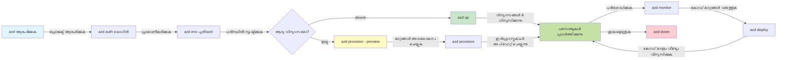
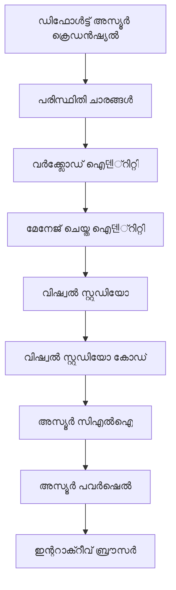

# AZD അടിസ്ഥാനങ്ങൾ - Azure Developer CLI എങ്ങനെ മനസ്സിലാക്കാം

# AZD അടിസ്ഥാനങ്ങൾ - പ്രധാന ആശയങ്ങൾയും അടിസ്ഥാന തത്വങ്ങളും

**അദ്ധ്യായ നാവിഗേഷൻ:**
- **📚 കോഴ്സ് ഹോം**: [AZD For Beginners](../../README.md)
- **📖 നിലവിലെ അദ്ധ്യായം**: Chapter 1 - Foundation & Quick Start
- **⬅️ മുൻപ്**: [Course Overview](../../README.md#-chapter-1-foundation--quick-start)
- **➡️ അടുത്തത്**: [Installation & Setup](installation.md)
- **🚀 അടുത്ത അദ്ധ്യായം**: [Chapter 2: AI-First Development](../chapter-02-ai-development/microsoft-foundry-integration.md)

## പരിചയം

ഈ പാഠം നിങ്ങളെ Azure Developer CLI (azd) എന്ന ശക്തമായ കമാൻഡ്-ലൈൻ ഉപകരണത്തിലേക്ക് പരിചയപ്പെടുത്തുന്നു, ഇത് നിങ്ങൾക്കർമുള്ളനു വികസനത്തിൽ നിന്നു Azure ഡിപ്ലോയ്‌മെന്റ് വരെ നിങ്ങളുടെ യാത്ര വേഗത്തിലാക്കുന്നു. നിങ്ങൾ അടിസ്ഥാന ആശയങ്ങൾ, പ്രധാന സവിശേഷതകൾ പഠിക്കുകയും azd എങ്ങനെ ക്ലൗഡ്-ദേശീയ അപ്ലിക്കേഷൻ ഡിപ്ലോയ്മെന്റ് എളുപ്പമാക്കുന്നു എന്ന് മനസ്സിലാക്കും.

## പഠന ലക്ഷ്യങ്ങൾ

ഈ പാഠം പൂർത്തിയാക്കിയാൽ, നിങ്ങൾക്ക്:
- Azure Developer CLI എന്താണെന്നും അതിന്റെ പ്രധാന ഉദ്ദേശ്യവും മനസ്സിലാക്കാൻ സാധിക്കും
- ടെംപ്ലേറ്റുകൾ, പരിസ്ഥിതികൾ, സേവനങ്ങൾ എന്നിവയുടെ അടിസ്ഥാന ആശയങ്ങൾ പഠിക്കാം
- ടെംപ്ലേറ്റ്-ആധാരിത വികസനം, Infrastructure as Code തുടങ്ങിയ പ്രധാന സവിശേഷതകൾ ഉൾപ്പെടെ അന്വേഷിക്കാം
- azd പ്രോജക്റ്റ് ഘടനയും വർക്ക്‌ഫ്ലോയും മനസ്സിലാക്കാം
- നിങ്ങളുടെ വികസന പരിസ്ഥിതിക്ക് azd ഇൻസ്റ്റാൾ, കോൺഫിഗർ ചെയ്യാൻ തയ്യാറാകും

## പഠനഫലങ്ങൾ

ഈ പാഠം പൂർത്തിയാക്കിയ ശേഷം, നിങ്ങൾക്ക് കഴിയുന്ന പ്രാവീണ്യം:
- ആധുനിക ക്ലൗഡ് വികസന വർക്ക്‌ഫ്ലോകളിൽ azd യുടെ പങ്ക് വിശദീകരിക്കാൻ
- azd പ്രോജക്റ്റ് ഘടനയിലെ ഘടകങ്ങൾ തിരിച്ചറിയാൻ
- ടെംപ്ലേറ്റുകളും പരിസ്ഥിതികളും സേവനങ്ങളും എങ്ങനെ ചേർന്ന് പ്രവർത്തിക്കുന്നു എന്നതിന് വിവരണം നൽകാൻ
- azd ഉപയോഗിച്ചുള്ള Infrastructure as Code ന്റെ ഗുണങ്ങള് മനസ്സിലാക്കാൻ
- വ്യത്യസ്ത azd കമാൻഡുകൾക്കും അവയുടെ ഉപയോഗവും തിരിച്ചറിഞ്ഞുകൊള്ളാൻ

## Azure Developer CLI (azd) എന്താണ്?

Azure Developer CLI (azd) ഒരു കമാൻഡ്-ലൈൻ ടൂൾ ആണ്, ഇത് നിങ്ങളുടെ ലോക്കൽ വികസനത്തിൽ നിന്നു Azure ഡിപ്ലോയ്മെന്റിലേക്ക് നിങ്ങളുടെ യാത്ര വേഗത്തിലാക്കാൻ രൂപകൽപ്പന ചെയ്തതായതാണ്. ഇത് Azure-ൽ ക്ലൗഡ്-ദേശീയ ആപ്ലിക്കേഷനുകൾ നിർമ്മിക്കുക, ഡിപ്ലോയ് ചെയ്യുക, മാനേജ് ചെയ്യുക എന്ന പ്രക്രിയ എളുപ്പമാക്കുന്നു.

### azd എന്ന ഉപകരണത്തോടെ നിങ്ങൾ എന്തെല്ലാം ഡിപ്ലോയ് ചെയ്യാം?

azd വ്യാപകമായ വകുപ്പിൽ വർക്ക്ലോഡുകൾ പിന്തുണയ്ക്കുന്നു—പട്ടിക ഇപ്പോഴും വർദ്ധിച്ചുകൊണ്ടിരിക്കുകയാണ്. ഇന്ന്, നിങ്ങൾ azd ഉപയോഗിച്ച് ഡിപ്ലോയ് ചെയ്യാൻ കഴിയും:

| വർക്ക്ലോഡ് തരം | ഉദാഹരണങ്ങൾ | ഒരേ വർക്ക്ഫ്ലോ? |
|---------------|-------------|------------------|
| **പരമ്പരാഗത അപ്ലിക്കേഷനുകൾ** | വെബ് ആപ്പുകൾ, REST APIകൾ, സ്റ്റാറ്റിക് സൈറ്റുകൾ | ✅ `azd up` |
| **സേവനങ്ങളും മൈക്രോസേവിസുകളും** | കണ്ടെയ്‌നർ ആപ്പുകൾ, ഫംഗ്ഷൻ ആപ്പുകൾ, മൾട്ടി-സർവീസ് ബാക്എൻഡുകൾ | ✅ `azd up` |
| **AI-ശക്തിയുള്ള അപ്ലിക്കേഷനുകൾ** | Microsoft Foundry മോഡലുകളുമായി ചാറ്റ് ആപ്പുകൾ, AI Search ഉപയോഗിച്ച RAG പരിഹാരങ്ങൾ | ✅ `azd up` |
| **ബുദ്ധിമാനായ ഏജന്റുകൾ** | ഫൗണ്ട്രി-ഹോസ്റ്റുചെയ്യുന്ന ഏജന്റുകൾ, മൾട്ടി-ഏജന്റ് ഓർക്കസ്‌ട്രേഷനുകൾ | ✅ `azd up` |

പ്രധാനമായ ദൃശ്യം എന്ന് പറയാനുള്ളത്, **azd ൽ ഡിപ്ലോയ് ചെയ്യുന്നതെന്തായാലും അതിന്റെ ലൈഫ്‌സൈക്കിൾ ഒരുപോലെയാണ്.** നിങ്ങൾ ഒരു പ്രോജക്റ്റ് ആരംഭിക്കുന്നു, ഇൻഫ്രാസ്ട്രക്‌ചർ ഒരുക്കുന്നു, നിങ്ങളുടെ കോഡ് ഡിപ്ലോയ് ചെയ്യുന്നു, ആപ്പ് നിരീക്ഷിക്കുന്നു, ക്ലിയൺ-അപ്പ് ചെയ്യുന്നു—അത് ഒരു ലഘു വെബ്‌സൈറ്റ് ആയാലും ഒരു സങ്കീർണ്ണ AI ഏജന്റ് ആയാലും.

ഇത് ഡിസൈനിന്റെ ഭാഗമാണ്. azd AI കഴിവുകൾ നിങ്ങളുടെ അപ്ലിക്കേഷൻ ഉപയോഗിക്കാൻ കഴിയുന്ന മറ്റൊരു സേവനമായി കാണുന്നു, അടിസ്ഥാനപരമായി വ്യത്യസ്തമായ ഒന്നായി അല്ല. Microsoft Foundry മോഡൽ പിന്താങ്ങുന്ന ഒരു ചാറ്റ് എന്റ്പോയിന്റ് azd ദൃഷ്ടിയിൽ മറ്റൊരു സേവനമായി മാത്രം കണക്കാക്കപ്പെടുന്നു.

### 🎯 എന്തിന് AZD ഉപയോഗിക്കണം? വാസ്തവ ജീവിതത്തിന്റെ താരത്യം

ഒരു ലളിതമായ വെബ് ആപ്പ് ഡാറ്റാബേസ് ഉപയോഗിച്ച് ഡിപ്ലോയ് ചെയ്യുന്നതിനെ Tara Para ടൂളിനെതിരെ താരതമ്യം ചെയ്യാം:

#### ❌ AZD ഒഴിവാക്കി: മാനുവൽ Azure ഡിപ്ലോയ്‌മെന്റ് (30+ മിനിറ്റ്)

```bash
# പടി 1: റിസോഴ്‌സ് ഗ്രൂപ്പ് സൃഷ്ടിക്കുക
az group create --name myapp-rg --location eastus

# പടി 2: ആപ്പ് സർവീസ് പ്ലാൻ സൃഷ്ടിക്കുക
az appservice plan create --name myapp-plan \
  --resource-group myapp-rg \
  --sku B1 --is-linux

# പടി 3: വെബ് ആപ്പ് സൃഷ്ടിക്കുക
az webapp create --name myapp-web-unique123 \
  --resource-group myapp-rg \
  --plan myapp-plan \
  --runtime "NODE:18-lts"

# പടി 4: കോസ്മോസ് ഡീബി അക്കൗണ്ട് സൃഷ്ടിക്കുക (10-15 മിനിറ്റ്)
az cosmosdb create --name myapp-cosmos-unique123 \
  --resource-group myapp-rg \
  --kind MongoDB

# പടി 5: ഡാറ്റാബേസ് സൃഷ്ടിക്കുക
az cosmosdb mongodb database create \
  --account-name myapp-cosmos-unique123 \
  --resource-group myapp-rg \
  --name tododb

# പടി 6: ശേഖരം സൃഷ്ടിക്കുക
az cosmosdb mongodb collection create \
  --account-name myapp-cosmos-unique123 \
  --resource-group myapp-rg \
  --database-name tododb \
  --name todos

# പടി 7: കണക്ഷൻ സ്ട്രിംഗ് നേടുക
CONN_STR=$(az cosmosdb keys list \
  --name myapp-cosmos-unique123 \
  --resource-group myapp-rg \
  --type connection-strings \
  --query "connectionStrings[0].connectionString" -o tsv)

# പടി 8: ആപ് സജ്ജീകരണങ്ങൾ ക്രമീകരിക്കുക
az webapp config appsettings set \
  --name myapp-web-unique123 \
  --resource-group myapp-rg \
  --settings MONGODB_URI="$CONN_STR"

# പടി 9: ലോഗിംഗ് സജീവമാക്കുക
az webapp log config --name myapp-web-unique123 \
  --resource-group myapp-rg \
  --application-logging filesystem \
  --detailed-error-messages true

# പടി 10: ആപ്ലിക്കേഷൻ ഇൻസൈറ്റ്‌സുകൾ സജ്ജമാക്കുക
az monitor app-insights component create \
  --app myapp-insights \
  --location eastus \
  --resource-group myapp-rg

# പടി 11: ആപ്പ് ഇൻസൈറ്റ്‌സുകളെ വെബ് ആപ്പിനോട് ലിങ്ക് ചെയ്യുക
INSTRUMENTATION_KEY=$(az monitor app-insights component show \
  --app myapp-insights \
  --resource-group myapp-rg \
  --query "instrumentationKey" -o tsv)

az webapp config appsettings set \
  --name myapp-web-unique123 \
  --resource-group myapp-rg \
  --settings APPINSIGHTS_INSTRUMENTATIONKEY="$INSTRUMENTATION_KEY"

# പടി 12: പ്രയോഗം നാട്ടിൽ നിർമാണം നടത്തുക
npm install
npm run build

# പടി 13: ഡിപ്പ്ലോയ്മെന്റ് പാക്കേജ് സൃഷ്ടിക്കുക
zip -r app.zip . -x "*.git*" "node_modules/*"

# പടി 14: ആപ്‌സ് ഡിപ്പ്ലോയ് ചെയ്യുക
az webapp deployment source config-zip \
  --resource-group myapp-rg \
  --name myapp-web-unique123 \
  --src app.zip

# പടി 15: နോഴിയ്ക്കുകയും പ്രാർത്ഥിക്കുകയും ചെയ്യുക, അത് പ്രവർത്തിക്കട്ടെ 🙏
# (സ്വയം പരിശോധിക്കൽ ഇല്ല, മാനുവൽ ടെസ്റ്റിംഗ് ആവശ്യമാണ്)
```

**പ്രശ്നങ്ങൾ:**
- ❌ ഓർമ്മിക്കാനും നിയന്ത്രിക്കാനും 15+ കമാൻഡുകൾ
- ❌ 30-45 മിനിറ്റ് മാനുവൽ പ്രവർത്തനം
- ❌ തെറ്റുകൾ നടക്കാൻ സുലഭം (ടൈപ്പോകൾ, തെറ്റായ പാരാമീറ്ററുകൾ)
- ❌ ടേർമിനൽ ചരിത്രത്തിൽ കണക്ഷൻ സ്ട്രിങ്കുകൾ വെളിപ്പെടുത്തും
- ❌ പരാജയപ്പെട്ടാൽ സ്വയം റോള്ബാക്ക് ഇല്ല
- ❌ ടീമംഗങ്ങൾക്ക് പുനരാവൃത്തി ചെയ്യാൻ പ്രയാസം
- ❌ ഓരോ തവണയും വ്യത്യസ്തം (പുനരുജ്ജീവിച്ചാവാത്തത്)

#### ✅ AZD ഉപയോഗിച്ച്: ഓട്ടോമേറ്റഡ് ഡിപ്ലോയ്‌മെന്റ് (5 കമാൻഡുകൾ, 10-15 മിനിറ്റ്)

```bash
# ഘട്ടം 1: ടെംപ്ലേറ്റിൽ നിന്നും ആരംഭിക്കുക
azd init --template todo-nodejs-mongo

# ഘട്ടം 2: പ്രമാണീകരിക്കുക
azd auth login

# ഘട്ടം 3: പരിസ്ഥിതി സൃഷ്‌ടിക്കുക
azd env new dev

# ഘട്ടം 4: മാറ്റങ്ങൾ മുൻകാഴ്ച (ഐച്ഛികം എന്നാൽ ശുപാർശ ചെയ്യുന്നു)
azd provision --preview

# ഘട്ടം 5: എല്ലാം വിന്യസിക്കുക
azd up

# ✨ പൂർത്തിയായി! എല്ലാം വിന്യസിച്ചിരിക്കുന്നു, ക്രമീകരിച്ചിരിക്കുന്നു, നിരീക്ഷിക്കപ്പെടുന്നു
```

**ഗുണങ്ങൾ:**
- ✅ **5 കമാൻഡുകൾ** vs. 15+ മാനുവൽ സ്റ്റെപ്പുകൾ
- ✅ **10-15 മിനിറ്റ്** മൊത്തം സമയം (അധ്യക്ഷമായി Azure കാത്തിരിപ്പ്)
- ✅ **കുറഞ്ഞ മാനുവൽ പിഴവുകൾ** - സ്ഥിരതയുള്ള, ടെംപ്ലേറ്റ്-ഡ്രിവൻ വർക്ക്‌ഫ്ലോ
- ✅ **സുരക്ഷിത സീക്രട്ട് കൈകാര്യം** - പല ടെംപ്ലേറ്റുകളും Azure മാനേജ് ചെയ്ത രഹസ്യ സംഭരണം ഉപയോഗിക്കുന്നു
- ✅ **പുനരാവൃത്തി സാധ്യമായ ഡിപ്ലോയ്മെന്റുകൾ** - എല്ലാ തവണയും ഒരേ വർക്ക്‌ഫ്ലോ
- ✅ **സമർത്ഥമായ പുനരാവൃത്തി** - എല്ലാറ്റിനും ഒരേ ഫലം
- ✅ **ടീം റഡീ** - ആര്‍ക്കും ഒരുപോലെ കമാൻഡുകളുമായി ഡിപ്ലോയ് ചെയ്യാൻ കഴിയും
- ✅ **Infrastructure as Code** - വകഭേദം നിയന്ത്രിച്ച ബൈസെപ് ടെംപ്ലേറ്റുകൾ
- ✅ **ഇൻബിൽറ്റ് നിരീക്ഷണം** - Application Insights സ്വയം ക്രമീകരിച്ചിരിക്കുന്നു

### 📊 സമയം & പിഴവ് കുറവ്

| മെട്രിക് | മാനുവൽ ഡിപ്ലോയ്മെന്റ് | AZD ഡിപ്ലോയ്മെന്റ് | മെച്ചപ്പാട്ട് |
|:---------|:-----------------------|:-------------------|:------------|
| **കമാൻഡുകൾ** | 15+ | 5 | 67% കുറവ് |
| **സമയം** | 30-45 മിനിറ്റ് | 10-15 മിനിറ്റ് | 60% വേഗം |
| **പിഴവ് നിരക്ക്** | ~40% | <5% | 88% കുറവ് |
| **സ്ഥിരത** | താഴെ (മാനുവൽ) | 100% (ഓട്ടോമേറ്റഡ്) | പൂർണമായും ശരി |
| **ടീം ഓൺബോഡിയിംഗ്** | 2-4 മണിക്കൂർ | 30 മിനിറ്റ് | 75% വേഗം |
| **റോള്ബാക്ക് സമയം** | 30+ മിനിറ്റ് (മാനുവൽ) | 2 മിനിറ്റ് (ഓട്ടോമേറ്റഡ്) | 93% വേഗം |

## പ്രധാന ആശയങ്ങൾ

### ടെംപ്ലേറ്റുകൾ
ടെംപ്ലേറ്റുകൾ azd ന്റെ അടിസ്ഥാനം ആണ്. അവയിൽ അടങ്ങിയിരിക്കുന്നതും:
- ** അപ്ലിക്കേഷൻ കോഡ്** - നിങ്ങളുടെ സോഴ്‌സ് കോഡ്, ആശ്രിതങ്ങൾ
- ** ഇൻഫ്രാസ്ട്രക്‌ചർ സംജ്ഞാനങ്ങൾ** - Azure വൻമാനങ്ങളുടെ നിർവചനങ്ങൾ Bicep അല്ലെങ്കിൽ Terraform ൽ
- ** കോൺഫിഗറേഷൻ ഫയലുകൾ** - ക്രമീകരണങ്ങൾ, പരിസ്ഥിതി വ്യത്യാസങ്ങൾ
- ** ഡിപ്ലോയ്‌മെന്റ് സ്‌ക്രിപ്റ്റുകൾ** - ഓട്ടോമേറ്റഡ് ഡിപ്ലോയ്മെന്റ് വർക്ക്‌ഫ്ലോ

### പരിസ്ഥിതികൾ
പരിസ്ഥിതികൾ വ്യത്യസ്ത ഡിപ്ലോയ്‌മെന്റ് ലക്ഷ്യങ്ങൾ പ്രതിനിധാനം ചെയ്യുന്നു:
- **വികസനം** - ടെസ്റ്റിംഗ്, ഡവലപ്പ്മെന്റ്
- **സ്റ്റേജിംഗ്** - പ്രീ-പ്രൊഡക്ഷൻ പരിസ്ഥിതി
- **പ്രൊഡക്ഷൻ** - ലൈവ് പ്രൊഡക്ഷൻ പരിസ്ഥിതി

ഓരോ പരിസ്ഥിതിക്കും സ്വന്തമായി ഉണ്ട്:
- Azure റിസോഴ്‌സ് ഗ്രൂപ്പ്
- കോൺഫിഗറേഷൻ ക്രമീകരണങ്ങൾ
- ഡിപ്ലോയ്മെന്റ് സ്ഥിതി

### സേവനങ്ങൾ
സേവനങ്ങൾ നിങ്ങളുടെ അപ്ലിക്കേഷന്റെ നിർമ്മിത ഘടകങ്ങളാണ്:
- **ഫ്രണ്ട്-എൻഡ്** - വെബ് അപ്ലിക്കേഷനുകൾ, SPAകൾ
- **ബാക്ക്-എൻഡ്** - APIകൾ, മൈക്രോസേവിസുകൾ
- **ഡാറ്റാബേസ്** - ഡാറ്റാ സംഭരണ സൊല്യൂഷനുകൾ
- **സ്റ്റോറേജ്** - ഫയൽ, ബ്ലോബ് സ്റ്റോറേജ്

## പ്രധാന സവിശേഷതകൾ

### 1. ടെംപ്ലേറ്റ്-ഡ്രിവൻ വികസനം
```bash
# ലഭ്യമായ ടെംപ്ലേറ്റുകൾബ്രൗസ് ചെയ്യുക
azd template list

# ഒരു ടെംപ്ലേറ്റിൽ നിന്നു ആരംഭിക്കുക
azd init --template <template-name>
```

### 2. Infrastructure as Code
- **Bicep** - Azure ന്റെ ഡൊമെയ്ൻ-സ്പെസിഫിക് ലാംഗ്വേജ്
- **Terraform** - മൾട്ടി ക്ലൗഡ് ഇൻഫ്രാസ്ട്രക്‌ചർ ടൂൾ
- **ARM Templates** - Azure Resource Manager ടെംപ്ലേറ്റുകൾ

### 3. സംയോജിത വർക്ക്‌ഫ്ലോകൾ
```bash
# പൂര്‍ണ്ണമായ ഡിസ്പ്‌ളോയ്മെന്റ് പ്രവൃത്തി ഘട്ടം
azd up            # പ്രൊവിഷന് + ഡിസ്പ്‌ളോയ്, ആദ്യസമയം സജ്ജമാക്കല്‍ പൂര്‍ത്തിയാക്കാനാണ് ഇത്

# 🧪 പുതിയതായിരിക്കുന്നു: ഡിസ്പ്‌ളോയ്മെന്റിന് മുന്‍പ് ഇന്‍‌ഫ്രാസ്ട്രക്ചര്‍ മാറ്റങ്ങള്‍ പ്രിവ്യൂചെയ്യൂ (സുരക്ഷിതം)
azd provision --preview    # മാറ്റങ്ങള്‍ വരുത്താതെ ഇന്‍‌ഫ്രാസ്ട്രക്ചര്‍ ഡിസ്പ്‌ളോയ്മെന്റ് സിമുലേറ്റ് ചെയ്യുക

azd provision     # ഇന്‍‌ഫ്രാസ്ട്രക്ചര്‍ അപ്‍ഡേറ്റ് ചെയ്താല്‍ ആസ്യൂര്‍ റിസോഴ്‌സുകള്‍ സൃഷ്ടിക്കാന്‍ ഇത് ഉപയോഗിക്കുക
azd deploy        # അപ്‌ഡേറ്റ് ചെയ്തതിനുശേഷം ആപ്ലിക്കേഷന്‍ കോഡ് ഡിസ്പ്‌ളോയ് ചെയ്യുക അല്ലെങ്കില്‍ പുനഃഡിസ്‌പ്ലോയ് ചെയ്യുക
azd down          # റിസോഴ്‌സുകള്‍ ശുചിത്വം നിര്‍വഹിക്കുക
```

#### 🛡️ ദൃശ്യമൂല്യനിർണയത്തോടെ സുരക്ഷിത ഇൻഫ്രാസ്ട്രക്‌ചർ പദ്ധതിയിടൽ
`azd provision --preview` കമാൻഡ് സുരക്ഷിതമായ ഡിപ്ലോയ്മെന്റിനായി ഗെയിം-ചേഞ്ചർ ആണ്:
- **ഡ്രൈ-റൺ വിശകലനം** - എന്തുകൾ സൃഷ്ടിക്കപ്പെടും, തിരുത്തപ്പെടും, ഇല്ലാതാക്കപ്പെടും എന്ന് കാണിക്കുന്നു
- **പൂർണ്ണ സുരക്ഷ** - നിങ്ങളുടെ Azure പരിസ്ഥിതിയിൽ യഥാർഥ മാറ്റങ്ങൾ ഉണ്ടാകുന്നതില്ല
- **ടീം സഹകരണം** - ഡിപ്ലോയ്‌മെന്റിന് മുൻപ് പ്രിവ്യൂ ഫലങ്ങൾ പങ്കുവെക്കാം
- **ചെലവു കണക്കുകൂട്ടൽ** - പ്രതിജ്ഞ ചെയ്യുന്നതിന് മുൻപായി റിസോഴ്‌സ് ചെലവുകൾ മനസിലാക്കുക

```bash
# ഉദാഹരണ പ്രിവ്യൂ പ്രവൃത്തു
azd provision --preview           # എന്ത് മാറ്റാം എന്ന് കാണുക
# ഔട്ട്പുട്ട് വിലയിരുത്തുക, ടീമിനൊപ്പം ചര്‍ച്ച ചെയ്യുക
azd provision                     # ആത്മവിശ്വാസത്തോടെ മാറ്റങ്ങള്‍ നടപ്പിലാക്കുക
```

### 📊 ദൃശ്യവത്കരണം: AZD വികസന വർക്ക്‌ഫ്ലോ


**വർക്ക്‌ഫ്ലോ വിശദീകരണം:**
1. **Init** - ടെംപ്ലേറ്റ് അല്ലെങ്കിൽ പുതിയ പ്രോജക്റ്റുമായി ആരംഭിക്കുക
2. **Auth** - Azure ന്റെ അംഗീകാരം
3. **Environment** - ഒറ്റപ്പെടിച്ച ഡിപ്ലോയ്മെന്റ് പരിസ്ഥിതി സൃഷ്ടിക്കുക
4. **Preview** - 🆕 എപ്പോഴും ഇൻഫ്രാസ്ട്രക്‌ചർ മാറ്റങ്ങൾ ആദ്യം പ്രിവ്യൂ ചെയ്യുക (സുരക്ഷിത രീതിയിലുള്ള പ്രയോഗം)
5. **Provision** - Azure വൻമാനങ്ങൾ സൃഷ്ടിക്കുക / അപ്‌ഡേറ്റ് ചെയ്യുക
6. **Deploy** - നിങ്ങളുടെ അപ്ലിക്കേഷൻ കോഡ് പുഷ് ചെയ്യുക
7. **Monitor** - അപ്ലിക്കേഷൻ പ്രകടനം നിരീക്ഷിക്കുക
8. **Iterate** - മാറ്റങ്ങൾ ചെയ്ത് കോഡ് വീണ്ടും ഡിപ്ലോയ് ചെയ്യുക
9. **Cleanup** - ജോലം ചെയ്തു കഴിഞ്ഞ റിസോഴ്‌സുകൾ നീക്കംചെയ്യുക

### 4. പരിസ്ഥിതി മാനേജ്മെന്റ്
```bash
# പരിതസ്ഥിതികൾ സൃഷ്ടിക്കുക നിയന്ത്രിക്കുക
azd env new <environment-name>
azd env select <environment-name>
azd env list
```

### 5. എക്സ്റ്റെൻഷനുകളും AI കമാൻഡുകളും

azd ഒരു എക്സ്റ്റെൻഷൻ സിസ്റ്റം ഉപയോഗിച്ച് പ്രധാന CLI നും പുറകെയുള്ള കഴിവുകൾ കൂട്ടിച്ചേർക്കുന്നു. ഇത് പ്രത്യേകിച്ച് AI വർക്ക്ലോഡുകൾക്ക് ഉപകാരപ്രദമാണ്:

```bash
# ലഭ്യമായ വിപുലീകരണങ്ങൾ പട്ടികപ്പെടുത്തുക
azd extension list

# ഫൗണ്ടറി ഏജന്റുകൾ വിപുലീകരണം ഇൻസ്റ്റാൾ ചെയ്യുക
azd extension install azure.ai.agents

# മാനിഫെസ്റ്റ് നിന്ന് ഒരു എ.ഐ. ഏജന്റ് പ്രോജക്ട് തുടങ്ങിയിടുക
azd ai agent init -m agent-manifest.yaml

# എ.ഐ. സഹായ付き വികസനത്തിന് MCP സർവർ ആരംഭിക്കുക (ആൽഫ)
azd mcp start
```

> എക്സ്റ്റെൻഷനുകൾ വിശദമായി [Chapter 2: AI-First Development](../chapter-02-ai-development/agents.md) ലും [AZD AI CLI Commands](../chapter-08-production/production-ai-practices.md#azd-ai-cli-commands-and-extensions) റിഫറൻസ് ലും ഉൾപ്പെടുത്തിയിട്ടുണ്ട്.

## 📁 പ്രോജക്റ്റ് ഘടന

സാധാരണ ഒരു azd പ്രോജക്റ്റിന്റെ ഘടന:
```
my-app/
├── .azd/                    # azd configuration
│   └── config.json
├── .azure/                  # Azure deployment artifacts
├── .devcontainer/          # Development container config
├── .github/workflows/      # GitHub Actions
├── .vscode/               # VS Code settings
├── infra/                 # Infrastructure code
│   ├── main.bicep        # Main infrastructure template
│   ├── main.parameters.json
│   └── modules/          # Reusable modules
├── src/                  # Application source code
│   ├── api/             # Backend services
│   └── web/             # Frontend application
├── azure.yaml           # azd project configuration
└── README.md
```

## 🔧 ക്രമീകരണ ഫയലുകൾ

### azure.yaml
പ്രധാനം പ്രോജക്റ്റ് ക്രമീകരണ ഫയൽ:
```yaml
name: my-awesome-app
metadata:
  template: my-template@1.0.0

services:
  web:
    project: ./src/web
    language: js
    host: appservice
  api:
    project: ./src/api
    language: js
    host: appservice

hooks:
  preprovision:
    shell: pwsh
    run: echo "Preparing to provision..."
```

### .azure/config.json
പരിസ്ഥിതി-കഥിത ക്രമീകരണങ്ങൾ:
```json
{
  "version": 1,
  "defaultEnvironment": "dev",
  "environments": {
    "dev": {
      "subscriptionId": "your-subscription-id",
      "location": "eastus"
    }
  }
}
```

## 🎪 സാധാരണ വർക്ക്‌ഫ്ലോകൾ ഹാൻഡ്‌സ്-ഓൺ എക്സെർസൈസുകളുമായി

> **💡 പഠന ടിപ്പ്:** നിങ്ങൾക്കു ക്രമം പാലിച്ച് ഈ അഭ്യാസങ്ങൾ ചെയ്യാൻ സാദ്ധ്യതയുള്ള AZD കഴിവുകൾ ക്രമേണ വികസിപ്പിക്കാൻ സഹായിക്കും.

### 🎯 അഭ്യാസം 1: നിങ്ങളുടെ ആദ്യ പ്രോജക്റ്റ് ആരംഭിക്കുക

**ലക്‌ഷ്യം:** ഒരു AZD പ്രോജക്റ്റ് സൃഷ്ടിക്കുകയും അതിന്റെ ഘടന പരീക്ഷിക്കയും ചെയ്യുക

**പടികൾ:**
```bash
# പ്രൂവുചെയ്ത ടെംപ്ലേറ്റ് ഉപയോഗിക്കുക
azd init --template todo-nodejs-mongo

# സൃഷ്ടിച്ച ഫയലുകൾ പരിശോധിക്കുക
ls -la  # മറഞ്ഞ ഫയലുകൾ ഉൾപ്പെടെ എല്ലാം കാണുക

# സൃഷ്ടിച്ച പ്രധാന ഫയലുകൾ:
# - azure.yaml (പ്രധാന കോൺഫിഗ്)
# - infra/ (അഡിസ്ഥാന ഘടന കോഡ്)
# - src/ (ആപ്ലിക്കേഷൻ കോഡ്)
```

**✅ വിജയം:** നിങ്ങൾക്കുണ്ട് azure.yaml, infra/, src/ ഡയറക്ടറികൾ

---

### 🎯 അഭ്യാസം 2: Azure-ലേക്ക് ഡിപ്ലോയ് ചെയ്യുക

**ലക്‌ഷ്യം:** ആരംഭം മുതൽ അവസാനം വരെയുള്ള ഡിപ്ലോയ്‌മെന്റ് പൂർത്തിയാക്കുക

**പടികൾ:**
```bash
# 1. പ്രാമാണീകരിക്കുക
az login && azd auth login

# 2. പരിസ്ഥിതി സൃഷ്ടിക്കുക
azd env new dev
azd env set AZURE_LOCATION eastus

# 3. മാറ്റങ്ങൾ മുൻകാഴ്ച നോക്കുക (ശുപാർശ ചെയ്യുന്നു)
azd provision --preview

# 4. എല്ലാം ഡെപ്ലോയ് ചെയ്യുക
azd up

# 5. ഡെപ്ലോയ്‌മെന്റ് സ്ഥിരീകരിക്കുക
azd show    # നിങ്ങളുടെ ആപ്പ് URL കാണുക
```

**പ്രതീക്ഷിക്കപ്പെടുന്ന സമയം:** 10-15 മിനിറ്റ്  
**✅ വിജയം:** അപ്ലിക്കേഷൻ URL ബ്രൗസറിൽ തുറക്കും

---

### 🎯 അഭ്യാസം 3: നിരവധി പരിസ്ഥിതികൾ

**ലക്‌ഷ്യം:** dev, staging-ലേക്ക് ഡിപ്ലോയ് ചെയ്യുക

**പടികൾ:**
```bash
# ഇതിനകം dev ഉണ്ടെങ്കിൽ, staging സൃഷ്ടിക്കുക
azd env new staging
azd env set AZURE_LOCATION westus2
azd up

# അവയിൽ സ്വിച്ച് ചെയ്യുക
azd env list
azd env select dev
```

**✅ വിജയം:** Azure പോർട്ടൽ-ൽ രണ്ട് വേറിട്ട റിസോഴ്‌സ് ഗ്രൂപ്പുകൾ

---

### 🛡️ ക്ലീന slate: `azd down --force --purge`

നിങ്ങൾ പൂർണ്ണമായും റീസെറ്റ് ചെയ്യേണ്ടപ്പോൾ:

```bash
azd down --force --purge
```

**എന്താണ് ചെയ്യുന്നത്:**
- `--force`: ഒരു സ്ഥിരീകരണ പ്രോംപ്റ്റും ഇല്ലാതെ
- `--purge`: എല്ലാ ലോക്കൽ സ്റ്റേയ്റ്റും Azure റിസോഴ്‌സുകളും ഡിലീറ്റ് ചെയ്യുന്നു

**ഉപയോഗിക്കേണ്ട സമയം:**
- ഡിപ്ലോയ്‌മെന്റ് മധ്യേ പരാജയപ്പെട്ടാൽ
- പ്രോജക്റ്റുകൾ മാറ്റുമ്പോൾ
- പുതുതായി തുടങ്ങേണ്ടപ്പോൾ

---

## 🎪 പ്രാഥമിക വർക്ക്‌ഫ്ലോ റഫറൻസ്

### പുതിയ പ്രോജക്റ്റ് ആരംഭിക്കൽ
```bash
# മാർഗം 1: നിലവിലുള്ള സൊമ്പിൾ ഉപയോഗിക്കുക
azd init --template todo-nodejs-mongo

# മാർഗം 2: തുടക്കം മുതൽ തുടങ്ങുക
azd init

# മാർഗം 3: നിലവിലുള്ള ഡയറക്ടറി ഉപയോഗിക്കുക
azd init .
```

### വികസന ചക്രം
```bash
# വികസന പരിസ്ഥിതി സജ്ജമാക്കുക
azd auth login
azd env new dev
azd env select dev

# എല്ലാം വിന്യസിപ്പിക്കുക
azd up

# മാറ്റങ്ങൾ ചെയ്യുക ಮತ್ತು പുനർവിന്യസിപ്പിക്കുക
azd deploy

# പൂർത്തിയാക്കിയ ശേഷം ശുചീകരണ പ്രവർത്തനങ്ങൾ ചെയ്യുക
azd down --force --purge # Azure Developer CLIയിലെ കമാൻഡ് നിങ്ങളുടെ പരിസ്ഥിതിക്ക് **ഹാർഡ് റീസെറ്റ്** ആണ്—വിഫലമായ വിന്യസനങ്ങൾ തിരുത്തുമ്പോൾ, വേർപെട്ട വിഭവങ്ങൾ ശുചീകരിക്കുമ്പോൾ, അല്ലെങ്കിൽ പുതിയ വിന്യസനത്തിനായി തയ്യാറെടുക്കുമ്പോൾ പ്രത്യേകമായി സഹായകരമാണ്.
```

## `azd down --force --purge` മനസ്സിലാക്കൽ
`azd down --force --purge` കമാൻഡ് നിങ്ങളുടെ azd പരിസ്ഥിതിയും എല്ലാ ബന്ധപ്പെട്ട ഉറവിടവും പൂർണ്ണമായും നീക്കംചെയ്യാനുള്ള ശക്തമായ മാർഗമാണ്. ഓരോ ഫ്‌ളാഗിന്റെ പ്രവർത്തനം താഴെ:

```
--force
```
- സ്ഥിരീകരണ പ്രോംപ്റ്റുകൾ ഒഴിവാക്കുന്നു.
- മാനുവൽ എൻപുട്ട് പ്രയാസമുള്ള ഓട്ടോമേഷൻ അല്ലെങ്കിൽ സ്ക്രിപ്റ്റിങ്ങിന് ഉചിതം.
- CLI അസംബന്ധങ്ങൾ കണ്ടെത്തിച്ചാണ്ട് തടസ്സംവരാതെ ടെർഡൗൺ നടത്തും.

```
--purge
```
ഇലീറ്റ് ചെയ്യുന്നത് **എല്ലാ ബന്ധപ്പെട്ട മെടാഡേറ്റയും**, ഉൾപ്പെടെ:
പരിസ്ഥിതി സ്ഥിതി  
ലോക്കൽ `.azure` ഫോൾഡർ  
കാഷ് ചെയ്ത ഡിപ്ലോയ്‌മെന്റ് വിവരങ്ങൾ  
azd മുമ്പത്തെ ഡിപ്ലോയ്‌മെന്റുകൾ " ഓർമ്മിക്കാൻ" കഴിയാതെ വയ്ക്കുന്നു, ഇത് അശ്രദ്ധാപൂർവ്വമുള്ള റിസോഴ്‌സ് ഗ്രൂപ്പ് പൊരുത്തക്കേടുകൾ അല്ലെങ്കിൽ പഴകിയ രജിസ്ട്രി റഫറൻസുകളുടെ പ്രശ്നങ്ങൾ ഉണ്ടാക്കാറുണ്ട്.

### എന്തിന് ഇരുവരും ഉപയോഗിക്കണം?
`azd up` ൽ നിലനിൽക്കുന്ന സ്റ്റേറ്റ് അല്ലെങ്കിൽ ഭാഗിക ഡിപ്ലോയ്‌മെന്റുകളുടെ പ്രശ്നങ്ങൾ ഉണ്ടായാൽ, ഈ കോംബോ **ശുദ്ധമായ തുടക്കം** ഉറപ്പാക്കുന്നു.

ഇത് പ്രത്യേകിച്ച് Azure പോർട്ടലിൽ മാനുവൽ റിസോഴ്‌സ് ഡിലീഷനു ശേഷം, ടെംപ്ലേറ്റുകൾ, പരിസ്ഥിതികൾ അല്ലെങ്കിൽ റിസോഴ്‌സ് ഗ്രൂപ്പ് നാമകരണം മാറ്റുമ്പോൾ ഉപകാരപ്രദമാണ്.

### വ്യത്യസ്ത പരിസ്ഥിതികൾ നിയന്ത്രിക്കൽ
```bash
# സ്റ്റേജിംഗ് പരിസ്ഥിതി സൃഷ്ടിക്കുക
azd env new staging
azd env select staging
azd up

# ഡെവിലേക്ക് മടങ്ങുക
azd env select dev

# പരിസ്ഥിതികൾ താരതമ്യം ചെയ്യുക
azd env list
```

## 🔐 അംഗീകാരം എന്ന ക്രെഡൻഷ്യലുകൾ

അംഗീകാരം സ്വാഭാവികമായി azd ഡിപ്ലോയ്‌മെന്റിന്റെ വിജയത്തിനായി നിർണായകമാണ്. Azure მრავალ്വിധ അംഗീകാരം മാർഗങ്ങൾ ഉപയോഗിക്കുന്നു, azd മറ്റ് Azure ടൂളുകൾ ഉപയോഗിക്കുന്നതിനുള്ള ίδια ക്രെഡൻഷ്യൽ ചെയിൻ ഉപയോഗിക്കുന്നു.

### Azure CLI അംഗീകാരം (`az login`)

azd ഉപയോഗിക്കുന്നതിന് മുൻപ്, നിങ്ങൾ Azure-യിൽ ലോഗിൻ ചെയ്യേണ്ടതാണ്. സാധാരണ മാർഗം Azure CLI ഉപയോഗിക്കുകയാണ്:

```bash
# ഇന്ററാക്ടീവ് ലോഗിൻ (ബ്രൗസർ തുറക്കുന്നു)
az login

# നിർദ്ദിഷ്ട ടെനന്റുമായി ലോഗിൻ ചെയ്യുക
az login --tenant <tenant-id>

# സർവീസ് പ്രിൻസിപ്പലുമായി ലോഗിൻ ചെയ്യുക
az login --service-principal -u <app-id> -p <password> --tenant <tenant-id>

# നിലവിലെ ലോഗിൻ നില പരിശോധിക്കുക
az account show

# ലഭ്യമായ സബ്സ്ക്രിപ്ഷനുകൾ പട്ടികപ്പെടുത്തുക
az account list --output table

# ഡീഫോൾട്ട് സബ്സ്ക്രിപ്ഷൻ സജ്ജമാക്കുക
az account set --subscription <subscription-id>
```

### അംഗീകാര പ്രവാഹം
1. **ഇന്ററാക്ടീവ് ലോഗിൻ**: ഡിഫോൾട്ട് ബ്രൗസർ തുറന്ന് അംഗീകാരം നടത്തുക
2. **Device Code Flow**: ബ്രൗസർ ഇല്ലാത്ത പരിസ്ഥിതികൾക്കായി
3. **സർവീസ് പ്രിൻസിപ്പൽ**: ഓട്ടോമേഷൻ, CI/CD സാഹചര്യങ്ങൾക്ക്
4. **Managed Identity**: Azure ഹോസ്റ്റ് ചെയ്ത അപ്ലിക്കേഷനുകൾക്കായി

### DefaultAzureCredential ചെയിൻ

`DefaultAzureCredential` ഒരു ക്രെഡൻഷ്യൽ തരം ആണ്, ഇത് നിരവധി ക്രെഡൻഷ്യൽ ഉറവിടങ്ങൾ നിരത്തിപ്പോകുന്നു, പ്രത്യേകമായ ക്രമത്തിൽ സ്വയം ശ്രമിച്ച് ഏകീകരിച്ച അംഗീകാരം നൽകുന്നു:

#### ക്രെഡൻഷ്യൽ ചെയിൻ ഓർഡർ

#### 1. പാരിസ്ഥിതി വ്യത്യാസങ്ങൾ
```bash
# സർവീസ് പ്രിൻസിപ്പാളിനായി പരിസ്ഥിതി വേരിയബിളുകൾ സജ്ജീകരിക്കുക
export AZURE_CLIENT_ID="<app-id>"
export AZURE_CLIENT_SECRET="<password>"
export AZURE_TENANT_ID="<tenant-id>"
```

#### 2. വർക്ക്ലോഡ് ഐഡന്റിറ്റി (Kubernetes/GitHub Actions)
സ്വയം ഉപയോഗിക്കുന്നു:
- Azure Kubernetes Service (AKS) വർക്ക്ലോഡ് ഐഡന്റിറ്റി
- GitHub Actions OIDC ഫെഡറേഷൻ
- മറ്റ് ഫെഡറേറ്റഡ് ഐഡന്റിറ്റി സാഹചര്യങ്ങൾ

#### 3. Managed Identity
Azure വൻമാനങ്ങൾക്കായി:
-വർച്വൽ മെഷീനുകൾ  
-ആപ്പ് സർവീസ്  
-Azure ഫംഗ്ഷൻസ്  
-കണ്ടെയിനർ ഇൻസ്റ്റൻസുകൾ  

```bash
# മാനേജുചെയ്‌ത ഐഡന്റിറ്റി ഉപയോഗിച്ച് ആസ്യുര്‍ റിസോഴ്‌സില്‍ ഓടുന്നുണ്ടോ എന്ന് പരിശോധിക്കുക
az account show --query "user.type" --output tsv
# മടക്കുക: മാനേജുചെയ്‌ത ഐഡന്റിറ്റി ഉപയോഗിക്കുകയാണെങ്കില്‍ "servicePrincipal"
```

#### 4. ഡെവലപ്പർ ടൂൾസ് ഇന്റഗ്രേഷൻ
- **Visual Studio**: സൈൻ-ഇൻ അക്കൗണ്ട് സ്വയം ഉപയോഗിക്കുന്നു
- **VS Code**: Azure Account എക്സ്റ്റെൻഷൻ ക്രെഡൻഷ്യലുകൾ ഉപയോഗിക്കുന്നു
- **Azure CLI**: `az login` ക്രെഡൻഷ്യലുകൾ ഉപയോഗിക്കുന്നു (ലോക്കൽ ഡവലപ്പ്മെന്റിന് ഏറ്റവും സാധാരണം)

### AZD അംഗീകാരം ക്രമീകരണം

```bash
# രീതിയ്‌ 1: Azure CLI ഉപയോഗിക്കുക (വികസനത്തിനായി ശുപാർശ ചെയ്യുന്നു)
az login
azd auth login  # നിലവിലുള്ള Azure CLI പ്രവേശന വിവരങ്ങൾ ഉപയോഗിക്കുന്നു

# രീതിയ്‌ 2: നേരിട്ട് azd പ്രാമാണീകരണം
azd auth login --use-device-code  # തലവൃത്തമില്ലാത്ത പരിസരങ്ങൾക്ക് വേണ്ടി

# രീതിയ്‌ 3: പ്രാമാണീകരണ നില പരിശോധിക്കുക
azd auth login --check-status

# രീതിയ്‌ 4: ലോഗൗട്ട് ചെയ്ത് വീണ്ടും പ്രാമാണീകരിക്കുക
azd auth logout
azd auth login
```

### അംഗീകാരം നന്നായ പ്രവൃത്തികൾ  

#### ലോക്കൽ ഡവലപ്പ്മെന്റിനായി
```bash
# 1. ആസ്യൂർ CLI ഉപയോഗിച്ച് ലോഗിൻ ചെയ്യുക
az login

# 2. ശരിയായ സബ്സ്ക്രിപ്ഷൻ സ്ഥിരീകരിക്കുക
az account show
az account set --subscription "Your Subscription Name"

# 3. നിലവിലുള്ള ക്രെഡൻഷ്യലുകൾ ഉപയോഗിച്ച് azd ഉപയോഗിക്കുക
azd auth login
```

#### CI/CD പൈപ്പ്ലൈനുകൾക്കായി
```yaml
# GitHub Actions example
- name: Azure Login
  uses: azure/login@v1
  with:
    creds: ${{ secrets.AZURE_CREDENTIALS }}

- name: Deploy with azd
  run: |
    azd auth login --client-id ${{ secrets.AZURE_CLIENT_ID }} \
                    --client-secret ${{ secrets.AZURE_CLIENT_SECRET }} \
                    --tenant-id ${{ secrets.AZURE_TENANT_ID }}
    azd up --no-prompt
```

#### പ്രൊഡക്ഷൻ പരിസ്ഥിതികൾക്കായി
- Azure വൻമാനങ്ങളിൽ ഓടുമ്പോൾ **Managed Identity** ഉപയോഗിക്കുക
- ഓട്ടോമേഷൻ സാഹചര്യങ്ങൾക്ക് **Service Principal** ഉപയോഗിക്കുക
- ക്രെഡൻഷ്യലുകൾ കോഡ് അല്ലെങ്കിൽ കോൺഫിഗറേഷൻ ഫയലുകളിൽ സൂക്ഷിക്കരുത്
- സങ്കീർണ ക്രമീകരണങ്ങൾക്കായി **Azure Key Vault** ഉപയോഗിക്കുക

### സാധാരണ അംഗീകാരം പ്രശ്നങ്ങളും പരിഹാരങ്ങളും

#### പ്രശ്നം: "സബ്‌സ്‌ക്രിപ്ഷൻ കണ്ടെത്താനായില്ല"
```bash
# പരിഹാരം: ഡിഫോൾട്ട് സബ്സ്ക്രിപ്ഷൻ സെറ്റ് ചെയ്യുക
az account list --output table
az account set --subscription "<subscription-id>"
azd env set AZURE_SUBSCRIPTION_ID "<subscription-id>"
```

#### പ്രശ്നം: "പര്യാപ്ത അംഗീകാരം ഇല്ല"
```bash
# പരിഹാരം: ആവശ്യമായ റോളുകൾ പരിശോധിച്ച് നിയോഗിക്കുക
az role assignment list --assignee $(az account show --query user.name --output tsv)

# പൊതുവായി ആവശ്യമായ റോളുകൾ:
# - കോൺട്രിബ്യൂട്ടർ (സ്രോതസ്സ് മാനേജ്മെന്റിനായി)
# - ഉപയോക്തൃ ആക്സസ് അഡ്മിനിസ്ട്രേറ്റർ (റോൾ നിയമനങ്ങൾക്ക്)
```

#### പ്രശ്നം: "ടോക്കൺ കാലഹരണപ്പെട്ടു"
```bash
# പരിഹാരം: പുനഃസാക്ഷ്യപ്പെടുത്തുക
az logout
az login
azd auth logout
azd auth login
```

### വ്യത്യസ്ത സാഹചര്യങ്ങളിലെ അംഗീകാരം

#### ലോക്കൽ ഡവലപ്പ്മെന്റ്
```bash
# വ്യക്തിഗത വികസന അക്കൗണ്ട്
az login
azd auth login
```

#### ടീം ഡവലപ്പ്മെന്റ്
```bash
# സംഘടനയ്ക്കായി പ്രത്യേക ടെന്നന്റ് ഉപയോഗിക്കുക
az login --tenant contoso.onmicrosoft.com
azd auth login
```

#### മൾട്ടി-ടെന്നന്റ് സാഹചര്യങ്ങൾ
```bash
# ടെനന്റുകൾക്ക് മധ്യേ സ്വിച്ച് ചെയ്യുക
az login --tenant tenant1.onmicrosoft.com
# ടെനന്റ് 1 ലേക്ക് ഡിപ്ലോയ് ചെയ്യുക
azd up

az login --tenant tenant2.onmicrosoft.com  
# ടെനന്റ് 2 ലേക്ക് ഡിപ്ലോയ് ചെയ്യുക
azd up
```

### സുരക്ഷാ പരിഗണനകൾ
1. **പ്രമാണം സൂക്ഷിക്കൽ**: ഒരിക്കലും സ്രോതസ് കോഡിൽ ക്രെഡൻഷ്യലുകൾ സൂക്ഷിക്കരുത്  
2. **പരിധി നിയന്ത്രണം**: സേവന പ്രിൻസിപ്പലുകൾക്കായി കുറഞ്ഞ അവകാശ പ്രിൻസിപ്പിൾ ഉപയോഗിക്കുക  
3. **ടോക്കൺ റൊട്ടേഷൻ**: സേവന പ്രിൻസിപ്പൽ രഹസ്യങ്ങൾ നിത്യമാകും മാറ്റുക  
4. **ഓഡിറ്റ് ട്രെയിൽ**:.authentication ഉം വിന്യസനം പ്രവർത്തനങ്ങളും നിരീക്ഷിക്കുക  
5. **നെറ്റ്‌വർക്കു സുരക്ഷ**: സാധ്യമായപ്പോൾ സ്വകാര്യ എൻഡ്‌പോയിന്റുകൾ ഉപയോഗിക്കുക  

### പൗരണി പ്രശ്നപരിഹാരം

```bash
# പ്രാമാണീകരണ പ്രശ്നങ്ങൾ ഡീബഗ് ചെയ്യുക
azd auth login --check-status
az account show
az account get-access-token

# പൊതുതലത്തിലുള്ള ഡയഗ്നോസ്റ്റിക് കമാൻഡുകൾ
whoami                          # നിലവിലെ ഉപയോക്തൃ സാഹചര്യം
az ad signed-in-user show      # അസ്യൂർ AD ഉപയോക്തൃ വിശദാംശങ്ങൾ
az group list                  # റിസോഴ്‌സ് ആക്സസ്സ് പരിശോധന
```
  
## `azd down --force --purge` മനസ്സിലാക്കൽ

### കണ്ടെത്തൽ  
```bash
azd template list              # ടെമ്പ്ലേറ്റുകൾ ബ്രൗസ് ചെയ്യുക
azd template show <template>   # ടെമ്പ്ലേറ്റ് വിശദാംശങ്ങൾ
azd init --help               # പ്രാരംഭ ഓപ്ഷനുകൾ
```
  
### പ്രോജക്റ്റ് മാനേജ്മെന്റ്  
```bash
azd show                     # പ്രോജക്ട് അവലോകനം
azd env list                # ലഭ്യമായ പരിസ്ഥിതികളും തിരഞ്ഞെടുക്കപ്പെട്ട ഡീഫോൾട്ട്
azd config show            # ക്രമീകരണ ക്രമങ്ങൾ
```
  
### മോണിറ്ററിംഗ്  
```bash
azd monitor                  # ആസ്യൂർ പോർട്ടൽ നിരീക്ഷണം തുറക്കുക
azd monitor --logs           # അപ്ലിക്കേഷൻ ലോഗുകൾ കാണുക
azd monitor --live           # ലൈവ് മെട്രിക്കുകൾ കാണുക
azd pipeline config          # CI/CD ക്രമീകരിക്കുക
```
  
## മികച്ച മാർഗങ്ങൾ

### 1. അർത്ഥമേറിയ പേരുകൾ ഉപയോഗിക്കുക  
```bash
# നല്ലത്
azd env new production-east
azd init --template web-app-secure

# ഒഴിവാക്കുക
azd env new env1
azd init --template template1
```
  
### 2. ടെംപ്ലേറ്റുകൾ പ്രയോജനപ്പെടുത്തുക  
- നിലവിലുള്ള ടെംപ്ലേറ്റുകളിൽ നിന്നും തുടക്കം നടത്തുക  
- നിങ്ങളുടെ ആവശ്യമെങ്കിൽ വ്യക്തിഗതമാക്കുക  
- നിങ്ങളുടെ സംഘടനക്കായി പുനരുപയോഗിക്കാവുന്ന ടെംപ്ലേറ്റുകൾ സൃഷ്ടിക്കുക  

### 3. പരിസ്ഥിതി വേർതിരിവ്  
- ഡെവ്/സ്റ്റേജ്/പ്രൊഡ് ക്ക് വ്യത്യസ്ത പരിസ്ഥിതികൾ ഉപയോഗിക്കുക  
- പ്രൊഡക്ഷന് നേരിട്ട് ലോക്കൽ മഷീനിൽ നിന്ന് വിന്യസനം നടത്തരുത്  
- പ്രൊഡക്ഷൻ വിന്യസനങ്ങൾക്ക് CI/CD പൈപ്പ്ലൈനുകൾ ഉപയോഗിക്കുക  

### 4. കോൺഫിഗറേഷൻ മാനേജ്മെന്റ്  
- സेंसിറ്റീവ് ഡാറ്റയ്ക്ക് പരിസ്ഥിതി വേരിയബിളുകൾ ഉപയോഗിക്കുക  
- കോൺഫിഗറേഷൻ വേർഷൻ കണ്ട്രോളിൽ സൂക്ഷിക്കുക  
- പരിസ്ഥിതിവിഷയമായ ക്രമീകരണങ്ങൾ രേഖപ്പെടുത്തുക  

## പഠന പുരോഗതി

### തുടക്കക്കാർ (ആഴ്ച 1-2)  
1. azd ഇൻസ്റ്റാൾ ചെയ്ത് ഓതന്റിക്കേഷൻ നടത്തുക  
2. എളുപ്പമുള്ള ഒരു ടെംപ്ലേറ്റ് വിന്യസിക്കുക  
3. പ്രോജക്റ്റ് ഘടന മനസ്സിലാക്കുക  
4. അടിസ്ഥാന കമാൻഡുകൾ പഠിക്കുക (up, down, deploy)  

### മധ്യസ്ഥർ (ആഴ്ച 3-4)  
1. ടെംപ്ലേറ്റുകൾ വ്യക്തിഗതമാക്കുക  
2. പല പരിസ്ഥിതികൾ നടത്തുക  
3. ഇൻഫ്രാസ്‌ട്രക്ചർ കോഡ് മനസ്സിലാക്കുക  
4. CI/CD പൈപ്പ്ലൈനുകൾ സജ്ജമാക്കുക  

### പുരോഗമനത്തോടുകൂടിയവർ (ആഴ്ച 5+)  
1. കസ്റ്റം ടെംപ്ലേറ്റുകൾ സൃഷ്ടിക്കുക  
2. മുന്നണി ഇൻഫ്രാസ്‌ട്രക്ചർ രൂപകല്പനകൾ  
3. മൾട്ടി-റീജിയൻ വിന്യസനങ്ങൾ  
4. എന്റർപ്രൈസ്-തരം കോൺഫിഗറേഷനുകൾ  

## തുടര്‍ന്നുള്ള പടികൾ

**📖 അധ്യായം 1 പഠനം തുടരുക:**  
- [ഇൻസ്റ്റലേഷൻ & സെറ്റ്‌അപ്](installation.md) - azd ഇൻസ്റ്റാൾ ചെയ്ത് കോൺഫിഗർ ചെയ്യുക  
- [നിങ്ങളുടെ ആദ്യ പ്രോജക്റ്റ്](first-project.md) - കൈകൊണ്ട് ട്യൂട്ടോറിയൽ പൂർത്തിയാക്കുക  
- [കോൺഫിഗറേഷൻ ഗൈഡ്](configuration.md) - മുന്നണി കോൺഫിഗറേഷൻ ഓപ്ഷനുകൾ  

**🎯 അടുത്ത അധ്യായത്തിനായി സജ്ജമായോ?**  
- [അദ്ധ്യായം 2: AI-ഫസ്റ്റ് ഡെവലപ്പ്മെന്റ്](../chapter-02-ai-development/microsoft-foundry-integration.md) - AI ആപ്ലിക്കേഷനുകൾ നിർമ്മിക്കാൻ തുടങ്ങുക  

## അധികമായ വിഭവങ്ങൾ

- [Azure Developer CLI അവലോകനം](https://learn.microsoft.com/en-us/azure/developer/azure-developer-cli/)  
- [ടെംപ്ലേറ്റ് ഗാലറി](https://azure.github.io/awesome-azd/)  
- [കമ്മ്യൂണിറ്റി സാമ്പിളുകൾ](https://github.com/Azure-Samples)  

---

## 🙋 പതിവ് ചോദിക്കുന്ന ചോദ്യങ്ങൾ

### സാധാരണ ചോദ്യങ്ങൾ

**Q: AZD ഉം Azure CLI ഉം തമ്മിൽ എന്ത് വ്യത്യാസമാണ്?**

A: Azure CLI (`az`) വ്യക്തിഗത Azure റിസോഴ്സുകൾ നിയന്ത്രിക്കാൻ ഉപയോഗിക്കുന്നത് ആണ്. AZD (`azd`) മുഴുവൻ ആപ്ലിക്കേഷനുകൾ നിയന്ത്രിക്കാൻ ആണ്:  

```bash
# അസ്യൂർ CLI - താഴ്ന്ന നിലയിലെ വనരസ്രോതസ്സുകളുടെ ആമുഖ സംവിധാനം
az webapp create --name myapp --resource-group rg
az sql server create --name myserver --resource-group rg
# ...കാണെത്തിയ കൂടുതൽ കമാൻഡുകൾ ആവശ്യമാണ്

# AZD - ആപ്ലിക്കേഷൻ നിലയിലെ ആമുഖ സംവിധാനം
azd up  # എല്ലാ വിഭവങ്ങളോടും കൂടി ആപ്ലിക്കേഷൻ പൂർണ്ണമായി വിനിയോഗിക്കുന്നു
```
  
**ഈ രീതിയിൽ ചിന്തിക്കുക:**  
- `az` = വ്യക്തിഗത Lego ബ്രിക്ക് കളയൽ  
- `azd` = പൂർണ്ണ Lego സെറ്റ് ഉപയോഗിക്കൽ  

---

**Q: AZD ഉപയോഗിക്കാൻ Bicep അല്ലെങ്കിൽ Terraform അറിയേണ്ടതുണ്ടോ?**

A: ഇല്ല! ടെംപ്ലേറ്റുകൾ ഉപയോഗിച്ചുകൊണ്ട് തുടങ്ങുക:  
```bash
# നിലവിലുള്ള തരംഫലം ഉപയോഗിക്കുക - IaC അറിവ് ആവശ്യമില്ല
azd init --template todo-nodejs-mongo
azd up
```
  
അടുത്തിടയിൽ നിങ്ങളുടെ ഇൻഫ്രാസ്‌ട്രക്ചർ വ്യക്തിഗതമാക്കാൻ Bicep പഠിക്കാം. ടെംപ്ലേറ്റുകൾ പ്രവർത്തന ഉദാഹരണങ്ങൾ നൽകുന്നു.  

---

**Q: AZD ടെംപ്ലേറ്റുകൾ ഓടിക്കുന്നത് എത്ര ചെലവ് വരും?**

A: ചെലവ് ടെംപ്ലേറ്റുകൾ അനുസരിച്ച് വ്യത്യസ്തമാണ്. മിക്ക ഡെവലപ്പ്മെന്റ് ടെംപ്ലേറ്റുകൾ മാസവきを $50-150 ത്തിൽ വരും:  

```bash
# വിന്യാസത്തിന് മുമ്പായി ചെലവുകൾ കാണുക
azd provision --preview

# ഉപയോഗിക്കാത്തപ്പോൾ എല്ലായ്പ്പോഴും ശുചീകരിക്കുക
azd down --force --purge  # എല്ലാ വിഭവങ്ങളും നീക്കം ചെയ്യുന്നു
```
  
**പ്രൊ ടിപ്പ്:** സൗജന്യ ടിയറുകൾ ഉപയോഗിക്കുക:  
- ആപ്പ് സർവീസ്: F1 (സൗജന്യ) ടിയർ  
- Microsoft Foundry മോഡലുകൾ: Azure OpenAI 50,000 ടോക്കൺ/മാസം സൗജന്യ  
- കോസ്മോസ് DB: 1000 RU/s സൗജന്യ ടിയർ  

---

**Q: നിലവിലുള്ള Azure റിസോഴ്സുകൾ ഉപയോഗിച്ച് AZD ഉപയോഗിക്കാമോ?**

A: ആവും, പക്ഷെ പുതുതായി തുടങ്ങുന്നത് എളുപ്പമാണ്. AZD മുഴുവൻ ലൈഫ് സൈക്കിൾ നിയന്ത്രിക്കുമ്പോഴാണ് മികച്ചത്. നിലവിലുള്ള റിസോഴ്സുകൾക്കായി:  

```bash
# ഓപ്ഷൻ 1: നിലവിലുള്ള സൂത്രങ്ങൾ ഇറക്കുമതി ചെയ്യുക (വികസിതം)
azd init
# പിന്നീട് infra/ മാറ്റി നിലവിലുള്ള സൂത്രങ്ങളെ സൂചിപ്പിക്കുക

# ഓപ്ഷൻ 2: പുതിയതായി തുടങ്ങുക (ശിപാർശ ചെയ്യുന്നു)
azd init --template matching-your-stack
azd up  # പുതിയ പരിസ്ഥിതി സൃഷ്ടിക്കുന്നു
```
  
---

**Q: എന്റെ പ്രോജക്റ്റ് ടീംമെറ്റ്സിന് എങ്ങനെ പകർന്ന് കൊടുക്കാം?**

A: AZD പ്രോജക്റ്റ് Git ൽ കമ്മിറ്റ് ചെയ്യുക (.azure ഫോൾഡർ ഒഴികെ):  

```bash
# ഡിഫോൾട്ടായി .gitignore-ൽ ഇതിനകം തന്നെ
.azure/        # രഹസ്യങ്ങളുടെയും പരിസരവിവരങ്ങളുടെയും അടങ്ങിയിരിക്കുന്നുവ്
*.env          # പരിസര വ്യത്യാസങ്ങൾ

# ടീം അംഗങ്ങൾ പിന്നീട്:
git clone <your-repo>
azd auth login
azd env new <their-name>-dev
azd up
```
  
ഒരേ ടെംപ്ലേറ്റുകളിൽ നിന്ന് എല്ലാവർക്കും സമാനമായ ഇൻഫ്രാസ്ട്രക്ചർ ലഭിക്കും.  

---

### പ്രശ്നപരിഹാര ചോദ്യങ്ങൾ

**Q: "azd up" മധ്യേ തെറ്റി. എന്ത് ചെയ്യണം?**

A: പിഴവ് പരിശോധിച്ച് ശരിയാക്കുക, പിന്നെ വീണ്ടും ചെയ്യുക:  

```bash
# വിശദമായ ലോഗുകൾ കാണുക
azd show

# പൊതു പരിഹാരങ്ങൾ:

# 1. കോട്ട മാത്രം കടന്നാൽ:
azd env set AZURE_LOCATION "westus2"  # വ്യത്യസ്ത മേഖല പരീക്ഷിക്കുക

# 2. വിഭവ നാമം പോരാട്ടം ഉണ്ടായാൽ:
azd down --force --purge  # ശുദ്ധമാക്കുക
azd up  # വീണ്ടും ശ്രമിക്കുക

# 3. അംഗീകാരം കാലഹരണപ്പെട്ടു എങ്കിൽ:
az login
azd auth login
azd up
```
  
**സാധാരണ പ്രശ്നം:** തെറ്റ് Azure സബ്‌സ്‌ക്രിപ്ഷൻ തിരഞ്ഞെടുക്കൽ  
```bash
az account list --output table
az account set --subscription "<correct-subscription>"
```
  
---

**Q: കോഡ് മാറ്റങ്ങൾ മാത്രം വിന്യസിക്കണമെങ്കിൽ?**

A: `azd up` പകരം `azd deploy` ഉപയോഗിക്കുക:  

```bash
azd up          # ആദ്യ തവണ: ഒരുക്കൽ + വിനിയോഗം (മന്ദഗതിയുള്ളത്)

# കോഡ് മാറ്റങ്ങൾചെയ്യുക...

azd deploy      # പിന്നീട് മാസങ്ങൾ: വിനിയോഗം മാത്രം (വേഗത്തിൽ)
```
  
വേഗം താരതമ്യം:  
- `azd up`: 10-15 മിനിറ്റ് (ഇൻഫ്രാസ്ട്രക്ചർ പ്രൊണ്ടൈഷൻ)  
- `azd deploy`: 2-5 മിനിറ്റ് (കോഡ് മാത്രം)  

---

**Q: ഇൻഫ്രാസ്ട്രക്ചർ ടെംപ്ലേറ്റുകൾ വ്യക്തിഗതമാക്കാനാകുമോ?**

A: ആവും! `infra/` വിഭാഗത്തിലുള്ള Bicep ഫയലുകൾ എഡിറ്റ് ചെയ്യുക:  

```bash
# അസിഡി തുടങ്ങിയശേഷം
cd infra/
code main.bicep  # VS കോഡിൽ എഡിറ്റ് ചെയ്യുക

# മാറ്റങ്ങൾ മുൻവീക്ഷണം
azd provision --preview

# മാറ്റങ്ങൾ പ്രയോഗിക്കുക
azd provision
```
  
**ടിപ്പ്:** ചെറിയതിൽ നിന്ന് ആരംഭിക്കുക - ആദ്യം SKUs മാറ്റുക:  
```bicep
// infra/main.bicep
sku: {
  name: 'B1'  // Change to 'P1V2' for production
}
```
  
---

**Q: AZD സൃഷ്ടിച്ച എല്ലാ വസ്തുക്കളും എങ്ങനെ അപ്രയോജനപ്പെടുത്താം?**

A: ഒരൊറ്റ കമാൻഡ് എല്ലാവിധ റിസോഴ്സ് നീക്കം ചെയ്യും:  

```bash
azd down --force --purge

# ഇത് ഇല്ലാതാക്കും:
# - എല്ലാ ആസ്യൂര്‍ വിഭവങ്ങളും
# - വിഭവ ഗ്രൂപ്പ്
# - പ്രാദേശിക പരിസ്ഥിതി നില
# - കാഷ്ചെയുടെ നടപ്പിലാക്കല്‍ ഡാറ്റ
```
  
**എപ്പോഴാണ് ഇത് നടത്തേണ്ടത്:**  
- ടെംപ്ലേറ്റ് പരീക്ഷണം പൂർത്തിയായപ്പോൾ  
- വ്യത്യസ്ത പ്രോജക്റ്റിലേക്ക് മാറുമ്പോൾ  
- പുതുതായി തുടങ്ങാൻ ആഗ്രഹിക്കുമ്പോൾ  

**ചെലവ് ലാഭം:** ഉപയോഗത്തിലെല്ലാത്ത റിസോഴ്സ് ഇല്ലാതാക്കുക = $0 ചാർജുകൾ  

---

**Q: തെറ്റുവഴി Azure പോർട്ടലിൽ നിന്ന് റിസോഴ്സ് മായ്ക്കുകയാണെങ്കിൽ?**

A: AZD നില പിൻതുടരാതെ പോവാം. ക്ലീൻ സ്ലേറ്റ് സമീപനം:  

```bash
# 1. പ്രാദേശിക സ്റ്റേറ്റ് നീക്കം ചെയ്യുക
azd down --force --purge

# 2. പുത്തൻ തുടക്കം
azd up

# പകരം: AZD കണ്ടെത്തുകയും ശരിയാക്കുകയും ചെയ്യട്ടെ
azd provision  # കാണാത്ത സ്രോതസ്സുകൾ സൃഷ്ടിക്കും
```
  
---

### മുന്നണി ചോദ്യങ്ങൾ

**Q: AZD CI/CD പൈപ്പ്ലൈനുകളിൽ ഉപയോഗിക്കാമോ?**

A: ആവും! GitHub Actions ഉദാഹരണം:  

```yaml
# .github/workflows/deploy.yml
name: Deploy with AZD

on:
  push:
    branches: [main]

jobs:
  deploy:
    runs-on: ubuntu-latest
    steps:
      - uses: actions/checkout@v2
      
      - name: Install azd
        run: curl -fsSL https://aka.ms/install-azd.sh | bash
      
      - name: Azure Login
        run: |
          azd auth login \
            --client-id ${{ secrets.AZURE_CLIENT_ID }} \
            --client-secret ${{ secrets.AZURE_CLIENT_SECRET }} \
            --tenant-id ${{ secrets.AZURE_TENANT_ID }}
      
      - name: Deploy
        run: azd up --no-prompt
```
  
---

**Q: രഹസ്യങ്ങളും സുതാര്യ ഡാറ്റയും എങ്ങനെ കൈകാര്യം ചെയ്യും?**

A: AZD സ്വയം Azure Key Vault ൽ ഇന്റഗ്രേറ്റ് ചെയ്യുന്നു:  

```bash
# രഹസ്യങ്ങൾ കോഡിൽ അല്ല, കീ വാൾറ്റിൽ സൂക്ഷിക്കുന്നു
azd env set DATABASE_PASSWORD "$(openssl rand -base64 32)"

# AZD സ്വയംസഞ്ചാരമായി:
# 1. കീ വാൾറ്റ് സൃഷ്ടിക്കുന്നു
# 2. രഹസ്യം സൂക്ഷിക്കുന്നു
# 3. മാനേജുചെയ്‌ത ഐഡന്റിറ്റി വഴി അപ്ലിക്കേഷനിലേക്കുള്ള ആക്സസ് അനുവദിക്കുന്നു
# 4. റൺടൈമിൽ ഇൻജെക്ട് ചെയ്യുന്നു
```
  
**ഒരിക്കലും കമ്മിറ്റ് ചെയ്യരുത്:**  
- `.azure/` ഫോൾഡർ (പരിസ്ഥിതി ഡാറ്റ അടങ്ങിയിരിക്കുന്നതും)  
- `.env` ഫയലുകൾ (ലോകൽ രഹസ്യങ്ങൾ)  
- കണക്ഷൻ സ്ട്രിംഗുകൾ  

---

**Q: മൾട്ടി-റീജിയനിൽ വിന്യസിക്കാമോ?**

A: ആവും, ഓരോ റീജിയന്റും ഒരു പരിസ്ഥിതിയായി സൃഷ്ടിക്കുക:  

```bash
# ഈസ്റ്റ് യു.എസ് പരിസരം
azd env new prod-eastus
azd env set AZURE_LOCATION eastus
azd up

# വെസ്റ്റ് യൂറോപ്യൻ പരിസരം
azd env new prod-westeurope
azd env set AZURE_LOCATION westeurope
azd up

# ഓരോ പരിസരവും സ്വതന്ത്രമാണ്
azd env list
```
  
സത്യ മൾട്ടി-റീജിയൻ ആപ്ലിക്കേഷനുകൾക്കായി Bicep ടെംപ്ലേറ്റുകൾ മാറ്റി ഒന്നിച്ച് പല റീജിയനുകളിലേക്കും വിന്യസിക്കുക.  

---

**Q: കടഞ്ഞു പോയാൽ എവിടെ സഹായം കിട്ടും?**

1. **AZD ഡോക്യുമെന്റേഷൻ:** https://learn.microsoft.com/azure/developer/azure-developer-cli/  
2. **GitHub ഇഷ്യൂകൾ:** https://github.com/Azure/azure-dev/issues  
3. **ഡിസ്കോർഡ്:** [Azure Discord](https://discord.gg/microsoft-azure) - #azure-developer-cli ചാനൽ  
4. **സ്റ്റാക് ഓവਰ്ഫ്ലോ:** Tag `azure-developer-cli`  
5. **ഈ കോഴ്‌സ്:** [പൗരണി ഗൈഡ്](../chapter-07-troubleshooting/common-issues.md)  

**പ്രൊ ടിപ്പ്:** ചോദിക്കുന്നതിന് മുമ്പ് ഇത് പ്രവർത്തിപ്പിക്കുക:  
```bash
azd show       # നിലവിലെ സ്ഥിതി കാണിക്കുന്നു
azd version    # നിങ്ങളുടെ പതിപ്പ് കാണിക്കുന്നു
```
  
ചോദ്യത്തിൽ ഈ വിവരങ്ങൾ ഉൾപ്പെടുത്തുക സഹായം വേഗത്തിൽ കിട്ടാൻ.  

---

## 🎓 ഇനി എന്ത്?

നിങ്ങൾ ഇപ്പോൾ AZD അടിസ്ഥാനങ്ങൾ മനസിലാക്കി. നിങ്ങളുടെ പാത തിരഞ്ഞെടുക്കുക:  

### 🎯 തുടക്കക്കാർക്ക്:  
1. **അടുത്തത്:** [ഇൻസ്റ്റലേഷൻ & സെറ്റ്‌അപ്](installation.md) - AZD നിങ്ങളുടെ യന്ത്രത്തിൽ ഇൻസ്റ്റാൾ ചെയ്യുക  
2. **പിന്നെ:** [നിങ്ങളുടെ ആദ്യ പ്രോജക്റ്റ്](first-project.md) - നിങ്ങളുടെ ആദ്യ ആപ്പ് വിന്യസിക്കുക  
3. **പ്രായോഗിക പഠനം:** ഈ പാഠത്തിലെ മൂന്ന് അഭ്യാസങ്ങൾ പൂർത്തിയാക്കുക  

### 🚀 AI ഡെവലപ്പർമാർക്ക്:  
1. **ഓൂവർസ് ചെയ്ത്:** [അദ്ധ്യായം 2: AI-ഫസ്റ്റ് ഡെവലപ്പ്മെന്റ്](../chapter-02-ai-development/microsoft-foundry-integration.md)  
2. **ഇനിഷിയേറ്റ് ചെയ്യുക:** `azd init --template get-started-with-ai-chat`  
3. **പഠിക്കുക:** വിന്യസിച്ച് നിർമ്മിക്കുക  

### 🏗️ പരിചയസമ്പന്നരായി:  
1. **പരിശോധിക്കുക:** [കോൺഫിഗറേഷൻ ഗൈഡ്](configuration.md) - മുന്നണി ക്രമീകരണങ്ങൾ  
2. **അധ്യയനം നടത്തുക:** [Infrastructure as Code](../chapter-04-infrastructure/provisioning.md) - Bicep ലുതി പഠനം  
3. **നിർമ്മിക്കുക:** നിങ്ങളുടെ സ്റ്റാക്കിനായി കസ്റ്റം ടെംപ്ലേറ്റുകൾ  

---

**അദ്ധ്യായം സംവരണം:**  
- **📚 കോഴ്‌സ് ഹോം**: [AZD For Beginners](../../README.md)  
- **📖 ഇപ്പോഴത്തെ അദ്ധ്യായം**: അദ്ധ്യായം 1 - അടിസ്ഥാനവും സംക്ഷിപ്ത തുടക്കം  
- **⬅️ മുൻവർഷം**: [കോഴ്‌സ് അവലോകനം](../../README.md#-chapter-1-foundation--quick-start)  
- **➡️ അടുത്തത്**: [ഇൻസ്റ്റലേഷൻ & സെറ്റ്‌അപ്](installation.md)  
- **🚀 അടുത്ത അദ്ധ്യായം**: [അദ്ധ്യായം 2: AI-ഫസ്റ്റ് ഡെവലപ്പ്മെന്റ്](../chapter-02-ai-development/microsoft-foundry-integration.md)

---

<!-- CO-OP TRANSLATOR DISCLAIMER START -->
**റദ്ദാക്കൽ**:  
ഈ രേഖ AI വിവർത്തന സേവനമായ [Co-op Translator](https://github.com/Azure/co-op-translator) ഉപയോഗിച്ചാണ് അനുഭവപരിചയം. നാം സത്യസന്ധതയൊടെ ശ്രമിച്ചിരുന്നുണ്ടെങ്കിലും, ഓട്ടോമാറ്റഡ് വിവർത്തനങ്ങളിൽ പിഴവുകൾ അല്ലെങ്കിൽ പിശകുകൾ ഉണ്ടായിരിക്കാമെന്ന കാര്യം ശ്രദ്ധിക്കുക. സവിശേഷ ഭാഷയിൽ ഉള്ള മൊഴിമാറ്റം പ്രമാണം പ്രാമാണികമായ ഉറവിടമായി കണക്കാക്കപ്പെടണം. നിർണായക വിവരങ്ങൾക്ക് പ്രൊഫഷണൽ മനുഷ്യ വിദ്യാർത്ഥന വിവർത്തനം ശുപാർശ ചെയ്യുന്നു. ഈ വിവർത്തന ഉപയോഗത്തിൽ നിന്നുണ്ടാകുന്ന യാതൊരു തെറ്റിദ്ധാരണക്കും ഞങ്ങൾക്ക് ബാധ്യതയില്ല.
<!-- CO-OP TRANSLATOR DISCLAIMER END -->